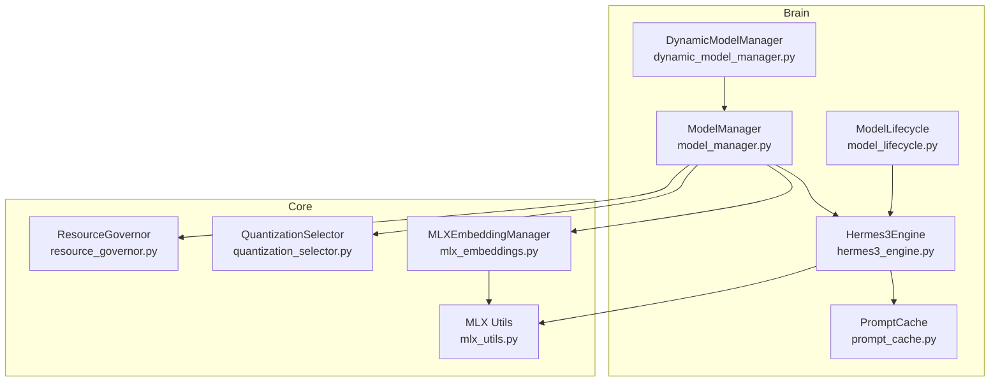
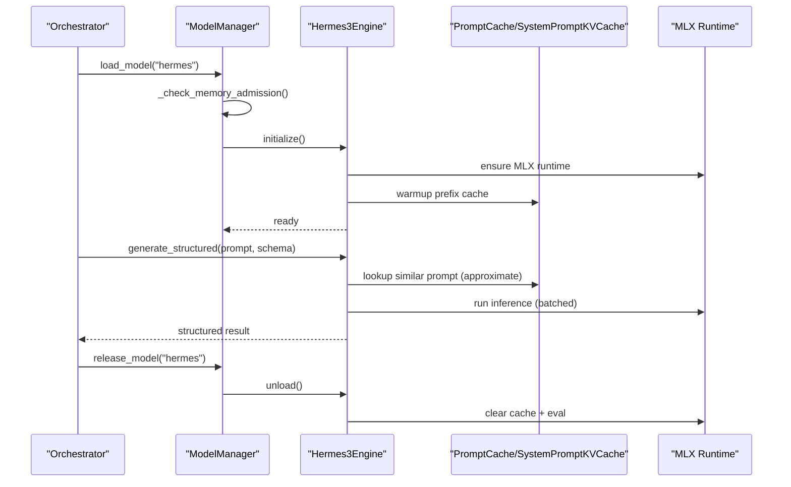
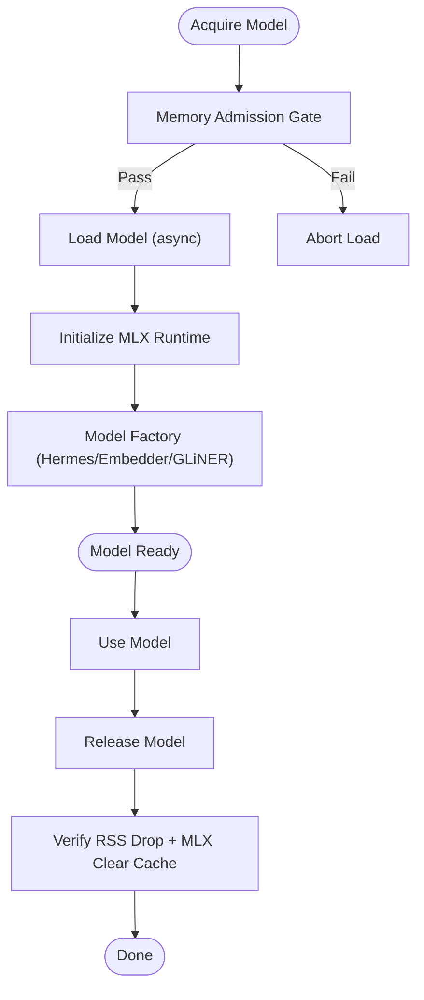
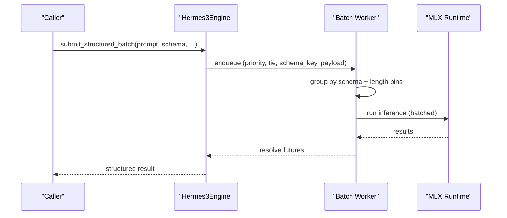
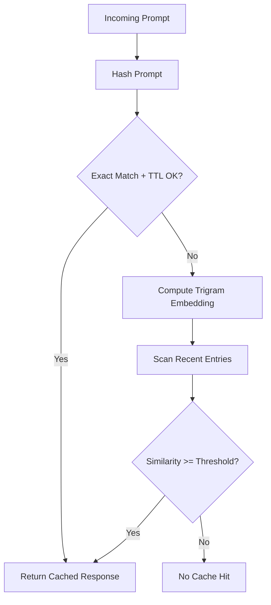
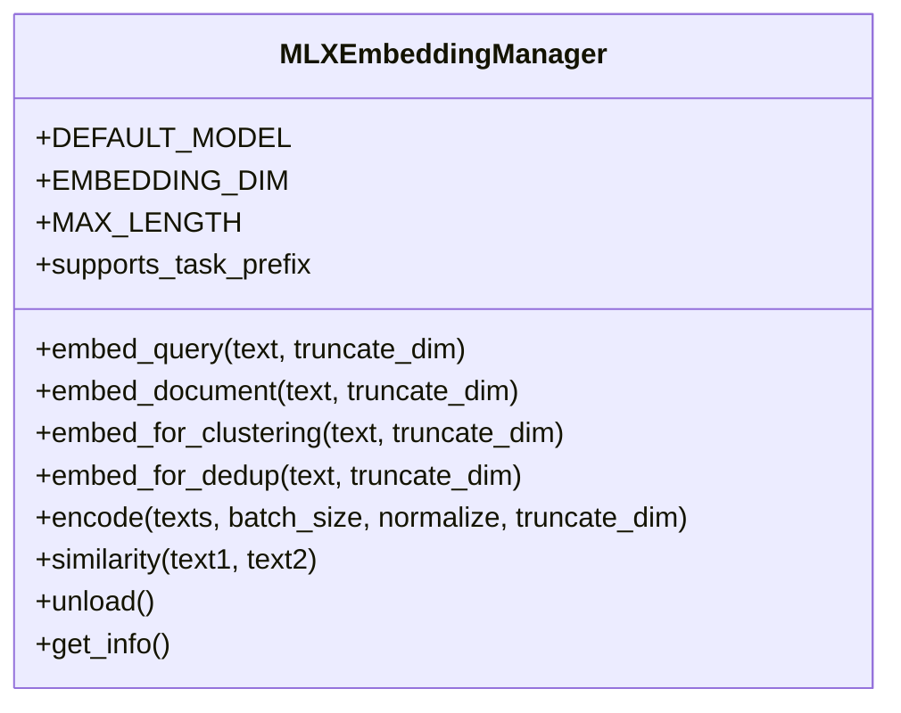
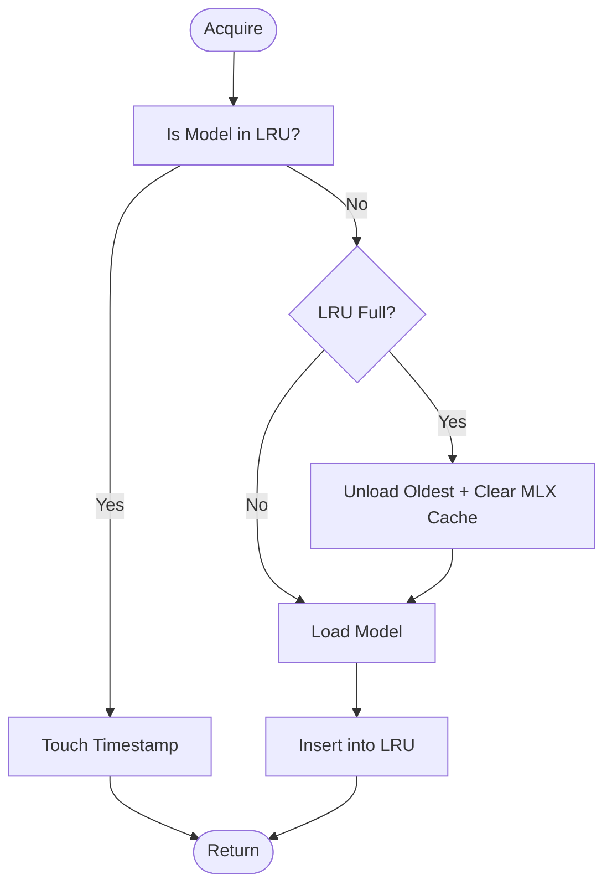
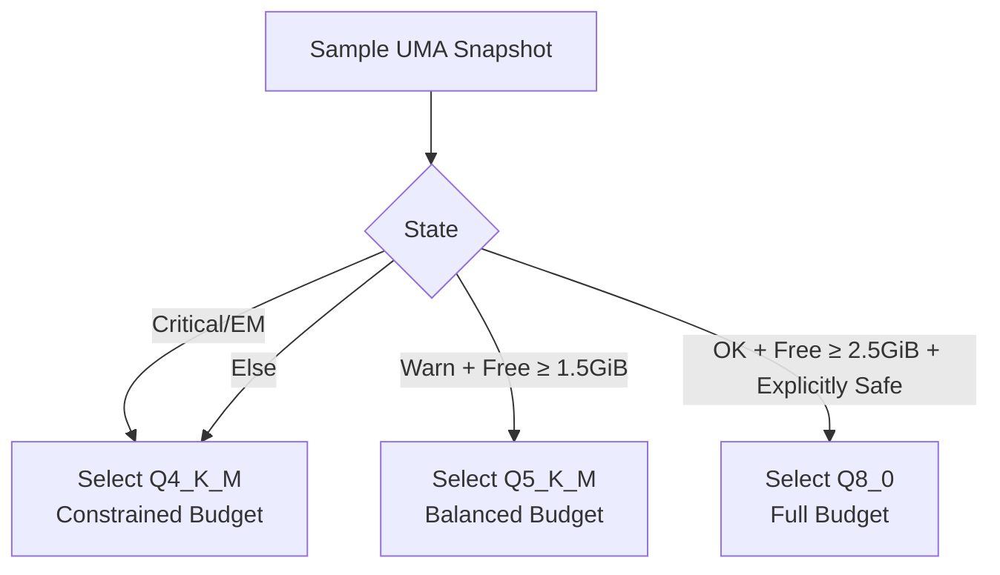
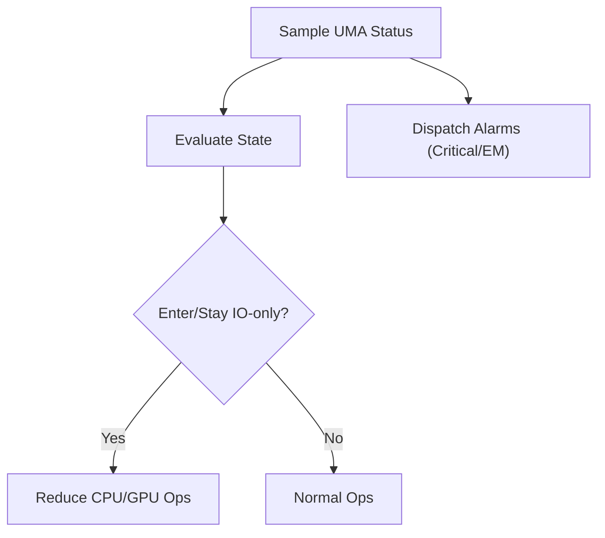
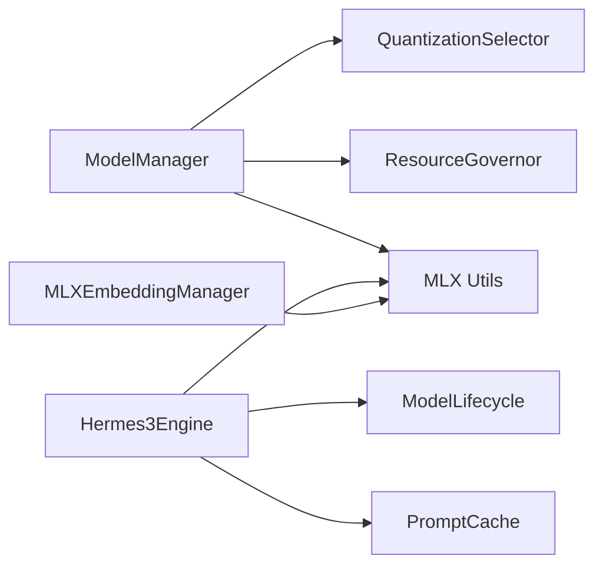

# AI/ML and Brain System

<cite>
**Referenced Files in This Document**
- [hermes3_engine.py](file://brain/hermes3_engine.py)
- [model_manager.py](file://brain/model_manager.py)
- [dynamic_model_manager.py](file://brain/dynamic_model_manager.py)
- [prompt_cache.py](file://brain/prompt_cache.py)
- [mlx_embeddings.py](file://core/mlx_embeddings.py)
- [mlx_utils.py](file://utils/mlx_utils.py)
- [quantization_selector.py](file://brain/quantization_selector.py)
- [model_lifecycle.py](file://brain/model_lifecycle.py)
- [resource_governor.py](file://core/resource_governor.py)
</cite>

## Table of Contents
1. [Introduction](#introduction)
2. [Project Structure](#project-structure)
3. [Core Components](#core-components)
4. [Architecture Overview](#architecture-overview)
5. [Detailed Component Analysis](#detailed-component-analysis)
6. [Dependency Analysis](#dependency-analysis)
7. [Performance Considerations](#performance-considerations)
8. [Troubleshooting Guide](#troubleshooting-guide)
9. [Conclusion](#conclusion)

## Introduction
This document explains the AI/ML and brain system powering Hledac Universal’s decision-making, inference, and memory management on Apple Silicon. It covers:
- Model management architecture and lifecycle
- Hermes3 engine implementation and structured generation
- MLX-based inference optimization and memory management
- Prompt cache and system prompt KV cache
- Embedding generation with ModernBERT via MLX
- Dynamic model loading and memory guards
- Configuration, inference parameters, and resource allocation
- Security, validation, and update procedures

## Project Structure
The AI/ML brain system is organized around three pillars:
- Model orchestration and lifecycle: brain/model_manager.py, brain/dynamic_model_manager.py, brain/model_lifecycle.py
- Inference engines: brain/hermes3_engine.py (LLM), core/mlx_embeddings.py (embeddings)
- Resource governance and memory safety: core/resource_governor.py, brain/quantization_selector.py, utils/mlx_utils.py, brain/prompt_cache.py

**Diagram sources**
- [model_manager.py](file://brain/model_manager.py)
- [dynamic_model_manager.py](file://brain/dynamic_model_manager.py)
- [hermes3_engine.py](file://brain/hermes3_engine.py)
- [prompt_cache.py](file://brain/prompt_cache.py)
- [mlx_embeddings.py](file://core/mlx_embeddings.py)
- [resource_governor.py](file://core/resource_governor.py)
- [quantization_selector.py](file://brain/quantization_selector.py)
- [mlx_utils.py](file://utils/mlx_utils.py)
- [model_lifecycle.py](file://brain/model_lifecycle.py)

**Section sources**
- [model_manager.py](file://brain/model_manager.py)
- [dynamic_model_manager.py](file://brain/dynamic_model_manager.py)
- [hermes3_engine.py](file://brain/hermes3_engine.py)
- [prompt_cache.py](file://brain/prompt_cache.py)
- [mlx_embeddings.py](file://core/mlx_embeddings.py)
- [resource_governor.py](file://core/resource_governor.py)
- [quantization_selector.py](file://brain/quantization_selector.py)
- [mlx_utils.py](file://utils/mlx_utils.py)
- [model_lifecycle.py](file://brain/model_lifecycle.py)

## Core Components
- ModelManager: Centralized, single-model-at-a-time lifecycle with memory guards, MLX initialization, and model-specific factories for Hermes3, ModernBERT, and GLiNER.
- DynamicModelManager: LRU-based dynamic loading with idle timeouts and thrash prevention.
- Hermes3Engine: ChatML-based LLM engine with continuous batching, structured generation via outlines, KV cache, and MLX memory management helpers.
- MLXEmbeddingManager: ModernBERT-based embeddings via MLX with task-aware prefixing, normalization, and Matryoshka truncation.
- PromptCache: Trigram-based approximate prompt cache with TTL and similarity scoring; SystemPromptKVCache provides token-prefix caching for repeated system prompts.
- QuantizationSelector: Advisory quantization and inference budget selection based on UMA snapshots.
- ResourceGovernor: Unified UMA state machine with hysteresis, IO-only gating, and async alarm dispatch.
- ModelLifecycle: Emergency unload seam, MLX lazy init helper, and structured generation sidecar.

**Section sources**
- [model_manager.py](file://brain/model_manager.py)
- [dynamic_model_manager.py](file://brain/dynamic_model_manager.py)
- [hermes3_engine.py](file://brain/hermes3_engine.py)
- [mlx_embeddings.py](file://core/mlx_embeddings.py)
- [prompt_cache.py](file://brain/prompt_cache.py)
- [quantization_selector.py](file://brain/quantization_selector.py)
- [resource_governor.py](file://core/resource_governor.py)
- [model_lifecycle.py](file://brain/model_lifecycle.py)

## Architecture Overview
The system enforces strict memory and concurrency constraints on M1 8GB devices:
- Only one large model is held in RAM at a time, with fail-fast admission gates and soft cache clears.
- MLX runtime is lazily initialized and managed centrally to avoid fragmentation.
- Hermes3 uses continuous batching and structured generation with outlines, guarded by quantization budgets and emergency unload.
- Embeddings are generated via ModernBERT on MLX with task-aware normalization and optional Matryoshka truncation.

**Diagram sources**
- [model_manager.py](file://brain/model_manager.py)
- [hermes3_engine.py](file://brain/hermes3_engine.py)
- [prompt_cache.py](file://brain/prompt_cache.py)
- [mlx_utils.py](file://utils/mlx_utils.py)

## Detailed Component Analysis

### Model Management and Lifecycle
- Single-model-at-a-time policy prevents OOM on M1 8GB. Memory admission gates and RSS checks occur before load; cleanup verifies memory drop.
- MLX runtime is initialized via a canonical authority; cache clearing and eval are throttled to reduce overhead.
- Emergency unload seam allows watchdog-triggered graceful shutdown of inference workers and cache eviction.

**Diagram sources**
- [model_manager.py](file://brain/model_manager.py)
- [model_lifecycle.py](file://brain/model_lifecycle.py)
- [mlx_utils.py](file://utils/mlx_utils.py)

**Section sources**
- [model_manager.py](file://brain/model_manager.py)
- [model_lifecycle.py](file://brain/model_lifecycle.py)
- [mlx_utils.py](file://utils/mlx_utils.py)

### Hermes3 Engine: LLM Inference and Structured Generation
- ChatML formatting, system prompt caching, and outlines-based grammar-constrained decoding.
- Continuous batching with schema-aware segregation, length binning, and adaptive flush intervals.
- MLX memory management helpers for safe eval and cache clearing; emergency unload integration.

**Diagram sources**
- [hermes3_engine.py](file://brain/hermes3_engine.py)

**Section sources**
- [hermes3_engine.py](file://brain/hermes3_engine.py)

### Prompt Cache and System Prompt KV Cache
- PromptCache stores prompt-response pairs with TTL and approximate similarity using trigram embeddings and cosine similarity.
- SystemPromptKVCache caches tokenized system prompts for repeated synthesis, avoiding re-tokenization.

**Diagram sources**
- [prompt_cache.py](file://brain/prompt_cache.py)

**Section sources**
- [prompt_cache.py](file://brain/prompt_cache.py)

### Embedding Generation with ModernBERT (MLX)
- MLXEmbeddingManager loads ModernBERT via mlx-embeddings, supports task-aware prefixes, normalization, and Matryoshka truncation.
- Batched encoding with Metal buffer scoping and immediate release to minimize peak memory on M1 8GB.

**Diagram sources**
- [mlx_embeddings.py](file://core/mlx_embeddings.py)

**Section sources**
- [mlx_embeddings.py](file://core/mlx_embeddings.py)

### Dynamic Model Loading and Thrash Prevention
- LRU cache with idle timeouts and minimum reload intervals prevents thrash.
- Background cleanup loop evicts least-recently-used models and clears MLX cache.

**Diagram sources**
- [dynamic_model_manager.py](file://brain/dynamic_model_manager.py)

**Section sources**
- [dynamic_model_manager.py](file://brain/dynamic_model_manager.py)

### Quantization and Inference Budget Selection
- QuantizationSelector advises quantization tiers (Q4_K_M/Q5_K_M/Q8_0) and inference budgets based on UMA snapshots.
- Fallback to Q4_K_M on errors; explicit safety required for Q8_0.

**Diagram sources**
- [quantization_selector.py](file://brain/quantization_selector.py)

**Section sources**
- [quantization_selector.py](file://brain/quantization_selector.py)

### Resource Governance and Safety
- ResourceGovernor evaluates unified UMA state with hysteresis, IO-only gating, and async alarm dispatch.
- Thread-QoS hints and thermal guards complement MLX memory controls.

**Diagram sources**
- [resource_governor.py](file://core/resource_governor.py)

**Section sources**
- [resource_governor.py](file://core/resource_governor.py)

## Dependency Analysis
Key relationships:
- ModelManager depends on QuantizationSelector and ResourceGovernor for admission decisions and on MLX utilities for runtime initialization and cleanup.
- Hermes3Engine depends on ModelLifecycle for emergency unload and on MLX utilities for safe eval/clear.
- MLXEmbeddingManager depends on MLX utilities for Metal buffer scoping and cache clearing.
- PromptCache is used by Hermes3Engine to reduce repeated tokenization costs.

**Diagram sources**
- [model_manager.py](file://brain/model_manager.py)
- [quantization_selector.py](file://brain/quantization_selector.py)
- [resource_governor.py](file://core/resource_governor.py)
- [mlx_utils.py](file://utils/mlx_utils.py)
- [hermes3_engine.py](file://brain/hermes3_engine.py)
- [prompt_cache.py](file://brain/prompt_cache.py)
- [mlx_embeddings.py](file://core/mlx_embeddings.py)
- [model_lifecycle.py](file://brain/model_lifecycle.py)

**Section sources**
- [model_manager.py](file://brain/model_manager.py)
- [quantization_selector.py](file://brain/quantization_selector.py)
- [resource_governor.py](file://core/resource_governor.py)
- [mlx_utils.py](file://utils/mlx_utils.py)
- [hermes3_engine.py](file://brain/hermes3_engine.py)
- [prompt_cache.py](file://brain/prompt_cache.py)
- [mlx_embeddings.py](file://core/mlx_embeddings.py)
- [model_lifecycle.py](file://brain/model_lifecycle.py)

## Performance Considerations
- Concurrency and batching: Hermes3Engine uses continuous batching with schema-aware grouping and adaptive flush intervals to maximize GPU utilization while avoiding mixed-batch parsing overhead.
- Memory pressure mitigation: ModelManager and ModelLifecycle enforce strict admission gates and cleanup routines; MLX utilities throttle eval and clear cache to reduce fragmentation.
- Embedding throughput: MLXEmbeddingManager uses batched encoding, Metal buffer scoping, and immediate tensor release to minimize peak memory on M1 8GB.
- Prompt reuse: PromptCache and SystemPromptKVCache reduce tokenization overhead for repeated prompts and system messages.
- Quantization budgets: QuantizationSelector dynamically selects quantization and token/latency budgets to balance quality and resource usage.

[No sources needed since this section provides general guidance]

## Troubleshooting Guide
Common issues and remedies:
- OOM during model load: Admission gates and RSS checks should prevent loads when memory is low; verify ResourceGovernor state and consider lowering concurrency or enabling IO-only mode.
- MLX cache leaks: Use MLX utilities’ eval and clear cache helpers or rely on ModelLifecycle’s cleanup; ensure Metal buffers are scoped and released promptly.
- Structured generation failures: Hermes3Engine shards failed batches and retries items individually; check outlines availability and schema compatibility.
- Emergency unload: If watchdog triggers, consume the emergency flag via ModelLifecycle and ensure batch worker shutdown and cache eviction complete before clearing the flag.

**Section sources**
- [model_manager.py](file://brain/model_manager.py)
- [model_lifecycle.py](file://brain/model_lifecycle.py)
- [mlx_utils.py](file://utils/mlx_utils.py)
- [hermes3_engine.py](file://brain/hermes3_engine.py)

## Conclusion
Hledac Universal’s AI/ML and brain system is designed for constrained Apple Silicon environments. It combines strict model lifecycle management, MLX-centric memory optimization, continuous batching, and adaptive quantization to deliver reliable, high-throughput inference. The prompt cache and embedding pipeline further reduce latency and resource usage. Together, these components provide a robust foundation for decision-making, synthesis, and retrieval tasks on M1 8GB devices.