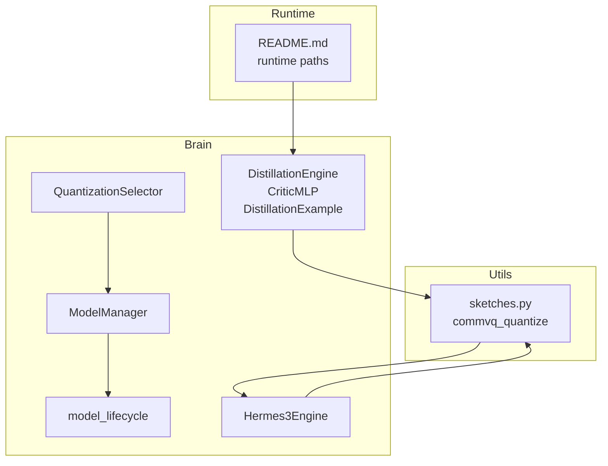
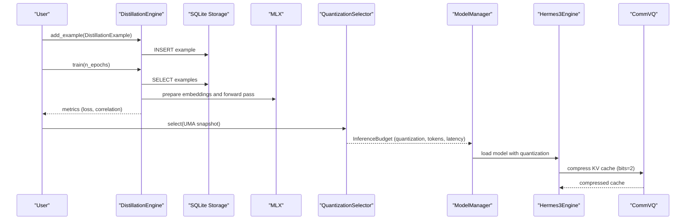
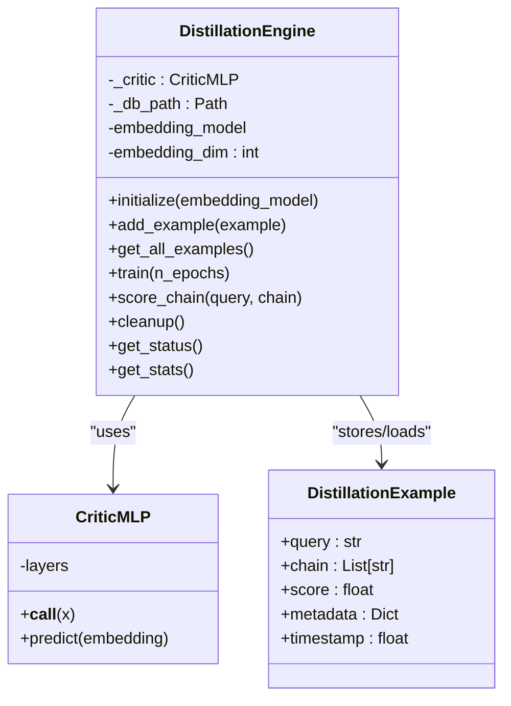
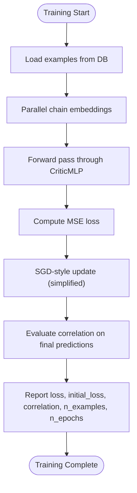
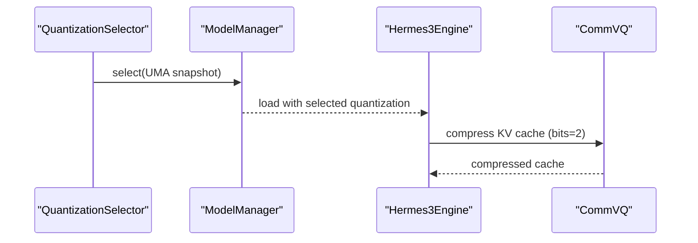
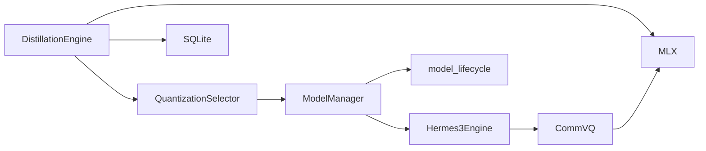

# Distillation Engine

<cite>
**Referenced Files in This Document**
- [distillation_engine.py](file://brain/distillation_engine.py)
- [quantization_selector.py](file://brain/quantization_selector.py)
- [sketches.py](file://utils/sketches.py)
- [model_manager.py](file://brain/model_manager.py)
- [model_lifecycle.py](file://brain/model_lifecycle.py)
- [hermes3_engine.py](file://brain/hermes3_engine.py)
- [README.md](file://README.md)
</cite>

## Table of Contents
1. [Introduction](#introduction)
2. [Project Structure](#project-structure)
3. [Core Components](#core-components)
4. [Architecture Overview](#architecture-overview)
5. [Detailed Component Analysis](#detailed-component-analysis)
6. [Dependency Analysis](#dependency-analysis)
7. [Performance Considerations](#performance-considerations)
8. [Troubleshooting Guide](#troubleshooting-guide)
9. [Conclusion](#conclusion)
10. [Appendices](#appendices)

## Introduction
This document describes the Distillation Engine responsible for knowledge transfer and model compression within the Hledac Universal runtime. It focuses on:
- Knowledge transfer via a critic network that learns to score reasoning chains
- Teacher-student inspired scoring where human-labeled quality scores guide the critic’s training
- Parameter reduction strategies including quantization and KV-cache compression
- Knowledge preservation mechanisms through loss function design and accuracy maintenance
- Training pipeline, data preparation, evaluation metrics, and deployment optimization for resource-constrained environments

## Project Structure
The Distillation Engine resides in the brain module and integrates with quantization utilities and model lifecycle management. The runtime data locations are managed under a self-contained runtime directory.

**Diagram sources**
- [distillation_engine.py:183-867](file://brain/distillation_engine.py#L183-L867)
- [quantization_selector.py:117-234](file://brain/quantization_selector.py#L117-L234)
- [sketches.py:300-413](file://utils/sketches.py#L300-L413)
- [model_manager.py:655-852](file://brain/model_manager.py#L655-L852)
- [model_lifecycle.py:235-275](file://brain/model_lifecycle.py#L235-L275)
- [hermes3_engine.py:1932-1963](file://brain/hermes3_engine.py#L1932-L1963)
- [README.md:1-48](file://README.md#L1-L48)

**Section sources**
- [README.md:1-48](file://README.md#L1-L48)

## Core Components
- DistillationEngine: Implements a critic network to score reasoning chains, manages training on labeled examples, and provides scoring for new chains. It supports SQLite-backed storage of examples and optional fallback heuristics when MLX is unavailable.
- CriticMLP: An MLP-based critic network with ReLU hidden layers and a sigmoid output for normalized scores.
- DistillationExample: Dataclass representing a training example with query, chain steps, and human-assigned score.
- QuantizationSelector: Advisory layer that selects quantization and inference budget based on UMA snapshots.
- CommVQ Quantization Utilities: Group-wise k-means quantization for KV caches using MLX.
- ModelManager and model_lifecycle: Orchestrate model loads/unloads and track selected quantization.

**Section sources**
- [distillation_engine.py:51-98](file://brain/distillation_engine.py#L51-L98)
- [distillation_engine.py:100-154](file://brain/distillation_engine.py#L100-L154)
- [distillation_engine.py:183-867](file://brain/distillation_engine.py#L183-L867)
- [quantization_selector.py:117-234](file://brain/quantization_selector.py#L117-L234)
- [sketches.py:300-413](file://utils/sketches.py#L300-L413)
- [model_manager.py:178-200](file://brain/model_manager.py#L178-L200)
- [model_lifecycle.py:235-275](file://brain/model_lifecycle.py#L235-L275)

## Architecture Overview
The Distillation Engine participates in two complementary pipelines:
- Knowledge Transfer Pipeline: Collects human-labeled examples, trains a critic network, and uses it to score reasoning chains.
- Model Compression Pipeline: Applies quantization and KV-cache compression to reduce memory footprint and improve throughput on constrained devices.

**Diagram sources**
- [distillation_engine.py:287-466](file://brain/distillation_engine.py#L287-L466)
- [quantization_selector.py:129-227](file://brain/quantization_selector.py#L129-L227)
- [model_manager.py:655-675](file://brain/model_manager.py#L655-L675)
- [hermes3_engine.py:1932-1963](file://brain/hermes3_engine.py#L1932-L1963)
- [sketches.py:300-413](file://utils/sketches.py#L300-L413)

## Detailed Component Analysis

### DistillationEngine
- Purpose: Train a critic network to assess reasoning chain quality and score new chains.
- Data Preparation: Embeds chains into fixed-dimensional vectors using an embedding model or a fallback mechanism. Normalizes embeddings to unit norm.
- Training: Uses a simple SGD-style loop with MSE loss on predicted vs. ground-truth scores. Computes correlation as a proxy accuracy metric.
- Scoring: Predicts a scalar score per chain; falls back to heuristic scoring when MLX is unavailable.
- Persistence: Stores examples in SQLite with JSON-serialized chain and metadata; maintains an index on timestamps.

**Diagram sources**
- [distillation_engine.py:183-867](file://brain/distillation_engine.py#L183-L867)
- [distillation_engine.py:100-154](file://brain/distillation_engine.py#L100-L154)
- [distillation_engine.py:51-98](file://brain/distillation_engine.py#L51-L98)

**Section sources**
- [distillation_engine.py:183-867](file://brain/distillation_engine.py#L183-L867)

### Knowledge Preservation and Accuracy Maintenance
- Loss Function Design: MSE loss between predicted and ground-truth scores encourages the critic to learn a continuous quality metric aligned with human labels.
- Accuracy Metric: Correlation between predictions and actual scores provides a sanity check for training progress.
- Fallback Mechanism: When MLX is unavailable, heuristic scoring ensures the system remains functional, mitigating knowledge loss.

**Diagram sources**
- [distillation_engine.py:372-466](file://brain/distillation_engine.py#L372-L466)

**Section sources**
- [distillation_engine.py:372-466](file://brain/distillation_engine.py#L372-L466)

### Model Compression Methods
- Quantization Selection: QuantizationSelector chooses among Q4_K_M, Q5_K_M, and Q8_0 based on free UMA and governor decisions, with strict fallbacks.
- KV Cache Compression: CommVQ applies group-wise k-means quantization to KV caches, achieving significant memory savings with minimal fidelity loss.
- Integration: ModelManager coordinates model loads with quantization selection; Hermes3Engine compresses KV cache when context exceeds thresholds.

**Diagram sources**
- [quantization_selector.py:129-227](file://brain/quantization_selector.py#L129-L227)
- [model_manager.py:655-675](file://brain/model_manager.py#L655-L675)
- [hermes3_engine.py:1932-1963](file://brain/hermes3_engine.py#L1932-L1963)
- [sketches.py:300-413](file://utils/sketches.py#L300-L413)

**Section sources**
- [quantization_selector.py:117-234](file://brain/quantization_selector.py#L117-L234)
- [sketches.py:300-413](file://utils/sketches.py#L300-L413)
- [model_manager.py:655-675](file://brain/model_manager.py#L655-L675)
- [model_lifecycle.py:235-275](file://brain/model_lifecycle.py#L235-L275)
- [hermes3_engine.py:1932-1963](file://brain/hermes3_engine.py#L1932-L1963)

### Training Pipeline, Data Preparation, and Evaluation
- Data Preparation: Chains are embedded using either a provided embedding model (mean pooling across steps) or a fallback bag-of-char embedding. Embeddings are normalized and padded/truncated to the configured dimension.
- Training: Embeddings are prepared asynchronously using a thread pool; the critic is trained with a simple loop and reported metrics include loss and correlation.
- Evaluation: Correlation between predictions and actual scores is computed; statistics on stored examples are available via get_stats.

**Section sources**
- [distillation_engine.py:499-567](file://brain/distillation_engine.py#L499-L567)
- [distillation_engine.py:372-466](file://brain/distillation_engine.py#L372-L466)
- [distillation_engine.py:662-694](file://brain/distillation_engine.py#L662-L694)

### Deployment Optimization Strategies
- Quantization Tiers:
  - Q4_K_M: Default, suitable for CRITICAL/EMERGENCY or low-memory conditions
  - Q5_K_M: Balanced option when sufficient free UMA is available
  - Q8_0: Full precision only when explicitly safe and ample free UMA
- KV Cache Compression: Applied automatically when context length exceeds thresholds, reducing memory footprint.
- Memory Governance: ModelManager enforces a strict one-model-at-a-time policy and validates RSS before/after loads/unloads.

**Section sources**
- [quantization_selector.py:138-227](file://brain/quantization_selector.py#L138-L227)
- [model_manager.py:61-107](file://brain/model_manager.py#L61-L107)
- [model_manager.py:831-852](file://brain/model_manager.py#L831-L852)
- [hermes3_engine.py:1932-1963](file://brain/hermes3_engine.py#L1932-L1963)

## Dependency Analysis
The Distillation Engine depends on MLX for numerical operations and SQLite for persistence. Compression relies on CommVQ utilities and is orchestrated by QuantizationSelector and ModelManager.

**Diagram sources**
- [distillation_engine.py:38-49](file://brain/distillation_engine.py#L38-L49)
- [quantization_selector.py:117-234](file://brain/quantization_selector.py#L117-L234)
- [model_manager.py:655-675](file://brain/model_manager.py#L655-L675)
- [model_lifecycle.py:235-275](file://brain/model_lifecycle.py#L235-L275)
- [hermes3_engine.py:1932-1963](file://brain/hermes3_engine.py#L1932-L1963)
- [sketches.py:300-413](file://utils/sketches.py#L300-L413)

**Section sources**
- [distillation_engine.py:38-49](file://brain/distillation_engine.py#L38-L49)
- [quantization_selector.py:117-234](file://brain/quantization_selector.py#L117-L234)
- [model_manager.py:655-675](file://brain/model_manager.py#L655-L675)
- [model_lifecycle.py:235-275](file://brain/model_lifecycle.py#L235-L275)
- [hermes3_engine.py:1932-1963](file://brain/hermes3_engine.py#L1932-L1963)
- [sketches.py:300-413](file://utils/sketches.py#L300-L413)

## Performance Considerations
- Memory-Constrained Training: The critic architecture and training loop are designed for M1 8GB constraints, with simplified SGD and reduced hidden dimensions.
- Asynchronous Embedding: Parallel embedding computation offloads CPU-bound work while keeping MLX operations efficient.
- KV Cache Compression: CommVQ achieves substantial memory savings with minimal fidelity impact, improving throughput on constrained devices.
- Quantization Tiers: Dynamic selection balances quality and resource usage based on current UMA conditions.

[No sources needed since this section provides general guidance]

## Troubleshooting Guide
- MLX Not Available: The engine logs warnings and falls back to heuristic scoring. Ensure MLX is installed and accessible.
- Insufficient Examples: Training requires at least two examples; otherwise, it returns neutral metrics.
- Database Issues: SQLite initialization and transactions are wrapped in context managers to prevent file descriptor leaks.
- Quantization Denial: If the governor denies model load, ModelManager raises an error; verify UMA state and free memory.

**Section sources**
- [distillation_engine.py:48-49](file://brain/distillation_engine.py#L48-L49)
- [distillation_engine.py:393-395](file://brain/distillation_engine.py#L393-L395)
- [model_manager.py:664-667](file://brain/model_manager.py#L664-L667)

## Conclusion
The Distillation Engine provides a practical framework for knowledge transfer through critic learning and integrates seamlessly with quantization and KV-cache compression strategies. By combining robust training metrics, fallback mechanisms, and adaptive quantization, it enables reliable operation on resource-constrained platforms while preserving model quality and performance.

[No sources needed since this section summarizes without analyzing specific files]

## Appendices

### Configuration Parameters
- DistillationEngine
  - embedding_dim: Dimension of the embedding vector (default tuned for modern BERT-base)
  - MAX_CHAIN_LENGTH: Maximum number of steps considered for scoring
  - SQLite DB path: Defaults to runtime directory under EVIDENCE_ROOT
- QuantizationSelector
  - Thresholds: Free UMA thresholds for Q5_K_M and Q8_0
  - InferenceBudget: max_tokens, max_latency_ms, quantization, reason
- CommVQ
  - bits: Compression bits (default 2 for 87.5% theoretical savings)
  - group_size: M1-optimized grouping for k-means

**Section sources**
- [distillation_engine.py:201-202](file://brain/distillation_engine.py#L201-L202)
- [quantization_selector.py:44-48](file://brain/quantization_selector.py#L44-L48)
- [quantization_selector.py:52-58](file://brain/quantization_selector.py#L52-L58)
- [sketches.py:367-368](file://utils/sketches.py#L367-L368)

### Example Workflows
- Distillation Workflow
  - Prepare examples with human-assigned scores
  - Train the critic and monitor correlation
  - Score new reasoning chains for downstream use
- Compression Workflow
  - Select quantization based on UMA snapshot
  - Load model with chosen quantization
  - Compress KV cache when context exceeds thresholds

**Section sources**
- [distillation_engine.py:287-466](file://brain/distillation_engine.py#L287-L466)
- [quantization_selector.py:129-227](file://brain/quantization_selector.py#L129-L227)
- [model_manager.py:655-675](file://brain/model_manager.py#L655-L675)
- [hermes3_engine.py:1932-1963](file://brain/hermes3_engine.py#L1932-L1963)