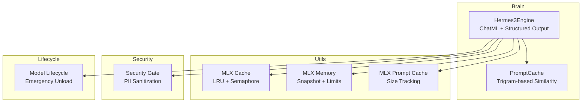
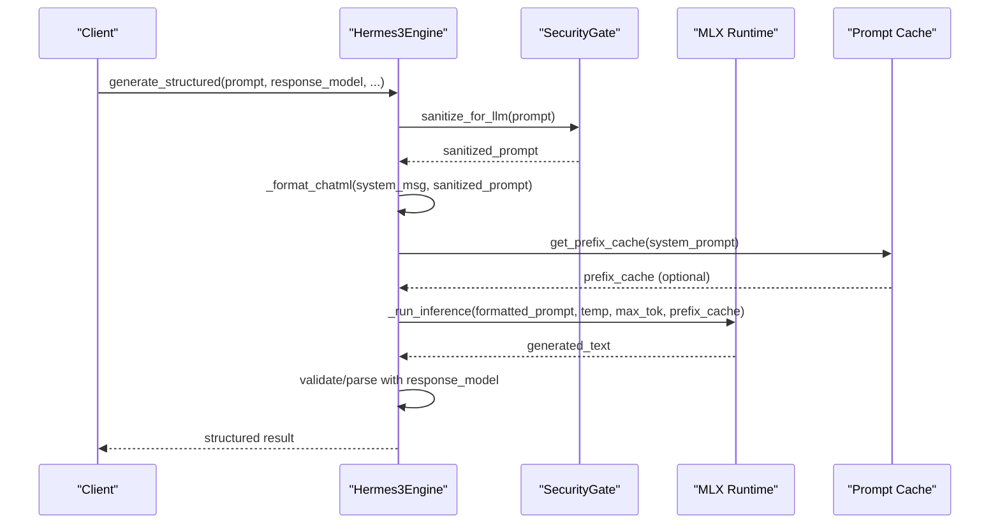
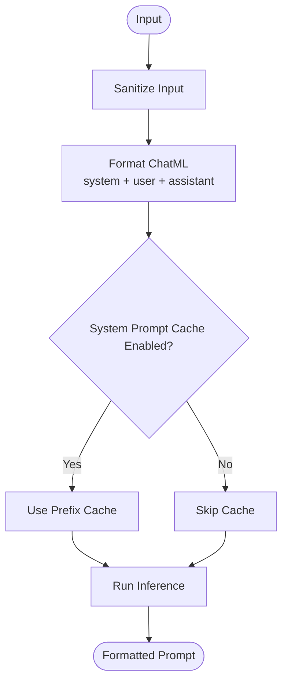
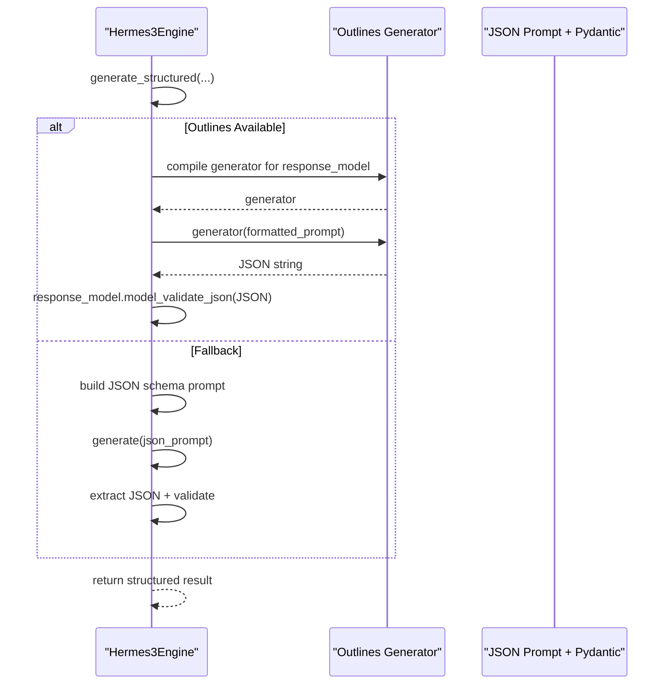
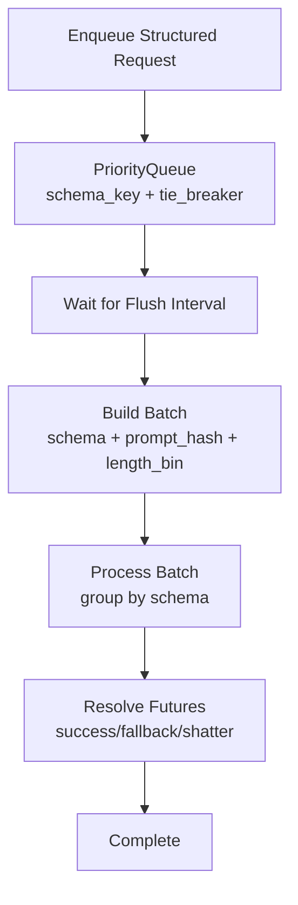
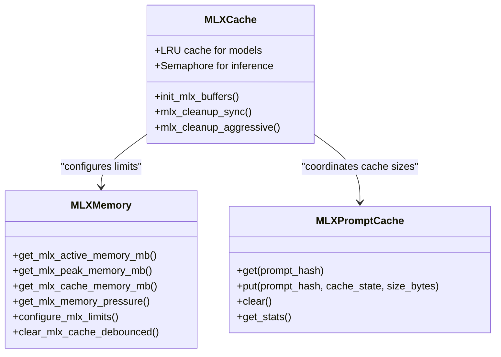
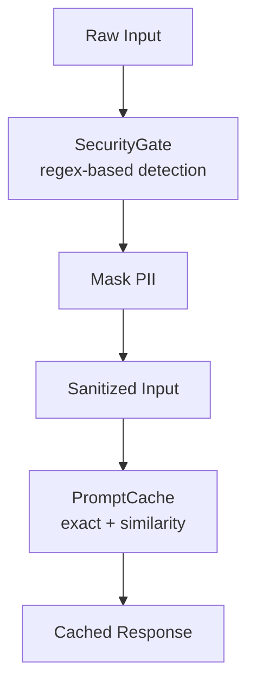
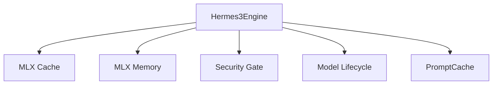

# Hermes3 Engine

<cite>
**Referenced Files in This Document**
- [hermes3_engine.py](file://brain/hermes3_engine.py)
- [mlx_cache.py](file://utils/mlx_cache.py)
- [mlx_memory.py](file://utils/mlx_memory.py)
- [mlx_prompt_cache.py](file://utils/mlx_prompt_cache.py)
- [prompt_cache.py](file://brain/prompt_cache.py)
- [model_lifecycle.py](file://brain/model_lifecycle.py)
- [pii_gate.py](file://security/pii_gate.py)
</cite>

## Table of Contents
1. [Introduction](#introduction)
2. [Project Structure](#project-structure)
3. [Core Components](#core-components)
4. [Architecture Overview](#architecture-overview)
5. [Detailed Component Analysis](#detailed-component-analysis)
6. [Dependency Analysis](#dependency-analysis)
7. [Performance Considerations](#performance-considerations)
8. [Troubleshooting Guide](#troubleshooting-guide)
9. [Conclusion](#conclusion)

## Introduction
Hermes3Engine is the canonical implementation for decision-making and orchestration using the Hermes-3 model. It integrates ChatML formatting, structured output generation via Pydantic models, and continuous batching with schema-aware prioritization. The engine emphasizes memory management on Apple Silicon through MLX integration, GPU memory tracking, and cache optimization strategies. It also provides security features including input sanitization, grammar-constrained decoding with outlines, and prompt caching mechanisms. Configuration parameters for model paths, temperature settings, token limits, and context windows are exposed through a dedicated configuration class.

## Project Structure
The Hermes3Engine resides in the brain module and coordinates with several supporting utilities:
- Brain-level orchestration and inference logic
- MLX utilities for memory management and cache
- Security utilities for input sanitization
- Lifecycle management for emergency unload handling

**Diagram sources**
- [hermes3_engine.py](file://brain/hermes3_engine.py)
- [mlx_cache.py](file://utils/mlx_cache.py)
- [mlx_memory.py](file://utils/mlx_memory.py)
- [mlx_prompt_cache.py](file://utils/mlx_prompt_cache.py)
- [prompt_cache.py](file://brain/prompt_cache.py)
- [model_lifecycle.py](file://brain/model_lifecycle.py)
- [pii_gate.py](file://security/pii_gate.py)

**Section sources**
- [hermes3_engine.py](file://brain/hermes3_engine.py)
- [mlx_cache.py](file://utils/mlx_cache.py)
- [mlx_memory.py](file://utils/mlx_memory.py)
- [mlx_prompt_cache.py](file://utils/mlx_prompt_cache.py)
- [prompt_cache.py](file://brain/prompt_cache.py)
- [model_lifecycle.py](file://brain/model_lifecycle.py)
- [pii_gate.py](file://security/pii_gate.py)

## Core Components
- ChatML formatting system for structured prompts
- Structured output generation using Pydantic models with outlines-backed grammar-constrained decoding
- Continuous batching with schema-aware prioritization and adaptive flush intervals
- Memory management with MLX integration, GPU memory tracking, and cache optimization
- Security features including input sanitization and prompt caching
- Configuration parameters for model paths, temperature, tokens, and context windows

**Section sources**
- [hermes3_engine.py](file://brain/hermes3_engine.py)
- [mlx_cache.py](file://utils/mlx_cache.py)
- [mlx_memory.py](file://utils/mlx_memory.py)
- [mlx_prompt_cache.py](file://utils/mlx_prompt_cache.py)
- [prompt_cache.py](file://brain/prompt_cache.py)
- [model_lifecycle.py](file://brain/model_lifecycle.py)
- [pii_gate.py](file://security/pii_gate.py)

## Architecture Overview
The engine orchestrates inference through a structured pipeline:
- Input sanitization via SecurityGate
- ChatML formatting and optional system prompt caching
- Structured generation using outlines or JSON prompting with Pydantic validation
- Continuous batching with schema segregation and adaptive flushing
- Memory hygiene with MLX cache limits and GPU memory tracking

**Diagram sources**
- [hermes3_engine.py](file://brain/hermes3_engine.py)
- [pii_gate.py](file://security/pii_gate.py)

## Detailed Component Analysis

### ChatML Formatting System
The engine formats prompts using the ChatML convention, enabling structured conversations with system, user, and assistant roles. It supports optional system prompt caching to accelerate repeated synthesis with the same system prompt.

**Diagram sources**
- [hermes3_engine.py](file://brain/hermes3_engine.py)

**Section sources**
- [hermes3_engine.py](file://brain/hermes3_engine.py)

### Structured Output Generation with Pydantic Models
The engine supports structured generation through multiple paths:
- Outlines-backed grammar-constrained decoding when available
- JSON prompting with Pydantic validation and retry logic
- Fallback to default field construction on failure

**Diagram sources**
- [hermes3_engine.py](file://brain/hermes3_engine.py)

**Section sources**
- [hermes3_engine.py](file://brain/hermes3_engine.py)

### Continuous Batching with Schema-Aware Prioritization
The engine implements a continuous batching system that:
- Segregates items by schema type to maintain compatibility
- Enforces system prompt and length bin boundaries to prevent padding waste
- Adapts flush intervals based on queue depth (high/medium/default)
- Ages out low-priority items to prevent starvation

**Diagram sources**
- [hermes3_engine.py](file://brain/hermes3_engine.py)

**Section sources**
- [hermes3_engine.py](file://brain/hermes3_engine.py)

### Memory Management with MLX Integration
Memory management focuses on Apple Silicon constraints:
- Metal memory limits configured to 2.5 GiB cache and wired limits
- GPU memory tracking via MLX snapshots and pressure calculation
- Cache optimization including KV cache compression and pruning
- Safe cleanup sequences with mx.eval barriers and Metal cache clearing

**Diagram sources**
- [mlx_cache.py](file://utils/mlx_cache.py)
- [mlx_memory.py](file://utils/mlx_memory.py)
- [mlx_prompt_cache.py](file://utils/mlx_prompt_cache.py)

**Section sources**
- [mlx_cache.py](file://utils/mlx_cache.py)
- [mlx_memory.py](file://utils/mlx_memory.py)
- [mlx_prompt_cache.py](file://utils/mlx_prompt_cache.py)

### Security Features
Security is enforced through early input sanitization and prompt caching:
- SecurityGate detects and masks PII using regex patterns with a robust fallback sanitizer
- PromptCache provides approximate similarity-based caching with trigram embeddings
- SystemPromptKVCache offers token-prefix caching for repeated system prompts

**Diagram sources**
- [pii_gate.py](file://security/pii_gate.py)
- [prompt_cache.py](file://brain/prompt_cache.py)

**Section sources**
- [pii_gate.py](file://security/pii_gate.py)
- [prompt_cache.py](file://brain/prompt_cache.py)

### Configuration Parameters
Configuration is centralized in a dedicated class:
- model_path: Path to the Hermes-3 model
- temperature: Sampling temperature for generation
- max_tokens: Maximum tokens to generate
- context_window: Maximum prompt length in characters

**Section sources**
- [hermes3_engine.py](file://brain/hermes3_engine.py)

## Dependency Analysis
The engine integrates multiple subsystems with clear separation of concerns:
- Brain orchestration depends on MLX utilities for memory and cache
- Security utilities provide input sanitization
- Lifecycle management coordinates unload operations and emergency handling

**Diagram sources**
- [hermes3_engine.py](file://brain/hermes3_engine.py)
- [mlx_cache.py](file://utils/mlx_cache.py)
- [mlx_memory.py](file://utils/mlx_memory.py)
- [pii_gate.py](file://security/pii_gate.py)
- [model_lifecycle.py](file://brain/model_lifecycle.py)
- [prompt_cache.py](file://brain/prompt_cache.py)

**Section sources**
- [hermes3_engine.py](file://brain/hermes3_engine.py)
- [mlx_cache.py](file://utils/mlx_cache.py)
- [mlx_memory.py](file://utils/mlx_memory.py)
- [pii_gate.py](file://security/pii_gate.py)
- [model_lifecycle.py](file://brain/model_lifecycle.py)
- [prompt_cache.py](file://brain/prompt_cache.py)

## Performance Considerations
- Continuous batching improves throughput by grouping compatible requests
- Adaptive flush intervals balance latency and throughput under varying load
- KV cache compression and pruning reduce memory footprint on Apple Silicon
- Debounced cache clearing prevents thrashing while maintaining memory hygiene
- Prefix cache warmup accelerates repeated system prompt synthesis

## Troubleshooting Guide
Common issues and resolutions:
- Emergency unload handling: Use the lifecycle module to request and safely clear emergency unload flags
- Memory pressure warnings: Reduce cache limits or enable aggressive cleanup
- Batch rejection under emergency: The engine rejects new batch enqueues when unload is requested
- Structured generation fallback: On failures, the engine constructs results with default fields

**Section sources**
- [model_lifecycle.py](file://brain/model_lifecycle.py)
- [hermes3_engine.py](file://brain/hermes3_engine.py)
- [mlx_memory.py](file://utils/mlx_memory.py)

## Conclusion
Hermes3Engine provides a robust foundation for decision-making and orchestration on Apple Silicon. Its integration of ChatML formatting, structured output generation, continuous batching, and comprehensive memory management enables efficient and safe inference. The security features and lifecycle management further enhance reliability and operational safety.