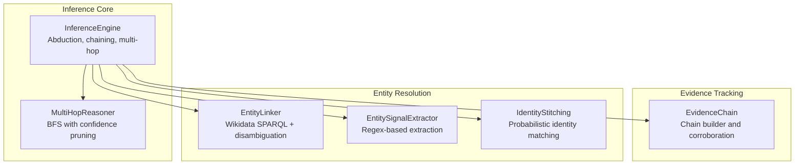
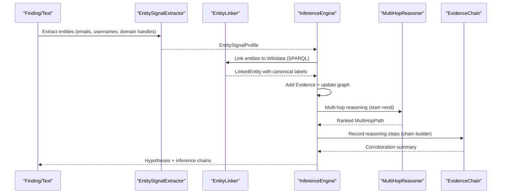
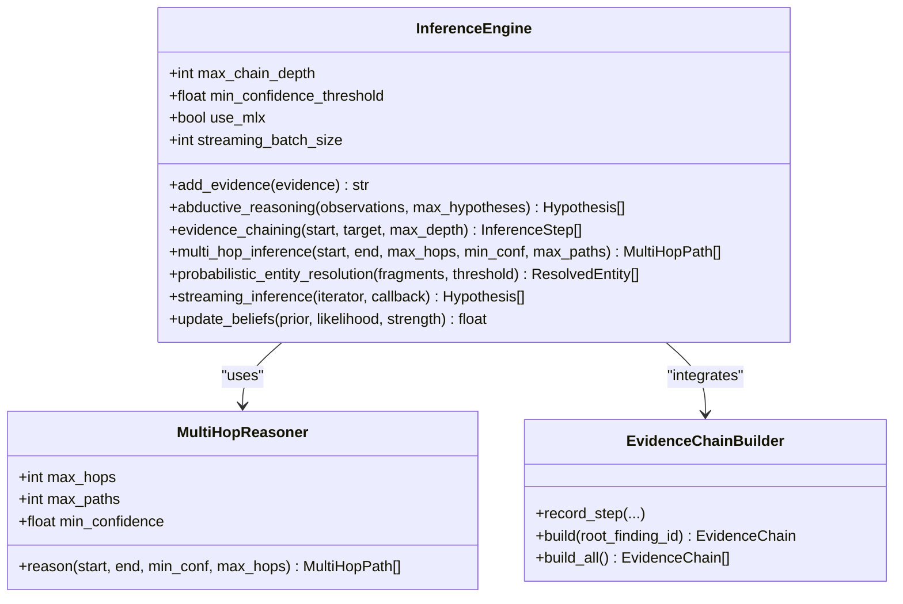
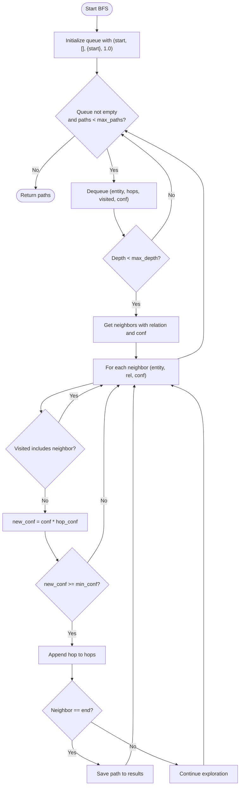
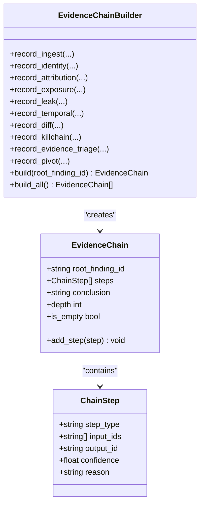
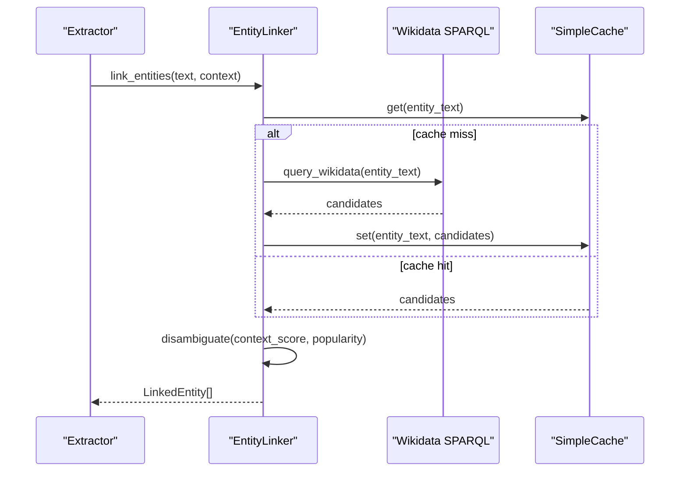
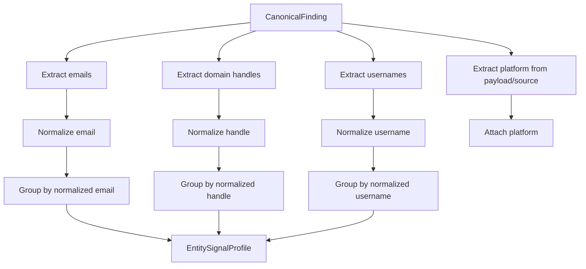
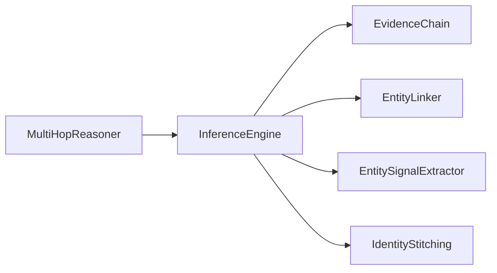

# Inference Engine

<cite>
**Referenced Files in This Document**
- [inference_engine.py](file://brain/inference_engine.py)
- [evidence_chain.py](file://knowledge/evidence_chain.py)
- [entity_linker.py](file://knowledge/entity_linker.py)
- [entity_signal_extractor.py](file://intelligence/entity_signal_extractor.py)
- [identity_stitching.py](file://intelligence/identity_stitching.py)
</cite>

## Table of Contents
1. [Introduction](#introduction)
2. [Project Structure](#project-structure)
3. [Core Components](#core-components)
4. [Architecture Overview](#architecture-overview)
5. [Detailed Component Analysis](#detailed-component-analysis)
6. [Dependency Analysis](#dependency-analysis)
7. [Performance Considerations](#performance-considerations)
8. [Troubleshooting Guide](#troubleshooting-guide)
9. [Conclusion](#conclusion)
10. [Appendices](#appendices)

## Introduction
This document describes the Inference Engine responsible for abductive reasoning, evidence chaining, and entity resolution within the OSINT research pipeline. It explains the inference rules system, logical deduction mechanisms, and knowledge integration features. It also covers evidence aggregation and validation processes, confidence scoring algorithms, decision-making workflows, and the integration with external knowledge sources and fact verification. Configuration options for reasoning parameters, evidence weights, and confidence thresholds are documented, along with examples of complex inference scenarios, evidence chains, and decision trees demonstrating the engine’s analytical capabilities.

## Project Structure
The Inference Engine is implemented as a focused module with supporting components for evidence tracking, entity linking, and identity stitching. The key modules are:
- Inference Engine: central reasoning and deduction logic
- Evidence Chain Tracker: reasoning path derivation and corroboration
- Entity Linker: Wikidata-based entity linking and disambiguation
- Entity Signal Extractor: deterministic entity extraction from findings
- Identity Stitching: cross-platform identity linking and probabilistic matching

**Diagram sources**
- [inference_engine.py](file://brain/inference_engine.py)
- [evidence_chain.py](file://knowledge/evidence_chain.py)
- [entity_linker.py](file://knowledge/entity_linker.py)
- [entity_signal_extractor.py](file://intelligence/entity_signal_extractor.py)
- [identity_stitching.py](file://intelligence/identity_stitching.py)

**Section sources**
- [inference_engine.py](file://brain/inference_engine.py)
- [evidence_chain.py](file://knowledge/evidence_chain.py)
- [entity_linker.py](file://knowledge/entity_linker.py)
- [entity_signal_extractor.py](file://intelligence/entity_signal_extractor.py)
- [identity_stitching.py](file://intelligence/identity_stitching.py)

## Core Components
- InferenceEngine: Implements abductive reasoning, evidence chaining, multi-hop inference, probabilistic entity resolution, Bayesian belief updates, and streaming inference. It maintains a bounded evidence graph and applies OSINT-specific inference rules.
- MultiHopReasoner: Performs breadth-first search across the evidence graph to discover multi-hop paths between entities with confidence scoring and cycle detection.
- EvidenceChain: Tracks reasoning steps from raw findings through identity extraction, attribution, kill-chain tagging, and pivot suggestions, enabling corroboration analysis.
- EntityLinker: Links extracted entities to Wikidata using SPARQL queries with context-aware disambiguation and caching.
- EntitySignalExtractor: Extracts usernames, emails, and domain handles from findings deterministically.
- IdentityStitching: Provides probabilistic identity matching across platforms using weighted signals.

**Section sources**
- [inference_engine.py](file://brain/inference_engine.py)
- [evidence_chain.py](file://knowledge/evidence_chain.py)
- [entity_linker.py](file://knowledge/entity_linker.py)
- [entity_signal_extractor.py](file://intelligence/entity_signal_extractor.py)
- [identity_stitching.py](file://intelligence/identity_stitching.py)

## Architecture Overview
The Inference Engine orchestrates OSINT-specific reasoning by:
- Aggregating Evidence: Adding evidence items to a bounded, LRU-evicted store and building a directed evidence graph based on rule-based connections.
- Abductive Reasoning: Generating candidate explanations from observations, computing priors and likelihoods, and applying Bayesian updates to produce ranked hypotheses.
- Evidence Chaining: Using BFS on the evidence graph to connect statements and derive inference chains.
- Multi-Hop Reasoning: Discovering indirect relationships between entities with confidence-compounding and cycle detection.
- Entity Resolution: Clustering fragmented identity fragments using name, attribute, and behavioral similarity.
- Knowledge Integration: Linking entities to Wikidata and extracting signals from findings to enrich reasoning.

**Diagram sources**
- [entity_signal_extractor.py](file://intelligence/entity_signal_extractor.py)
- [entity_linker.py](file://knowledge/entity_linker.py)
- [inference_engine.py](file://brain/inference_engine.py)
- [evidence_chain.py](file://knowledge/evidence_chain.py)

## Detailed Component Analysis

### InferenceEngine
The InferenceEngine encapsulates abductive reasoning, evidence chaining, multi-hop inference, and probabilistic entity resolution. It initializes OSINT-specific inference rules and applies them to build connections between evidence items. It supports streaming inference for large datasets and exports the internal evidence graph for visualization.

Key capabilities:
- Abductive reasoning: Generates candidate explanations, computes priors and likelihoods, and updates beliefs using Bayesian inference.
- Evidence chaining: Uses BFS on the evidence graph to find chains connecting statements.
- Multi-hop reasoning: Integrates MultiHopReasoner to discover indirect relationships with confidence compounding and cycle detection.
- Probabilistic entity resolution: Clusters identity fragments using weighted similarity across names, attributes, and behavioral patterns.
- Streaming inference: Processes evidence iteratively with batching and callback hooks.
- Confidence scoring: Applies evidence strength weighting and clamps values to maintain numerical stability.

Configuration parameters:
- max_chain_depth: Maximum depth for evidence chaining.
- min_confidence_threshold: Minimum posterior probability to consider a hypothesis.
- use_mlx: Enables MLX-accelerated computations when available.
- streaming_batch_size: Batch size for streaming inference.

**Diagram sources**
- [inference_engine.py](file://brain/inference_engine.py)
- [evidence_chain.py](file://knowledge/evidence_chain.py)

**Section sources**
- [inference_engine.py](file://brain/inference_engine.py)

### MultiHopReasoner
The MultiHopReasoner performs breadth-first search over the evidence graph to discover multi-hop paths between entities. It prunes paths based on confidence thresholds, detects cycles, and ranks paths by total confidence with a length penalty.

Key features:
- BFS with depth limiting and bounded queue size.
- Confidence-compounding across hops with length penalty.
- Cycle detection to prevent infinite loops.
- Ranking by confidence, path length, and acyclicity.

**Diagram sources**
- [inference_engine.py](file://brain/inference_engine.py)

**Section sources**
- [inference_engine.py](file://brain/inference_engine.py)

### EvidenceChain
EvidenceChain tracks reasoning steps from raw findings to derived conclusions. It records step types (e.g., identity stitching, attribution scoring, kill-chain tagging), input/output finding IDs, confidence, and human-readable reasons. It supports corroboration analysis across source families and serializes chains for persistence.

Key features:
- ChainStep: step_type, input_ids, output_id, confidence, reason.
- EvidenceChain: root_finding_id, ordered steps, optional conclusion.
- Corroboration helpers: source family classification and multi-source determination.
- Serialization: compact JSON with byte limits.

**Diagram sources**
- [evidence_chain.py](file://knowledge/evidence_chain.py)

**Section sources**
- [evidence_chain.py](file://knowledge/evidence_chain.py)

### EntityLinker
EntityLinker links extracted entities to Wikidata using SPARQL queries. It supports context-aware disambiguation via entity descriptions and popularity (sitelinks), with caching and async HTTP requests. It can fall back to GLiNER for NER or regex-based extraction.

Key features:
- SPARQL query building and parsing.
- Context similarity using rapidfuzz or word overlap.
- Popularity normalization and combined scoring.
- Async session management and TTL-based cache.

**Diagram sources**
- [entity_linker.py](file://knowledge/entity_linker.py)

**Section sources**
- [entity_linker.py](file://knowledge/entity_linker.py)

### EntitySignalExtractor
EntitySignalExtractor extracts usernames, emails, and domain handles from CanonicalFinding objects using deterministic regex patterns. It normalizes values and builds lightweight EntitySignalProfile objects grouped by normalized identifiers.

Key features:
- Deterministic extraction: emails, domain handles, usernames, and platform-derived handles.
- Normalization: lowercased, stripped, and normalized forms.
- Bounded profiles and comparisons.

**Diagram sources**
- [entity_signal_extractor.py](file://intelligence/entity_signal_extractor.py)

**Section sources**
- [entity_signal_extractor.py](file://intelligence/entity_signal_extractor.py)

### IdentityStitching
IdentityStitching provides probabilistic identity matching across platforms using weighted signals (username similarity, email exact/domain match, alias match, style similarity, temporal overlap, network overlap). It maintains indexes and caches for efficient lookups and supports memory optimization.

Note: IdentityStitching is marked as dormant and used as a helper for integration with relationship discovery.

**Section sources**
- [identity_stitching.py](file://intelligence/identity_stitching.py)

## Dependency Analysis
The Inference Engine integrates with:
- EvidenceChain for deriving and tracking reasoning paths.
- EntityLinker for canonical entity linking and disambiguation.
- EntitySignalExtractor for deterministic entity extraction from findings.
- IdentityStitching for cross-platform identity linking (helper role).

**Diagram sources**
- [inference_engine.py](file://brain/inference_engine.py)
- [evidence_chain.py](file://knowledge/evidence_chain.py)
- [entity_linker.py](file://knowledge/entity_linker.py)
- [entity_signal_extractor.py](file://intelligence/entity_signal_extractor.py)
- [identity_stitching.py](file://intelligence/identity_stitching.py)

**Section sources**
- [inference_engine.py](file://brain/inference_engine.py)
- [evidence_chain.py](file://knowledge/evidence_chain.py)
- [entity_linker.py](file://knowledge/entity_linker.py)
- [entity_signal_extractor.py](file://intelligence/entity_signal_extractor.py)
- [identity_stitching.py](file://intelligence/identity_stitching.py)

## Performance Considerations
- Memory bounds: The InferenceEngine enforces strict limits on graph nodes, evidence items, BFS queue size, and BFS depth to operate reliably on M1 8GB systems.
- Bounded storage: Evidence and graph nodes are evicted using deterministic LRU eviction to prevent unbounded growth.
- Streaming inference: Processes evidence in batches to manage memory footprint for large datasets.
- MLX acceleration: Optional GPU-accelerated similarity computations when available; falls back to CPU implementations.
- Async operations: EntityLinker uses async HTTP requests and concurrency limits to avoid blocking and excessive resource usage.
- Caching: EntityLinker employs TTL-based caching for SPARQL responses to reduce redundant queries.

[No sources needed since this section provides general guidance]

## Troubleshooting Guide
Common issues and remedies:
- Evidence graph pruning: If expected evidence does not connect, verify that the evidence count and graph edges are within configured bounds; consider increasing batch sizes or adjusting thresholds.
- Confidence thresholds: Lower min_confidence_threshold to capture weaker hypotheses; adjust min_confidence in multi-hop reasoning to include more paths.
- Memory pressure: Reduce max_chain_depth, max_hops, or streaming_batch_size; ensure caches are periodically cleared.
- Entity linking failures: Verify network connectivity and SPARQL endpoint availability; confirm rapidfuzz and aiohttp are installed for optimal performance.
- Multi-hop timeouts: Increase max_paths or reduce max_hops to limit search space; review path statistics to understand coverage.

**Section sources**
- [inference_engine.py](file://brain/inference_engine.py)
- [entity_linker.py](file://knowledge/entity_linker.py)

## Conclusion
The Inference Engine provides a robust, OSINT-focused reasoning framework combining abductive reasoning, evidence chaining, multi-hop inference, and probabilistic entity resolution. It integrates tightly with evidence tracking and entity linking to produce interpretable, corroboration-aware conclusions. Its design emphasizes memory safety, performance on constrained hardware, and extensibility for future enhancements.

[No sources needed since this section summarizes without analyzing specific files]

## Appendices

### Configuration Options
- InferenceEngine constructor parameters:
  - max_chain_depth: maximum depth for evidence chaining
  - min_confidence_threshold: minimum posterior probability for hypotheses
  - use_mlx: enable MLX acceleration
  - streaming_batch_size: batch size for streaming inference
- MultiHopReasoner parameters:
  - max_hops: maximum hop depth (clamped to 3–10)
  - max_paths: maximum paths to explore
  - min_confidence: minimum confidence threshold for path inclusion
- EntityLinker parameters:
  - max_candidates: maximum candidates per query
  - confidence_threshold: minimum confidence for linking
  - request_timeout: HTTP request timeout
  - use_gliner: enable GLiNER NER if available

**Section sources**
- [inference_engine.py](file://brain/inference_engine.py)
- [entity_linker.py](file://knowledge/entity_linker.py)

### Examples and Decision Trees

- Abductive reasoning scenario:
  - Observations: multiple findings with suspicious IP usage, temporal proximity, and communication patterns
  - Engine generates candidate explanations (e.g., “actors are the same,” “coordinated campaign”), computes priors and likelihoods, and returns ranked hypotheses with supporting inference chains

- Evidence chaining example:
  - Start: “Actor A accessed compromised server”
  - Target: “Actor A is linked to known threat group”
  - Engine finds a BFS path through intermediate evidence and returns a sequence of inference steps with rule names and confidences

- Multi-hop reasoning example:
  - Start: “Suspect X”
  - End: “Criminal Organization Y”
  - Engine discovers multiple paths, compounds confidence across hops, detects cycles, and ranks the strongest non-cyclic path

- Entity resolution example:
  - Fragments: multiple identity fragments with names, emails, and behavioral patterns
  - Engine clusters fragments using weighted similarity and produces resolved entities with canonical names and merged attributes

[No sources needed since this section provides conceptual examples]