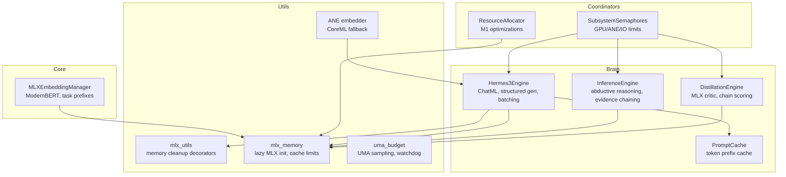
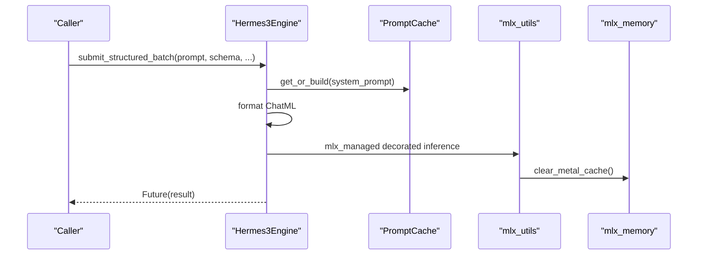
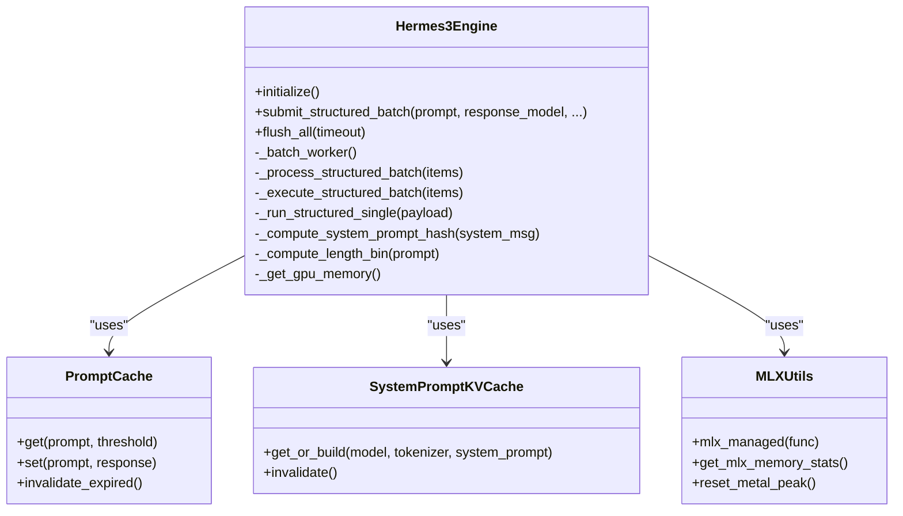
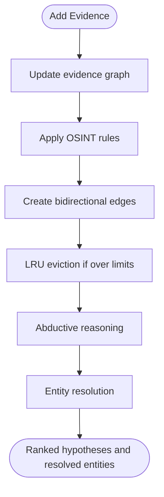
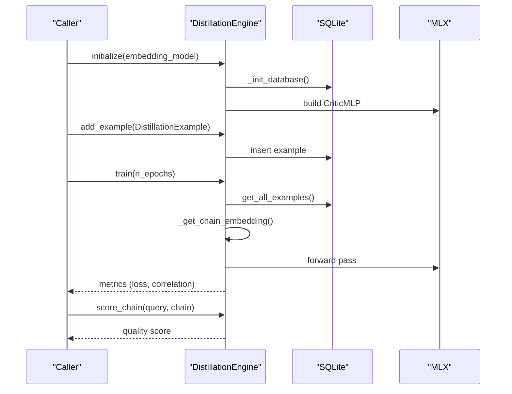
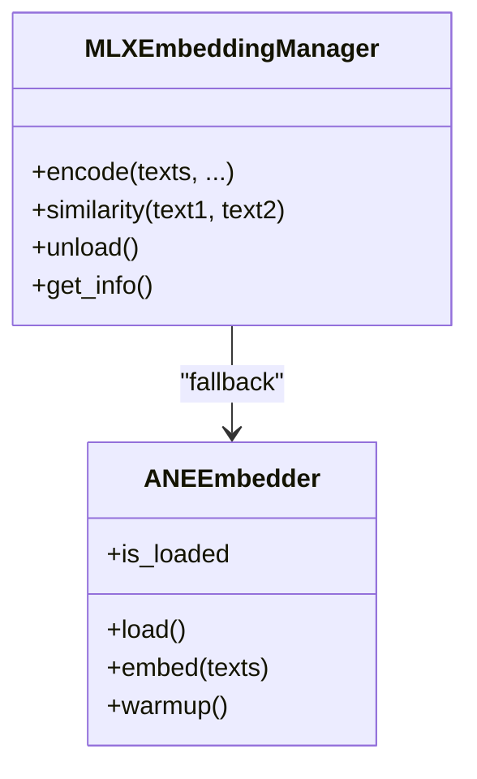
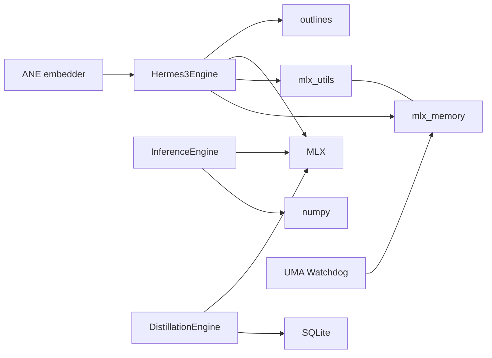

# Inference Engines

<cite>
**Referenced Files in This Document**
- [hermes3_engine.py](file://brain/hermes3_engine.py)
- [inference_engine.py](file://brain/inference_engine.py)
- [distillation_engine.py](file://brain/distillation_engine.py)
- [mlx_embeddings.py](file://core/mlx_embeddings.py)
- [model_lifecycle.py](file://brain/model_lifecycle.py)
- [mlx_utils.py](file://utils/mlx_utils.py)
- [mlx_memory.py](file://utils/mlx_memory.py)
- [prompt_cache.py](file://brain/prompt_cache.py)
- [uma_budget.py](file://utils/uma_budget.py)
- [ane_embedder.py](file://brain/ane_embedder.py)
- [resource_allocator.py](file://coordinators/resource_allocator.py)
- [subsystem_semaphores.py](file://orchestrator/subsystem_semaphores.py)
</cite>

## Table of Contents
1. [Introduction](#introduction)
2. [Project Structure](#project-structure)
3. [Core Components](#core-components)
4. [Architecture Overview](#architecture-overview)
5. [Detailed Component Analysis](#detailed-component-analysis)
6. [Dependency Analysis](#dependency-analysis)
7. [Performance Considerations](#performance-considerations)
8. [Troubleshooting Guide](#troubleshooting-guide)
9. [Conclusion](#conclusion)
10. [Appendices](#appendices)

## Introduction
This document describes the inference engines and related systems that power decision-making, reasoning, and knowledge transfer in the project. It focuses on three canonical engines:
- Hermes3Engine: ChatML-formatted LLM orchestration with structured output generation and continuous batching.
- InferenceEngine: Rule-based abductive reasoning, evidence chaining, and entity resolution for OSINT.
- DistillationEngine: MLX-based critic network for reasoning chain quality scoring and knowledge transfer.

It also covers MLX embeddings generation, memory management for Apple Silicon, and performance optimization strategies, including configuration parameters, batch processing limits, and resource allocation.

## Project Structure
The inference engines reside primarily under the brain/ directory, with supporting utilities in core/, utils/, and orchestration-related components in coordinators/ and orchestrator/.

**Diagram sources**
- [hermes3_engine.py:142-800](file://brain/hermes3_engine.py#L142-L800)
- [inference_engine.py:366-800](file://brain/inference_engine.py#L366-L800)
- [distillation_engine.py:183-886](file://brain/distillation_engine.py#L183-L886)
- [mlx_embeddings.py:79-593](file://core/mlx_embeddings.py#L79-L593)
- [mlx_utils.py:110-246](file://utils/mlx_utils.py#L110-L246)
- [mlx_memory.py:54-332](file://utils/mlx_memory.py#L54-L332)
- [prompt_cache.py:48-257](file://brain/prompt_cache.py#L48-L257)
- [uma_budget.py:380-507](file://utils/uma_budget.py#L380-L507)
- [ane_embedder.py:199-544](file://brain/ane_embedder.py#L199-L544)
- [resource_allocator.py:200-490](file://coordinators/resource_allocator.py#L200-L490)
- [subsystem_semaphores.py:43-79](file://orchestrator/subsystem_semaphores.py#L43-L79)

**Section sources**
- [hermes3_engine.py:1-800](file://brain/hermes3_engine.py#L1-L800)
- [inference_engine.py:1-800](file://brain/inference_engine.py#L1-L800)
- [distillation_engine.py:1-886](file://brain/distillation_engine.py#L1-L886)
- [mlx_embeddings.py:1-593](file://core/mlx_embeddings.py#L1-L593)
- [mlx_utils.py:1-246](file://utils/mlx_utils.py#L1-L246)
- [mlx_memory.py:1-332](file://utils/mlx_memory.py#L1-L332)
- [prompt_cache.py:1-257](file://brain/prompt_cache.py#L1-L257)
- [uma_budget.py:1-507](file://utils/uma_budget.py#L1-L507)
- [ane_embedder.py:1-544](file://brain/ane_embedder.py#L1-L544)
- [resource_allocator.py:200-490](file://coordinators/resource_allocator.py#L200-L490)
- [subsystem_semaphores.py:43-79](file://orchestrator/subsystem_semaphores.py#L43-L79)

## Core Components
- Hermes3Engine: Implements ChatML formatting, structured generation with outlines, continuous batching with adaptive flushing, KV cache and system prompt caching, and MLX memory hygiene.
- InferenceEngine: Performs abductive reasoning, evidence chaining, and entity resolution with bounded memory, MLX-accelerated similarity, and OSINT-specific inference rules.
- DistillationEngine: MLX-based MLP critic for reasoning chain quality scoring, SQLite-backed dataset, and fallback heuristics.

Key supporting systems:
- MLXEmbeddingManager: ModernBERT-based embeddings with task-aware prefixes and Matryoshka dimension reduction.
- Memory management: mlx_utils and mlx_memory provide automatic cleanup, throttled eval, and cache limits.
- PromptCache: Token prefix cache and system prompt KV cache for reduced latency.
- UMA watchdog: Memory pressure sampling and callbacks for emergency actions.
- ANE embedder: CoreML-based fallback for embeddings and reranking.

**Section sources**
- [hermes3_engine.py:142-800](file://brain/hermes3_engine.py#L142-L800)
- [inference_engine.py:366-800](file://brain/inference_engine.py#L366-L800)
- [distillation_engine.py:183-886](file://brain/distillation_engine.py#L183-L886)
- [mlx_embeddings.py:79-593](file://core/mlx_embeddings.py#L79-L593)
- [mlx_utils.py:110-246](file://utils/mlx_utils.py#L110-L246)
- [mlx_memory.py:54-332](file://utils/mlx_memory.py#L54-L332)
- [prompt_cache.py:48-257](file://brain/prompt_cache.py#L48-L257)
- [uma_budget.py:380-507](file://utils/uma_budget.py#L380-L507)
- [ane_embedder.py:199-544](file://brain/ane_embedder.py#L199-L544)

## Architecture Overview
The engines integrate with Apple Silicon-specific utilities for memory control and acceleration. The Hermes3Engine orchestrates structured generation with continuous batching and MLX memory hygiene. The InferenceEngine performs rule-based reasoning with MLX similarity. The DistillationEngine trains and evaluates reasoning quality with an MLX critic. Embeddings leverage ModernBERT via MLX or ANE fallbacks.

**Diagram sources**
- [hermes3_engine.py:318-694](file://brain/hermes3_engine.py#L318-L694)
- [prompt_cache.py:204-257](file://brain/prompt_cache.py#L204-L257)
- [mlx_utils.py:110-195](file://utils/mlx_utils.py#L110-L195)
- [mlx_memory.py:77-106](file://utils/mlx_memory.py#L77-L106)

## Detailed Component Analysis

### Hermes3Engine
- ChatML formatting: Builds system/user/assistant segments for consistent prompting.
- Structured generation: Uses outlines with grammar-constrained decoding and schema-aware batching.
- Continuous batching: Priority-queue driven with schema, system prompt, and length segregation; adaptive flush intervals; anti-starvation age bump.
- Memory management: MLX eval and cache clearing helpers; emergency unload seam; bounded pending futures; single-threaded inference executor.
- KV cache and system prompt cache: Optional prompt cache and system prompt token prefix cache for reduced latency.

**Diagram sources**
- [hermes3_engine.py:142-800](file://brain/hermes3_engine.py#L142-L800)
- [prompt_cache.py:48-257](file://brain/prompt_cache.py#L48-L257)
- [mlx_utils.py:110-246](file://utils/mlx_utils.py#L110-L246)

**Section sources**
- [hermes3_engine.py:142-800](file://brain/hermes3_engine.py#L142-L800)
- [prompt_cache.py:48-257](file://brain/prompt_cache.py#L48-L257)
- [mlx_utils.py:110-246](file://utils/mlx_utils.py#L110-L246)

### InferenceEngine
- Abductive reasoning: Generates candidate explanations and updates beliefs with Bayesian inference.
- Evidence chaining: Builds a bounded evidence graph and applies OSINT-specific rules (co-location, temporal proximity, communication patterns, stylometry, behavioral fingerprinting).
- Entity resolution: Probabilistic merging of fragmented identities with confidence scoring.
- MLX acceleration: GPU-accelerated cosine similarity with safe zero-checks and fallback to numpy.
- Bounded operations: LRU eviction for evidence and graph nodes; bounded BFS queues and depths.

**Diagram sources**
- [inference_engine.py:692-765](file://brain/inference_engine.py#L692-L765)
- [inference_engine.py:766-800](file://brain/inference_engine.py#L766-L800)

**Section sources**
- [inference_engine.py:366-800](file://brain/inference_engine.py#L366-L800)

### DistillationEngine
- Critic network: MLP trained with SGD to score reasoning chains; predicts quality in [0,1].
- Training: Loads examples from SQLite, computes embeddings, trains critic, and reports metrics.
- Scoring: Embeds chains and scores via critic or heuristic fallback.
- Cleanup: Clears critic, model references, and invokes MLX cache clear.

**Diagram sources**
- [distillation_engine.py:220-466](file://brain/distillation_engine.py#L220-L466)
- [distillation_engine.py:467-598](file://brain/distillation_engine.py#L467-L598)

**Section sources**
- [distillation_engine.py:183-886](file://brain/distillation_engine.py#L183-L886)

### MLX Embeddings Generation
- Provider: ModernBERT via MLX embeddings with task-aware prefixes (search_query, search_document, clustering, classification).
- Features: Matryoshka dimension reduction, L2 normalization, batch encoding, and safe memory hygiene with Metal stream context.
- Fallbacks: Hash-based fallback for ANE embedder when CoreML unavailable.

**Diagram sources**
- [mlx_embeddings.py:79-593](file://core/mlx_embeddings.py#L79-L593)
- [ane_embedder.py:199-544](file://brain/ane_embedder.py#L199-L544)

**Section sources**
- [mlx_embeddings.py:79-593](file://core/mlx_embeddings.py#L79-L593)
- [ane_embedder.py:199-544](file://brain/ane_embedder.py#L199-L544)

## Dependency Analysis
- Hermes3Engine depends on outlines for structured generation, MLX for inference, and memory utilities for cleanup.
- InferenceEngine depends on MLX for similarity and numpy as fallback.
- DistillationEngine depends on MLX for training and inference, and SQLite for persistence.
- Memory management is centralized in mlx_utils and mlx_memory, with UMA watchdog coordinating emergency actions.

**Diagram sources**
- [hermes3_engine.py:43-112](file://brain/hermes3_engine.py#L43-L112)
- [inference_engine.py:44-51](file://brain/inference_engine.py#L44-L51)
- [distillation_engine.py:38-49](file://brain/distillation_engine.py#L38-L49)
- [mlx_utils.py:22-41](file://utils/mlx_utils.py#L22-L41)
- [mlx_memory.py:54-75](file://utils/mlx_memory.py#L54-L75)
- [uma_budget.py:380-507](file://utils/uma_budget.py#L380-L507)
- [ane_embedder.py:21-29](file://brain/ane_embedder.py#L21-L29)

**Section sources**
- [hermes3_engine.py:43-112](file://brain/hermes3_engine.py#L43-L112)
- [inference_engine.py:44-51](file://brain/inference_engine.py#L44-L51)
- [distillation_engine.py:38-49](file://brain/distillation_engine.py#L38-L49)
- [mlx_utils.py:22-41](file://utils/mlx_utils.py#L22-L41)
- [mlx_memory.py:54-75](file://utils/mlx_memory.py#L54-L75)
- [uma_budget.py:380-507](file://utils/uma_budget.py#L380-L507)
- [ane_embedder.py:21-29](file://brain/ane_embedder.py#L21-L29)

## Performance Considerations
- Continuous batching: Hermes3Engine’s adaptive flush intervals and schema/length segregation minimize padding waste and improve throughput.
- Memory hygiene: mlx_utils decorators and mlx_memory helpers ensure Metal cache is cleared promptly; debounced cache clears prevent thrashing.
- UMA pressure monitoring: UMA watchdog triggers MLX cleanup at critical thresholds; subsystem semaphores limit concurrent GPU/ANE work.
- Resource allocation: ResourceAllocator applies M1-specific optimizations (MLX acceleration, Metal device wrapper, unified memory tuning) and scales allocations based on measured capacity.
- Embedding efficiency: MLXEmbeddingManager supports Matryoshka dimension reduction and task-aware prefixes; ANE embedder provides fallback acceleration.

**Section sources**
- [hermes3_engine.py:517-567](file://brain/hermes3_engine.py#L517-L567)
- [mlx_utils.py:110-195](file://utils/mlx_utils.py#L110-L195)
- [mlx_memory.py:217-304](file://utils/mlx_memory.py#L217-L304)
- [uma_budget.py:380-507](file://utils/uma_budget.py#L380-L507)
- [subsystem_semaphores.py:43-79](file://orchestrator/subsystem_semaphores.py#L43-L79)
- [resource_allocator.py:479-490](file://coordinators/resource_allocator.py#L479-L490)
- [mlx_embeddings.py:236-335](file://core/mlx_embeddings.py#L236-L335)
- [ane_embedder.py:317-340](file://brain/ane_embedder.py#L317-L340)

## Troubleshooting Guide
- Emergency unload: Use the emergency seam to gracefully shut down Hermes3Engine workers and clear caches; confirm safe-to-clear conditions before clearing the flag.
- MLX cache leaks: Use mlx_utils decorators or mlx_memory helpers to ensure mx.eval() and metal.clear_cache() are invoked; check memory stats and reset peak counters.
- UMA pressure: Monitor UMA pressure levels; watchdog triggers cleanup at critical thresholds; adjust subsystem limits if necessary.
- Distillation training failures: Verify MLX availability and sufficient examples; fallback to heuristic scoring if critic is unavailable.
- ANE fallback: If CoreML is unavailable, ANE embedder falls back to hash-based embeddings; configure fallback embedder for deterministic behavior.

**Section sources**
- [model_lifecycle.py:108-190](file://brain/model_lifecycle.py#L108-L190)
- [mlx_utils.py:110-246](file://utils/mlx_utils.py#L110-L246)
- [mlx_memory.py:77-106](file://utils/mlx_memory.py#L77-L106)
- [uma_budget.py:380-507](file://utils/uma_budget.py#L380-L507)
- [distillation_engine.py:372-466](file://brain/distillation_engine.py#L372-L466)
- [ane_embedder.py:269-340](file://brain/ane_embedder.py#L269-L340)

## Conclusion
The inference engines combine structured LLM orchestration, rule-based OSINT reasoning, and quality scoring to deliver robust, memory-conscious AI workflows on Apple Silicon. Continuous batching, MLX memory hygiene, and UMA-aware controls ensure stability under constrained environments. Embedding providers and ANE fallbacks further enhance performance and reliability.

## Appendices

### Configuration Parameters and Limits
- Hermes3Engine
  - Model path and generation parameters (temperature, max_tokens, context window) via internal config.
  - Continuous batching: max batch size, adaptive flush intervals, and pressure thresholds.
  - Prefix cache size controlled by environment variable for tokenization.
  - Emergency unload seam and bounded pending futures for resilience.
- InferenceEngine
  - Bounded evidence and graph sizes; BFS queue and depth limits; MLX enable/disable toggle.
- DistillationEngine
  - Embedding dimension and chain length limits; SQLite database path; training epochs.
- MLXEmbeddingManager
  - Task-aware prefixes, Matryoshka truncation, and batch encoding parameters.
- ResourceAllocator and SubsystemSemaphores
  - GPU/ANE/IO limits and M1-specific optimizations; environment variables for MLX/Metal tuning.

**Section sources**
- [hermes3_engine.py:120-275](file://brain/hermes3_engine.py#L120-L275)
- [inference_engine.py:385-431](file://brain/inference_engine.py#L385-L431)
- [distillation_engine.py:204-250](file://brain/distillation_engine.py#L204-L250)
- [mlx_embeddings.py:95-120](file://core/mlx_embeddings.py#L95-L120)
- [resource_allocator.py:479-490](file://coordinators/resource_allocator.py#L479-L490)
- [subsystem_semaphores.py:43-79](file://orchestrator/subsystem_semaphores.py#L43-L79)