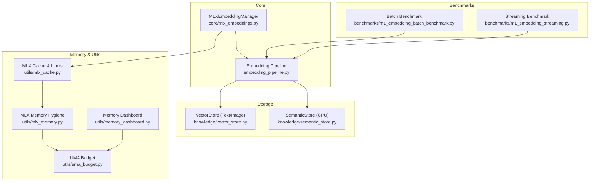
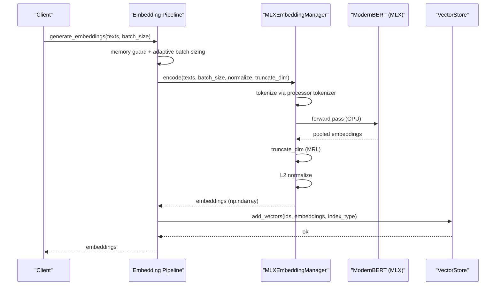
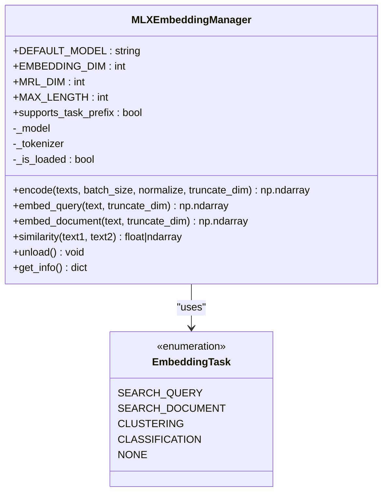
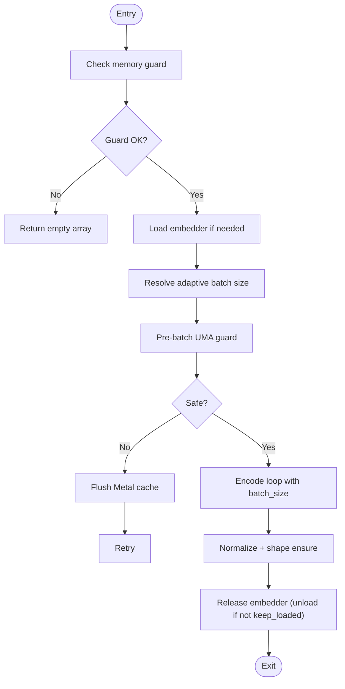
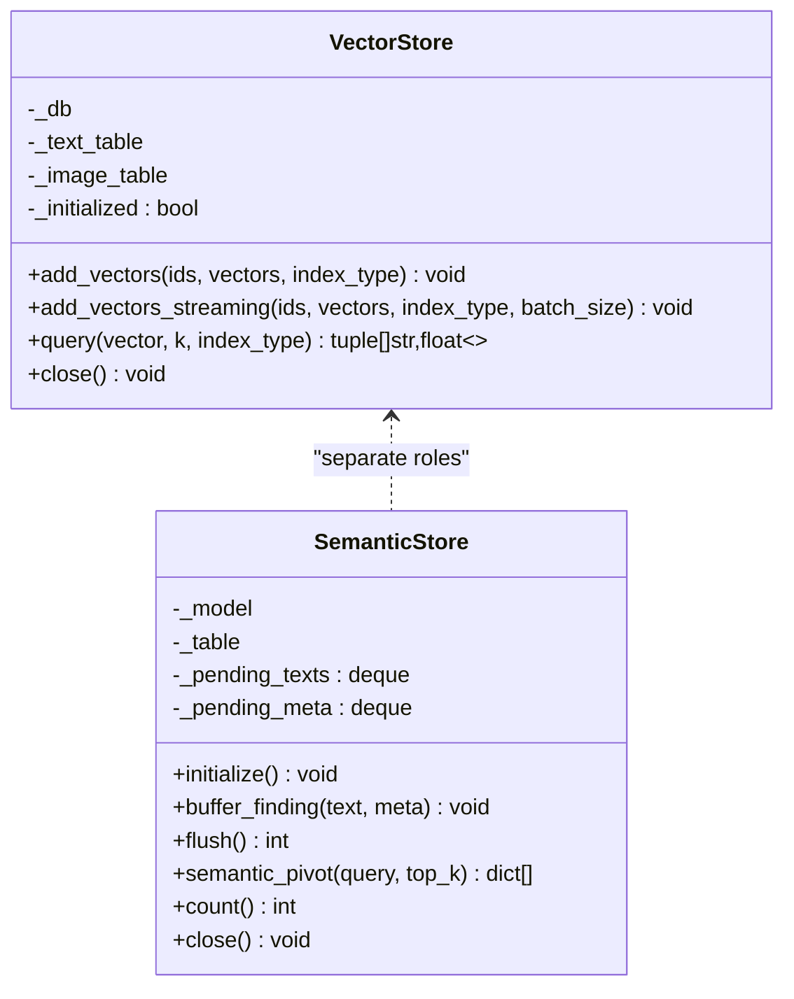
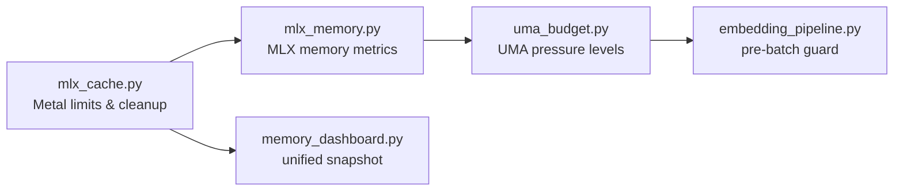
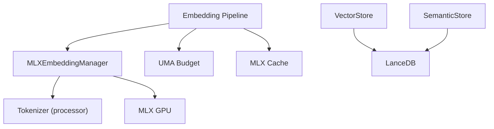

# MLX Embeddings

<cite>
**Referenced Files in This Document**
- [mlx_embeddings.py](file://core/mlx_embeddings.py)
- [embedding_pipeline.py](file://embedding_pipeline.py)
- [vector_store.py](file://knowledge/vector_store.py)
- [semantic_store.py](file://knowledge/semantic_store.py)
- [mlx_cache.py](file://utils/mlx_cache.py)
- [mlx_memory.py](file://utils/mlx_memory.py)
- [uma_budget.py](file://utils/uma_budget.py)
- [memory_dashboard.py](file://utils/memory_dashboard.py)
- [m1_embedding_batch_benchmark.py](file://benchmarks/m1_embedding_batch_benchmark.py)
- [m1_embedding_streaming.py](file://benchmarks/m1_embedding_streaming.py)
- [mlx-oom.md](file://runbooks/mlx-oom.md)
</cite>

## Table of Contents
1. [Introduction](#introduction)
2. [Project Structure](#project-structure)
3. [Core Components](#core-components)
4. [Architecture Overview](#architecture-overview)
5. [Detailed Component Analysis](#detailed-component-analysis)
6. [Dependency Analysis](#dependency-analysis)
7. [Performance Considerations](#performance-considerations)
8. [Troubleshooting Guide](#troubleshooting-guide)
9. [Conclusion](#conclusion)

## Introduction
This document describes the MLX embeddings system optimized for Apple Silicon (M1/M2) hardware. It covers the embedding model integration using ModernBERT via MLX, batch processing, GPU acceleration, memory management, cache optimization, and performance tuning. It also explains the embedding generation pipeline, normalization and similarity calculation, and integration with vector stores and search/indexing systems. Configuration options for embedding dimensions, batch sizes, and memory limits are documented, along with examples, benchmarks, and optimization techniques for large-scale vector operations on Apple Silicon.

## Project Structure
The MLX embeddings system spans several modules:
- Core embedding manager and encoder
- Embedding pipeline with adaptive batching and streaming
- Vector stores for text and image embeddings
- Memory management utilities for Metal/Uma budgets
- Benchmarks for batch and streaming performance
- Runbooks for OOM recovery

**Diagram sources**
- [mlx_embeddings.py:1-593](file://core/mlx_embeddings.py#L1-L593)
- [embedding_pipeline.py:1-748](file://embedding_pipeline.py#L1-L748)
- [vector_store.py:1-308](file://knowledge/vector_store.py#L1-L308)
- [semantic_store.py:1-301](file://knowledge/semantic_store.py#L1-L301)
- [mlx_cache.py:1-465](file://utils/mlx_cache.py#L1-L465)
- [mlx_memory.py:1-332](file://utils/mlx_memory.py#L1-L332)
- [uma_budget.py:1-507](file://utils/uma_budget.py#L1-L507)
- [memory_dashboard.py:1-242](file://utils/memory_dashboard.py#L1-L242)
- [m1_embedding_batch_benchmark.py:1-353](file://benchmarks/m1_embedding_batch_benchmark.py#L1-L353)
- [m1_embedding_streaming.py:1-215](file://benchmarks/m1_embedding_streaming.py#L1-L215)

**Section sources**
- [mlx_embeddings.py:1-593](file://core/mlx_embeddings.py#L1-L593)
- [embedding_pipeline.py:1-748](file://embedding_pipeline.py#L1-L748)
- [vector_store.py:1-308](file://knowledge/vector_store.py#L1-L308)
- [semantic_store.py:1-301](file://knowledge/semantic_store.py#L1-L301)
- [mlx_cache.py:1-465](file://utils/mlx_cache.py#L1-L465)
- [mlx_memory.py:1-332](file://utils/mlx_memory.py#L1-L332)
- [uma_budget.py:1-507](file://utils/uma_budget.py#L1-L507)
- [memory_dashboard.py:1-242](file://utils/memory_dashboard.py#L1-L242)
- [m1_embedding_batch_benchmark.py:1-353](file://benchmarks/m1_embedding_batch_benchmark.py#L1-L353)
- [m1_embedding_streaming.py:1-215](file://benchmarks/m1_embedding_streaming.py#L1-L215)

## Core Components
- MLXEmbeddingManager: Loads ModernBERT via mlx-embeddings, tokenizes with the processor’s tokenizer, performs forward passes on GPU, applies Matryoshka truncation, and L2 normalization. Supports task-aware embeddings with prefixes for asymmetric retrieval.
- Embedding Pipeline: Provides batch embedding generation, adaptive batch sizing, memory guards, streaming batch API, and lifecycle management with embedding sessions.
- Vector Store: LanceDB-backed storage with separate indices for text (256d MRL) and image (1024d) embeddings, supporting streaming batch adds and cosine similarity queries.
- Memory Management: Utilities for Metal cache limits, memory pressure monitoring, and cleanup routines tailored for M1 8GB UMA constraints.

Key capabilities:
- Asymmetric retrieval via task prefixes (search_query/search_document)
- Matryoshka Representation Learning (MRL) for 256d embeddings
- Batch processing with adaptive sizing and streaming to reduce peak RSS
- Memory pressure guards and cleanup routines
- Integration with vector stores and similarity search

**Section sources**
- [mlx_embeddings.py:79-444](file://core/mlx_embeddings.py#L79-L444)
- [embedding_pipeline.py:271-453](file://embedding_pipeline.py#L271-L453)
- [vector_store.py:44-291](file://knowledge/vector_store.py#L44-L291)
- [mlx_cache.py:177-351](file://utils/mlx_cache.py#L177-L351)

## Architecture Overview
The MLX embeddings system integrates a GPU-accelerated encoder with memory-conscious orchestration and storage:

**Diagram sources**
- [embedding_pipeline.py:271-364](file://embedding_pipeline.py#L271-L364)
- [mlx_embeddings.py:236-334](file://core/mlx_embeddings.py#L236-L334)
- [vector_store.py:122-178](file://knowledge/vector_store.py#L122-L178)

## Detailed Component Analysis

### MLXEmbeddingManager
Responsibilities:
- Model/tokenizer loading via mlx-embeddings
- Task-aware embedding with prefixes for asymmetric retrieval
- Matryoshka truncation and L2 normalization
- Similarity computation for pairs of texts
- Memory-unloading and cleanup

Implementation highlights:
- Task enumeration and prefix discipline for ModernBERT
- Batched encoding with Metal stream context guard
- Deliberate deletion of intermediate tensors to reduce peak memory on UMA
- Singleton provider and dimension assertion utilities

**Diagram sources**
- [mlx_embeddings.py:79-444](file://core/mlx_embeddings.py#L79-L444)

**Section sources**
- [mlx_embeddings.py:79-444](file://core/mlx_embeddings.py#L79-L444)

### Embedding Pipeline
Responsibilities:
- Adaptive batch sizing considering UMA pressure and swap activity
- Memory guards (RSS thresholds, UMA combined memory)
- Streaming batch API to reduce peak RSS
- Embedding lifecycle management with refcounted sessions
- Deduplication of identical texts prior to embedding

Key mechanisms:
- Environment-controlled batch size with caps and allow-list for large batches
- Pre-batch UMA guard that flushes Metal cache when approaching 6.656 GB combined
- Memory pressure checks before model load and after unload
- Streaming API yields partial results to avoid materializing all embeddings at once

**Diagram sources**
- [embedding_pipeline.py:128-370](file://embedding_pipeline.py#L128-L370)

**Section sources**
- [embedding_pipeline.py:67-126](file://embedding_pipeline.py#L67-L126)
- [embedding_pipeline.py:168-218](file://embedding_pipeline.py#L168-L218)
- [embedding_pipeline.py:271-370](file://embedding_pipeline.py#L271-L370)
- [embedding_pipeline.py:658-748](file://embedding_pipeline.py#L658-L748)

### Vector Stores
Text and image vector stores backed by LanceDB:
- Text index: 256d MRL embeddings (ModernBERT)
- Image index: 1024d embeddings
- Streaming batch add to reduce memory spikes
- Cosine similarity search with score conversion

**Diagram sources**
- [vector_store.py:44-291](file://knowledge/vector_store.py#L44-L291)
- [semantic_store.py:42-301](file://knowledge/semantic_store.py#L42-L301)

**Section sources**
- [vector_store.py:44-291](file://knowledge/vector_store.py#L44-L291)
- [semantic_store.py:42-301](file://knowledge/semantic_store.py#L42-L301)

### Memory Management and Metal Limits
- Metal cache and wired memory limits configured to 2.5 GiB each for M1 8GB
- One-time initialization with thread-safe double-checked locking
- Cleanup routines: gc.collect(), mx.eval([]), metal.clear_cache()
- UMA pressure monitoring and watchdog with debounced callbacks
- Memory dashboard consolidates system RAM and Metal metrics

**Diagram sources**
- [mlx_cache.py:177-351](file://utils/mlx_cache.py#L177-L351)
- [mlx_memory.py:108-214](file://utils/mlx_memory.py#L108-L214)
- [uma_budget.py:201-282](file://utils/uma_budget.py#L201-L282)
- [embedding_pipeline.py:168-218](file://embedding_pipeline.py#L168-L218)
- [memory_dashboard.py:82-242](file://utils/memory_dashboard.py#L82-L242)

**Section sources**
- [mlx_cache.py:177-351](file://utils/mlx_cache.py#L177-L351)
- [mlx_memory.py:108-214](file://utils/mlx_memory.py#L108-L214)
- [uma_budget.py:201-282](file://utils/uma_budget.py#L201-L282)
- [embedding_pipeline.py:168-218](file://embedding_pipeline.py#L168-L218)
- [memory_dashboard.py:82-242](file://utils/memory_dashboard.py#L82-L242)

## Dependency Analysis
- MLXEmbeddingManager depends on mlx-embeddings for ModernBERT loading and tokenizer access.
- Embedding Pipeline depends on MLXEmbeddingManager and memory utilities for safe operation.
- VectorStore depends on LanceDB and PyArrow; integrates with embedding pipeline outputs.
- Memory utilities form a cohesive layer for Metal limits, pressure monitoring, and cleanup.

**Diagram sources**
- [mlx_embeddings.py:122-146](file://core/mlx_embeddings.py#L122-L146)
- [embedding_pipeline.py:220-229](file://embedding_pipeline.py#L220-L229)
- [vector_store.py:69-121](file://knowledge/vector_store.py#L69-L121)
- [semantic_store.py:80-117](file://knowledge/semantic_store.py#L80-L117)

**Section sources**
- [mlx_embeddings.py:122-146](file://core/mlx_embeddings.py#L122-L146)
- [embedding_pipeline.py:220-229](file://embedding_pipeline.py#L220-L229)
- [vector_store.py:69-121](file://knowledge/vector_store.py#L69-L121)
- [semantic_store.py:80-117](file://knowledge/semantic_store.py#L80-L117)

## Performance Considerations
- Embedding dimensions: 768 (base), MRL truncated to 256 for text; 1024 for images.
- Batch sizing: Adaptive resolution with environment overrides; caps and allow-list for large batches.
- Memory budgets: UMA ceilings at 6.5 GB combined (RSS + Metal active); pre-batch guard flushes cache when nearing limit.
- Streaming: Reduces peak RSS by yielding batches incrementally.
- Cleanup order: gc.collect() → mx.eval([]) → clear_cache() to ensure Metal buffers are released promptly.

Benchmark references:
- Batch benchmark measures docs/s, elapsed_ms, peak RSS, swap delta, and OOM flags across batch sizes.
- Streaming benchmark compares peak RSS deltas between sync and streaming paths.

**Section sources**
- [embedding_pipeline.py:42-54](file://embedding_pipeline.py#L42-L54)
- [embedding_pipeline.py:67-126](file://embedding_pipeline.py#L67-L126)
- [embedding_pipeline.py:168-218](file://embedding_pipeline.py#L168-L218)
- [m1_embedding_batch_benchmark.py:123-241](file://benchmarks/m1_embedding_batch_benchmark.py#L123-L241)
- [m1_embedding_streaming.py:52-127](file://benchmarks/m1_embedding_streaming.py#L52-L127)

## Troubleshooting Guide
Common issues and remedies:
- Out-of-memory (OOM) symptoms and emergency recovery steps
- Diagnosing MLX cache state, system memory pressure, and potential leaks
- Safe memory thresholds and prevention strategies

Recommended actions:
- Clear MLX cache with mx.eval([]) barrier followed by metal.clear_cache()
- Reduce cache limit temporarily to 64 MB to defragment and recover
- Invoke garbage collection and monitor high-water marks
- Use environment variables to tune batch sizes and guard against large batches without explicit allowance

**Section sources**
- [mlx-oom.md:1-77](file://runbooks/mlx-oom.md#L1-L77)
- [embedding_pipeline.py:128-165](file://embedding_pipeline.py#L128-L165)
- [embedding_pipeline.py:560-647](file://embedding_pipeline.py#L560-L647)
- [mlx_cache.py:359-432](file://utils/mlx_cache.py#L359-L432)

## Conclusion
The MLX embeddings system delivers Apple Silicon-optimized, memory-efficient vector generation with ModernBERT via MLX. It combines task-aware embeddings, Matryoshka truncation, robust memory management, and streaming batch processing to operate reliably on M1/M2 devices. Integration with vector stores enables scalable semantic search and retrieval, while benchmarks and runbooks provide practical guidance for performance tuning and recovery.