# Memory Optimization

<cite>
**Referenced Files in This Document**
- [paged_attention_cache.py](file://brain/paged_attention_cache.py)
- [resource_governor.py](file://core/resource_governor.py)
- [mlx_cache.py](file://utils/mlx_cache.py)
- [mlx_memory.py](file://utils/mlx_memory.py)
- [budget_manager.py](file://cache/budget_manager.py)
- [memory_manager.py](file://memory/memory_manager.py)
- [thermal.py](file://utils/thermal.py)
- [performance_monitor.py](file://utils/performance_monitor.py)
- [signpost_profiler.py](file://utils/signpost_profiler.py)
- [M1_8GB_MEMORY_BUDGET.md](file://M1_8GB_MEMORY_BUDGET.md)
- [memory_coordinator.py](file://coordinators/memory_coordinator.py)
- [memory_pressure_broker.py](file://orchestrator/memory_pressure_broker.py)
- [memory_authority.py](file://runtime/memory_authority.py)
- [m1_mlx_stream_uma_probe.py](file://benchmarks/m1_mlx_stream_uma_probe.py)
- [test_m1_resource_governor.py](file://tests/probe_f202j/test_m1_resource_governor.py)
- [test_m1_mission_budget.py](file://tests/probe_f204j/test_m1_mission_budget.py)
</cite>

## Table of Contents
1. [Introduction](#introduction)
2. [Project Structure](#project-structure)
3. [Core Components](#core-components)
4. [Architecture Overview](#architecture-overview)
5. [Detailed Component Analysis](#detailed-component-analysis)
6. [Dependency Analysis](#dependency-analysis)
7. [Performance Considerations](#performance-considerations)
8. [Troubleshooting Guide](#troubleshooting-guide)
9. [Conclusion](#conclusion)
10. [Appendices](#appendices)

## Introduction
This document provides comprehensive guidance for memory optimization on Apple Silicon (M1/M2) systems within the universal research platform. It focuses on:
- Efficient memory usage during long sequences via paged attention caching
- Resource governance for monitoring and controlling memory allocation across system components
- MLX cache management, including warming, eviction, and cleanup procedures
- Memory profiling, peak tracking, and thermal throttling prevention
- Configuration options for cache sizes, memory limits, and optimization parameters
- Practical patterns for memory-efficient inference and troubleshooting performance issues

## Project Structure
The memory optimization ecosystem spans several modules:
- Attention caching: paged attention cache for long sequences
- Governance: unified memory accounting and hysteresis-based I/O-only mode
- MLX helpers: cache management, memory limits, and cleanup routines
- Budgeting: resource control for autonomous workflows
- Storage: LMDB-backed persistent memory with M1-optimized settings
- Monitoring: thermal state, system metrics, and profiling hooks
- Benchmarks and tests: validation of memory behavior and governor decisions

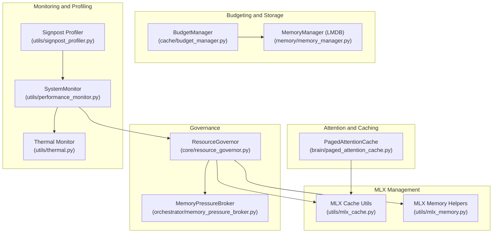

**Diagram sources**
- [paged_attention_cache.py:20-173](file://brain/paged_attention_cache.py#L20-L173)
- [resource_governor.py:200-668](file://core/resource_governor.py#L200-L668)
- [mlx_cache.py:1-465](file://utils/mlx_cache.py#L1-L465)
- [mlx_memory.py:1-332](file://utils/mlx_memory.py#L1-L332)
- [budget_manager.py:132-635](file://cache/budget_manager.py#L132-L635)
- [memory_manager.py:84-530](file://memory/memory_manager.py#L84-L530)
- [thermal.py:118-203](file://utils/thermal.py#L118-L203)
- [performance_monitor.py:240-537](file://utils/performance_monitor.py#L240-L537)
- [signpost_profiler.py:42-79](file://utils/signpost_profiler.py#L42-L79)
- [memory_pressure_broker.py:79-323](file://orchestrator/memory_pressure_broker.py#L79-L323)

**Section sources**
- [M1_8GB_MEMORY_BUDGET.md:1-136](file://M1_8GB_MEMORY_BUDGET.md#L1-L136)

## Core Components
- PagedAttentionCache: Stores top-K attention pages with configurable page size and pruning to max pages, enabling efficient long-sequence memory usage.
- ResourceGovernor: Central policy engine for unified memory accounting (UMA), hysteresis-based I/O-only mode, and thermal/gpu guards.
- MLX Cache Utilities: LRU model cache, Metal memory limits, and cleanup routines for MLX tensors and caches.
- MLX Memory Helpers: Active/peak cache memory reporting, pressure calculation, and configurable limits.
- BudgetManager: Enforces iteration/document/time/tool-call budgets and stagnation detection for autonomous workflows.
- MemoryManager (LMDB): Persistent, bounded, zero-copy storage with session isolation and TTL-based cleanup.
- Thermal Monitor and SystemMonitor: Provide thermal state and system metrics for throttling decisions.
- Signpost Profiler: Lightweight macOS profiling hooks for code sections.

**Section sources**
- [paged_attention_cache.py:20-173](file://brain/paged_attention_cache.py#L20-L173)
- [resource_governor.py:200-488](file://core/resource_governor.py#L200-L488)
- [mlx_cache.py:73-133](file://utils/mlx_cache.py#L73-L133)
- [mlx_memory.py:108-246](file://utils/mlx_memory.py#L108-L246)
- [budget_manager.py:132-446](file://cache/budget_manager.py#L132-L446)
- [memory_manager.py:84-341](file://memory/memory_manager.py#L84-L341)
- [thermal.py:118-203](file://utils/thermal.py#L118-L203)
- [performance_monitor.py:240-420](file://utils/performance_monitor.py#L240-L420)
- [signpost_profiler.py:42-79](file://utils/signpost_profiler.py#L42-L79)

## Architecture Overview
The memory optimization architecture integrates governance, caching, and monitoring to maintain stability under M1 8GB UMA constraints.

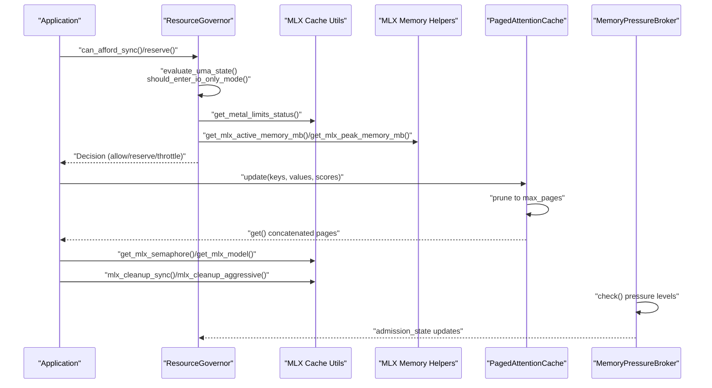

**Diagram sources**
- [resource_governor.py:314-488](file://core/resource_governor.py#L314-L488)
- [mlx_cache.py:61-133](file://utils/mlx_cache.py#L61-L133)
- [mlx_memory.py:108-182](file://utils/mlx_memory.py#L108-L182)
- [paged_attention_cache.py:58-124](file://brain/paged_attention_cache.py#L58-L124)
- [memory_pressure_broker.py:223-291](file://orchestrator/memory_pressure_broker.py#L223-L291)

## Detailed Component Analysis

### Paged Attention Cache
Implements page-based storage of attention keys/values with:
- Fixed page size and top-K scoring
- Automatic pruning to max_pages
- Concatenation of stored pages for inference
- Memory usage estimation and readiness checks

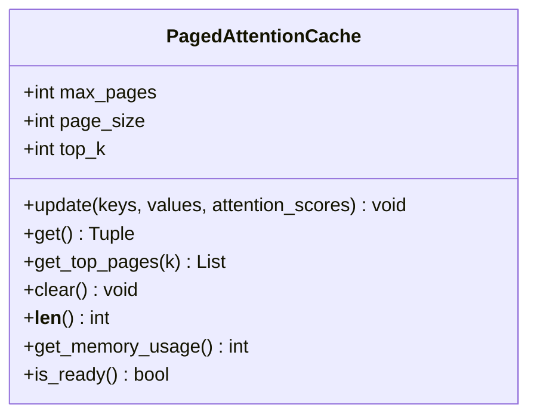

**Diagram sources**
- [paged_attention_cache.py:20-173](file://brain/paged_attention_cache.py#L20-L173)

**Section sources**
- [paged_attention_cache.py:31-173](file://brain/paged_attention_cache.py#L31-L173)

### Resource Governor (UMA Policy and Hysteresis)
Central memory governance with:
- Unified UMA accounting (system_used_gib, swap detection)
- Hysteresis-based I/O-only mode to prevent thrashing
- Priority-aware resource reservations
- Thermal and GPU temperature guards
- Alarm dispatcher for critical/emergency states

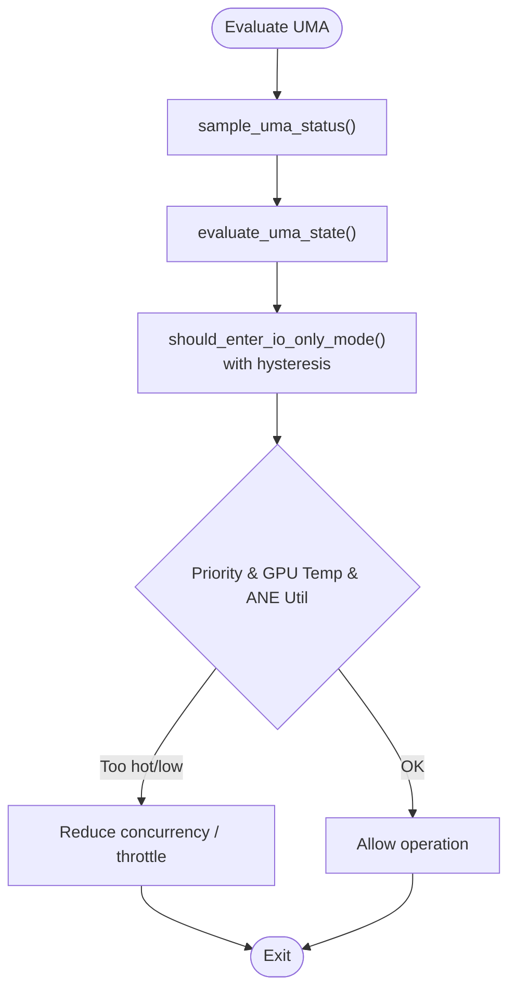

**Diagram sources**
- [resource_governor.py:314-372](file://core/resource_governor.py#L314-L372)
- [resource_governor.py:388-488](file://core/resource_governor.py#L388-L488)

**Section sources**
- [resource_governor.py:200-488](file://core/resource_governor.py#L200-L488)

### MLX Cache Management
Provides:
- LRU model cache with max 2 models and thread-safe async access
- Shared semaphore to limit concurrent MLX inference to 1
- Metal memory limits configuration (2.5 GiB cache/wired)
- Cleanup routines: canonical order gc.collect → mx.eval([]) → clear_cache
- Aggressive cleanup with temporary cache limit reduction

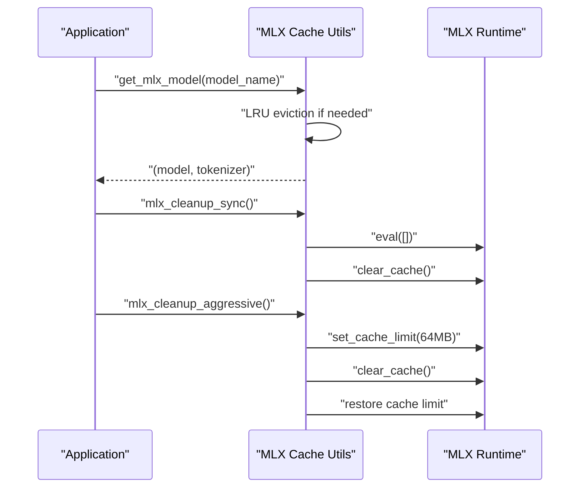

**Diagram sources**
- [mlx_cache.py:73-118](file://utils/mlx_cache.py#L73-L118)
- [mlx_cache.py:359-432](file://utils/mlx_cache.py#L359-L432)

**Section sources**
- [mlx_cache.py:61-133](file://utils/mlx_cache.py#L61-L133)
- [mlx_cache.py:177-351](file://utils/mlx_cache.py#L177-L351)
- [mlx_cache.py:359-465](file://utils/mlx_cache.py#L359-L465)

### MLX Memory Hygiene and Pressure
- Reports active/peak cache memory and computes pressure percentage
- Configurable cache/memory limits
- Debounced cache clear and limit changes to avoid thrashing

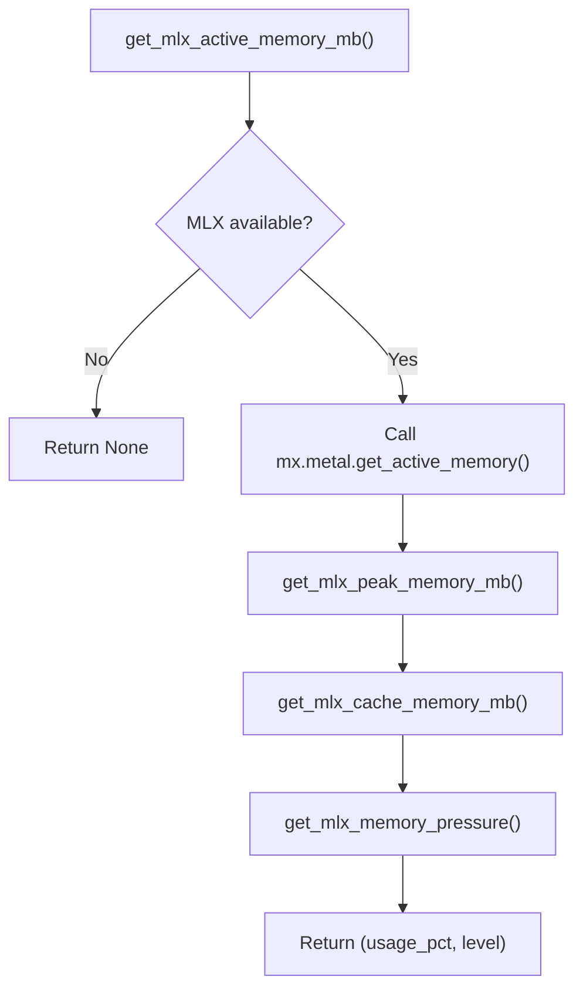

**Diagram sources**
- [mlx_memory.py:108-182](file://utils/mlx_memory.py#L108-L182)
- [mlx_memory.py:217-246](file://utils/mlx_memory.py#L217-L246)

**Section sources**
- [mlx_memory.py:108-246](file://utils/mlx_memory.py#L108-L246)

### Budget Manager (Autonomous Workflow Control)
Tracks and enforces:
- Iterations, documents, time, tool calls
- Confidence thresholds and stagnation detection
- Jaccard novelty and drift alerts
- Utilization and stop reason reporting

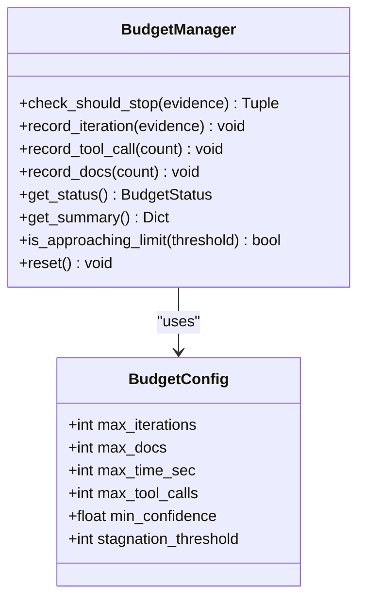

**Diagram sources**
- [budget_manager.py:132-446](file://cache/budget_manager.py#L132-L446)

**Section sources**
- [budget_manager.py:132-446](file://cache/budget_manager.py#L132-L446)

### Persistent Memory Manager (LMDB)
- Session-scoped isolation with TTL-based cleanup
- Zero-copy reads and bounded key counts
- Asynchronous operations with thread safety
- Export and history retrieval for sessions

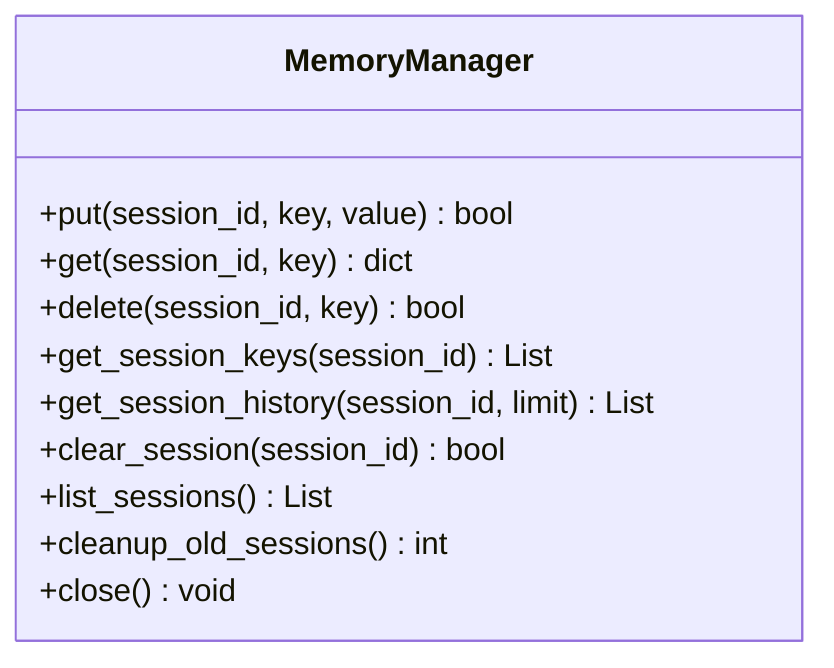

**Diagram sources**
- [memory_manager.py:84-341](file://memory/memory_manager.py#L84-L341)

**Section sources**
- [memory_manager.py:84-341](file://memory/memory_manager.py#L84-L341)

### Thermal and System Monitoring
- Thermal monitor: macOS thermal state with fallbacks
- SystemMonitor: CPU/memory pressure, thermal state, and recommendations
- Signpost profiler: lightweight macOS profiling with deterministic codes

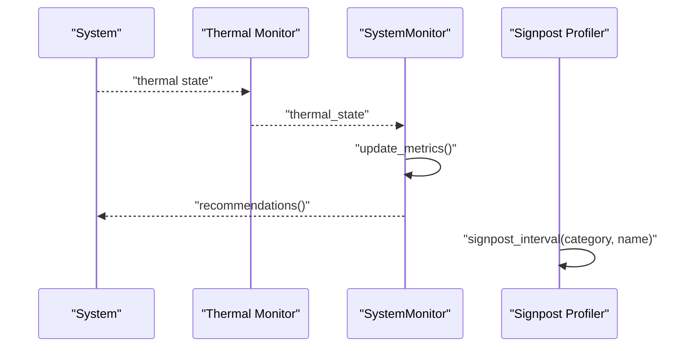

**Diagram sources**
- [thermal.py:118-203](file://utils/thermal.py#L118-L203)
- [performance_monitor.py:240-420](file://utils/performance_monitor.py#L240-L420)
- [signpost_profiler.py:42-79](file://utils/signpost_profiler.py#L42-L79)

**Section sources**
- [thermal.py:118-203](file://utils/thermal.py#L118-L203)
- [performance_monitor.py:240-420](file://utils/performance_monitor.py#L240-L420)
- [signpost_profiler.py:42-79](file://utils/signpost_profiler.py#L42-L79)

### Memory Pressure Broker
- Polling-based memory pressure detection (fallback path)
- Admission states: NORMAL, THROTTLED, SUSPEND_LOW_PRIORITY, EMERGENCY_CLEANUP_REQUESTED
- Budget throttle factors and low-priority suspension controls

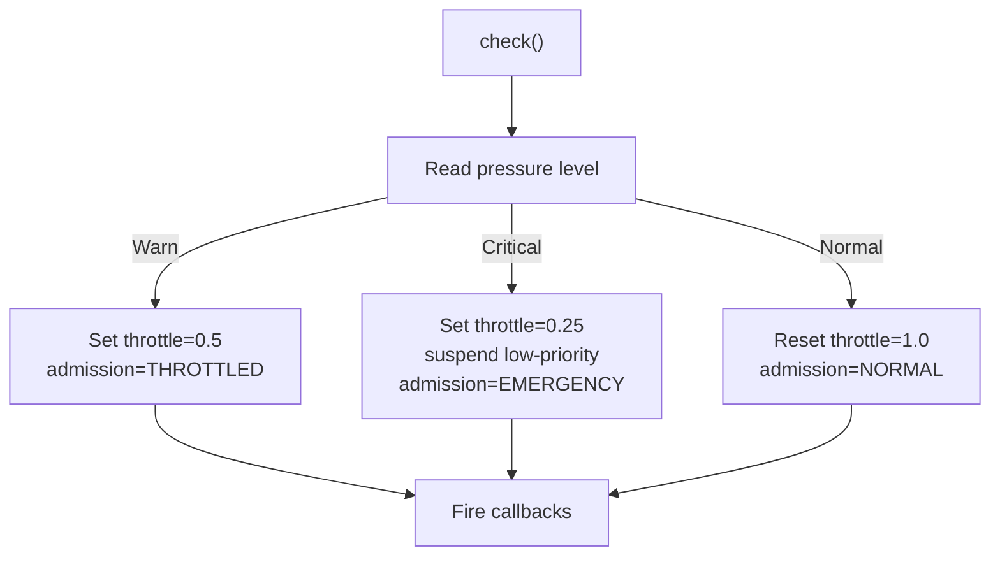

**Diagram sources**
- [memory_pressure_broker.py:223-291](file://orchestrator/memory_pressure_broker.py#L223-L291)

**Section sources**
- [memory_pressure_broker.py:79-323](file://orchestrator/memory_pressure_broker.py#L79-L323)

## Dependency Analysis
Key authority boundaries and relationships:
- Canonical UMA policy owner: core/resource_governor.py
- Raw sampler: utils/uma_budget.py
- MLX cache helper: utils/mlx_cache.py
- Layer system memory surface: layers/memory_layer.py
- Allocator/coordinator: coordinators/memory_coordinator.py
- Legacy AO components: not part of canonical path

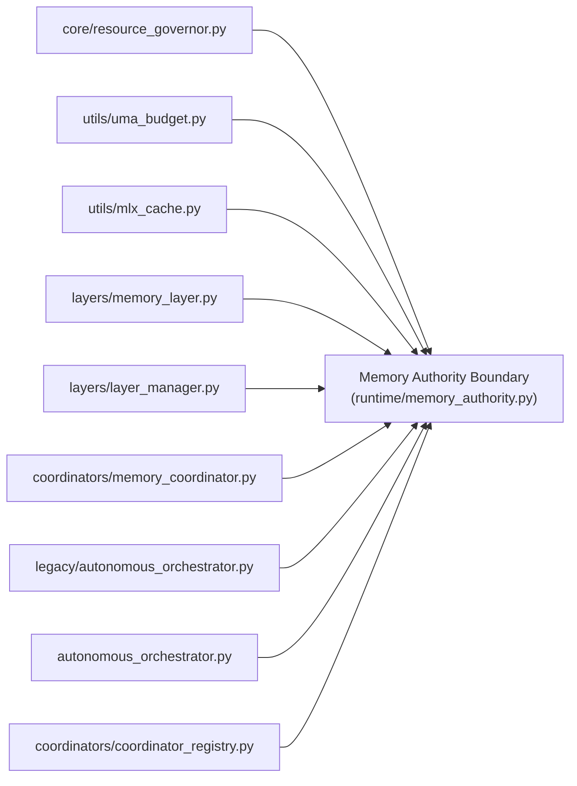

**Diagram sources**
- [memory_authority.py:37-72](file://runtime/memory_authority.py#L37-L72)

**Section sources**
- [memory_authority.py:37-72](file://runtime/memory_authority.py#L37-L72)

## Performance Considerations
- Use PagedAttentionCache to bound memory growth during long sequences by pruning to top-scoring pages.
- Configure MLX Metal cache/wired limits to 2.5 GiB each to leave headroom for model weights and reduce fragmentation.
- Employ ResourceGovernor’s hysteresis to avoid thrashing near critical thresholds; leverage I/O-only mode when swap is detected.
- Apply BudgetManager to cap iterations/documents/time/tool calls and detect stagnation early.
- Use MemoryManager’s bounded sessions and TTL cleanup to prevent unbounded persistence growth.
- Monitor thermal state and system metrics; reduce concurrency or throttle when thermal or memory pressure increases.
- Profile with Signpost Profiler to identify hotspots and track memory-related durations.

[No sources needed since this section provides general guidance]

## Troubleshooting Guide
Common issues and remedies:
- Out-of-memory (OOM) during MLX inference
  - Ensure Metal limits are configured before inference and use canonical cleanup order.
  - Use aggressive cleanup when encountering fragmentation spikes.
  - Verify ResourceGovernor’s thermal and GPU temperature guards are not preventing operations.
  - References: [mlx_cache.py:359-432](file://utils/mlx_cache.py#L359-L432), [resource_governor.py:240-284](file://core/resource_governor.py#L240-L284)

- Excessive memory pressure and throttling
  - Check MemoryPressureBroker admission state and budget throttle factor.
  - Review SystemMonitor recommendations and thermal state.
  - References: [memory_pressure_broker.py:223-291](file://orchestrator/memory_pressure_broker.py#L223-L291), [performance_monitor.py:398-420](file://utils/performance_monitor.py#L398-L420)

- Long-sequence memory growth
  - Tune PagedAttentionCache max_pages/page_size/top_k to balance accuracy and memory.
  - References: [paged_attention_cache.py:31-105](file://brain/paged_attention_cache.py#L31-L105)

- Persistent memory leaks
  - Use MemoryManager’s TTL-based cleanup and session clearing.
  - References: [memory_manager.py:373-408](file://memory/memory_manager.py#L373-L408)

- Benchmark and validation
  - Run the MLX stream UMA probe to measure RSS/Metal deltas.
  - Validate governor decisions with probe tests.
  - References: [m1_mlx_stream_uma_probe.py:69-166](file://benchmarks/m1_mlx_stream_uma_probe.py#L69-L166), [test_m1_resource_governor.py:34-181](file://tests/probe_f202j/test_m1_resource_governor.py#L34-L181), [test_m1_mission_budget.py:120-227](file://tests/probe_f204j/test_m1_mission_budget.py#L120-L227)

**Section sources**
- [mlx_cache.py:359-432](file://utils/mlx_cache.py#L359-L432)
- [resource_governor.py:240-284](file://core/resource_governor.py#L240-L284)
- [memory_pressure_broker.py:223-291](file://orchestrator/memory_pressure_broker.py#L223-L291)
- [performance_monitor.py:398-420](file://utils/performance_monitor.py#L398-L420)
- [paged_attention_cache.py:31-105](file://brain/paged_attention_cache.py#L31-L105)
- [memory_manager.py:373-408](file://memory/memory_manager.py#L373-L408)
- [m1_mlx_stream_uma_probe.py:69-166](file://benchmarks/m1_mlx_stream_uma_probe.py#L69-L166)
- [test_m1_resource_governor.py:34-181](file://tests/probe_f202j/test_m1_resource_governor.py#L34-L181)
- [test_m1_mission_budget.py:120-227](file://tests/probe_f204j/test_m1_mission_budget.py#L120-L227)

## Conclusion
The platform provides a robust, layered approach to memory optimization on Apple Silicon:
- Governance ensures safe resource usage with UMA-aware policies and hysteresis.
- Caching strategies (paged attention and MLX cache) minimize memory footprint.
- Monitoring and profiling enable proactive mitigation of thermal and memory pressure.
- Configuration options allow tuning for M1 8GB constraints, with validated defaults and thresholds.

[No sources needed since this section summarizes without analyzing specific files]

## Appendices

### Configuration Options and Tunables
- PagedAttentionCache
  - max_pages: upper bound on stored pages
  - page_size: tokens per page
  - top_k: number of top pages retained
  - Reference: [paged_attention_cache.py:31-47](file://brain/paged_attention_cache.py#L31-L47)

- ResourceGovernor
  - memory_high_water_mb: RAM budget threshold per priority
  - thermal_threshold: GPU temperature guard threshold
  - Reference: [resource_governor.py:204-217](file://core/resource_governor.py#L204-L217)

- MLX Cache and Limits
  - Metal cache_limit/wired_limit: 2.5 GiB each (bytes)
  - Semaphore: concurrency limit 1 for MLX inference
  - Reference: [mlx_cache.py:177-196](file://utils/mlx_cache.py#L177-L196), [mlx_cache.py:61-70](file://utils/mlx_cache.py#L61-L70)

- MLX Memory Helpers
  - configure_mlx_limits(cache_limit_mb, memory_limit_mb)
  - Debounced cache clear and limit changes
  - Reference: [mlx_memory.py:217-246](file://utils/mlx_memory.py#L217-L246), [mlx_memory.py:270-303](file://utils/mlx_memory.py#L270-L303)

- BudgetManager
  - max_iterations, max_docs, max_time_sec, max_tool_calls, min_confidence, stagnation_threshold
  - Reference: [budget_manager.py:79-89](file://cache/budget_manager.py#L79-L89)

- MemoryManager (LMDB)
  - map_size, max_keys_per_session, max_sessions, session_ttl_days
  - Reference: [memory_manager.py:92-124](file://memory/memory_manager.py#L92-L124)

**Section sources**
- [paged_attention_cache.py:31-47](file://brain/paged_attention_cache.py#L31-L47)
- [resource_governor.py:204-217](file://core/resource_governor.py#L204-L217)
- [mlx_cache.py:177-196](file://utils/mlx_cache.py#L177-L196)
- [mlx_cache.py:61-70](file://utils/mlx_cache.py#L61-L70)
- [mlx_memory.py:217-246](file://utils/mlx_memory.py#L217-L246)
- [mlx_memory.py:270-303](file://utils/mlx_memory.py#L270-L303)
- [budget_manager.py:79-89](file://cache/budget_manager.py#L79-L89)
- [memory_manager.py:92-124](file://memory/memory_manager.py#L92-L124)

### Memory-Efficient Inference Patterns
- Warm up MLX buffers before inference to stabilize Metal limits.
- Use PagedAttentionCache for long-context generation; prune aggressively.
- Apply ResourceGovernor’s reserve pattern to gate expensive operations.
- Monitor thermal and memory pressure; reduce concurrency or throttle when needed.
- Use MemoryManager for bounded persistence and periodic cleanup.

**Section sources**
- [M1_8GB_MEMORY_BUDGET.md:67-96](file://M1_8GB_MEMORY_BUDGET.md#L67-L96)
- [mlx_cache.py:322-351](file://utils/mlx_cache.py#L322-L351)
- [resource_governor.py:286-307](file://core/resource_governor.py#L286-L307)
- [performance_monitor.py:398-420](file://utils/performance_monitor.py#L398-L420)