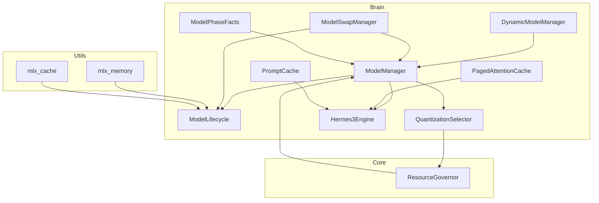
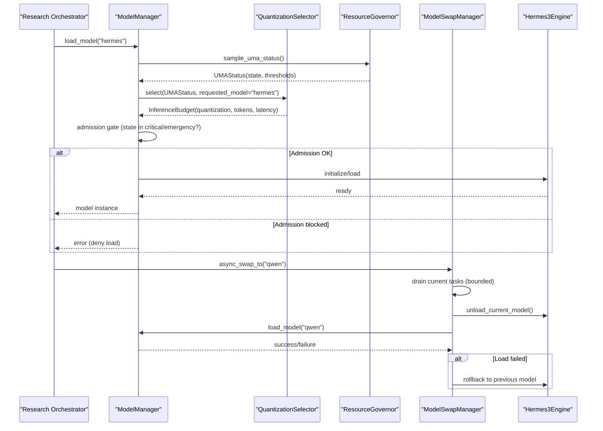
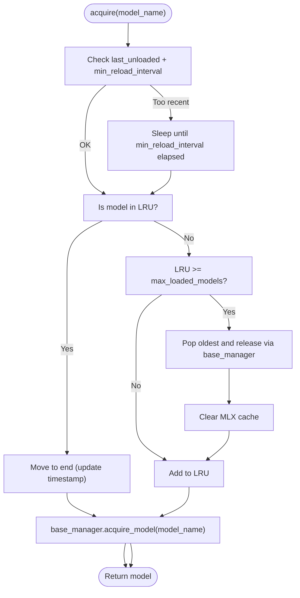
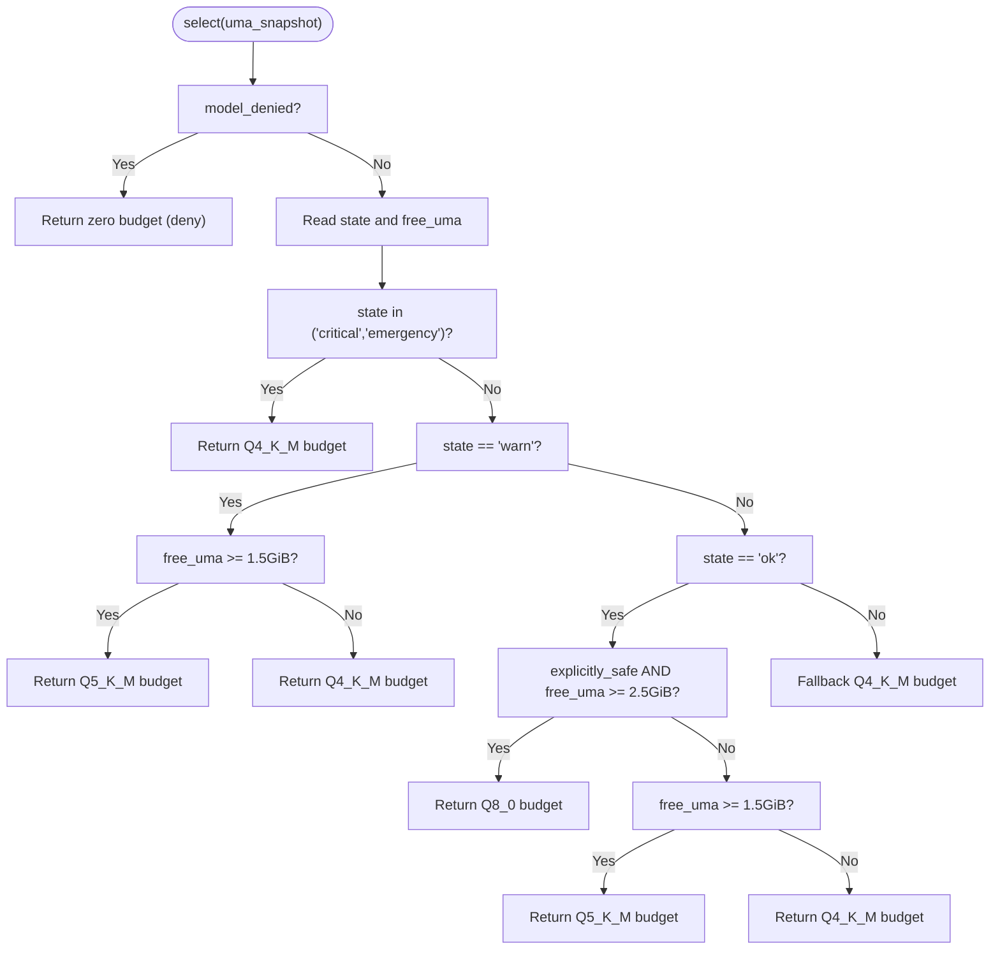
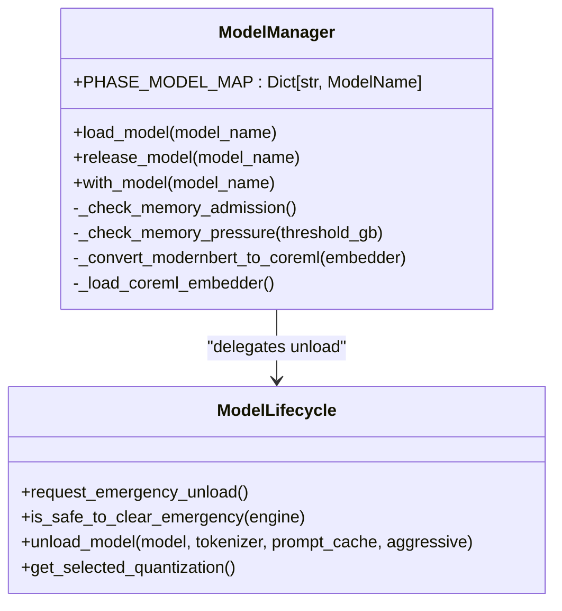
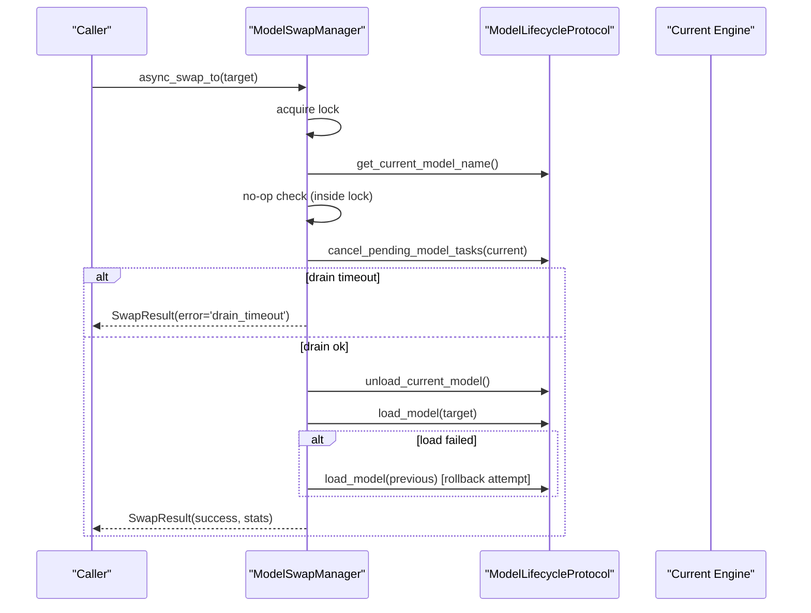
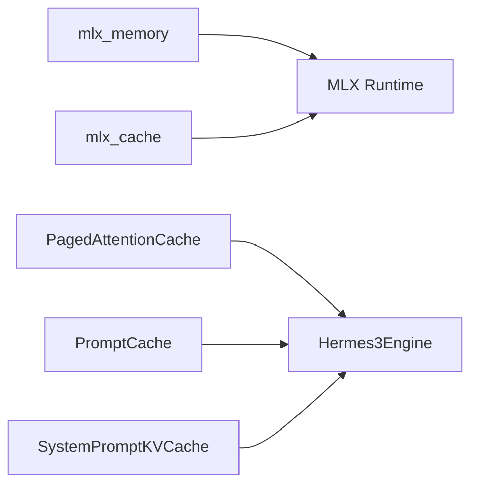
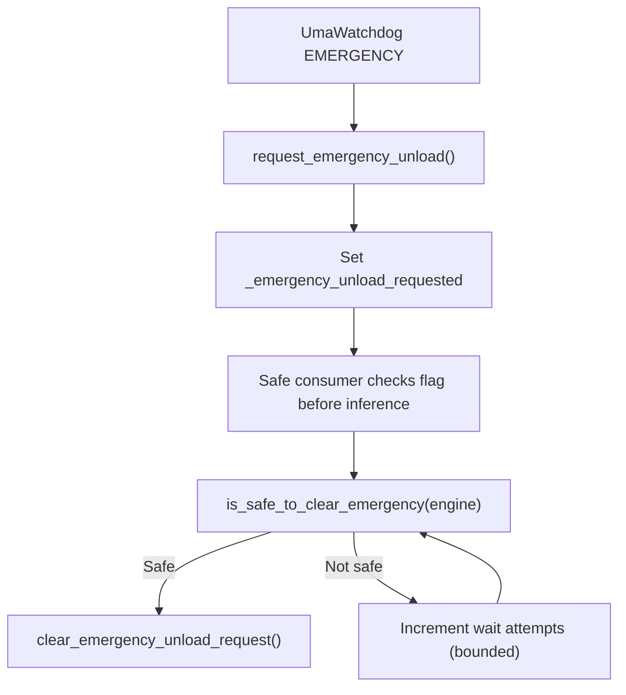
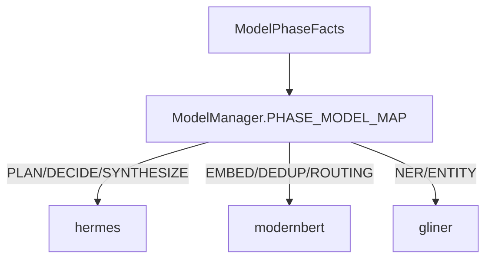
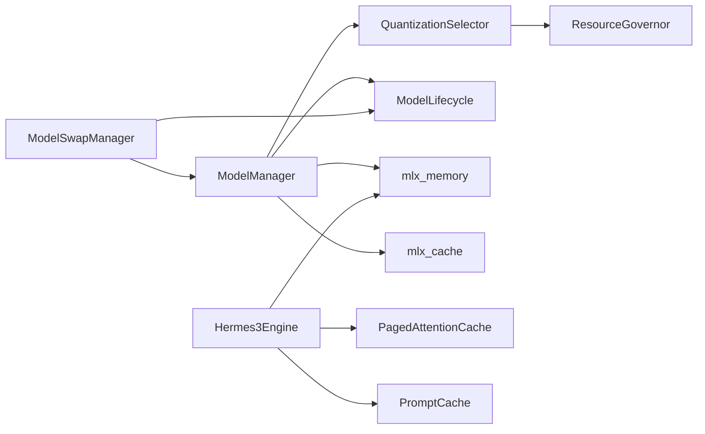

# Dynamic Model Handling

<cite>
**Referenced Files in This Document**
- [dynamic_model_manager.py](file://brain/dynamic_model_manager.py)
- [quantization_selector.py](file://brain/quantization_selector.py)
- [model_manager.py](file://brain/model_manager.py)
- [model_lifecycle.py](file://brain/model_lifecycle.py)
- [model_swap_manager.py](file://brain/model_swap_manager.py)
- [model_phase_facts.py](file://brain/model_phase_facts.py)
- [paged_attention_cache.py](file://brain/paged_attention_cache.py)
- [prompt_cache.py](file://brain/prompt_cache.py)
- [mlx_memory.py](file://utils/mlx_memory.py)
- [mlx_cache.py](file://utils/mlx_cache.py)
- [resource_governor.py](file://core/resource_governor.py)
- [hermes3_engine.py](file://brain/hermes3_engine.py)
</cite>

## Table of Contents
1. [Introduction](#introduction)
2. [Project Structure](#project-structure)
3. [Core Components](#core-components)
4. [Architecture Overview](#architecture-overview)
5. [Detailed Component Analysis](#detailed-component-analysis)
6. [Dependency Analysis](#dependency-analysis)
7. [Performance Considerations](#performance-considerations)
8. [Troubleshooting Guide](#troubleshooting-guide)
9. [Conclusion](#conclusion)

## Introduction
This document explains the dynamic model handling system used during research cycles, focusing on runtime model switching, memory optimization, and adaptive model selection. It covers:
- Seamless transitions between models using a centralized manager and a race-free swap arbiter
- Quantization selection driven by system resources and governance decisions
- Memory optimization techniques including CoreML conversion, ANE acceleration, and KV cache compression
- Emergency unload handling and fail-safe operations
- Configuration options for model switching and performance tuning

## Project Structure
The dynamic model handling spans several modules:
- Brain modules manage model lifecycle, selection, and swapping
- Utils modules provide MLX memory hygiene and cache controls
- Core modules govern resource usage and UMA state
- Prompt and KV cache utilities optimize inference overhead

**Diagram sources**
- [dynamic_model_manager.py:201-423](file://brain/dynamic_model_manager.py#L201-L423)
- [model_manager.py:178-800](file://brain/model_manager.py#L178-L800)
- [model_lifecycle.py:1-929](file://brain/model_lifecycle.py#L1-L929)
- [quantization_selector.py:117-234](file://brain/quantization_selector.py#L117-L234)
- [model_swap_manager.py:154-420](file://brain/model_swap_manager.py#L154-L420)
- [model_phase_facts.py:1-213](file://brain/model_phase_facts.py#L1-L213)
- [paged_attention_cache.py:20-173](file://brain/paged_attention_cache.py#L20-L173)
- [prompt_cache.py:48-257](file://brain/prompt_cache.py#L48-L257)
- [mlx_memory.py:1-332](file://utils/mlx_memory.py#L1-L332)
- [mlx_cache.py:1-465](file://utils/mlx_cache.py#L1-L465)
- [resource_governor.py:1-668](file://core/resource_governor.py#L1-L668)

**Section sources**
- [dynamic_model_manager.py:1-423](file://brain/dynamic_model_manager.py#L1-L423)
- [model_manager.py:1-800](file://brain/model_manager.py#L1-L800)
- [model_lifecycle.py:1-929](file://brain/model_lifecycle.py#L1-L929)
- [quantization_selector.py:1-234](file://brain/quantization_selector.py#L1-L234)
- [model_swap_manager.py:1-420](file://brain/model_swap_manager.py#L1-L420)
- [model_phase_facts.py:1-213](file://brain/model_phase_facts.py#L1-L213)
- [paged_attention_cache.py:1-173](file://brain/paged_attention_cache.py#L1-L173)
- [prompt_cache.py:1-257](file://brain/prompt_cache.py#L1-L257)
- [mlx_memory.py:1-332](file://utils/mlx_memory.py#L1-L332)
- [mlx_cache.py:1-465](file://utils/mlx_cache.py#L1-L465)
- [resource_governor.py:1-668](file://core/resource_governor.py#L1-L668)

## Core Components
- DynamicModelManager: LRU-based cache with idle timeouts and thrashing protection; integrates with a base model manager to load/unload models and clear MLX cache.
- ModelManager: Central model lifecycle owner with phase-to-model mapping, memory admission gates, and CoreML/ANE conversion helpers.
- ModelLifecycle: Shadow-state and emergency unload seam; delegates canonical unload to engines; tracks selected quantization for governance visibility.
- QuantizationSelector: Advisory quantization and inference budget selector based on UMA snapshots; policy-driven fallbacks and safety checks.
- ModelSwapManager: Single arbiter for race-free model swaps with drain, unload, load, and rollback semantics.
- Memory Utilities: mlx_memory and mlx_cache provide MLX memory hygiene, limits, and cache controls.
- ResourceGovernor: UMA state evaluation, hysteresis, and alarm dispatch for CRITICAL/EMERGENCY.
- Caches: PagedAttentionCache and PromptCache reduce recomputation and memory footprint.

**Section sources**
- [dynamic_model_manager.py:201-423](file://brain/dynamic_model_manager.py#L201-L423)
- [model_manager.py:178-800](file://brain/model_manager.py#L178-L800)
- [model_lifecycle.py:1-929](file://brain/model_lifecycle.py#L1-L929)
- [quantization_selector.py:117-234](file://brain/quantization_selector.py#L117-L234)
- [model_swap_manager.py:154-420](file://brain/model_swap_manager.py#L154-L420)
- [mlx_memory.py:1-332](file://utils/mlx_memory.py#L1-L332)
- [mlx_cache.py:1-465](file://utils/mlx_cache.py#L1-L465)
- [resource_governor.py:1-668](file://core/resource_governor.py#L1-L668)
- [paged_attention_cache.py:20-173](file://brain/paged_attention_cache.py#L20-L173)
- [prompt_cache.py:48-257](file://brain/prompt_cache.py#L48-L257)

## Architecture Overview
The system enforces workflow-level ownership and phase-based model mapping while enabling adaptive selection and safe transitions:
- Workflow-level ownership: ModelManager owns acquire/load; ModelLifecycle owns unload/cleanup; QuantizationSelector advises load decisions.
- Adaptive selection: QuantizationSelector chooses quantization and budgets based on UMA state and governor signals.
- Safe transitions: ModelSwapManager coordinates drain, unload, load, and rollback to avoid dual-loading and race conditions.
- Memory hygiene: MLX memory utilities and cache controls ensure stable operation on M1 8GB.

**Diagram sources**
- [model_manager.py:547-712](file://brain/model_manager.py#L547-L712)
- [quantization_selector.py:129-227](file://brain/quantization_selector.py#L129-L227)
- [resource_governor.py:388-488](file://core/resource_governor.py#L388-L488)
- [model_swap_manager.py:198-343](file://brain/model_swap_manager.py#L198-L343)
- [hermes3_engine.py:142-200](file://brain/hermes3_engine.py#L142-L200)

## Detailed Component Analysis

### DynamicModelManager
- Purpose: LRU cache with idle timeouts and thrashing protection; integrates with a base manager to load/unload models and clear MLX cache.
- Key behaviors:
  - LRU eviction when exceeding max_loaded_models
  - Thrashing protection using min_reload_interval
  - Idle timeout cleanup loop
  - Force unload with MLX cache clear
  - Context manager to update timestamps on usage
- Memory hygiene: Clears MLX Metal cache after unload and idle cleanup.

**Diagram sources**
- [dynamic_model_manager.py:268-313](file://brain/dynamic_model_manager.py#L268-L313)

**Section sources**
- [dynamic_model_manager.py:201-423](file://brain/dynamic_model_manager.py#L201-L423)

### QuantizationSelector
- Purpose: Advisory quantization and inference budget selector based on UMA snapshots.
- Policy:
  - CRITICAL/EMERGENCY: Q4_K_M with constrained budgets
  - WARN with sufficient free UMA: Q5_K_M
  - OK with explicit safety and sufficient free UMA: Q8_0
  - Otherwise: Q4_K_M fallback
- Safety: Always-on, fail-soft; returns a budget even on errors.

**Diagram sources**
- [quantization_selector.py:129-227](file://brain/quantization_selector.py#L129-L227)

**Section sources**
- [quantization_selector.py:117-234](file://brain/quantization_selector.py#L117-L234)

### ModelManager
- Purpose: Central model lifecycle owner with strict 1-model-at-a-time policy on M1 8GB.
- Ownership closure and phase mapping:
  - Workflow-level mapping: PLAN/DECIDE/SYNTHESIZE → hermes; EMBED/DEDUP/ROUTING → modernbert; NER/ENTITY → gliner
  - Canonical unload owner: engine.unload() via ModelLifecycle
  - Emergency seam: model_lifecycle watchdog flag
- Memory guards:
  - Admission gate: fail-fast at CRITICAL/EMERGENCY
  - Soft pressure: MLX cache clear when low RAM
  - RSS verification: drop verification after unload
- CoreML/ANE:
  - CoreML model path and conversion helper for ModernBERT
  - MPS cache directory and ANE compile tracking

**Diagram sources**
- [model_manager.py:178-800](file://brain/model_manager.py#L178-L800)
- [model_lifecycle.py:108-528](file://brain/model_lifecycle.py#L108-L528)

**Section sources**
- [model_manager.py:178-800](file://brain/model_manager.py#L178-L800)
- [model_lifecycle.py:108-528](file://brain/model_lifecycle.py#L108-L528)

### ModelSwapManager
- Purpose: Race-free arbiter for model swaps with drain, unload, load, and rollback.
- Protocol:
  - Double-checked lock; re-read current inside lock
  - Bounded drain with timeout
  - Strict order: drain → unload → load
  - Rollback on load failure
- Status and results: typed SwapResult and SwapStatus for observability.

**Diagram sources**
- [model_swap_manager.py:198-343](file://brain/model_swap_manager.py#L198-L343)

**Section sources**
- [model_swap_manager.py:154-420](file://brain/model_swap_manager.py#L154-L420)

### Memory Optimization and KV Cache Compression
- MLX memory hygiene:
  - mlx_memory: get/set MLX memory metrics and limits; debounced cache clear
  - mlx_cache: shared LRU cache for models, semaphore for concurrency, Metal limits configuration
- KV cache compression:
  - PagedAttentionCache: page-based storage of keys/values with top-K scoring and pruning
  - PromptCache: trigram-based approximate embeddings and cosine similarity for reuse
  - SystemPromptKVCache: token prefix cache for repeated system prompts

**Diagram sources**
- [mlx_memory.py:77-215](file://utils/mlx_memory.py#L77-L215)
- [mlx_cache.py:322-465](file://utils/mlx_cache.py#L322-L465)
- [paged_attention_cache.py:20-173](file://brain/paged_attention_cache.py#L20-L173)
- [prompt_cache.py:48-257](file://brain/prompt_cache.py#L48-L257)
- [hermes3_engine.py:142-200](file://brain/hermes3_engine.py#L142-L200)

**Section sources**
- [mlx_memory.py:1-332](file://utils/mlx_memory.py#L1-L332)
- [mlx_cache.py:1-465](file://utils/mlx_cache.py#L1-L465)
- [paged_attention_cache.py:1-173](file://brain/paged_attention_cache.py#L1-L173)
- [prompt_cache.py:1-257](file://brain/prompt_cache.py#L1-L257)
- [hermes3_engine.py:1-200](file://brain/hermes3_engine.py#L1-L200)

### Emergency Unload and Fail-Safe Operations
- ModelLifecycle emergency seam:
  - request_emergency_unload() sets a flag and invokes a registered callback
  - is_safe_to_clear_emergency() checks engine readiness with bounded wait
  - clear_emergency_unload_request() resets the flag and wait counter
- ModelManager and ModelLifecycle integrate emergency unload into unload paths.

**Diagram sources**
- [model_lifecycle.py:108-190](file://brain/model_lifecycle.py#L108-L190)

**Section sources**
- [model_lifecycle.py:95-204](file://brain/model_lifecycle.py#L95-L204)

### Phase-Based Model Mapping and Workflow-Level Ownership
- ModelManager defines PHASE_MODEL_MAP for workflow-level ownership.
- ModelPhaseFacts provides helpers to classify and validate phases across layers and prevent cross-layer mapping errors.

**Diagram sources**
- [model_manager.py:246-255](file://brain/model_manager.py#L246-L255)
- [model_phase_facts.py:67-131](file://brain/model_phase_facts.py#L67-L131)

**Section sources**
- [model_manager.py:206-255](file://brain/model_manager.py#L206-L255)
- [model_phase_facts.py:1-213](file://brain/model_phase_facts.py#L1-L213)

## Dependency Analysis
- QuantizationSelector depends on ResourceGovernor for UMA snapshots and returns budgets used by ModelManager to decide loads.
- ModelManager depends on ModelLifecycle for canonical unload and on QuantizationSelector for advisory quantization.
- ModelSwapManager depends on ModelLifecycleProtocol to coordinate drains, unloads, and loads.
- Memory utilities are used across ModelManager, ModelLifecycle, and Hermes3Engine for hygiene and limits.

**Diagram sources**
- [quantization_selector.py:129-227](file://brain/quantization_selector.py#L129-L227)
- [resource_governor.py:388-488](file://core/resource_governor.py#L388-L488)
- [model_manager.py:547-712](file://brain/model_manager.py#L547-L712)
- [model_lifecycle.py:438-528](file://brain/model_lifecycle.py#L438-L528)
- [model_swap_manager.py:198-343](file://brain/model_swap_manager.py#L198-L343)
- [mlx_memory.py:77-215](file://utils/mlx_memory.py#L77-L215)
- [mlx_cache.py:322-465](file://utils/mlx_cache.py#L322-L465)
- [hermes3_engine.py:142-200](file://brain/hermes3_engine.py#L142-L200)
- [paged_attention_cache.py:20-173](file://brain/paged_attention_cache.py#L20-L173)
- [prompt_cache.py:48-257](file://brain/prompt_cache.py#L48-L257)

**Section sources**
- [quantization_selector.py:117-234](file://brain/quantization_selector.py#L117-L234)
- [resource_governor.py:1-668](file://core/resource_governor.py#L1-L668)
- [model_manager.py:178-800](file://brain/model_manager.py#L178-L800)
- [model_lifecycle.py:1-929](file://brain/model_lifecycle.py#L1-L929)
- [model_swap_manager.py:154-420](file://brain/model_swap_manager.py#L154-L420)
- [mlx_memory.py:1-332](file://utils/mlx_memory.py#L1-L332)
- [mlx_cache.py:1-465](file://utils/mlx_cache.py#L1-L465)
- [hermes3_engine.py:1-200](file://brain/hermes3_engine.py#L1-L200)
- [paged_attention_cache.py:1-173](file://brain/paged_attention_cache.py#L1-L173)
- [prompt_cache.py:1-257](file://brain/prompt_cache.py#L1-L257)

## Performance Considerations
- Concurrency and memory limits:
  - Shared MLX semaphore limits concurrent inference to 1 to prevent memory overflow on M1 8GB.
  - Metal cache and wired limits configured to 2.5 GiB each to leave headroom for model weights.
- Memory hygiene:
  - Debounced MLX cache clears and configurable cache limits reduce thrash.
  - Canonical cleanup order: gc.collect() → mx.eval([]) → clear_cache().
- KV cache compression:
  - PagedAttentionCache prunes to top-scoring pages and estimates memory usage.
  - PromptCache uses trigram embeddings and cosine similarity to reuse prior generations.
- Admission gating:
  - Fail-fast admission gate at CRITICAL/EMERGENCY; soft gate clears MLX cache below thresholds.

[No sources needed since this section provides general guidance]

## Troubleshooting Guide
Common issues and remedies:
- OOM or thrash during model load:
  - Verify ResourceGovernor state and admission gate; consider lowering concurrency or enabling CoreML conversion.
- Frequent reload thrash:
  - Increase min_reload_interval or tune LRU capacity in DynamicModelManager.
- Emergency unload stuck:
  - Ensure is_safe_to_clear_emergency() returns True; check engine attributes and bounded wait attempts.
- KV cache growth:
  - Tune PagedAttentionCache max_pages/page_size/top_k; enable SystemPromptKVCache for repeated prompts.
- MLX cache fragmentation:
  - Use aggressive cleanup or debounced cache clear; verify Metal limits are applied.

**Section sources**
- [model_manager.py:365-426](file://brain/model_manager.py#L365-L426)
- [dynamic_model_manager.py:268-313](file://brain/dynamic_model_manager.py#L268-L313)
- [model_lifecycle.py:147-190](file://brain/model_lifecycle.py#L147-L190)
- [mlx_cache.py:391-432](file://utils/mlx_cache.py#L391-L432)
- [mlx_memory.py:270-304](file://utils/mlx_memory.py#L270-L304)
- [paged_attention_cache.py:94-106](file://brain/paged_attention_cache.py#L94-L106)
- [prompt_cache.py:190-200](file://brain/prompt_cache.py#L190-L200)

## Conclusion
The dynamic model handling system combines strict ownership, adaptive selection, and robust memory hygiene to enable seamless model transitions during research cycles. By enforcing workflow-level ownership, coordinating swaps with a race-free arbiter, and leveraging governance-driven quantization, the system maintains stability on constrained hardware while optimizing performance through KV cache compression and MLX memory controls.