# Model Lifecycle Management

<cite>
**Referenced Files in This Document**
- [model_manager.py](file://brain/model_manager.py)
- [model_lifecycle.py](file://brain/model_lifecycle.py)
- [dynamic_model_manager.py](file://brain/dynamic_model_manager.py)
- [model_swap_manager.py](file://brain/model_swap_manager.py)
- [quantization_selector.py](file://brain/quantization_selector.py)
- [exceptions.py](file://utils/exceptions.py)
- [M1_8GB_MEMORY_BUDGET.md](file://M1_8GB_MEMORY_BUDGET.md)
- [resource_governor.py](file://core/resource_governor.py)
- [mlx_cache.py](file://utils/mlx_cache.py)
- [hermes3_engine.py](file://brain/hermes3_engine.py)
</cite>

## Table of Contents
1. [Introduction](#introduction)
2. [Project Structure](#project-structure)
3. [Core Components](#core-components)
4. [Architecture Overview](#architecture-overview)
5. [Detailed Component Analysis](#detailed-component-analysis)
6. [Dependency Analysis](#dependency-analysis)
7. [Performance Considerations](#performance-considerations)
8. [Troubleshooting Guide](#troubleshooting-guide)
9. [Conclusion](#conclusion)
10. [Appendices](#appendices)

## Introduction
This document describes the model lifecycle management system designed for M1 8GB stability and memory constraints. It covers the complete lifecycle from initialization through cleanup, including singleton management, thread-safe operations, the strict one-model-at-a-time policy, memory admission gates, quantization selection, model validation, release procedures, memory verification, garbage collection, context managers, error handling, memory pressure detection, and practical integration patterns for custom models.

## Project Structure
The model lifecycle spans several modules:
- Central lifecycle orchestration and singleton management
- Memory admission and quantization selection
- Emergency unload seam and structured generation sidecar
- Dynamic model manager with LRU and thrash prevention
- Model swap arbiter for race-free Qwen↔Hermes transitions
- Resource governor for UMA state and hysteresis
- MLX initialization and memory budgeting

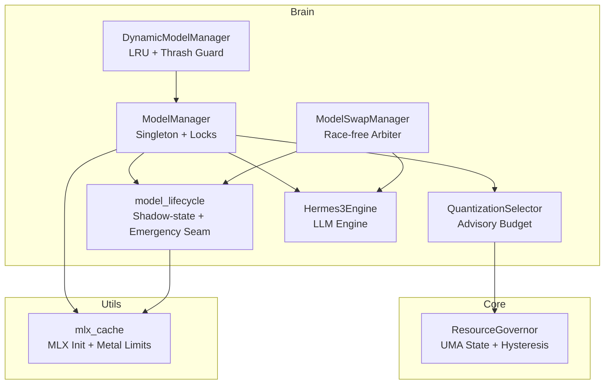

**Diagram sources**
- [model_manager.py](file://brain/model_manager.py)
- [model_lifecycle.py](file://brain/model_lifecycle.py)
- [dynamic_model_manager.py](file://brain/dynamic_model_manager.py)
- [model_swap_manager.py](file://brain/model_swap_manager.py)
- [quantization_selector.py](file://brain/quantization_selector.py)
- [resource_governor.py](file://core/resource_governor.py)
- [mlx_cache.py](file://utils/mlx_cache.py)
- [hermes3_engine.py](file://brain/hermes3_engine.py)

**Section sources**
- [model_manager.py](file://brain/model_manager.py)
- [model_lifecycle.py](file://brain/model_lifecycle.py)
- [dynamic_model_manager.py](file://brain/dynamic_model_manager.py)
- [model_swap_manager.py](file://brain/model_swap_manager.py)
- [quantization_selector.py](file://brain/quantization_selector.py)
- [resource_governor.py](file://core/resource_governor.py)
- [mlx_cache.py](file://utils/mlx_cache.py)
- [hermes3_engine.py](file://brain/hermes3_engine.py)

## Core Components
- ModelManager: Singleton orchestrator enforcing strict one-model-at-a-time, thread-safe load/release, memory guards, and cleanup.
- model_lifecycle: Shadow-state, emergency unload seam, MLX runtime initialization helper, and structured generation sidecar.
- DynamicModelManager: LRU cache with idle timeouts and thrash prevention for multiple model families.
- ModelSwapManager: Single arbiter for race-free model swaps with drain, unload, load, and rollback semantics.
- QuantizationSelector: Advisory quantization and inference budget selection based on UMA snapshots.
- ResourceGovernor: UMA state evaluation, hysteresis, IO-only mode, and alarm dispatch.
- MLX utilities: Metal memory limits, buffer initialization, and cleanup ordering.

**Section sources**
- [model_manager.py](file://brain/model_manager.py)
- [model_lifecycle.py](file://brain/model_lifecycle.py)
- [dynamic_model_manager.py](file://brain/dynamic_model_manager.py)
- [model_swap_manager.py](file://brain/model_swap_manager.py)
- [quantization_selector.py](file://brain/quantization_selector.py)
- [resource_governor.py](file://core/resource_governor.py)
- [mlx_cache.py](file://utils/mlx_cache.py)

## Architecture Overview
The lifecycle enforces a strict one-model-at-a-time policy on M1 8GB to maintain stability. Admission gates prevent unsafe loads, quantization selection adapts to available memory, and cleanup ensures memory verification and GC. The system integrates emergency unload seam, structured generation sidecar, and dynamic model management.

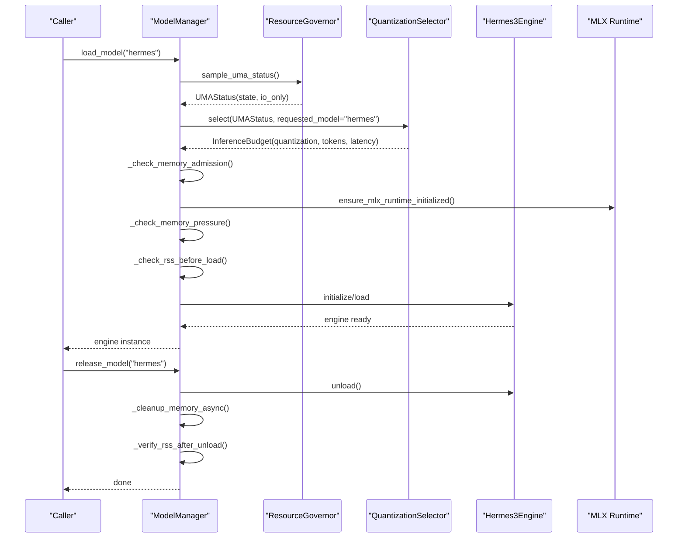

**Diagram sources**
- [model_manager.py](file://brain/model_manager.py)
- [model_lifecycle.py](file://brain/model_lifecycle.py)
- [quantization_selector.py](file://brain/quantization_selector.py)
- [resource_governor.py](file://core/resource_governor.py)
- [mlx_cache.py](file://utils/mlx_cache.py)
- [hermes3_engine.py](file://brain/hermes3_engine.py)

## Detailed Component Analysis

### ModelManager: Singleton, Thread-Safe Lifecycle Orchestration
- Singleton pattern via global instance with thread-safe locks for model registry and per-model locks to prevent TOCTOU races.
- Strict one-model-at-a-time policy enforced by releasing current model before loading a new one.
- Memory admission gates:
  - Hard fail-fast admission gate using UMA state before heavy load.
  - Soft memory pressure gate using psutil to clear MLX cache when free RAM is low.
  - RSS-based admission gate before load and verification after unload.
- Model factories for Hermes3Engine, ModernBERT embedder, and GLiNER engine.
- Context managers: model_lifecycle and acquire_model_ctx guarantee cleanup and MLX cache clearing.
- Release routines: engine.unload() delegation, KV cache compression, GC, and MLX cache clear.
- Embedding model lifecycle helpers and phase-aware context manager.

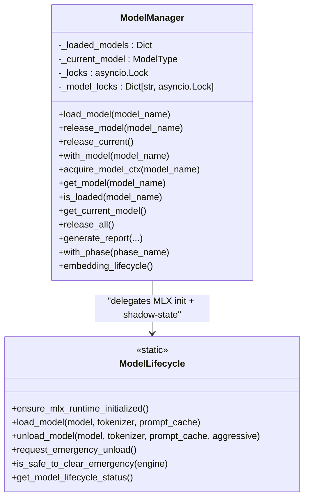

**Diagram sources**
- [model_manager.py](file://brain/model_manager.py)
- [model_lifecycle.py](file://brain/model_lifecycle.py)

**Section sources**
- [model_manager.py](file://brain/model_manager.py)

### model_lifecycle: Shadow-State, Emergency Seam, and Structured Generation Sidecar
- Shadow-state for introspection (loaded, current_model, initialized, last_error).
- Emergency unload seam: watchdog sets a flag; consumers check before inference and clear after safe conditions.
- MLX runtime initialization helper ensuring Metal limits are configured before model load.
- Structured generation sidecar (ModelLifecycle class) for Outlines-based constrained generation with 3-tier model discovery and cache limits.

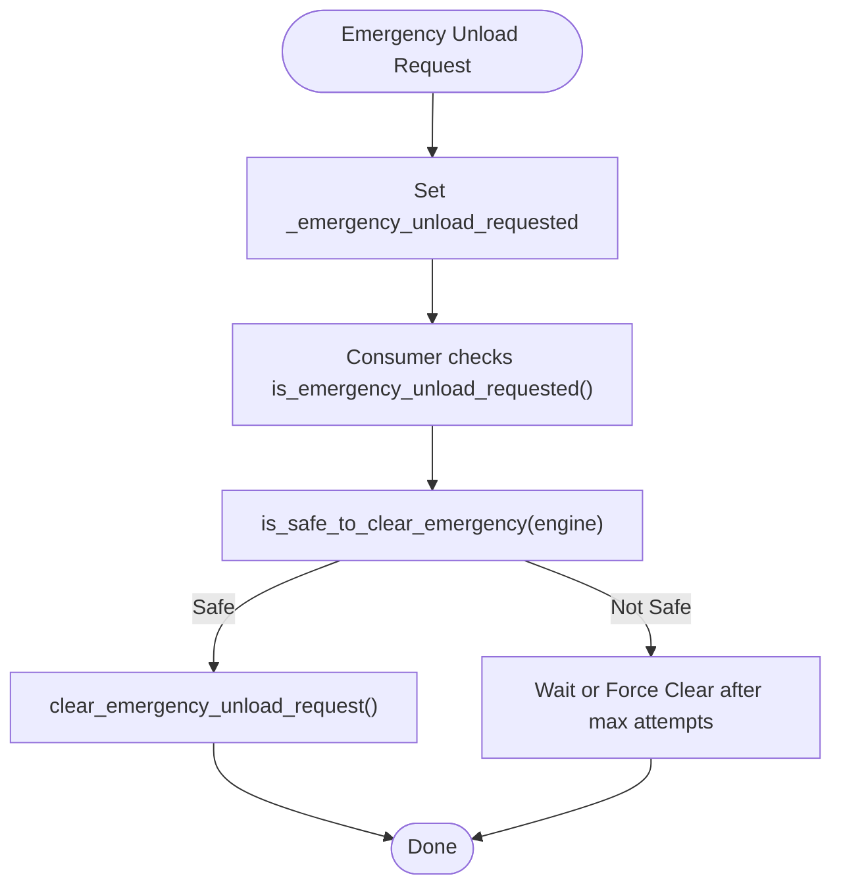

**Diagram sources**
- [model_lifecycle.py](file://brain/model_lifecycle.py)

**Section sources**
- [model_lifecycle.py](file://brain/model_lifecycle.py)

### DynamicModelManager: LRU, Idle Timeouts, and Thrash Prevention
- LRU cache with configurable max_loaded_models and eviction.
- Idle timeout to automatically release models after inactivity.
- Minimum reload interval to prevent thrashing.
- Background cleanup loop and safe acquire/release semantics with MLX cache clear on eviction.

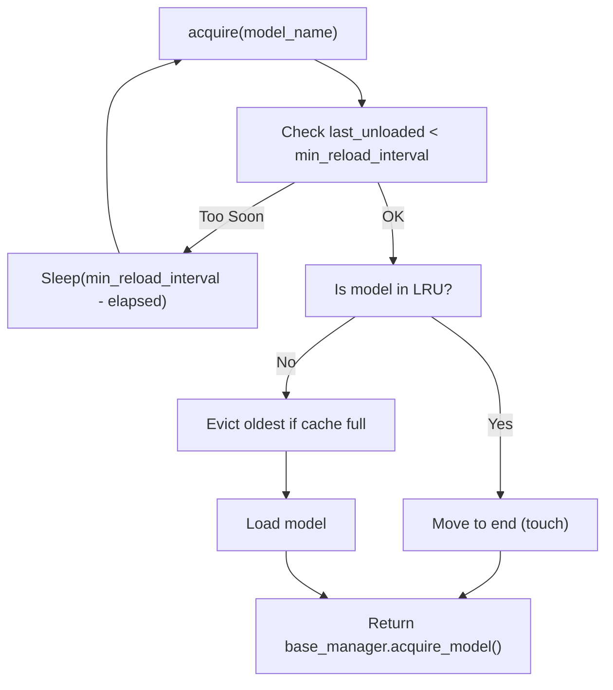

**Diagram sources**
- [dynamic_model_manager.py](file://brain/dynamic_model_manager.py)

**Section sources**
- [dynamic_model_manager.py](file://brain/dynamic_model_manager.py)

### ModelSwapManager: Race-Free Qwen↔Hermes Arbiter
- Single arbiter for model swaps with strict ordering: drain → unload → load → rollback on failure.
- Bounded drain timeout to abort swap if pending tasks cannot be canceled.
- Protocol-based lifecycle injection to avoid coupling to specific engines.

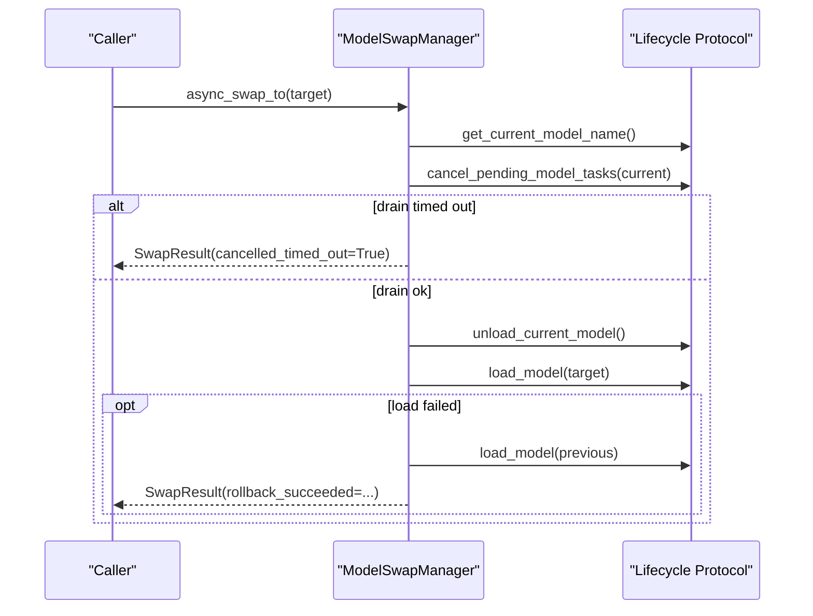

**Diagram sources**
- [model_swap_manager.py](file://brain/model_swap_manager.py)

**Section sources**
- [model_swap_manager.py](file://brain/model_swap_manager.py)

### QuantizationSelector: Advisory Budget and Quantization Policy
- Advisory quantization selection based on UMA snapshot: Q4_K_M default, Q5_K_M with sufficient free UMA, Q8_0 only when explicitly safe and adequate headroom.
- Returns InferenceBudget with max_tokens, max_latency_ms, and reason.
- Integrates with model lifecycle to track selected quantization.

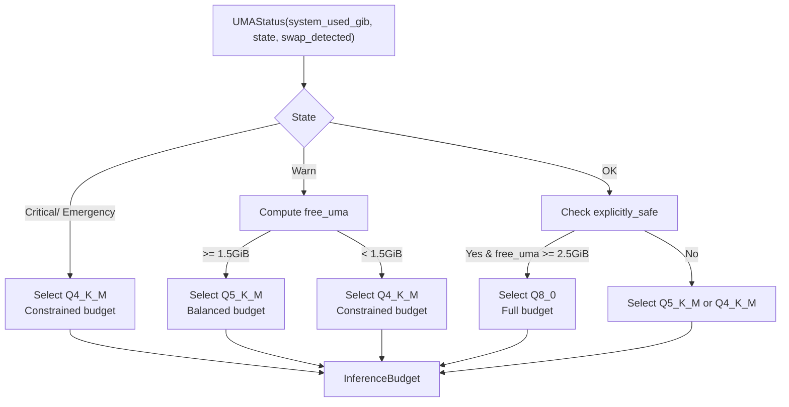

**Diagram sources**
- [quantization_selector.py](file://brain/quantization_selector.py)
- [resource_governor.py](file://core/resource_governor.py)

**Section sources**
- [quantization_selector.py](file://brain/quantization_selector.py)
- [resource_governor.py](file://core/resource_governor.py)

### Memory Admission Gates and M1 8GB Constraints
- Hard admission gate: fail-fast when UMA state is EMERGENCY or CRITICAL to prevent OOM.
- Soft admission gate: clear MLX cache when free RAM is below threshold.
- RSS-based admission: estimate model size and ensure headroom before load; verify RSS drop after unload.
- MLX initialization: ensure_mlx_runtime_initialized configures Metal limits before model load.
- Memory budget: documented M1 8GB headroom and operational ranges.

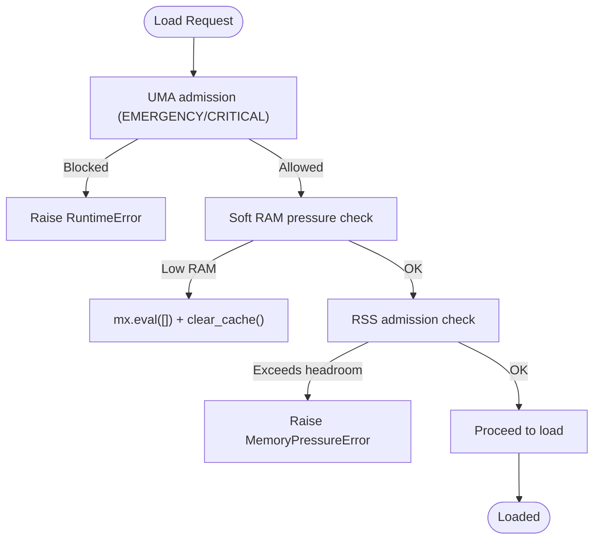

**Diagram sources**
- [model_manager.py](file://brain/model_manager.py)
- [model_lifecycle.py](file://brain/model_lifecycle.py)
- [resource_governor.py](file://core/resource_governor.py)
- [M1_8GB_MEMORY_BUDGET.md](file://M1_8GB_MEMORY_BUDGET.md)
- [mlx_cache.py](file://utils/mlx_cache.py)

**Section sources**
- [model_manager.py](file://brain/model_manager.py)
- [model_lifecycle.py](file://brain/model_lifecycle.py)
- [resource_governor.py](file://core/resource_governor.py)
- [M1_8GB_MEMORY_BUDGET.md](file://M1_8GB_MEMORY_BUDGET.md)
- [mlx_cache.py](file://utils/mlx_cache.py)

### Model Loading and Validation
- Hermes model: ensure model is downloaded before first load; reduce HTTP concurrency during download; initialize engine asynchronously; set selected quantization in lifecycle shadow-state.
- ModernBERT: CoreML path available with conversion and caching; fallback to MLX embedder.
- GLiNER: async load via GLiNER library; extract entities and relations; unload removes model reference.

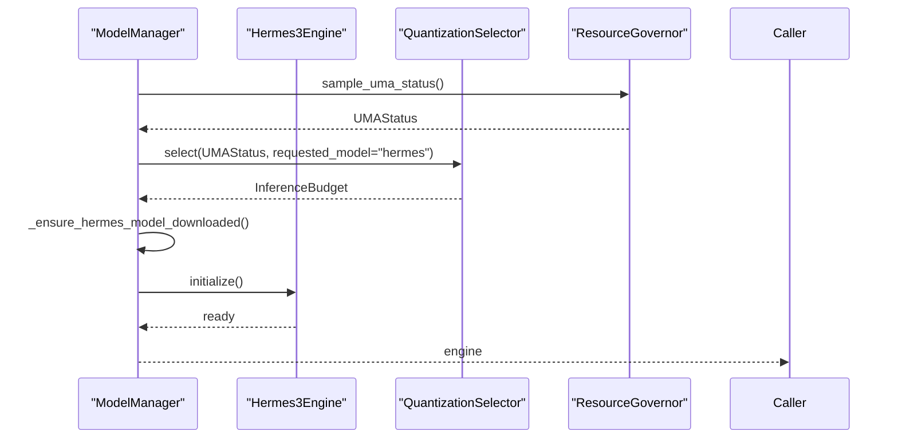

**Diagram sources**
- [model_manager.py](file://brain/model_manager.py)
- [quantization_selector.py](file://brain/quantization_selector.py)
- [resource_governor.py](file://core/resource_governor.py)
- [hermes3_engine.py](file://brain/hermes3_engine.py)

**Section sources**
- [model_manager.py](file://brain/model_manager.py)
- [quantization_selector.py](file://brain/quantization_selector.py)
- [hermes3_engine.py](file://brain/hermes3_engine.py)

### Model Release and Cleanup
- Release current or named model: unload engine if available, KV cache compression for Hermes, GC, MLX cache clear, RSS verification.
- Release all models: iterate registry, unload, and cleanup last engine.
- Cleanup order: GC → mx.eval([]) barrier → clear_cache to ensure Metal cache reclaims memory from pending GPU work.

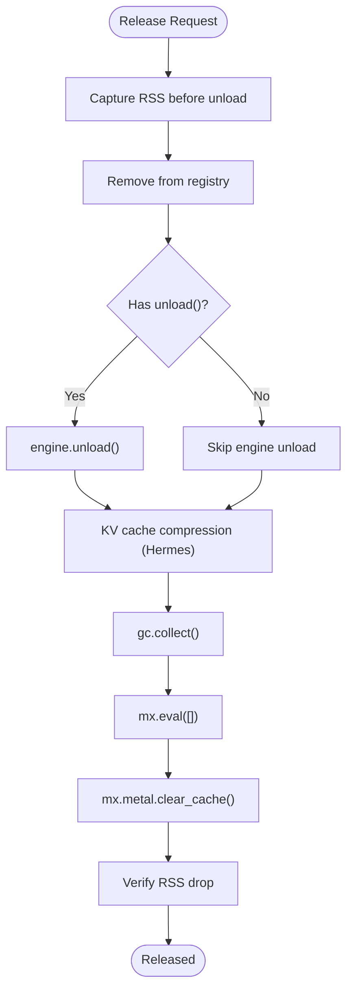

**Diagram sources**
- [model_manager.py](file://brain/model_manager.py)
- [model_lifecycle.py](file://brain/model_lifecycle.py)

**Section sources**
- [model_manager.py](file://brain/model_manager.py)
- [model_lifecycle.py](file://brain/model_lifecycle.py)

### Context Managers and Usage Patterns
- model_lifecycle: async context manager enforcing one-model-at-a-time; yields model and guarantees cleanup.
- acquire_model_ctx: context manager that ensures model unload on exit; clears MLX cache.
- with_model: returns model_lifecycle for a given model.
- with_phase: phase-aware context manager mapping workflow phases to models.
- embedding_lifecycle: context manager for embedding models with load/unload and MLX cache clear.

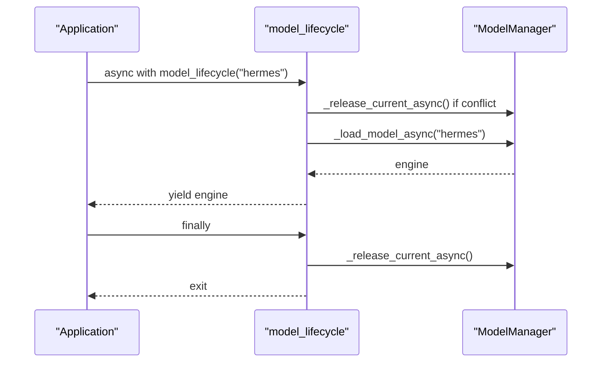

**Diagram sources**
- [model_manager.py](file://brain/model_manager.py)

**Section sources**
- [model_manager.py](file://brain/model_manager.py)

### Error Handling Strategies and Memory Pressure Detection
- MemoryPressureError raised when RSS exceeds threshold for safe load.
- Fail-fast admission gate raises RuntimeError in EMERGENCY/CRITICAL.
- Soft admission gate clears MLX cache when free RAM is low.
- Emergency unload seam allows watchdog-triggered unload with safe clearing checks.
- QuantizationSelector fallback to Q4_K_M on any error.

**Section sources**
- [exceptions.py](file://utils/exceptions.py)
- [model_manager.py](file://brain/model_manager.py)
- [model_lifecycle.py](file://brain/model_lifecycle.py)
- [quantization_selector.py](file://brain/quantization_selector.py)

### Custom Model Integration and Lifecycle Hooks
- Factory pattern: register model factories in ModelManager.MODEL_REGISTRY and _model_factories.
- Implement unload() for engines to integrate with canonical unload order.
- Shadow-state integration: use model_lifecycle.set_selected_quantization() for advisory quantization tracking.
- Embedding model lifecycle: use embedding_lifecycle context manager for proper load/unload and MLX cache clear.

**Section sources**
- [model_manager.py](file://brain/model_manager.py)
- [model_lifecycle.py](file://brain/model_lifecycle.py)

## Dependency Analysis
- ModelManager depends on:
  - ResourceGovernor for UMA state and hysteresis.
  - QuantizationSelector for advisory quantization.
  - MLX utilities for runtime initialization and cleanup.
  - Engine implementations (Hermes3Engine, ModernBERT, GLiNER).
- model_lifecycle depends on:
  - MLX utilities for runtime initialization and cleanup.
  - Engine unload() for canonical cleanup order.
- DynamicModelManager depends on ModelManager for acquire/release.
- ModelSwapManager depends on a lifecycle protocol abstraction.

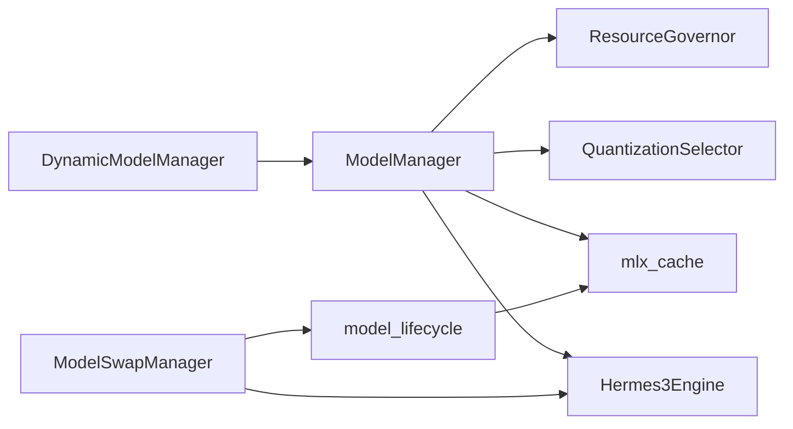

**Diagram sources**
- [model_manager.py](file://brain/model_manager.py)
- [model_lifecycle.py](file://brain/model_lifecycle.py)
- [dynamic_model_manager.py](file://brain/dynamic_model_manager.py)
- [model_swap_manager.py](file://brain/model_swap_manager.py)
- [resource_governor.py](file://core/resource_governor.py)
- [mlx_cache.py](file://utils/mlx_cache.py)
- [hermes3_engine.py](file://brain/hermes3_engine.py)

**Section sources**
- [model_manager.py](file://brain/model_manager.py)
- [model_lifecycle.py](file://brain/model_lifecycle.py)
- [dynamic_model_manager.py](file://brain/dynamic_model_manager.py)
- [model_swap_manager.py](file://brain/model_swap_manager.py)
- [resource_governor.py](file://core/resource_governor.py)
- [mlx_cache.py](file://utils/mlx_cache.py)
- [hermes3_engine.py](file://brain/hermes3_engine.py)

## Performance Considerations
- Strict one-model-at-a-time prevents memory contention on M1 8GB.
- MLX Metal limits configured to 2.5 GiB cache/wired to leave headroom for model weights.
- RSS-based admission gates and soft RAM pressure checks reduce OOM risk.
- KV cache compression and quantization reduce memory footprint during generation.
- DynamicModelManager’s LRU and idle timeouts minimize long-lived memory retention.

[No sources needed since this section provides general guidance]

## Troubleshooting Guide
Common issues and resolutions:
- MemoryPressureError during load: reduce concurrent operations, clear MLX cache, or switch models.
- EMERGENCY/CRITICAL admission block: wait for memory pressure to subside or reduce workload.
- OOM during unload: ensure engine.unload() is called and cleanup order is followed (GC → mx.eval([]) → clear_cache).
- Emergency unload stuck: check is_safe_to_clear_emergency conditions and ensure pending futures are drained.
- QuantizationSelector fallback to Q4_K_M: verify UMA state and free memory availability.

**Section sources**
- [exceptions.py](file://utils/exceptions.py)
- [model_manager.py](file://brain/model_manager.py)
- [model_lifecycle.py](file://brain/model_lifecycle.py)
- [quantization_selector.py](file://brain/quantization_selector.py)
- [resource_governor.py](file://core/resource_governor.py)

## Conclusion
The model lifecycle management system enforces M1 8GB stability through strict one-model-at-a-time policy, robust memory admission gates, quantization advisories, and canonical cleanup ordering. It integrates emergency unload seam, structured generation sidecar, dynamic model management, and race-free model swapping to provide a resilient, thread-safe, and memory-efficient runtime for large models on constrained hardware.

## Appendices

### Appendix A: Memory Budget Summary (M1 8GB)
- Total: 8 GB; macOS baseline ~2.5 GB; Available: ~5.5 GB.
- Typical peak allocation: LLM weights (~2.0 GB) + KV cache (quantized ~0.5 GB) + others ~~3.2 GB.
- Headroom to 5 GB warning threshold: ~1.8 GB; to 5.5 GB max: ~2.3 GB.
- Risk level: LOW — scan cycle can run with significant headroom.

**Section sources**
- [M1_8GB_MEMORY_BUDGET.md](file://M1_8GB_MEMORY_BUDGET.md)