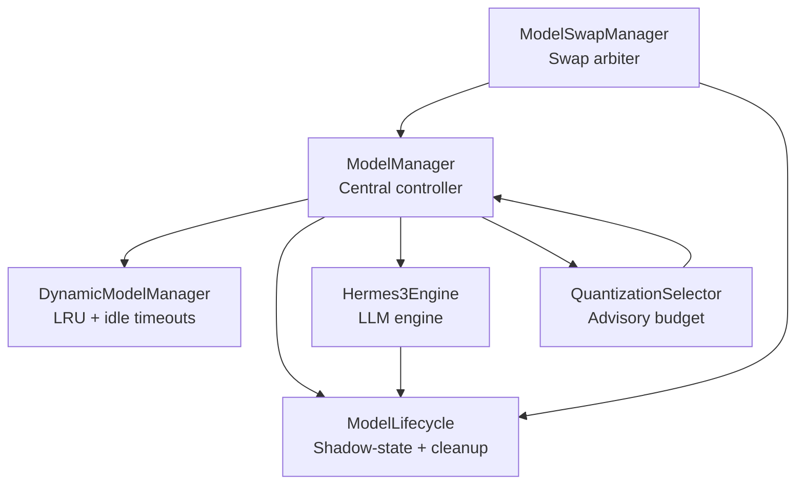
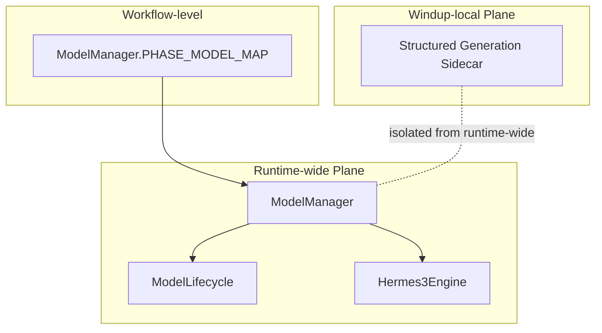
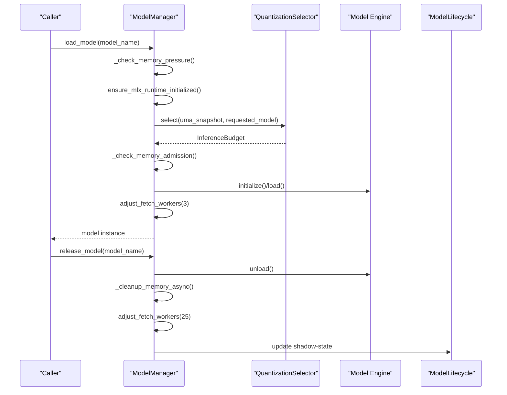
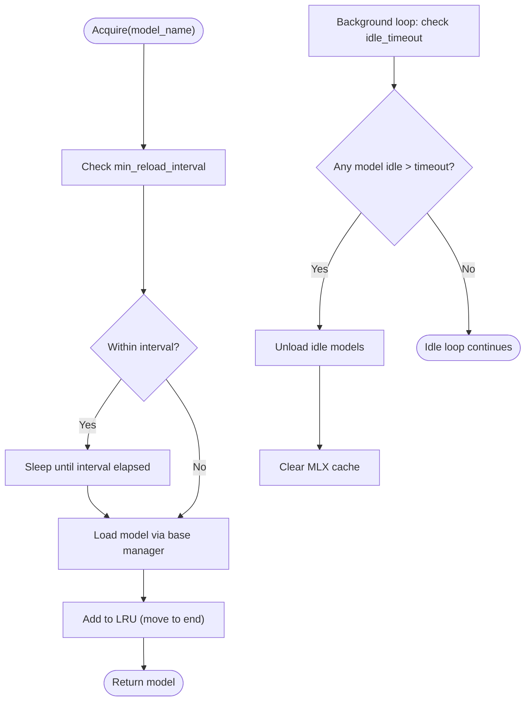
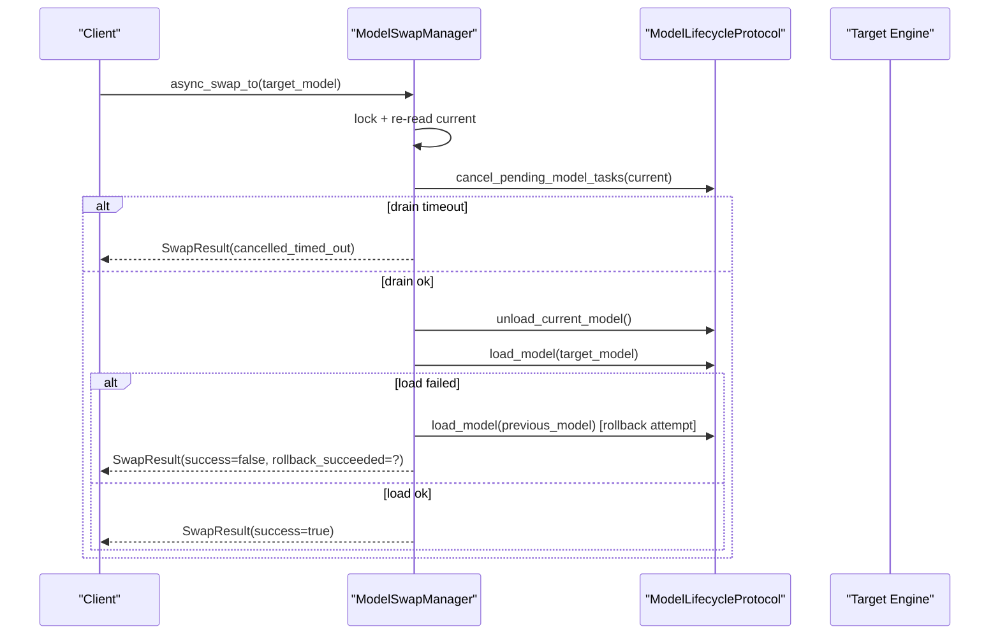
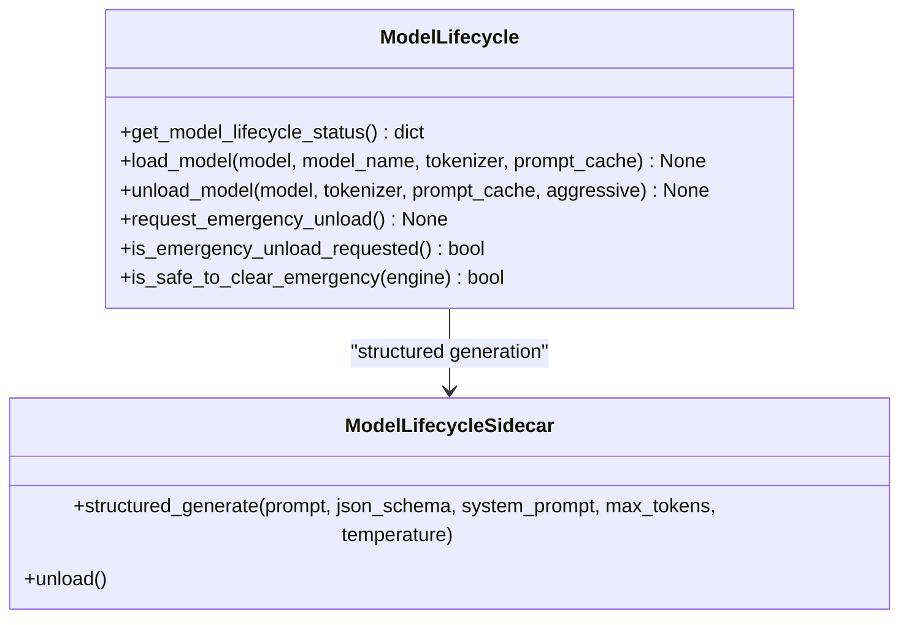
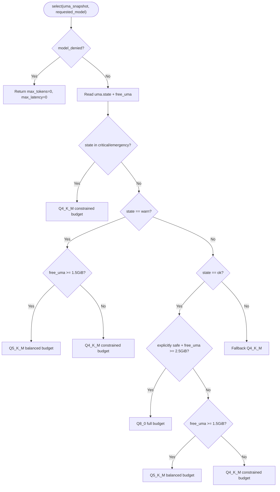
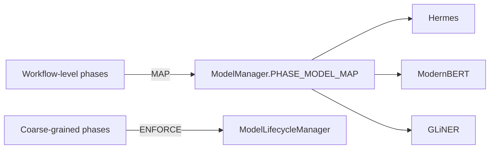
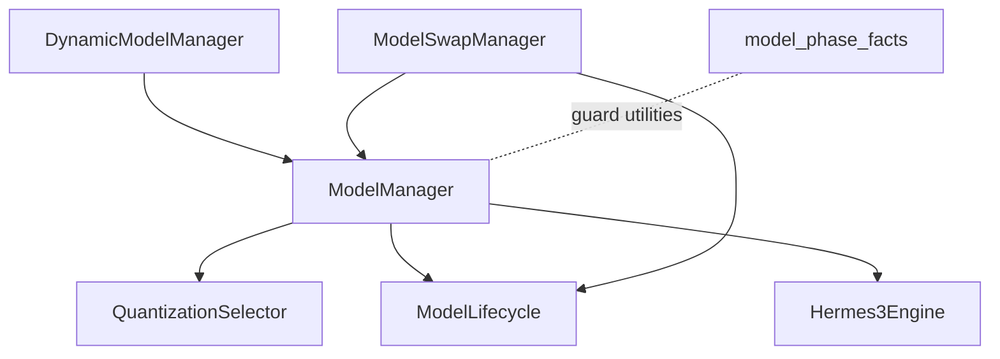

# Model Management

<cite>
**Referenced Files in This Document**
- [model_manager.py](file://brain/model_manager.py)
- [dynamic_model_manager.py](file://brain/dynamic_model_manager.py)
- [model_swap_manager.py](file://brain/model_swap_manager.py)
- [model_lifecycle.py](file://brain/model_lifecycle.py)
- [hermes3_engine.py](file://brain/hermes3_engine.py)
- [quantization_selector.py](file://brain/quantization_selector.py)
- [model_phase_facts.py](file://brain/model_phase_facts.py)
</cite>

## Table of Contents
1. [Introduction](#introduction)
2. [Project Structure](#project-structure)
3. [Core Components](#core-components)
4. [Architecture Overview](#architecture-overview)
5. [Detailed Component Analysis](#detailed-component-analysis)
6. [Dependency Analysis](#dependency-analysis)
7. [Performance Considerations](#performance-considerations)
8. [Troubleshooting Guide](#troubleshooting-guide)
9. [Conclusion](#conclusion)
10. [Appendices](#appendices)

## Introduction
This document describes the model management system that governs model lifecycle management, dynamic loading/unloading, runtime model switching, and model swapping. It covers initialization, validation, and cleanup procedures; memory optimization strategies; emergency unload handling; and the model swap manager’s role in seamless transitions during research cycles. It also documents configuration options for model selection, resource allocation, and performance tuning, along with examples for integrating custom models, validating models, and troubleshooting common loading issues.

## Project Structure
The model management system is centered in the brain module with supporting engines, lifecycle utilities, and quantization controls:
- ModelManager: Central controller enforcing one-model-at-a-time policy, memory guards, and model factories.
- DynamicModelManager: LRU-based dynamic loader with idle timeouts and thrash prevention.
- ModelSwapManager: Single arbiter for race-free model swaps with drain, unload, and load sequencing.
- ModelLifecycle: Shadow-state and cleanup helpers for unload operations and structured generation sidecar.
- Hermes3Engine: Canonical engine for Hermes-3 with continuous batching, KV cache, and emergency unload handling.
- QuantizationSelector: Advisory layer selecting quantization tiers and inference budgets based on resource governor snapshots.
- model_phase_facts: Phase-layer guard utilities to prevent cross-layer phase drift.

**Diagram sources**
- [model_manager.py:178-1297](file://brain/model_manager.py#L178-L1297)
- [dynamic_model_manager.py:201-423](file://brain/dynamic_model_manager.py#L201-L423)
- [model_swap_manager.py:154-420](file://brain/model_swap_manager.py#L154-L420)
- [model_lifecycle.py:1-929](file://brain/model_lifecycle.py#L1-L929)
- [hermes3_engine.py:142-800](file://brain/hermes3_engine.py#L142-L800)
- [quantization_selector.py:117-234](file://brain/quantization_selector.py#L117-L234)

**Section sources**
- [model_manager.py:178-1297](file://brain/model_manager.py#L178-L1297)
- [dynamic_model_manager.py:201-423](file://brain/dynamic_model_manager.py#L201-L423)
- [model_swap_manager.py:154-420](file://brain/model_swap_manager.py#L154-L420)
- [model_lifecycle.py:1-929](file://brain/model_lifecycle.py#L1-L929)
- [hermes3_engine.py:142-800](file://brain/hermes3_engine.py#L142-L800)
- [quantization_selector.py:117-234](file://brain/quantization_selector.py#L117-L234)
- [model_phase_facts.py:1-213](file://brain/model_phase_facts.py#L1-L213)

## Core Components
- ModelManager
  - Enforces a strict one-model-at-a-time policy on M1 8GB devices.
  - Provides async load/release with memory pressure checks, MLX runtime initialization, and quantization advisory integration.
  - Offers phase-based context managers and embedding lifecycle helpers.
- DynamicModelManager
  - Implements LRU cache with max-loaded-models limit, idle timeouts, and thrash prevention.
  - Supports forced unload and background cleanup loops.
- ModelSwapManager
  - Single arbiter for race-free Qwen↔Hermes swaps with bounded drain, unload, and load steps.
  - Tracks swap statistics and rollback attempts.
- ModelLifecycle
  - Shadow-state for lifecycle introspection and fail-open unload helpers.
  - Structured generation sidecar for Outlines-based constrained generation.
- QuantizationSelector
  - Advisory quantization and inference budget selection based on governor snapshots.
- model_phase_facts
  - Guards against phase-layer drift and provides phase-layer classification.

**Section sources**
- [model_manager.py:178-1297](file://brain/model_manager.py#L178-L1297)
- [dynamic_model_manager.py:201-423](file://brain/dynamic_model_manager.py#L201-L423)
- [model_swap_manager.py:154-420](file://brain/model_swap_manager.py#L154-L420)
- [model_lifecycle.py:1-929](file://brain/model_lifecycle.py#L1-L929)
- [quantization_selector.py:117-234](file://brain/quantization_selector.py#L117-L234)
- [model_phase_facts.py:1-213](file://brain/model_phase_facts.py#L1-L213)

## Architecture Overview
The system separates concerns across three layers:
- Workflow-level (ModelManager): Maps phases to models and enforces strict acquisition/unload ordering.
- Runtime-wide model plane: Managed by ModelManager and delegated unload operations to engines.
- Windup-local model plane: Structured generation sidecar using Qwen/SmolLM models.

**Diagram sources**
- [model_manager.py:246-255](file://brain/model_manager.py#L246-L255)
- [model_lifecycle.py:45-56](file://brain/model_lifecycle.py#L45-L56)

**Section sources**
- [model_manager.py:246-255](file://brain/model_manager.py#L246-L255)
- [model_lifecycle.py:45-56](file://brain/model_lifecycle.py#L45-L56)

## Detailed Component Analysis

### ModelManager: Lifecycle, Validation, and Cleanup
Responsibilities:
- One-model-at-a-time policy with per-model locks to prevent race conditions.
- Memory admission gates (hard fail-fast and soft cache-clear) and RSS-based checks.
- Quantization advisory integration via QuantizationSelector and governor snapshots.
- Factory-based model creation and graceful cleanup with MLX cache and garbage collection.
- Phase-based context managers and embedding lifecycle helpers.

Key behaviors:
- Load path validates memory pressure, initializes MLX runtime, selects quantization, and loads the model via factories.
- Release path ensures registry removal, engine unload, and memory cleanup with RSS verification.
- Embedding lifecycle integrates ANE/MLX embedder selection and MPS cache management.

**Diagram sources**
- [model_manager.py:547-712](file://brain/model_manager.py#L547-L712)
- [model_manager.py:824-869](file://brain/model_manager.py#L824-L869)
- [quantization_selector.py:129-177](file://brain/quantization_selector.py#L129-L177)
- [model_lifecycle.py:333-436](file://brain/model_lifecycle.py#L333-L436)

**Section sources**
- [model_manager.py:547-712](file://brain/model_manager.py#L547-L712)
- [model_manager.py:824-869](file://brain/model_manager.py#L824-L869)
- [quantization_selector.py:129-177](file://brain/quantization_selector.py#L129-L177)
- [model_lifecycle.py:333-436](file://brain/model_lifecycle.py#L333-L436)

### DynamicModelManager: LRU, Idle Timeouts, and Thrash Prevention
Responsibilities:
- LRU cache with max_loaded_models limit and eviction policy.
- Idle timeout detection and automatic unload.
- Thrash prevention with min_reload_interval.
- Background cleanup loop and MLX cache clearing on unload.

**Diagram sources**
- [dynamic_model_manager.py:268-313](file://brain/dynamic_model_manager.py#L268-L313)
- [dynamic_model_manager.py:366-404](file://brain/dynamic_model_manager.py#L366-L404)

**Section sources**
- [dynamic_model_manager.py:268-313](file://brain/dynamic_model_manager.py#L268-L313)
- [dynamic_model_manager.py:366-404](file://brain/dynamic_model_manager.py#L366-L404)

### ModelSwapManager: Race-Free Swapping
Responsibilities:
- Single arbiter for Qwen↔Hermes swaps with strict ordering: drain → unload → load.
- Bounded drain with timeout and rollback on load failure.
- Swap statistics and status reporting.

**Diagram sources**
- [model_swap_manager.py:198-343](file://brain/model_swap_manager.py#L198-L343)

**Section sources**
- [model_swap_manager.py:198-343](file://brain/model_swap_manager.py#L198-L343)

### ModelLifecycle: Shadow-State and Cleanup Helpers
Responsibilities:
- Shadow-state for lifecycle introspection (loaded/current_model/initialized/last_error).
- Fail-open unload helpers delegating to engine.unload() where available.
- Structured generation sidecar with Outlines and fallback paths.

**Diagram sources**
- [model_lifecycle.py:288-436](file://brain/model_lifecycle.py#L288-L436)
- [model_lifecycle.py:654-929](file://brain/model_lifecycle.py#L654-L929)

**Section sources**
- [model_lifecycle.py:288-436](file://brain/model_lifecycle.py#L288-L436)
- [model_lifecycle.py:654-929](file://brain/model_lifecycle.py#L654-L929)

### QuantizationSelector: Advisory Budget and Quantization
Responsibilities:
- Selects quantization (Q4_K_M/Q5_K_M/Q8_0) and inference budget based on governor snapshots.
- Returns deny budget when governor blocks model load.
- Provides free UMA hints and robust fallback to Q4_K_M.

**Diagram sources**
- [quantization_selector.py:129-227](file://brain/quantization_selector.py#L129-L227)

**Section sources**
- [quantization_selector.py:129-227](file://brain/quantization_selector.py#L129-L227)

### Phase Mapping and Layer Separation
- Workflow-level mapping (ModelManager.PHASE_MODEL_MAP) assigns phases to models.
- Coarse-grained phases enforced by ModelLifecycleManager differ from workflow-level phases.
- model_phase_facts provides utilities to classify and guard against cross-layer phase drift.

**Diagram sources**
- [model_manager.py:246-255](file://brain/model_manager.py#L246-L255)
- [model_phase_facts.py:24-41](file://brain/model_phase_facts.py#L24-L41)

**Section sources**
- [model_manager.py:246-255](file://brain/model_manager.py#L246-L255)
- [model_phase_facts.py:24-41](file://brain/model_phase_facts.py#L24-L41)

## Dependency Analysis
- ModelManager depends on:
  - QuantizationSelector for advisory quantization and budget.
  - ModelLifecycle for shadow-state and unload helpers.
  - Hermes3Engine for canonical unload ordering and emergency seam.
- DynamicModelManager depends on ModelManager for acquire/release and uses MLX cache clearing.
- ModelSwapManager depends on a lifecycle protocol to coordinate drain/unload/load.
- model_phase_facts provides pure utilities to prevent cross-layer mapping errors.

**Diagram sources**
- [model_manager.py:658-677](file://brain/model_manager.py#L658-L677)
- [dynamic_model_manager.py:228-313](file://brain/dynamic_model_manager.py#L228-L313)
- [model_swap_manager.py:170-186](file://brain/model_swap_manager.py#L170-L186)
- [model_phase_facts.py:137-171](file://brain/model_phase_facts.py#L137-L171)

**Section sources**
- [model_manager.py:658-677](file://brain/model_manager.py#L658-L677)
- [dynamic_model_manager.py:228-313](file://brain/dynamic_model_manager.py#L228-L313)
- [model_swap_manager.py:170-186](file://brain/model_swap_manager.py#L170-L186)
- [model_phase_facts.py:137-171](file://brain/model_phase_facts.py#L137-L171)

## Performance Considerations
- One-model-at-a-time policy prevents memory contention on M1 8GB.
- Memory admission gates (hard fail-fast and soft cache-clear) protect against OOM.
- RSS-based checks and MLX cache clearing ensure predictable memory behavior.
- DynamicModelManager’s LRU and idle timeouts reduce unnecessary memory retention.
- QuantizationSelector adapts inference budgets to available resources.
- Structured generation sidecar uses Outlines constrained generation for deterministic outputs.

[No sources needed since this section provides general guidance]

## Troubleshooting Guide
Common issues and resolutions:
- Memory pressure during load
  - Symptoms: MemoryPressureError or blocked load.
  - Actions: Reduce concurrent fetch workers, clear MLX cache, or lower model concurrency.
  - References: [model_manager.py:61-84](file://brain/model_manager.py#L61-L84), [model_manager.py:410-425](file://brain/model_manager.py#L410-L425).
- Emergency unload not clearing
  - Symptoms: Emergency flag remains set.
  - Actions: Ensure is_safe_to_clear_emergency preconditions are met; check engine attributes; clear flag after consumption.
  - References: [model_lifecycle.py:147-189](file://brain/model_lifecycle.py#L147-L189), [model_lifecycle.py:133-145](file://brain/model_lifecycle.py#L133-L145).
- Swap timeout during drain
  - Symptoms: SwapResult indicates cancelled_timed_out.
  - Actions: Investigate pending futures; reduce workload; increase drain timeout if appropriate.
  - References: [model_swap_manager.py:368-398](file://brain/model_swap_manager.py#L368-L398).
- Outlines constrained generation fallback
  - Symptoms: Structured generation falls back to mlx_lm.
  - Actions: Verify Outlines availability; check JSON schema validity.
  - References: [model_lifecycle.py:800-861](file://brain/model_lifecycle.py#L800-L861).

**Section sources**
- [model_manager.py:61-84](file://brain/model_manager.py#L61-L84)
- [model_manager.py:410-425](file://brain/model_manager.py#L410-L425)
- [model_lifecycle.py:147-189](file://brain/model_lifecycle.py#L147-L189)
- [model_lifecycle.py:133-145](file://brain/model_lifecycle.py#L133-L145)
- [model_swap_manager.py:368-398](file://brain/model_swap_manager.py#L368-L398)
- [model_lifecycle.py:800-861](file://brain/model_lifecycle.py#L800-L861)

## Conclusion
The model management system enforces strict lifecycle discipline, integrates resource-aware quantization, and provides robust mechanisms for dynamic loading, idle cleanup, and race-free swapping. Its layered design separates workflow-level phase mapping from runtime-wide model plane and windup-local sidecars, ensuring safety, predictability, and performance on constrained hardware.

[No sources needed since this section summarizes without analyzing specific files]

## Appendices

### Configuration Options
- Model selection and quantization
  - QuantizationSelector returns Q4_K_M/Q5_K_M/Q8_0 and inference budgets based on governor snapshots.
  - References: [quantization_selector.py:129-227](file://brain/quantization_selector.py#L129-L227).
- Memory limits and admission
  - RSS thresholds and memory admission gates protect against OOM.
  - References: [model_manager.py:46-49](file://brain/model_manager.py#L46-L49), [model_manager.py:61-84](file://brain/model_manager.py#L61-L84), [model_manager.py:365-405](file://brain/model_manager.py#L365-L405).
- Dynamic loader tuning
  - idle_timeout, min_reload_interval, max_loaded_models.
  - References: [dynamic_model_manager.py:212-231](file://brain/dynamic_model_manager.py#L212-L231).
- Swap drain timeout
  - DEFAULT_DRAIN_TIMEOUT controls bounded drain behavior.
  - References: [model_swap_manager.py:167-168](file://brain/model_swap_manager.py#L167-L168).

**Section sources**
- [quantization_selector.py:129-227](file://brain/quantization_selector.py#L129-L227)
- [model_manager.py:46-49](file://brain/model_manager.py#L46-L49)
- [model_manager.py:61-84](file://brain/model_manager.py#L61-L84)
- [model_manager.py:365-405](file://brain/model_manager.py#L365-L405)
- [dynamic_model_manager.py:212-231](file://brain/dynamic_model_manager.py#L212-L231)
- [model_swap_manager.py:167-168](file://brain/model_swap_manager.py#L167-L168)

### Examples

- Custom model integration
  - Implement a factory in ModelManager._model_factories and register it in MODEL_REGISTRY.
  - Ensure async initialize/load/unload semantics and integrate with ModelLifecycle for unload.
  - References: [model_manager.py:260-264](file://brain/model_manager.py#L260-L264), [model_manager.py:682-701](file://brain/model_manager.py#L682-L701), [model_lifecycle.py:438-528](file://brain/model_lifecycle.py#L438-L528).
- Model validation procedures
  - Use PHASE_MODEL_MAP to validate phase-to-model mapping and model_phase_facts to guard against cross-layer drift.
  - References: [model_manager.py:246-255](file://brain/model_manager.py#L246-L255), [model_phase_facts.py:137-171](file://brain/model_phase_facts.py#L137-L171).
- Emergency unload handling
  - Use request_emergency_unload and is_safe_to_clear_emergency to coordinate unload with engine state.
  - References: [model_lifecycle.py:108-145](file://brain/model_lifecycle.py#L108-L145), [model_lifecycle.py:147-189](file://brain/model_lifecycle.py#L147-L189).

**Section sources**
- [model_manager.py:260-264](file://brain/model_manager.py#L260-L264)
- [model_manager.py:682-701](file://brain/model_manager.py#L682-L701)
- [model_lifecycle.py:438-528](file://brain/model_lifecycle.py#L438-L528)
- [model_manager.py:246-255](file://brain/model_manager.py#L246-L255)
- [model_phase_facts.py:137-171](file://brain/model_phase_facts.py#L137-L171)
- [model_lifecycle.py:108-145](file://brain/model_lifecycle.py#L108-L145)
- [model_lifecycle.py:147-189](file://brain/model_lifecycle.py#L147-L189)