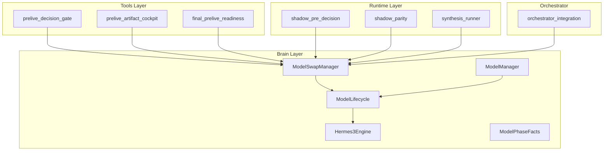
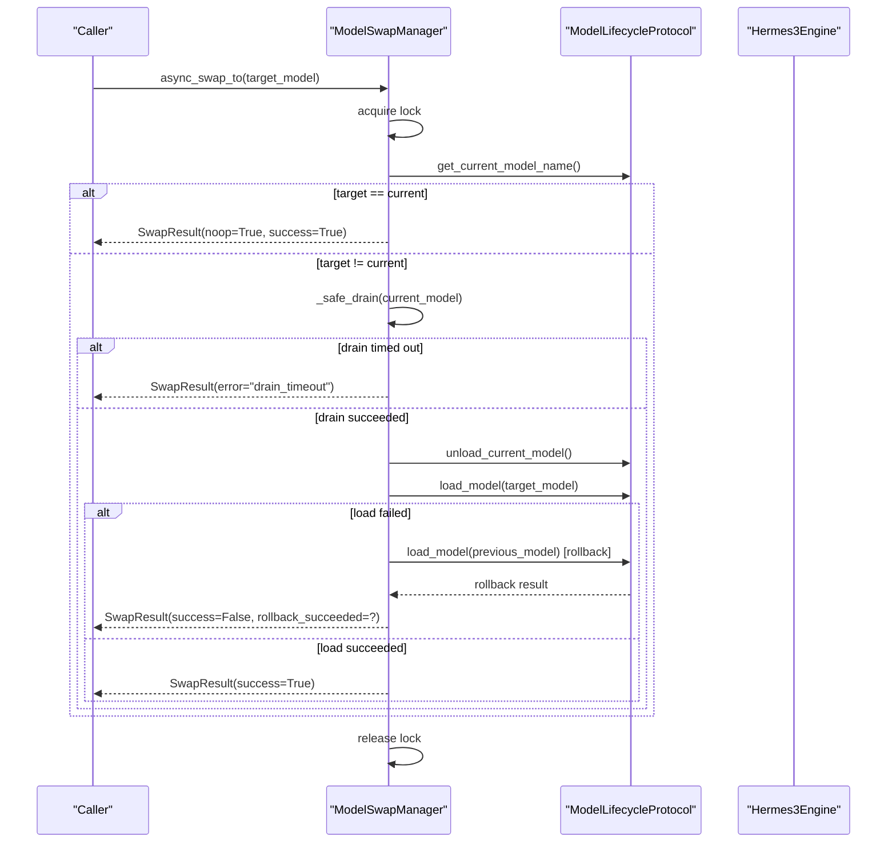
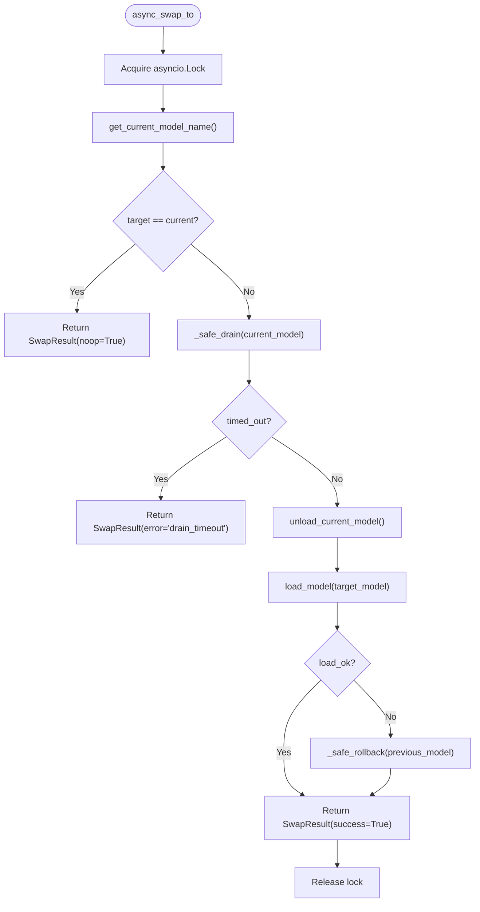
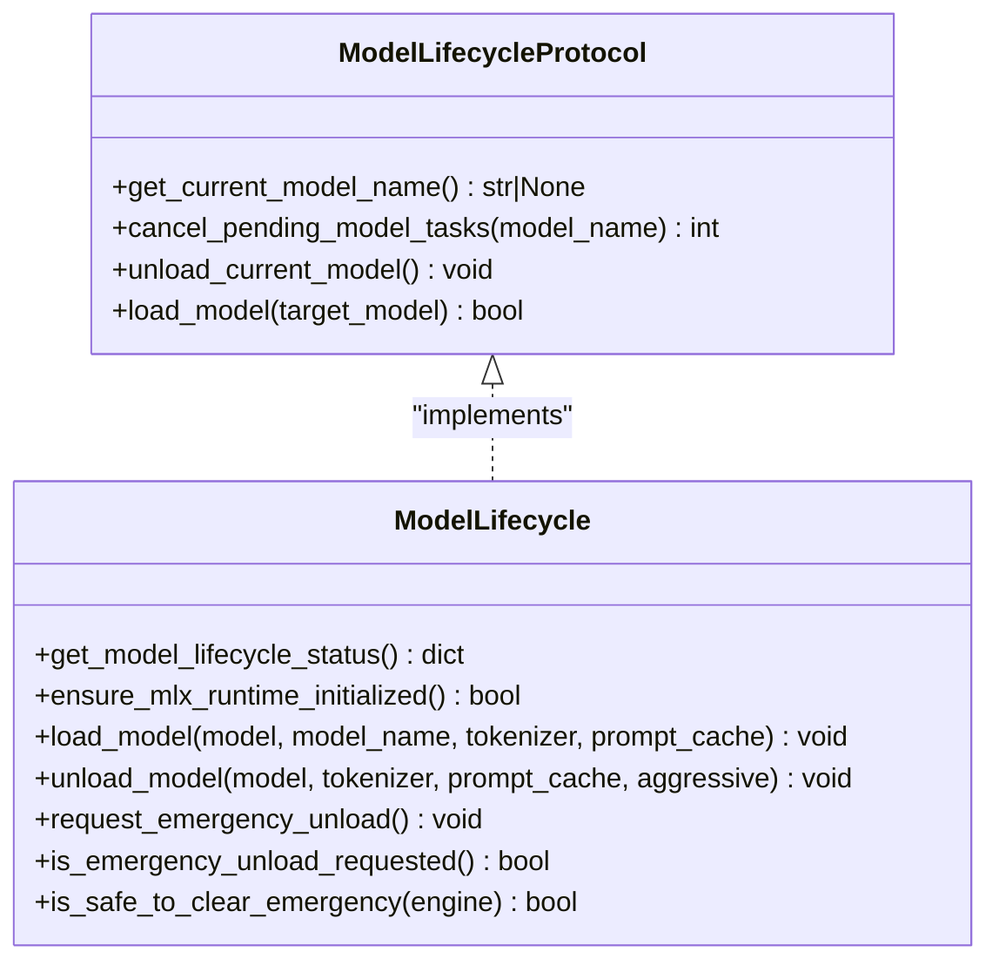
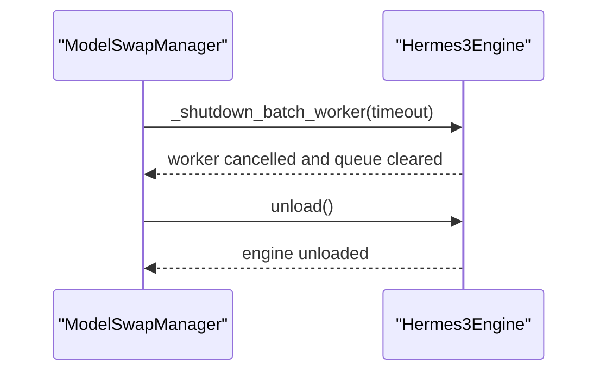
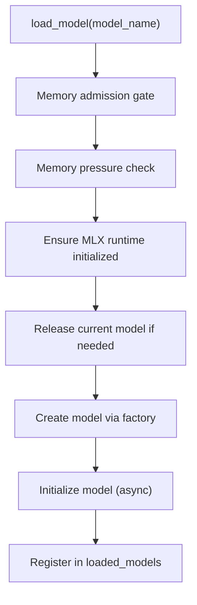
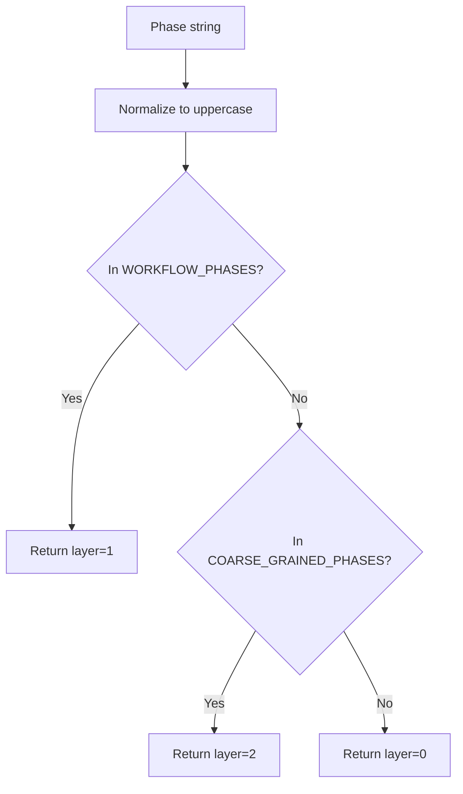
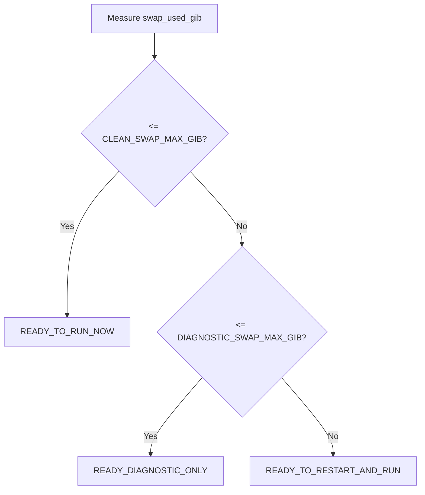
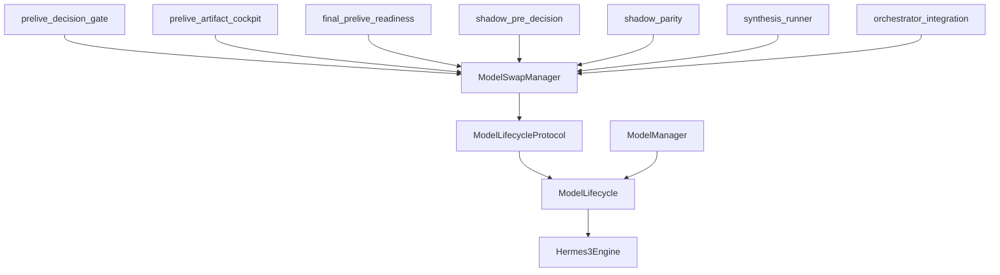

# Model Swap Mechanisms

<cite>
**Referenced Files in This Document**
- [model_swap_manager.py](file://brain/model_swap_manager.py)
- [model_lifecycle.py](file://brain/model_lifecycle.py)
- [hermes3_engine.py](file://brain/hermes3_engine.py)
- [model_manager.py](file://brain/model_manager.py)
- [model_phase_facts.py](file://brain/model_phase_facts.py)
- [orchestrator_integration.py](file://orchestrator_integration.py)
- [prelive_decision_gate.py](file://tools/prelive_decision_gate.py)
- [prelive_artifact_cockpit.py](file://tools/prelive_artifact_cockpit.py)
- [final_prelive_readiness.py](file://tools/final_prelive_readiness.py)
- [shadow_pre_decision.py](file://runtime/shadow_pre_decision.py)
- [shadow_parity.py](file://runtime/shadow_parity.py)
- [synthesis_runner.py](file://brain/synthesis_runner.py)
</cite>

## Table of Contents
1. [Introduction](#introduction)
2. [Project Structure](#project-structure)
3. [Core Components](#core-components)
4. [Architecture Overview](#architecture-overview)
5. [Detailed Component Analysis](#detailed-component-analysis)
6. [Dependency Analysis](#dependency-analysis)
7. [Performance Considerations](#performance-considerations)
8. [Troubleshooting Guide](#troubleshooting-guide)
9. [Conclusion](#conclusion)

## Introduction
This document explains the model swap mechanisms that enable seamless transitions between different models during research operations. It focuses on the ModelSwapManager architecture for coordinating model switches without interrupting research workflows, detailing swap coordination logic, phase mapping, model compatibility checking, resource allocation during transitions, safety mechanisms, rollback procedures, error recovery strategies, integration with the broader orchestration system, and timing considerations for optimal performance.

## Project Structure
The model swap system spans several modules:
- Brain layer: ModelSwapManager coordinates swaps, ModelLifecycle provides lifecycle hooks, Hermes3Engine implements unload semantics, ModelManager manages model acquisition/release, and ModelPhaseFacts provides phase-layer safety guards.
- Tools layer: Preliminary gates (prelive_decision_gate, prelive_artifact_cockpit, final_prelive_readiness) enforce swap policy tiers and readiness.
- Runtime layer: Shadow utilities (shadow_pre_decision, shadow_parity) validate lifecycle and model control parity.
- Orchestrator integration: Orchestrator_integration wires subsystems and coordinates initialization.

**Diagram sources**
- [model_swap_manager.py:154-420](file://brain/model_swap_manager.py#L154-L420)
- [model_lifecycle.py:1-929](file://brain/model_lifecycle.py#L1-L929)
- [hermes3_engine.py:1-2304](file://brain/hermes3_engine.py#L1-L2304)
- [model_manager.py:1-1297](file://brain/model_manager.py#L1-L1297)
- [model_phase_facts.py:1-213](file://brain/model_phase_facts.py#L1-L213)
- [prelive_decision_gate.py:928-961](file://tools/prelive_decision_gate.py#L928-L961)
- [prelive_artifact_cockpit.py:555-723](file://tools/prelive_artifact_cockpit.py#L555-L723)
- [final_prelive_readiness.py:518-541](file://tools/final_prelive_readiness.py#L518-L541)
- [shadow_pre_decision.py:72-1379](file://runtime/shadow_pre_decision.py#L72-L1379)
- [shadow_parity.py:237-267](file://runtime/shadow_parity.py#L237-L267)
- [synthesis_runner.py:313-342](file://brain/synthesis_runner.py#L313-L342)
- [orchestrator_integration.py:151-181](file://orchestrator_integration.py#L151-L181)

**Section sources**
- [model_swap_manager.py:154-420](file://brain/model_swap_manager.py#L154-L420)
- [model_lifecycle.py:1-929](file://brain/model_lifecycle.py#L1-L929)
- [model_manager.py:178-800](file://brain/model_manager.py#L178-L800)
- [model_phase_facts.py:1-213](file://brain/model_phase_facts.py#L1-L213)
- [prelive_decision_gate.py:928-961](file://tools/prelive_decision_gate.py#L928-L961)
- [prelive_artifact_cockpit.py:555-723](file://tools/prelive_artifact_cockpit.py#L555-L723)
- [final_prelive_readiness.py:518-541](file://tools/final_prelive_readiness.py#L518-L541)
- [shadow_pre_decision.py:72-1379](file://runtime/shadow_pre_decision.py#L72-L1379)
- [shadow_parity.py:237-267](file://runtime/shadow_parity.py#L237-L267)
- [synthesis_runner.py:313-342](file://brain/synthesis_runner.py#L313-L342)
- [orchestrator_integration.py:151-181](file://orchestrator_integration.py#L151-L181)

## Core Components
- ModelSwapManager: Single arbiter for model swaps with strict ordering, bounded drain, rollback on load failure, and async-safe coordination.
- ModelLifecycleProtocol: Lifecycle interface injected into ModelSwapManager, enabling decoupled coordination with engines.
- SwapResult/SwapStatus/DrainResult: Typed outcomes and lightweight status snapshots for observability.
- ModelLifecycle: Shadow-state and cleanup helpers, emergency unload seam, and structured generation sidecar.
- Hermes3Engine: Implements unload semantics and batch worker shutdown for safe drain.
- ModelManager: Central model acquisition/release with memory guards and phase mapping.
- ModelPhaseFacts: Phase-layer classification and cross-layer drift prevention.
- Prelive Gates: Swap policy tiers and readiness determinations influencing when swaps are allowed.
- Runtime Utilities: Shadow parity and pre-decision utilities validate lifecycle and model control consistency.
- Orchestrator Integration: Wires subsystems and coordinates initialization for coherent swap orchestration.

**Section sources**
- [model_swap_manager.py:49-122](file://brain/model_swap_manager.py#L49-L122)
- [model_lifecycle.py:1-929](file://brain/model_lifecycle.py#L1-L929)
- [hermes3_engine.py:286-317](file://brain/hermes3_engine.py#L286-L317)
- [model_manager.py:178-800](file://brain/model_manager.py#L178-L800)
- [model_phase_facts.py:88-186](file://brain/model_phase_facts.py#L88-L186)
- [prelive_decision_gate.py:928-961](file://tools/prelive_decision_gate.py#L928-L961)
- [prelive_artifact_cockpit.py:555-723](file://tools/prelive_artifact_cockpit.py#L555-L723)
- [final_prelive_readiness.py:518-541](file://tools/final_prelive_readiness.py#L518-L541)
- [shadow_pre_decision.py:72-1379](file://runtime/shadow_pre_decision.py#L72-L1379)
- [shadow_parity.py:237-267](file://runtime/shadow_parity.py#L237-L267)
- [synthesis_runner.py:313-342](file://brain/synthesis_runner.py#L313-L342)
- [orchestrator_integration.py:151-181](file://orchestrator_integration.py#L151-L181)

## Architecture Overview
ModelSwapManager coordinates swaps through a strict, bounded pipeline:
1. Re-check current model inside a lock.
2. No-op if target equals current.
3. Bounded drain of pending tasks via lifecycle.cancel_pending_model_tasks.
4. Unload current model via lifecycle.unload_current_model.
5. Load target model via lifecycle.load_model.
6. Rollback to previous model on load failure.

**Diagram sources**
- [model_swap_manager.py:198-343](file://brain/model_swap_manager.py#L198-L343)
- [model_lifecycle.py:438-528](file://brain/model_lifecycle.py#L438-L528)
- [hermes3_engine.py:286-317](file://brain/hermes3_engine.py#L286-L317)

**Section sources**
- [model_swap_manager.py:198-343](file://brain/model_swap_manager.py#L198-L343)
- [model_lifecycle.py:438-528](file://brain/model_lifecycle.py#L438-L528)
- [hermes3_engine.py:286-317](file://brain/hermes3_engine.py#L286-L317)

## Detailed Component Analysis

### ModelSwapManager
- Strict ordering: drain → unload → load.
- Bounded drain: timeout aborts swap to prevent indefinite stalls.
- Rollback: best-effort restoration to previous model on load failure.
- Async-safe: single lock serializes all swaps.
- Observability: SwapResult captures success, cancellations, timeouts, rollbacks, and duration.

**Diagram sources**
- [model_swap_manager.py:198-343](file://brain/model_swap_manager.py#L198-L343)
- [model_swap_manager.py:368-420](file://brain/model_swap_manager.py#L368-L420)

**Section sources**
- [model_swap_manager.py:154-420](file://brain/model_swap_manager.py#L154-L420)

### ModelLifecycleProtocol and ModelLifecycle
- Protocol defines lifecycle operations: get_current_model_name, cancel_pending_model_tasks, unload_current_model, load_model.
- ModelLifecycle provides shadow-state tracking, MLX runtime initialization, and structured generation sidecar.
- Emergency unload seam and safe clear preconditions prevent unsafe transitions.

**Diagram sources**
- [model_swap_manager.py:49-87](file://brain/model_swap_manager.py#L49-L87)
- [model_lifecycle.py:333-436](file://brain/model_lifecycle.py#L333-L436)
- [model_lifecycle.py:108-145](file://brain/model_lifecycle.py#L108-L145)

**Section sources**
- [model_swap_manager.py:49-87](file://brain/model_swap_manager.py#L49-L87)
- [model_lifecycle.py:333-436](file://brain/model_lifecycle.py#L333-L436)
- [model_lifecycle.py:108-145](file://brain/model_lifecycle.py#L108-L145)

### Hermes3Engine and Batch Worker Shutdown
- Implements unload semantics with bounded batch worker shutdown and emergency failure handling.
- Provides cancel_pending_model_tasks via drain APIs and flush mechanisms.

**Diagram sources**
- [hermes3_engine.py:286-317](file://brain/hermes3_engine.py#L286-L317)
- [model_lifecycle.py:438-528](file://brain/model_lifecycle.py#L438-L528)

**Section sources**
- [hermes3_engine.py:286-317](file://brain/hermes3_engine.py#L286-L317)
- [model_lifecycle.py:438-528](file://brain/model_lifecycle.py#L438-L528)

### ModelManager and Phase Mapping
- Central model acquisition/release with memory guards and phase-to-model mapping.
- Ensures only one large model is loaded at a time and coordinates memory pressure.

**Diagram sources**
- [model_manager.py:547-712](file://brain/model_manager.py#L547-L712)
- [model_manager.py:246-255](file://brain/model_manager.py#L246-L255)

**Section sources**
- [model_manager.py:547-712](file://brain/model_manager.py#L547-L712)
- [model_manager.py:246-255](file://brain/model_manager.py#L246-L255)

### Phase Mapping and Safety Guards
- ModelPhaseFacts classifies phases into workflow-level and coarse-grained layers.
- Prevents cross-layer mapping errors and validates phase comparisons.

**Diagram sources**
- [model_phase_facts.py:91-109](file://brain/model_phase_facts.py#L91-L109)

**Section sources**
- [model_phase_facts.py:88-186](file://brain/model_phase_facts.py#L88-L186)

### Prelive Gates and Swap Policy Tiers
- PreliveDecisionGate, PreliveArtifactCockpit, and FinalPreliveReadiness define swap policy tiers (clean, diagnostic, hard_block) and readiness decisions.
- Influences whether swaps are permitted and under what constraints.

**Diagram sources**
- [prelive_artifact_cockpit.py:700-723](file://tools/prelive_artifact_cockpit.py#L700-L723)
- [final_prelive_readiness.py:518-541](file://tools/final_prelive_readiness.py#L518-L541)
- [prelive_decision_gate.py:928-961](file://tools/prelive_decision_gate.py#L928-L961)

**Section sources**
- [prelive_artifact_cockpit.py:555-723](file://tools/prelive_artifact_cockpit.py#L555-L723)
- [final_prelive_readiness.py:518-541](file://tools/final_prelive_readiness.py#L518-L541)
- [prelive_decision_gate.py:928-961](file://tools/prelive_decision_gate.py#L928-L961)

### Runtime Validation and Integration
- ShadowPreDecision and ShadowParity validate lifecycle and model control facts, preventing structural mismatches.
- SynthesisRunner coordinates structured synthesis and maintains lifecycle gate state.
- OrchestratorIntegration initializes subsystems and coordinates initialization for coherent swap orchestration.

**Section sources**
- [shadow_pre_decision.py:72-1379](file://runtime/shadow_pre_decision.py#L72-L1379)
- [shadow_parity.py:237-267](file://runtime/shadow_parity.py#L237-L267)
- [synthesis_runner.py:313-342](file://brain/synthesis_runner.py#L313-L342)
- [orchestrator_integration.py:151-181](file://orchestrator_integration.py#L151-L181)

## Dependency Analysis
The ModelSwapManager depends on a lifecycle interface, which is implemented by ModelLifecycle. Engines like Hermes3Engine provide unload semantics and batch worker shutdown. ModelManager coordinates model acquisition and memory pressure. Prelive gates influence when swaps are allowed. Runtime utilities validate lifecycle and model control consistency. Orchestrator integration wires subsystems.

**Diagram sources**
- [model_swap_manager.py:154-420](file://brain/model_swap_manager.py#L154-L420)
- [model_lifecycle.py:1-929](file://brain/model_lifecycle.py#L1-L929)
- [hermes3_engine.py:1-2304](file://brain/hermes3_engine.py#L1-L2304)
- [model_manager.py:1-1297](file://brain/model_manager.py#L1-L1297)
- [prelive_decision_gate.py:928-961](file://tools/prelive_decision_gate.py#L928-L961)
- [prelive_artifact_cockpit.py:555-723](file://tools/prelive_artifact_cockpit.py#L555-L723)
- [final_prelive_readiness.py:518-541](file://tools/final_prelive_readiness.py#L518-L541)
- [shadow_pre_decision.py:72-1379](file://runtime/shadow_pre_decision.py#L72-L1379)
- [shadow_parity.py:237-267](file://runtime/shadow_parity.py#L237-L267)
- [synthesis_runner.py:313-342](file://brain/synthesis_runner.py#L313-L342)
- [orchestrator_integration.py:151-181](file://orchestrator_integration.py#L151-L181)

**Section sources**
- [model_swap_manager.py:154-420](file://brain/model_swap_manager.py#L154-L420)
- [model_lifecycle.py:1-929](file://brain/model_lifecycle.py#L1-L929)
- [hermes3_engine.py:1-2304](file://brain/hermes3_engine.py#L1-L2304)
- [model_manager.py:1-1297](file://brain/model_manager.py#L1-L1297)
- [prelive_decision_gate.py:928-961](file://tools/prelive_decision_gate.py#L928-L961)
- [prelive_artifact_cockpit.py:555-723](file://tools/prelive_artifact_cockpit.py#L555-L723)
- [final_prelive_readiness.py:518-541](file://tools/final_prelive_readiness.py#L518-L541)
- [shadow_pre_decision.py:72-1379](file://runtime/shadow_pre_decision.py#L72-L1379)
- [shadow_parity.py:237-267](file://runtime/shadow_parity.py#L237-L267)
- [synthesis_runner.py:313-342](file://brain/synthesis_runner.py#L313-L342)
- [orchestrator_integration.py:151-181](file://orchestrator_integration.py#L151-L181)

## Performance Considerations
- Bounded drain timeout prevents stalls and bounds worst-case interruption during swaps.
- Strict single-model-at-a-time policy minimizes memory contention and improves stability on constrained hardware.
- Memory admission gates and pressure checks proactively manage resource usage before heavy loads.
- MLX runtime initialization and cache management are coordinated to minimize cold-start overhead.
- Prelive gates classify swap impact into clean, diagnostic, or hard-block tiers to guide operational decisions.

[No sources needed since this section provides general guidance]

## Troubleshooting Guide
Common issues and remedies:
- Drain timeout: Indicates pending tasks cannot be cancelled within the bounded timeout; investigate long-running tasks or blocking operations.
- Load failure: On load_model failure, rollback attempts restore the previous model; if rollback fails, system enters a critical state requiring manual intervention.
- Emergency unload: Use emergency unload seam to safely clear state before next inference; ensure preconditions are met before clearing.
- Phase drift: Validate phase strings belong to the same layer using ModelPhaseFacts to prevent cross-layer mapping errors.
- Prelive gate constraints: Review swap policy tier and readiness determinations to understand why swaps are blocked or restricted.

**Section sources**
- [model_swap_manager.py:368-420](file://brain/model_swap_manager.py#L368-L420)
- [model_lifecycle.py:108-145](file://brain/model_lifecycle.py#L108-L145)
- [model_phase_facts.py:137-171](file://brain/model_phase_facts.py#L137-L171)
- [prelive_decision_gate.py:928-961](file://tools/prelive_decision_gate.py#L928-L961)
- [prelive_artifact_cockpit.py:555-723](file://tools/prelive_artifact_cockpit.py#L555-L723)
- [final_prelive_readiness.py:518-541](file://tools/final_prelive_readiness.py#L518-L541)

## Conclusion
ModelSwapManager provides a robust, race-free mechanism for transitioning between models during research operations. Its strict ordering, bounded drain, rollback procedures, and integration with lifecycle and orchestration layers ensure safe, observable, and predictable swaps. Prelive gates and runtime validation further strengthen reliability by enforcing policy tiers and detecting structural mismatches. Together, these components enable seamless model transitions with minimal disruption to ongoing research workflows.