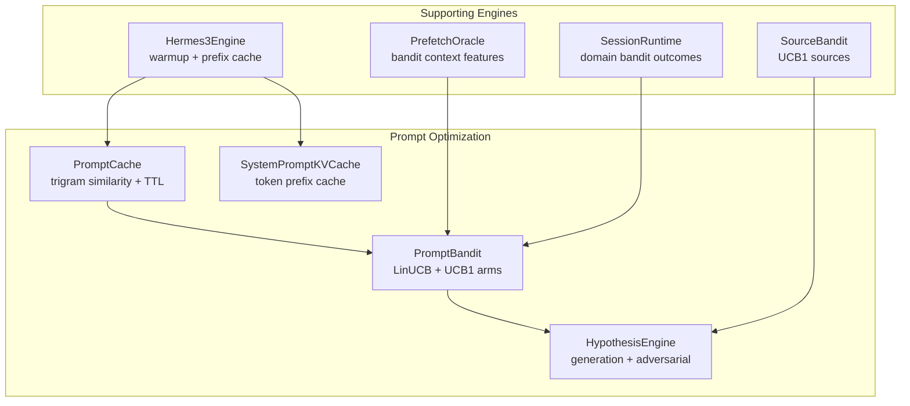
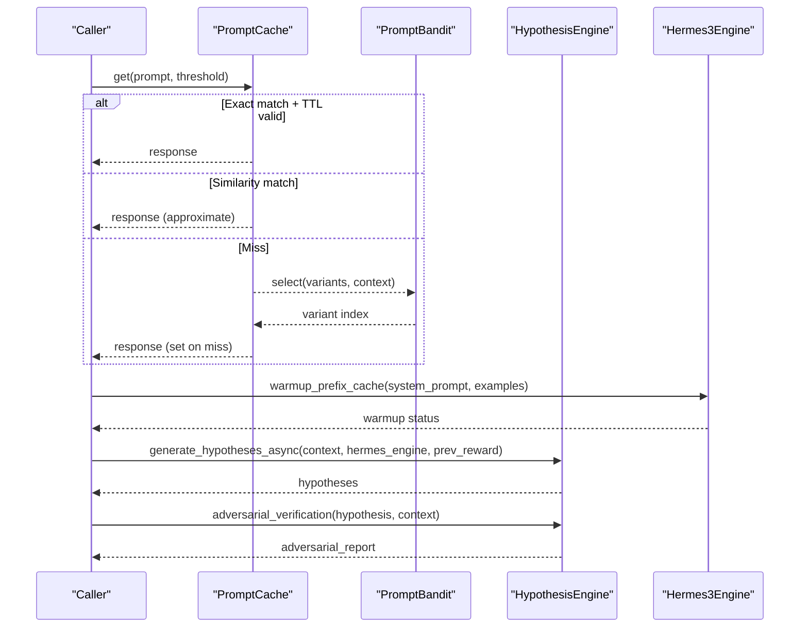
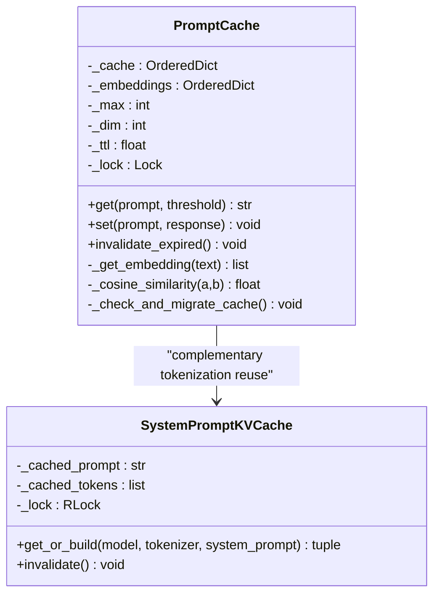
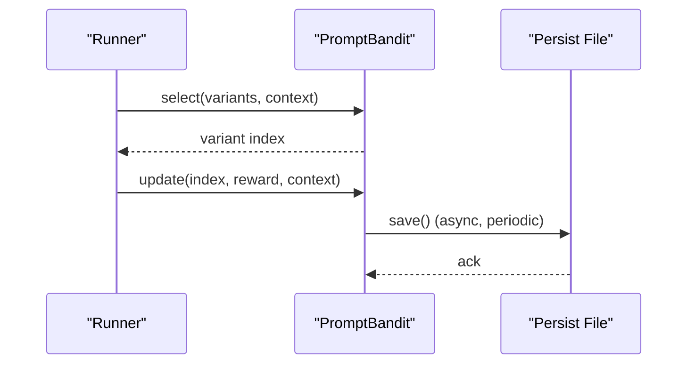
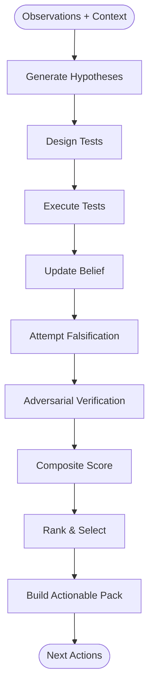
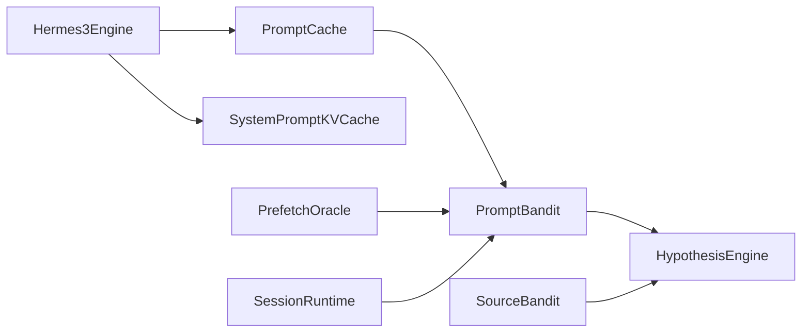

# Prompt Optimization

<cite>
**Referenced Files in This Document**
- [prompt_cache.py](file://brain/prompt_cache.py)
- [prompt_bandit.py](file://brain/prompt_bandit.py)
- [hypothesis_engine.py](file://brain/hypothesis_engine.py)
- [hermes3_engine.py](file://brain/hermes3_engine.py)
- [prefetch_oracle.py](file://prefetch/prefetch_oracle.py)
- [session_runtime.py](file://network/session_runtime.py)
- [source_bandit.py](file://tools/source_bandit.py)
- [config.py](file://config.py)
- [test_prompt_cache.py](file://tests/test_sprint78/test_prompt_cache.py)
- [test_optimizations.py](file://tests/test_sprint79b/test_optimizations.py)
</cite>

## Table of Contents
1. [Introduction](#introduction)
2. [Project Structure](#project-structure)
3. [Core Components](#core-components)
4. [Architecture Overview](#architecture-overview)
5. [Detailed Component Analysis](#detailed-component-analysis)
6. [Dependency Analysis](#dependency-analysis)
7. [Performance Considerations](#performance-considerations)
8. [Troubleshooting Guide](#troubleshooting-guide)
9. [Conclusion](#conclusion)

## Introduction
This document describes the prompt optimization systems in the codebase, focusing on three pillars:
- Prompt caching: approximate prompt matching with trigram-based similarity, TTL-based eviction, and system prompt tokenization reuse
- Bandit-based prompt selection: contextual LinUCB for adaptive prompt variant selection and UCB1 for predefined prompt arms
- Hypothesis engine: automated hypothesis generation, adversarial verification, and structured refinement workflows

It covers architecture, data flows, configuration options, performance characteristics, and practical guidance for tuning cache sizes, bandit parameters, and hypothesis generation rules.

## Project Structure
The prompt optimization functionality spans several modules:
- Prompt cache: approximate similarity cache and system prompt tokenization cache
- Prompt bandit: contextual LinUCB and discrete UCB1 arm selection
- Hypothesis engine: hypothesis lifecycle, adversarial verification, and structured refinement
- Supporting utilities: Hermes 3 engine for warmup, prefetch oracle bandits, and runtime bandits

**Diagram sources**
- [prompt_cache.py:48-199](file://brain/prompt_cache.py#L48-L199)
- [prompt_cache.py:204-257](file://brain/prompt_cache.py#L204-L257)
- [prompt_bandit.py:16-331](file://brain/prompt_bandit.py#L16-L331)
- [hypothesis_engine.py:2105-2200](file://brain/hypothesis_engine.py#L2105-L2200)
- [hermes3_engine.py:1119-1142](file://brain/hermes3_engine.py#L1119-L1142)
- [prefetch_oracle.py:330-364](file://prefetch/prefetch_oracle.py#L330-L364)
- [session_runtime.py:138-178](file://network/session_runtime.py#L138-L178)
- [source_bandit.py:168-240](file://tools/source_bandit.py#L168-L240)

**Section sources**
- [prompt_cache.py:1-257](file://brain/prompt_cache.py#L1-L257)
- [prompt_bandit.py:1-331](file://brain/prompt_bandit.py#L1-L331)
- [hypothesis_engine.py:1-4434](file://brain/hypothesis_engine.py#L1-L4434)
- [hermes3_engine.py:1119-1142](file://brain/hermes3_engine.py#L1119-L1142)
- [prefetch_oracle.py:330-364](file://prefetch/prefetch_oracle.py#L330-L364)
- [session_runtime.py:138-178](file://network/session_runtime.py#L138-L178)
- [source_bandit.py:168-240](file://tools/source_bandit.py#L168-L240)

## Core Components
- PromptCache: maintains a bounded, TTL-aware cache of prompt-response pairs with approximate similarity using trigram embeddings and cosine similarity. Includes a dedicated system prompt tokenization cache for repeated synthesis.
- PromptBandit: contextual LinUCB for selecting among prompt variants, plus discrete UCB1 selection over predefined prompt arms with modifiers.
- HypothesisEngine: automated hypothesis generation, test design/execution, adversarial verification, and structured refinement into actionable packs.

Key configuration surfaces:
- PromptCache: max_entries, embedding_dim, TTL
- PromptBandit: alpha (exploration), lambda (regularization), context_dim, persist_path, arm thresholds
- HypothesisEngine: max_hypotheses, min_confidence_threshold, memory_limit_mb, enable_adversarial_verification

**Section sources**
- [prompt_cache.py:48-199](file://brain/prompt_cache.py#L48-L199)
- [prompt_cache.py:204-257](file://brain/prompt_cache.py#L204-L257)
- [prompt_bandit.py:26-54](file://brain/prompt_bandit.py#L26-L54)
- [hypothesis_engine.py:2147-2170](file://brain/hypothesis_engine.py#L2147-L2170)
- [config.py:394-464](file://config.py#L394-L464)

## Architecture Overview
The prompt optimization pipeline integrates caching, adaptive selection, and hypothesis-driven refinement:

**Diagram sources**
- [prompt_cache.py:126-174](file://brain/prompt_cache.py#L126-L174)
- [prompt_bandit.py:158-202](file://brain/prompt_bandit.py#L158-L202)
- [hypothesis_engine.py:2445-2541](file://brain/hypothesis_engine.py#L2445-L2541)
- [hermes3_engine.py:2096-2127](file://brain/hermes3_engine.py#L2096-L2127)

## Detailed Component Analysis

### Prompt Cache
Purpose:
- Store prompt-response pairs with TTL and LRU eviction
- Provide approximate similarity matching using trigram embeddings and cosine similarity
- Persist across sessions and migrate cache versions

Key behaviors:
- Exact match with TTL check
- Approximate similarity search over recent entries using cached embeddings
- Trigram hashing with xxhash fallbacks and numpy-accelerated cosine similarity
- Versioned cache keys and migration handling

**Diagram sources**
- [prompt_cache.py:48-199](file://brain/prompt_cache.py#L48-L199)
- [prompt_cache.py:204-257](file://brain/prompt_cache.py#L204-L257)

Configuration highlights:
- max_entries: controls cache capacity (LRU eviction)
- embedding_dim: dimensionality of trigram embeddings
- ttl: time-to-live for entries
- persistence: versioned cache keys and migration

Operational notes:
- Embeddings are cached per prompt to avoid recomputation during similarity scans
- Approximate search scans the last 100 entries to bound cost
- Thread-safe via locks for concurrent access

**Section sources**
- [prompt_cache.py:48-199](file://brain/prompt_cache.py#L48-L199)
- [prompt_cache.py:204-257](file://brain/prompt_cache.py#L204-L257)
- [test_prompt_cache.py:1-128](file://tests/test_sprint78/test_prompt_cache.py#L1-L128)
- [test_optimizations.py:47-84](file://tests/test_sprint79b/test_optimizations.py#L47-L84)

### Prompt Bandit
Purpose:
- Select among prompt variants adaptively using contextual LinUCB
- Choose predefined prompt arms using UCB1 with per-arm statistics

Key behaviors:
- Context vector construction from complexity, task, time, thermal state, power, RAM, and GPU load
- LinUCB update with matrix inversion fallbacks and periodic persistence
- UCB1 selection over named prompt arms with composite reward combining factors

**Diagram sources**
- [prompt_bandit.py:158-202](file://brain/prompt_bandit.py#L158-L202)
- [prompt_bandit.py:75-101](file://brain/prompt_bandit.py#L75-L101)

Configuration highlights:
- alpha: exploration strength for LinUCB
- lambda: regularization for LinUCB covariance matrix
- context_dim: dimensionality of context vector
- persist_path: JSON persistence location
- arm selection: UCB1 over named arms with per-arm counters and rewards

Operational notes:
- Rewards clipped to [0,1]
- Saves periodically with atomic temp-file replacement
- Supports A/B testing with impressions/conversions

**Section sources**
- [prompt_bandit.py:16-331](file://brain/prompt_bandit.py#L16-L331)

### Hypothesis Engine
Purpose:
- Generate, test, and refine research hypotheses using Popperian falsification and Bayesian updates
- Provide adversarial verification with source credibility, contradiction detection, and devil's advocate analysis
- Produce structured, prioritized action packs for follow-up queries and IOCs

Key behaviors:
- Hypothesis lifecycle: generation → test design → execution → update → falsification
- Adversarial verification: counter-evidence search, source credibility, temporal consistency, cross-reference
- Composite scoring: confidence, test quality, evidence diversity, falsification resistance
- Structured packs: hypotheses, queries, IOC pivots, source hints with prioritization

**Diagram sources**
- [hypothesis_engine.py:2445-2541](file://brain/hypothesis_engine.py#L2445-L2541)
- [hypothesis_engine.py:2693-2792](file://brain/hypothesis_engine.py#L2693-L2792)
- [hypothesis_engine.py:2819-2899](file://brain/hypothesis_engine.py#L2819-L2899)
- [hypothesis_engine.py:3019-3094](file://brain/hypothesis_engine.py#L3019-L3094)

Configuration highlights:
- max_hypotheses: upper bound on tracked hypotheses
- min_confidence_threshold: pruning and status thresholds
- memory_limit_mb: target memory footprint
- enable_adversarial_verification: toggle adversarial features

Operational notes:
- Bounded storage with deterministic LRU eviction for evidence and source credibility
- Asynchronous adversarial checks with streaming windows
- Structured pack generation with priority ordering and deduplication

**Section sources**
- [hypothesis_engine.py:2147-2200](file://brain/hypothesis_engine.py#L2147-L2200)
- [hypothesis_engine.py:2445-2541](file://brain/hypothesis_engine.py#L2445-L2541)
- [hypothesis_engine.py:2693-2792](file://brain/hypothesis_engine.py#L2693-L2792)
- [hypothesis_engine.py:2819-2899](file://brain/hypothesis_engine.py#L2819-L2899)
- [hypothesis_engine.py:3019-3094](file://brain/hypothesis_engine.py#L3019-L3094)

### System Prompt Tokenization Cache
Purpose:
- Reuse tokenization for repeated system prompts to reduce latency
- Integrate with Hermes 3 engine for warmup and prefix caching

Key behaviors:
- SHA-256 keyed cache of encoded tokens
- LRU eviction with maximum size enforcement
- Integration with Hermes 3 warmup routine

**Section sources**
- [prompt_cache.py:204-257](file://brain/prompt_cache.py#L204-L257)
- [hermes3_engine.py:1119-1142](file://brain/hermes3_engine.py#L1119-L1142)
- [hermes3_engine.py:2096-2127](file://brain/hermes3_engine.py#L2096-L2127)

### Related Bandit Integrations
- Prefetch Oracle bandits: contextual features and arm management for prefetch decisions
- Session runtime domain bandits: per-host concurrency limits using gradient bandits
- Source bandit: UCB1 selection over sources for data quality

**Section sources**
- [prefetch_oracle.py:330-364](file://prefetch/prefetch_oracle.py#L330-L364)
- [session_runtime.py:138-178](file://network/session_runtime.py#L138-L178)
- [source_bandit.py:168-240](file://tools/source_bandit.py#L168-L240)

## Dependency Analysis
The prompt optimization components interact as follows:

**Diagram sources**
- [prompt_cache.py:48-199](file://brain/prompt_cache.py#L48-L199)
- [prompt_bandit.py:16-331](file://brain/prompt_bandit.py#L16-L331)
- [hypothesis_engine.py:2105-2200](file://brain/hypothesis_engine.py#L2105-L2200)
- [hermes3_engine.py:1119-1142](file://brain/hermes3_engine.py#L1119-L1142)
- [prefetch_oracle.py:330-364](file://prefetch/prefetch_oracle.py#L330-L364)
- [session_runtime.py:138-178](file://network/session_runtime.py#L138-L178)
- [source_bandit.py:168-240](file://tools/source_bandit.py#L168-L240)

**Section sources**
- [prompt_cache.py:48-199](file://brain/prompt_cache.py#L48-L199)
- [prompt_bandit.py:16-331](file://brain/prompt_bandit.py#L16-L331)
- [hypothesis_engine.py:2105-2200](file://brain/hypothesis_engine.py#L2105-L2200)
- [hermes3_engine.py:1119-1142](file://brain/hermes3_engine.py#L1119-L1142)
- [prefetch_oracle.py:330-364](file://prefetch/prefetch_oracle.py#L330-L364)
- [session_runtime.py:138-178](file://network/session_runtime.py#L138-L178)
- [source_bandit.py:168-240](file://tools/source_bandit.py#L168-L240)

## Performance Considerations
- PromptCache
  - Trigram embedding dimension trades off accuracy and speed; larger dimensions improve similarity but increase compute
  - TTL prevents stale entries; adjust based on reuse patterns
  - Approximate search bounds cost by scanning last N entries
- PromptBandit
  - LinUCB benefits from good context features; ensure context_dim matches feature vector length
  - Periodic persistence reduces overhead; tune save frequency
  - UCB1 exploration helps discover better arms initially
- HypothesisEngine
  - Bounded evidence and source credibility caches prevent memory growth
  - Adversarial verification uses streaming windows and async I/O to stay responsive
  - Composite scoring balances confidence, test quality, diversity, and falsification resistance

[No sources needed since this section provides general guidance]

## Troubleshooting Guide
Common issues and resolutions:
- PromptCache
  - Symptoms: frequent misses despite similar prompts
    - Check threshold parameter for get() and embedding_dim sizing
    - Verify approximate similarity is enabled and embeddings are being reused
  - Symptoms: memory growth or slow lookups
    - Reduce max_entries or embedding_dim
    - Confirm TTL invalidation is running
- PromptBandit
  - Symptoms: poor variant selection
    - Increase alpha for more exploration or adjust context features
    - Verify persistence file is writable and not corrupted
  - Symptoms: inconsistent arm selection
    - Ensure arm counts and rewards are being updated consistently
- HypothesisEngine
  - Symptoms: hypotheses not generated
    - Verify inference engine integration and context completeness
    - Check max_hypotheses and memory_limit_mb constraints
  - Symptoms: adversarial verification disabled
    - Confirm enable_adversarial_verification flag and feature availability

**Section sources**
- [prompt_cache.py:126-174](file://brain/prompt_cache.py#L126-L174)
- [prompt_bandit.py:75-101](file://brain/prompt_bandit.py#L75-L101)
- [hypothesis_engine.py:2326-2340](file://brain/hypothesis_engine.py#L2326-L2340)

## Conclusion
The prompt optimization system combines efficient caching, adaptive selection, and rigorous hypothesis refinement to accelerate research workflows. PromptCache accelerates repeated prompt reuse with approximate similarity and TTL management. PromptBandit adapts prompt selection using contextual LinUCB and discrete UCB1 arms. HypothesisEngine automates hypothesis lifecycle with adversarial verification and structured action packs. Together, these components provide a scalable foundation for prompt engineering, caching, and adaptive selection in constrained environments.