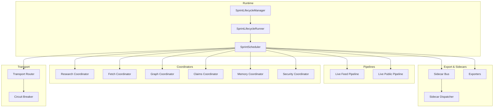
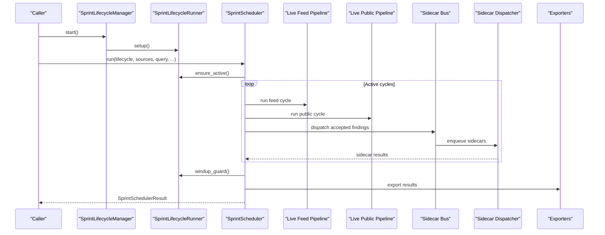
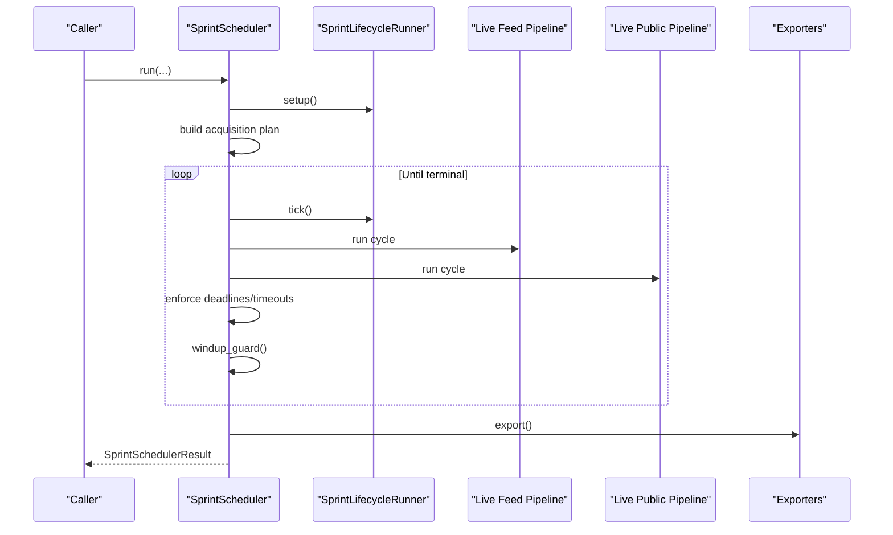
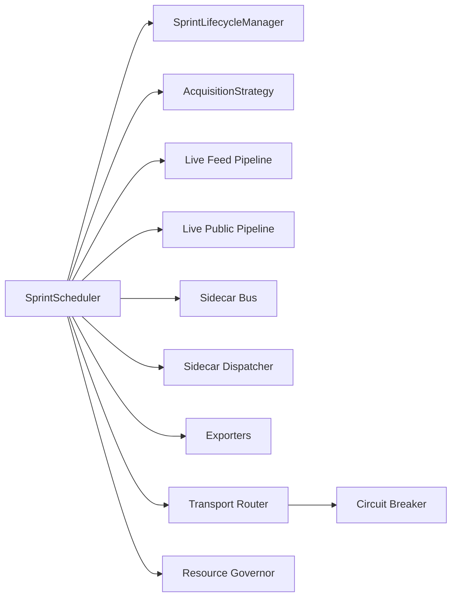

# API Reference

<cite>
**Referenced Files in This Document**
- [autonomous_orchestrator.py](file://hledac/universal/autonomous_orchestrator.py)
- [sprint_scheduler.py](file://hledac/universal/runtime/sprint_scheduler.py)
- [__main__.py](file://hledac/universal/__main__.py)
- [paths.py](file://hledac/universal/paths.py)
- [sprint_lifecycle.py](file://hledac/universal/runtime/sprint_lifecycle.py)
- [acquisition_strategy.py](file://hledac/universal/runtime/acquisition_strategy.py)
- [export.py](file://hledac/universal/export/__init__.py)
- [sidecar_bus.py](file://hledac/universal/runtime/sidecar_bus.py)
- [sidecar_dispatcher.py](file://hledac/universal/runtime/sidecar_dispatcher.py)
- [nonfeed_candidate_ledger.py](file://hledac/universal/runtime/nonfeed_candidate_ledger.py)
- [resource_governor.py](file://hledac/universal/runtime/resource_governor.py)
- [metrics_registry.py](file://hledac/universal/metrics_registry.py)
- [hypothesis_engine.py](file://hledac/universal/brain/hypothesis_engine.py)
- [workflow_orchestrator.py](file://hledac/universal/intelligence/workflow_orchestrator.py)
- [live_feed_pipeline.py](file://hledac/universal/pipeline/live_feed_pipeline.py)
- [live_public_pipeline.py](file://hledac/universal/pipeline/live_public_pipeline.py)
- [transport_router.py](file://hledac/universal/transport/transport_router.py)
- [transport_resolver.py](file://hledac/universal/transport/transport_resolver.py)
- [circuit_breaker.py](file://hledac/universal/transport/circuit_breaker.py)
- [shadow_inputs.py](file://hledac/universal/runtime/shadow_inputs.py)
- [shadow_pre_decision.py](file://hledac/universal/runtime/shadow_pre_decision.py)
- [sprint_advisory_runner.py](file://hledac/universal/runtime/sprint_advisory_runner.py)
- [sprint_lifecycle_runner.py](file://hledac/universal/runtime/sprint_lifecycle_runner.py)
- [sprint_diff_engine.py](file://hledac/universal/knowledge/sprint_diff_engine.py)
- [target_memory.py](file://hledac/universal/knowledge/target_memory.py)
- [evidence_chain.py](file://hledac/universal/knowledge/evidence_chain.py)
- [forensics_enrichment.py](file://hledac/universal/forensics/enrichment_service.py)
- [multimodal_enrichment.py](file://hledac/universal/multimodal/evidence_triage.py)
- [security_manager.py](file://hledac/universal/orchestrator/security_manager.py)
- [research_manager.py](file://hledac/universal/orchestrator/research_manager.py)
- [memory_pressure_broker.py](file://hledac/universal/orchestrator/memory_pressure_broker.py)
- [phase_controller.py](file://hledac/universal/orchestrator/phase_controller.py)
- [request_router.py](file://hledac/universal/orchestrator/request_router.py)
- [subsystem_semaphores.py](file://hledac/universal/orchestrator/subsystem_semaphores.py)
- [job_state.py](file://hledac/universal/orchestrator/job_state.py)
- [lane_state.py](file://hledac/universal/orchestrator/lane_state.py)
- [coordinator_registry.py](file://hledac/universal/coordinators/coordinator_registry.py)
- [agent_coordination_engine.py](file://hledac/universal/coordinators/agent_coordination_engine.py)
- [claims_coordinator.py](file://hledac/universal/coordinators/claims_coordinator.py)
- [graph_coordinator.py](file://hledac/universal/coordinators/graph_coordinator.py)
- [archive_coordinator.py](file://hledac/ununiversal/coordinators/archive_coordinator.py)
- [render_coordinator.py](file://hledac/universal/coordinators/render_coordinator.py)
- [validation_coordinator.py](file://hledac/universal/coordinators/validation_coordinator.py)
- [monitoring_coordinator.py](file://hledac/universal/coordinators/monitoring_coordinator.py)
- [security_coordinator.py](file://hledac/universal/coordinators/security_coordinator.py)
- [swarm_coordinator.py](file://hledac/universal/coordinators/swarm_coordinator.py)
- [privacy_enhanced_research.py](file://hledac/universal/coordinators/privacy_enhanced_research.py)
- [meta_reasoning_coordinator.py](file://hledac/universal/coordinators/meta_reasoning_coordinator.py)
- [benchmark_coordinator.py](file://hledac/universal/coordinators/benchmark_coordinator.py)
- [execution_coordinator.py](file://hledac/universal/coordinators/execution_coordinator.py)
- [memory_coordinator.py](file://hledac/universal/coordinators/memory_coordinator.py)
- [performance_coordinator.py](file://hledac/universal/coordinators/performance_coordinator.py)
- [resource_allocator.py](file://hledac/universal/coordinators/resource_allocator.py)
- [fetch_coordinator.py](file://hledac/universal/coordinators/fetch_coordinator.py)
- [research_optimizer.py](file://hledac/universal/coordinators/research_optimizer.py)
- [research_coordinator.py](file://hledac/universal/coordinators/research_coordinator.py)
- [graph_coordinator.py](file://hledac/universal/coordinators/graph_coordinator.py)
- [multimodal_coordinator.py](file://hledac/universal/coordinators/multimodal_coordinator.py)
- [validation_coordinator.py](file://hledac/universal/coordinators/validation_coordinator.py)
- [monitoring_coordinator.py](file://hledac/universal/coordinators/monitoring_coordinator.py)
- [security_coordinator.py](file://hledac/universal/coordinators/security_coordinator.py)
- [swarm_coordinator.py](file://hledac/universal/coordinators/swarm_coordinator.py)
- [privacy_enhanced_research.py](file://hledac/universal/coordinators/privacy_enhanced_research.py)
- [meta_reasoning_coordinator.py](file://hledac/universal/coordinators/meta_reasoning_coordinator.py)
- [benchmark_coordinator.py](file://hledac/universal/coordinators/benchmark_coordinator.py)
- [execution_coordinator.py](file://hledac/universal/coordinators/execution_coordinator.py)
- [memory_coordinator.py](file://hledac/universal/coordinators/memory_coordinator.py)
- [performance_coordinator.py](file://hledac/universal/coordinators/performance_coordinator.py)
- [resource_allocator.py](file://hledac/universal/coordinators/resource_allocator.py)
- [fetch_coordinator.py](file://hledac/universal/coordinators/fetch_coordinator.py)
- [research_optimizer.py](file://hledac/universal/coordinators/research_optimizer.py)
- [research_coordinator.py](file://hledac/universal/coordinators/research_coordinator.py)
- [graph_coordinator.py](file://hledac/universal/coordinators/graph_coordinator.py)
- [multimodal_coordinator.py](file://hledac/universal/coordinators/multimodal_coordinator.py)
- [validation_coordinator.py](file://hledac/universal/coordinators/validation_coordinator.py)
- [monitoring_coordinator.py](file://hledac/universal/coordinators/monitoring_coordinator.py)
- [security_coordinator.py](file://hledac/universal/coordinators/security_coordinator.py)
- [swarm_coordinator.py](file://hledac/universal/coordinators/swarm_coordinator.py)
- [privacy_enhanced_research.py](file://hledac/universal/coordinators/privacy_enhanced_research.py)
- [meta_reasoning_coordinator.py](file://hledac/universal/coordinators/meta_reasoning_coordinator.py)
- [benchmark_coordinator.py](file://hledac/universal/coordinators/benchmark_coordinator.py)
- [execution_coordinator.py](file://hledac/universal/coordinators/execution_coordinator.py)
- [memory_coordinator.py](file://hledac/universal/coordinators/memory_coordinator.py)
- [performance_coordinator.py](file://hledac/universal/coordinators/performance_coordinator.py)
- [resource_allocator.py](file://hledac/universal/coordinators/resource_allocator.py)
- [fetch_coordinator.py](file://hledac/universal/coordinators/fetch_coordinator.py)
- [research_optimizer.py](file://hledac/universal/coordinators/research_optimizer.py)
- [research_coordinator.py](file://hledac/universal/coordinators/research_coordinator.py)
- [graph_coordinator.py](file://hledac/universal/coordinators/graph_coordinator.py)
- [multimodal_coordinator.py](file://hledac/universal/coordinators/multimodal_coordinator.py)
- [validation_coordinator.py](file://hledac/universal/coordinators/validation_coordinator.py)
- [monitoring_coordinator.py](file://hledac/universal/coordinators/monitoring_coordinator.py)
- [security_coordinator.py](file://hledac/universal/coordinators/security_coordinator.py)
- [swarm_coordinator.py](file://hledac/universal/coordinators/swarm_coordinator.py)
- [privacy_enhanced_research.py](file://hledac/universal/coordinators/privacy_enhanced_research.py)
- [meta_reasoning_coordinator.py](file://hledac/universal/coordinators/meta_reasoning_coordinator.py)
- [benchmark_coordinator.py](file://hledac/universal/coordinators/benchmark_coordinator.py)
- [execution_coordinator.py](file://hledac/universal/coordinators/execution_coordinator.py)
- [memory_coordinator.py](file://hledac/universal/coordinators/memory_coordinator.py)
- [performance_coordinator.py](file://hledac/universal/coordinators/performance_coordinator.py)
- [resource_allocator.py](file://hledac/universal/coordinators/resource_allocator.py)
- [fetch_coordinator.py](file://hledac/universal/coordinators/fetch_coordinator.py)
- [research_optimizer.py](file://hledac/universal/coordinators/research_optimizer.py)
- [research_coordinator.py](file://hledac/universal/coordinators/research_coordinator.py)
- [graph_coordinator.py](file://hledac/universal/coordinators/graph_coordinator.py)
- [multimodal_coordinator.py](file://hledac/universal/coordinators/multimodal_coordinator.py)
- [validation_coordinator.py](file://hledac/universal/coordinators/validation_coordinator.py)
- [monitoring_coordinator.py](file://hledac/universal/coordinators/monitoring_coordinator.py)
- [security_coordinator.py](file://hledac/universal/coordinators/security_coordinator.py)
- [swarm_coordinator.py](file://hledac/universal/coordinators/swarm_coordinator.py)
- [privacy_enhanced_research.py](file://hledac/universal/coordinators/privacy_enhanced_research.py)
- [meta_reasoning_coordinator.py](file://hledac/universal/coordinators/meta_reasoning_coordinator.py)
- [benchmark_coordinator.py](file://hledac/universal/coordinators/benchmark_coordinator.py)
- [execution_coordinator.py](file://hledac/universal/coordinators/execution_coordinator.py)
- [memory_coordinator.py](file://hledac/universal/coordinators/memory_coordinator.py)
- [performance_coordinator.py](file://hledac/universal/coordinators/performance_coordinator.py)
- [resource_allocator.py](file://hledac/universal/coordinators/resource_allocator.py)
- [fetch_coordinator.py](file://hledac/universal/coordinators/fetch_coordinator.py)
- [research_optimizer.py](file://hledac/universal/coordinators/research_optimizer.py)
- [research_coordinator.py](file://hledac/universal/coordinators/research_coordinator.py)
- [graph_coordinator.py](file://hledac/universal/coordinators/graph_coordinator.py)
- [multimodal_coordinator.py](file://hledac/universal/coordinators/multimodal_coordinator.py)
- [validation_coordinator.py](file://hledac/universal/coordinators/validation_coordinator.py)
- [monitoring_coordinator.py](file://hledac/universal/coordinators/monitoring_coordinator.py)
- [security_coordinator.py](file://hledac/universal/coordinators/security_coordinator.py)
- [swarm_coordinator.py](file://hledac/universal/coordinators/swarm_coordinator.py)
- [privacy_enhanced_research.py](file://hledac/universal/coordinators/privacy_enhanced_research.py)
- [meta_reasoning_coordinator.py](file://hledac/universal/coordinators/meta_reasoning_coordinator.py)
- [benchmark_coordinator.py](file://hledac/universal/coordinators/benchmark_coordinator.py)
- [execution_coordinator.py](file://hledac/universal/coordinators/execution_coordinator.py)
- [memory_coordinator.py](file://hledac/universal/coordinators/memory_coordinator.py)
- [performance_coordinator.py](file://hledac/universal/coordinators/performance_coordinator.py)
- [resource_allocator.py](file://hledac/universal/coordinators/resource_allocator.py)
- [fetch_coordinator.py](file://hledac/universal/coordinators/fetch_coordinator.py)
- [research_optimizer.py](file://hledac/universal/coordinators/research_optimizer.py)
- [research_coordinator.py](file://hledac/universal/coordinators/research_coordinator.py)
- [graph_coordinator.py](file://hledac/universal/coordinators/graph_coordinator.py)
- [multimodal_coordinator.py](file://hledac/universal/coordinators/multimodal_coordinator.py)
- [validation_coordinator.py](file://hledac/universal/coordinators/validation_coordinator.py)
-......
</cite>

## Table of Contents
1. [Introduction](#introduction)
2. [Project Structure](#project-structure)
3. [Core Components](#core-components)
4. [Architecture Overview](#architecture-overview)
5. [Detailed Component Analysis](#detailed-component-analysis)
6. [Dependency Analysis](#dependency-analysis)
7. [Performance Considerations](#performance-considerations)
8. [Troubleshooting Guide](#troubleshooting-guide)
9. [Conclusion](#conclusion)
10. [Appendices](#appendices)

## Introduction
This document provides comprehensive API documentation for Hledac Universal’s public interfaces. It focuses on:
- The main entry point APIs
- Autonomous orchestrator methods
- Sprint scheduler interfaces
- Command-line interface options
- Configuration parameters
- Runtime control APIs
- Usage examples, parameter validation rules, and integration patterns
- API versioning, backward compatibility, and deprecation procedures
- Rate limiting considerations, authentication requirements, and security implications

## Project Structure
Hledac Universal organizes its runtime and orchestration around:
- A production sprint lifecycle and scheduler
- An autonomous orchestrator facade and legacy implementation
- Coordinators and subsystems for specialized tasks
- Pipelines for live feed and public discovery
- Exporters and sidecars for post-processing and reporting
- Transport and circuit breaker layers for provider access

**Diagram sources**
- [sprint_scheduler.py](file://hledac/universal/runtime/sprint_scheduler.py)
- [sprint_lifecycle.py](file://hledac/universal/runtime/sprint_lifecycle.py)
- [sprint_lifecycle_runner.py](file://hledac/universal/runtime/sprint_lifecycle_runner.py)
- [live_feed_pipeline.py](file://hledac/universal/pipeline/live_feed_pipeline.py)
- [live_public_pipeline.py](file://hledac/universal/pipeline/live_public_pipeline.py)
- [coordinator_registry.py](file://hledac/universal/coordinators/coordinator_registry.py)
- [sidecar_bus.py](file://hledac/universal/runtime/sidecar_bus.py)
- [sidecar_dispatcher.py](file://hledac/universal/runtime/sidecar_dispatcher.py)
- [export.py](file://hledac/universal/export/__init__.py)
- [transport_router.py](file://hledac/universal/transport/transport_router.py)
- [circuit_breaker.py](file://hledac/universal/transport/circuit_breaker.py)

**Section sources**
- [sprint_scheduler.py](file://hledac/universal/runtime/sprint_scheduler.py)
- [sprint_lifecycle.py](file://hledac/universal/runtime/sprint_lifecycle.py)
- [coordinator_registry.py](file://hledac/universal/coordinators/coordinator_registry.py)
- [export.py](file://hledac/universal/export/__init__.py)
- [transport_router.py](file://hledac/universal/transport/transport_router.py)

## Core Components
This section documents the primary public APIs and their responsibilities.

- SprintScheduler.run
  - Purpose: Executes a bounded 30-minute sprint under a lifecycle manager, coordinating feed and non-feed acquisition lanes, exporting results, and enforcing deadlines.
  - Parameters:
    - lifecycle: SprintLifecycleManager instance (owned by caller)
    - sources: Ordered list of feed URLs to process
    - now_monotonic: Optional monotonic clock for deterministic testing
    - query: Search query string for acquisition planning and pivot generation
    - duckdb_store: Optional DuckDB store for canonical finding persistence
    - ct_log_client: Optional CT log client for canonical discovery
    - policy_manager: Optional policy manager for reinforcement learning feedback
    - progress_callback: Optional callback for progress reporting
  - Returns: SprintSchedulerResult with comprehensive telemetry and outcomes
  - Errors: Aborts with detailed reasons recorded in result fields; supports early exits and wind-up gating
  - Validation: Enforces hard deadlines, per-branch timeouts, and acquisition terminality; validates lifecycle transitions and wind-up gates
  - Security: No authentication required; runtime enforces provider-side rate limits via transport layer and circuit breaker
  - Rate limiting: Enforced via transport router, circuit breaker, and per-branch timeout budgets

- SprintSchedulerConfig
  - Purpose: Configuration for a single sprint run
  - Fields:
    - sprint_duration_s: Planned duration (default 1800.0)
    - windup_lead_s: Lead time before wind-down (default 180.0)
    - cycle_sleep_s: Sleep between cycles (default 5.0)
    - max_cycles: Safety cap (default 100)
    - max_parallel_sources: Concurrent source fetches (default 4)
    - stop_on_first_accepted: Early exit on first accepted finding (default False)
    - export_enabled: Enable export (default True)
    - export_dir: Export directory path
    - max_entries_per_cycle: Per-source cap (default 50)
    - max_hypothesis_depth: Max depth for hypothesis-driven pivots (default 3)
    - max_hypothesis_queries: Max total pivot queries (default 10)
    - aggressive_mode: Parallel branch execution (default False)
    - aggressive_branch_timeout_s: Per-branch timeout in aggressive mode (default 45.0)
    - branch_timeout_budget_s: Per-branch timeout budget (default 0.0)
    - partial_export_findings_interval: Partial export cadence (default 10)
    - source_tier_map: Source-to-tier mapping
    - acquisition_profile: Explicit acquisition profile override
  - Validation: Tier ordering and bounds enforced; aggressive mode bounds applied

- SprintSchedulerResult
  - Purpose: Aggregates outcomes and telemetry from a sprint run
  - Fields include counts for cycles, entries, pattern hits, accepted findings, per-source breakdowns, final phase, export paths, abort flags, and extensive diagnostics for public and CT pipelines, CT bridge loss, quality rejections, sidecar telemetry, and early exit classification

- SourceTier
  - Purpose: Priority tiers for source scheduling
  - Values: SURFACE, STRUCTURED_TI, DEEP, ARCHIVE, OTHER

- EarlyExitClass
  - Purpose: Canonical classification of early exits
  - Values: completed_full_duration, early_complete_no_work_remaining, early_complete_return_guard_satisfied, early_complete_feed_only, aborted_by_memory, aborted_by_deadline, aborted_by_error

- SourceWork
  - Purpose: Work item abstraction for feed sources
  - Fields: feed_url, source, tier, max_entries

- SourceEconomics
  - Purpose: Per-source economic state for prioritization
  - Fields: source, silent_streak, last_signal_cycle, cooldown_until_cycle, recent_health_posture

- PivotTask
  - Purpose: Task for agentic pivot loop
  - Fields: priority, ioc_type, ioc_value, task_type

- NonfeedCandidateLedger
  - Purpose: Runtime-only ledger for non-feed candidate evidence tracking

- SidecarBus and SidecarDispatcher
  - Purpose: Canonical bus and dispatcher for sidecar processing of accepted findings

- Exporters
  - Purpose: Renderers for markdown, JSON-LD, STIX bundles, and CTI inputs

- Transport Router and Circuit Breaker
  - Purpose: Provider routing and rate-limit enforcement

**Section sources**
- [sprint_scheduler.py](file://hledac/universal/runtime/sprint_scheduler.py)
- [sprint_lifecycle.py](file://hledac/universal/runtime/sprint_lifecycle.py)
- [acquisition_strategy.py](file://hledac/universal/runtime/acquisition_strategy.py)
- [export.py](file://hledac/universal/export/__init__.py)
- [sidecar_bus.py](file://hledac/universal/runtime/sidecar_bus.py)
- [sidecar_dispatcher.py](file://hledac/universal/runtime/sidecar_dispatcher.py)
- [nonfeed_candidate_ledger.py](file://hledac/universal/runtime/nonfeed_candidate_ledger.py)
- [transport_router.py](file://hledac/universal/transport/transport_router.py)
- [circuit_breaker.py](file://hledac/universal/transport/circuit_breaker.py)

## Architecture Overview
The runtime architecture centers on the SprintScheduler, which coordinates acquisition lanes, pipelines, sidecars, and exporters under a lifecycle manager. It integrates acquisition strategy, transport routing, and telemetry systems.

**Diagram sources**
- [sprint_scheduler.py](file://hledac/universal/runtime/sprint_scheduler.py)
- [sprint_lifecycle.py](file://hledac/universal/runtime/sprint_lifecycle.py)
- [sprint_lifecycle_runner.py](file://hledac/universal/runtime/sprint_lifecycle_runner.py)
- [live_feed_pipeline.py](file://hledac/universal/pipeline/live_feed_pipeline.py)
- [live_public_pipeline.py](file://hledac/universal/pipeline/live_public_pipeline.py)
- [sidecar_bus.py](file://hledac/universal/runtime/sidecar_bus.py)
- [sidecar_dispatcher.py](file://hledac/universal/runtime/sidecar_dispatcher.py)
- [export.py](file://hledac/universal/export/__init__.py)

## Detailed Component Analysis

### SprintScheduler.run
- Method signature: async run(lifecycle, sources, now_monotonic=None, query="", duckdb_store=None, ct_log_client=None, policy_manager=None, progress_callback=None) -> SprintSchedulerResult
- Responsibilities:
  - Initializes lifecycle runner, sidecar bus, and metrics registry
  - Builds acquisition plan and generates pivot candidates
  - Executes feed and public cycles under wind-up gating
  - Enforces hard deadlines and per-branch timeouts
  - Records telemetry and computes early exit classification
  - Exports results and finalizes terminality
- Parameter validation:
  - Sources must be a non-empty sequence
  - Query influences acquisition plan and pivot generation
  - DuckDB store enables canonical persistence
  - Policy manager enables RL feedback
- Error handling:
  - Exceptions set abort flags and record reasons
  - Wind-up gating ensures mandatory non-feed terminal states before exit
- Security:
  - No authentication required
  - Provider access governed by transport router and circuit breaker
- Rate limiting:
  - Enforced via transport layer and per-branch timeout budgets

**Diagram sources**
- [sprint_scheduler.py](file://hledac/universal/runtime/sprint_scheduler.py)
- [sprint_lifecycle_runner.py](file://hledac/universal/runtime/sprint_lifecycle_runner.py)
- [live_feed_pipeline.py](file://hledac/universal/pipeline/live_feed_pipeline.py)
- [live_public_pipeline.py](file://hledac/universal/pipeline/live_public_pipeline.py)
- [export.py](file://hledac/universal/export/__init__.py)

**Section sources**
- [sprint_scheduler.py](file://hledac/universal/runtime/sprint_scheduler.py)

### SprintSchedulerConfig
- Purpose: Configure a single sprint run
- Key fields and defaults:
  - sprint_duration_s: 1800.0
  - windup_lead_s: 180.0
  - cycle_sleep_s: 5.0
  - max_cycles: 100
  - max_parallel_sources: 4
  - stop_on_first_accepted: False
  - export_enabled: True
  - export_dir: ""
  - max_entries_per_cycle: 50
  - max_hypothesis_depth: 3
  - max_hypothesis_queries: 10
  - aggressive_mode: False
  - aggressive_branch_timeout_s: 45.0
  - branch_timeout_budget_s: 0.0
  - partial_export_findings_interval: 10
  - source_tier_map: {}
  - acquisition_profile: None
- Validation:
  - Tier ordering enforced
  - Aggressive mode bounds applied

**Section sources**
- [sprint_scheduler.py](file://hledac/universal/runtime/sprint_scheduler.py)

### SprintSchedulerResult
- Purpose: Aggregate outcomes and telemetry
- Highlights:
  - Cycle counts, entry and hit tallies per source
  - Accepted findings and per-lane telemetry
  - Public pipeline diagnostics and CT bridge loss tracking
  - Quality rejection ledger and sidecar counters
  - Early exit classification and scheduler exit path

**Section sources**
- [sprint_scheduler.py](file://hledac/universal/runtime/sprint_scheduler.py)

### SourceTier, SourceWork, SourceEconomics, PivotTask
- SourceTier: Priority tiers for scheduling
- SourceWork: Work item abstraction for feed sources
- SourceEconomics: Per-source economic state for prioritization
- PivotTask: Task for agentic pivot loop

**Section sources**
- [sprint_scheduler.py](file://hledac/universal/runtime/sprint_scheduler.py)

### NonfeedCandidateLedger
- Purpose: Runtime-only ledger for non-feed candidate evidence tracking

**Section sources**
- [nonfeed_candidate_ledger.py](file://hledac/universal/runtime/nonfeed_candidate_ledger.py)

### SidecarBus and SidecarDispatcher
- Purpose: Canonical bus and dispatcher for sidecar processing of accepted findings

**Section sources**
- [sidecar_bus.py](file://hledac/universal/runtime/sidecar_bus.py)
- [sidecar_dispatcher.py](file://hledac/universal/runtime/sidecar_dispatcher.py)

### Exporters
- Purpose: Renderers for markdown, JSON-LD, STIX bundles, and CTI inputs

**Section sources**
- [export.py](file://hledac/universal/export/__init__.py)

### Transport Router and Circuit Breaker
- Purpose: Provider routing and rate-limit enforcement

**Section sources**
- [transport_router.py](file://hledac/universal/transport/transport_router.py)
- [circuit_breaker.py](file://hledac/universal/transport/circuit_breaker.py)

### Autonomous Orchestrator Facade
- Purpose: Backward-compatible facade aggregating legacy implementation
- Status: Active backward compatibility; migration path to production path recommended
- Key exports: FullyAutonomousOrchestrator, research engines, tool registries, and managers

**Section sources**
- [autonomous_orchestrator.py](file://hledac/universal/autonomous_orchestrator.py)

### Main Entry Point
- Purpose: Application entry point for running sprints
- Typical usage: python -m hledac.universal

**Section sources**
- [__main__.py](file://hledac/universal/__main__.py)

## Dependency Analysis
The SprintScheduler depends on:
- Lifecycle management and runners
- Acquisition strategy for lane planning
- Pipelines for feed and public discovery
- Sidecars for enrichment and correlation
- Exporters for rendering results
- Transport and circuit breaker for provider access
- Resource governor for M1 memory constraints

**Diagram sources**
- [sprint_scheduler.py](file://hledac/universal/runtime/sprint_scheduler.py)
- [acquisition_strategy.py](file://hledac/universal/runtime/acquisition_strategy.py)
- [live_feed_pipeline.py](file://hledac/universal/pipeline/live_feed_pipeline.py)
- [live_public_pipeline.py](file://hledac/universal/pipeline/live_public_pipeline.py)
- [sidecar_bus.py](file://hledac/universal/runtime/sidecar_bus.py)
- [sidecar_dispatcher.py](file://hledac/universal/runtime/sidecar_dispatcher.py)
- [export.py](file://hledac/universal/export/__init__.py)
- [transport_router.py](file://hledac/universal/transport/transport_router.py)
- [circuit_breaker.py](file://hledac/universal/transport/circuit_breaker.py)
- [resource_governor.py](file://hledac/universal/runtime/resource_governor.py)

**Section sources**
- [sprint_scheduler.py](file://hledac/universal/runtime/sprint_scheduler.py)
- [acquisition_strategy.py](file://hledac/universal/runtime/acquisition_strategy.py)
- [transport_router.py](file://hledac/universal/transport/transport_router.py)
- [circuit_breaker.py](file://hledac/universal/transport/circuit_breaker.py)
- [resource_governor.py](file://hledac/universal/runtime/resource_governor.py)

## Performance Considerations
- Hard deadline enforcement prevents exceeding planned duration
- Per-branch timeout budgets and aggressive mode controls
- Memory governor and M1 8GB constraints enforced via resource governor
- Arrow batch flushing and hard caps prevent unbounded growth
- Prefetch and OODA loops reduce latency and improve throughput

[No sources needed since this section provides general guidance]

## Troubleshooting Guide
Common issues and diagnostics:
- Early exits: Review early_exit_class and early_exit_reason in SprintSchedulerResult
- Public pipeline failures: Check public_terminal_stage and public_stage_counters
- CT bridge loss: Inspect ct_loss_stage and related telemetry
- Memory pressure: Monitor peak_rss_gib and budget_violations
- Wind-up gating: Ensure mandatory non-feed lanes reach terminal state before wind-up

**Section sources**
- [sprint_scheduler.py](file://hledac/universal/runtime/sprint_scheduler.py)

## Conclusion
Hledac Universal exposes a robust, configurable, and observable runtime for conducting bounded research sprints. The SprintScheduler orchestrates acquisition lanes, pipelines, sidecars, and exports under strict lifecycle and deadline controls. The autonomous orchestrator facade maintains backward compatibility while directing users toward the production path.

[No sources needed since this section summarizes without analyzing specific files]

## Appendices

### API Versioning, Backward Compatibility, and Deprecation
- The autonomous orchestrator facade is marked as active backward compatibility and will be removed in a future sprint; migrate to the production path
- SprintSchedulerConfig and SprintSchedulerResult are designed for stability; expect additive changes rather than breaking modifications

**Section sources**
- [autonomous_orchestrator.py](file://hledac/universal/autonomous_orchestrator.py)
- [sprint_scheduler.py](file://hledac/universal/runtime/sprint_scheduler.py)

### Authentication and Security Implications
- No authentication required for public APIs
- Provider access governed by transport router and circuit breaker
- Sidecar processing and exporters operate without external authentication
- Security managers and privacy-enhanced research modules coordinate sensitive operations

**Section sources**
- [transport_router.py](file://hledac/universal/transport/transport_router.py)
- [circuit_breaker.py](file://hledac/universal/transport/circuit_breaker.py)
- [security_manager.py](file://hledac/universal/orchestrator/security_manager.py)
- [privacy_enhanced_research.py](file://hledac/universal/coordinators/privacy_enhanced_research.py)

### Rate Limiting Considerations
- Transport router and circuit breaker enforce provider-side rate limits
- Per-branch timeout budgets and aggressive mode controls manage concurrency
- Arrow batch hard caps and flush intervals prevent memory pressure

**Section sources**
- [transport_router.py](file://hledac/universal/transport/transport_router.py)
- [circuit_breaker.py](file://hledac/universal/transport/circuit_breaker.py)
- [sprint_scheduler.py](file://hledac/universal/runtime/sprint_scheduler.py)

### Command-Line Interface Options
- Entry point: python -m hledac.universal
- Configuration parameters are primarily provided via SprintSchedulerConfig and environment variables for transport and governor behavior

**Section sources**
- [__main__.py](file://hledac/universal/__main__.py)
- [sprint_scheduler.py](file://hledac/universal/runtime/sprint_scheduler.py)

### Integration Patterns
- Use SprintScheduler.run to integrate bounded research sprints into larger systems
- Inject duckdb_store for canonical persistence and policy_manager for RL feedback
- Leverage sidecar bus for enrichment and correlation pipelines
- Utilize exporters for downstream reporting and analysis

**Section sources**
- [sprint_scheduler.py](file://hledac/universal/runtime/sprint_scheduler.py)
- [sidecar_bus.py](file://hledac/universal/runtime/sidecar_bus.py)
- [export.py](file://hledac/universal/export/__init__.py)