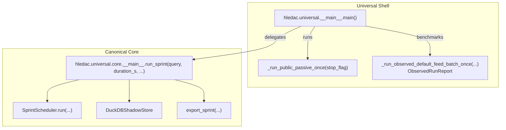
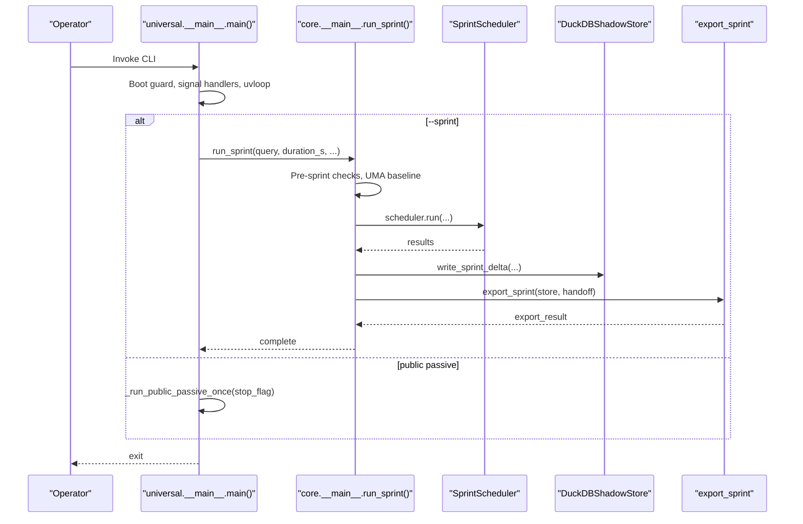
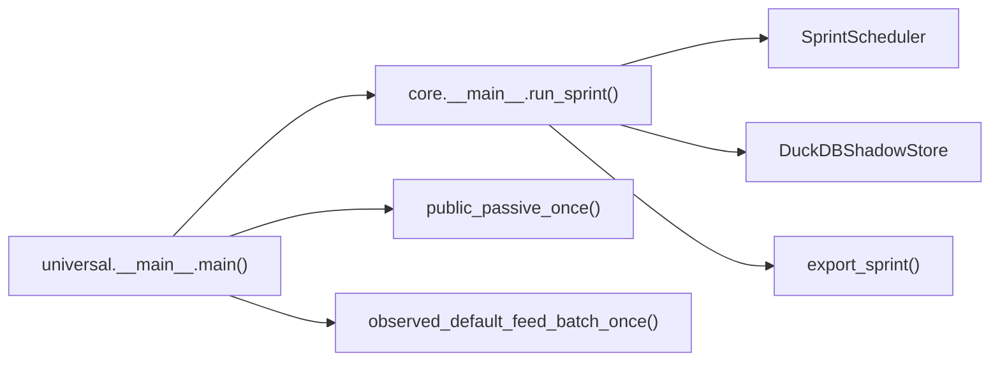

# API Reference

<cite>
**Referenced Files in This Document**
- [__main__.py](file://hledac/universal/__main__.py)
- [__main__.py](file://hledac/universal/core/__main__.py)
</cite>

## Table of Contents
1. [Introduction](#introduction)
2. [Project Structure](#project-structure)
3. [Core Components](#core-components)
4. [Architecture Overview](#architecture-overview)
5. [Detailed Component Analysis](#detailed-component-analysis)
6. [Dependency Analysis](#dependency-analysis)
7. [Performance Considerations](#performance-considerations)
8. [Troubleshooting Guide](#troubleshooting-guide)
9. [Conclusion](#conclusion)
10. [Appendices](#appendices)

## Introduction
This document provides API documentation for Hledac Universal’s core asynchronous entry points and canonical sprint lifecycle. It focuses on:
- Entry points and roles: canonical owner, shell dispatcher, alternate and residual paths
- Public passive run and observed-run benchmarking
- Canonical sprint lifecycle, runtime truth, and checkpoint-zero categorization
- Configuration options, error handling, and performance characteristics
- Migration notes and backwards compatibility

## Project Structure
Hledac Universal exposes two primary entry points:
- Universal shell: orchestrates boot hygiene, signal handling, and delegates to canonical or alternate paths
- Canonical core: executes the full sprint lifecycle with UMA monitoring, timing truth, and export handoff

**Diagram sources**
- [__main__.py:3039-3115](file://hledac/universal/__main__.py#L3039-L3115)
- [__main__.py:320-1194](file://hledac/universal/core/__main__.py#L320-L1194)

**Section sources**
- [__main__.py:1-3222](file://hledac/universal/__main__.py#L1-L3222)
- [__main__.py:1-1326](file://hledac/universal/core/__main__.py#L1-L1326)

## Core Components
- Universal shell entry point and runtime helpers
  - main(): synchronous entry; installs boot guard, uvloop, signal handlers; delegates to canonical or runs public passive
  - _run_public_passive_once(): non-canonical, owned-resource run for public passive OSINT
  - _run_observed_default_feed_batch_once(): diagnostic-only bounded feed batch with structured report
  - ObservedRunReport: comprehensive observability report for observed runs
  - Utility helpers: get_runtime_status(), get_boot_telemetry(), clear_boot_telemetry(), get_entrypoint_authority_status(), get_entrypoint_role()

- Canonical core entry point and lifecycle
  - run_sprint(): canonical owner; orchestrates pre-sprint checks, scheduler, UMA monitoring, timing/runtime truth, checkpoint-zero categorization, and export handoff
  - Timing and runtime truth: _runtime_truth(), _is_meaningful_run(), runtime truth level taxonomy
  - Export handoff: canonical_run_summary, runtime_truth, execution_context, and enriched scorecard

**Section sources**
- [__main__.py:3039-3115](file://hledac/universal/__main__.py#L3039-L3115)
- [__main__.py:541-678](file://hledac/universal/__main__.py#L541-L678)
- [__main__.py:1498-1946](file://hledac/universal/__main__.py#L1498-L1946)
- [__main__.py:320-1194](file://hledac/universal/core/__main__.py#L320-L1194)

## Architecture Overview
The canonical path is the sole production sprint owner. The shell acts as a dispatcher and enforces boot hygiene and signal safety. Observed-run diagnostics provide benchmarking and runtime truth for non-production runs.

**Diagram sources**
- [__main__.py:3039-3115](file://hledac/universal/__main__.py#L3039-L3115)
- [__main__.py:320-1194](file://hledac/universal/core/__main__.py#L320-L1194)

## Detailed Component Analysis

### Universal Shell Entry Points and Utilities
- main()
  - Purpose: synchronous entry; performs boot hygiene and delegates to canonical or public passive
  - Parameters: none (reads CLI flags)
  - Behavior:
    - Installs uvloop if available
    - Runs LMDB boot guard synchronously
    - If --sprint provided: delegates to core.__main__.run_sprint()
    - Else: runs _run_public_passive_once()
  - Returns: none (exits via asyncio.run)
  - Errors: exits with non-zero on fatal errors; interrupts handled gracefully

- _run_public_passive_once(stop_flag, *, owned_session=True, owned_store=True)
  - Purpose: non-canonical owned-resource run for public passive OSINT
  - Parameters:
    - stop_flag: callable returning True when shutdown signal received
    - owned_session: whether to acquire and own the aiohttp session
    - owned_store: whether to create and own a DuckDBShadowStore
  - Behavior:
    - Registers session and store in AsyncExitStack for LIFO cleanup
    - Configures default bootstrap patterns
    - Runs live public pipeline and default feed batch
    - Polls stop_flag and tears down via AsyncExitStack
  - Returns: none (completes on signal or cancellation)

- _run_observed_default_feed_batch_once(feed_concurrency=2, max_entries_per_feed=10, per_feed_timeout_s=25.0, batch_timeout_s=120.0)
  - Purpose: diagnostic-only bounded feed batch run producing ObservedRunReport
  - Parameters: bounded concurrency and timeouts for safety
  - Behavior:
    - Creates owned store and session
    - Resets ingest reason counters if available
    - Gathers per-source results with bounded concurrency and timeouts
    - Computes dedup deltas, UMA snapshot, slow sources, error summary, baseline delta, health breakdown
    - Builds ObservedRunReport and returns it
  - Returns: ObservedRunReport

- ObservedRunReport
  - Purpose: structured observability report for observed runs
  - Fields include totals, per-source metrics, pattern and bootstrap status, UMA snapshot, slow sources, error summary, baseline delta, health breakdown, runtime truth, and live-run diagnostics

- Utility helpers
  - get_runtime_status(): runtime snapshot including owned resources
  - get_boot_telemetry()/clear_boot_telemetry(): boot telemetry accessors
  - get_entrypoint_authority_status()/get_entrypoint_role(name): role and authority queries

**Section sources**
- [__main__.py:3039-3115](file://hledac/universal/__main__.py#L3039-L3115)
- [__main__.py:541-678](file://hledac/universal/__main__.py#L541-L678)
- [__main__.py:1498-1946](file://hledac/universal/__main__.py#L1498-L1946)
- [__main__.py:912-1232](file://hledac/universal/__main__.py#L912-L1232)

### Canonical Core Entry Point and Lifecycle
- run_sprint(query, duration_s=1800.0, export_dir=str, aggressive_mode=False, deep_probe_enabled=False, ui_mode=False)
  - Purpose: canonical owner of production sprints
  - Parameters:
    - query: search query string
    - duration_s: requested sprint duration
    - export_dir: directory for reports
    - aggressive_mode: enables 8s branch timeout budget
    - deep_probe_enabled: optional post-export deep research
    - ui_mode: optional sprint dashboard
  - Behavior:
    - Pre-sprint checks (MLX wired limit, swap detection)
    - Ensures non-empty matcher registry
    - Captures UMA baseline and pre-sprint state
    - Initializes DuckDBShadowStore and SprintScheduler
    - Runs scheduler; computes sprint intelligence
    - Writes sprint_delta to DuckDB
    - Builds canonical_run_summary, runtime_truth, timing_truth, and checkpoint-zero category
    - Exports via export_sprint with enriched handoff
    - Optional deep probe after export
    - Teardown: closes store and transport clients
  - Returns: none (completes asynchronously)

- Timing and runtime truth
  - _runtime_truth(): builds canonical runtime-truth record from scheduler data
  - _is_meaningful_run(): distinguishes smoke vs meaningful active runs
  - Runtime truth level taxonomy: active, pre_active_memory_starvation, survival_active_minimal, hardware_limited_smoke, short_signal, meaningful_empty, smoke

- Export handoff
  - canonical_run_summary: enriched truth surfaces for downstream consumers
  - ExportHandoff: carries runtime_truth, execution_context, canonical_run_summary, and top_nodes

**Section sources**
- [__main__.py:320-1194](file://hledac/universal/core/__main__.py#L320-L1194)

### Observed Run Report and Diagnostics
- ObservedRunReport fields
  - Totals: sources, completed, fetched, accepted, stored, elapsed
  - Per-source metrics: fetched, accepted, stored, elapsed, error
  - Pattern and bootstrap: patterns_configured, bootstrap_applied, content_quality_validated
  - Dedup: before/after snapshots, deltas, surface availability
  - UMA: peak used GiB, peak state, start/end state, sample count, peak swap GiB
  - Slow sources: top 3 by elapsed_ms
  - Error summary: count and per-source errors
  - Success rate and failed source count
  - Baseline delta vs 8AO baseline
  - Health breakdown: success, network, parse, entity/recovery, timeout, unknown
  - Signal funnel: entries seen, empty assembled text, with text, scanned, hits, findings built, average length, dominant stage
  - Store rejection trace: accepted, low info rejected, in-memory duplicates, persistent duplicates, others
  - Root cause and recommendation: diagnostic_root_cause, is_network_variance, recommended_next_sprint
  - Runtime truth: interpreter executable/version, Aho Corasick availability, bootstrap pack version, default bootstrap count, matcher probe fields
  - Live run truth: rich feed content usage, matched/accepted feed names, attempt results, recommended next sprint
  - Active pipeline iterations

- Helper functions
  - classify_runtime_truth(elapsed_s, active_iterations): taxonomy for observed runs
  - compare_observed_run_to_baseline(report): delta vs 8AO baseline
  - classify_feed_health(per_source): health breakdown by error type
  - diagnose_end_to_end_live_run(...): root cause classification for zero-findings runs
  - format_observed_run_summary(report): human-readable multi-line summary

**Section sources**
- [__main__.py:912-1232](file://hledac/universal/__main__.py#L912-L1232)
- [__main__.py:1258-1431](file://hledac/universal/__main__.py#L1258-L1431)
- [__main__.py:1964-2219](file://hledac/universal/__main__.py#L1964-L2219)

### API Usage Patterns and Examples
- Running a canonical sprint
  - Command: python -m hledac.universal.core --sprint --query "LockBit ransomware" --duration 1800
  - Behavior: delegates to core.__main__.run_sprint(), captures UMA baseline, runs scheduler, writes sprint_delta, exports report

- Running public passive once
  - Command: python -m hledac.universal
  - Behavior: runs _run_public_passive_once() with owned session/store, executes live public and default feed batches

- Observed-run benchmark
  - Environment: HLEDAC_BENCHMARK=1
  - Behavior: runs bounded feed batch with structured report and runtime truth taxonomy

- CT log pivot
  - Command: python -m hledac.universal.core --ct-pivot example.com
  - Behavior: initializes Tor transport and CTLogClient, pivots domain, prints results

- Semantic pivot
  - Command: python -m hledac.universal.core --pivot "ransomware CVE" --pivot-k 10
  - Behavior: loads SemanticStore, runs semantic_pivot, prints top-k results

**Section sources**
- [__main__.py:1201-1258](file://hledac/universal/core/__main__.py#L1201-L1258)
- [__main__.py:1261-1322](file://hledac/universal/core/__main__.py#L1261-L1322)

## Dependency Analysis
- Role taxonomy and authority
  - Canonical: sole production sprint owner (core.__main__.run_sprint)
  - Shell: dispatcher (root main) — never owns sprint state
  - Alternate: legacy production path (e.g., _run_sprint_mode, _run_public_passive_once)
  - Residual: shared helper (e.g., run_warmup)
  - Diagnostic: probe/benchmark only (e.g., _run_observed_default_feed_batch_once)

- Key dependencies
  - Universal shell depends on core.__main__.run_sprint() for canonical path
  - Canonical core depends on SprintScheduler, DuckDBShadowStore, export_sprint, and runtime telemetry
  - Observed-run path depends on live feed pipeline, session runtime, and store for diagnostics

**Diagram sources**
- [__main__.py:3039-3115](file://hledac/universal/__main__.py#L3039-L3115)
- [__main__.py:320-1194](file://hledac/universal/core/__main__.py#L320-L1194)

**Section sources**
- [__main__.py:70-183](file://hledac/universal/__main__.py#L70-L183)
- [__main__.py:1-36](file://hledac/universal/core/__main__.py#L1-L36)

## Performance Considerations
- Boot hygiene and signal safety
  - Boot guard (LMDB) runs synchronously before asyncio loop
  - uvloop installation preferred; graceful fallback to default loop
  - Signal handlers set to stop loop safely; cleanup via AsyncExitStack
- Resource ownership and teardown
  - Owned session and store registered in AsyncExitStack for LIFO cleanup
  - Orphan task cancellation with timeout protection
- Memory and UMA monitoring
  - UMA baseline captured pre-sprint; peak sampled during observed runs
  - Critical/emergency callbacks reduce concurrency and clear caches
- Concurrency and timeouts
  - Observed-run uses bounded concurrency and per-feed timeouts
  - Aggressive mode reduces branch timeout budget to 8s
- Observability
  - Detailed per-source metrics, slow-source ranking, error summaries, and health breakdowns

[No sources needed since this section provides general guidance]

## Troubleshooting Guide
- Boot guard failures
  - Symptom: BootGuardError raised or unsafe state detected
  - Action: Resolve stale locks or unsafe state before retry

- Signal handling and teardown
  - Symptom: Tasks destroyed warnings or stuck shutdown
  - Action: Ensure signal handlers installed before loop start; verify AsyncExitStack unwinds

- Observed-run probe failures
  - Symptom: Benchmark probe fails or returns error summary
  - Action: Check network connectivity, per-feed timeouts, and pattern matcher availability

- Canonical run smoke vs meaningful
  - Symptom: Smoke-only run with zero findings
  - Action: Review runtime truth level; check hardware pressure, backend degradations, or query vocabulary gaps

- Export failures
  - Symptom: export_sprint seam fails (non-fatal)
  - Action: Inspect canonical_run_summary and runtime_truth; verify store health and permissions

**Section sources**
- [__main__.py:350-394](file://hledac/universal/__main__.py#L350-L394)
- [__main__.py:400-535](file://hledac/universal/__main__.py#L400-L535)
- [__main__.py:1166-1167](file://hledac/universal/core/__main__.py#L1166-L1167)

## Conclusion
Hledac Universal provides a clear separation of concerns: the shell ensures boot hygiene and safe signal handling, while the canonical core owns the production sprint lifecycle. Observed-run diagnostics offer robust benchmarking and runtime truth for non-production use. The APIs are designed for reliability, observability, and extensibility, with well-defined roles and error-handling patterns.

[No sources needed since this section summarizes without analyzing specific files]

## Appendices

### Configuration Options
- Universal shell
  - --sprint: delegate to canonical run_sprint()
  - --ui: enable sprint dashboard
  - HLEDAC_BENCHMARK=1: activate observed-run benchmark mode

- Canonical core
  - --sprint: run in sprint mode
  - --query: search query string
  - --duration: requested sprint duration in seconds
  - --export-dir: report output directory
  - --aggressive: enable 8s branch timeout budget
  - --deep-probe: run deep probe post-export
  - --ct-pivot: run CT log pivot for a domain
  - --pivot: run semantic pivot
  - --pivot-k: number of results for semantic pivot

**Section sources**
- [__main__.py:1261-1322](file://hledac/universal/core/__main__.py#L1261-L1322)

### Error Handling and Backwards Compatibility
- Deprecated/unreachable paths
  - _run_sprint_mode(): legacy alternate path; kept for backward compatibility but unreachable from active CLI
  - run_warmup(): residual helper; called only by dead path or tests
- Non-canonical paths
  - _run_public_passive_once(): owned-resource run without canonical lifecycle ownership
  - _run_observed_default_feed_batch_once(): diagnostic-only bounded run producing ObservedRunReport
- Authority and role labeling
  - ENTRYPOINT_AUTHORITY: canonical/non-canonical role mapping and allowed purposes
  - get_entrypoint_role(): role lookup by entrypoint name

**Section sources**
- [__main__.py:70-183](file://hledac/universal/__main__.py#L70-L183)
- [__main__.py:2621-2929](file://hledac/universal/__main__.py#L2621-L2929)

### API Integration Patterns and Best Practices
- Extendable pipelines
  - Use live public and default feed pipelines as building blocks
  - Inject custom graph or store seams for specialized analytics
- Telemetry and observability
  - Capture runtime truth and timing truth for reproducible run boundaries
  - Use checkpoint-zero categorization to drive next steps
- Client implementation guidelines
  - Prefer canonical path for production sprints
  - Use observed-run probes for performance and capacity planning
  - Integrate export handoff for downstream systems requiring enriched canonical truth

[No sources needed since this section provides general guidance]