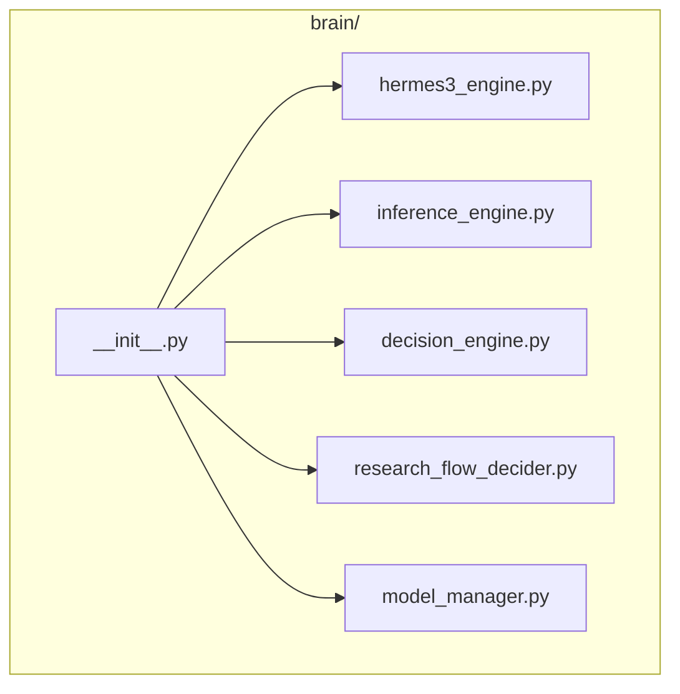
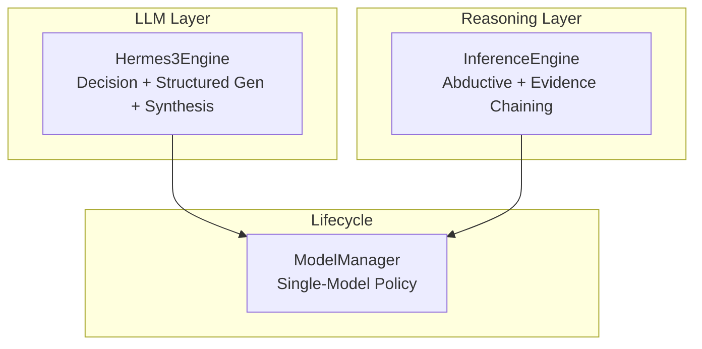
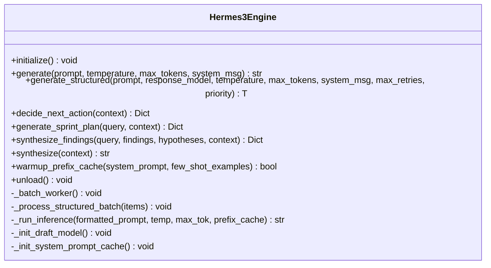
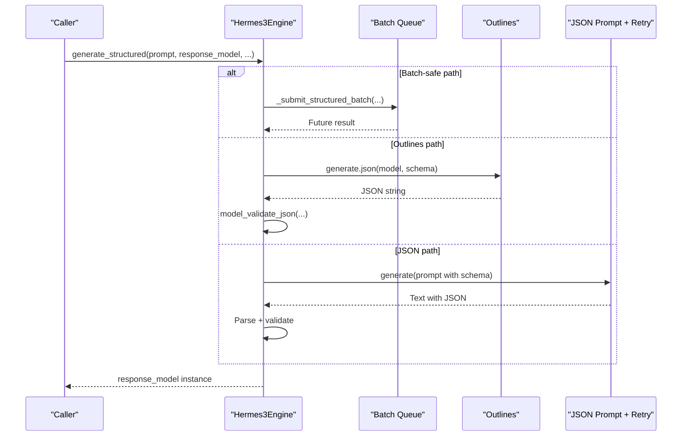
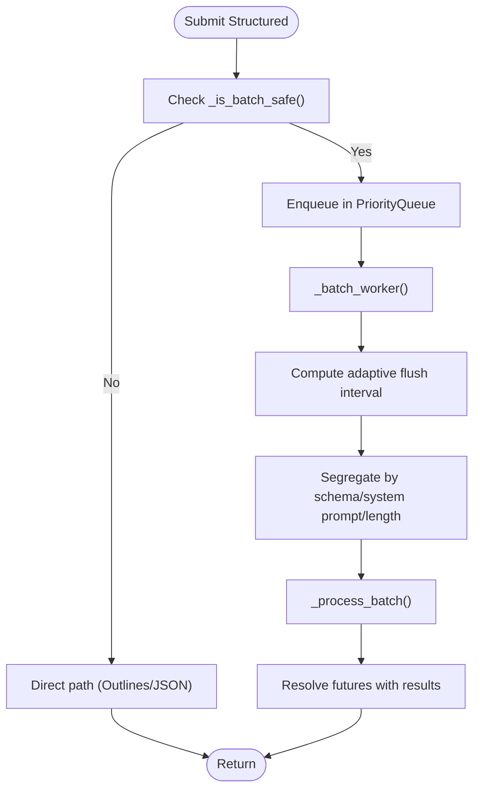
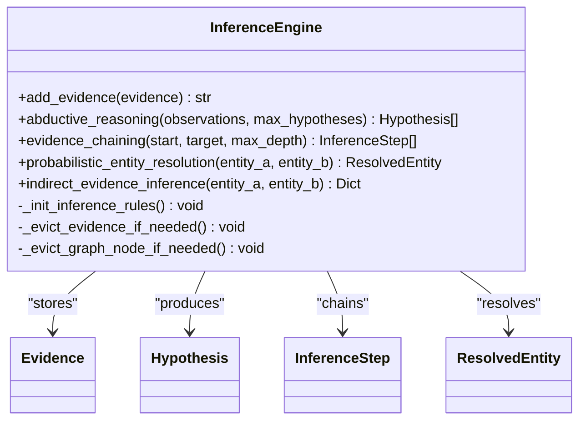
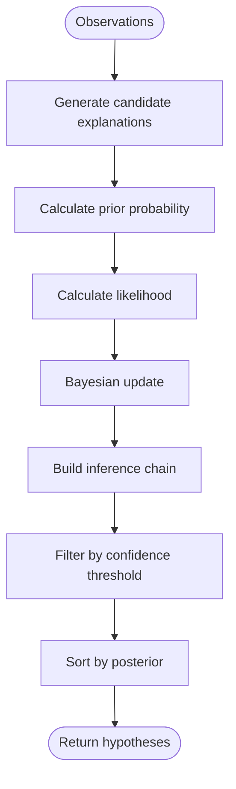
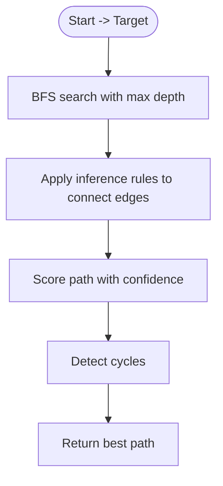
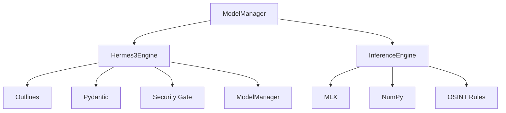

# Brain APIs

<cite>
**Referenced Files in This Document**
- [hermes3_engine.py](file://brain/hermes3_engine.py)
- [inference_engine.py](file://brain/inference_engine.py)
- [decision_engine.py](file://brain/decision_engine.py)
- [research_flow_decider.py](file://brain/research_flow_decider.py)
- [model_manager.py](file://brain/model_manager.py)
- [__init__.py](file://brain/__init__.py)
</cite>

## Table of Contents
1. [Introduction](#introduction)
2. [Project Structure](#project-structure)
3. [Core Components](#core-components)
4. [Architecture Overview](#architecture-overview)
5. [Detailed Component Analysis](#detailed-component-analysis)
6. [Dependency Analysis](#dependency-analysis)
7. [Performance Considerations](#performance-considerations)
8. [Troubleshooting Guide](#troubleshooting-guide)
9. [Conclusion](#conclusion)
10. [Appendices](#appendices)

## Introduction
This document describes the Brain APIs powering Hledac Universal’s research lifecycle. It focuses on three canonical engines:
- Hermes3Engine: LLM-based decision making, structured generation, and synthesis with ChatML formatting and grammar-constrained decoding.
- InferenceEngine: Rule-based abductive reasoning, evidence chaining, and entity resolution for OSINT.
- DecisionEngine (legacy shim): Deprecated helper for basic decision-making; canonical decision-making is implemented in Hermes3Engine.

It also documents configuration options for model parameters, memory management, and integration points with the research lifecycle.

## Project Structure
The brain module exposes a facade that re-exports engines and related components. Canonical engines are implemented as standalone modules under brain/.

**Diagram sources**
- [__init__.py:30-235](file://brain/__init__.py#L30-L235)

**Section sources**
- [__init__.py:1-236](file://brain/__init__.py#L1-L236)

## Core Components
- Hermes3Engine: Implements LLM-based decision making, structured generation, synthesis, and research planning. It supports batch routing, grammar-constrained decoding, KV cache optimization, and draft model speculation.
- InferenceEngine: Implements OSINT reasoning with abductive reasoning, evidence chaining, and probabilistic entity resolution using rule-based inference and MLX-accelerated computations.
- DecisionEngine (legacy): Deprecated shim; canonical decision-making is now integrated into Hermes3Engine.

**Section sources**
- [hermes3_engine.py:97-2242](file://brain/hermes3_engine.py#L97-L2242)
- [inference_engine.py:366-2378](file://brain/inference_engine.py#L366-L2378)
- [decision_engine.py:55-257](file://brain/decision_engine.py#L55-L257)

## Architecture Overview
Hermes3Engine orchestrates research decisions and synthesis, while InferenceEngine performs OSINT reasoning. Model lifecycle is managed centrally by ModelManager to ensure single-model-at-a-time operation on M1 8GB systems.

**Diagram sources**
- [hermes3_engine.py:669-729](file://brain/hermes3_engine.py#L669-L729)
- [inference_engine.py:391-431](file://brain/inference_engine.py#L391-L431)
- [model_manager.py:175-200](file://brain/model_manager.py#L175-L200)

## Detailed Component Analysis

### Hermes3Engine
Hermes3Engine provides:
- ChatML-formatted prompting and generation
- Structured generation with grammar-constrained decoding via outlines and fallback JSON parsing
- Batch routing for structured outputs with schema-aware segregation
- KV cache and system prompt caching for performance
- Draft model speculation for faster generation
- Research planning and synthesis wrappers with bounded contexts

Key methods:
- initialize(): Loads model and initializes KV cache, outlines, and draft model.
- generate(prompt, temperature, max_tokens, system_msg): Generates text with safety and KV cache.
- generate_structured(prompt, response_model, temperature, max_tokens, system_msg, max_retries, priority): Structured generation with batch routing and fallback chain.
- decide_next_action(context): Decision-making using structured output schema.
- generate_sprint_plan(query, context): Thin wrapper for sprint planning with bounds.
- synthesize_findings(query, findings, hypotheses, context): Thin wrapper for synthesis with bounds.
- synthesize(context): Synthesis of research findings into a structured report.
- warmup_prefix_cache(system_prompt, few_shot_examples): Pre-warms KV cache for system prompt and examples.
- unload(): Safely shuts down engine and clears caches.

Configuration options:
- Model path and temperature, max_tokens, context window via HermesConfig.
- KV cache enablement and quantization.
- Outlines availability and generator caching.
- Draft model enablement and speculative decoding parameters.
- Batch routing thresholds and flush intervals.
- Prefix cache and system prompt cache management.

**Diagram sources**
- [hermes3_engine.py:97-2242](file://brain/hermes3_engine.py#L97-L2242)

**Section sources**
- [hermes3_engine.py:97-2242](file://brain/hermes3_engine.py#L97-L2242)

#### Structured Generation Flow

**Diagram sources**
- [hermes3_engine.py:1479-1590](file://brain/hermes3_engine.py#L1479-L1590)

#### Batch Routing Flow

**Diagram sources**
- [hermes3_engine.py:258-457](file://brain/hermes3_engine.py#L258-L457)
- [hermes3_engine.py:524-592](file://brain/hermes3_engine.py#L524-L592)

#### Example Workflows
- Structured generation with Pydantic schema:
  - Use generate_structured with a Pydantic model to constrain output.
  - Falls back to outlines or JSON parsing with retries.
- Abductive reasoning:
  - Use InferenceEngine.abductive_reasoning with Evidence objects.
  - Chain inference steps and produce ranked hypotheses.
- Strategic decision coordination:
  - Use Hermes3Engine.decide_next_action to select research actions.
  - Use generate_sprint_plan for bounded planning with history and goals.

**Section sources**
- [hermes3_engine.py:1479-1590](file://brain/hermes3_engine.py#L1479-L1590)
- [inference_engine.py:762-831](file://brain/inference_engine.py#L762-L831)
- [hermes3_engine.py:1091-1144](file://brain/hermes3_engine.py#L1091-L1144)
- [hermes3_engine.py:1228-1322](file://brain/hermes3_engine.py#L1228-L1322)

### InferenceEngine
InferenceEngine provides:
- Evidence storage with bounded LRU eviction
- OSINT-specific inference rules (co-location, temporal proximity, communication patterns, stylometry, behavioral fingerprinting)
- Abductive reasoning to infer best explanations for observations
- Evidence chaining using BFS to connect statements
- Multi-hop reasoning with confidence scoring and cycle detection
- Probabilistic entity resolution

Key methods:
- add_evidence(evidence): Adds evidence with graph updates.
- abductive_reasoning(observations, max_hypotheses): Produces ranked hypotheses.
- evidence_chaining(start, target, max_depth): Finds inference chains.
- probabilistic_entity_resolution(entity_a, entity_b): Merges identities with confidence.
- indirect_evidence_inference(entity_a, entity_b): Infers indirect relationships.

**Diagram sources**
- [inference_engine.py:366-2378](file://brain/inference_engine.py#L366-L2378)

**Section sources**
- [inference_engine.py:366-2378](file://brain/inference_engine.py#L366-L2378)

#### Abductive Reasoning Flow

**Diagram sources**
- [inference_engine.py:762-831](file://brain/inference_engine.py#L762-L831)
- [inference_engine.py:943-962](file://brain/inference_engine.py#L943-L962)

#### Evidence Chaining Flow

**Diagram sources**
- [inference_engine.py:964-1020](file://brain/inference_engine.py#L964-L1020)

### DecisionEngine (Legacy)
DecisionEngine is deprecated in favor of Hermes3Engine’s decision-making capabilities. It provided rule-based, LLM-based, and hybrid strategies for basic decision-making.

**Section sources**
- [decision_engine.py:55-257](file://brain/decision_engine.py#L55-L257)

### Research Flow Decider
The research flow decider provides helper strategies for decision-making and continuation logic. It is intended as a lightweight helper and canonical decision-making is implemented in Hermes3Engine.

**Section sources**
- [research_flow_decider.py:63-230](file://brain/research_flow_decider.py#L63-L230)

## Dependency Analysis
Hermes3Engine depends on:
- MLX for inference and KV cache
- Outlines for grammar-constrained decoding
- Pydantic for structured output validation
- Security gate for input sanitization
- Model lifecycle for safe model loading/unloading

InferenceEngine depends on:
- MLX for accelerated computations
- NumPy for fallback similarity
- Rule-based inference for OSINT heuristics

ModelManager coordinates model lifecycle and enforces single-model-at-a-time policy.

**Diagram sources**
- [hermes3_engine.py:34-69](file://brain/hermes3_engine.py#L34-L69)
- [inference_engine.py:44-51](file://brain/inference_engine.py#L44-L51)
- [model_manager.py:175-200](file://brain/model_manager.py#L175-L200)

**Section sources**
- [hermes3_engine.py:34-69](file://brain/hermes3_engine.py#L34-L69)
- [inference_engine.py:44-51](file://brain/inference_engine.py#L44-L51)
- [model_manager.py:175-200](file://brain/model_manager.py#L175-L200)

## Performance Considerations
- Batch routing: Hermes3Engine routes compatible structured generations into batches with schema-aware segregation and adaptive flush intervals to reduce latency and improve throughput.
- KV cache: System prompt cache and prompt cache reduce repeated prefill costs; optional compression and pruning mitigate memory growth.
- Draft model speculation: Hermes3Engine can use a smaller draft model to accelerate generation when memory allows.
- M1 8GB constraints: ModelManager enforces single-model-at-a-time policy; Hermes3Engine provides sustain mode and memory-bound wrappers for planning and synthesis.
- Memory management: Hermes3Engine’s unload routine ensures caches and Metal buffers are cleared; ModelManager verifies RSS drops after unload.

[No sources needed since this section provides general guidance]

## Troubleshooting Guide
Common issues and remedies:
- Model not initialized: Call initialize() before generate() or generate_structured().
- Structured generation failures: Increase max_retries or verify Pydantic schema correctness; fallback to default fields is automatic.
- Batch routing errors: Check emergency unload flags and telemetry counters; batch worker is bounded and will fail pending futures on shutdown.
- Memory pressure: Use ModelManager’s lifecycle and Hermes3Engine’s unload() to free resources; verify RSS drops after unload.
- KV cache issues: Warmup prefix cache; compress or prune cache if context grows large.

**Section sources**
- [hermes3_engine.py:1034-1090](file://brain/hermes3_engine.py#L1034-L1090)
- [hermes3_engine.py:1508-1541](file://brain/hermes3_engine.py#L1508-L1541)
- [hermes3_engine.py:1754-1827](file://brain/hermes3_engine.py#L1754-L1827)
- [model_manager.py:84-104](file://brain/model_manager.py#L84-L104)

## Conclusion
Hermes3Engine and InferenceEngine provide complementary capabilities for AI-powered reasoning and decision making in Hledac Universal. Hermes3Engine focuses on LLM-based decision making, structured generation, and synthesis, while InferenceEngine handles OSINT reasoning with rule-based inference and evidence chaining. ModelManager ensures safe, single-model-at-a-time lifecycle management, particularly important for M1 8GB systems.

[No sources needed since this section summarizes without analyzing specific files]

## Appendices

### Configuration Options
- Hermes3Engine
  - Model path and temperature, max_tokens, context window via HermesConfig.
  - KV cache enablement and quantization.
  - Outlines availability and generator caching.
  - Draft model enablement and speculative decoding parameters.
  - Batch routing thresholds and flush intervals.
  - Prefix cache and system prompt cache management.

- InferenceEngine
  - max_chain_depth, min_confidence_threshold, use_mlx, streaming_batch_size.
  - Bounded evidence storage and graph eviction.

- ModelManager
  - Single-model-at-a-time policy with memory guard thresholds.
  - RSS-based admission control and verification after unload.

**Section sources**
- [hermes3_engine.py:76-82](file://brain/hermes3_engine.py#L76-L82)
- [hermes3_engine.py:442-457](file://brain/hermes3_engine.py#L442-L457)
- [inference_engine.py:391-411](file://brain/inference_engine.py#L391-L411)
- [model_manager.py:43-104](file://brain/model_manager.py#L43-L104)