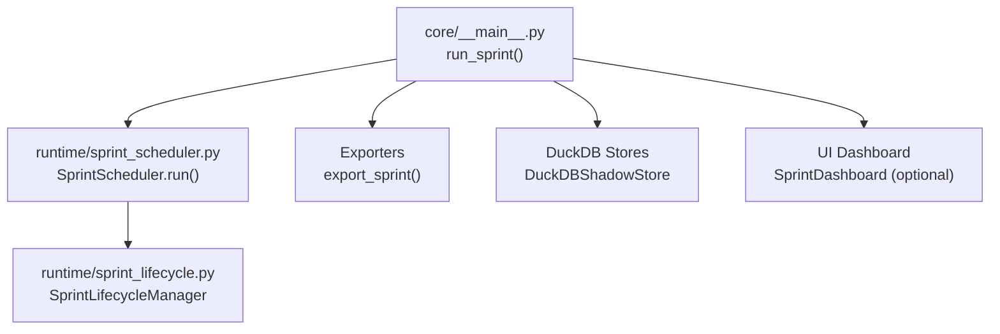
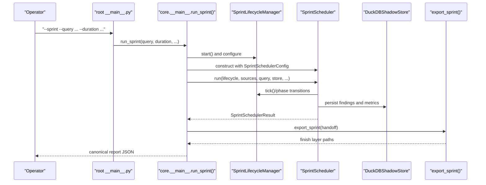
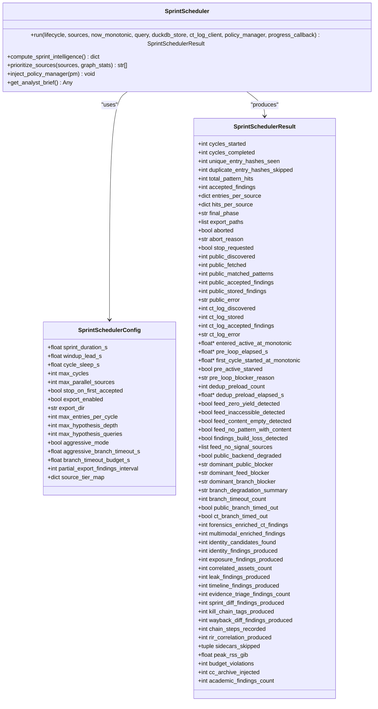
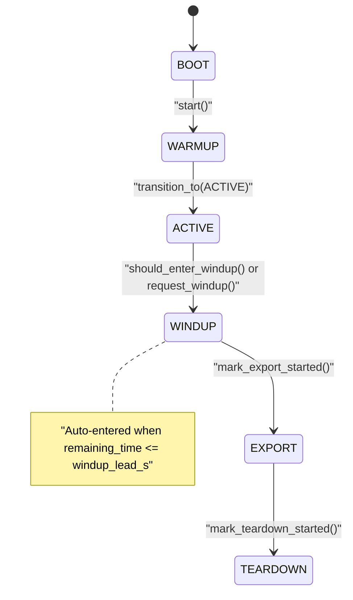
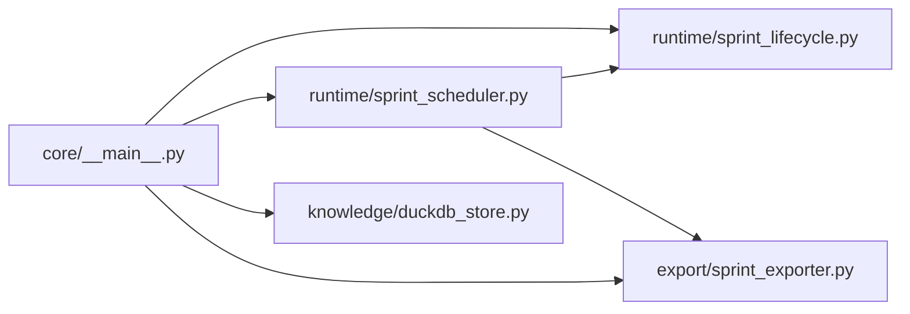

# Core APIs

<cite>
**Referenced Files in This Document**
- [core/__main__.py](file://core/__main__.py)
- [runtime/sprint_scheduler.py](file://runtime/sprint_scheduler.py)
- [runtime/sprint_lifecycle.py](file://runtime/sprint_lifecycle.py)
- [__main__.py](file://__main__.py)
- [orchestrator_integration.py](file://orchestrator_integration.py)
- [autonomous_orchestrator.py](file://autonomous_orchestrator.py)
</cite>

## Table of Contents
1. [Introduction](#introduction)
2. [Project Structure](#project-structure)
3. [Core Components](#core-components)
4. [Architecture Overview](#architecture-overview)
5. [Detailed Component Analysis](#detailed-component-analysis)
6. [Dependency Analysis](#dependency-analysis)
7. [Performance Considerations](#performance-considerations)
8. [Troubleshooting Guide](#troubleshooting-guide)
9. [Conclusion](#conclusion)

## Introduction
This document provides comprehensive API documentation for Hledac Universal’s core sprint execution APIs. It focuses on:
- The canonical entry point run_sprint()
- The SprintScheduler class and its lifecycle integration
- Lifecycle management APIs and error handling patterns
- Configuration options for sprint execution
- Integration with the orchestrator and exporters
- Programmatic usage and common integration patterns

## Project Structure
The core APIs are centered around three primary modules:
- core/__main__.py: Canonical sprint owner and entry point
- runtime/sprint_scheduler.py: Tier-aware scheduler and execution engine
- runtime/sprint_lifecycle.py: Phase-managed lifecycle state machine

**Diagram sources**
- [core/__main__.py:320-426](file://core/__main__.py#L320-L426)
- [runtime/sprint_scheduler.py:991-1070](file://runtime/sprint_scheduler.py#L991-L1070)
- [runtime/sprint_lifecycle.py:54-126](file://runtime/sprint_lifecycle.py#L54-L126)

**Section sources**
- [core/__main__.py:320-426](file://core/__main__.py#L320-L426)
- [runtime/sprint_scheduler.py:568-729](file://runtime/sprint_scheduler.py#L568-L729)
- [runtime/sprint_lifecycle.py:54-126](file://runtime/sprint_lifecycle.py#L54-L126)

## Core Components
- run_sprint(): Canonical sprint owner that initializes lifecycle, scheduler, stores, and exporters; orchestrates the full sprint run and produces canonical reports.
- SprintScheduler: Tier-aware scheduler that runs bounded fetch cycles under lifecycle control, manages sources, deduplication, sidecars, and export.
- SprintLifecycleManager: Phase-managed state machine controlling BOOT → WARMUP → ACTIVE → WINDUP → EXPORT → TEARDOWN with timing and tool-mode recommendations.

**Section sources**
- [core/__main__.py:320-426](file://core/__main__.py#L320-L426)
- [runtime/sprint_scheduler.py:568-729](file://runtime/sprint_scheduler.py#L568-L729)
- [runtime/sprint_lifecycle.py:54-126](file://runtime/sprint_lifecycle.py#L54-L126)

## Architecture Overview
The canonical path delegates operator commands to run_sprint(), which constructs a SprintLifecycleManager and a SprintScheduler, wires stores and optional UI, and invokes scheduler.run(). The scheduler coordinates feed/public/CT branches, enforces lifecycle gates, and produces a comprehensive result used to generate canonical reports and exports.

**Diagram sources**
- [__main__.py:3092-3110](file://__main__.py#L3092-L3110)
- [core/__main__.py:320-426](file://core/__main__.py#L320-L426)
- [runtime/sprint_scheduler.py:991-1070](file://runtime/sprint_scheduler.py#L991-L1070)
- [runtime/sprint_lifecycle.py:82-126](file://runtime/sprint_lifecycle.py#L82-L126)

## Detailed Component Analysis

### run_sprint() API
- Role: Canonical sprint owner; sole authority for report truth surfaces and runtime telemetry.
- Signature: run_sprint(query: str, duration_s: float = 1800.0, export_dir: str = "~/.hledac/reports", aggressive_mode: bool = False, deep_probe_enabled: bool = False, ui_mode: bool = False) -> None
- Parameters:
  - query: Research query string
  - duration_s: Requested sprint duration in seconds (default 1800)
  - export_dir: Directory for canonical JSON reports
  - aggressive_mode: Enables concurrent feed/public/CT branches with per-branch timeouts
  - deep_probe_enabled: Run deep probe research post-sprint
  - ui_mode: Enable dashboard updates during run
- Returns: None (side-effects: writes canonical report, optionally exports)
- Behavior:
  - Pre-sprint checks (e.g., MLX wired limit, swap usage)
  - Bootstraps pattern matcher registry
  - Creates DuckDBShadowStore and CTLogClient
  - Builds SprintSchedulerConfig and SprintLifecycleManager
  - Initializes dashboard (ui_mode), progress callback, and scheduler.run()
  - Computes runtime truth, checkpoint-zero taxonomy, and canonical run summary
  - Writes sprint_delta to DuckDB
  - Calls export_sprint() with ExportHandoff and optional deep probe
  - Teardown: closes stores, transports, and metrics registry
- Usage examples:
  - Command-line: python -m hledac.universal.core --sprint --query "LockBit" --duration 1800
  - Programmatic: asyncio.run(run_sprint("LockBit", 1800.0, aggressive_mode=True))

**Section sources**
- [core/__main__.py:320-426](file://core/__main__.py#L320-L426)
- [core/__main__.py:428-550](file://core/__main__.py#L428-L550)
- [core/__main__.py:550-896](file://core/__main__.py#L550-L896)
- [core/__main__.py:896-1194](file://core/__main__.py#L896-L1194)
- [core/__main__.py:1261-1326](file://core/__main__.py#L1261-L1326)

### SprintScheduler API
- Constructor: SprintScheduler(config: SprintSchedulerConfig, ct_log_client: Any = None)
- Methods:
  - run(lifecycle: Any, sources: Sequence[str], now_monotonic: Optional[float] = None, query: str = "", duckdb_store: Any = None, ct_log_client: Any = None, policy_manager: Any = None, progress_callback: Optional[Any] = None) -> SprintSchedulerResult
  - compute_sprint_intelligence() -> dict (additive, fail-soft)
  - prioritize_sources(sources: list[str], graph_stats: dict) -> list[str]
  - inject_policy_manager(pm: Any) -> None
  - get_analyst_brief() -> Any
- Configuration (SprintSchedulerConfig):
  - sprint_duration_s: float (default 1800.0)
  - windup_lead_s: float (default 180.0)
  - cycle_sleep_s: float (default 5.0)
  - max_cycles: int (default 100)
  - max_parallel_sources: int (default 4)
  - stop_on_first_accepted: bool (default False)
  - export_enabled: bool (default True)
  - export_dir: str (default "")
  - max_entries_per_cycle: int (default 50)
  - max_hypothesis_depth: int (default 3)
  - max_hypothesis_queries: int (default 10)
  - aggressive_mode: bool (default False)
  - aggressive_branch_timeout_s: float (default 45.0)
  - branch_timeout_budget_s: float (default 0.0)
  - partial_export_findings_interval: int (default 10)
  - source_tier_map: dict[str, SourceTier] (default {})
- Result (SprintSchedulerResult): Comprehensive counters and telemetry for feed/public/CT branches, sidecars, dedup, and performance.
- Error handling patterns:
  - Lifecycle aborts propagate to scheduler result (aborted, abort_reason)
  - TimeoutError mapped to FeedPipelineRunResult.error with "timeout"
  - Exceptions caught and mapped to FeedPipelineRunResult.error with "exception:{...}"
  - Dashboard and metrics registry closed with fail-soft
- Integration:
  - CT log client injected at run() or via constructor
  - DuckDBShadowStore injected for persistence
  - Sidecar bus and dispatcher for accepted-finding sidecars
  - Policy manager for RL adaptive pivot (opt-in)
  - Progress callback for UI/dashboard updates

**Diagram sources**
- [runtime/sprint_scheduler.py:568-729](file://runtime/sprint_scheduler.py#L568-L729)
- [runtime/sprint_scheduler.py:267-298](file://runtime/sprint_scheduler.py#L267-L298)
- [runtime/sprint_scheduler.py:304-433](file://runtime/sprint_scheduler.py#L304-L433)

**Section sources**
- [runtime/sprint_scheduler.py:991-1070](file://runtime/sprint_scheduler.py#L991-L1070)
- [runtime/sprint_scheduler.py:267-298](file://runtime/sprint_scheduler.py#L267-L298)
- [runtime/sprint_scheduler.py:304-433](file://runtime/sprint_scheduler.py#L304-L433)

### SprintLifecycleManager API
- Phases: BOOT → WARMUP → ACTIVE → WINDUP → EXPORT → TEARDOWN
- Methods:
  - start(now_monotonic: Optional[float] = None) -> None
  - transition_to(phase: SprintPhase, now_monotonic: Optional[float] = None) -> None
  - tick(now_monotonic: Optional[float] = None) -> SprintPhase
  - remaining_time(now_monotonic: Optional[float] = None) -> float
  - should_enter_windup(now_monotonic: Optional[float] = None) -> bool
  - request_abort(reason: str = "") -> None
  - mark_export_started(now_monotonic: Optional[float] = None) -> None
  - mark_teardown_started(now_monotonic: Optional[float] = None) -> None
  - snapshot() -> dict
  - recommended_tool_mode(now_monotonic: Optional[float] = None, thermal_state: str = "nominal") -> str
  - is_terminal() -> bool
  - in_phase(phase: SprintPhase) -> bool
  - has_reached_phase(phase: SprintPhase) -> bool
  - entered_phase_at(phase: SprintPhase) -> Optional[float]
  - phase_durations_so_far(now_monotonic: Optional[float] = None) -> dict[str, Optional[float]]
- Compatibility aliases (begin_sprint, mark_warmup_done, request_windup, request_export, request_teardown, is_windup_phase, is_active, is_winding_down) maintained for migration.

**Diagram sources**
- [runtime/sprint_lifecycle.py:21-49](file://runtime/sprint_lifecycle.py#L21-L49)
- [runtime/sprint_lifecycle.py:110-126](file://runtime/sprint_lifecycle.py#L110-L126)
- [runtime/sprint_lifecycle.py:141-146](file://runtime/sprint_lifecycle.py#L141-L146)
- [runtime/sprint_lifecycle.py:161-178](file://runtime/sprint_lifecycle.py#L161-L178)

**Section sources**
- [runtime/sprint_lifecycle.py:54-126](file://runtime/sprint_lifecycle.py#L54-L126)
- [runtime/sprint_lifecycle.py:250-386](file://runtime/sprint_lifecycle.py#L250-L386)

### Lifecycle Management APIs
- Authority boundaries:
  - SprintScheduler does NOT execute tools, activate providers, create persistent state beyond in-sprint accumulators, own lifecycle transitions, or dispatch work based on shadow pre-decision output.
- Runtime mode semantics:
  - legacy_runtime (default): normal scheduler path
  - scheduler_shadow: read-only diagnostic path
  - scheduler_active: NOT supported
- Advisory gate and shadow pre-decision are diagnostic-only at WINDUP entry.

**Section sources**
- [runtime/sprint_scheduler.py:575-590](file://runtime/sprint_scheduler.py#L575-L590)

### Configuration Options for Sprint Execution
- SprintSchedulerConfig covers:
  - Timing: sprint_duration_s, windup_lead_s, cycle_sleep_s, max_cycles
  - Concurrency: max_parallel_sources, max_entries_per_cycle
  - Early exit: stop_on_first_accepted
  - Export: export_enabled, export_dir, partial_export_findings_interval
  - Hypothesis feedback: max_hypothesis_depth, max_hypothesis_queries
  - Aggressive mode: aggressive_mode, aggressive_branch_timeout_s, branch_timeout_budget_s
  - Source tiering: source_tier_map
- Core run_sprint wires:
  - branch_timeout_budget_s = 8.0 when aggressive_mode is True
  - Dashboard creation when ui_mode is True
  - CT log client instantiation for canonical pipeline

**Section sources**
- [runtime/sprint_scheduler.py:267-298](file://runtime/sprint_scheduler.py#L267-L298)
- [core/__main__.py:367-374](file://core/__main__.py#L367-L374)
- [core/__main__.py:399-406](file://core/__main__.py#L399-L406)

### Error Handling Patterns
- TimeoutError in feed fetch mapped to FeedPipelineRunResult.error = "timeout"
- Exceptions mapped to FeedPipelineRunResult.error = "exception:{type}:{message}"
- Lifecycle aborts set aborted=True and abort_reason
- Dashboard and metrics registry closed with fail-soft
- Branch timeouts in aggressive mode recorded in result fields (public_error, ct_log_error)
- Hardware-limited smoke detection distinguishes memory pressure from depleted query

**Section sources**
- [runtime/sprint_scheduler.py:1422-1443](file://runtime/sprint_scheduler.py#L1422-L1443)
- [runtime/sprint_scheduler.py:1566-1587](file://runtime/sprint_scheduler.py#L1566-L1587)
- [core/__main__.py:97-127](file://core/__main__.py#L97-L127)

### Integration with the Orchestrator
- Root __main__.py delegates --sprint to core.__main__.run_sprint()
- Legacy autonomous_orchestrator is a re-export facade; production path is core.__main__ → runtime.sprint_scheduler
- orchestrator_integration.py is deprecated and dormant; use FullyAutonomousOrchestrator directly for production work

**Section sources**
- [__main__.py:3092-3110](file://__main__.py#L3092-L3110)
- [autonomous_orchestrator.py:1-67](file://autonomous_orchestrator.py#L1-L67)
- [orchestrator_integration.py:1-15](file://orchestrator_integration.py#L1-L15)

### Programmatic Usage and Common Integration Patterns
- Basic programmatic run:
  - asyncio.run(run_sprint("query", 1800.0))
- Aggressive mode:
  - asyncio.run(run_sprint("query", 1800.0, aggressive_mode=True))
- With dashboard:
  - asyncio.run(run_sprint("query", 1800.0, ui_mode=True))
- With custom export directory:
  - asyncio.run(run_sprint("query", 1800.0, export_dir="/custom/reports"))
- Custom source tiering:
  - config = SprintSchedulerConfig(source_tier_map={"feed1": SourceTier.SURFACE, "feed2": SourceTier.DEEP})
  - scheduler = SprintScheduler(config)
  - await scheduler.run(lifecycle, sources, query=query)

**Section sources**
- [core/__main__.py:1261-1326](file://core/__main__.py#L1261-L1326)
- [runtime/sprint_scheduler.py:267-298](file://runtime/sprint_scheduler.py#L267-L298)

## Dependency Analysis
- run_sprint() depends on:
  - SprintLifecycleManager for phase control
  - SprintScheduler for execution
  - DuckDBShadowStore for persistence
  - Exporters for canonical report generation
- SprintScheduler depends on:
  - SprintLifecycleManager via _LifecycleAdapter
  - DuckDBShadowStore for persistence
  - Sidecar bus/dispatcher for accepted-finding sidecars
  - Optional CT log client, policy manager, dashboard callback

**Diagram sources**
- [core/__main__.py:320-426](file://core/__main__.py#L320-L426)
- [runtime/sprint_scheduler.py:991-1070](file://runtime/sprint_scheduler.py#L991-L1070)

**Section sources**
- [core/__main__.py:320-426](file://core/__main__.py#L320-L426)
- [runtime/sprint_scheduler.py:991-1070](file://runtime/sprint_scheduler.py#L991-L1070)

## Performance Considerations
- Concurrency control: max_parallel_sources and per-branch timeouts in aggressive mode
- Deduplication: LMDB-backed cross-sprint dedup with preload telemetry
- Memory pressure: resource governor advisory, Hermes prewarm/release, and sidecar skipping under pressure
- Metrics registry: periodic RSS sampling and budget tracking
- Source economics: tier ordering, cooldown, and posture-based prioritization

[No sources needed since this section provides general guidance]

## Troubleshooting Guide
- Zero cycles started:
  - Check hardware-limited smoke: swap_detected or UMA state critical/emergency
  - Verify pre-sprint checks and MLX wired limit
- Public backend degraded:
  - Inspect public_error and network/TOR configuration
- Feed ingress blockers:
  - Confirm feed_no_signal_sources and content_empty conditions
- Short signal vs true depleted:
  - Distinguish meaningful_empty_run vs true_depleted_query using runtime truth level
- Aggressive mode timeouts:
  - Review branch_timeout_count and public_branch_timed_out/ct_branch_timed_out
- Dashboard failures:
  - Dashboard creation/update failures are logged and do not block sprint

**Section sources**
- [core/__main__.py:724-896](file://core/__main__.py#L724-L896)
- [runtime/sprint_scheduler.py:1294-1336](file://runtime/sprint_scheduler.py#L1294-L1336)

## Conclusion
Hledac Universal’s core APIs provide a robust, lifecycle-driven sprint execution framework. run_sprint() serves as the canonical owner, while SprintScheduler orchestrates tier-aware fetch cycles and integrates with exporters and sidecars. The lifecycle manager enforces strict phase transitions and timing, ensuring predictable behavior under varying resource conditions. Configuration options and error-handling patterns enable reliable operation across diverse environments.