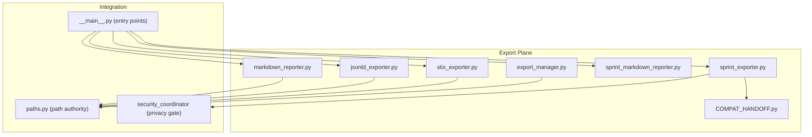
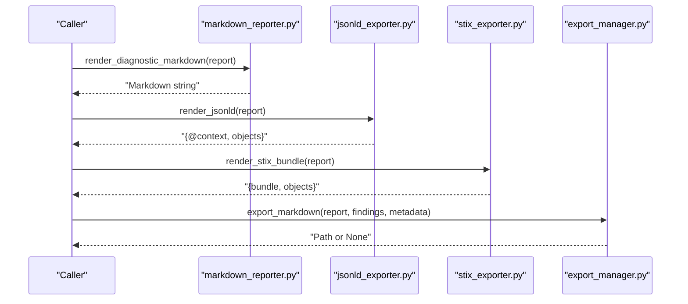
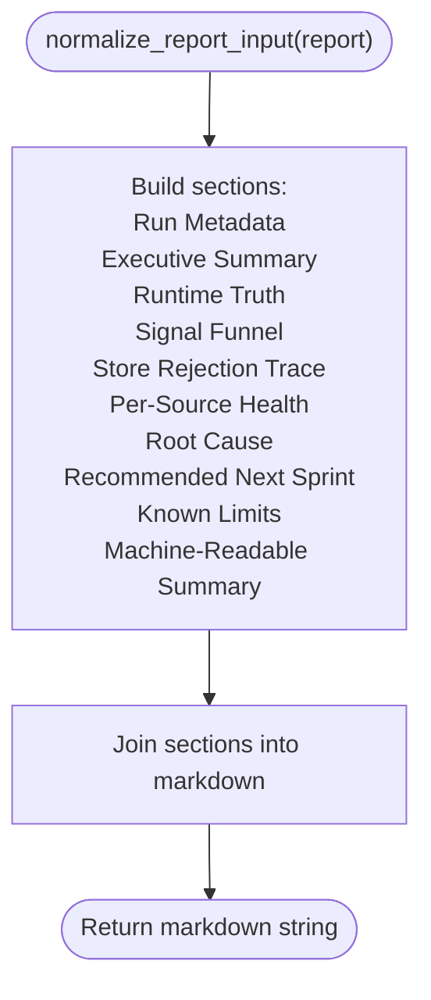
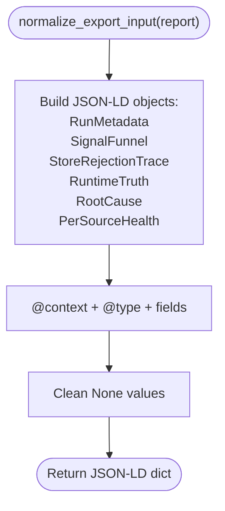
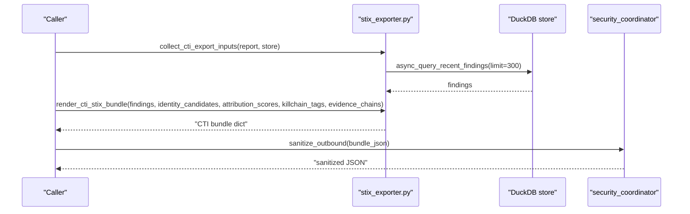
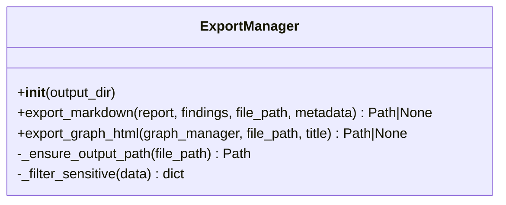
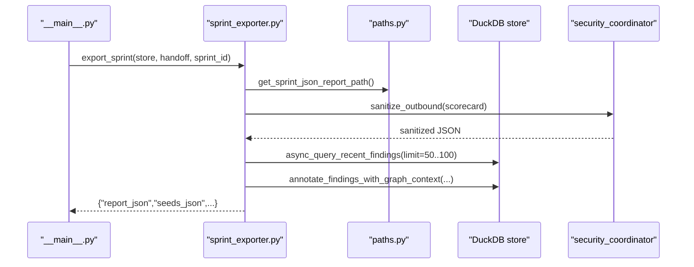
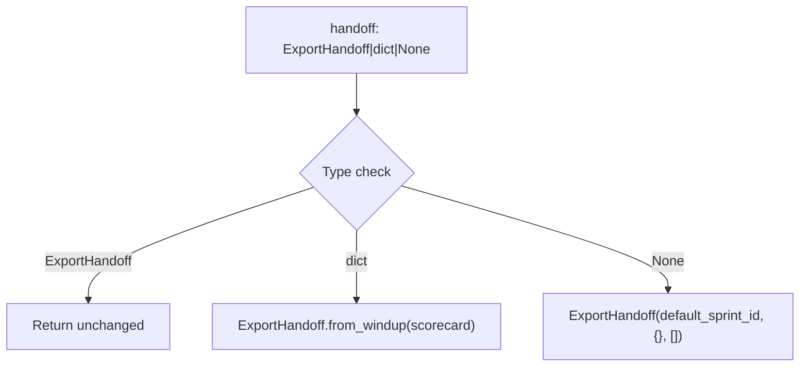
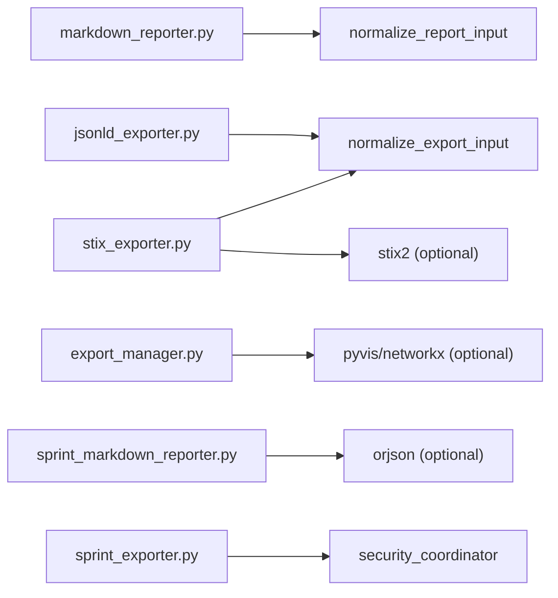

# Export APIs

<cite>
**Referenced Files in This Document**
- [export/__init__.py](file://hledac/universal/export/__init__.py)
- [export/export_manager.py](file://hledac/universal/export/export_manager.py)
- [export/jsonld_exporter.py](file://hledac/universal/export/jsonld_exporter.py)
- [export/markdown_reporter.py](file://hledac/universal/export/markdown_reporter.py)
- [export/stix_exporter.py](file://hledac/universal/export/stix_exporter.py)
- [export/sprint_exporter.py](file://hledac/universal/export/sprint_exporter.py)
- [export/sprint_markdown_reporter.py](file://hledac/universal/export/sprint_markdown_reporter.py)
- [export/COMPAT_HANDOFF.py](file://hledac/universal/export/COMPAT_HANDOFF.py)
- [export/EXPORT_PLANE_MAP.md](file://hledac/universal/export/EXPORT_PLANE_MAP.md)
- [export/COMPAT_DEBT_LEDGER.md](file://hledac/universal/export/COMPAT_DEBT_LEDGER.md)
</cite>

## Table of Contents
1. [Introduction](#introduction)
2. [Project Structure](#project-structure)
3. [Core Components](#core-components)
4. [Architecture Overview](#architecture-overview)
5. [Detailed Component Analysis](#detailed-component-analysis)
6. [Dependency Analysis](#dependency-analysis)
7. [Performance Considerations](#performance-considerations)
8. [Troubleshooting Guide](#troubleshooting-guide)
9. [Conclusion](#conclusion)
10. [Appendices](#appendices)

## Introduction
This document describes the Export APIs in Hledac Universal, focusing on the export framework interfaces that produce standardized diagnostic outputs. It covers:
- STIX export capabilities for threat-intel interoperability
- Markdown reporting for human-readable diagnostics
- JSON-LD generation for structured, graph-ready data
- Export manager for Markdown and interactive HTML graph outputs
- Sprint export and next-sprint seed generation
- Integration points with external systems and compatibility safeguards

The APIs are designed to be deterministic, side-effect-free, and compatible with standards such as STIX 2.1 and schema.org JSON-LD.

## Project Structure
The export subsystem resides under hledac/universal/export and exposes a cohesive set of modules:
- Diagnostic export plane: markdown_reporter.py, jsonld_exporter.py, stix_exporter.py
- Sprint export plane: sprint_exporter.py and sprint_markdown_reporter.py
- Export manager: export_manager.py for Markdown and HTML graph outputs
- Compatibility adapters: COMPAT_HANDOFF.py and related ledger documentation

**Diagram sources**
- [export/__init__.py:1-47](file://hledac/universal/export/__init__.py#L1-L47)
- [export/markdown_reporter.py:1-474](file://hledac/universal/export/markdown_reporter.py#L1-L474)
- [export/jsonld_exporter.py:1-505](file://hledac/universal/export/jsonld_exporter.py#L1-L505)
- [export/stix_exporter.py:1-1199](file://hledac/universal/export/stix_exporter.py#L1-L1199)
- [export/sprint_exporter.py:1-2738](file://hledac/universal/export/sprint_exporter.py#L1-L2738)
- [export/sprint_markdown_reporter.py:1-833](file://hledac/universal/export/sprint_markdown_reporter.py#L1-L833)
- [export/export_manager.py:1-298](file://hledac/universal/export/export_manager.py#L1-L298)
- [export/COMPAT_HANDOFF.py:1-95](file://hledac/universal/export/COMPAT_HANDOFF.py#L1-L95)

**Section sources**
- [export/EXPORT_PLANE_MAP.md:1-189](file://hledac/universal/export/EXPORT_PLANE_MAP.md#L1-L189)

## Core Components
This section summarizes the primary export APIs and their responsibilities.

- Markdown diagnostic export
  - render_diagnostic_markdown(report) → deterministic markdown string
  - render_diagnostic_markdown_to_path(report, path=None) → Path
  - Purpose: Human-readable diagnostic reports with structured sections and machine-readable summaries

- JSON-LD export
  - render_jsonld(report) → dict with @context and ghost: fields
  - render_jsonld_str(report) → JSON string
  - render_jsonld_to_path(report, path=None) → Path
  - Purpose: Structured, schema.org + ghost namespace JSON-LD for graph ingestion

- STIX export
  - render_stix_bundle(report) → STIX 2.1 bundle dict (diagnostic-only)
  - render_stix_bundle_json(report) → JSON string
  - render_stix_bundle_to_path(report, path=None) → Path
  - render_cti_stix_bundle(..., findings, identity_candidates, attribution_scores, killchain_tags, evidence_chains) → STIX 2.1 CTI bundle
  - render_cti_stix_bundle_json(...) → JSON string
  - render_cti_stix_bundle_to_path(...) → Path
  - Purpose: Deterministic, metadata-safe diagnostic bundles; optional CTI bundle with indicators, identities, and relationships

- Export manager
  - ExportManager.export_markdown(report, findings, file_path, metadata) → Path | None
  - ExportManager.export_graph_html(graph_manager, file_path, title) → Path | None
  - Purpose: Obsidian-compatible Markdown export and interactive HTML graph export

- Sprint export and markdown
  - export_sprint(store, handoff, sprint_id) → dict with report_json, seeds_json, and derived artifacts
  - render_sprint_markdown(report, scorecard, sprint_id) → deterministic markdown string
  - Purpose: Terminal sprint JSON report, next-sprint seeds, and human-friendly markdown

- Compatibility and handoff
  - ensure_export_handoff(handoff, default_sprint_id) → ExportHandoff
  - Purpose: Consumer-side normalization of typed ExportHandoff, dict, or None

**Section sources**
- [export/__init__.py:1-47](file://hledac/universal/export/__init__.py#L1-L47)
- [export/markdown_reporter.py:1-474](file://hledac/universal/export/markdown_reporter.py#L1-L474)
- [export/jsonld_exporter.py:1-505](file://hledac/universal/export/jsonld_exporter.py#L1-L505)
- [export/stix_exporter.py:1-1199](file://hledac/universal/export/stix_exporter.py#L1-L1199)
- [export/export_manager.py:1-298](file://hledac/universal/export/export_manager.py#L1-L298)
- [export/sprint_exporter.py:1-2738](file://hledac/universal/export/sprint_exporter.py#L1-L2738)
- [export/sprint_markdown_reporter.py:1-833](file://hledac/universal/export/sprint_markdown_reporter.py#L1-L833)
- [export/COMPAT_HANDOFF.py:1-95](file://hledac/universal/export/COMPAT_HANDOFF.py#L1-L95)

## Architecture Overview
The export framework separates concerns into two planes:
- Diagnostics plane: pure, stateless functions that transform ObservedRunReport into Markdown, JSON-LD, or STIX bundles
- Sprint plane: async export that writes JSON reports, seeds, and derived artifacts; integrates with privacy gates and path authorities

**Diagram sources**
- [export/markdown_reporter.py:372-408](file://hledac/universal/export/markdown_reporter.py#L372-L408)
- [export/jsonld_exporter.py:280-325](file://hledac/universal/export/jsonld_exporter.py#L280-L325)
- [export/stix_exporter.py:1069-1123](file://hledac/universal/export/stix_exporter.py#L1069-L1123)
- [export/export_manager.py:88-198](file://hledac/universal/export/export_manager.py#L88-L198)

## Detailed Component Analysis

### Markdown Diagnostic Export
- Deterministic rendering with ordered sections and machine-readable JSON block
- Input normalization supports msgspec.Struct or Mapping
- File output helpers compute deterministic filenames and write to configured directories

**Diagram sources**
- [export/markdown_reporter.py:63-80](file://hledac/universal/export/markdown_reporter.py#L63-L80)
- [export/markdown_reporter.py:372-408](file://hledac/universal/export/markdown_reporter.py#L372-L408)

**Section sources**
- [export/markdown_reporter.py:1-474](file://hledac/universal/export/markdown_reporter.py#L1-L474)

### JSON-LD Export
- schema.org + ghost namespace context
- Deterministic rendering with RFC3339 timestamps and sorted keys
- Analyst evidence export for workbench answers

**Diagram sources**
- [export/jsonld_exporter.py:131-147](file://hledac/universal/export/jsonld_exporter.py#L131-L147)
- [export/jsonld_exporter.py:280-325](file://hledac/universal/export/jsonld_exporter.py#L280-L325)

**Section sources**
- [export/jsonld_exporter.py:1-505](file://hledac/universal/export/jsonld_exporter.py#L1-L505)

### STIX Export
- Diagnostic bundle: identity, diagnostic notes, root cause note, per-source notes, UMA note
- CTI bundle: indicators, observed-data, identities, attribution notes, kill-chain notes, evidence chains, relationships, and a report wrapper
- Deterministic object IDs and bounded object counts
- Optional stix2 package path for full STIX object construction

**Diagram sources**
- [export/stix_exporter.py:99-179](file://hledac/universal/export/stix_exporter.py#L99-L179)
- [export/stix_exporter.py:749-917](file://hledac/universal/export/stix_exporter.py#L749-L917)
- [export/sprint_exporter.py:205-239](file://hledac/universal/export/sprint_exporter.py#L205-L239)

**Section sources**
- [export/stix_exporter.py:1-1199](file://hledac/universal/export/stix_exporter.py#L1-L1199)

### Export Manager (Markdown + HTML Graph)
- Obsidian-compatible Markdown with YAML front matter and findings list
- Interactive HTML graph export via pyvis or NetworkX-to-pyvis fallback
- Security: path containment checks and sensitive field filtering

**Diagram sources**
- [export/export_manager.py:47-298](file://hledac/universal/export/export_manager.py#L47-L298)

**Section sources**
- [export/export_manager.py:1-298](file://hledac/universal/export/export_manager.py#L1-L298)

### Sprint Export and Next-Sprint Seeds
- export_sprint(store, handoff, sprint_id) writes:
  - JSON report with sanitized scorecard and derived truths
  - Next-sprint seeds JSON with prioritized tasks
  - Operator brief, research depth metric, and enriched findings
- render_sprint_markdown(report, scorecard, sprint_id) renders a human-friendly markdown report

**Diagram sources**
- [export/sprint_exporter.py:144-464](file://hledac/universal/export/sprint_exporter.py#L144-L464)
- [export/sprint_markdown_reporter.py:142-280](file://hledac/universal/export/sprint_markdown_reporter.py#L142-L280)

**Section sources**
- [export/sprint_exporter.py:1-2738](file://hledac/universal/export/sprint_exporter.py#L1-L2738)
- [export/sprint_markdown_reporter.py:1-833](file://hledac/universal/export/sprint_markdown_reporter.py#L1-L833)

### Compatibility and Handoff
- ensure_export_handoff normalizes inputs to typed ExportHandoff
- Maintains compat seams for backward compatibility while converging on typed handoff

**Diagram sources**
- [export/COMPAT_HANDOFF.py:25-95](file://hledac/universal/export/COMPAT_HANDOFF.py#L25-L95)

**Section sources**
- [export/COMPAT_HANDOFF.py:1-95](file://hledac/universal/export/COMPAT_HANDOFF.py#L1-L95)
- [export/COMPAT_DEBT_LEDGER.md:1-224](file://hledac/universal/export/COMPAT_DEBT_LEDGER.md#L1-L224)

## Dependency Analysis
- Internal dependencies
  - All diagnostic exporters depend on normalize_report_input or normalize_export_input for input shaping
  - STIX CTI export depends on store async queries and optional graph context annotations
  - Sprint export depends on paths.py for canonical report paths and security_coordinator for sanitization
- External dependencies
  - Optional stix2 package for full STIX object construction
  - pyvis and networkx for HTML graph export
  - orjson for efficient JSON parsing in sprint markdown renderer

**Diagram sources**
- [export/stix_exporter.py:1004-1011](file://hledac/universal/export/stix_exporter.py#L1004-L1011)
- [export/export_manager.py:234-284](file://hledac/universal/export/export_manager.py#L234-L284)
- [export/sprint_markdown_reporter.py:49-54](file://hledac/universal/export/sprint_markdown_reporter.py#L49-L54)

**Section sources**
- [export/stix_exporter.py:1-1199](file://hledac/universal/export/stix_exporter.py#L1-L1199)
- [export/export_manager.py:1-298](file://hledac/universal/export/export_manager.py#L1-L298)
- [export/sprint_markdown_reporter.py:1-833](file://hledac/universal/export/sprint_markdown_reporter.py#L1-L833)

## Performance Considerations
- Deterministic rendering
  - Sorted keys and controlled section ordering ensure stable outputs suitable for diffing and reproducibility
- Bounded outputs
  - STIX CTI: MAX_STIX_OBJECTS, MAX_EXPORT_FINDINGS, MAX_EXPORT_CHAINS, MAX_EXPORT_BYTES
  - Markdown: limits on findings and sources lists
- Async I/O and sanitization
  - Sprint export uses async store queries and privacy sanitization to avoid blocking and protect sensitive data
- Path authority and caching
  - Canonical path computation via paths.py avoids redundant filesystem operations

[No sources needed since this section provides general guidance]

## Troubleshooting Guide
- STIX export without stix2
  - If stix2 is not installed, the builtins path produces syntactically valid STIX-compatible objects
- STIX CTI empty findings
  - When findings list is empty, no IOC/indicator objects are generated; only metadata-safe bundle is produced
- Export path escaping
  - ExportManager enforces path containment; invalid paths raise errors
- Privacy sanitization failures
  - Sprint export falls back to a degraded sanitized structure when sanitization fails
- Missing graph context
  - Graph annotations are read-only and fail-soft; absence does not block export

**Section sources**
- [export/stix_exporter.py:1004-1064](file://hledac/universal/export/stix_exporter.py#L1004-L1064)
- [export/stix_exporter.py:1070-1123](file://hledac/universal/export/stix_exporter.py#L1070-L1123)
- [export/export_manager.py:69-87](file://hledac/universal/export/export_manager.py#L69-L87)
- [export/sprint_exporter.py:205-239](file://hledac/universal/export/sprint_exporter.py#L205-L239)

## Conclusion
The Hledac Universal export APIs provide a robust, standards-aligned framework for generating diagnostic outputs:
- Deterministic Markdown, JSON-LD, and STIX bundles for interoperability
- Export manager for Markdown and interactive HTML graphs
- Sprint export with privacy sanitization, derived insights, and actionable seeds
- Compatibility adapters ensuring smooth evolution toward typed handoffs and store-first architecture

These APIs enable integration with external systems, archival, and downstream analytics while maintaining strict determinism and safety.

[No sources needed since this section summarizes without analyzing specific files]

## Appendices

### API Reference Summary
- Diagnostic exports
  - render_diagnostic_markdown(report) → str
  - render_diagnostic_markdown_to_path(report, path=None) → Path
  - render_jsonld(report) → dict
  - render_jsonld_str(report) → str
  - render_jsonld_to_path(report, path=None) → Path
  - render_stix_bundle(report) → dict
  - render_stix_bundle_json(report) → str
  - render_stix_bundle_to_path(report, path=None) → Path
- CTI export
  - render_cti_stix_bundle(findings, identity_candidates, attribution_scores, killchain_tags, evidence_chains) → dict
  - render_cti_stix_bundle_json(...) → str
  - render_cti_stix_bundle_to_path(...) → Path
  - collect_cti_export_inputs(report, store) → CTIExportInputs
- Export manager
  - ExportManager.export_markdown(report, findings, file_path, metadata) → Path | None
  - ExportManager.export_graph_html(graph_manager, file_path, title) → Path | None
- Sprint export
  - export_sprint(store, handoff, sprint_id) → dict
  - render_sprint_markdown(report, scorecard, sprint_id) → str
- Compatibility
  - ensure_export_handoff(handoff, default_sprint_id) → ExportHandoff

**Section sources**
- [export/__init__.py:27-46](file://hledac/universal/export/__init__.py#L27-L46)
- [export/markdown_reporter.py:372-474](file://hledac/universal/export/markdown_reporter.py#L372-L474)
- [export/jsonld_exporter.py:280-400](file://hledac/universal/export/jsonld_exporter.py#L280-L400)
- [export/stix_exporter.py:1069-1199](file://hledac/universal/export/stix_exporter.py#L1069-L1199)
- [export/export_manager.py:88-298](file://hledac/universal/export/export_manager.py#L88-L298)
- [export/sprint_exporter.py:144-464](file://hledac/universal/export/sprint_exporter.py#L144-L464)
- [export/sprint_markdown_reporter.py:142-280](file://hledac/universal/export/sprint_markdown_reporter.py#L142-L280)
- [export/COMPAT_HANDOFF.py:25-95](file://hledac/universal/export/COMPAT_HANDOFF.py#L25-L95)