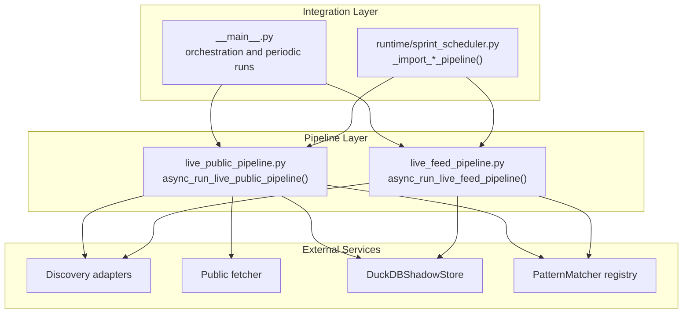
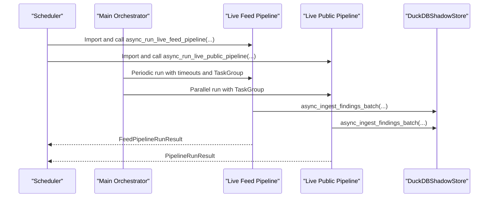
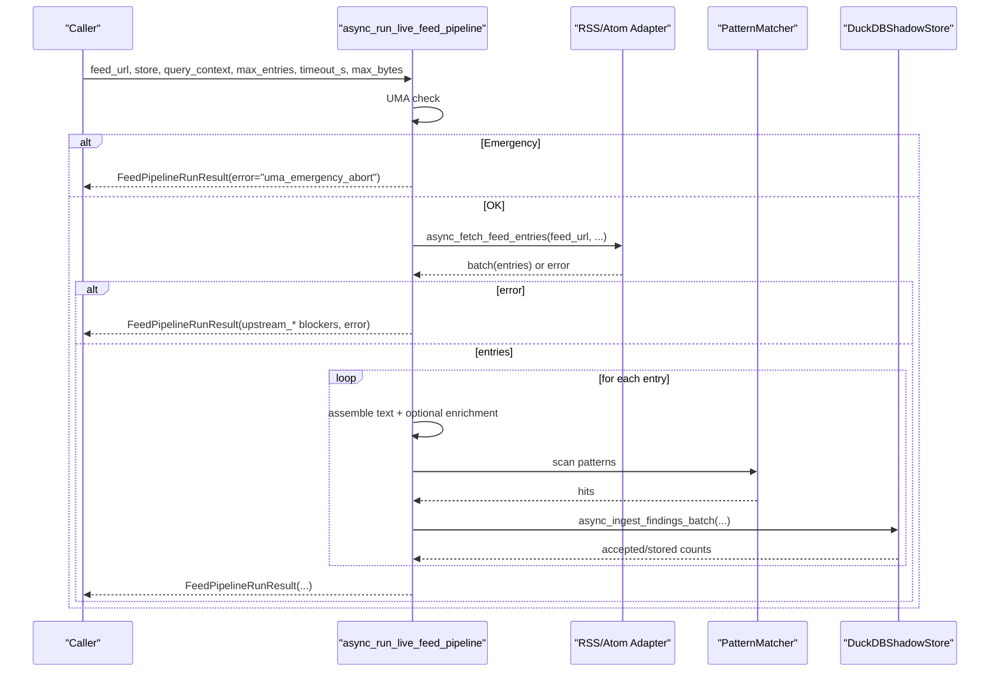
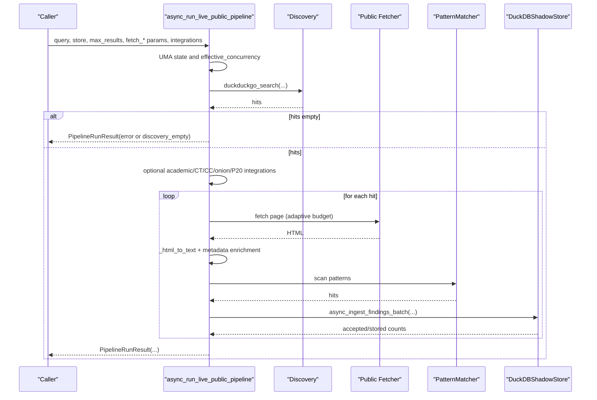
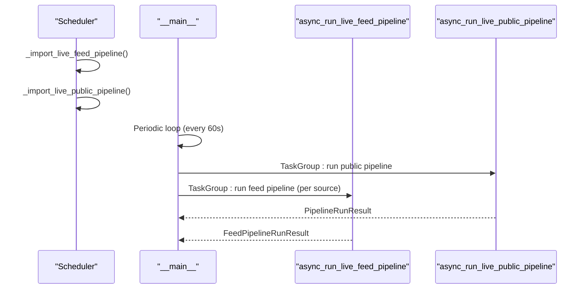
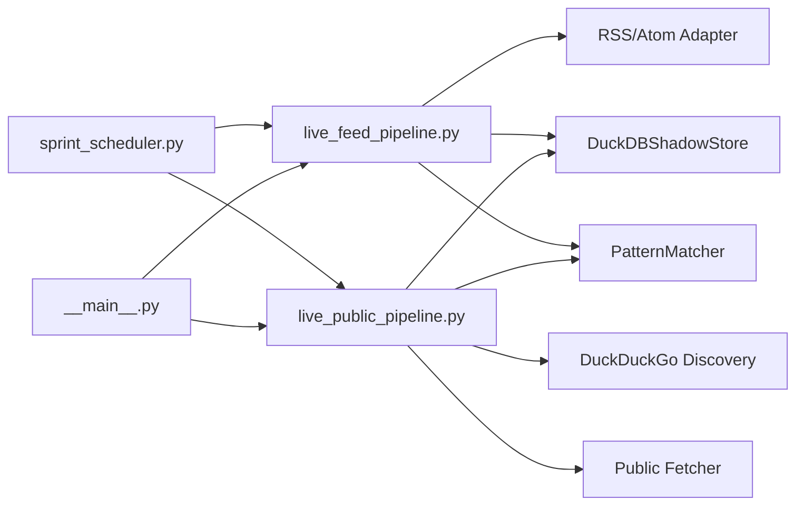

# Pipeline APIs

<cite>
**Referenced Files in This Document**
- [live_feed_pipeline.py](file://hledac/universal/pipeline/live_feed_pipeline.py)
- [live_public_pipeline.py](file://hledac/universal/pipeline/live_public_pipeline.py)
- [sprint_scheduler.py](file://hledac/universal/runtime/sprint_scheduler.py)
- [__main__.py](file://hledac/universal/__main__.py)
- [test_authority_split.py](file://hledac/universal/tests/probe_8ux/test_authority_split.py)
- [test_sprint_8al.py](file://hledac/universal/tests/probe_8al/test_sprint_8al.py)
</cite>

## Table of Contents
1. [Introduction](#introduction)
2. [Project Structure](#project-structure)
3. [Core Components](#core-components)
4. [Architecture Overview](#architecture-overview)
5. [Detailed Component Analysis](#detailed-component-analysis)
6. [Dependency Analysis](#dependency-analysis)
7. [Performance Considerations](#performance-considerations)
8. [Troubleshooting Guide](#troubleshooting-guide)
9. [Conclusion](#conclusion)

## Introduction
This document provides API documentation for Hledac Universal’s live pipeline functions, focusing on:
- async_run_live_feed_pipeline(): a feed-based pipeline that ingests RSS/Atom entries, extracts and scans text, and produces findings.
- async_run_live_public_pipeline(): a public OSINT pipeline that discovers results, fetches pages, enriches content, and produces findings.

It covers parameters, return types, usage patterns, configuration, error handling, integration with the scheduler, result structures, performance characteristics, and best practices.

## Project Structure
The pipeline APIs reside under the pipeline package and integrate with discovery, fetching, pattern matching, and storage layers. The scheduler and main orchestration glue connect these pipelines to runtime execution.

**Diagram sources**
- [live_feed_pipeline.py:1754-1953](file://hledac/universal/pipeline/live_feed_pipeline.py#L1754-L1953)
- [live_public_pipeline.py:1875-2074](file://hledac/universal/pipeline/live_public_pipeline.py#L1875-L2074)
- [sprint_scheduler.py:472-498](file://hledac/universal/runtime/sprint_scheduler.py#L472-L498)
- [__main__.py:1653-1679](file://hledac/universal/__main__.py#L1653-L1679)

**Section sources**
- [live_feed_pipeline.py:1754-1953](file://hledac/universal/pipeline/live_feed_pipeline.py#L1754-L1953)
- [live_public_pipeline.py:1875-2074](file://hledac/universal/pipeline/live_public_pipeline.py#L1875-L2074)
- [sprint_scheduler.py:472-498](file://hledac/universal/runtime/sprint_scheduler.py#L472-L498)
- [__main__.py:1653-1679](file://hledac/universal/__main__.py#L1653-L1679)

## Core Components
- async_run_live_feed_pipeline(feed_url, store=None, query_context=None, max_entries=20, timeout_s=35.0, max_bytes=2_000_000) -> FeedPipelineRunResult
  - Purpose: Fetch and process a single feed URL, scan entries for patterns, deduplicate, and store findings.
  - Key behaviors:
    - UMA emergency check; fail-soft abort if emergency.
    - Fetch entries via discovery adapter; handle granular upstream blockers.
    - Per-entry: assemble text, optional enrichment, pattern scan, dedup, and store.
    - Aggregates pre-store observability and economic metrics for feed branch decisions.
- async_run_live_public_pipeline(query, store=None, max_results=10, fetch_timeout_s=35.0, fetch_max_bytes=2_000_000, fetch_concurrency=5, hermes_engine=None, graph=None, memory_manager=None, session_id=None, vector_store=None, run_loop=False, rl_steps=0, enqueue_hypothesis_pivot=None) -> PipelineRunResult
  - Purpose: Discover public results, fetch pages, extract and scan text, and produce findings.
  - Key behaviors:
    - Discovery via DuckDuckGo and optional academic, CT, CC, onion, Pastebin, and GitHub integrations.
    - Adaptive fetch budget and concurrency based on UMA state and discovery signals.
    - Per-page quality scoring, usable-value computation, and waste categorization.
    - Rich run-level metrics for branch economics and operator guidance.

**Section sources**
- [live_feed_pipeline.py:1754-1953](file://hledac/universal/pipeline/live_feed_pipeline.py#L1754-L1953)
- [live_public_pipeline.py:1875-2074](file://hledac/universal/pipeline/live_public_pipeline.py#L1875-L2074)

## Architecture Overview
The pipelines are orchestrated by the runtime scheduler and main entrypoint. They integrate with discovery, fetching, pattern matching, and storage systems.

**Diagram sources**
- [sprint_scheduler.py:472-498](file://hledac/universal/runtime/sprint_scheduler.py#L472-L498)
- [__main__.py:1653-1679](file://hledac/universal/__main__.py#L1653-L1679)
- [live_feed_pipeline.py:1754-1953](file://hledac/universal/pipeline/live_feed_pipeline.py#L1754-L1953)
- [live_public_pipeline.py:1875-2074](file://hledac/universal/pipeline/live_public_pipeline.py#L1875-L2074)

## Detailed Component Analysis

### async_run_live_feed_pipeline
- Parameters
  - feed_url: Target feed URL.
  - store: Optional DuckDBShadowStore instance; None enables count-only mode.
  - query_context: Optional context string for findings.
  - max_entries: Upper bound for entries processed per feed.
  - timeout_s: Feed fetch timeout.
  - max_bytes: Maximum bytes to fetch.
- Returns
  - FeedPipelineRunResult: Aggregated run metrics, per-entry results, and observability counters.
- Processing logic
  - UMA emergency check; returns error result if emergency.
  - Fetch entries via discovery adapter; map granular upstream blockers.
  - For each entry: assemble text, optional enrichment, pattern scan, dedup, and store.
  - Aggregate counters for pre-store observability and feed branch economics.
  - Compute diagnosis of where the signal was lost and derive zero-signal reasons.
- Error handling
  - Fail-soft per entry; collect granular upstream fetch/parse/source-level blockers.
  - Preserve partial accepted/stored counts across exceptions.
- Usage patterns
  - Single feed run: call with feed_url and optional store.
  - Batch feed runs: use async_run_feed_source_batch() or async_run_default_feed_batch().

**Diagram sources**
- [live_feed_pipeline.py:1754-2349](file://hledac/universal/pipeline/live_feed_pipeline.py#L1754-L2349)

**Section sources**
- [live_feed_pipeline.py:1754-2349](file://hledac/universal/pipeline/live_feed_pipeline.py#L1754-L2349)

### async_run_live_public_pipeline
- Parameters
  - query: Research query string.
  - store: Optional DuckDBShadowStore instance.
  - max_results: Maximum discovery hits to process.
  - fetch_timeout_s: Per-fetch timeout.
  - fetch_max_bytes: Maximum bytes to fetch per page.
  - fetch_concurrency: Concurrency for fetching.
  - hermes_engine: Optional OSINT report engine.
  - graph: Optional graph integration.
  - memory_manager: Optional persistent RAG history.
  - session_id: Optional session ID for memory manager.
  - vector_store: Optional vector store.
  - run_loop: If True, run ResearchLoop after pipeline.
  - rl_steps: Number of RL steps (0 uses time limit).
  - enqueue_hypothesis_pivot: Optional feedback seam.
- Returns
  - PipelineRunResult: Aggregated run metrics, per-page results, and branch economics.
- Processing logic
  - Discovery via DuckDuckGo; optional academic, CT, CC, onion, Pastebin, and GitHub integrations.
  - Adaptive fetch budget and concurrency based on UMA state and discovery scores.
  - Per-page: quality scoring, usable-value computation, and waste categorization.
  - Aggregate run-level metrics for operator guidance and temporal signal persistence.
- Error handling
  - Discovery errors mapped to run-level error; batch gather handles exceptions.
  - Fail-soft for optional integrations (academic, CT, CC, onion, P20).
- Usage patterns
  - Basic run: query and store.
  - Advanced run: enable integrations and memory manager for RAG context.

**Diagram sources**
- [live_public_pipeline.py:1875-2469](file://hledac/universal/pipeline/live_public_pipeline.py#L1875-L2469)

**Section sources**
- [live_public_pipeline.py:1875-2469](file://hledac/universal/pipeline/live_public_pipeline.py#L1875-L2469)

### Result Structures

#### FeedPipelineRunResult (Feed pipeline)
- Fields include:
  - feed_url, fetched_entries, accepted_findings, stored_findings, patterns_configured, matched_patterns
  - pages: tuple of FeedPipelineEntryResult
  - Observability counters: entries_seen, entries_with_empty_assembled_text, entries_with_text, entries_scanned, entries_with_hits, total_pattern_hits, findings_built_pre_store
  - Averages and samples: assembled_text_chars_total, avg_assembled_text_len, sample_scanned_texts, sample_hit_counts, sample_hit_labels_union, sample_texts_truncated
  - Enrichment counters: entries_with_rich_feed_content, entries_with_article_fallback, article_fallback_fetch_attempts, article_fallback_fetch_successes, enriched_text_chars_total, avg_enriched_text_len, sample_enriched_texts, enrichment_phase_used
  - Economic metrics: feed_branch_signal_present, fallback_useful_count, fallback_waste_count, findings_from_rich_feed, findings_from_fallback, feed_branch_hint, feed_economics_verdict, feed_branch_verdict, squandered_high_usefulness_entries, fallback_value_ratio, feed_native_yield_ratio, metadata_strong_but_content_weak, low_trust_feed_hits, feed_next_action, feed_confidence_note, winning_source_breakdown
  - Root-cause diagnostics: upstream_fetch_blocker, upstream_parse_blocker, source_accessibility_blocker, root_zero_yield_reason, had_substantive_content_but_no_hits, findings_lost_to_dedup, pre_fallback_hits_total, post_fallback_hits_total, zero_hit_feed_fetch_count, zero_hit_feed_fetch_reasons, zero_hit_feed_fetch_samples

**Section sources**
- [live_feed_pipeline.py:232-310](file://hledac/universal/pipeline/live_feed_pipeline.py#L232-L310)

#### PipelineRunResult (Public pipeline)
- Fields include:
  - query, discovered, fetched, matched_patterns, accepted_findings, stored_findings, patterns_configured, pages
  - Branch economics: strong_pages, weak_pages_skipped, low_value_fetches, discovery_strong_content_weak, discovery_and_content_strong, discovery_squandered, noise_fetch_ratio, corroboration_vs_burn, public_next_action, public_confidence_note, public_branch_verdict
  - Usable-value aggregates: usable_findings_ratio, discovery_to_findings_efficiency, quality_mix, public_proof_grade, public_value_density, top_waste_pattern, factual_value_density, run_waste_pattern_code, waste_reason_breakdown
  - Conversion truth: discovery_false_positive_count, waste_category_counts, structural_health_ratio
  - Backend health: backend_degraded
  - Discovery and fetch accessibility: public_discovery_blocker, public_fetch_accessibility_blocker, public_discovery_fallback_state, dominant_public_failure_mode
  - Zero-hit telemetry: zero_hit_accessible_fetch_count, zero_hit_quality_reason_counts, zero_hit_title_samples, public_zero_hit_summary
  - Additional integrations: ct_subdomain_injected, cc_archive_injected, academic_findings_count, pastebin_findings_count, github_secrets_count

**Section sources**
- [live_public_pipeline.py:198-271](file://hledac/universal/pipeline/live_public_pipeline.py#L198-L271)

### Integration with Scheduler
- Scheduler imports pipeline functions lazily to avoid cold-start overhead.
- __main__ periodically invokes both pipelines concurrently using TaskGroup and enforces per-feed timeouts.

**Diagram sources**
- [sprint_scheduler.py:472-498](file://hledac/universal/runtime/sprint_scheduler.py#L472-L498)
- [__main__.py:2786-2807](file://hledac/universal/__main__.py#L2786-L2807)

**Section sources**
- [sprint_scheduler.py:472-498](file://hledac/universal/runtime/sprint_scheduler.py#L472-L498)
- [__main__.py:2786-2807](file://hledac/universal/__main__.py#L2786-L2807)

## Dependency Analysis
- Internal dependencies
  - live_feed_pipeline depends on discovery adapter, pattern matcher, and DuckDBShadowStore.
  - live_public_pipeline depends on discovery, public fetcher, pattern matcher, and DuckDBShadowStore.
- External dependencies
  - PatternMatcher registry drives pattern scanning.
  - DuckDBShadowStore provides asynchronous ingestion and storage.
- Coupling and cohesion
  - Pipelines are cohesive around their domain (feeds vs public discovery) and depend on shared utilities (HTML extraction, finding ID generation, quality scoring).
  - Scheduler and main orchestrator maintain loose coupling via lazy imports and task-based orchestration.

**Diagram sources**
- [live_feed_pipeline.py:1754-1953](file://hledac/universal/pipeline/live_feed_pipeline.py#L1754-L1953)
- [live_public_pipeline.py:1875-2074](file://hledac/universal/pipeline/live_public_pipeline.py#L1875-L2074)
- [sprint_scheduler.py:472-498](file://hledac/universal/runtime/sprint_scheduler.py#L472-L498)
- [__main__.py:1653-1679](file://hledac/universal/__main__.py#L1653-L1679)

**Section sources**
- [live_feed_pipeline.py:1754-1953](file://hledac/universal/pipeline/live_feed_pipeline.py#L1754-L1953)
- [live_public_pipeline.py:1875-2074](file://hledac/universal/pipeline/live_public_pipeline.py#L1875-L2074)
- [sprint_scheduler.py:472-498](file://hledac/universal/runtime/sprint_scheduler.py#L472-L498)
- [__main__.py:1653-1679](file://hledac/universal/__main__.py#L1653-L1679)

## Performance Considerations
- Concurrency and batching
  - Feed pipeline: bounded pattern offload concurrency via module-level semaphore.
  - Public pipeline: configurable fetch_concurrency; reduced to 1 under UMA critical/emergency.
- Adaptive budgeting
  - Public pipeline adjusts per-page timeouts based on discovery scores and quality tiers.
- I/O and CPU separation
  - Heavy I/O (HTML parsing, pattern scanning) offloaded to threads via asyncio.to_thread.
- Memory and storage
  - DuckDBShadowStore ingestion returns acceptance and storage success counts; partial results preserved on exceptions.
- Observability
  - Extensive counters for diagnosing zero-yield stages and economic decisions in both pipelines.

[No sources needed since this section provides general guidance]

## Troubleshooting Guide
- Common error categories
  - UMA emergency: both pipelines return error results indicating emergency state.
  - Upstream fetch/parse/source blockers: feed pipeline maps granular blockers (XML parse, wrong content type, redirects, DNS, connection, robots, HTTP errors).
  - Discovery failures: public pipeline surfaces discovery errors and dominant failure modes.
  - Storage exceptions: public pipeline preserves partial accepted/stored counts; store exceptions recorded per entry.
- Diagnosis aids
  - Feed pipeline: signal_stage diagnosis and zero-signal reasons; enrichment and fallback counters.
  - Public pipeline: public_branch_verdict, temporal signal summaries, and waste category distributions.
- Integration tips
  - Use scheduler imports to ensure lazy initialization and avoid cold-start costs.
  - Wrap pipeline calls with timeouts and TaskGroup for periodic runs.

**Section sources**
- [live_feed_pipeline.py:1792-1888](file://hledac/universal/pipeline/live_feed_pipeline.py#L1792-L1888)
- [live_public_pipeline.py:1982-2042](file://hledac/universal/pipeline/live_public_pipeline.py#L1982-L2042)

## Conclusion
The live pipeline APIs provide robust, observable, and resilient execution for feed-based and public discovery workflows. They integrate cleanly with discovery, fetching, pattern matching, and storage, and are orchestrated by the scheduler and main entrypoint. Use the result structures to guide operational decisions, and leverage the built-in observability and economic metrics for continuous improvement.