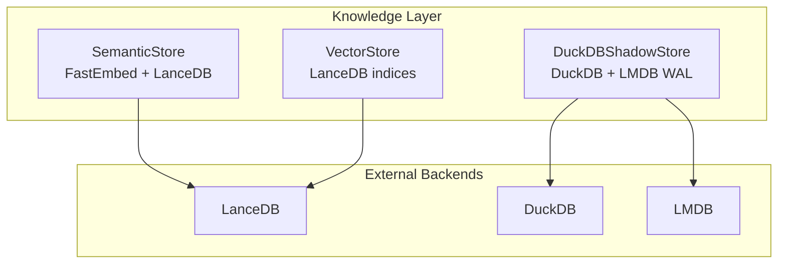
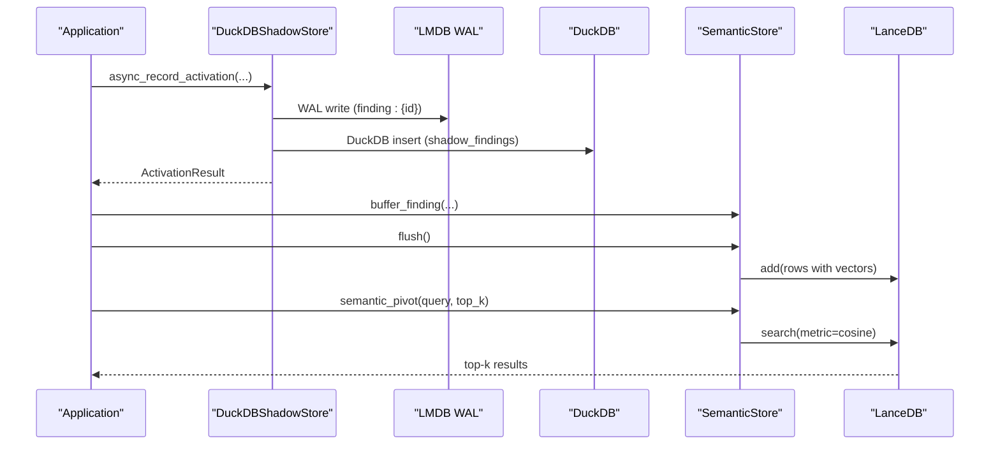
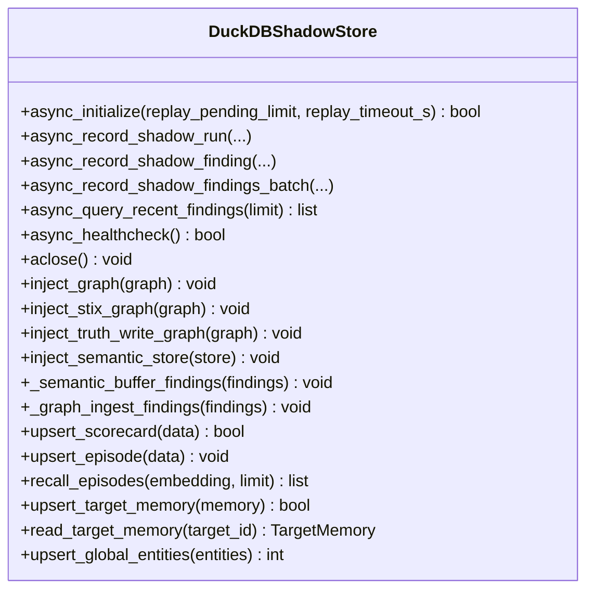
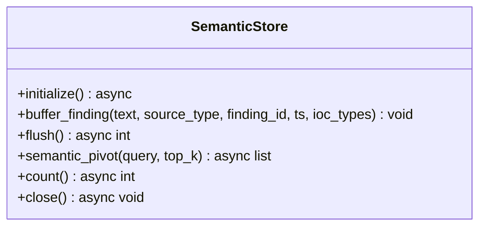
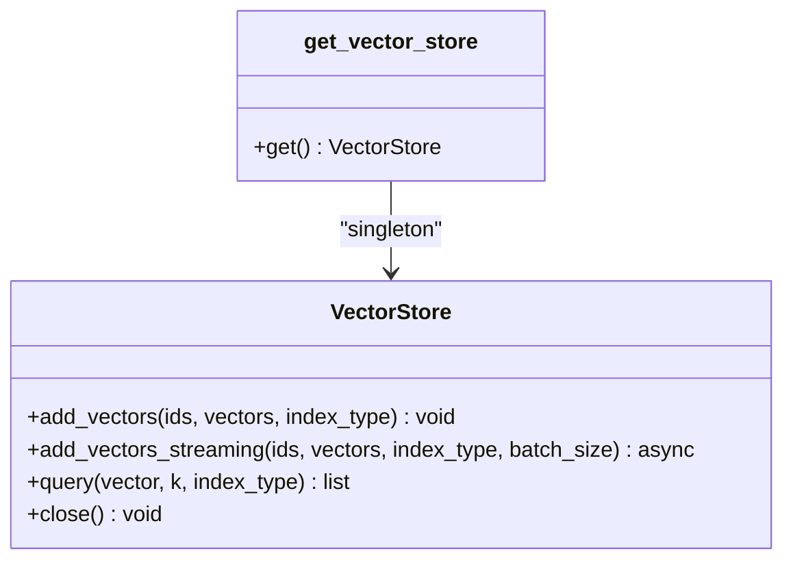
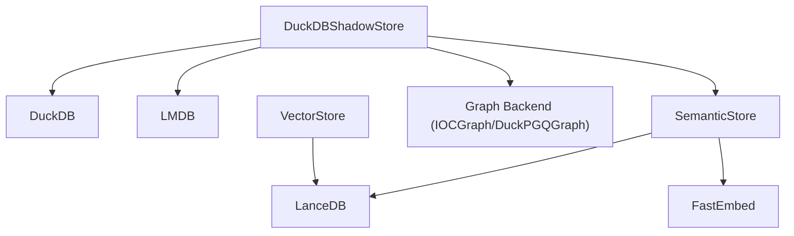

# Storage APIs

<cite>
**Referenced Files in This Document**
- [duckdb_store.py](file://hledac/universal/knowledge/duckdb_store.py)
- [semantic_store.py](file://hledac/universal/knowledge/semantic_store.py)
- [vector_store.py](file://hledac/universal/knowledge/vector_store.py)
</cite>

## Table of Contents
1. [Introduction](#introduction)
2. [Project Structure](#project-structure)
3. [Core Components](#core-components)
4. [Architecture Overview](#architecture-overview)
5. [Detailed Component Analysis](#detailed-component-analysis)
6. [Dependency Analysis](#dependency-analysis)
7. [Performance Considerations](#performance-considerations)
8. [Troubleshooting Guide](#troubleshooting-guide)
9. [Conclusion](#conclusion)

## Introduction
This document describes the Storage APIs used by Hledac Universal for data persistence, querying, and retrieval. It focuses on three core storage components:
- DuckDBShadowStore: Canonical store for sprint-level facts, shadow findings, and analytics tables; supports async/sync APIs, replay, and graph/semantic integrations.
- SemanticStore: FastEmbed + LanceDB-backed semantic search for findings; supports buffering, batch embedding, and ANN search.
- VectorStore: LanceDB-backed vector storage with separate indices for text and images; supports streaming batch adds and cosine similarity queries.

It covers configuration, lifecycle management, performance tuning, and practical usage patterns for storing and retrieving findings, managing embeddings, and performing semantic searches.

## Project Structure
The storage layer resides under the knowledge package and exposes three primary classes:
- DuckDBShadowStore: DuckDB-backed canonical store with extensive analytics tables and async/sync APIs.
- SemanticStore: Lightweight semantic search store using LanceDB and FastEmbed.
- VectorStore: Vector index provider with text and image indices and streaming batch operations.

**Diagram sources**
- [duckdb_store.py:533-658](file://hledac/universal/knowledge/duckdb_store.py#L533-L658)
- [semantic_store.py:42-118](file://hledac/universal/knowledge/semantic_store.py#L42-L118)
- [vector_store.py:44-121](file://hledac/universal/knowledge/vector_store.py#L44-L121)

**Section sources**
- [duckdb_store.py:1-120](file://hledac/universal/knowledge/duckdb_store.py#L1-L120)
- [semantic_store.py:1-40](file://hledac/universal/knowledge/semantic_store.py#L1-L40)
- [vector_store.py:1-40](file://hledac/universal/knowledge/vector_store.py#L1-L40)

## Core Components
- DuckDBShadowStore
  - Role: Canonical store for sprint facts, shadow findings, analytics tables, and graph/semantic integrations.
  - Async/Sync: Full async API plus backward-compatible sync methods; thread-affine DuckDB operations via a single-thread executor.
  - Features: Health checks, batch inserts, replay, graph seams, target profiles/memory, research episodes, global entities, and rich read seams for analytics.
- SemanticStore
  - Role: Consumer-facing semantic search store; buffers findings and flushes to LanceDB with embeddings.
  - Lifecycle: initialize() loads FastEmbed model and opens LanceDB; flush() performs batch embedding and upsert; semantic_pivot() performs ANN search.
- VectorStore
  - Role: Primary vector storage with separate text and image indices; supports streaming batch adds and cosine similarity queries.

**Section sources**
- [duckdb_store.py:533-658](file://hledac/universal/knowledge/duckdb_store.py#L533-L658)
- [semantic_store.py:42-118](file://hledac/universal/knowledge/semantic_store.py#L42-L118)
- [vector_store.py:44-121](file://hledac/universal/knowledge/vector_store.py#L44-L121)

## Architecture Overview
The storage APIs integrate DuckDB, LMDB, LanceDB, and external embedding providers. DuckDBShadowStore centralizes canonical persistence and provides graph/semantic integration hooks. SemanticStore and VectorStore complement DuckDB with specialized embedding and vector search capabilities.

**Diagram sources**
- [duckdb_store.py:3703-3878](file://hledac/universal/knowledge/duckdb_store.py#L3703-L3878)
- [semantic_store.py:123-266](file://hledac/universal/knowledge/semantic_store.py#L123-L266)

## Detailed Component Analysis

### DuckDBShadowStore
- Purpose and scope
  - Canonical store for sprint-level facts, shadow findings, analytics tables, and graph/semantic integrations.
  - Supports both file-mode (:memory:) and RAMDISK-first file-mode with thread-affine DuckDB connections.
- Async API surface
  - async_initialize(replay_pending_limit, replay_timeout_s)
  - async_record_shadow_run/run_id, started_at, ended_at, total_fds, rss_mb
  - async_record_shadow_finding/finding_id, query, source_type, confidence
  - async_record_shadow_findings_batch(findings, max_batch_size)
  - async_query_recent_findings(limit)
  - async_healthcheck()
  - aclose()
- Additional specialized APIs
  - async_record_sprint_delta(row), async_record_source_hit(...)
  - async_query_sprint_trend(last_n), async_query_source_leaderboard(days), async_query_sprint_source_stats()
  - async_query_recent_findings_by_sprint(sprint_id, limit)
  - async_query_top_entities_by_sprint(sprint_id, limit)
  - async_query_sprint_ioc_summary(sprint_id), async_query_top_sources_by_sprint(sprint_id, limit)
  - upsert_scorecard(data), upsert_episode(data), recall_episodes(query_embedding, limit)
  - upsert_target_memory(memory), read_target_memory(target_id)
  - upsert_global_entities(entities)
  - get_sprint_scorecard_trend(last_n), get_sprint_delta_comparison(current_sprint_id, lookback)
  - get_source_mix_trend(days), get_yield_trend(last_n), get_high_value_sprint_ranking(last_n)
  - get_recent_best_sprints(last_n), get_recent_worst_sprints(last_n)
- Activation API
  - async_record_activation/findings with WAL-first semantics and ActivationResult contract.
  - async_record_canonical_finding(CanonicalFinding DTO) with typed ingestion.
- Graph and semantic integration
  - inject_graph(graph), inject_stix_graph(graph), inject_truth_write_graph(graph)
  - get_graph_attachment_kind(), graph_supports_buffered_writes(), truth_write_graph_supports_buffered_writes()
  - inject_semantic_store(store), _semantic_buffer_findings(findings)
  - _graph_ingest_findings(findings) for IOC graph buffering and observation pairing.
- Replay and startup
  - Startup replay guarded by _startup_ready Event; replay constants and dead-lettering for pending markers.
- Schema and migrations
  - Defines and maintains schema for shadow_findings, shadow_runs, sprint_delta, source_hit_log, sprint_scorecard, research_episodes, target_profiles, target_memory, hypothesis_feedback.
  - Applies schema migrations for backward compatibility.

**Diagram sources**
- [duckdb_store.py:533-658](file://hledac/universal/knowledge/duckdb_store.py#L533-L658)
- [duckdb_store.py:1197-1244](file://hledac/universal/knowledge/duckdb_store.py#L1197-L1244)
- [duckdb_store.py:2221-2301](file://hledac/universal/knowledge/duckdb_store.py#L2221-L2301)

**Section sources**
- [duckdb_store.py:533-658](file://hledac/universal/knowledge/duckdb_store.py#L533-L658)
- [duckdb_store.py:2221-2301](file://hledac/universal/knowledge/duckdb_store.py#L2221-L2301)
- [duckdb_store.py:2330-2399](file://hledac/universal/knowledge/duckdb_store.py#L2330-L2399)
- [duckdb_store.py:2431-2490](file://hledac/universal/knowledge/duckdb_store.py#L2431-L2490)
- [duckdb_store.py:2496-2556](file://hledac/universal/knowledge/duckdb_store.py#L2496-L2556)
- [duckdb_store.py:2561-2658](file://hledac/universal/knowledge/duckdb_store.py#L2561-L2658)
- [duckdb_store.py:2664-2753](file://hledac/universal/knowledge/duckdb_store.py#L2664-L2753)
- [duckdb_store.py:2794-2840](file://hledac/universal/knowledge/duckdb_store.py#L2794-L2840)
- [duckdb_store.py:2866-2921](file://hledac/universal/knowledge/duckdb_store.py#L2866-L2921)
- [duckdb_store.py:2927-3034](file://hledac/universal/knowledge/duckdb_store.py#L2927-L3034)
- [duckdb_store.py:3040-3130](file://hledac/universal/knowledge/duckdb_store.py#L3040-L3130)
- [duckdb_store.py:3131-3163](file://hledac/universal/knowledge/duckdb_store.py#L3131-L3163)
- [duckdb_store.py:3176-3211](file://hledac/universal/knowledge/duckdb_store.py#L3176-L3211)
- [duckdb_store.py:3217-3264](file://hledac/universal/knowledge/duckdb_store.py#L3217-L3264)
- [duckdb_store.py:3266-3353](file://hledac/universal/knowledge/duckdb_store.py#L3266-L3353)
- [duckdb_store.py:3355-3405](file://hledac/universal/knowledge/duckdb_store.py#L3355-L3405)
- [duckdb_store.py:3407-3457](file://hledac/universal/knowledge/duckdb_store.py#L3407-L3457)
- [duckdb_store.py:3464-3526](file://hledac/universal/knowledge/duckdb_store.py#L3464-L3526)
- [duckdb_store.py:3528-3590](file://hledac/universal/knowledge/duckdb_store.py#L3528-L3590)
- [duckdb_store.py:3592-3697](file://hledac/universal/knowledge/duckdb_store.py#L3592-L3697)
- [duckdb_store.py:3703-3878](file://hledac/universal/knowledge/duckdb_store.py#L3703-L3878)
- [duckdb_store.py:3884-3962](file://hledac/universal/knowledge/duckdb_store.py#L3884-L3962)

### SemanticStore
- Purpose
  - Consumer/Enrichment store for semantic search over findings; not the grounding authority.
- Lifecycle
  - initialize(): loads FastEmbed model and connects to LanceDB; ensures table exists.
  - close(): final flush and cleanup.
- Buffering and flush
  - buffer_finding(text, source_type, finding_id, ts, ioc_types): bounded pending buffer with truncation.
  - flush(): batch embed via CPU executor and LanceDB upsert; idempotent.
- Query
  - semantic_pivot(query, top_k): ANN search using cosine metric; returns scored results.
- Utilities
  - count(): row count in LanceDB table.

**Diagram sources**
- [semantic_store.py:42-118](file://hledac/universal/knowledge/semantic_store.py#L42-L118)
- [semantic_store.py:123-214](file://hledac/universal/knowledge/semantic_store.py#L123-L214)
- [semantic_store.py:220-266](file://hledac/universal/knowledge/semantic_store.py#L220-L266)
- [semantic_store.py:272-282](file://hledac/universal/knowledge/semantic_store.py#L272-L282)
- [semantic_store.py:288-300](file://hledac/universal/knowledge/semantic_store.py#L288-L300)

**Section sources**
- [semantic_store.py:42-118](file://hledac/universal/knowledge/semantic_store.py#L42-L118)
- [semantic_store.py:123-214](file://hledac/universal/knowledge/semantic_store.py#L123-L214)
- [semantic_store.py:220-266](file://hledac/universal/knowledge/semantic_store.py#L220-L266)
- [semantic_store.py:272-282](file://hledac/universal/knowledge/semantic_store.py#L272-L282)
- [semantic_store.py:288-300](file://hledac/universal/knowledge/semantic_store.py#L288-L300)

### VectorStore
- Purpose
  - Primary vector storage with separate indices for text (256d) and image (1024d) embeddings.
- Lifecycle
  - Singleton via get_vector_store(); lazy initialization on first add_vectors.
- Index management
  - add_vectors(ids, vectors, index_type): validates dims and adds to text or image table.
  - add_vectors_streaming(ids, vectors, index_type, batch_size): streaming batch add with event loop yielding.
  - query(vector, k, index_type): cosine similarity search; normalizes input and validates dims.
  - close(): closes connections.

**Diagram sources**
- [vector_store.py:44-121](file://hledac/universal/knowledge/vector_store.py#L44-L121)
- [vector_store.py:122-210](file://hledac/universal/knowledge/vector_store.py#L122-L210)
- [vector_store.py:211-277](file://hledac/universal/knowledge/vector_store.py#L211-L277)
- [vector_store.py:279-290](file://hledac/universal/knowledge/vector_store.py#L279-L290)
- [vector_store.py:297-307](file://hledac/universal/knowledge/vector_store.py#L297-L307)

**Section sources**
- [vector_store.py:44-121](file://hledac/universal/knowledge/vector_store.py#L44-L121)
- [vector_store.py:122-210](file://hledac/universal/knowledge/vector_store.py#L122-L210)
- [vector_store.py:211-277](file://hledac/universal/knowledge/vector_store.py#L211-L277)
- [vector_store.py:279-290](file://hledac/universal/knowledge/vector_store.py#L279-L290)
- [vector_store.py:297-307](file://hledac/universal/knowledge/vector_store.py#L297-L307)

## Dependency Analysis
- DuckDBShadowStore depends on:
  - DuckDB for durable persistence and analytics tables.
  - LMDB for WAL-first activation semantics and replay.
  - Optional graph backends (IOCGraph/Kuzu, DuckPGQGraph) for enrichment and truth-write buffering.
  - Optional SemanticStore for semantic buffering during windup.
- SemanticStore depends on:
  - LanceDB for ANN index and fast search.
  - FastEmbed for text embeddings.
  - CPU executor to avoid blocking the event loop.
- VectorStore depends on:
  - LanceDB for vector indices and queries.
  - PyArrow for schema and data conversion.

**Diagram sources**
- [duckdb_store.py:663-770](file://hledac/universal/knowledge/duckdb_store.py#L663-L770)
- [semantic_store.py:80-118](file://hledac/universal/knowledge/semantic_store.py#L80-L118)
- [vector_store.py:62-121](file://hledac/universal/knowledge/vector_store.py#L62-L121)

**Section sources**
- [duckdb_store.py:663-770](file://hledac/universal/knowledge/duckdb_store.py#L663-L770)
- [semantic_store.py:80-118](file://hledac/universal/knowledge/semantic_store.py#L80-L118)
- [vector_store.py:62-121](file://hledac/universal/knowledge/vector_store.py#L62-L121)

## Performance Considerations
- DuckDBShadowStore
  - Single-thread executor for DuckDB operations to maintain thread affinity and avoid connection contention.
  - PRAGMA threads=2 and memory limits configured via environment variables; validated to prevent SQL injection and unsafe paths.
  - Batch inserts with chunking (max_batch_size=500) for throughput.
  - Health checks and pre-warmed connections to reduce cold-start latency.
  - Replay guard and bounded pending markers to prevent unbounded growth.
- SemanticStore
  - Model loaded once during initialize; embeddings executed in CPU executor to avoid event loop blocking.
  - Bounded pending buffer with eviction to cap memory usage.
  - ANN search uses cosine metric; results normalized to 0..1 score.
- VectorStore
  - Lazy initialization reduces startup overhead.
  - Streaming batch add yields control between chunks to reduce peak RSS on constrained hardware.
  - Dimension validation and PyArrow schema ensure efficient LanceDB writes.

[No sources needed since this section provides general guidance]

## Troubleshooting Guide
- DuckDBShadowStore
  - Health and readiness: Use async_healthcheck() and _startup_ready gating for activation writes.
  - Replay issues: Startup replay can be bounded; monitor pending marker counts and dead-letter prefixes.
  - Schema migrations: Automatic migrations applied on file-mode connections; verify columns if encountering schema mismatches.
  - Graph seams: Use get_graph_attachment_kind() and capability checks before invoking buffered write methods.
- SemanticStore
  - Initialization failures: Ensure LanceDB and FastEmbed are available; check db path creation and model warm-up.
  - Pending buffer full: Oldest items evicted; adjust buffer size or flush frequency.
  - Query returns empty: Verify model initialization and table existence; ensure query is non-empty.
- VectorStore
  - Missing LanceDB: Install required dependency; ensure directory permissions.
  - Dimension mismatch: Validate input vectors match expected dimensions per index type.
  - Streaming errors: Fail-open behavior logs warnings; inspect chunk boundaries and event loop yielding.

**Section sources**
- [duckdb_store.py:2407-2425](file://hledac/universal/knowledge/duckdb_store.py#L2407-L2425)
- [duckdb_store.py:1314-1318](file://hledac/universal/knowledge/duckdb_store.py#L1314-L1318)
- [semantic_store.py:80-118](file://hledac/universal/knowledge/semantic_store.py#L80-L118)
- [semantic_store.py:137-143](file://hledac/universal/knowledge/semantic_store.py#L137-L143)
- [vector_store.py:115-120](file://hledac/universal/knowledge/vector_store.py#L115-L120)
- [vector_store.py:148-153](file://hledac/universal/knowledge/vector_store.py#L148-L153)
- [vector_store.py:200-209](file://hledac/universal/knowledge/vector_store.py#L200-L209)

## Conclusion
The Storage APIs provide a robust foundation for persisting findings, maintaining analytics, and enabling semantic and vector search:
- DuckDBShadowStore offers canonical persistence, replay, and integration seams for graph and semantic stores.
- SemanticStore enables efficient semantic search with embedding buffering and batch flush.
- VectorStore delivers scalable vector storage with streaming batch operations and cosine similarity queries.

These components are designed for reliability, performance, and extensibility, supporting both async and sync usage patterns while maintaining clear separation of concerns across DuckDB, LMDB, LanceDB, and embedding providers.