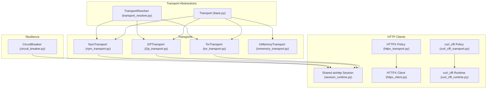
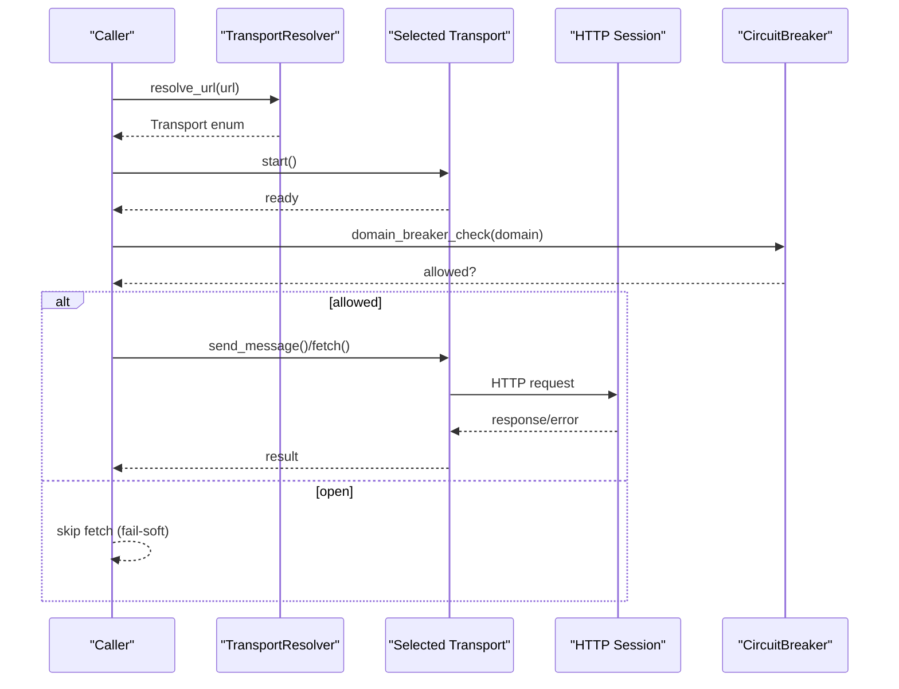
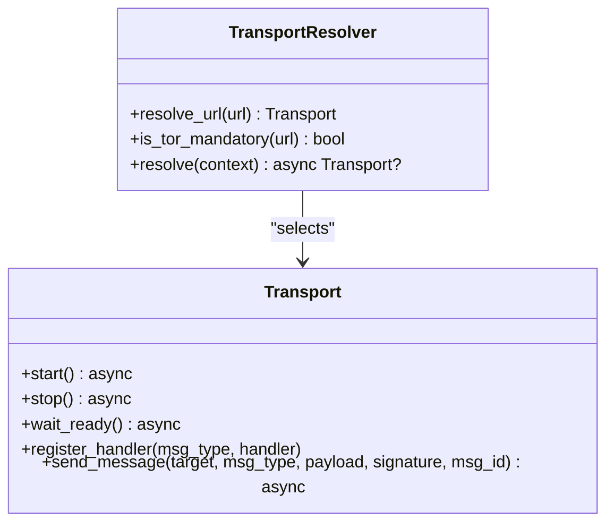
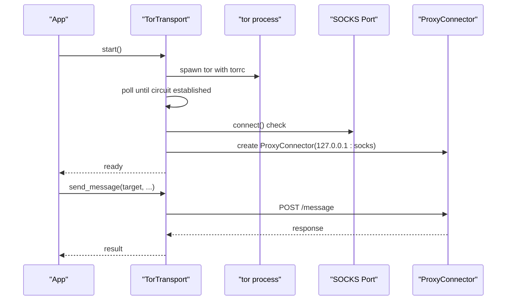
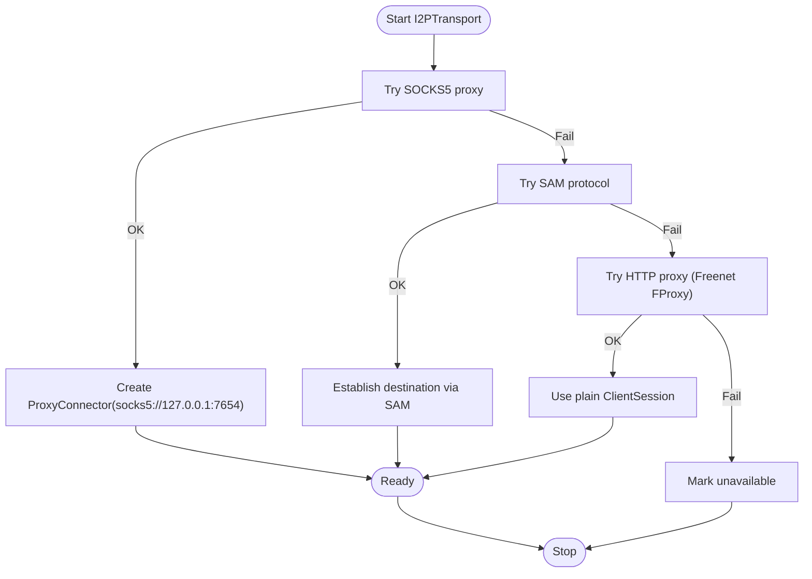
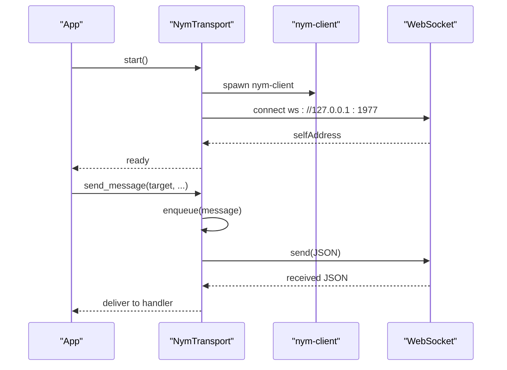
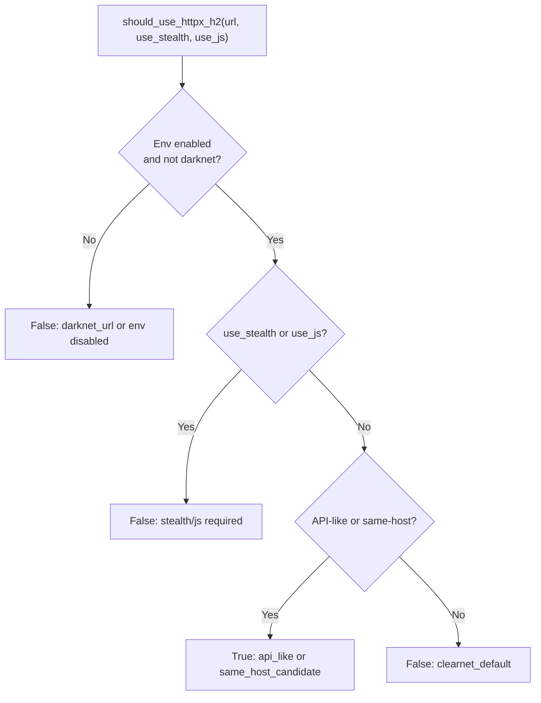
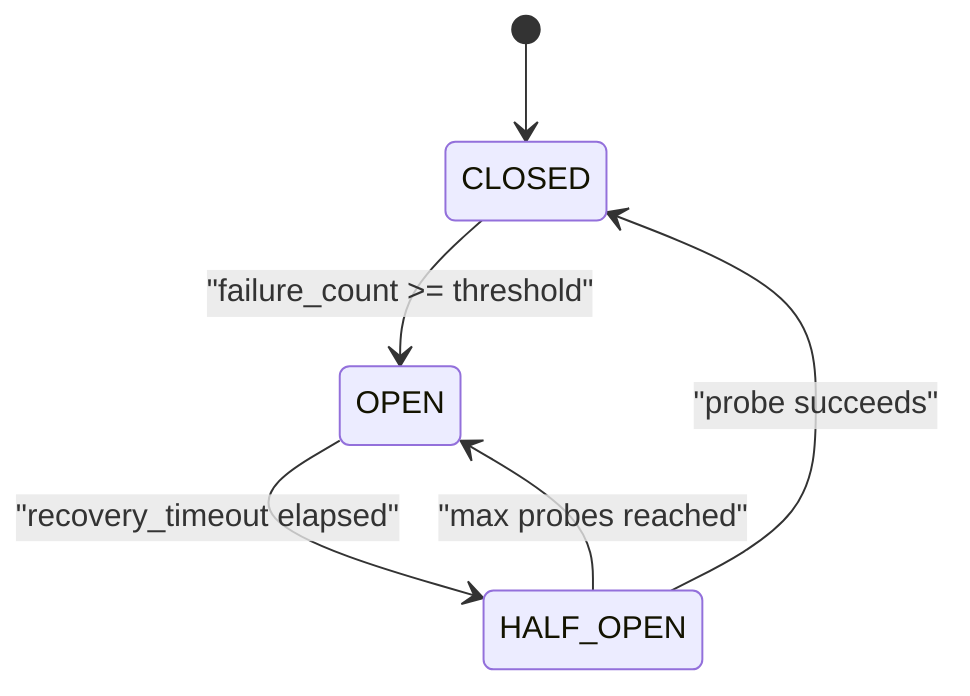
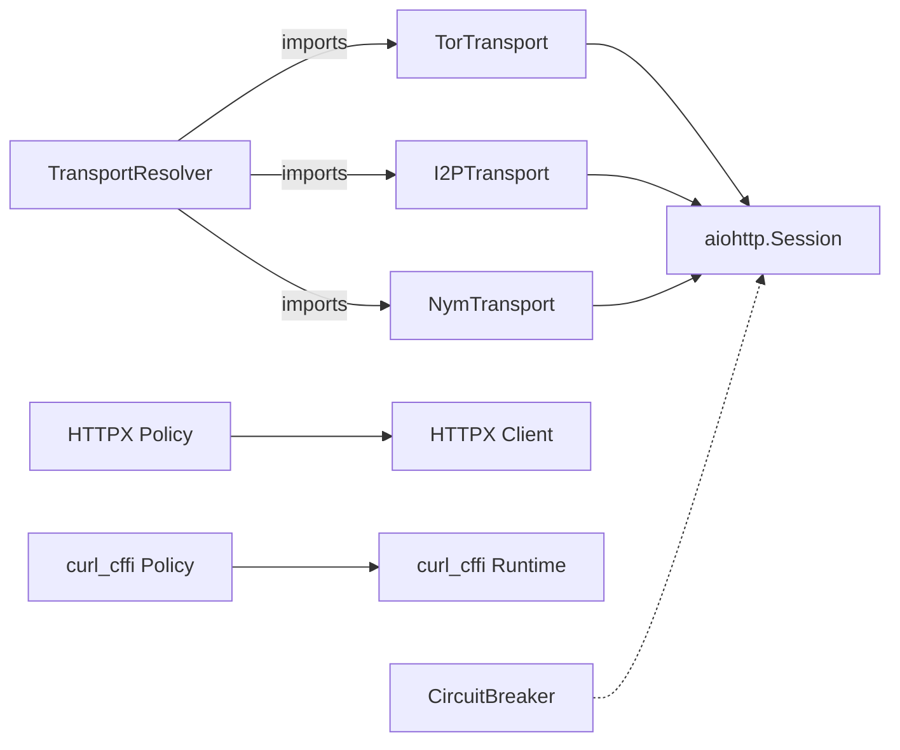

# Transport APIs

<cite>
**Referenced Files in This Document**
- [transport/__init__.py](file://transport/__init__.py)
- [transport/base.py](file://transport/base.py)
- [transport/transport_resolver.py](file://transport/transport_resolver.py)
- [transport/tor_transport.py](file://transport/tor_transport.py)
- [transport/i2p_transport.py](file://transport/i2p_transport.py)
- [transport/nym_transport.py](file://transport/nym_transport.py)
- [transport/inmemory_transport.py](file://transport/inmemory_transport.py)
- [transport/httpx_transport.py](file://transport/httpx_transport.py)
- [transport/httpx_client.py](file://transport/httpx_client.py)
- [transport/curl_cffi_transport.py](file://transport/curl_cffi_transport.py)
- [transport/curl_cffi_runtime.py](file://transport/curl_cffi_runtime.py)
- [transport/circuit_breaker.py](file://transport/circuit_breaker.py)
- [network/session_runtime.py](file://network/session_runtime.py)
- [network/tor_manager.py](file://network/tor_manager.py)
</cite>

## Table of Contents
1. [Introduction](#introduction)
2. [Project Structure](#project-structure)
3. [Core Components](#core-components)
4. [Architecture Overview](#architecture-overview)
5. [Detailed Component Analysis](#detailed-component-analysis)
6. [Dependency Analysis](#dependency-analysis)
7. [Performance Considerations](#performance-considerations)
8. [Troubleshooting Guide](#troubleshooting-guide)
9. [Conclusion](#conclusion)

## Introduction
This document describes the Transport APIs used by Hledac Universal to perform HTTP operations across clearnet, Tor, I2P, and in-memory environments. It covers:
- HTTP client interfaces and session lifecycles
- Tor transport mechanisms and circuit management
- Circuit breaker resilience patterns
- Transport selection and routing policies
- Rate limiting, connection pooling, and security considerations
- Examples for configuring transport protocols, handling network errors, and implementing proxy support

## Project Structure
The transport layer is organized around a small set of abstract interfaces and concrete implementations. Key modules include:
- Base interface for transports
- Resolver for autonomous transport selection
- Tor, I2P, Nym, and in-memory transports
- HTTPX and curl_cffi lanes for optimized and stealth HTTP
- Circuit breaker for resilience
- Shared session runtime for plain TCP

**Diagram sources**
- [transport/base.py:4-24](file://transport/base.py#L4-L24)
- [transport/transport_resolver.py:95-240](file://transport/transport_resolver.py#L95-L240)
- [transport/tor_transport.py:37-210](file://transport/tor_transport.py#L37-L210)
- [transport/i2p_transport.py:41-124](file://transport/i2p_transport.py#L41-L124)
- [transport/nym_transport.py:14-51](file://transport/nym_transport.py#L14-L51)
- [transport/inmemory_transport.py:8-31](file://transport/inmemory_transport.py#L8-L31)
- [network/session_runtime.py:99-138](file://network/session_runtime.py#L99-L138)
- [transport/httpx_transport.py:149-218](file://transport/httpx_transport.py#L149-L218)
- [transport/httpx_client.py:93-152](file://transport/httpx_client.py#L93-L152)
- [transport/curl_cffi_transport.py:34-86](file://transport/curl_cffi_transport.py#L34-L86)
- [transport/curl_cffi_runtime.py:61-139](file://transport/curl_cffi_runtime.py#L61-L139)
- [transport/circuit_breaker.py:100-147](file://transport/circuit_breaker.py#L100-L147)

**Section sources**
- [transport/__init__.py:1-16](file://transport/__init__.py#L1-L16)
- [transport/base.py:1-24](file://transport/base.py#L1-L24)
- [transport/transport_resolver.py:1-322](file://transport/transport_resolver.py#L1-L322)
- [transport/tor_transport.py:1-345](file://transport/tor_transport.py#L1-L345)
- [transport/i2p_transport.py:1-315](file://transport/i2p_transport.py#L1-L315)
- [transport/nym_transport.py:1-239](file://transport/nym_transport.py#L1-L239)
- [transport/inmemory_transport.py:1-92](file://transport/inmemory_transport.py#L1-L92)
- [transport/httpx_transport.py:1-391](file://transport/httpx_transport.py#L1-L391)
- [transport/httpx_client.py:1-213](file://transport/httpx_client.py#L1-L213)
- [transport/curl_cffi_transport.py:1-86](file://transport/curl_cffi_transport.py#L1-L86)
- [transport/curl_cffi_runtime.py:1-181](file://transport/curl_cffi_runtime.py#L1-L181)
- [transport/circuit_breaker.py:1-428](file://transport/circuit_breaker.py#L1-L428)
- [network/session_runtime.py:1-305](file://network/session_runtime.py#L1-L305)
- [network/tor_manager.py:1-146](file://network/tor_manager.py#L1-L146)

## Core Components
- Transport interface: Defines the contract for starting, stopping, readiness, registering handlers, and sending messages.
- TransportResolver: Autonomously selects transport based on URL classification and runtime availability.
- TorTransport: Manages a Tor circuit, hidden service, and SOCKS5 proxy sessions.
- I2PTransport: Provides SOCKS5, SAM, and HTTP proxy modes for I2P.
- NymTransport: WebSocket-based transport with internal circuit breaker and queueing.
- InMemoryTransport: In-process message bus for testing and internal use.
- HTTPX Transport: Policy-driven selection and HTTP/2 client for clearnet.
- curl_cffi Transport: Policy-driven selection and runtime session caching.
- CircuitBreaker: Domain-scoped resilience with state transitions and LRU registry.
- Shared aiohttp Session: Lazy-initialized, pooled session with standardized timeouts.

**Section sources**
- [transport/base.py:4-24](file://transport/base.py#L4-L24)
- [transport/transport_resolver.py:95-240](file://transport/transport_resolver.py#L95-L240)
- [transport/tor_transport.py:37-210](file://transport/tor_transport.py#L37-L210)
- [transport/i2p_transport.py:41-124](file://transport/i2p_transport.py#L41-L124)
- [transport/nym_transport.py:14-51](file://transport/nym_transport.py#L14-L51)
- [transport/inmemory_transport.py:8-31](file://transport/inmemory_transport.py#L8-L31)
- [transport/httpx_transport.py:149-218](file://transport/httpx_transport.py#L149-L218)
- [transport/curl_cffi_transport.py:34-86](file://transport/curl_cffi_transport.py#L34-L86)
- [transport/circuit_breaker.py:78-186](file://transport/circuit_breaker.py#L78-L186)
- [network/session_runtime.py:99-138](file://network/session_runtime.py#L99-L138)

## Architecture Overview
The transport system separates concerns across:
- Policy and routing: TransportResolver and URL classification
- Transport execution: Tor, I2P, Nym, and in-memory transports
- HTTP clients: Shared aiohttp session, HTTPX H2, and curl_cffi
- Resilience: Circuit breaker for domain-level failure tracking
- Tor control: TorManager for circuit isolation and rotation

**Diagram sources**
- [transport/transport_resolver.py:152-175](file://transport/transport_resolver.py#L152-L175)
- [transport/circuit_breaker.py:307-324](file://transport/circuit_breaker.py#L307-L324)
- [transport/tor_transport.py:246-265](file://transport/tor_transport.py#L246-L265)
- [network/session_runtime.py:99-138](file://network/session_runtime.py#L99-L138)

## Detailed Component Analysis

### Transport Interface and Resolver
- Transport defines the async lifecycle and messaging contract.
- TransportResolver classifies URLs and selects transports based on availability and risk/anonymity requirements.

**Diagram sources**
- [transport/base.py:4-24](file://transport/base.py#L4-L24)
- [transport/transport_resolver.py:95-175](file://transport/transport_resolver.py#L95-L175)

**Section sources**
- [transport/base.py:1-24](file://transport/base.py#L1-L24)
- [transport/transport_resolver.py:1-322](file://transport/transport_resolver.py#L1-L322)

### Tor Transport
- Starts/stops a Tor process, waits for circuit establishment, and exposes direct and SOCKS5 sessions.
- Provides health checks and hidden service address generation.
- Includes TLS fingerprinting utilities.

**Diagram sources**
- [transport/tor_transport.py:84-165](file://transport/tor_transport.py#L84-L165)
- [transport/tor_transport.py:246-265](file://transport/tor_transport.py#L246-L265)

**Section sources**
- [transport/tor_transport.py:1-345](file://transport/tor_transport.py#L1-L345)
- [network/tor_manager.py:1-146](file://network/tor_manager.py#L1-L146)

### I2P Transport
- Detects and initializes I2P via SOCKS5, SAM, or HTTP proxy modes.
- Provides lazy session retrieval and graceful shutdown.

**Diagram sources**
- [transport/i2p_transport.py:93-124](file://transport/i2p_transport.py#L93-L124)
- [transport/i2p_transport.py:244-275](file://transport/i2p_transport.py#L244-L275)

**Section sources**
- [transport/i2p_transport.py:1-315](file://transport/i2p_transport.py#L1-L315)

### Nym Transport
- Manages a local Nym client process and WebSocket for messaging.
- Implements an internal circuit breaker and bounded outgoing queue.

**Diagram sources**
- [transport/nym_transport.py:52-97](file://transport/nym_transport.py#L52-L97)
- [transport/nym_transport.py:146-212](file://transport/nym_transport.py#L146-L212)

**Section sources**
- [transport/nym_transport.py:1-239](file://transport/nym_transport.py#L1-L239)

### In-Memory Transport
- Lightweight in-process transport for testing and internal coordination.
- Bounded peer count and queue with polling and handler dispatch.

**Section sources**
- [transport/inmemory_transport.py:1-92](file://transport/inmemory_transport.py#L1-L92)

### HTTPX Transport and Client
- Policy determines whether to use HTTPX H2 for clearnet API-like URLs.
- HTTPX client is lazily created with HTTP/2, connection limits, and manual redirect handling.

**Diagram sources**
- [transport/httpx_transport.py:149-218](file://transport/httpx_transport.py#L149-L218)

**Section sources**
- [transport/httpx_transport.py:1-391](file://transport/httpx_transport.py#L1-L391)
- [transport/httpx_client.py:1-213](file://transport/httpx_client.py#L1-L213)

### curl_cffi Transport and Runtime
- Policy decides when to escalate to curl_cffi based on environment, prior statuses, and protection hints.
- Runtime provides lazy availability checks and bounded session cache with LRU eviction.

**Section sources**
- [transport/curl_cffi_transport.py:1-86](file://transport/curl_cffi_transport.py#L1-L86)
- [transport/curl_cffi_runtime.py:1-181](file://transport/curl_cffi_runtime.py#L1-L181)

### Circuit Breaker
- Domain-scoped state machine with CLOSED, OPEN, HALF_OPEN transitions.
- Tracks consecutive timeouts and increases recovery timeout exponentially (bounded).
- Provides shared registry with LRU eviction and diagnostic snapshots.

**Diagram sources**
- [transport/circuit_breaker.py:51-98](file://transport/circuit_breaker.py#L51-L98)
- [transport/circuit_breaker.py:100-147](file://transport/circuit_breaker.py#L100-L147)

**Section sources**
- [transport/circuit_breaker.py:1-428](file://transport/circuit_breaker.py#L1-L428)

### Shared aiohttp Session
- Lazy singleton with conservative connection limits and DNS caching.
- Provides canonical timeout constants and a gather helper to safely handle exceptions.

**Section sources**
- [network/session_runtime.py:1-305](file://network/session_runtime.py#L1-L305)

## Dependency Analysis
- Transports depend on the Transport interface and, where applicable, on shared HTTP sessions or proxy connectors.
- TransportResolver dynamically imports and instantiates transports only when needed.
- HTTPX and curl_cffi are optional; their presence is detected at runtime.
- CircuitBreaker is independent and used by higher-level fetchers to gate requests.

**Diagram sources**
- [transport/transport_resolver.py:129-151](file://transport/transport_resolver.py#L129-L151)
- [transport/tor_transport.py:52-62](file://transport/tor_transport.py#L52-L62)
- [transport/i2p_transport.py:67-77](file://transport/i2p_transport.py#L67-L77)
- [transport/nym_transport.py:17-24](file://transport/nym_transport.py#L17-L24)
- [transport/httpx_transport.py:184-185](file://transport/httpx_transport.py#L184-L185)
- [transport/curl_cffi_transport.py:64-66](file://transport/curl_cffi_transport.py#L64-L66)
- [transport/circuit_breaker.py:307-324](file://transport/circuit_breaker.py#L307-L324)

**Section sources**
- [transport/transport_resolver.py:1-322](file://transport/transport_resolver.py#L1-L322)
- [transport/tor_transport.py:1-345](file://transport/tor_transport.py#L1-L345)
- [transport/i2p_transport.py:1-315](file://transport/i2p_transport.py#L1-L315)
- [transport/nym_transport.py:1-239](file://transport/nym_transport.py#L1-L239)
- [transport/httpx_transport.py:1-391](file://transport/httpx_transport.py#L1-L391)
- [transport/curl_cffi_transport.py:1-86](file://transport/curl_cffi_transport.py#L1-L86)
- [transport/circuit_breaker.py:1-428](file://transport/circuit_breaker.py#L1-L428)

## Performance Considerations
- Connection pooling
  - Shared aiohttp session uses total pool size and per-host limits suitable for general web crawling.
  - HTTPX client uses higher limits suited for same-host API batches.
- Timeouts
  - Canonical timeout constants are provided for different workload categories.
- HTTP/2
  - HTTPX H2 is gated by environment variable and only used for eligible clearnet URLs.
- Circuit breaker
  - Limits cascading failures by backing off recovery timeouts and allowing controlled probes.
- Session lifecycle
  - Lazy initialization avoids startup overhead; idempotent close ensures reuse safety.

[No sources needed since this section provides general guidance]

## Troubleshooting Guide
- Tor not available
  - TorTransport logs missing dependencies and sets availability accordingly; circuit establishment is verified via SOCKS and optional stem control.
  - TorManager provides controller connectivity and circuit rotation.
- I2P not available
  - I2PTransport tries SOCKS, SAM, and HTTP modes in order; if none succeed, it marks transport unavailable.
- HTTPX H2 disabled
  - Availability depends on environment variable and presence of HTTP/2 support; policy returns reasons for selection.
- curl_cffi not available
  - Runtime checks availability and maintains a bounded session cache; policy returns reasons for escalation.
- Circuit breaker opens
  - CircuitBreaker snapshots and decisions indicate state and retry timing; domain checks should be performed before requests.

**Section sources**
- [transport/tor_transport.py:42-58](file://transport/tor_transport.py#L42-L58)
- [network/tor_manager.py:43-69](file://network/tor_manager.py#L43-L69)
- [transport/i2p_transport.py:63-74](file://transport/i2p_transport.py#L63-L74)
- [transport/httpx_client.py:48-82](file://transport/httpx_client.py#L48-L82)
- [transport/curl_cffi_runtime.py:37-59](file://transport/curl_cffi_runtime.py#L37-L59)
- [transport/circuit_breaker.py:307-324](file://transport/circuit_breaker.py#L307-L324)

## Conclusion
The Transport APIs provide a modular, resilient, and extensible foundation for HTTP operations across clearnet and anonymizing networks. They separate policy, transport execution, and resilience, enabling safe and efficient network operations with configurable proxies, connection pooling, and circuit breaker protections.