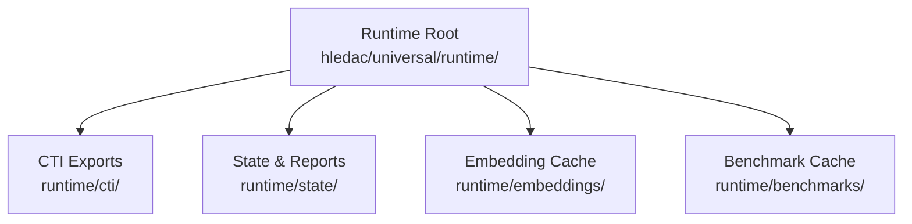
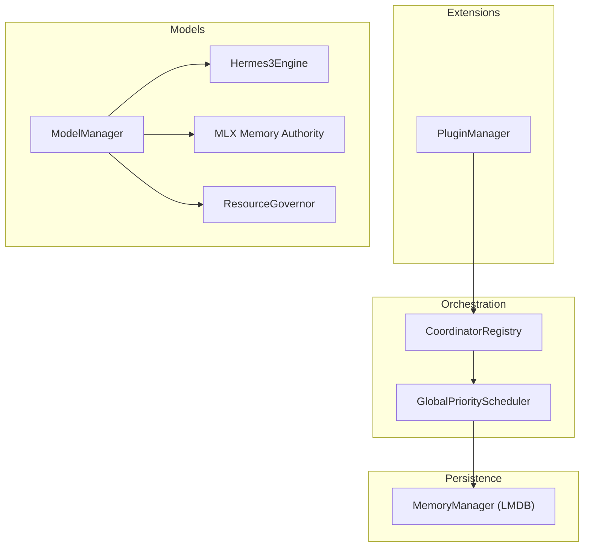
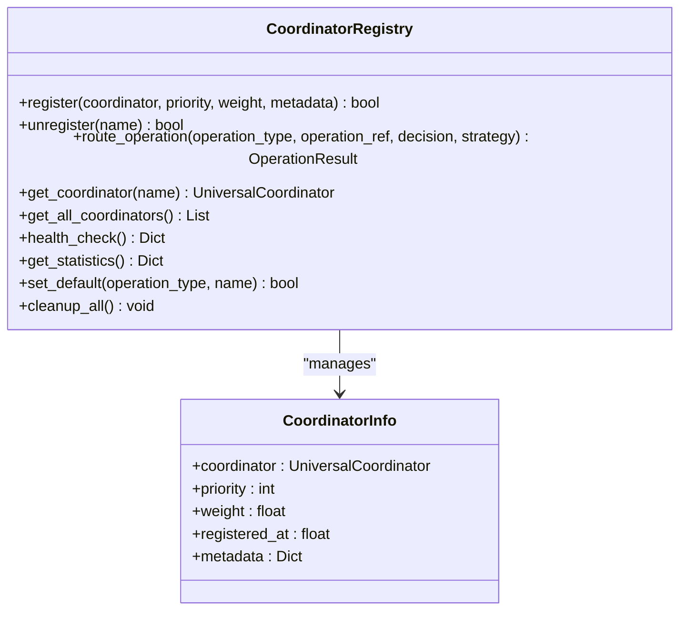
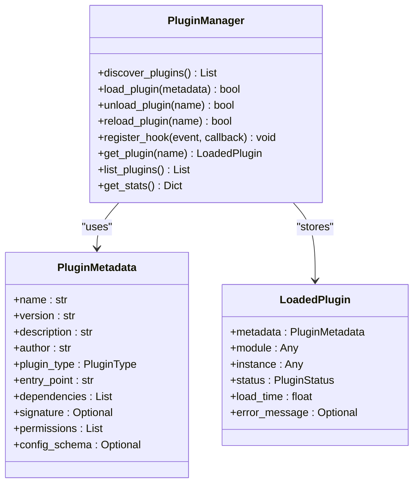
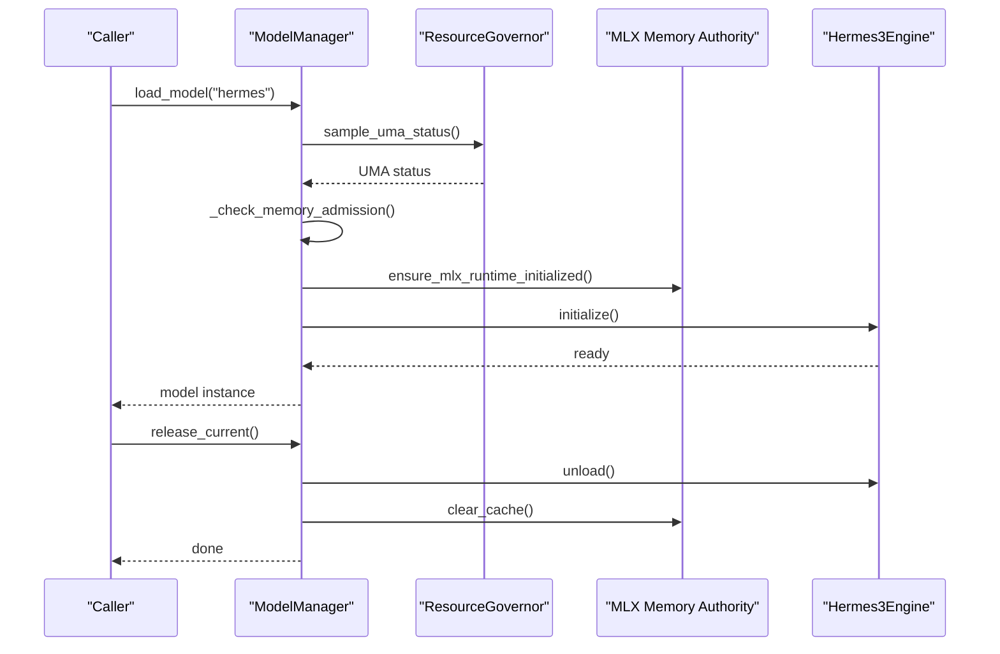
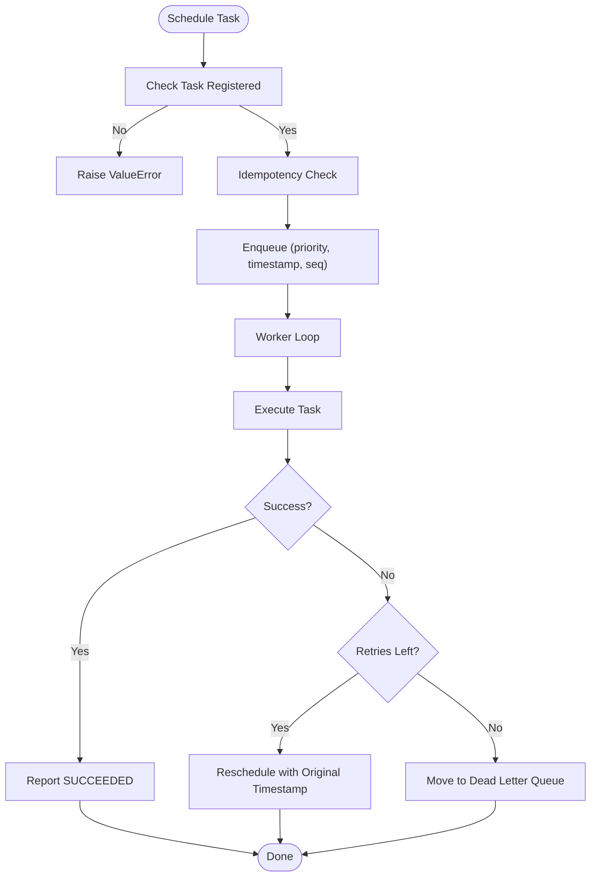
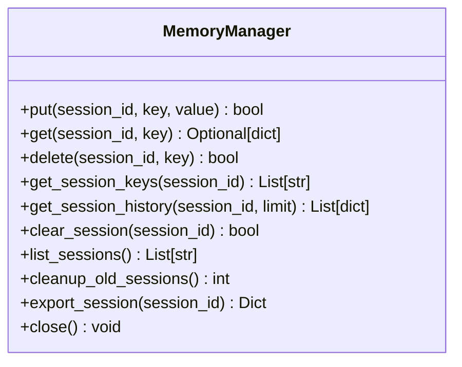
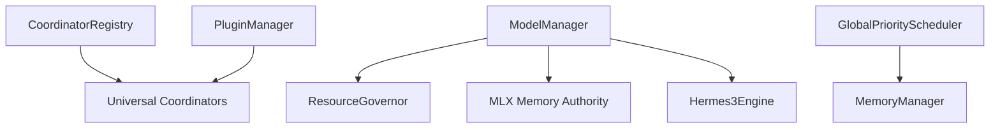

# Advanced Topics

<cite>
**Referenced Files in This Document**
- [README.md](file://hledac/universal/README.md)
- [coordinator_registry.py](file://coordinators/coordinator_registry.py)
- [plugin_manager.py](file://infrastructure/plugin_manager.py)
- [model_manager.py](file://brain/model_manager.py)
- [global_scheduler.py](file://orchestrator/global_scheduler.py)
- [memory_manager.py](file://memory/memory_manager.py)
- [hermes3_engine.py](file://brain/hermes3_engine.py)
- [mlx_memory.py](file://utils/mlx_memory.py)
- [resource_governor.py](file://core/resource_governor.py)
</cite>

## Table of Contents
1. [Introduction](#introduction)
2. [Project Structure](#project-structure)
3. [Core Components](#core-components)
4. [Architecture Overview](#architecture-overview)
5. [Detailed Component Analysis](#detailed-component-analysis)
6. [Dependency Analysis](#dependency-analysis)
7. [Performance Considerations](#performance-considerations)
8. [Troubleshooting Guide](#troubleshooting-guide)
9. [Conclusion](#conclusion)
10. [Appendices](#appendices)

## Introduction
This document provides expert-level coverage of advanced Hledac Universal topics, focusing on memory optimization, performance tuning, custom extension development, and system customization. It explains the plugin system architecture, coordinator registry mechanisms, and model orchestration patterns. It also documents advanced configuration options, custom algorithm integration, expert usage patterns, troubleshooting complex issues, and optimization techniques. Scaling considerations, distributed deployment patterns, and enterprise integration scenarios are addressed to guide production-grade deployments.

## Project Structure
Hledac Universal organizes advanced runtime data under a dedicated runtime directory with clear path constants and environment overrides. The universal runtime area centralizes CTI exports, state, embeddings, and benchmarks, enabling self-contained operation and easy cleanup.

**Diagram sources**
- [README.md:10-17](file://hledac/universal/README.md#L10-L17)

**Section sources**
- [README.md:1-48](file://hledac/universal/README.md#L1-L48)

## Core Components
This section highlights the advanced components that enable memory optimization, performance tuning, and extensibility.

- Coordinator Registry: Centralized routing and load balancing for Universal Coordinators with priority, weighted, and auto-selection strategies.
- Plugin Manager: Dynamic plugin loading with metadata, lifecycle hooks, hot-reload, and security validation.
- Model Manager: Strict single-model-at-a-time orchestration with memory admission gates, quantization advisory, and MLX/CoreML integration.
- Global Priority Scheduler: ProcessPoolExecutor-based scheduler with CPU affinity, bounded registries, and work-stealing.
- Memory Manager: LMDB-backed persistent memory with session isolation, bounded storage, and zero-copy reads.

**Section sources**
- [coordinator_registry.py:49-602](file://coordinators/coordinator_registry.py#L49-L602)
- [plugin_manager.py:91-462](file://infrastructure/plugin_manager.py#L91-L462)
- [model_manager.py:178-800](file://brain/model_manager.py#L178-L800)
- [global_scheduler.py:83-569](file://orchestrator/global_scheduler.py#L83-L569)
- [memory_manager.py:84-530](file://memory/memory_manager.py#L84-L530)

## Architecture Overview
The advanced architecture integrates coordinator orchestration, plugin extensibility, model lifecycle management, scheduling, and persistent memory. The coordinator registry routes operations to specialized coordinators, while the plugin manager enables dynamic extensions. The model manager enforces strict memory discipline and quantization policies. The global scheduler provides deterministic priority execution with bounded resources. The memory manager persists session-scoped data with LMDB.

**Diagram sources**
- [coordinator_registry.py:49-602](file://coordinators/coordinator_registry.py#L49-L602)
- [plugin_manager.py:91-462](file://infrastructure/plugin_manager.py#L91-L462)
- [model_manager.py:178-800](file://brain/model_manager.py#L178-L800)
- [global_scheduler.py:83-569](file://orchestrator/global_scheduler.py#L83-L569)
- [memory_manager.py:84-530](file://memory/memory_manager.py#L84-L530)
- [hermes3_engine.py](file://brain/hermes3_engine.py)
- [mlx_memory.py](file://utils/mlx_memory.py)
- [resource_governor.py](file://core/resource_governor.py)

## Detailed Component Analysis

### Coordinator Registry
The Coordinator Registry manages Universal Coordinators with registration, capability indexing, routing strategies, health monitoring, and statistics. It supports priority-based selection, least-loaded selection, weighted selection, and auto-selection. Defaults can be configured per operation type.

Key behaviors:
- Registration with priority and weight
- Capability-based routing
- Health checks and load distribution
- Statistics and operational insights

**Diagram sources**
- [coordinator_registry.py:49-602](file://coordinators/coordinator_registry.py#L49-L602)

**Section sources**
- [coordinator_registry.py:79-167](file://coordinators/coordinator_registry.py#L79-L167)
- [coordinator_registry.py:172-307](file://coordinators/coordinator_registry.py#L172-L307)
- [coordinator_registry.py:370-424](file://coordinators/coordinator_registry.py#L370-L424)
- [coordinator_registry.py:494-602](file://coordinators/coordinator_registry.py#L494-L602)

### Plugin System Architecture
The Plugin Manager provides dynamic loading of external Python scripts with metadata discovery, dependency resolution, lifecycle hooks, and hot-reload. It supports directory-based and single-file plugins and integrates with security validation and permission models.

Key behaviors:
- Plugin discovery and metadata parsing
- Secure loading with signature validation
- Lifecycle hooks (on_load, on_unload)
- Hot-reload and statistics

**Diagram sources**
- [plugin_manager.py:91-462](file://infrastructure/plugin_manager.py#L91-L462)

**Section sources**
- [plugin_manager.py:120-153](file://infrastructure/plugin_manager.py#L120-L153)
- [plugin_manager.py:209-278](file://infrastructure/plugin_manager.py#L209-L278)
- [plugin_manager.py:334-417](file://infrastructure/plugin_manager.py#L334-L417)
- [plugin_manager.py:418-436](file://infrastructure/plugin_manager.py#L418-L436)

### Model Orchestration Patterns
The Model Manager enforces a strict one-model-at-a-time policy, integrates quantization advisory, and coordinates memory admission gates. It supports CoreML/ANE fallbacks, MLX initialization, and memory verification after unload.

Key behaviors:
- Memory admission checks and soft-pressure guards
- Quantization advisory and governor integration
- CoreML conversion and fallback
- Acquire/release contexts with guaranteed cleanup

**Diagram sources**
- [model_manager.py:547-800](file://brain/model_manager.py#L547-L800)
- [hermes3_engine.py](file://brain/hermes3_engine.py)
- [mlx_memory.py](file://utils/mlx_memory.py)
- [resource_governor.py](file://core/resource_governor.py)

**Section sources**
- [model_manager.py:46-107](file://brain/model_manager.py#L46-L107)
- [model_manager.py:365-426](file://brain/model_manager.py#L365-L426)
- [model_manager.py:608-712](file://brain/model_manager.py#L608-L712)
- [model_manager.py:713-800](file://brain/model_manager.py#L713-L800)

### Global Priority Scheduler
The Global Priority Scheduler uses a ProcessPoolExecutor with a priority queue, bounded registries, CPU affinity, and work-stealing. It provides idempotent scheduling, timeouts, retries, and a dead-letter queue for failed jobs.

Key behaviors:
- Priority-based scheduling with total ordering
- CPU affinity to performance cores
- Bounded registries and eviction
- Idempotency and retry semantics
- Timeout checker and DLQ

**Diagram sources**
- [global_scheduler.py:384-449](file://orchestrator/global_scheduler.py#L384-L449)
- [global_scheduler.py:266-275](file://orchestrator/global_scheduler.py#L266-L275)
- [global_scheduler.py:471-475](file://orchestrator/global_scheduler.py#L471-L475)

**Section sources**
- [global_scheduler.py:83-125](file://orchestrator/global_scheduler.py#L83-L125)
- [global_scheduler.py:384-449](file://orchestrator/global_scheduler.py#L384-L449)
- [global_scheduler.py:471-530](file://orchestrator/global_scheduler.py#L471-L530)

### Memory Management with LMDB
The Memory Manager provides session-scoped persistence with LMDB, zero-copy reads, bounded storage, and automatic cleanup. It serializes with orjson/json and maintains session metadata with TTL.

Key behaviors:
- Session-based isolation and key scoping
- Bounded key count and session limits
- TTL-based cleanup and session listing
- Export of session findings and hypotheses

**Diagram sources**
- [memory_manager.py:84-530](file://memory/memory_manager.py#L84-L530)

**Section sources**
- [memory_manager.py:148-188](file://memory/memory_manager.py#L148-L188)
- [memory_manager.py:189-224](file://memory/memory_manager.py#L189-L224)
- [memory_manager.py:373-409](file://memory/memory_manager.py#L373-L409)
- [memory_manager.py:482-518](file://memory/memory_manager.py#L482-L518)

## Dependency Analysis
The advanced components interact as follows:
- Coordinator Registry depends on Universal Coordinators and exposes routing and health APIs.
- Plugin Manager integrates with the kernel and supports signed modules and lifecycle hooks.
- Model Manager depends on ResourceGovernor, MLX memory authority, and engine implementations.
- Global Scheduler coordinates tasks and interacts with Memory Manager for persistence.
- Memory Manager encapsulates LMDB operations and provides session isolation.

**Diagram sources**
- [coordinator_registry.py:49-602](file://coordinators/coordinator_registry.py#L49-L602)
- [plugin_manager.py:91-462](file://infrastructure/plugin_manager.py#L91-L462)
- [model_manager.py:178-800](file://brain/model_manager.py#L178-L800)
- [global_scheduler.py:83-569](file://orchestrator/global_scheduler.py#L83-L569)
- [memory_manager.py:84-530](file://memory/memory_manager.py#L84-L530)
- [hermes3_engine.py](file://brain/hermes3_engine.py)
- [mlx_memory.py](file://utils/mlx_memory.py)
- [resource_governor.py](file://core/resource_governor.py)

**Section sources**
- [coordinator_registry.py:494-602](file://coordinators/coordinator_registry.py#L494-L602)
- [plugin_manager.py:209-278](file://infrastructure/plugin_manager.py#L209-L278)
- [model_manager.py:608-712](file://brain/model_manager.py#L608-L712)
- [global_scheduler.py:384-449](file://orchestrator/global_scheduler.py#L384-L449)
- [memory_manager.py:148-188](file://memory/memory_manager.py#L148-L188)

## Performance Considerations
- Memory optimization
  - Strict single-model-at-a-time policy to prevent OOM on constrained devices.
  - Memory admission gates and soft-pressure guards using RSS thresholds.
  - Quantization advisory and governor integration for inference budgeting.
  - CoreML/ANE fallbacks for embedding acceleration.

- Scheduling and throughput
  - Priority-based scheduling with bounded registries and eviction.
  - CPU affinity to performance cores for deterministic performance.
  - Work-stealing with affinity-aware worker assignment.
  - Idempotency and retry semantics to handle transient failures.

- Persistence and I/O
  - LMDB-backed zero-copy reads and bounded storage.
  - Session TTL and automatic cleanup to control growth.
  - Efficient JSON serialization with orjson fallback.

- Profiling and diagnostics
  - Registry statistics and load distribution for coordinator health.
  - Scheduler job stats and DLQ for failure analysis.
  - Memory manager export for session-level introspection.

[No sources needed since this section provides general guidance]

## Troubleshooting Guide
Common issues and resolutions:
- Model load failures
  - Check memory admission state and governor status before loading.
  - Verify MLX runtime initialization and cache clearing after unload.
  - Confirm quantization advisory results and selected quantization.

- Coordinator routing errors
  - Inspect routing decisions and failed routings statistics.
  - Validate coordinator availability and supported operations.
  - Review health checks and load factors.

- Plugin loading problems
  - Verify metadata discovery and entry points.
  - Check signature validation and dependency resolution.
  - Use hot-reload to recover from transient errors.

- Scheduler timeouts and dead letters
  - Adjust job timeouts and retry counts.
  - Monitor DLQ and job stats for recurring failures.
  - Investigate worker affinity and workload distribution.

**Section sources**
- [model_manager.py:365-426](file://brain/model_manager.py#L365-L426)
- [coordinator_registry.py:370-424](file://coordinators/coordinator_registry.py#L370-L424)
- [plugin_manager.py:209-278](file://infrastructure/plugin_manager.py#L209-L278)
- [global_scheduler.py:471-530](file://orchestrator/global_scheduler.py#L471-L530)

## Conclusion
Hledac Universal’s advanced architecture combines robust coordinator orchestration, dynamic plugin extensibility, disciplined model lifecycle management, efficient scheduling, and persistent memory to deliver high-performance, scalable, and maintainable systems. Expert users can leverage memory guards, quantization advisory, and scheduler tuning to optimize performance, while the plugin and coordinator systems enable flexible customization and enterprise integration.

[No sources needed since this section summarizes without analyzing specific files]

## Appendices

### Advanced Configuration Options
- Runtime data locations and environment overrides for CTI exports and benchmark caching.
- Model memory limits and quantization policies for constrained environments.
- Scheduler defaults for worker count, timeouts, and retry behavior.
- Memory manager bounds for sessions, keys, and TTL.

**Section sources**
- [README.md:28-48](file://hledac/universal/README.md#L28-L48)
- [model_manager.py:46-50](file://brain/model_manager.py#L46-L50)
- [global_scheduler.py:93-125](file://orchestrator/global_scheduler.py#L93-L125)
- [memory_manager.py:92-125](file://memory/memory_manager.py#L92-L125)

### Custom Extension Development
- Implement plugins with metadata and lifecycle hooks.
- Integrate with the Plugin Manager for discovery and hot-reload.
- Extend Universal Coordinators and register them via the Coordinator Registry.

**Section sources**
- [plugin_manager.py:120-153](file://infrastructure/plugin_manager.py#L120-L153)
- [plugin_manager.py:209-278](file://infrastructure/plugin_manager.py#L209-L278)
- [coordinator_registry.py:494-602](file://coordinators/coordinator_registry.py#L494-L602)

### System Scaling and Enterprise Integration
- Use the Coordinator Registry to distribute operations across specialized coordinators.
- Apply the Global Priority Scheduler for deterministic throughput and CPU-bound workloads.
- Persist session data with the Memory Manager for auditability and recovery.
- Integrate with enterprise systems via plugin-based adapters and CTI export capabilities.

[No sources needed since this section provides general guidance]