# Custom Integrations and Extensions

<cite>
**Referenced Files in This Document**
- [autonomous_orchestrator.py](file://hledac/universal/autonomous_orchestrator.py)
- [enhanced_research.py](file://hledac/universal/enhanced_research.py)
- [workflow_orchestrator.py](file://hledac/universal/intelligence/workflow_orchestrator.py)
- [export_manager.py](file://hledac/universal/export/export_manager.py)
- [plugin_manager.py](file://hledac/universal/infrastructure/plugin_manager.py)
- [base.py](file://hledac/universal/coordinators/base.py)
- [sprint_scheduler.py](file://hledac/universal/runtime/sprint_scheduler.py)
- [httpx_transport.py](file://hledac/universal/transport/httpx_transport.py)
- [js_bundle_extractor.py](file://hledac/universal/network/js_bundle_extractor.py)
- [deep_web_hints.py](file://hledac/universal/tools/deep_web_hints.py)
- [smart_coordination.py](file://hledac/universal/layers/smart_coordination.py)
- [actions.py](file://hledac/universal/rl/actions.py)
- [workflow_engine.py](file://hledac/universal/utils/workflow_engine.py)
- [shadow_inputs.py](file://hledac/universal/runtime/shadow_inputs.py)
</cite>

## Table of Contents
1. [Introduction](#introduction)
2. [Project Structure](#project-structure)
3. [Core Components](#core-components)
4. [Architecture Overview](#architecture-overview)
5. [Detailed Component Analysis](#detailed-component-analysis)
6. [Dependency Analysis](#dependency-analysis)
7. [Performance Considerations](#performance-considerations)
8. [Troubleshooting Guide](#troubleshooting-guide)
9. [Conclusion](#conclusion)
10. [Appendices](#appendices)

## Introduction
This document explains how to extend and customize Hledac Universal with custom integrations and extensions. It focuses on:
- Extending the core orchestrator and research workflows
- Building custom research pipelines and modifying execution plans
- Extending the export system with new formats
- Integrating external services and APIs
- Using the plugin system for dynamic extensions
- Patterns for API customization and transport selection
- Integration testing, deployment, and maintenance strategies

The guidance is grounded in the repository’s orchestrators, exporters, plugin manager, and runtime scheduler.

## Project Structure
Hledac Universal organizes extension points across several layers:
- Orchestration and research: orchestrator integration, enhanced research orchestrator, workflow orchestrator
- Export system: export manager with Markdown and graph export
- Infrastructure: plugin manager for dynamic extensions
- Runtime: sprint scheduler coordinating lifecycle and acquisition lanes
- Transport and discovery: HTTP/2-aware transport selection, JS bundle extraction, deep web hints
- Coordination: coordinator base with lifecycle and capacity management
- Workflow engine: task-based workflow execution

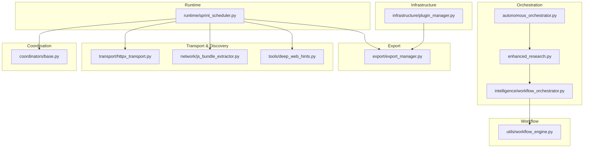

**Diagram sources**
- [autonomous_orchestrator.py:1-272](file://hledac/universal/autonomous_orchestrator.py#L1-L272)
- [enhanced_research.py:1325-1939](file://hledac/universal/enhanced_research.py#L1325-L1939)
- [workflow_orchestrator.py:335-642](file://hledac/universal/intelligence/workflow_orchestrator.py#L335-L642)
- [export_manager.py:49-299](file://hledac/universal/export/export_manager.py#L49-L299)
- [plugin_manager.py:91-461](file://hledac/universal/infrastructure/plugin_manager.py#L91-L461)
- [sprint_scheduler.py:1-800](file://hledac/universal/runtime/sprint_scheduler.py#L1-L800)
- [httpx_transport.py:188-257](file://hledac/universal/transport/httpx_transport.py#L188-L257)
- [js_bundle_extractor.py:1-70](file://hledac/universal/network/js_bundle_extractor.py#L1-L70)
- [deep_web_hints.py:251-278](file://hledac/universal/tools/deep_web_hints.py#L251-L278)
- [base.py:88-553](file://hledac/universal/coordinators/base.py#L88-L553)
- [workflow_engine.py:53-93](file://hledac/universal/utils/workflow_engine.py#L53-L93)

**Section sources**
- [autonomous_orchestrator.py:1-272](file://hledac/universal/autonomous_orchestrator.py#L1-L272)
- [export_manager.py:1-300](file://hledac/universal/export/export_manager.py#L1-L300)
- [plugin_manager.py:1-462](file://hledac/universal/infrastructure/plugin_manager.py#L1-L462)
- [sprint_scheduler.py:1-800](file://hledac/universal/runtime/sprint_scheduler.py#L1-L800)
- [workflow_orchestrator.py:1-800](file://hledac/universal/intelligence/workflow_orchestrator.py#L1-L800)
- [base.py:1-553](file://hledac/universal/coordinators/base.py#L1-L553)
- [workflow_engine.py:53-93](file://hledac/universal/utils/workflow_engine.py#L53-L93)

## Core Components
- Orchestrator integration: legacy facade and production orchestrator paths
- Enhanced research orchestrator: workflow engine, speculative execution, and hybrid RAG
- Workflow orchestrator: multi-module analysis with correlation, anomaly detection, and reporting
- Export manager: Markdown and interactive HTML graph export with sensitive data filtering
- Plugin manager: dynamic plugin loading, lifecycle, and hot-reload
- Runtime scheduler: tier-aware acquisition, lifecycle phases, and export
- Transport and discovery: HTTP/2-aware routing, JS endpoint extraction, and deep web hints
- Coordinator base: operation lifecycle, load factor, memory pressure, and metrics
- Workflow engine: task execution with conditions, retries, and dependencies

**Section sources**
- [autonomous_orchestrator.py:1-272](file://hledac/universal/autonomous_orchestrator.py#L1-L272)
- [enhanced_research.py:1325-1939](file://hledac/universal/enhanced_research.py#L1325-L1939)
- [workflow_orchestrator.py:335-642](file://hledac/universal/intelligence/workflow_orchestrator.py#L335-L642)
- [export_manager.py:49-299](file://hledac/universal/export/export_manager.py#L49-L299)
- [plugin_manager.py:91-461](file://hledac/universal/infrastructure/plugin_manager.py#L91-L461)
- [sprint_scheduler.py:623-800](file://hledac/universal/runtime/sprint_scheduler.py#L623-L800)
- [httpx_transport.py:188-257](file://hledac/universal/transport/httpx_transport.py#L188-L257)
- [js_bundle_extractor.py:1-70](file://hledac/universal/network/js_bundle_extractor.py#L1-L70)
- [deep_web_hints.py:251-278](file://hledac/universal/tools/deep_web_hints.py#L251-L278)
- [base.py:88-553](file://hledac/universal/coordinators/base.py#L88-L553)
- [workflow_engine.py:53-93](file://hledac/universal/utils/workflow_engine.py#L53-L93)

## Architecture Overview
The system integrates a production runtime scheduler with orchestrators and exporters. Extensions can plug in via:
- Custom research workflows through the workflow orchestrator
- Plugins via the plugin manager
- Export format extensions through the export manager
- Transport selection and discovery enhancements

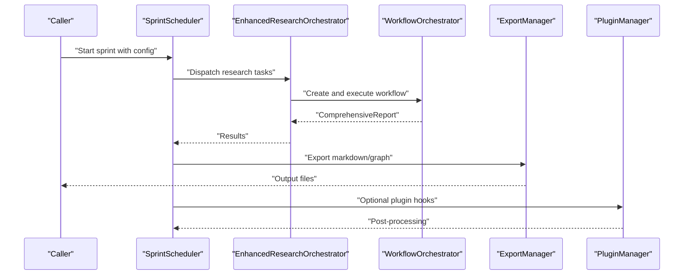

**Diagram sources**
- [sprint_scheduler.py:623-800](file://hledac/universal/runtime/sprint_scheduler.py#L623-L800)
- [enhanced_research.py:1761-1939](file://hledac/universal/enhanced_research.py#L1761-L1939)
- [workflow_orchestrator.py:385-465](file://hledac/universal/intelligence/workflow_orchestrator.py#L385-L465)
- [export_manager.py:90-200](file://hledac/universal/export/export_manager.py#L90-L200)
- [plugin_manager.py:209-277](file://hledac/universal/infrastructure/plugin_manager.py#L209-L277)

## Detailed Component Analysis

### Orchestrator Integration and Research Workflows
- The legacy facade re-exports the production orchestrator and warns against using it as a canonical path. Use the production scheduler and orchestrator directly.
- The enhanced research orchestrator extends the universal orchestrator with:
  - DAG-based workflow execution
  - Speculative execution
  - Performance monitoring
  - Quality validation
  - Query expansion, result fusion, hybrid RAG
  - Stealth behavior simulation

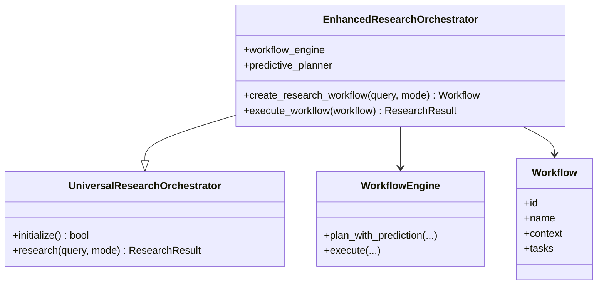

**Diagram sources**
- [enhanced_research.py:1325-1939](file://hledac/universal/enhanced_research.py#L1325-L1939)

**Section sources**
- [autonomous_orchestrator.py:1-272](file://hledac/universal/autonomous_orchestrator.py#L1-L272)
- [enhanced_research.py:1325-1939](file://hledac/universal/enhanced_research.py#L1325-L1939)

### Workflow Orchestrator and Multi-Module Analysis
- Executes modules in sequential or parallel groups with timeouts
- Correlates results across modules, detects anomalies, and builds a comprehensive report
- Supports registration of custom modules and shared context passing

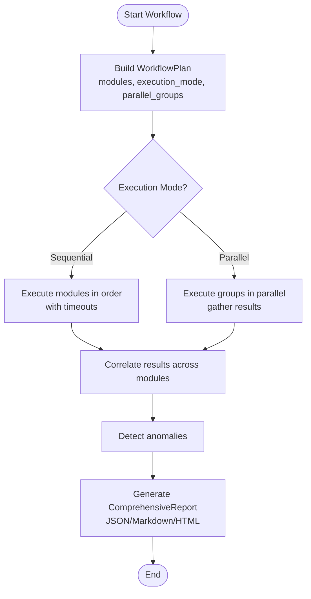

**Diagram sources**
- [workflow_orchestrator.py:385-642](file://hledac/universal/intelligence/workflow_orchestrator.py#L385-L642)

**Section sources**
- [workflow_orchestrator.py:335-642](file://hledac/universal/intelligence/workflow_orchestrator.py#L335-L642)

### Export System and Custom Formats
- ExportManager writes Obsidian-compatible Markdown and interactive HTML graphs
- Filters sensitive metadata and enforces output directory security
- Extend by adding new export methods and formats while preserving sensitive data safeguards

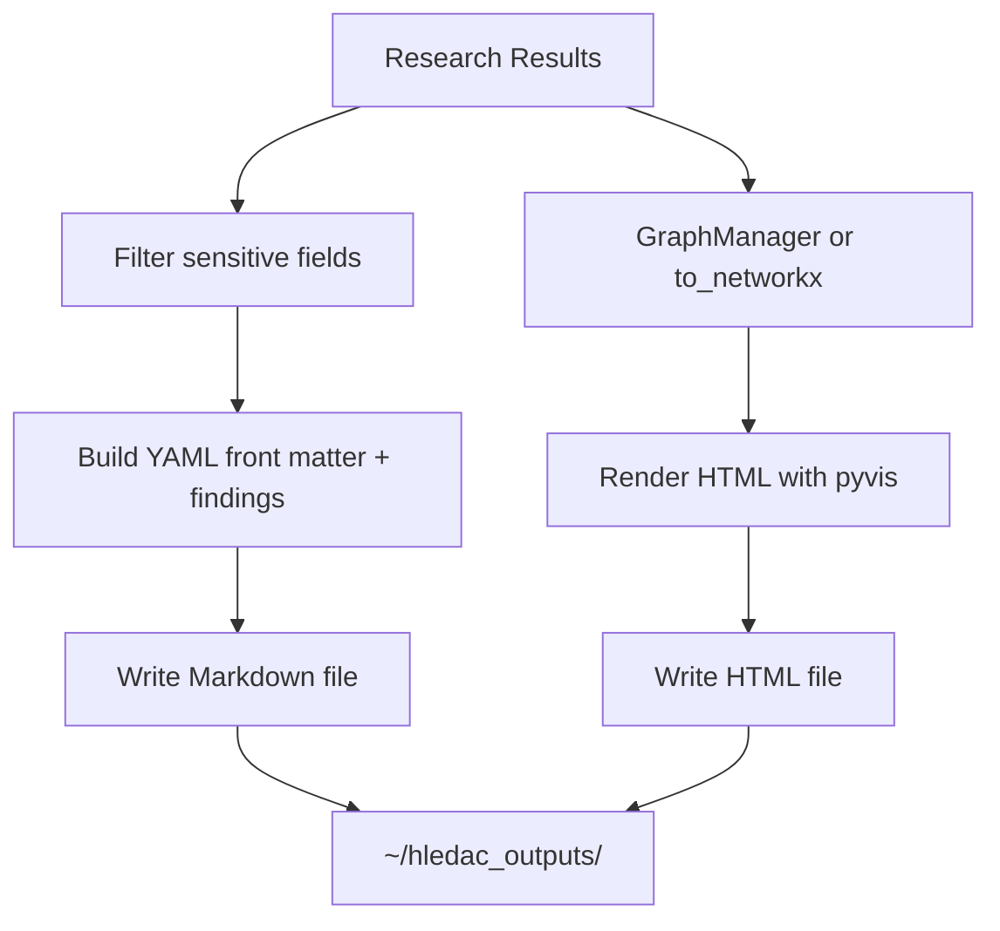

**Diagram sources**
- [export_manager.py:90-287](file://hledac/universal/export/export_manager.py#L90-L287)

**Section sources**
- [export_manager.py:49-299](file://hledac/universal/export/export_manager.py#L49-L299)

### Plugin System for Dynamic Extensions
- PluginManager discovers plugins from directories or single files
- Loads modules dynamically, validates signatures, instantiates plugins, and triggers lifecycle hooks
- Supports hot-reload and statistics

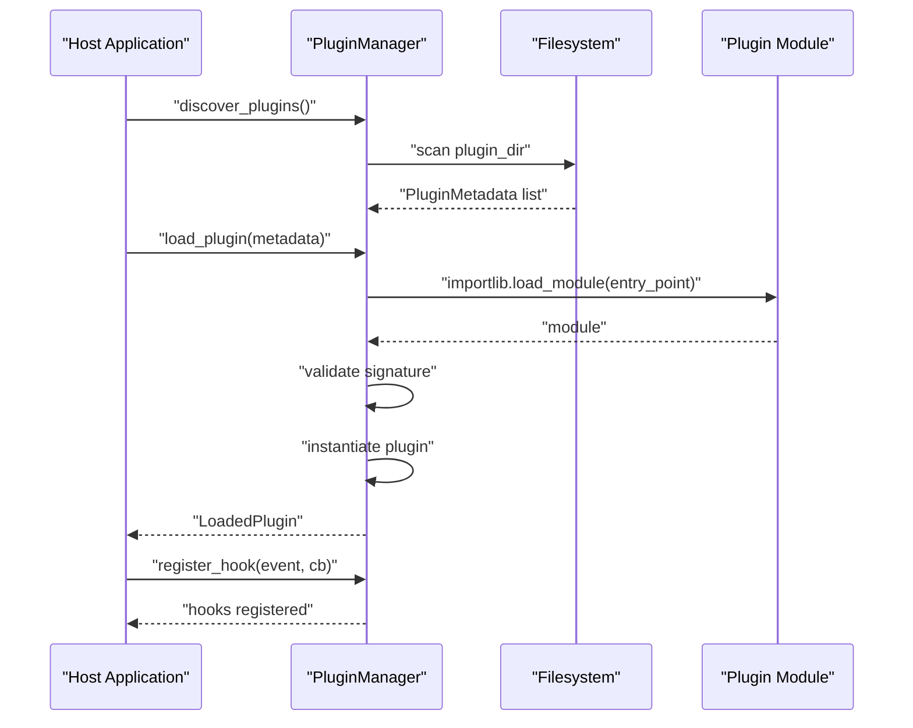

**Diagram sources**
- [plugin_manager.py:120-277](file://hledac/universal/infrastructure/plugin_manager.py#L120-L277)

**Section sources**
- [plugin_manager.py:91-461](file://hledac/universal/infrastructure/plugin_manager.py#L91-L461)

### Runtime Scheduler and Acquisition Integration
- Tier-aware acquisition lanes, lifecycle phases, and export
- Bridges lifecycle adapters and integrates acquisition strategies
- Supports aggressive mode and branch timeouts

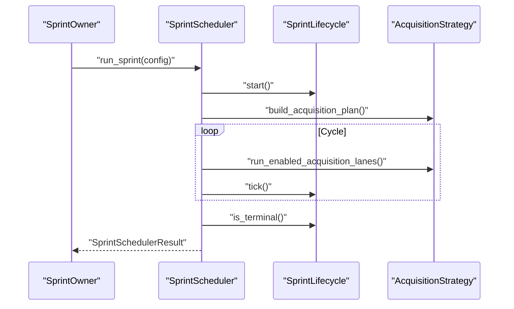

**Diagram sources**
- [sprint_scheduler.py:623-800](file://hledac/universal/runtime/sprint_scheduler.py#L623-L800)

**Section sources**
- [sprint_scheduler.py:1-800](file://hledac/universal/runtime/sprint_scheduler.py#L1-L800)

### Transport Selection and Discovery Enhancements
- HTTP/2-aware URL detection for API-like endpoints
- JS bundle extraction for API endpoints
- Deep web hints for API candidates

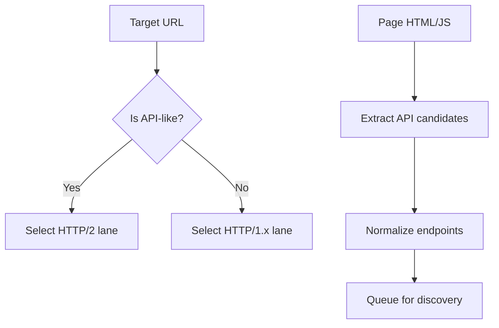

**Diagram sources**
- [httpx_transport.py:188-257](file://hledac/universal/transport/httpx_transport.py#L188-L257)
- [js_bundle_extractor.py:21-50](file://hledac/universal/network/js_bundle_extractor.py#L21-L50)
- [deep_web_hints.py:258-278](file://hledac/universal/tools/deep_web_hints.py#L258-L278)

**Section sources**
- [httpx_transport.py:188-257](file://hledac/universal/transport/httpx_transport.py#L188-L257)
- [js_bundle_extractor.py:1-70](file://hledac/universal/network/js_bundle_extractor.py#L1-L70)
- [deep_web_hints.py:251-278](file://hledac/universal/tools/deep_web_hints.py#L251-L278)

### Coordinator Base and Capacity Management
- Operation lifecycle, load factor computation, memory pressure awareness, and metrics
- Provides a stable interface for orchestrator spine pattern

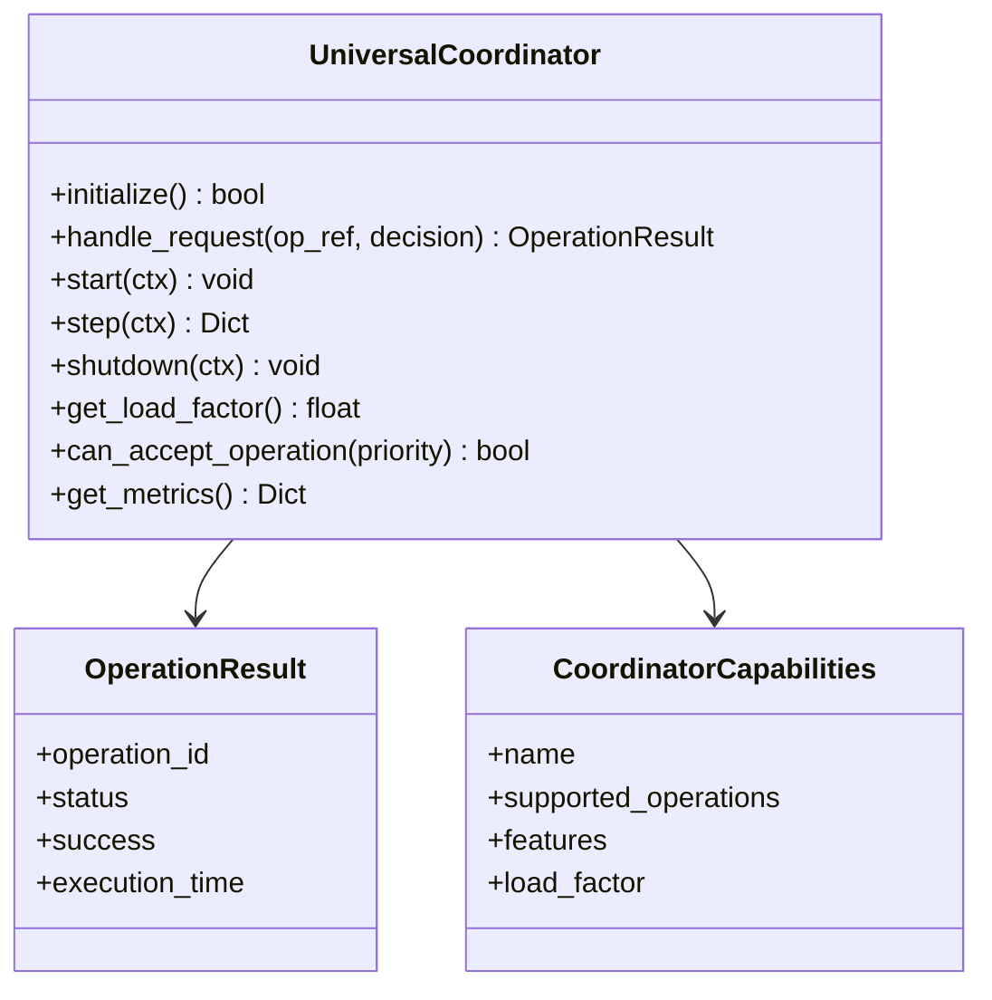

**Diagram sources**
- [base.py:88-553](file://hledac/universal/coordinators/base.py#L88-L553)

**Section sources**
- [base.py:88-553](file://hledac/universal/coordinators/base.py#L88-L553)

### Workflow Engine for Task-Based Pipelines
- Tasks with conditions, retries, dependencies, and async execution
- Suitable for building custom research steps and validations

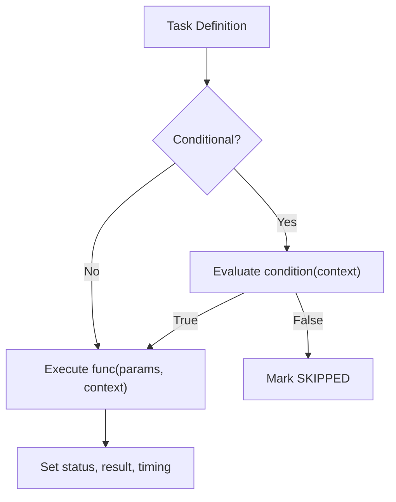

**Diagram sources**
- [workflow_engine.py:53-93](file://hledac/universal/utils/workflow_engine.py#L53-L93)

**Section sources**
- [workflow_engine.py:53-93](file://hledac/universal/utils/workflow_engine.py#L53-L93)

### Smart Coordination Integration Patterns
- Smart spawn and distribution of agents
- Complexity-based resource allocation and performance targets
- Integration strategy recommendations

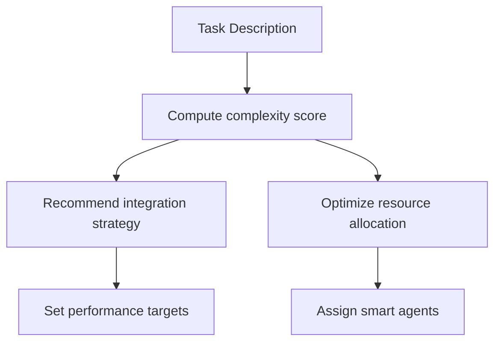

**Diagram sources**
- [smart_coordination.py:193-416](file://hledac/universal/layers/smart_coordination.py#L193-L416)

**Section sources**
- [smart_coordination.py:193-416](file://hledac/universal/layers/smart_coordination.py#L193-L416)

## Dependency Analysis
- The orchestrator integration facade re-exports the legacy implementation and warns against using it as canonical. Prefer the production scheduler and orchestrator.
- The enhanced research orchestrator depends on workflow engine and predictive planning.
- The workflow orchestrator depends on module registries and shared context.
- The export manager depends on safe rendering utilities and optional graph libraries.
- The plugin manager depends on importlib and filesystem scanning.
- The runtime scheduler coordinates lifecycle, acquisition, and export.
- Transport selection depends on URL heuristics; discovery depends on JS parsing and deep web hints.

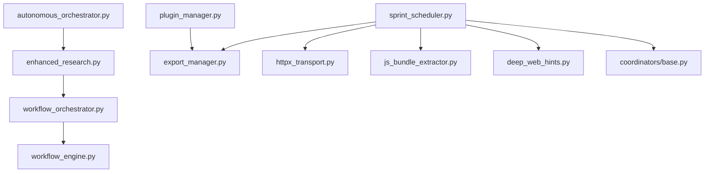

**Diagram sources**
- [autonomous_orchestrator.py:1-272](file://hledac/universal/autonomous_orchestrator.py#L1-L272)
- [enhanced_research.py:1325-1939](file://hledac/universal/enhanced_research.py#L1325-L1939)
- [workflow_orchestrator.py:335-642](file://hledac/universal/intelligence/workflow_orchestrator.py#L335-L642)
- [workflow_engine.py:53-93](file://hledac/universal/utils/workflow_engine.py#L53-L93)
- [sprint_scheduler.py:623-800](file://hledac/universal/runtime/sprint_scheduler.py#L623-L800)
- [export_manager.py:49-299](file://hledac/universal/export/export_manager.py#L49-L299)
- [plugin_manager.py:91-461](file://hledac/universal/infrastructure/plugin_manager.py#L91-L461)
- [httpx_transport.py:188-257](file://hledac/universal/transport/httpx_transport.py#L188-L257)
- [js_bundle_extractor.py:1-70](file://hledac/universal/network/js_bundle_extractor.py#L1-L70)
- [deep_web_hints.py:251-278](file://hledac/universal/tools/deep_web_hints.py#L251-L278)
- [base.py:88-553](file://hledac/universal/coordinators/base.py#L88-L553)

**Section sources**
- [autonomous_orchestrator.py:1-272](file://hledac/universal/autonomous_orchestrator.py#L1-L272)
- [enhanced_research.py:1325-1939](file://hledac/universal/enhanced_research.py#L1325-L1939)
- [workflow_orchestrator.py:335-642](file://hledac/universal/intelligence/workflow_orchestrator.py#L335-L642)
- [workflow_engine.py:53-93](file://hledac/universal/utils/workflow_engine.py#L53-L93)
- [sprint_scheduler.py:623-800](file://hledac/universal/runtime/sprint_scheduler.py#L623-L800)
- [export_manager.py:49-299](file://hledac/universal/export/export_manager.py#L49-L299)
- [plugin_manager.py:91-461](file://hledac/universal/infrastructure/plugin_manager.py#L91-L461)
- [httpx_transport.py:188-257](file://hledac/universal/transport/httpx_transport.py#L188-L257)
- [js_bundle_extractor.py:1-70](file://hledac/universal/network/js_bundle_extractor.py#L1-L70)
- [deep_web_hints.py:251-278](file://hledac/universal/tools/deep_web_hints.py#L251-L278)
- [base.py:88-553](file://hledac/universal/coordinators/base.py#L88-L553)

## Performance Considerations
- Use HTTP/2 lanes for API-like endpoints to leverage multiplexing and reduce latency.
- Apply workflow orchestrator timeouts and parallel groups to balance throughput and stability.
- Monitor coordinator load factor and memory pressure to avoid overload.
- Use the plugin manager’s hot-reload for iterative development without restarts.
- Leverage the runtime scheduler’s aggressive mode and branch timeouts for constrained sprints.

[No sources needed since this section provides general guidance]

## Troubleshooting Guide
Common issues and resolutions:
- Plugin loading errors: Verify entry points, dependencies, and signatures; check plugin stats and error messages.
- Export path escaping: Ensure output paths resolve within the designated output directory.
- Workflow timeouts: Adjust module timeouts and execution mode; review module status and timeline events.
- Transport misclassification: Confirm URL patterns and host suffixes for API-like detection.
- Coordinator overload: Reduce max concurrent operations or adjust memory pressure thresholds.

**Section sources**
- [plugin_manager.py:209-277](file://hledac/universal/infrastructure/plugin_manager.py#L209-L277)
- [export_manager.py:71-88](file://hledac/universal/export/export_manager.py#L71-L88)
- [workflow_orchestrator.py:385-465](file://hledac/universal/intelligence/workflow_orchestrator.py#L385-L465)
- [httpx_transport.py:216-257](file://hledac/universal/transport/httpx_transport.py#L216-L257)
- [base.py:308-377](file://hledac/universal/coordinators/base.py#L308-L377)

## Conclusion
Hledac Universal offers robust extension points:
- Extend research workflows with the enhanced orchestrator and workflow orchestrator
- Add custom modules and pipelines via the workflow engine
- Integrate external services through the plugin manager and transport selection
- Customize exports with the export manager and new format writers
- Coordinate capacity and lifecycle with the coordinator base and runtime scheduler

Follow the integration patterns and testing strategies outlined to maintain reliability and performance.

[No sources needed since this section summarizes without analyzing specific files]

## Appendices

### Step-by-Step: Creating a Custom Research Pipeline
1. Define a WorkflowPlan with modules and execution mode.
2. Optionally group modules for parallel execution.
3. Register custom modules with the workflow orchestrator.
4. Execute the workflow and collect the comprehensive report.
5. Export results using the export manager.

**Section sources**
- [workflow_orchestrator.py:300-465](file://hledac/universal/intelligence/workflow_orchestrator.py#L300-L465)
- [workflow_engine.py:53-93](file://hledac/universal/utils/workflow_engine.py#L53-L93)
- [export_manager.py:90-200](file://hledac/universal/export/export_manager.py#L90-L200)

### Step-by-Step: Extending the Export System
1. Add a new export method to the export manager.
2. Ensure sensitive data filtering and output directory security.
3. Integrate with the singleton export manager for centralized access.

**Section sources**
- [export_manager.py:49-299](file://hledac/universal/export/export_manager.py#L49-L299)

### Step-by-Step: Integrating External Services via Plugins
1. Package your service as a plugin with metadata and entry point.
2. Discover and load plugins using the plugin manager.
3. Register lifecycle hooks and expose plugin APIs.
4. Use hot-reload during development.

**Section sources**
- [plugin_manager.py:120-277](file://hledac/universal/infrastructure/plugin_manager.py#L120-L277)

### Step-by-Step: Customizing API Transport Selection
1. Use URL heuristics to detect API-like endpoints.
2. Route to HTTP/2 lanes for multiplexing benefits.
3. Validate transport selection with runtime scheduler integration.

**Section sources**
- [httpx_transport.py:188-257](file://hledac/universal/transport/httpx_transport.py#L188-L257)
- [sprint_scheduler.py:623-800](file://hledac/universal/runtime/sprint_scheduler.py#L623-L800)

### Step-by-Step: Discovery Enhancement with JS and Deep Web Hints
1. Extract API candidates from JS bundles and HTML.
2. Normalize and queue endpoints for discovery.
3. Combine with deep web hints for expanded coverage.

**Section sources**
- [js_bundle_extractor.py:21-50](file://hledac/universal/network/js_bundle_extractor.py#L21-L50)
- [deep_web_hints.py:258-278](file://hledac/universal/tools/deep_web_hints.py#L258-L278)

### Integration Testing and Deployment Strategies
- Use coordinator metrics and operation timelines to validate behavior.
- Employ plugin hot-reload for rapid iteration.
- Validate transport selection with representative URLs.
- Use shadow inputs and lifecycle snapshots for deterministic testing.

**Section sources**
- [base.py:416-451](file://hledac/universal/coordinators/base.py#L416-L451)
- [plugin_manager.py:397-416](file://hledac/universal/infrastructure/plugin_manager.py#L397-L416)
- [httpx_transport.py:216-257](file://hledac/universal/transport/httpx_transport.py#L216-L257)
- [shadow_inputs.py:147-180](file://hledac/universal/runtime/shadow_inputs.py#L147-L180)