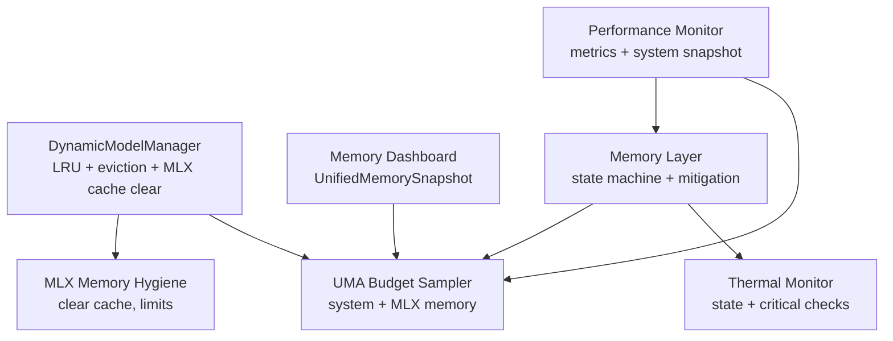
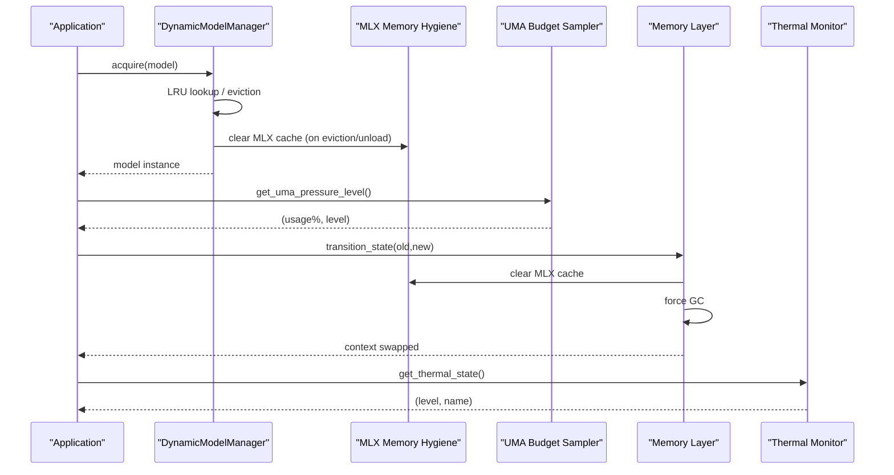
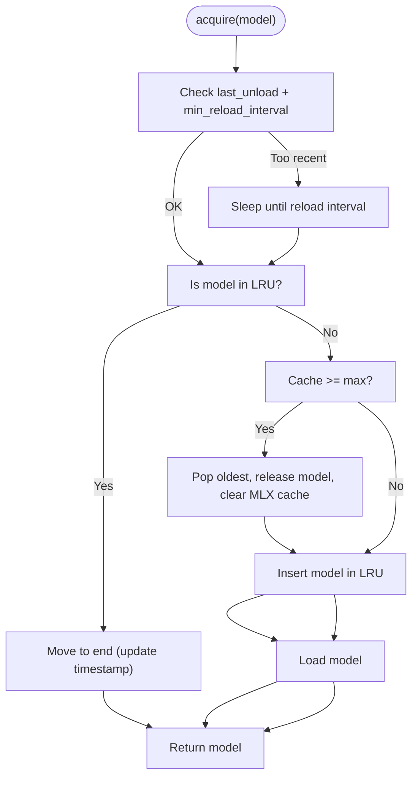
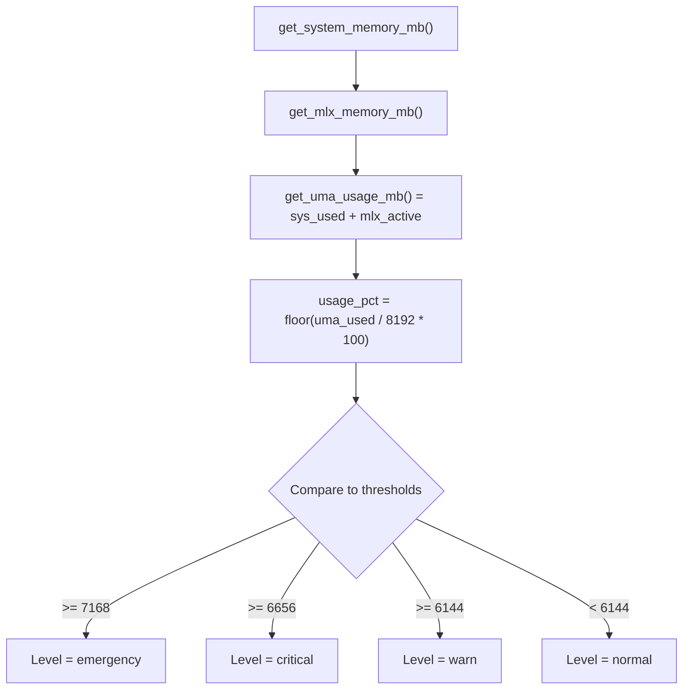
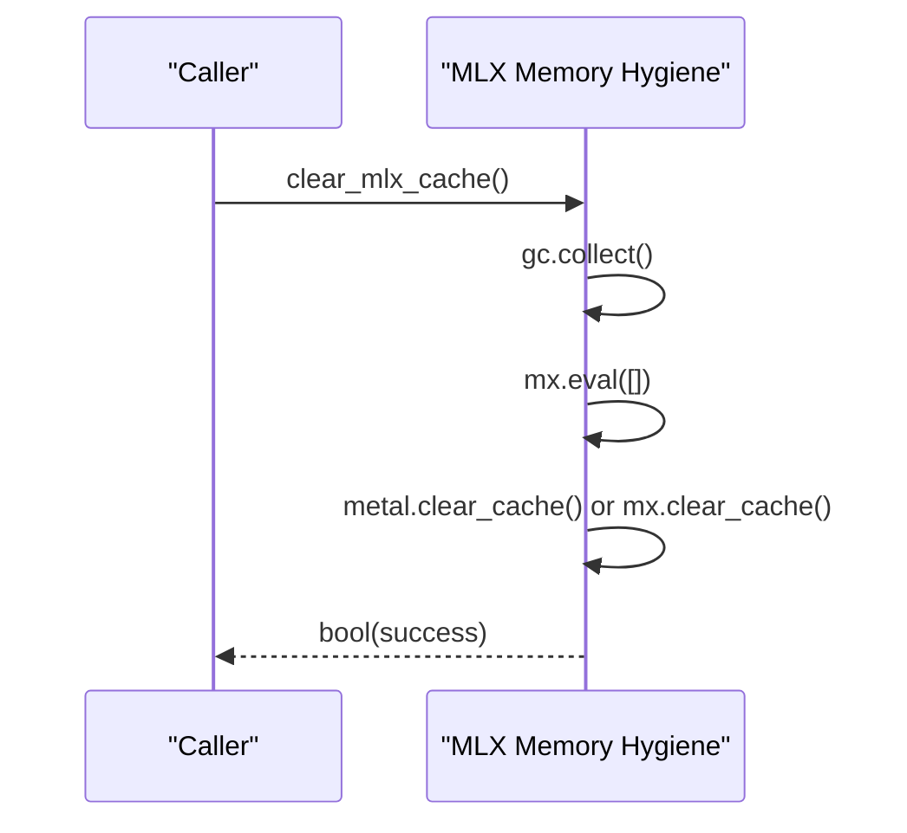
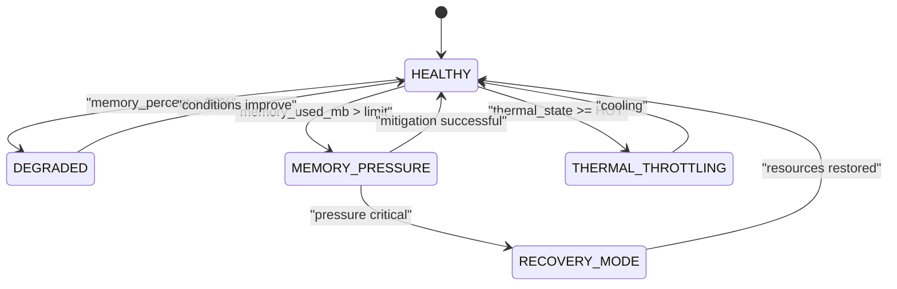
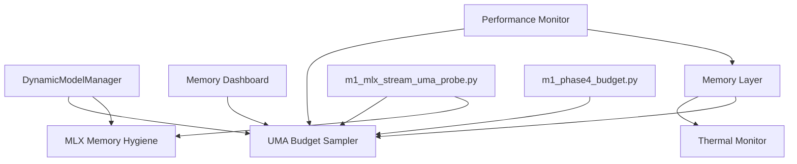

# Memory Optimization Techniques

<cite>
**Referenced Files in This Document**
- [dynamic_model_manager.py](file://brain/dynamic_model_manager.py)
- [uma_budget.py](file://utils/uma_budget.py)
- [mlx_memory.py](file://utils/mlx_memory.py)
- [memory_dashboard.py](file://utils/memory_dashboard.py)
- [thermal.py](file://utils/thermal.py)
- [memory_layer.py](file://layers/memory_layer.py)
- [m1_mlx_stream_uma_probe.py](file://benchmarks/m1_mlx_stream_uma_probe.py)
- [m1_phase4_budget.py](file://benchmarks/m1_phase4_budget.py)
- [performance_monitor.py](file://utils/performance_monitor.py)
</cite>

## Table of Contents
1. [Introduction](#introduction)
2. [Project Structure](#project-structure)
3. [Core Components](#core-components)
4. [Architecture Overview](#architecture-overview)
5. [Detailed Component Analysis](#detailed-component-analysis)
6. [Dependency Analysis](#dependency-analysis)
7. [Performance Considerations](#performance-considerations)
8. [Troubleshooting Guide](#troubleshooting-guide)
9. [Conclusion](#conclusion)
10. [Appendices](#appendices)

## Introduction
This document explains memory optimization techniques in Hledac Universal with a focus on Apple Silicon (M1) Unified Memory Architecture (UMA), MLX memory management, and Apple Silicon-specific constraints. It covers the DynamicModelManager’s LRU caching and model lifecycle management, memory budgeting, cache eviction policies, thermal throttling mitigation, and practical profiling and tuning strategies. It also documents MLX cache management, MPS graph compilation limits, and ANE compilation tracking.

## Project Structure
The memory optimization stack spans several modules:
- Dynamic model lifecycle and caching: brain/dynamic_model_manager.py
- UMA pressure and memory sampling: utils/uma_budget.py, utils/memory_dashboard.py
- MLX memory hygiene and limits: utils/mlx_memory.py
- Thermal monitoring: utils/thermal.py
- Memory layer orchestration and mitigation: layers/memory_layer.py
- Benchmarks for memory behavior: benchmarks/m1_mlx_stream_uma_probe.py, benchmarks/m1_phase4_budget.py
- Performance and system monitoring: utils/performance_monitor.py

**Diagram sources**
- [dynamic_model_manager.py:201-423](file://brain/dynamic_model_manager.py#L201-L423)
- [uma_budget.py:111-311](file://utils/uma_budget.py#L111-L311)
- [memory_dashboard.py:82-242](file://utils/memory_dashboard.py#L82-L242)
- [mlx_memory.py:77-332](file://utils/mlx_memory.py#L77-L332)
- [thermal.py:118-203](file://utils/thermal.py#L118-L203)
- [memory_layer.py:147-800](file://layers/memory_layer.py#L147-L800)
- [performance_monitor.py:240-537](file://utils/performance_monitor.py#L240-L537)

**Section sources**
- [dynamic_model_manager.py:1-423](file://brain/dynamic_model_manager.py#L1-L423)
- [uma_budget.py:1-507](file://utils/uma_budget.py#L1-L507)
- [memory_dashboard.py:1-242](file://utils/memory_dashboard.py#L1-L242)
- [mlx_memory.py:1-332](file://utils/mlx_memory.py#L1-L332)
- [thermal.py:1-203](file://utils/thermal.py#L1-L203)
- [memory_layer.py:1-800](file://layers/memory_layer.py#L1-L800)
- [m1_mlx_stream_uma_probe.py:1-166](file://benchmarks/m1_mlx_stream_uma_probe.py#L1-L166)
- [m1_phase4_budget.py:1-235](file://benchmarks/m1_phase4_budget.py#L1-L235)
- [performance_monitor.py:1-537](file://utils/performance_monitor.py#L1-L537)

## Core Components
- DynamicModelManager: Implements LRU-based model caching, eviction, and MLX cache clearing on unload/idle timeouts. It guards reload thrashing with a minimum reload interval and integrates MPS/CoreML compilation with ANE limits.
- UMA Budget Sampler: Provides unified memory sampling (system RAM + MLX active) and pressure classification for M1 8GB UMA.
- MLX Memory Hygiene: Offers MLX cache clearing, memory pressure calculation, and configurable limits with debounced operations.
- Memory Dashboard: Unified snapshot of system and Metal memory with convenience checks for emergency braking.
- Thermal Monitor: Reads macOS thermal state and exposes critical thresholds for throttling decisions.
- Memory Layer: Orchestrates state transitions, context swaps, and mitigation actions (GC, MLX cache clear) on memory pressure and thermal events.
- Benchmarks: Probes for MLX stream + UMA guard behavior and mission budget verification.

**Section sources**
- [dynamic_model_manager.py:201-423](file://brain/dynamic_model_manager.py#L201-L423)
- [uma_budget.py:111-311](file://utils/uma_budget.py#L111-L311)
- [mlx_memory.py:77-332](file://utils/mlx_memory.py#L77-L332)
- [memory_dashboard.py:82-242](file://utils/memory_dashboard.py#L82-L242)
- [thermal.py:118-203](file://utils/thermal.py#L118-L203)
- [memory_layer.py:147-800](file://layers/memory_layer.py#L147-L800)
- [m1_mlx_stream_uma_probe.py:69-166](file://benchmarks/m1_mlx_stream_uma_probe.py#L69-L166)
- [m1_phase4_budget.py:111-235](file://benchmarks/m1_phase4_budget.py#L111-L235)

## Architecture Overview
The memory optimization architecture combines sampling, pressure classification, and mitigation actions across layers:
- Sampling: System memory via psutil and MLX Metal memory via MLX APIs.
- Classification: Threshold-based pressure levels for UMA and MLX budgets.
- Mitigation: Automatic MLX cache clearing, GC, and model unload on pressure or thermal events.
- Orchestration: Memory Layer state machine coordinates context swaps and recovery.

**Diagram sources**
- [dynamic_model_manager.py:268-343](file://brain/dynamic_model_manager.py#L268-L343)
- [mlx_memory.py:77-106](file://utils/mlx_memory.py#L77-L106)
- [uma_budget.py:201-227](file://utils/uma_budget.py#L201-L227)
- [memory_layer.py:614-787](file://layers/memory_layer.py#L614-L787)
- [thermal.py:118-164](file://utils/thermal.py#L118-L164)

## Detailed Component Analysis

### DynamicModelManager: LRU Caching, Eviction, and Lifecycle
- LRU cache: Maintains an ordered dictionary keyed by model name with timestamps for recency.
- Eviction policy: When cache reaches max size, evicts the least recently used model and triggers MLX cache clear.
- Thrashing protection: Enforces a minimum reload interval to avoid oscillating loads.
- Idle timeout cleanup: Background loop periodically unloads models exceeding idle thresholds and clears MLX cache.
- MLX integration: Clears MLX Metal cache on unload and force-unload to reclaim GPU memory.
- MPS/CoreML compilation: Tracks ANE compilation counts and persists MPS graph packages; falls back when limits are reached.

**Diagram sources**
- [dynamic_model_manager.py:268-312](file://brain/dynamic_model_manager.py#L268-L312)

**Section sources**
- [dynamic_model_manager.py:201-423](file://brain/dynamic_model_manager.py#L201-L423)

### UMA Budget Sampler: M1 8GB UMA Pressure
- Estimates “used” UMA by combining system memory used with MLX active memory.
- Classifies pressure levels using canonical M1 8GB thresholds (warn/critical/emergency).
- Provides a watchdog with debounced callbacks for automatic MLX cleanup on critical/emergency.

**Diagram sources**
- [uma_budget.py:182-227](file://utils/uma_budget.py#L182-L227)

**Section sources**
- [uma_budget.py:111-311](file://utils/uma_budget.py#L111-L311)

### MLX Memory Hygiene: Cache Management and Limits
- Provides lazy MLX initialization and memory metrics retrieval.
- Offers cache clearing with GC and eval flush, plus debounced variants to prevent thrashing.
- Computes MLX memory pressure using a 5.0 GiB budget derived from UMA canonical thresholds.
- Exposes configuration of MLX cache and memory limits with safe fallbacks.

**Diagram sources**
- [mlx_memory.py:77-106](file://utils/mlx_memory.py#L77-L106)

**Section sources**
- [mlx_memory.py:77-332](file://utils/mlx_memory.py#L77-L332)

### Memory Dashboard: Unified Snapshot and Emergency Braking
- Combines system RAM and Metal memory metrics into a single snapshot.
- Provides pressure level and emergency-brake decision logic based on thresholds.

**Section sources**
- [memory_dashboard.py:82-242](file://utils/memory_dashboard.py#L82-L242)

### Thermal Monitor: macOS Thermal Awareness
- Reads thermal state via IOKit/SYSCTL with graceful fallbacks.
- Exposes critical/warn checks for throttling decisions.

**Section sources**
- [thermal.py:118-203](file://utils/thermal.py#L118-L203)

### Memory Layer: State Machine and Mitigation
- Internal state machine monitors memory, CPU, and temperature; transitions between HEALTHY, DEGRADED, MEMORY_PRESSURE, THERMAL_THROTTLING, and others.
- Performs automatic mitigation: GC, MLX cache clear, and model unload during transitions.
- Coordinates context swaps across orchestrator states with memory checks and recovery mode.

**Diagram sources**
- [memory_layer.py:247-281](file://layers/memory_layer.py#L247-L281)

**Section sources**
- [memory_layer.py:147-800](file://layers/memory_layer.py#L147-L800)

### Benchmarks: Memory Behavior and Mission Budget
- MLX Stream + UMA Guard Probe: Measures RSS and Metal memory deltas with and without real MLX operations, validating UMA guard behavior.
- M1 Mission Budget: Verifies peak RSS stays within 5.5 GiB during sidecar admission checks and streaming embedder fallback chunking.

**Section sources**
- [m1_mlx_stream_uma_probe.py:69-166](file://benchmarks/m1_mlx_stream_uma_probe.py#L69-L166)
- [m1_phase4_budget.py:111-235](file://benchmarks/m1_phase4_budget.py#L111-L235)

## Dependency Analysis
Key dependencies and interactions:
- DynamicModelManager depends on MLX availability and clears MLX cache on unload.
- UMA Budget Sampler and Memory Dashboard depend on psutil and MLX Metal APIs.
- Memory Layer orchestrates state transitions and invokes mitigation actions.
- Benchmarks depend on psutil and optionally MLX to validate memory behavior.

**Diagram sources**
- [dynamic_model_manager.py:18-30](file://brain/dynamic_model_manager.py#L18-L30)
- [mlx_memory.py:54-75](file://utils/mlx_memory.py#L54-L75)
- [uma_budget.py:101-109](file://utils/uma_budget.py#L101-L109)
- [memory_dashboard.py:21-35](file://utils/memory_dashboard.py#L21-L35)
- [memory_layer.py:147-169](file://layers/memory_layer.py#L147-L169)
- [thermal.py:118-164](file://utils/thermal.py#L118-L164)
- [performance_monitor.py:240-397](file://utils/performance_monitor.py#L240-L397)
- [m1_mlx_stream_uma_probe.py:25-36](file://benchmarks/m1_mlx_stream_uma_probe.py#L25-L36)
- [m1_phase4_budget.py:47-53](file://benchmarks/m1_phase4_budget.py#L47-L53)

**Section sources**
- [dynamic_model_manager.py:1-423](file://brain/dynamic_model_manager.py#L1-L423)
- [mlx_memory.py:1-332](file://utils/mlx_memory.py#L1-L332)
- [uma_budget.py:1-507](file://utils/uma_budget.py#L1-L507)
- [memory_dashboard.py:1-242](file://utils/memory_dashboard.py#L1-L242)
- [memory_layer.py:1-800](file://layers/memory_layer.py#L1-L800)
- [thermal.py:1-203](file://utils/thermal.py#L1-L203)
- [performance_monitor.py:1-537](file://utils/performance_monitor.py#L1-L537)
- [m1_mlx_stream_uma_probe.py:1-166](file://benchmarks/m1_mlx_stream_uma_probe.py#L1-L166)
- [m1_phase4_budget.py:1-235](file://benchmarks/m1_phase4_budget.py#L1-L235)

## Performance Considerations
- Prefer LRU caching with bounded concurrency to cap GPU memory footprint.
- Use MLX cache clearing and debounced operations to avoid thrashing during frequent model switches.
- Apply idle-timeout eviction to unload unused models proactively.
- Monitor UMA pressure and MLX memory pressure; trigger MLX cache cleanup on critical thresholds.
- Integrate thermal awareness to reduce load when thermal state is hot or critical.
- Use streaming and chunked processing to bound memory growth during embeddings and inference.
- Validate mission budgets with dedicated benchmarks to ensure peak RSS remains below 5.5 GiB without models loaded.

[No sources needed since this section provides general guidance]

## Troubleshooting Guide
Common issues and remedies:
- MLX OOM or cache bloat:
  - Clear MLX cache using the hygiene helper and debounced variants.
  - Lower MLX cache and memory limits where supported.
- Frequent thrashing on model reload:
  - Increase the minimum reload interval to avoid oscillating loads.
- Memory pressure spikes:
  - Enable UMA watchdog to trigger MLX cleanup on critical/emergency.
  - Use Memory Layer’s automatic mitigation (GC + MLX cache clear).
- Thermal throttling:
  - Use thermal monitor to detect hot/critical states and reduce workload.
- Validation failures:
  - Run the MLX stream + UMA probe and mission budget benchmarks to confirm memory behavior.

**Section sources**
- [mlx_memory.py:77-106](file://utils/mlx_memory.py#L77-L106)
- [dynamic_model_manager.py:280-286](file://brain/dynamic_model_manager.py#L280-L286)
- [uma_budget.py:380-507](file://utils/uma_budget.py#L380-L507)
- [memory_layer.py:754-787](file://layers/memory_layer.py#L754-L787)
- [thermal.py:118-203](file://utils/thermal.py#L118-L203)
- [m1_mlx_stream_uma_probe.py:69-166](file://benchmarks/m1_mlx_stream_uma_probe.py#L69-L166)
- [m1_phase4_budget.py:111-235](file://benchmarks/m1_phase4_budget.py#L111-L235)

## Conclusion
Hledac Universal applies a layered memory optimization strategy tailored for M1 UMA: LRU-based model lifecycle management, MLX cache hygiene, UMA pressure classification, thermal awareness, and automated mitigation. Benchmarks ensure mission budgets are met, while the Memory Layer coordinates safe context swaps and recovery. Together, these mechanisms mitigate memory pressure, reduce thermal throttling, and maintain stability in constrained Apple Silicon environments.

[No sources needed since this section summarizes without analyzing specific files]

## Appendices

### Practical Examples and Recipes
- Profile memory with the MLX stream + UMA probe:
  - Dry-run to measure baseline overhead.
  - Live mode to evaluate real MLX embedding memory deltas.
- Validate mission budget:
  - Run the M1 mission budget benchmark to ensure peak RSS remains under 5.5 GiB without loaded models.
- Tune MLX cache and memory limits:
  - Use the MLX memory hygiene helper to configure cache and memory limits with debounced updates.
- Monitor system health:
  - Use the system monitor to track CPU, memory, thermal state, and memory pressure; receive recommendations and critical-state callbacks.

**Section sources**
- [m1_mlx_stream_uma_probe.py:69-166](file://benchmarks/m1_mlx_stream_uma_probe.py#L69-L166)
- [m1_phase4_budget.py:111-235](file://benchmarks/m1_phase4_budget.py#L111-L235)
- [mlx_memory.py:217-247](file://utils/mlx_memory.py#L217-L247)
- [performance_monitor.py:240-457](file://utils/performance_monitor.py#L240-L457)