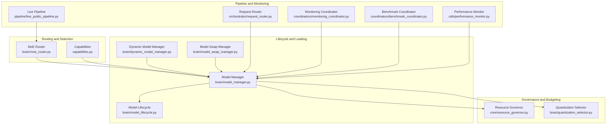
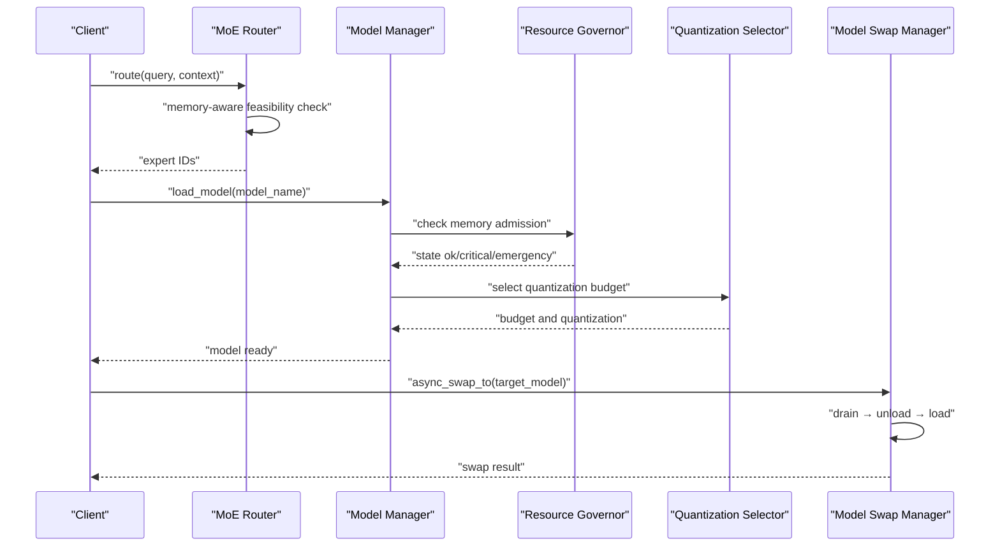
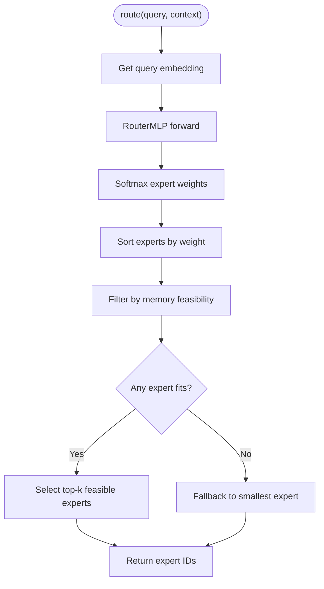
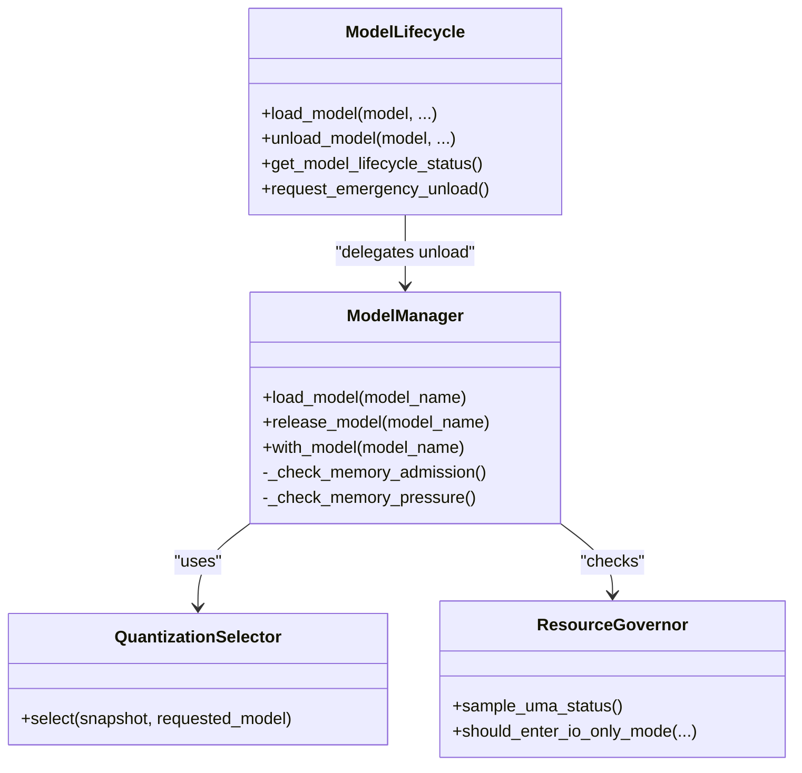
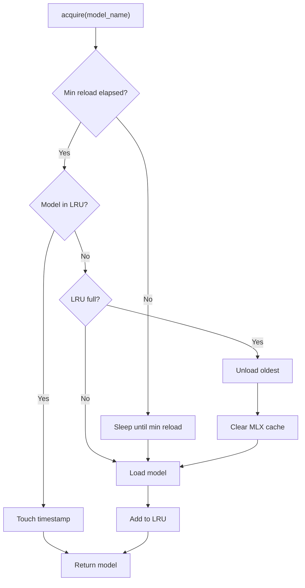
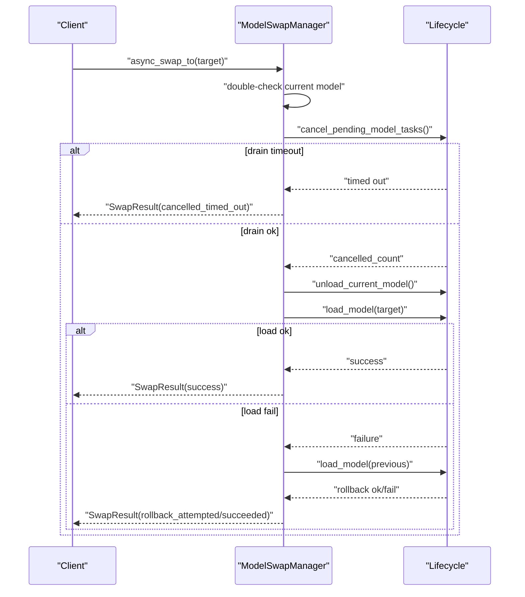
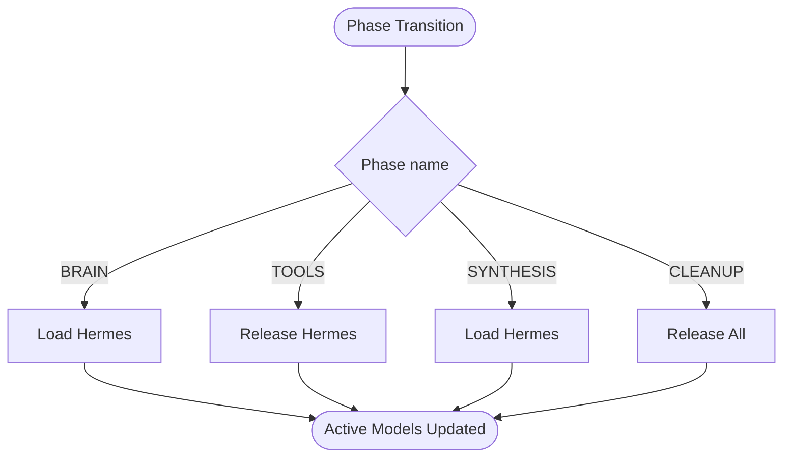
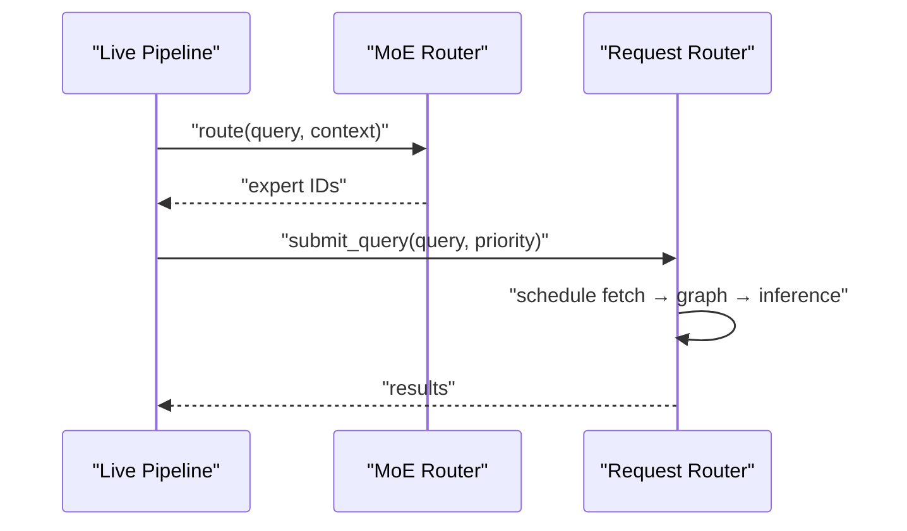
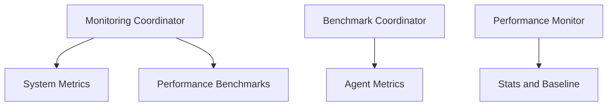
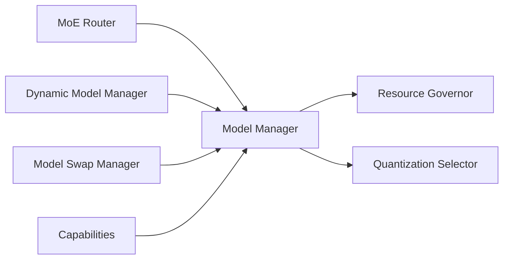

# Model Orchestration and Routing

<cite>
**Referenced Files in This Document**
- [moe_router.py](file://brain/moe_router.py)
- [model_manager.py](file://brain/model_manager.py)
- [dynamic_model_manager.py](file://brain/dynamic_model_manager.py)
- [model_lifecycle.py](file://brain/model_lifecycle.py)
- [model_swap_manager.py](file://brain/model_swap_manager.py)
- [quantization_selector.py](file://brain/quantization_selector.py)
- [resource_governor.py](file://core/resource_governor.py)
- [request_router.py](file://orchestrator/request_router.py)
- [capabilities.py](file://capabilities.py)
- [live_public_pipeline.py](file://pipeline/live_public_pipeline.py)
- [monitoring_coordinator.py](file://coordinators/monitoring_coordinator.py)
- [benchmark_coordinator.py](file://coordinators/benchmark_coordinator.py)
- [performance_monitor.py](file://utils/performance_monitor.py)
</cite>

## Table of Contents
1. [Introduction](#introduction)
2. [Project Structure](#project-structure)
3. [Core Components](#core-components)
4. [Architecture Overview](#architecture-overview)
5. [Detailed Component Analysis](#detailed-component-analysis)
6. [Dependency Analysis](#dependency-analysis)
7. [Performance Considerations](#performance-considerations)
8. [Troubleshooting Guide](#troubleshooting-guide)
9. [Conclusion](#conclusion)
10. [Appendices](#appendices)

## Introduction
This document explains the model orchestration and routing systems in Hledac Universal with a focus on Mixture of Experts (MoE) routing, model selection algorithms, dynamic model switching, lifecycle management, load balancing, and failover procedures. It covers how the system decides which models to use, how to switch between them safely, and how to monitor and optimize performance. It also documents compatibility checks, version management, and deployment strategies, along with guidance for custom routing algorithms.

## Project Structure
The model orchestration spans several modules:
- MoE routing and expert selection: brain/moe_router.py
- Centralized model lifecycle and loading: brain/model_manager.py
- Dynamic model management with LRU and timeouts: brain/dynamic_model_manager.py
- Lifecycle utilities and emergency unload seam: brain/model_lifecycle.py
- Model swap arbiter: brain/model_swap_manager.py
- Quantization and inference budget selection: brain/quantization_selector.py
- Resource governance and UMA state: core/resource_governor.py
- Request routing pipeline: orchestrator/request_router.py
- Capability-based model gating: capabilities.py
- Pipeline integration: pipeline/live_public_pipeline.py
- Monitoring and benchmarking: coordinators/monitoring_coordinator.py, utils/performance_monitor.py, coordinators/benchmark_coordinator.py

**Diagram sources**
- [moe_router.py:121-825](file://brain/moe_router.py#L121-L825)
- [model_manager.py:178-807](file://brain/model_manager.py#L178-L807)
- [dynamic_model_manager.py:201-423](file://brain/dynamic_model_manager.py#L201-L423)
- [model_lifecycle.py:333-624](file://brain/model_lifecycle.py#L333-L624)
- [model_swap_manager.py:154-420](file://brain/model_swap_manager.py#L154-L420)
- [quantization_selector.py:117-234](file://brain/quantization_selector.py#L117-L234)
- [resource_governor.py:388-488](file://core/resource_governor.py#L388-L488)
- [request_router.py:50-204](file://orchestrator/request_router.py#L50-L204)
- [capabilities.py:623-778](file://capabilities.py#L623-L778)
- [live_public_pipeline.py:2155-2171](file://pipeline/live_public_pipeline.py#L2155-L2171)
- [monitoring_coordinator.py:317-466](file://coordinators/monitoring_coordinator.py#L317-L466)
- [benchmark_coordinator.py:455-541](file://coordinators/benchmark_coordinator.py#L455-L541)
- [performance_monitor.py:116-139](file://utils/performance_monitor.py#L116-L139)

**Section sources**
- [moe_router.py:1-962](file://brain/moe_router.py#L1-L962)
- [model_manager.py:1-1297](file://brain/model_manager.py#L1-L1297)
- [dynamic_model_manager.py:1-423](file://brain/dynamic_model_manager.py#L1-L423)
- [model_lifecycle.py:1-929](file://brain/model_lifecycle.py#L1-L929)
- [model_swap_manager.py:1-420](file://brain/model_swap_manager.py#L1-L420)
- [quantization_selector.py:1-234](file://brain/quantization_selector.py#L1-L234)
- [resource_governor.py:1-668](file://core/resource_governor.py#L1-L668)
- [request_router.py:1-204](file://orchestrator/request_router.py#L1-L204)
- [capabilities.py:623-778](file://capabilities.py#L623-L778)
- [live_public_pipeline.py:2155-2171](file://pipeline/live_public_pipeline.py#L2155-L2171)
- [monitoring_coordinator.py:317-466](file://coordinators/monitoring_coordinator.py#L317-L466)
- [benchmark_coordinator.py:455-541](file://coordinators/benchmark_coordinator.py#L455-L541)
- [performance_monitor.py:116-139](file://utils/performance_monitor.py#L116-L139)

## Core Components
- MoE Router: Implements content-aware routing among specialized experts with memory-aware feasibility checks and per-expert prompt caching. See [MoERouter:121-825](file://brain/moe_router.py#L121-L825).
- Model Manager: Centralized lifecycle manager enforcing single-model-at-a-time policy on M1 8GB, with memory guards, quantization advisory, and MLX runtime initialization. See [ModelManager:178-807](file://brain/model_manager.py#L178-L807).
- Dynamic Model Manager: Adds LRU eviction, idle timeouts, and thrashing protection for model instances. See [DynamicModelManager:201-423](file://brain/dynamic_model_manager.py#L201-L423).
- Model Lifecycle Utilities: Shadow-state tracking, emergency unload seam, and structured generation sidecar. See [model_lifecycle.py:108-624](file://brain/model_lifecycle.py#L108-L624).
- Model Swap Manager: Race-free arbiter for swapping between models with drain, unload, and load phases. See [ModelSwapManager:154-420](file://brain/model_swap_manager.py#L154-L420).
- Quantization Selector: Advisory quantization and inference budget selection based on UMA snapshots. See [QuantizationSelector:117-234](file://brain/quantization_selector.py#L117-L234).
- Resource Governor: Unified UMA state evaluation, hysteresis, I/O-only mode, and alarm dispatch. See [ResourceGovernor:200-488](file://core/resource_governor.py#L200-L488).
- Request Router: Pipelined orchestration of fetch/graph/inference with shared-memory handoff. See [RequestRouter:50-204](file://orchestrator/request_router.py#L50-L204).
- Capability-Based Gating: Enforces phase-specific model activation and releases. See [ModelLifecycleManager:623-778](file://capabilities.py#L623-L778).

**Section sources**
- [moe_router.py:121-825](file://brain/moe_router.py#L121-L825)
- [model_manager.py:178-807](file://brain/model_manager.py#L178-L807)
- [dynamic_model_manager.py:201-423](file://brain/dynamic_model_manager.py#L201-L423)
- [model_lifecycle.py:108-624](file://brain/model_lifecycle.py#L108-L624)
- [model_swap_manager.py:154-420](file://brain/model_swap_manager.py#L154-L420)
- [quantization_selector.py:117-234](file://brain/quantization_selector.py#L117-L234)
- [resource_governor.py:200-488](file://core/resource_governor.py#L200-L488)
- [request_router.py:50-204](file://orchestrator/request_router.py#L50-L204)
- [capabilities.py:623-778](file://capabilities.py#L623-L778)

## Architecture Overview
The system integrates MoE routing with centralized model lifecycle management and governance. MoE routing selects experts based on query content and memory feasibility. Model Manager ensures single-model-at-a-time stability on M1 8GB, with memory admission gates and quantization advisory. Dynamic Model Manager adds LRU and idle eviction. Resource Governor evaluates UMA state and triggers I/O-only mode and alarms. Model Swap Manager coordinates safe swaps between models. Capability-based gating aligns model activation with workflow phases.

**Diagram sources**
- [moe_router.py:411-502](file://brain/moe_router.py#L411-L502)
- [model_manager.py:608-711](file://brain/model_manager.py#L608-L711)
- [resource_governor.py:388-488](file://core/resource_governor.py#L388-L488)
- [quantization_selector.py:129-227](file://brain/quantization_selector.py#L129-L227)
- [model_swap_manager.py:198-343](file://brain/model_swap_manager.py#L198-L343)

## Detailed Component Analysis

### MoE Router and Expert Routing
- RouterMLP: Lightweight MLP for expert weighting from query embeddings; supports MLX or PyTorch backends.
- Memory-aware routing: Feasibility filter based on known model sizes and available memory; fallback to smallest expert when none fit.
- Per-expert prompt cache: Separate cache per expert to optimize repeated queries.
- Security: Input sanitization hook injection; fallback sanitizer used when none provided.
- Generation flow: Sequential expert processing with synthesis expert for final answer composition.

**Diagram sources**
- [moe_router.py:411-472](file://brain/moe_router.py#L411-L472)

**Section sources**
- [moe_router.py:72-119](file://brain/moe_router.py#L72-L119)
- [moe_router.py:133-140](file://brain/moe_router.py#L133-L140)
- [moe_router.py:389-472](file://brain/moe_router.py#L389-L472)
- [moe_router.py:474-502](file://brain/moe_router.py#L474-L502)
- [moe_router.py:504-767](file://brain/moe_router.py#L504-L767)

### Model Lifecycle Management
- Single-model-at-a-time policy: Ensures stability on M1 8GB by releasing other models before loading a new one.
- Memory guards: RSS thresholds, admission gates, and soft cache clearing on low RAM.
- Quantization advisory: Integrates with QuantizationSelector to choose quantization and budget.
- Emergency unload seam: Safe flag-based unload with bounded waits and callback hooks.
- Shadow-state tracking: Lightweight lifecycle status for introspection without side effects.

**Diagram sources**
- [model_manager.py:178-807](file://brain/model_manager.py#L178-L807)
- [model_lifecycle.py:333-624](file://brain/model_lifecycle.py#L333-L624)
- [quantization_selector.py:117-234](file://brain/quantization_selector.py#L117-L234)
- [resource_governor.py:388-488](file://core/resource_governor.py#L388-L488)

**Section sources**
- [model_manager.py:52-107](file://brain/model_manager.py#L52-L107)
- [model_manager.py:608-711](file://brain/model_manager.py#L608-L711)
- [model_manager.py:734-807](file://brain/model_manager.py#L734-L807)
- [model_lifecycle.py:108-222](file://brain/model_lifecycle.py#L108-L222)
- [model_lifecycle.py:333-624](file://brain/model_lifecycle.py#L333-L624)

### Dynamic Model Management and Load Balancing
- LRU eviction: Limits max loaded models and evicts least recently used.
- Thrashing protection: Minimum reload intervals to avoid frequent unload/reload cycles.
- Idle timeout: Background cleanup loop releases models after inactivity.
- MLX cache integration: Clears Metal cache on unload to reclaim memory.

**Diagram sources**
- [dynamic_model_manager.py:268-312](file://brain/dynamic_model_manager.py#L268-L312)
- [dynamic_model_manager.py:366-404](file://brain/dynamic_model_manager.py#L366-L404)

**Section sources**
- [dynamic_model_manager.py:201-423](file://brain/dynamic_model_manager.py#L201-L423)

### Model Swap Arbiter and Failover
- Strict ordering: drain → unload → load with bounded timeout.
- Rollback: Attempts to restore previous model on load failure.
- Status tracking: Total swaps, failed swaps, last swap duration.

**Diagram sources**
- [model_swap_manager.py:198-343](file://brain/model_swap_manager.py#L198-L343)

**Section sources**
- [model_swap_manager.py:154-420](file://brain/model_swap_manager.py#L154-L420)

### Capability-Based Routing and Phase Enforcement
- Phase transitions: BRAIN, TOOLS, SYNTHESIS activate/deactivate models accordingly.
- Capability registry: Loads/unloads models for tasks based on capability requirements.
- Local compatibility state: Non-canonical tracking for capability-gated decisions.

**Diagram sources**
- [capabilities.py:679-713](file://capabilities.py#L679-L713)

**Section sources**
- [capabilities.py:623-778](file://capabilities.py#L623-L778)

### Pipeline Integration and Routing Policies
- Live pipeline integrates MoE routing to select experts for synthesis.
- Request Router orchestrates fetch → graph → inference with shared-memory handoff.

**Diagram sources**
- [live_public_pipeline.py:2155-2171](file://pipeline/live_public_pipeline.py#L2155-L2171)
- [request_router.py:66-102](file://orchestrator/request_router.py#L66-L102)
- [request_router.py:104-186](file://orchestrator/request_router.py#L104-L186)

**Section sources**
- [live_public_pipeline.py:2155-2171](file://pipeline/live_public_pipeline.py#L2155-L2171)
- [request_router.py:50-204](file://orchestrator/request_router.py#L50-L204)

### Performance Monitoring and Benchmarking
- Monitoring coordinator executes system, watchdog, and performance monitoring.
- Benchmark coordinator computes performance tiers and metrics.
- Performance monitor estimates baseline and tracks speedup and throughput.

**Diagram sources**
- [monitoring_coordinator.py:317-466](file://coordinators/monitoring_coordinator.py#L317-L466)
- [benchmark_coordinator.py:455-541](file://coordinators/benchmark_coordinator.py#L455-L541)
- [performance_monitor.py:116-139](file://utils/performance_monitor.py#L116-L139)

**Section sources**
- [monitoring_coordinator.py:317-466](file://coordinators/monitoring_coordinator.py#L317-L466)
- [benchmark_coordinator.py:455-541](file://coordinators/benchmark_coordinator.py#L455-L541)
- [performance_monitor.py:116-139](file://utils/performance_monitor.py#L116-L139)

## Dependency Analysis
Key dependencies and coupling:
- MoE Router depends on MLX availability and embedding cache; it interacts with Model Manager for model loading and lifecycle.
- Model Manager depends on Resource Governor for admission gates and QuantizationSelector for inference budgets.
- Dynamic Model Manager wraps Model Manager to add LRU and idle eviction.
- Model Swap Manager depends on a lifecycle protocol to coordinate drains, unloads, and loads.
- Capability-based gating depends on Model Manager’s registry for model activation.

**Diagram sources**
- [moe_router.py:172-194](file://brain/moe_router.py#L172-L194)
- [model_manager.py:608-711](file://brain/model_manager.py#L608-L711)
- [dynamic_model_manager.py:201-247](file://brain/dynamic_model_manager.py#L201-L247)
- [model_swap_manager.py:154-186](file://brain/model_swap_manager.py#L154-L186)
- [capabilities.py:679-713](file://capabilities.py#L679-L713)

**Section sources**
- [moe_router.py:172-194](file://brain/moe_router.py#L172-L194)
- [model_manager.py:608-711](file://brain/model_manager.py#L608-L711)
- [dynamic_model_manager.py:201-247](file://brain/dynamic_model_manager.py#L201-L247)
- [model_swap_manager.py:154-186](file://brain/model_swap_manager.py#L154-L186)
- [capabilities.py:679-713](file://capabilities.py#L679-L713)

## Performance Considerations
- Memory-aware routing: MoE filters experts by known model sizes and available memory to prevent OOM.
- Single-model-at-a-time: Model Manager’s strict policy prevents memory contention on M1 8GB.
- Quantization tuning: QuantizationSelector adapts quantization and token/latency budgets based on UMA state.
- I/O-only mode: Resource Governor’s hysteresis prevents thrashing and reduces compute pressure.
- Dynamic eviction: Dynamic Model Manager’s LRU and idle timeouts reclaim memory proactively.
- Monitoring and benchmarking: Use monitoring and benchmarking to track latency, throughput, and memory usage.

[No sources needed since this section provides general guidance]

## Troubleshooting Guide
Common issues and remedies:
- MoE routing failures: Check MLX availability and embedding cache; fallback to uniform weights and default experts.
- Model load failures: Verify memory admission gates and RSS thresholds; ensure MLX runtime is initialized.
- Emergency unload: Use the emergency seam to request unload and clear the flag after safe conditions.
- Swap failures: Investigate drain timeouts and rollback outcomes; confirm previous model availability.
- Performance degradation: Review monitoring metrics and benchmark tiers; adjust quantization and load balancing strategies.

**Section sources**
- [moe_router.py:468-472](file://brain/moe_router.py#L468-L472)
- [model_manager.py:651-653](file://brain/model_manager.py#L651-L653)
- [model_lifecycle.py:108-145](file://brain/model_lifecycle.py#L108-L145)
- [model_swap_manager.py:267-286](file://brain/model_swap_manager.py#L267-L286)
- [monitoring_coordinator.py:446-466](file://coordinators/monitoring_coordinator.py#L446-L466)

## Conclusion
Hledac Universal’s model orchestration combines content-aware MoE routing with robust lifecycle management, dynamic model management, and governance-driven quantization and admission control. The system ensures stability on constrained devices, enables safe model swaps, and provides comprehensive monitoring and benchmarking to optimize performance. By leveraging capability-based gating and pipeline integration, it delivers adaptive model selection tailored to workload characteristics.

[No sources needed since this section summarizes without analyzing specific files]

## Appendices

### Model Configuration Examples
- MoE Router configuration: expert names, model paths, max active experts, temperature, and token limits. See [MoERouterConfig:54-70](file://brain/moe_router.py#L54-L70).
- Model Manager memory limits: RSS thresholds and model sizes for M1 8GB. See [set_model_memory_limit:46-49](file://brain/model_manager.py#L46-L49) and [MODEL_SIZES_GB:37-41](file://brain/model_manager.py#L37-L41).
- Quantization budgets: Inference budget fields and policy thresholds. See [InferenceBudget:52-58](file://brain/quantization_selector.py#L52-L58) and [QuantizationSelector.select:129-227](file://brain/quantization_selector.py#L129-L227).

**Section sources**
- [moe_router.py:54-70](file://brain/moe_router.py#L54-L70)
- [model_manager.py:46-41](file://brain/model_manager.py#L46-L41)
- [quantization_selector.py:52-227](file://brain/quantization_selector.py#L52-L227)

### Routing Policies and Strategies
- Content-based MoE routing with memory feasibility filtering. See [MoE routing:411-472](file://brain/moe_router.py#L411-L472).
- Capability-based phase enforcement. See [ModelLifecycleManager.enforce_phase_models:679-713](file://capabilities.py#L679-L713).
- Round-robin and weighted load balancing strategies. See [PerformanceCoordinator.select_agent:352-372](file://coordinators/performance_coordinator.py#L352-L372).

**Section sources**
- [moe_router.py:411-472](file://brain/moe_router.py#L411-L472)
- [capabilities.py:679-713](file://capabilities.py#L679-L713)
- [performance_coordinator.py:341-372](file://coordinators/performance_coordinator.py#L341-L372)

### Deployment and Compatibility
- MLX runtime initialization and lazy imports. See [ensure_mlx_runtime_initialized:311-331](file://brain/model_lifecycle.py#L311-L331).
- CoreML/ANE fallbacks and MPS cache management. See [ModelManager:427-486](file://brain/model_manager.py#L427-L486) and [dynamic_model_manager.py:72-124](file://brain/dynamic_model_manager.py#L72-L124).
- Version management: QuantizationSelector fallbacks and governor denials. See [QuantizationSelector:129-159](file://brain/quantization_selector.py#L129-L159).

**Section sources**
- [model_lifecycle.py:311-331](file://brain/model_lifecycle.py#L311-L331)
- [model_manager.py:427-486](file://brain/model_manager.py#L427-L486)
- [dynamic_model_manager.py:72-124](file://brain/dynamic_model_manager.py#L72-L124)
- [quantization_selector.py:129-159](file://brain/quantization_selector.py#L129-L159)

### Guidance for Custom Routing Algorithms
- Extend RouterMLP with custom layers or integrate external embeddings.
- Implement memory-aware feasibility filters using known model sizes and available memory.
- Add per-expert prompt caching and eviction policies.
- Integrate with Resource Governor for admission control and I/O-only mode.
- Use Model Swap Manager for safe transitions between routing strategies.

**Section sources**
- [moe_router.py:72-119](file://brain/moe_router.py#L72-L119)
- [moe_router.py:133-140](file://brain/moe_router.py#L133-L140)
- [moe_router.py:204-291](file://brain/moe_router.py#L204-L291)
- [resource_governor.py:314-372](file://core/resource_governor.py#L314-L372)
- [model_swap_manager.py:198-343](file://brain/model_swap_manager.py#L198-L343)