# Performance Tuning and Optimization

<cite>
**Referenced Files in This Document**
- [signpost_profiler.py](file://utils/signpost_profiler.py)
- [performance_monitor.py](file://utils/performance_monitor.py)
- [uma_budget.py](file://utils/uma_budget.py)
- [resource_governor.py](file://core/resource_governor.py)
- [resource_allocator.py](file://coordinators/resource_allocator.py)
- [performance_coordinator.py](file://coordinators/performance_coordinator.py)
- [monitoring_coordinator.py](file://coordinators/monitoring_coordinator.py)
- [benchmark_pipeline.py](file://benchmarks/benchmark_pipeline.py)
- [e2e_canonical_benchmark.py](file://benchmarks/e2e_canonical_benchmark.py)
- [live_measurement_kpi.py](file://benchmarks/live_measurement_kpi.py)
- [live_sprint_measurement.py](file://benchmarks/live_sprint_measurement.py)
- [mlx_memory.py](file://utils/mlx_memory.py)
- [thread_pools.py](file://utils/thread_pools.py)
- [execution_optimizer.py](file://utils/execution_optimizer.py)
- [probe_f214m_execution_optimizer_backpressure.py](file://tests/profiling/probe_f214m_execution_optimizer_backpressure.py)
</cite>

## Table of Contents
1. [Introduction](#introduction)
2. [Project Structure](#project-structure)
3. [Core Components](#core-components)
4. [Architecture Overview](#architecture-overview)
5. [Detailed Component Analysis](#detailed-component-analysis)
6. [Dependency Analysis](#dependency-analysis)
7. [Performance Considerations](#performance-considerations)
8. [Troubleshooting Guide](#troubleshooting-guide)
9. [Conclusion](#conclusion)
10. [Appendices](#appendices)

## Introduction
This document provides a comprehensive guide to performance tuning and optimization in Hledac Universal. It covers profiling techniques, performance monitoring, resource governance, CPU and memory optimization, I/O improvements, signpost profiler usage, KPI measurement systems, and performance regression detection. Practical workflows and benchmark interpretation are included to help you identify bottlenecks, apply targeted optimizations, and measure improvements across system-wide and component-specific scopes.

## Project Structure
Hledac Universal organizes performance-critical functionality across several modules:
- Profiling and monitoring utilities in utils
- Resource governance and allocation in core and coordinators
- Benchmarks and KPI extraction in benchmarks
- Specialized probes and tests for performance analysis

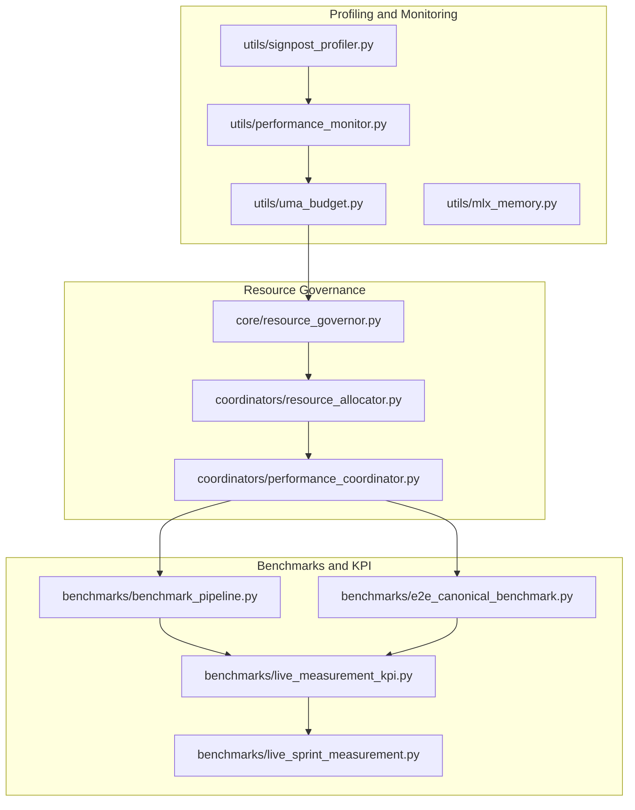

**Diagram sources**
- [signpost_profiler.py:1-79](file://utils/signpost_profiler.py#L1-L79)
- [performance_monitor.py:1-537](file://utils/performance_monitor.py#L1-L537)
- [uma_budget.py:1-507](file://utils/uma_budget.py#L1-L507)
- [resource_governor.py:1-371](file://core/resource_governor.py#L1-L371)
- [resource_allocator.py:640-659](file://coordinators/resource_allocator.py#L640-L659)
- [performance_coordinator.py:1-807](file://coordinators/performance_coordinator.py#L1-L807)
- [benchmark_pipeline.py:1-381](file://benchmarks/benchmark_pipeline.py#L1-L381)
- [e2e_canonical_benchmark.py:1-484](file://benchmarks/e2e_canonical_benchmark.py#L1-L484)
- [live_measurement_kpi.py:1-935](file://benchmarks/live_measurement_kpi.py#L1-L935)
- [live_sprint_measurement.py:212-244](file://benchmarks/live_sprint_measurement.py#L212-L244)

**Section sources**
- [signpost_profiler.py:1-79](file://utils/signpost_profiler.py#L1-L79)
- [performance_monitor.py:1-537](file://utils/performance_monitor.py#L1-L537)
- [uma_budget.py:1-507](file://utils/uma_budget.py#L1-L507)
- [resource_governor.py:1-371](file://core/resource_governor.py#L1-L371)
- [resource_allocator.py:640-659](file://coordinators/resource_allocator.py#L640-L659)
- [performance_coordinator.py:1-807](file://coordinators/performance_coordinator.py#L1-L807)
- [benchmark_pipeline.py:1-381](file://benchmarks/benchmark_pipeline.py#L1-L381)
- [e2e_canonical_benchmark.py:1-484](file://benchmarks/e2e_canonical_benchmark.py#L1-L484)
- [live_measurement_kpi.py:1-935](file://benchmarks/live_measurement_kpi.py#L1-L935)
- [live_sprint_measurement.py:212-244](file://benchmarks/live_sprint_measurement.py#L212-L244)

## Core Components
- Signpost Profiler: Low-overhead macOS instrumentation for code-section timing with deterministic signposts.
- Performance Monitor: Token/query throughput tracking, speedup vs. baseline, and quality validation.
- Unified Memory Budget (UMA) Sampler: Raw memory sampling and pressure classification for system and MLX memory.
- Resource Governor: Policy-driven resource governance with hysteresis, I/O-only mode, and priority-based reservations.
- Resource Allocator: Request-level budgeting and concurrency control.
- Performance Coordinator: Agent pooling, load balancing, async execution optimization, and automatic bottleneck remediation.
- Monitoring Coordinator: Multi-source system metrics, performance benchmarking, and alerting.
- Benchmarks: Pipeline and canonical end-to-end benchmarks capturing throughput, memory, and sidecar performance.
- KPI Derivation: Live KPI computation from runtime reports and acquisition strategies.
- Thread Pools and Execution Optimizer: Worker pool management and parallel execution monitoring.

**Section sources**
- [signpost_profiler.py:1-79](file://utils/signpost_profiler.py#L1-L79)
- [performance_monitor.py:1-537](file://utils/performance_monitor.py#L1-L537)
- [uma_budget.py:1-507](file://utils/uma_budget.py#L1-L507)
- [resource_governor.py:1-371](file://core/resource_governor.py#L1-L371)
- [resource_allocator.py:640-659](file://coordinators/resource_allocator.py#L640-L659)
- [performance_coordinator.py:1-807](file://coordinators/performance_coordinator.py#L1-L807)
- [monitoring_coordinator.py:1-200](file://coordinators/monitoring_coordinator.py#L1-L200)
- [benchmark_pipeline.py:1-381](file://benchmarks/benchmark_pipeline.py#L1-L381)
- [e2e_canonical_benchmark.py:1-484](file://benchmarks/e2e_canonical_benchmark.py#L1-L484)
- [live_measurement_kpi.py:1-935](file://benchmarks/live_measurement_kpi.py#L1-L935)
- [thread_pools.py:1-43](file://utils/thread_pools.py#L1-L43)
- [execution_optimizer.py:1021-1064](file://utils/execution_optimizer.py#L1021-L1064)

## Architecture Overview
The performance architecture integrates low-level sampling, policy enforcement, and high-level orchestration:
- Sampling: UMA and MLX memory samplers feed resource governance.
- Policy: Resource Governor enforces thresholds and transitions to I/O-only mode with hysteresis.
- Orchestration: Performance Coordinator manages agent pools and async execution; Monitoring Coordinator aggregates system metrics and runs performance benchmarks.
- Measurement: Benchmarks and KPI modules quantify throughput, memory footprint, and quality outcomes.

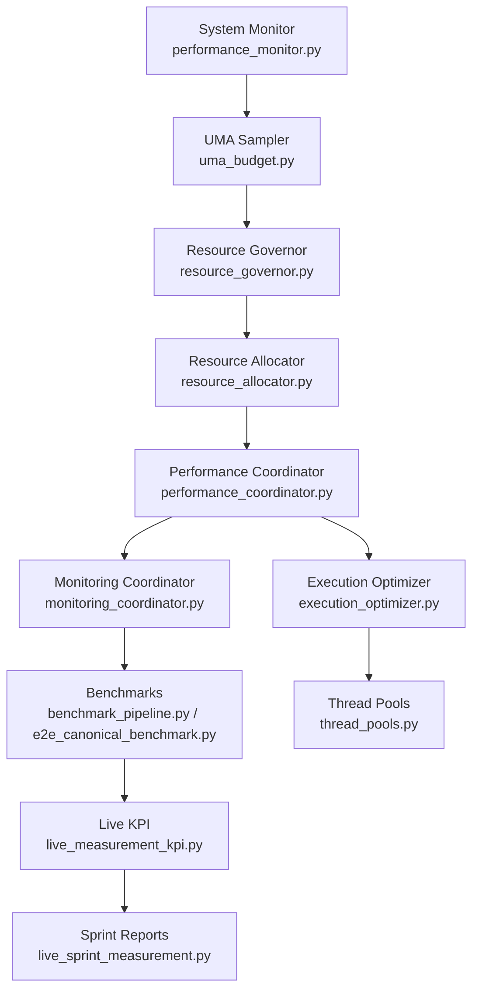

**Diagram sources**
- [performance_monitor.py:240-456](file://utils/performance_monitor.py#L240-L456)
- [uma_budget.py:253-311](file://utils/uma_budget.py#L253-L311)
- [resource_governor.py:314-371](file://core/resource_governor.py#L314-L371)
- [resource_allocator.py:640-659](file://coordinators/resource_allocator.py#L640-L659)
- [performance_coordinator.py:551-800](file://coordinators/performance_coordinator.py#L551-L800)
- [monitoring_coordinator.py:101-200](file://coordinators/monitoring_coordinator.py#L101-L200)
- [benchmark_pipeline.py:1-381](file://benchmarks/benchmark_pipeline.py#L1-L381)
- [e2e_canonical_benchmark.py:1-484](file://benchmarks/e2e_canonical_benchmark.py#L1-L484)
- [live_measurement_kpi.py:180-272](file://benchmarks/live_measurement_kpi.py#L180-L272)
- [live_sprint_measurement.py:212-244](file://benchmarks/live_sprint_measurement.py#L212-L244)
- [execution_optimizer.py:1021-1064](file://utils/execution_optimizer.py#L1021-L1064)
- [thread_pools.py:1-43](file://utils/thread_pools.py#L1-L43)

## Detailed Component Analysis

### Signpost Profiler
The signpost profiler provides deterministic, low-overhead timing for code sections on macOS using kdebug_signpost. It generates consistent signpost codes and offers a safe harness with fallbacks for non-Darwin platforms.

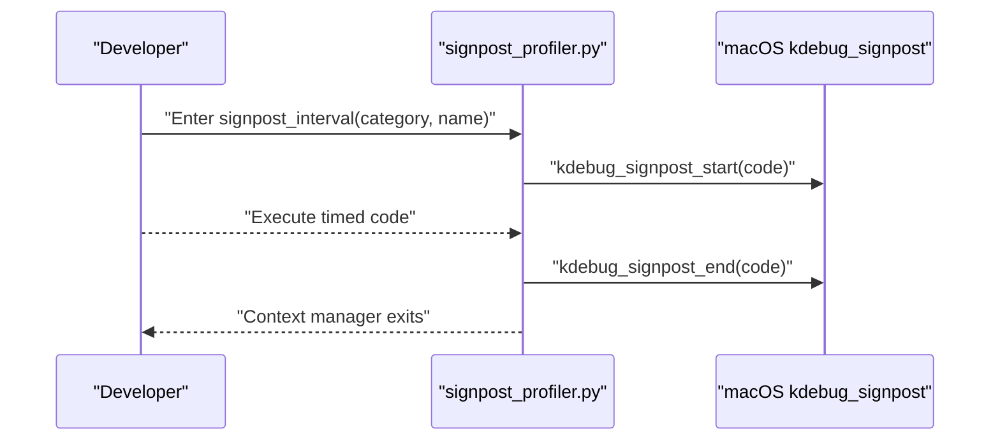

**Diagram sources**
- [signpost_profiler.py:42-66](file://utils/signpost_profiler.py#L42-L66)

**Section sources**
- [signpost_profiler.py:1-79](file://utils/signpost_profiler.py#L1-L79)

### Performance Monitor and System Metrics
The Performance Monitor tracks throughput, speedup vs. baseline, and quality scores. The System Monitor samples CPU, memory, thermal state, and memory pressure, emitting periodic snapshots and triggering recommendations.

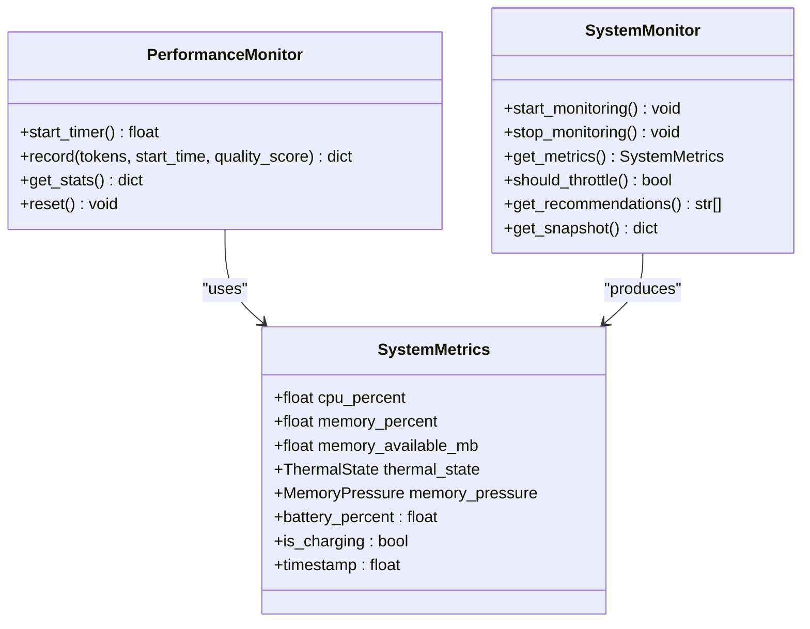

**Diagram sources**
- [performance_monitor.py:69-140](file://utils/performance_monitor.py#L69-L140)
- [performance_monitor.py:240-456](file://utils/performance_monitor.py#L240-L456)

**Section sources**
- [performance_monitor.py:1-537](file://utils/performance_monitor.py#L1-L537)

### Unified Memory Budget and MLX Memory
The UMA sampler consolidates system RAM and MLX memory to compute pressure levels and supports an async watchdog with debounced callbacks. MLX memory utilities provide active/peak/cache metrics and pressure classification.

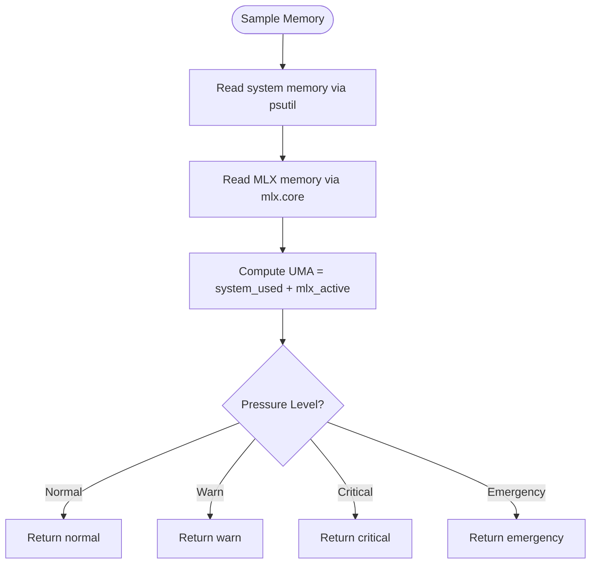

**Diagram sources**
- [uma_budget.py:182-227](file://utils/uma_budget.py#L182-L227)
- [mlx_memory.py:156-214](file://utils/mlx_memory.py#L156-L214)

**Section sources**
- [uma_budget.py:1-507](file://utils/uma_budget.py#L1-L507)
- [mlx_memory.py:140-259](file://utils/mlx_memory.py#L140-L259)

### Resource Governance Patterns
Resource Governor evaluates system memory usage against thresholds, applies hysteresis to prevent thrashing, and enables I/O-only mode when appropriate. It also supports priority-based reservations and cost-model overrun risk checks.

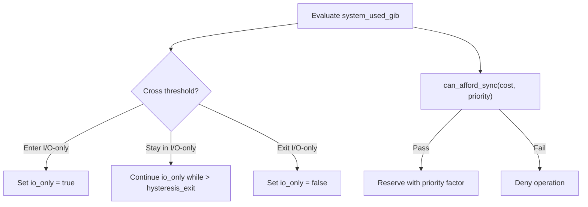

**Diagram sources**
- [resource_governor.py:314-371](file://core/resource_governor.py#L314-L371)
- [resource_governor.py:286-284](file://core/resource_governor.py#L286-L284)

**Section sources**
- [resource_governor.py:1-371](file://core/resource_governor.py#L1-L371)

### Resource Allocation and Concurrency Control
Resource Allocator optimizes active allocations by updating actual usage based on current capacity and calculating efficiency scores. It also sets memory efficiency mode for improved memory usage.

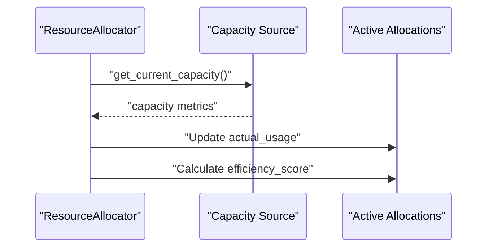

**Diagram sources**
- [resource_allocator.py:640-659](file://coordinators/resource_allocator.py#L640-L659)

**Section sources**
- [resource_allocator.py:640-659](file://coordinators/resource_allocator.py#L640-L659)

### Performance Coordinator: Agent Pooling and Load Balancing
The Performance Coordinator coordinates agent pooling, intelligent load balancing, and async execution optimization. It identifies bottlenecks (high memory, slow agents, circuit breakers, high concurrency) and applies targeted optimizations.

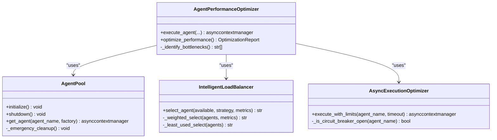

**Diagram sources**
- [performance_coordinator.py:116-335](file://coordinators/performance_coordinator.py#L116-L335)
- [performance_coordinator.py:337-452](file://coordinators/performance_coordinator.py#L337-L452)
- [performance_coordinator.py:454-550](file://coordinators/performance_coordinator.py#L454-L550)
- [performance_coordinator.py:551-800](file://coordinators/performance_coordinator.py#L551-L800)

**Section sources**
- [performance_coordinator.py:1-807](file://coordinators/performance_coordinator.py#L1-L807)

### Monitoring Coordinator: System Metrics and Benchmarking
The Monitoring Coordinator aggregates system metrics, runs performance benchmarks (CPU, memory, general), maintains history, and triggers alerts on threshold breaches.

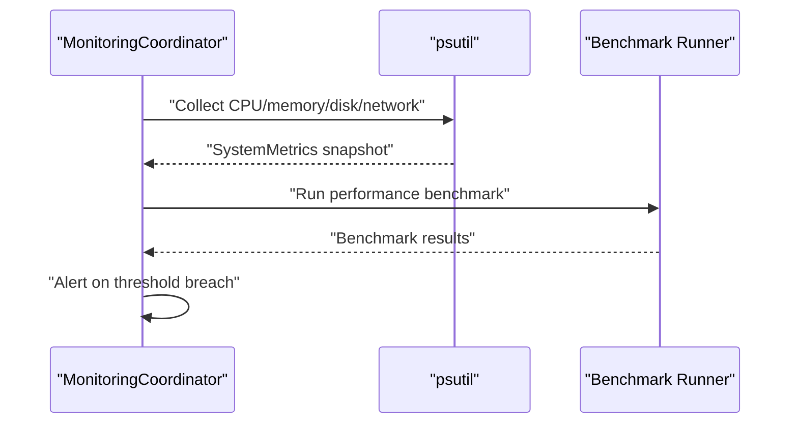

**Diagram sources**
- [monitoring_coordinator.py:424-509](file://coordinators/monitoring_coordinator.py#L424-L509)

**Section sources**
- [monitoring_coordinator.py:1-200](file://coordinators/monitoring_coordinator.py#L1-L200)
- [monitoring_coordinator.py:424-509](file://coordinators/monitoring_coordinator.py#L424-L509)

### Benchmarks: Pipeline and Canonical E2E
The pipeline benchmark measures phase timings and memory deltas across iterations. The canonical E2E benchmark captures findings/minute, dedup ratio, sidecar totals, and memory ceilings in hermetic mode.

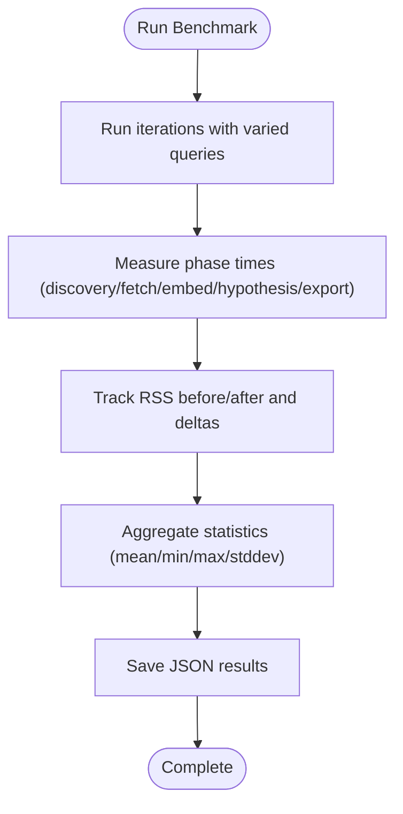

**Diagram sources**
- [benchmark_pipeline.py:53-158](file://benchmarks/benchmark_pipeline.py#L53-L158)
- [benchmark_pipeline.py:161-210](file://benchmarks/benchmark_pipeline.py#L161-L210)
- [e2e_canonical_benchmark.py:211-382](file://benchmarks/e2e_canonical_benchmark.py#L211-L382)

**Section sources**
- [benchmark_pipeline.py:1-381](file://benchmarks/benchmark_pipeline.py#L1-L381)
- [e2e_canonical_benchmark.py:1-484](file://benchmarks/e2e_canonical_benchmark.py#L1-L484)

### Live KPI and Sprint Measurement
Live KPI derivation computes actionable metrics from runtime truths, acquisition strategies, and scheduler exits. Sprint measurement stamps profile metadata and extracts canonical acquisition reports for measurement.

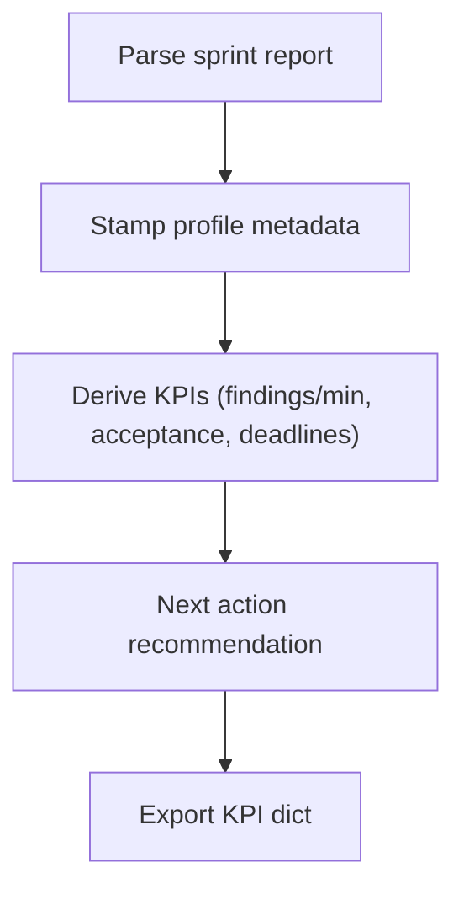

**Diagram sources**
- [live_sprint_measurement.py:212-244](file://benchmarks/live_sprint_measurement.py#L212-L244)
- [live_measurement_kpi.py:180-272](file://benchmarks/live_measurement_kpi.py#L180-L272)

**Section sources**
- [live_sprint_measurement.py:212-244](file://benchmarks/live_sprint_measurement.py#L212-L244)
- [live_measurement_kpi.py:1-935](file://benchmarks/live_measurement_kpi.py#L1-L935)

### Execution Optimizer and Backpressure Probes
The execution optimizer monitors resource usage and exports performance reports. Backpressure probes compare unbounded vs. bounded parallel execution to assess memory bursts and task length histograms.

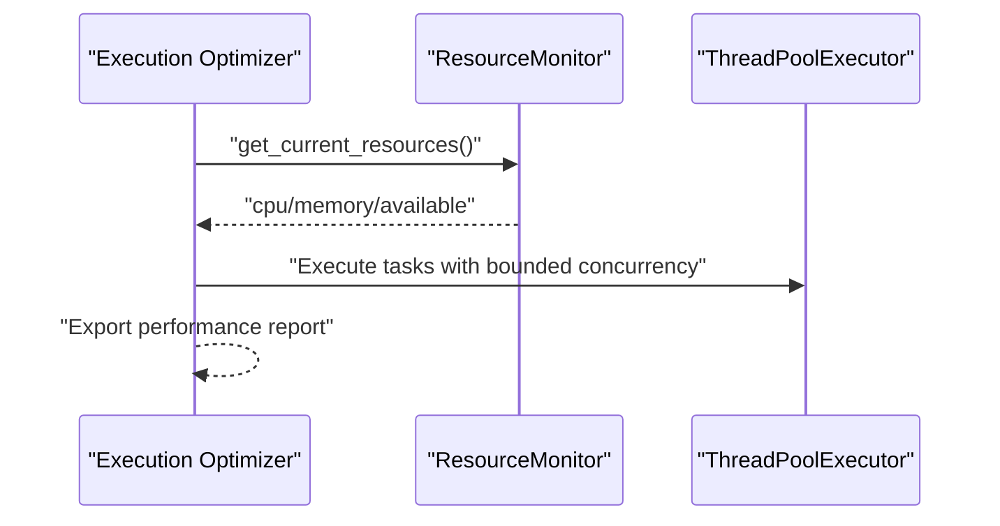

**Diagram sources**
- [execution_optimizer.py:1054-1064](file://utils/execution_optimizer.py#L1054-L1064)
- [probe_f214m_execution_optimizer_backpressure.py:136-314](file://tests/profiling/probe_f214m_execution_optimizer_backpressure.py#L136-L314)

**Section sources**
- [execution_optimizer.py:1021-1064](file://utils/execution_optimizer.py#L1021-L1064)
- [probe_f214m_execution_optimizer_backpressure.py:136-314](file://tests/profiling/probe_f214m_execution_optimizer_backpressure.py#L136-L314)

## Dependency Analysis
The performance stack exhibits clear separation of concerns:
- Sampling and monitoring depend on psutil and platform-specific APIs.
- Resource governance depends on UMA and MLX memory metrics.
- Orchestration components depend on governance and allocator outputs.
- Benchmarks and KPI modules depend on orchestration and runtime reports.

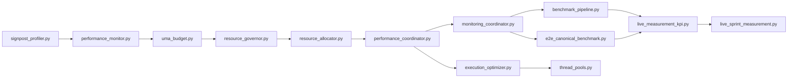

**Diagram sources**
- [signpost_profiler.py:1-79](file://utils/signpost_profiler.py#L1-L79)
- [performance_monitor.py:1-537](file://utils/performance_monitor.py#L1-L537)
- [uma_budget.py:1-507](file://utils/uma_budget.py#L1-L507)
- [resource_governor.py:1-371](file://core/resource_governor.py#L1-L371)
- [resource_allocator.py:640-659](file://coordinators/resource_allocator.py#L640-L659)
- [performance_coordinator.py:1-807](file://coordinators/performance_coordinator.py#L1-L807)
- [monitoring_coordinator.py:1-200](file://coordinators/monitoring_coordinator.py#L1-L200)
- [benchmark_pipeline.py:1-381](file://benchmarks/benchmark_pipeline.py#L1-L381)
- [e2e_canonical_benchmark.py:1-484](file://benchmarks/e2e_canonical_benchmark.py#L1-L484)
- [live_measurement_kpi.py:1-935](file://benchmarks/live_measurement_kpi.py#L1-L935)
- [live_sprint_measurement.py:212-244](file://benchmarks/live_sprint_measurement.py#L212-L244)
- [execution_optimizer.py:1021-1064](file://utils/execution_optimizer.py#L1021-L1064)
- [thread_pools.py:1-43](file://utils/thread_pools.py#L1-L43)

**Section sources**
- [performance_monitor.py:1-537](file://utils/performance_monitor.py#L1-L537)
- [uma_budget.py:1-507](file://utils/uma_budget.py#L1-L507)
- [resource_governor.py:1-371](file://core/resource_governor.py#L1-L371)
- [resource_allocator.py:640-659](file://coordinators/resource_allocator.py#L640-L659)
- [performance_coordinator.py:1-807](file://coordinators/performance_coordinator.py#L1-L807)
- [monitoring_coordinator.py:1-200](file://coordinators/monitoring_coordinator.py#L1-L200)
- [benchmark_pipeline.py:1-381](file://benchmarks/benchmark_pipeline.py#L1-L381)
- [e2e_canonical_benchmark.py:1-484](file://benchmarks/e2e_canonical_benchmark.py#L1-L484)
- [live_measurement_kpi.py:1-935](file://benchmarks/live_measurement_kpi.py#L1-L935)
- [live_sprint_measurement.py:212-244](file://benchmarks/live_sprint_measurement.py#L212-L244)
- [execution_optimizer.py:1021-1064](file://utils/execution_optimizer.py#L1021-L1064)
- [thread_pools.py:1-43](file://utils/thread_pools.py#L1-L43)

## Performance Considerations
- CPU optimization: Use bounded concurrency, adaptive load balancing, and thread pools tuned to Apple Silicon core counts. Prefer async I/O and minimize blocking operations.
- Memory optimization: Leverage Resource Governor thresholds, enable I/O-only mode under pressure, and configure MLX cache/memory limits. Monitor UMA and MLX pressure levels continuously.
- I/O performance: Employ asynchronous patterns, bounded parallelism, and efficient batching. Use signpost profiling to identify I/O hotspots.
- Benchmarking: Run pipeline and canonical benchmarks regularly; track findings/minute, dedup ratio, sidecar totals, and memory ceilings. Compare across configurations and versions.
- KPI measurement: Derive actionable KPIs from runtime truths and acquisition strategies; use next-action recommendations to guide remediation.
- Regression detection: Track benchmark regressions and KPI drift; correlate with resource pressure and operational changes.

[No sources needed since this section provides general guidance]

## Troubleshooting Guide
- Memory pressure warnings: Inspect UMA and MLX pressure levels; trigger MLX cache cleanup on critical thresholds; review Resource Governor decisions.
- High memory usage: Review agent pool cleanup behavior, emergency cleanup triggers, and active allocation efficiency scores.
- Slow agents: Investigate circuit breaker states, execution timeouts, and load balancer weights; adjust strategies accordingly.
- Performance regressions: Compare benchmark results across runs; analyze phase timings and memory deltas; correlate with configuration changes.
- Profiling gaps: Ensure signpost profiler availability on macOS; verify deterministic signpost codes; use periodic system snapshot emissions for trace integration.

**Section sources**
- [uma_budget.py:318-507](file://utils/uma_budget.py#L318-L507)
- [resource_governor.py:314-371](file://core/resource_governor.py#L314-L371)
- [performance_coordinator.py:732-793](file://coordinators/performance_coordinator.py#L732-L793)
- [monitoring_coordinator.py:424-509](file://coordinators/monitoring_coordinator.py#L424-L509)
- [benchmark_pipeline.py:161-210](file://benchmarks/benchmark_pipeline.py#L161-L210)
- [e2e_canonical_benchmark.py:385-451](file://benchmarks/e2e_canonical_benchmark.py#L385-L451)

## Conclusion
Hledac Universal provides a robust, layered performance stack integrating low-level sampling, policy-driven resource governance, and high-level orchestration. By leveraging signpost profiling, continuous system monitoring, UMA/MLX pressure insights, and comprehensive benchmarks, teams can identify bottlenecks, apply targeted optimizations, and maintain stable performance under varying workloads.

[No sources needed since this section summarizes without analyzing specific files]

## Appendices
- Practical workflows:
  - Enable signpost profiling for suspected hotspots; correlate with system snapshots.
  - Run canonical benchmarks before and after changes; track findings/minute and memory ceilings.
  - Use Performance Coordinator’s auto-optimization and bottleneck identification; adjust agent pool sizes and load balancing strategies.
  - Monitor Resource Governor decisions and I/O-only mode transitions; tune thresholds for your workload.
- Benchmark interpretation:
  - Favor reductions in P95 latencies and stable memory ceilings.
  - Track dedup ratio improvements alongside throughput gains.
  - Use KPIs to guide scheduling and resource allocation adjustments.

[No sources needed since this section provides general guidance]