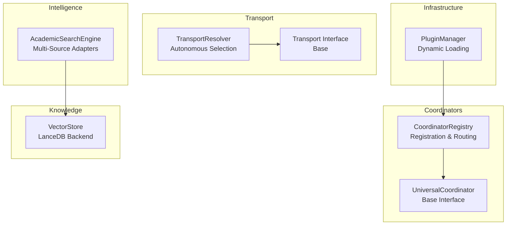
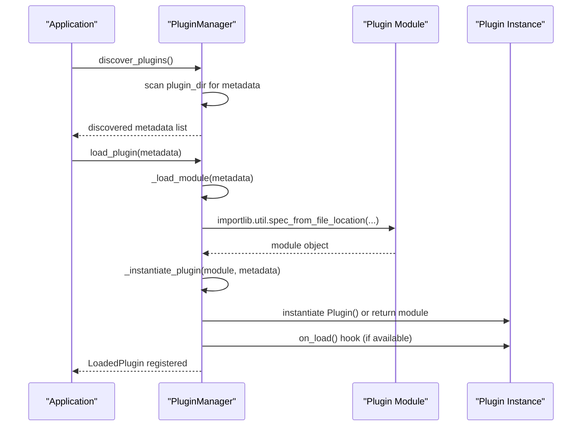
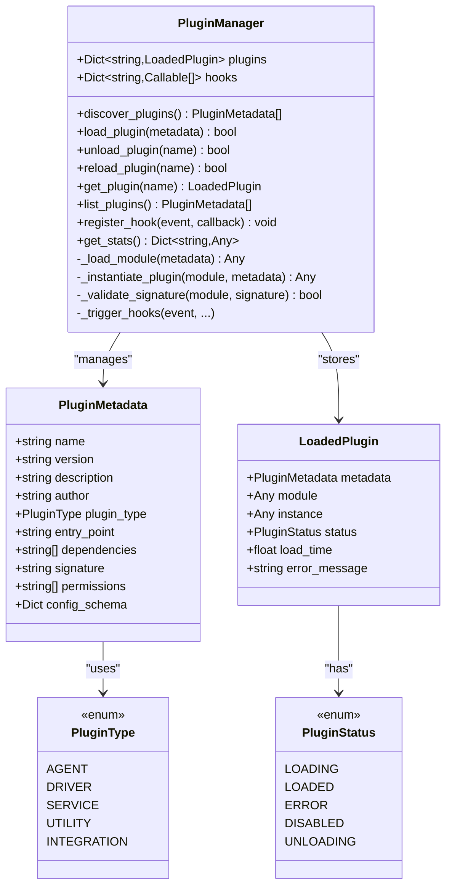
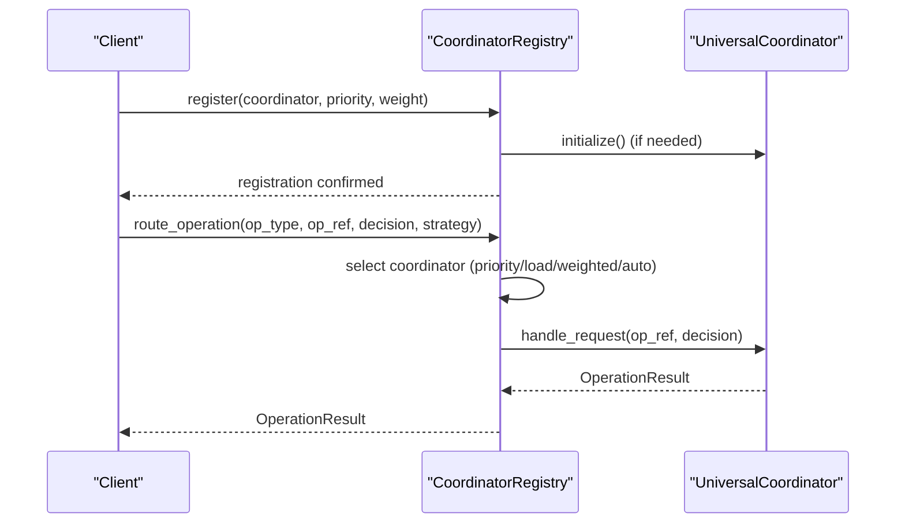
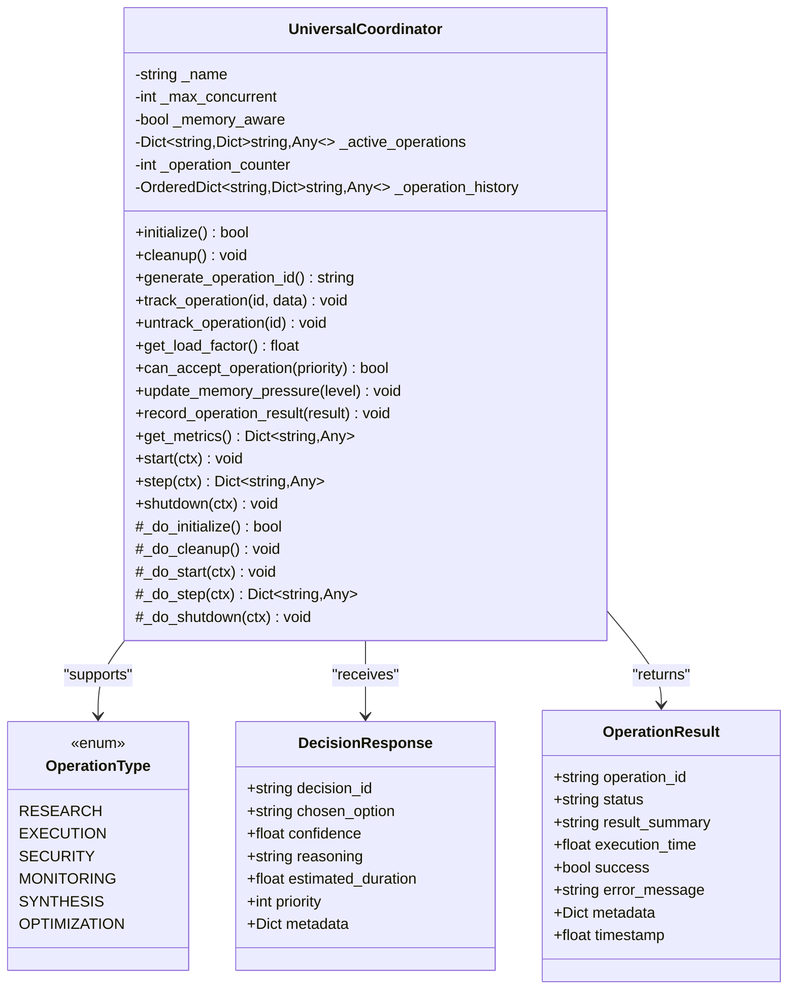
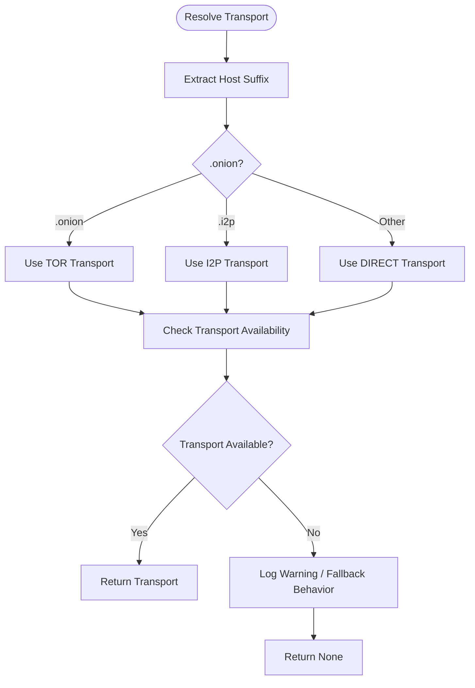
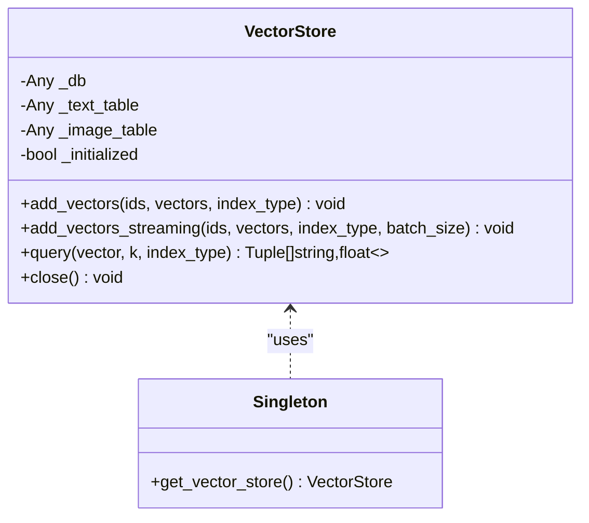
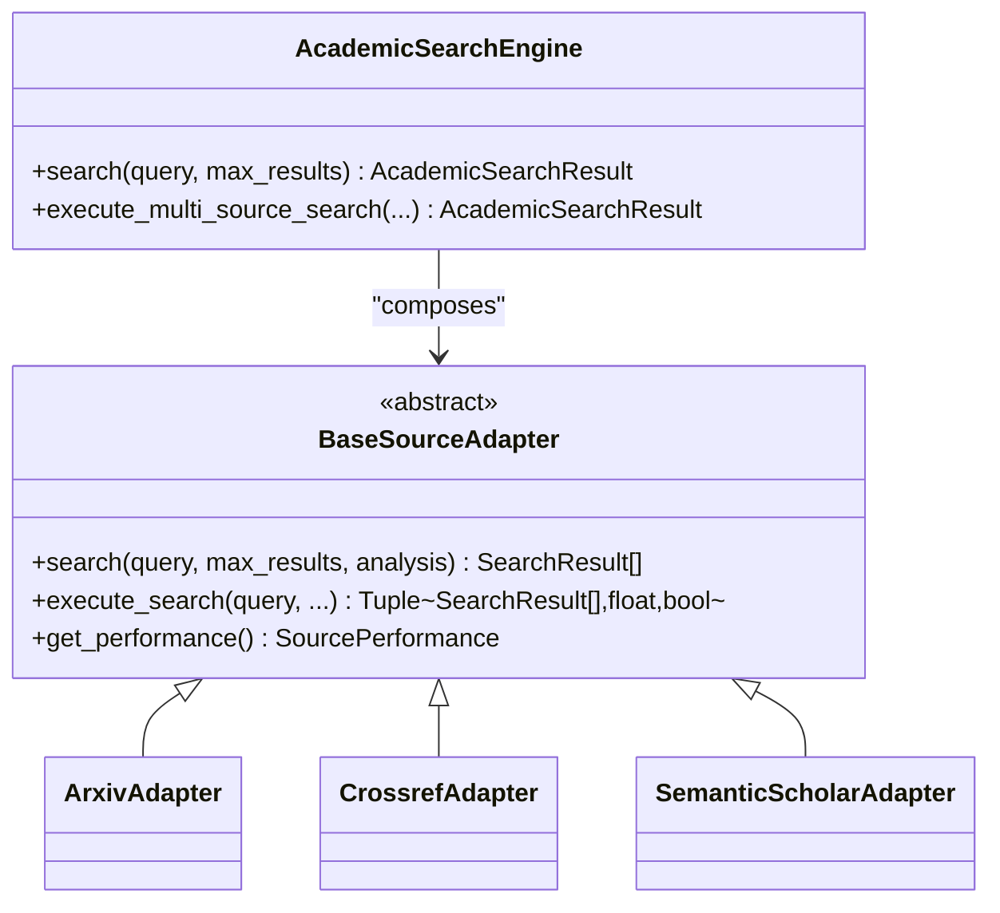
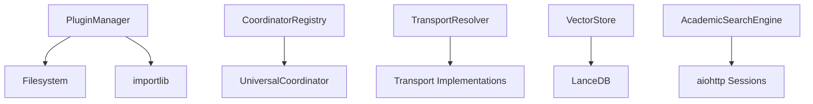

# Plugin System Architecture

<cite>
**Referenced Files in This Document**
- [plugin_manager.py](file://infrastructure/plugin_manager.py)
- [coordinator_registry.py](file://coordinators/coordinator_registry.py)
- [base.py](file://coordinators/base.py)
- [research_coordinator.py](file://coordinators/research_coordinator.py)
- [transport/base.py](file://transport/base.py)
- [transport_resolver.py](file://transport/transport_resolver.py)
- [vector_store.py](file://knowledge/vector_store.py)
- [academic_search.py](file://intelligence/academic_search.py)
</cite>

## Table of Contents
1. [Introduction](#introduction)
2. [Project Structure](#project-structure)
3. [Core Components](#core-components)
4. [Architecture Overview](#architecture-overview)
5. [Detailed Component Analysis](#detailed-component-analysis)
6. [Dependency Analysis](#dependency-analysis)
7. [Performance Considerations](#performance-considerations)
8. [Troubleshooting Guide](#troubleshooting-guide)
9. [Conclusion](#conclusion)
10. [Appendices](#appendices)

## Introduction
This document describes the plugin system architecture in Hledac Universal, focusing on the dynamic plugin loading framework, coordinator registry mechanisms, and extensibility patterns. It explains the plugin lifecycle, registration processes, and dependency injection patterns. It also provides practical guidance for developing custom plugins for transport layers, storage backends, and intelligence modules, along with configuration management, runtime loading, isolation, error handling, and performance considerations.

## Project Structure
The plugin system spans several subsystems:
- Infrastructure: Dynamic plugin loading and lifecycle management
- Coordinators: Extensible coordinator registry and base interfaces
- Transport: Pluggable transport abstractions and resolver
- Intelligence: Modular intelligence modules (e.g., academic search)
- Knowledge: Storage backends (e.g., vector stores)

**Diagram sources**
- [plugin_manager.py:91-462](file://infrastructure/plugin_manager.py#L91-L462)
- [coordinator_registry.py:49-602](file://coordinators/coordinator_registry.py#L49-L602)
- [base.py:88-553](file://coordinators/base.py#L88-L553)
- [transport_resolver.py:95-361](file://transport/transport_resolver.py#L95-L361)
- [transport/base.py:4-24](file://transport/base.py#L4-L24)
- [vector_store.py:44-308](file://knowledge/vector_store.py#L44-L308)
- [academic_search.py:797-1379](file://intelligence/academic_search.py#L797-L1379)

**Section sources**
- [plugin_manager.py:1-462](file://infrastructure/plugin_manager.py#L1-L462)
- [coordinator_registry.py:1-602](file://coordinators/coordinator_registry.py#L1-L602)
- [base.py:1-553](file://coordinators/base.py#L1-L553)
- [transport_resolver.py:1-361](file://transport/transport_resolver.py#L1-L361)
- [transport/base.py:1-24](file://transport/base.py#L1-L24)
- [vector_store.py:1-308](file://knowledge/vector_store.py#L1-L308)
- [academic_search.py:1-1379](file://intelligence/academic_search.py#L1-L1379)

## Core Components
This section outlines the central building blocks of the plugin system.

- PluginManager: Centralized dynamic plugin loader with discovery, instantiation, lifecycle hooks, and hot-reload support.
- CoordinatorRegistry: Manages UniversalCoordinator instances, supports registration, routing strategies, health monitoring, and statistics.
- UniversalCoordinator: Base interface for coordinators with operation lifecycle, load management, memory awareness, and metrics.
- TransportResolver: Autonomous transport selection based on URL classification and runtime context.
- VectorStore: Pluggable storage backend with lazy initialization and streaming batch operations.
- AcademicSearchEngine: Example intelligence module with pluggable adapters and query expansion.

**Section sources**
- [plugin_manager.py:91-462](file://infrastructure/plugin_manager.py#L91-L462)
- [coordinator_registry.py:49-602](file://coordinators/coordinator_registry.py#L49-L602)
- [base.py:88-553](file://coordinators/base.py#L88-L553)
- [transport_resolver.py:95-361](file://transport/transport_resolver.py#L95-L361)
- [vector_store.py:44-308](file://knowledge/vector_store.py#L44-L308)
- [academic_search.py:797-1379](file://intelligence/academic_search.py#L797-L1379)

## Architecture Overview
The plugin system integrates three pillars:
- Dynamic Plugin Loading: Loads external Python modules, validates signatures, instantiates plugins, and triggers lifecycle hooks.
- Coordinator Registry: Provides a centralized registry for UniversalCoordinator implementations with routing strategies and health monitoring.
- Extensibility Patterns: Interfaces for transport, intelligence, and storage enable modular development and runtime composition.

**Diagram sources**
- [plugin_manager.py:120-278](file://infrastructure/plugin_manager.py#L120-L278)

**Section sources**
- [plugin_manager.py:120-278](file://infrastructure/plugin_manager.py#L120-L278)

## Detailed Component Analysis

### PluginManager: Dynamic Plugin Loading
The PluginManager provides:
- Plugin discovery from directory-based or single-file plugins
- Metadata extraction from plugin.json or module-level hints
- Secure module loading with optional signature validation
- Instantiation of plugin classes or modules
- Lifecycle hooks (on_load, on_unload)
- Hot-reload support and statistics

**Diagram sources**
- [plugin_manager.py:47-462](file://infrastructure/plugin_manager.py#L47-L462)

**Section sources**
- [plugin_manager.py:91-462](file://infrastructure/plugin_manager.py#L91-L462)

### CoordinatorRegistry: Coordinator Management
The CoordinatorRegistry:
- Registers UniversalCoordinator instances with priority and weight
- Routes operations to appropriate coordinators using multiple strategies
- Monitors health and maintains statistics
- Supports default coordinator assignment per operation type

**Diagram sources**
- [coordinator_registry.py:79-231](file://coordinators/coordinator_registry.py#L79-L231)
- [base.py:149-164](file://coordinators/base.py#L149-L164)

**Section sources**
- [coordinator_registry.py:49-602](file://coordinators/coordinator_registry.py#L49-L602)
- [base.py:88-553](file://coordinators/base.py#L88-L553)

### UniversalCoordinator: Base Interface
The UniversalCoordinator defines:
- Operation lifecycle: generate_operation_id, track_operation, untrack_operation
- Load management: get_load_factor, can_accept_operation, capacity info
- Memory awareness: update_memory_pressure, check_memory_pressure
- Metrics: record_operation_result, get_metrics
- Stable spine interface: start, step, shutdown

**Diagram sources**
- [base.py:33-553](file://coordinators/base.py#L33-L553)

**Section sources**
- [base.py:88-553](file://coordinators/base.py#L88-L553)

### TransportResolver: Pluggable Transport Selection
The TransportResolver:
- Classifies URLs into transport domains (.onion, .i2p, .freenet, direct)
- Autonomously selects transports based on context (anonymity, risk)
- Imports transport implementations lazily
- Provides policy gates for URL classification

**Diagram sources**
- [transport_resolver.py:152-239](file://transport/transport_resolver.py#L152-L239)

**Section sources**
- [transport_resolver.py:95-361](file://transport/transport_resolver.py#L95-L361)
- [transport/base.py:4-24](file://transport/base.py#L4-L24)

### VectorStore: Pluggable Storage Backend
The VectorStore:
- Provides a singleton interface backed by LanceDB
- Supports separate indices for text and image embeddings
- Implements lazy initialization and streaming batch operations
- Validates dimensions and normalizes data types

**Diagram sources**
- [vector_store.py:44-308](file://knowledge/vector_store.py#L44-L308)

**Section sources**
- [vector_store.py:44-308](file://knowledge/vector_store.py#L44-L308)

### AcademicSearchEngine: Intelligence Module with Adapters
The AcademicSearchEngine demonstrates:
- Pluggable source adapters (ArXiv, Crossref, Semantic Scholar)
- Query expansion and deduplication
- Performance tracking per source
- Shared session management for HTTP requests

**Diagram sources**
- [academic_search.py:797-1379](file://intelligence/academic_search.py#L797-L1379)

**Section sources**
- [academic_search.py:797-1379](file://intelligence/academic_search.py#L797-L1379)

## Dependency Analysis
The plugin system exhibits low coupling and high cohesion:
- PluginManager depends on importlib and filesystem scanning
- CoordinatorRegistry depends on UniversalCoordinator interface
- TransportResolver depends on optional transport implementations
- VectorStore depends on LanceDB/pyarrow
- Intelligence modules depend on shared utilities and HTTP sessions

**Diagram sources**
- [plugin_manager.py:29-42](file://infrastructure/plugin_manager.py#L29-L42)
- [coordinator_registry.py:27-34](file://coordinators/coordinator_registry.py#L27-L34)
- [transport_resolver.py:134-150](file://transport/transport_resolver.py#L134-L150)
- [vector_store.py:70-120](file://knowledge/vector_store.py#L70-L120)
- [academic_search.py:35-48](file://intelligence/academic_search.py#L35-L48)

**Section sources**
- [plugin_manager.py:29-42](file://infrastructure/plugin_manager.py#L29-L42)
- [coordinator_registry.py:27-34](file://coordinators/coordinator_registry.py#L27-L34)
- [transport_resolver.py:134-150](file://transport/transport_resolver.py#L134-L150)
- [vector_store.py:70-120](file://knowledge/vector_store.py#L70-L120)
- [academic_search.py:35-48](file://intelligence/academic_search.py#L35-L48)

## Performance Considerations
- PluginManager
  - Uses importlib for efficient module loading
  - Thread-safe locking around registry operations
  - Hot-reload minimizes downtime during updates
- CoordinatorRegistry
  - Asynchronous locks for concurrent access
  - Weighted and priority-based selection reduces contention
  - Memory-aware load factor prevents overload on constrained systems
- TransportResolver
  - Fast suffix-based classification avoids network calls
  - Lazy import of transport implementations reduces startup overhead
- VectorStore
  - Streaming batch adds reduce peak memory usage on M1 systems
  - Lazy initialization defers expensive operations until needed
- AcademicSearchEngine
  - Shared HTTP sessions reduce connection overhead
  - Performance tracking per source enables adaptive routing

[No sources needed since this section provides general guidance]

## Troubleshooting Guide
Common issues and resolutions:
- Plugin loading failures
  - Verify plugin.json or module-level metadata
  - Check entry_point path and module availability
  - Review signature validation and permissions
- Coordinator registration errors
  - Ensure initialize() succeeds and coordinator is available
  - Confirm supported operations match routing expectations
- Transport selection problems
  - Validate URL suffix classification
  - Confirm transport implementations are importable
- Storage backend issues
  - Ensure LanceDB installation and write permissions
  - Check dimension mismatches and data normalization
- Intelligence module errors
  - Verify API keys and rate limits
  - Monitor adapter-specific timeouts and error logs

**Section sources**
- [plugin_manager.py:238-277](file://infrastructure/plugin_manager.py#L238-L277)
- [coordinator_registry.py:98-130](file://coordinators/coordinator_registry.py#L98-L130)
- [transport_resolver.py:134-150](file://transport/transport_resolver.py#L134-L150)
- [vector_store.py:115-120](file://knowledge/vector_store.py#L115-L120)
- [academic_search.py:345-351](file://intelligence/academic_search.py#L345-L351)

## Conclusion
Hledac Universal’s plugin system combines dynamic loading, coordinator orchestration, and pluggable interfaces to enable flexible, extensible architectures. The PluginManager, CoordinatorRegistry, TransportResolver, VectorStore, and intelligence modules collectively provide a robust foundation for building custom plugins across transport, storage, and intelligence domains while maintaining isolation, reliability, and performance.

[No sources needed since this section summarizes without analyzing specific files]

## Appendices

### Step-by-Step: Creating a Custom Plugin (Transport Layer)
1. Define a transport class implementing the Transport interface.
2. Implement start, stop, wait_ready, register_handler, and send_message.
3. Optionally integrate with session management and lifecycle controls.
4. Package the transport as a standalone module or directory with plugin.json metadata.
5. Place the plugin in the configured plugin directory.
6. Use PluginManager to discover and load the plugin.
7. Register lifecycle hooks (on_load/on_unload) for initialization and cleanup.

**Section sources**
- [transport/base.py:4-24](file://transport/base.py#L4-L24)
- [plugin_manager.py:120-278](file://infrastructure/plugin_manager.py#L120-L278)

### Step-by-Step: Creating a Custom Plugin (Storage Backend)
1. Implement a storage interface compatible with the expected contract.
2. Add lazy initialization and streaming operations for large datasets.
3. Validate dimensions and normalize data types.
4. Expose a singleton accessor for global use.
5. Integrate with configuration and environment variables.
6. Test with representative datasets and monitor memory usage.

**Section sources**
- [vector_store.py:44-308](file://knowledge/vector_store.py#L44-L308)

### Step-by-Step: Creating a Custom Plugin (Intelligence Module)
1. Define an adapter interface for the intelligence source.
2. Implement search, parsing, and performance tracking methods.
3. Compose adapters into a main engine with query expansion and deduplication.
4. Integrate shared HTTP sessions and rate limiting.
5. Add metrics and error handling for resilience.
6. Package as a plugin and load via PluginManager.

**Section sources**
- [academic_search.py:797-1379](file://intelligence/academic_search.py#L797-L1379)
- [plugin_manager.py:120-278](file://infrastructure/plugin_manager.py#L120-L278)

### Configuration Management
- PluginManager supports plugin.json metadata for dependencies, permissions, and schema.
- TransportResolver uses URL classification and runtime context for selection.
- VectorStore relies on environment-driven configuration for paths and dimensions.
- Intelligence modules use environment variables for API keys and rate limits.

**Section sources**
- [plugin_manager.py:154-207](file://infrastructure/plugin_manager.py#L154-L207)
- [transport_resolver.py:268-318](file://transport/transport_resolver.py#L268-L318)
- [vector_store.py:31-42](file://knowledge/vector_store.py#L31-L42)
- [academic_search.py:89-94](file://intelligence/academic_search.py#L89-L94)

### Runtime Plugin Loading
- Discover plugins from directory or single-file modules.
- Load modules dynamically using importlib.
- Instantiate plugin classes or modules.
- Trigger on_load hooks and maintain plugin registry.
- Support hot-reload by unloading and reloading plugins.

**Section sources**
- [plugin_manager.py:120-417](file://infrastructure/plugin_manager.py#L120-L417)

### Plugin Isolation and Error Handling
- Thread-safe registry operations with locks.
- Signature validation and permission checks (placeholder).
- Graceful degradation in coordinator initialization.
- Dedicated error messages and status tracking in LoadedPlugin.
- Logging for warnings and failures across subsystems.

**Section sources**
- [plugin_manager.py:113-118](file://infrastructure/plugin_manager.py#L113-L118)
- [plugin_manager.py:238-277](file://infrastructure/plugin_manager.py#L238-L277)
- [base.py:180-227](file://coordinators/base.py#L180-L227)

### Testing Strategies and Debugging Techniques
- Unit tests for individual adapters and engines.
- Integration tests for end-to-end flows (e.g., AcademicSearchEngine).
- Mock external APIs and HTTP sessions for deterministic testing.
- Use logging and metrics to trace plugin lifecycle and performance.
- Validate plugin metadata and dependencies before loading.

**Section sources**
- [academic_search.py:249-278](file://intelligence/academic_search.py#L249-L278)
- [plugin_manager.py:257-263](file://infrastructure/plugin_manager.py#L257-L263)

### Deployment Considerations
- Ensure dependencies are installed (e.g., LanceDB for VectorStore).
- Configure environment variables for API keys and paths.
- Use hot-reload in development; prefer restarts in production.
- Monitor coordinator health and load factors.
- Validate transport availability and URL classification logic.

**Section sources**
- [vector_store.py:115-120](file://knowledge/vector_store.py#L115-L120)
- [transport_resolver.py:134-150](file://transport/transport_resolver.py#L134-L150)
- [coordinator_registry.py:370-416](file://coordinators/coordinator_registry.py#L370-L416)