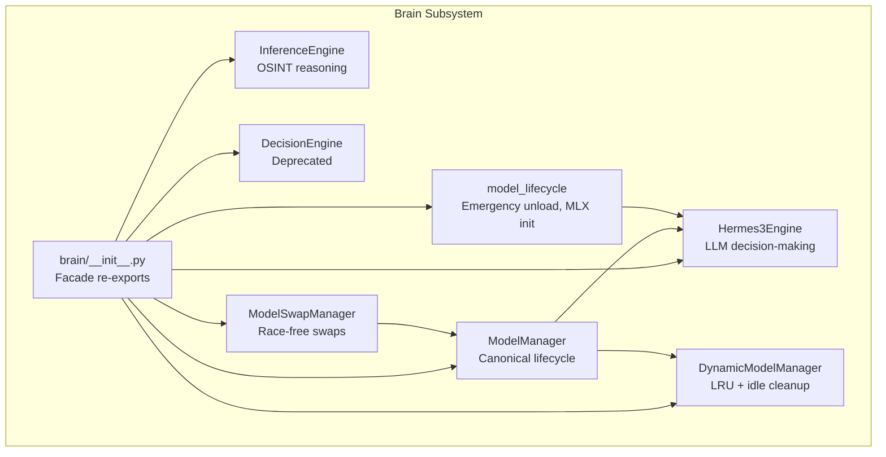
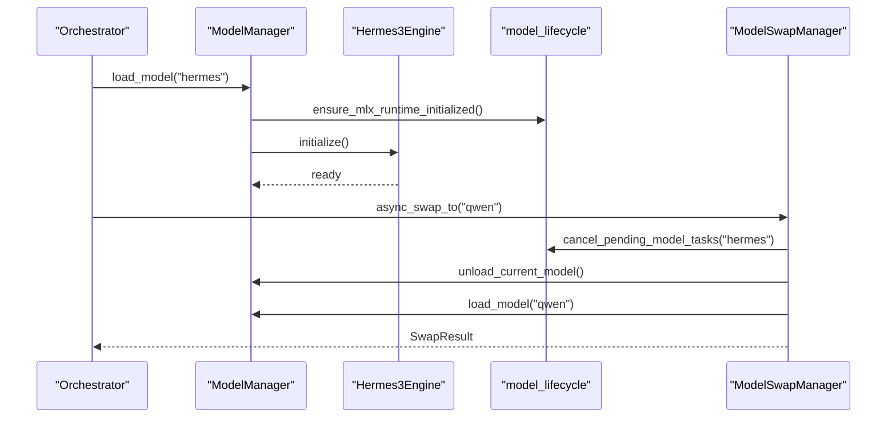
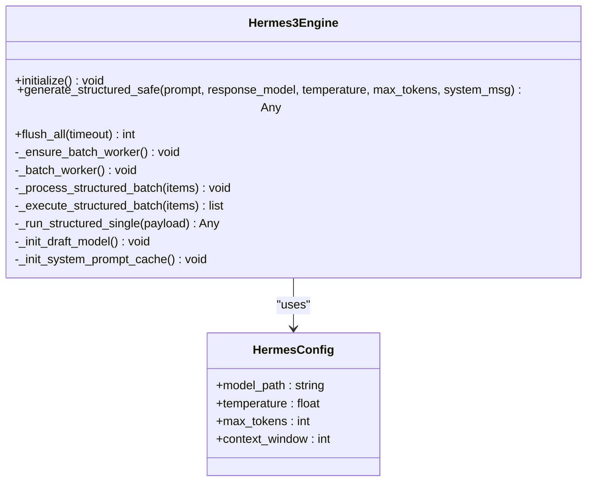
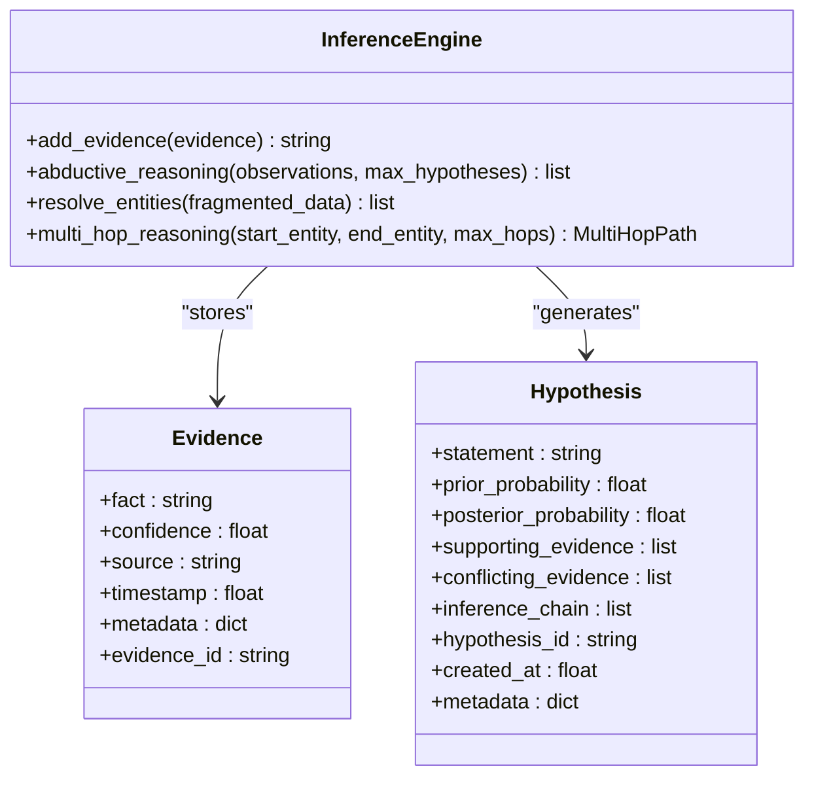
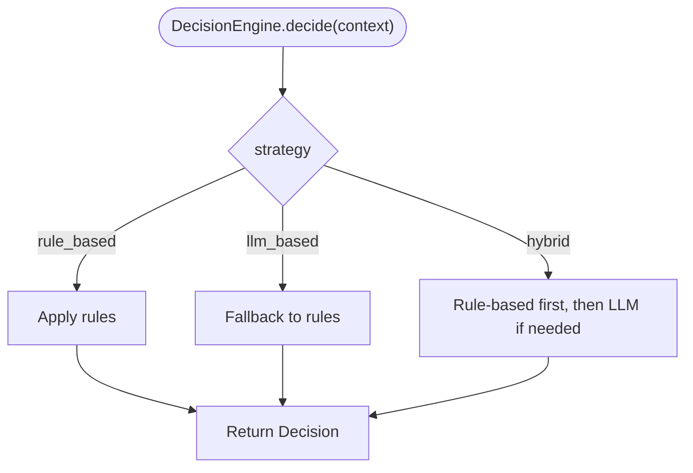
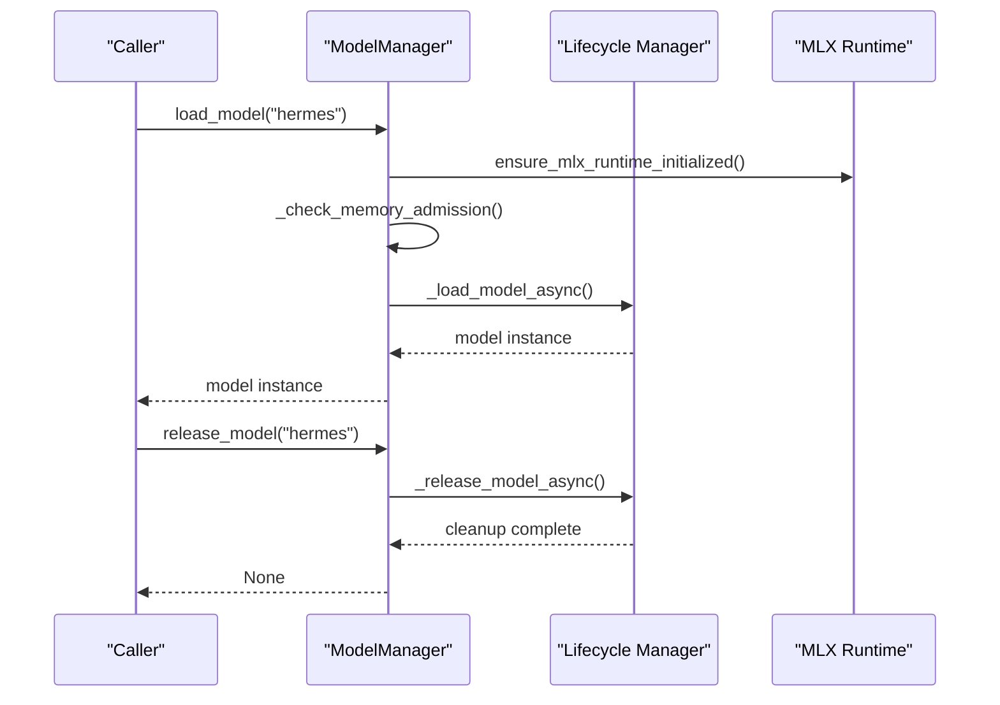
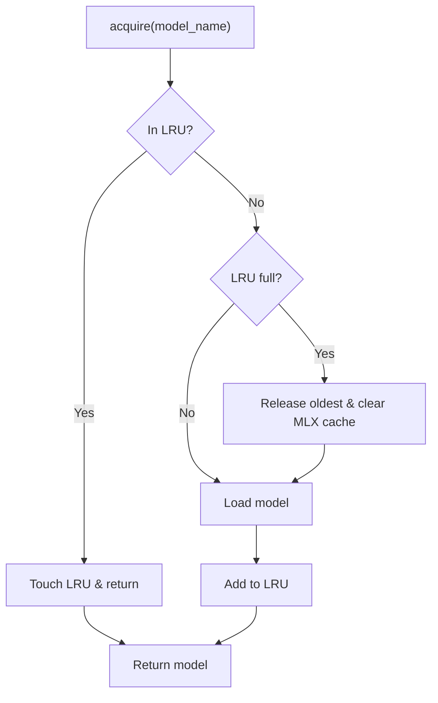
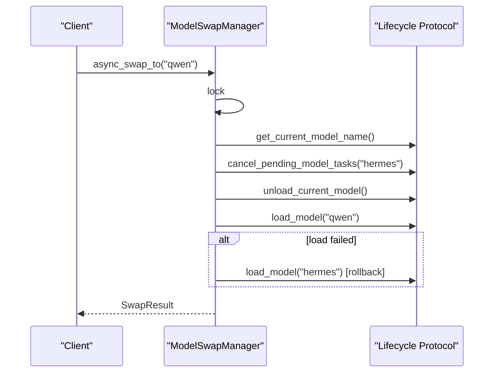
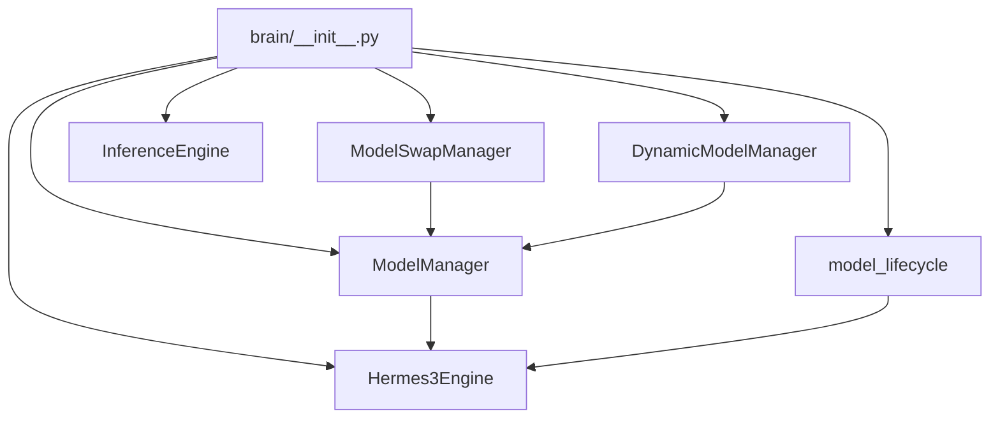

# Brain Engines

<cite>
**Referenced Files in This Document**
- [brain/__init__.py](file://brain/__init__.py)
- [brain/hermes3_engine.py](file://brain/hermes3_engine.py)
- [brain/inference_engine.py](file://brain/inference_engine.py)
- [brain/decision_engine.py](file://brain/decision_engine.py)
- [brain/model_manager.py](file://brain/model_manager.py)
- [brain/dynamic_model_manager.py](file://brain/dynamic_model_manager.py)
- [brain/model_lifecycle.py](file://brain/model_lifecycle.py)
- [brain/model_swap_manager.py](file://brain/model_swap_manager.py)
</cite>

## Table of Contents
1. [Introduction](#introduction)
2. [Project Structure](#project-structure)
3. [Core Components](#core-components)
4. [Architecture Overview](#architecture-overview)
5. [Detailed Component Analysis](#detailed-component-analysis)
6. [Dependency Analysis](#dependency-analysis)
7. [Performance Considerations](#performance-considerations)
8. [Troubleshooting Guide](#troubleshooting-guide)
9. [Conclusion](#conclusion)

## Introduction
This document explains the brain engines subsystem that powers decision-making, reasoning, and model lifecycle management in the Universal Research Orchestrator. It covers:
- Hermes3Engine: LLM-based decision-making with structured generation, batching, and safety controls
- InferenceEngine: Rule-based OSINT reasoning, evidence chaining, and entity resolution
- DecisionEngine: Deprecated helper for basic decision-making (use research flow decider instead)
- Model lifecycle and management: ModelManager, DynamicModelManager, model_lifecycle utilities, and ModelSwapManager
- Integration patterns, configuration, and operational safety

The goal is to make the subsystem understandable for newcomers while providing deep technical insights for experienced developers.

## Project Structure
The brain engines live under the brain/ directory and expose a facade module that selectively re-exports components. The subsystem is organized around:
- Canonical engines (Hermes3Engine, InferenceEngine)
- Lifecycle managers (ModelManager, DynamicModelManager, ModelSwapManager)
- Lifecycle utilities (model_lifecycle, model_phase_facts)
- Facade re-exports (brain/__init__.py)

**Diagram sources**
- [brain/__init__.py:163-236](file://brain/__init__.py#L163-L236)
- [brain/hermes3_engine.py:97-120](file://brain/hermes3_engine.py#L97-L120)
- [brain/inference_engine.py:366-431](file://brain/inference_engine.py#L366-L431)
- [brain/decision_engine.py:55-82](file://brain/decision_engine.py#L55-L82)
- [brain/model_manager.py:175-200](file://brain/model_manager.py#L175-L200)
- [brain/dynamic_model_manager.py:201-248](file://brain/dynamic_model_manager.py#L201-L248)
- [brain/model_swap_manager.py:154-166](file://brain/model_swap_manager.py#L154-L166)
- [brain/model_lifecycle.py:311-331](file://brain/model_lifecycle.py#L311-L331)

**Section sources**
- [brain/__init__.py:14-28](file://brain/__init__.py#L14-L28)
- [brain/__init__.py:163-236](file://brain/__init__.py#L163-L236)

## Core Components
- Hermes3Engine: LLM-based decision-making with ChatML formatting, structured generation, continuous batching, KV cache, and emergency unload safety
- InferenceEngine: Rule-based OSINT reasoning with evidence graphs, Bayesian updates, and MLX-accelerated similarity
- ModelManager: Canonical lifecycle manager enforcing single-model-at-a-time policy on M1 8GB, memory guards, and quantization advisory
- DynamicModelManager: LRU cache with idle timeouts and thrash prevention for non-critical models
- ModelSwapManager: Race-free arbiter for swapping between models (e.g., Qwen↔Hermes) with bounded drain and rollback
- model_lifecycle: Emergency unload seam, MLX runtime initialization, and structured generation sidecar

Key configuration and parameters:
- Hermes3Engine config fields: model_path, temperature, max_tokens, context_window
- InferenceEngine parameters: max_chain_depth, min_confidence_threshold, use_mlx, streaming_batch_size
- ModelManager memory thresholds and model sizes for M1 8GB
- DynamicModelManager: idle_timeout, min_reload_interval, max_loaded_models
- ModelSwapManager: drain_timeout, strict ordering (drain→unload→load)

Return values:
- Hermes3Engine structured generation returns Pydantic models or dicts
- InferenceEngine returns hypotheses, inference steps, resolved entities, and multi-hop paths
- ModelManager methods return model instances or None, with exceptions on admission failures
- DynamicModelManager returns models or triggers evictions
- ModelSwapManager returns SwapResult with detailed outcomes

**Section sources**
- [brain/hermes3_engine.py:75-82](file://brain/hermes3_engine.py#L75-L82)
- [brain/hermes3_engine.py:109-125](file://brain/hermes3_engine.py#L109-L125)
- [brain/inference_engine.py:391-406](file://brain/inference_engine.py#L391-L406)
- [brain/model_manager.py:43-82](file://brain/model_manager.py#L43-L82)
- [brain/dynamic_model_manager.py:212-232](file://brain/dynamic_model_manager.py#L212-L232)
- [brain/model_swap_manager.py:170-185](file://brain/model_swap_manager.py#L170-L185)

## Architecture Overview
The brain engines integrate with orchestrators and runtime systems through well-defined interfaces and lifecycle hooks. The canonical ownership model separates concerns:
- Model acquisition and admission: ModelManager
- Emergency unload and MLX init: model_lifecycle
- Model swapping: ModelSwapManager
- Non-critical model caching: DynamicModelManager
- Decision-making and reasoning: Hermes3Engine and InferenceEngine

**Diagram sources**
- [brain/model_manager.py:544-704](file://brain/model_manager.py#L544-L704)
- [brain/model_lifecycle.py:311-331](file://brain/model_lifecycle.py#L311-L331)
- [brain/model_lifecycle.py:438-528](file://brain/model_lifecycle.py#L438-L528)
- [brain/model_swap_manager.py:198-343](file://brain/model_swap_manager.py#L198-L343)

## Detailed Component Analysis

### Hermes3Engine
Hermes3Engine is the canonical decision-making engine using ChatML formatting and structured generation. It includes:
- Configuration: model_path, temperature, max_tokens, context_window
- Structured generation with Pydantic schemas and outlines grammar-constrained decoding
- Continuous batching with schema-aware segregation, length binning, and adaptive flush intervals
- KV cache and prompt cache for performance
- Emergency unload seam and telemetry counters
- Draft speculative decoding with memory guards

**Diagram sources**
- [brain/hermes3_engine.py:97-120](file://brain/hermes3_engine.py#L97-L120)
- [brain/hermes3_engine.py:75-82](file://brain/hermes3_engine.py#L75-L82)
- [brain/hermes3_engine.py:215-257](file://brain/hermes3_engine.py#L215-L257)
- [brain/hermes3_engine.py:324-441](file://brain/hermes3_engine.py#L324-L441)
- [brain/hermes3_engine.py:524-592](file://brain/hermes3_engine.py#L524-L592)
- [brain/hermes3_engine.py:594-619](file://brain/hermes3_engine.py#L594-L619)
- [brain/hermes3_engine.py:730-795](file://brain/hermes3_engine.py#L730-L795)
- [brain/hermes3_engine.py:796-800](file://brain/hermes3_engine.py#L796-L800)

Key invocation relationships:
- initialize() loads model and optional prompt cache, outlines model, and draft model
- generate_structured_safe() runs in a thread pool executor to avoid blocking
- _batch_worker() processes batches with schema-aware segregation and adaptive flush intervals
- _init_draft_model() selects and loads a smaller draft model based on memory availability

Configuration options:
- model_path: path or HF hub identifier
- temperature: generation temperature for structured outputs
- max_tokens: maximum tokens to generate
- context_window: maximum prompt length

Return values:
- generate_structured_safe(): validated Pydantic model or dict
- flush_all(): number of items drained

Common usage patterns:
- Structured generation with Pydantic schemas via generate_structured_safe()
- Batched generation with _submit_structured_batch() and _batch_worker()
- Emergency unload via is_emergency_unload_requested() checks

**Section sources**
- [brain/hermes3_engine.py:109-125](file://brain/hermes3_engine.py#L109-L125)
- [brain/hermes3_engine.py:669-729](file://brain/hermes3_engine.py#L669-L729)
- [brain/hermes3_engine.py:258-323](file://brain/hermes3_engine.py#L258-L323)
- [brain/hermes3_engine.py:324-441](file://brain/hermes3_engine.py#L324-L441)
- [brain/hermes3_engine.py:524-592](file://brain/hermes3_engine.py#L524-L592)
- [brain/hermes3_engine.py:730-795](file://brain/hermes3_engine.py#L730-L795)

### InferenceEngine
InferenceEngine performs OSINT reasoning with:
- Evidence data model with confidence and metadata
- Inference rules (co-location, temporal proximity, communication patterns, stylometry, behavioral fingerprinting)
- Hypothesis generation with Bayesian updates
- Multi-hop reasoning with path scoring and cycle detection
- MLX-accelerated cosine similarity when available

**Diagram sources**
- [brain/inference_engine.py:57-85](file://brain/inference_engine.py#L57-L85)
- [brain/inference_engine.py:109-149](file://brain/inference_engine.py#L109-L149)
- [brain/inference_engine.py:366-431](file://brain/inference_engine.py#L366-L431)

Processing logic:
- add_evidence() stores evidence with bounded LRU eviction and updates evidence graph
- abductive_reasoning() generates candidate explanations, computes priors and likelihoods, and builds inference chains
- resolve_entities() merges fragmented identities with probabilistic scoring
- multi_hop_reasoning() finds paths between entities with confidence penalties for length and cycle detection

Configuration options:
- max_chain_depth: maximum depth for evidence chaining
- min_confidence_threshold: minimum confidence to consider evidence
- use_mlx: enable MLX acceleration
- streaming_batch_size: batch size for streaming operations

Return values:
- add_evidence(): evidence_id
- abductive_reasoning(): list of Hypothesis
- resolve_entities(): list of ResolvedEntity
- multi_hop_reasoning(): MultiHopPath

**Section sources**
- [brain/inference_engine.py:391-406](file://brain/inference_engine.py#L391-L406)
- [brain/inference_engine.py:688-725](file://brain/inference_engine.py#L688-L725)
- [brain/inference_engine.py:762-800](file://brain/inference_engine.py#L762-L800)
- [brain/inference_engine.py:152-176](file://brain/inference_engine.py#L152-L176)
- [brain/inference_engine.py:249-327](file://brain/inference_engine.py#L249-L327)

### DecisionEngine
DecisionEngine is deprecated and superseded by research flow decider. It provided rule-based, LLM-based, and hybrid decision strategies but is maintained for backward compatibility.

**Diagram sources**
- [brain/decision_engine.py:131-200](file://brain/decision_engine.py#L131-L200)

**Section sources**
- [brain/decision_engine.py:55-82](file://brain/decision_engine.py#L55-L82)
- [brain/decision_engine.py:131-200](file://brain/decision_engine.py#L131-L200)

### ModelManager
ModelManager enforces a strict single-model-at-a-time policy on M1 8GB, with:
- Memory admission gates and RSS-based checks
- Quantization advisory integration
- Context-managed model lifecycle with proper cleanup
- CoreML/ANE fallbacks and MPS graph caching

**Diagram sources**
- [brain/model_manager.py:544-704](file://brain/model_manager.py#L544-L704)
- [brain/model_manager.py:710-809](file://brain/model_manager.py#L710-L809)
- [brain/model_lifecycle.py:311-331](file://brain/model_lifecycle.py#L311-L331)

**Section sources**
- [brain/model_manager.py:175-200](file://brain/model_manager.py#L175-L200)
- [brain/model_manager.py:362-403](file://brain/model_manager.py#L362-L403)
- [brain/model_manager.py:544-704](file://brain/model_manager.py#L544-L704)
- [brain/model_manager.py:710-809](file://brain/model_manager.py#L710-L809)

### DynamicModelManager
DynamicModelManager provides LRU caching and idle cleanup for non-critical models:
- LRU eviction with max_loaded_models
- Thrash prevention with min_reload_interval
- Idle timeout-based unload with MLX cache clearing

**Diagram sources**
- [brain/dynamic_model_manager.py:268-313](file://brain/dynamic_model_manager.py#L268-L313)
- [brain/dynamic_model_manager.py:366-404](file://brain/dynamic_model_manager.py#L366-L404)

**Section sources**
- [brain/dynamic_model_manager.py:201-248](file://brain/dynamic_model_manager.py#L201-L248)
- [brain/dynamic_model_manager.py:268-313](file://brain/dynamic_model_manager.py#L268-L313)
- [brain/dynamic_model_manager.py:366-404](file://brain/dynamic_model_manager.py#L366-L404)

### ModelSwapManager
ModelSwapManager is the single arbiter for swapping between models with strict ordering:
- Double-checked locking
- Bounded drain of pending tasks
- Unload current model
- Load target model
- Best-effort rollback on failure

**Diagram sources**
- [brain/model_swap_manager.py:198-343](file://brain/model_swap_manager.py#L198-L343)

**Section sources**
- [brain/model_swap_manager.py:154-166](file://brain/model_swap_manager.py#L154-L166)
- [brain/model_swap_manager.py:198-343](file://brain/model_swap_manager.py#L198-L343)

## Dependency Analysis
The brain engines subsystem exhibits clear separation of concerns:
- brain/__init__.py acts as a facade, re-exporting components and gating availability
- ModelManager is the canonical acquisition and admission authority
- model_lifecycle provides emergency unload seam and MLX initialization
- ModelSwapManager depends on a lifecycle protocol to enforce ordering
- DynamicModelManager complements ModelManager for non-critical models

**Diagram sources**
- [brain/__init__.py:163-236](file://brain/__init__.py#L163-L236)
- [brain/model_manager.py:175-200](file://brain/model_manager.py#L175-L200)
- [brain/dynamic_model_manager.py:201-248](file://brain/dynamic_model_manager.py#L201-L248)
- [brain/model_lifecycle.py:311-331](file://brain/model_lifecycle.py#L311-L331)
- [brain/model_swap_manager.py:154-166](file://brain/model_swap_manager.py#L154-L166)

**Section sources**
- [brain/__init__.py:163-236](file://brain/__init__.py#L163-L236)

## Performance Considerations
- Hermes3Engine batching: schema-aware segregation, length binning, and adaptive flush intervals minimize padding waste and improve throughput
- InferenceEngine memory bounds: bounded evidence graph and LRU eviction prevent memory growth on M1 8GB
- ModelManager admission gates: RSS checks and quantization advisory prevent OOM on constrained hardware
- DynamicModelManager idle cleanup: periodic unloading reduces memory pressure for non-critical models
- MLX acceleration: MLX availability is checked and cosine similarity is computed on GPU when available

[No sources needed since this section provides general guidance]

## Troubleshooting Guide
Common issues and solutions:
- Emergency unload during inference: Hermes3Engine checks is_emergency_unload_requested() and rejects new batch enqueues; consumers should drain or handle RuntimeError("emergency_unload_requested")
- Batch worker shutdown: _shutdown_batch_worker() cancels the worker with bounded timeout and fails pending futures; ensure graceful shutdown before unload
- Memory admission failures: ModelManager._check_memory_admission() blocks model load in EMERGENCY or CRITICAL states; free memory or lower pressure
- MLX cache leaks: model_lifecycle._unload_model_legacy() clears MLX cache and runs gc.collect(); use unload_model() to ensure cleanup
- Model swap failures: ModelSwapManager drains pending tasks with bounded timeout and attempts rollback; inspect SwapResult for details

**Section sources**
- [brain/hermes3_engine.py:283-287](file://brain/hermes3_engine.py#L283-L287)
- [brain/hermes3_engine.py:226-256](file://brain/hermes3_engine.py#L226-L256)
- [brain/model_manager.py:362-403](file://brain/model_manager.py#L362-L403)
- [brain/model_lifecycle.py:530-624](file://brain/model_lifecycle.py#L530-L624)
- [brain/model_swap_manager.py:267-287](file://brain/model_swap_manager.py#L267-L287)

## Conclusion
The brain engines subsystem provides robust, safety-conscious AI/ML components for decision-making and reasoning:
- Hermes3Engine delivers structured, batched, and safe LLM inference
- InferenceEngine offers rule-based OSINT reasoning with bounded memory
- ModelManager and model_lifecycle ensure safe, single-model-at-a-time operation on constrained hardware
- DynamicModelManager and ModelSwapManager complement lifecycle management with LRU caching and race-free swaps

These components work together to enable reliable, scalable research orchestration with strong operational safety and performance characteristics.