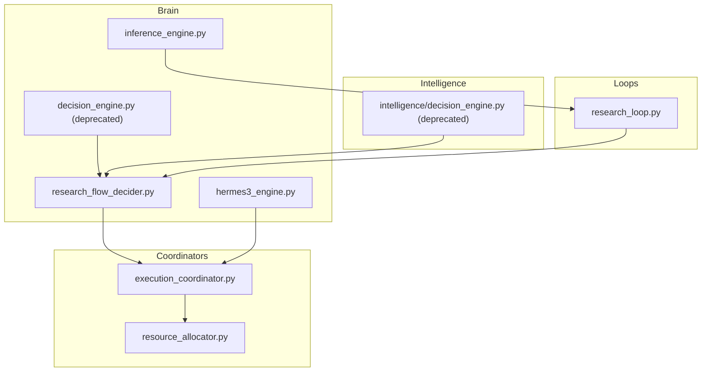
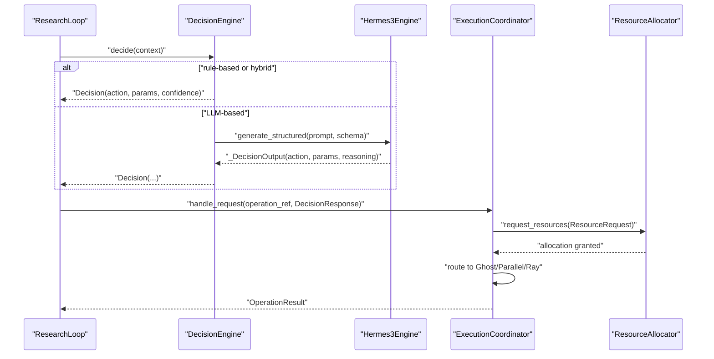
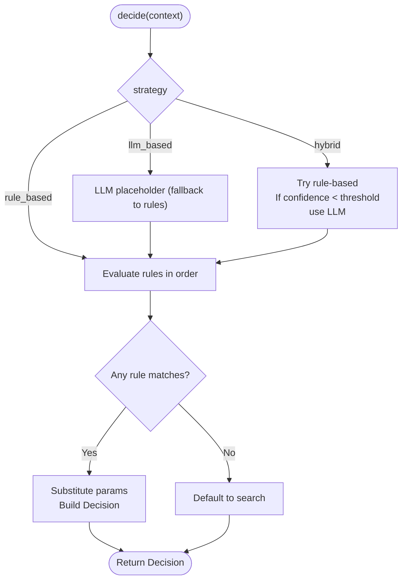
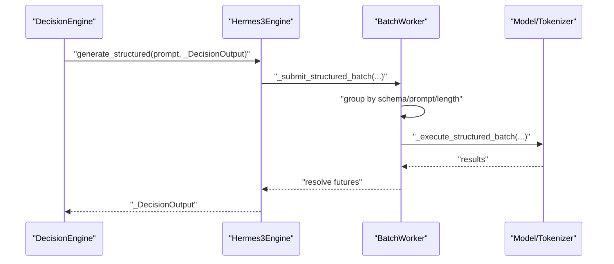
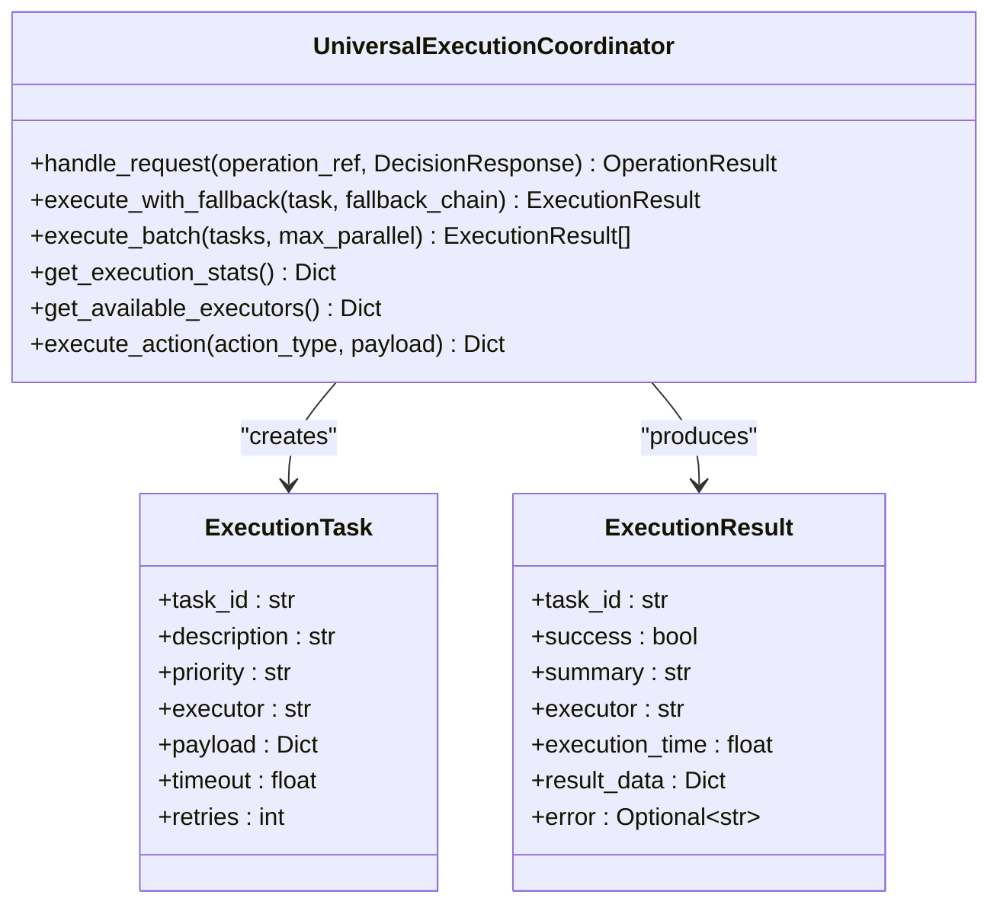
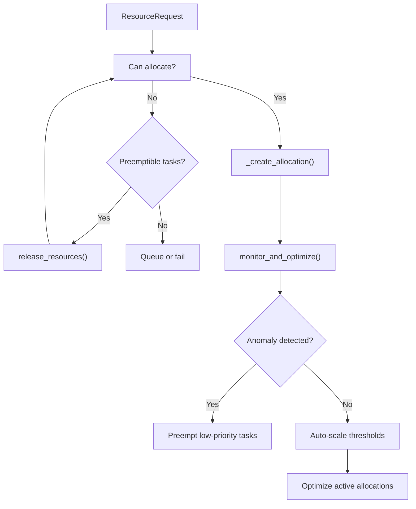
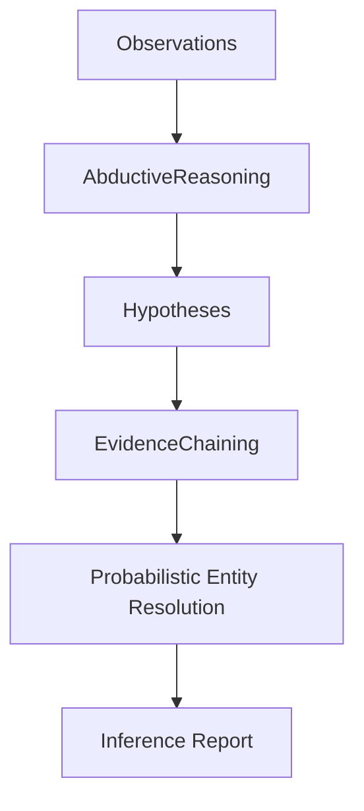
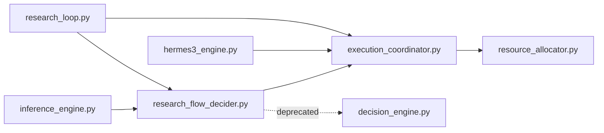

# Decision Engine

<cite>
**Referenced Files in This Document**
- [brain/decision_engine.py](file://brain/decision_engine.py)
- [brain/research_flow_decider.py](file://brain/research_flow_decider.py)
- [brain/hermes3_engine.py](file://brain/hermes3_engine.py)
- [brain/inference_engine.py](file://brain/inference_engine.py)
- [coordinators/execution_coordinator.py](file://coordinators/execution_coordinator.py)
- [coordinators/resource_allocator.py](file://coordinators/resource_allocator.py)
- [intelligence/decision_engine.py](file://intelligence/decision_engine.py)
- [loops/research_loop.py](file://loops/research_loop.py)
</cite>

## Table of Contents
1. [Introduction](#introduction)
2. [Project Structure](#project-structure)
3. [Core Components](#core-components)
4. [Architecture Overview](#architecture-overview)
5. [Detailed Component Analysis](#detailed-component-analysis)
6. [Dependency Analysis](#dependency-analysis)
7. [Performance Considerations](#performance-considerations)
8. [Troubleshooting Guide](#troubleshooting-guide)
9. [Conclusion](#conclusion)
10. [Appendices](#appendices)

## Introduction
This document describes the Decision Engine that coordinates strategic decision making and action execution across the system. It explains how the engine orchestrates research workflows, manages action sequences, coordinates between brain components, and integrates with higher-level engines such as Hermes3 and Inference engines. It also documents decision-making algorithms, action planning mechanisms, execution coordination patterns, resource allocation decisions, research strategy optimization, configuration options, performance tuning, scalability considerations, troubleshooting, validation of action outcomes, and monitoring approaches.

## Project Structure
The Decision Engine spans several modules:
- Brain-level decision helpers and canonical engines
- Execution and resource coordination
- Intelligence-level decision engine (deprecated forwarding)
- Research loop and planning integration

**Diagram sources**
- [brain/research_flow_decider.py:1-230](file://brain/research_flow_decider.py#L1-L230)
- [brain/decision_engine.py:1-257](file://brain/decision_engine.py#L1-L257)
- [brain/hermes3_engine.py:1-800](file://brain/hermes3_engine.py#L1-L800)
- [brain/inference_engine.py:1-800](file://brain/inference_engine.py#L1-L800)
- [coordinators/execution_coordinator.py:1-800](file://coordinators/execution_coordinator.py#L1-L800)
- [coordinators/resource_allocator.py:1-760](file://coordinators/resource_allocator.py#L1-L760)
- [intelligence/decision_engine.py:1-4](file://intelligence/decision_engine.py#L1-L4)
- [loops/research_loop.py:432-477](file://loops/research_loop.py#L432-L477)

**Section sources**
- [brain/research_flow_decider.py:1-230](file://brain/research_flow_decider.py#L1-L230)
- [brain/decision_engine.py:1-257](file://brain/decision_engine.py#L1-L257)
- [brain/hermes3_engine.py:1-800](file://brain/hermes3_engine.py#L1-L800)
- [brain/inference_engine.py:1-800](file://brain/inference_engine.py#L1-L800)
- [coordinators/execution_coordinator.py:1-800](file://coordinators/execution_coordinator.py#L1-L800)
- [coordinators/resource_allocator.py:1-760](file://coordinators/resource_allocator.py#L1-L760)
- [intelligence/decision_engine.py:1-4](file://intelligence/decision_engine.py#L1-L4)
- [loops/research_loop.py:432-477](file://loops/research_loop.py#L432-L477)

## Core Components
- DecisionEngine (rule-based and hybrid strategies) in research_flow_decider.py
- DecisionEngine (deprecated alias) in decision_engine.py
- Hermes3Engine (LLM-based decision making, structured generation, batch scheduling)
- InferenceEngine (abductive reasoning, evidence chaining, entity resolution)
- UniversalExecutionCoordinator (routing, fallback, parallel/distributed execution)
- IntelligentResourceAllocator (resource allocation, scaling, anomaly detection)
- Intelligence decision engine (deprecated forwarding)
- Research loop integration for action execution and reward feedback

Key roles:
- DecisionEngine selects actions and synthesizes research steps based on context and rules.
- Hermes3Engine performs LLM-based decisions with structured outputs and batch scheduling.
- UniversalExecutionCoordinator routes decisions to appropriate executors and aggregates results.
- IntelligentResourceAllocator ensures resource availability and optimizes throughput.
- InferenceEngine provides reasoning and evidence chaining to inform decisions.
- Research loop executes actions and measures reward to guide future decisions.

**Section sources**
- [brain/research_flow_decider.py:63-230](file://brain/research_flow_decider.py#L63-L230)
- [brain/decision_engine.py:55-257](file://brain/decision_engine.py#L55-L257)
- [brain/hermes3_engine.py:97-800](file://brain/hermes3_engine.py#L97-L800)
- [brain/inference_engine.py:366-800](file://brain/inference_engine.py#L366-L800)
- [coordinators/execution_coordinator.py:88-800](file://coordinators/execution_coordinator.py#L88-L800)
- [coordinators/resource_allocator.py:81-760](file://coordinators/resource_allocator.py#L81-L760)
- [intelligence/decision_engine.py:1-4](file://intelligence/decision_engine.py#L1-L4)
- [loops/research_loop.py:432-477](file://loops/research_loop.py#L432-L477)

## Architecture Overview
The Decision Engine architecture integrates decision-making, planning, execution, and resource management:

**Diagram sources**
- [brain/research_flow_decider.py:134-230](file://brain/research_flow_decider.py#L134-L230)
- [brain/hermes3_engine.py:594-620](file://brain/hermes3_engine.py#L594-L620)
- [coordinators/execution_coordinator.py:225-282](file://coordinators/execution_coordinator.py#L225-L282)
- [coordinators/resource_allocator.py:291-364](file://coordinators/resource_allocator.py#L291-L364)

## Detailed Component Analysis

### DecisionEngine (research_flow_decider.py)
- Strategies: rule-based, LLM-based (placeholder), hybrid.
- DecisionType enumeration covers research, execution, analysis, planning, synthesis, error, complete.
- Rule evaluation: iterates rules with conditions on context; supports parameter substitution and completion flags.
- Complexity: O(R) per decision where R is number of rules; parameter substitution is linear in parameter count.
- Confidence: rule-based decisions set fixed confidence; hybrid defers to LLM when confidence is low.
- Early termination: should_continue enforces hard/soft limits and stagnation detection.

**Diagram sources**
- [brain/research_flow_decider.py:134-203](file://brain/research_flow_decider.py#L134-L203)

**Section sources**
- [brain/research_flow_decider.py:63-230](file://brain/research_flow_decider.py#L63-L230)

### Hermes3Engine (LLM-based decision making)
- Structured generation with Pydantic models (_DecisionOutput, _SynthesisOutput).
- ChatML formatting and safety sanitization hooks.
- Batch worker with schema-aware grouping, adaptive flush intervals, and emergency guards.
- Draft model speculative decoding with memory guard and MLX integration.
- Telemetry counters and EMA tracking for queue depth, batch sizes, and dispatch latencies.

**Diagram sources**
- [brain/hermes3_engine.py:258-620](file://brain/hermes3_engine.py#L258-L620)

**Section sources**
- [brain/hermes3_engine.py:97-800](file://brain/hermes3_engine.py#L97-L800)

### UniversalExecutionCoordinator
- Routes decisions to GhostDirector, ParallelExecutionOptimizer, or RayClusterManager.
- Dynamic task generation based on decision confidence and priority.
- Automatic fallback chain and batch execution with controlled parallelism.
- Tracks execution stats and maintains action history for Hermes3 integration.

**Diagram sources**
- [coordinators/execution_coordinator.py:88-800](file://coordinators/execution_coordinator.py#L88-L800)

**Section sources**
- [coordinators/execution_coordinator.py:88-800](file://coordinators/execution_coordinator.py#L88-L800)

### IntelligentResourceAllocator
- ResourceRequest, ResourceCapacity, ResourceAllocation dataclasses.
- Predictive modeling (sklearn), anomaly detection, and auto-scaling heuristics.
- M1-specific optimizations (ANE availability checks, unified memory, Metal device wrapper).
- Preemption of low-efficiency tasks for high-priority workloads.
- Parallel execution optimizer with batched scheduling and resource-aware concurrency.

**Diagram sources**
- [coordinators/resource_allocator.py:291-546](file://coordinators/resource_allocator.py#L291-L546)

**Section sources**
- [coordinators/resource_allocator.py:81-760](file://coordinators/resource_allocator.py#L81-L760)

### InferenceEngine (Reasoning and Evidence)
- Abductive reasoning, evidence chaining, probabilistic entity resolution.
- OSINT-specific inference rules (co-location, temporal proximity, communication patterns, stylometry, behavioral fingerprinting).
- Bounded evidence graph with LRU eviction and MLX-accelerated similarity computations.
- Multi-hop reasoning with confidence scoring and cycle detection.

**Diagram sources**
- [brain/inference_engine.py:762-800](file://brain/inference_engine.py#L762-L800)

**Section sources**
- [brain/inference_engine.py:366-800](file://brain/inference_engine.py#L366-L800)

### Intelligence Decision Engine (Deprecated)
- Deprecated forwarding to brain.decision_engine.

**Section sources**
- [intelligence/decision_engine.py:1-4](file://intelligence/decision_engine.py#L1-L4)

### Research Loop Integration
- Executes actions and computes reward based on findings and cycles.
- Integrates with DecisionEngine to select next actions and with Hermes3Engine for planning/runtime tasks.

**Section sources**
- [loops/research_loop.py:432-477](file://loops/research_loop.py#L432-L477)

## Dependency Analysis
- research_flow_decider.py is the canonical decision engine; decision_engine.py is deprecated and forwards to research_flow_decider.py.
- UniversalExecutionCoordinator depends on Hermes3Engine for action execution and ResourceAllocator for resource guarantees.
- InferenceEngine complements decision-making by providing reasoning and evidence to inform context.
- Research loop consumes decisions and validates outcomes via findings and rewards.

**Diagram sources**
- [brain/research_flow_decider.py:1-230](file://brain/research_flow_decider.py#L1-L230)
- [brain/decision_engine.py:1-257](file://brain/decision_engine.py#L1-L257)
- [brain/hermes3_engine.py:1-800](file://brain/hermes3_engine.py#L1-L800)
- [coordinators/execution_coordinator.py:1-800](file://coordinators/execution_coordinator.py#L1-L800)
- [coordinators/resource_allocator.py:1-760](file://coordinators/resource_allocator.py#L1-L760)
- [brain/inference_engine.py:1-800](file://brain/inference_engine.py#L1-L800)
- [loops/research_loop.py:432-477](file://loops/research_loop.py#L432-L477)

**Section sources**
- [brain/research_flow_decider.py:1-230](file://brain/research_flow_decider.py#L1-L230)
- [brain/decision_engine.py:1-257](file://brain/decision_engine.py#L1-L257)
- [brain/hermes3_engine.py:1-800](file://brain/hermes3_engine.py#L1-L800)
- [coordinators/execution_coordinator.py:1-800](file://coordinators/execution_coordinator.py#L1-L800)
- [coordinators/resource_allocator.py:1-760](file://coordinators/resource_allocator.py#L1-L760)
- [brain/inference_engine.py:1-800](file://brain/inference_engine.py#L1-L800)
- [loops/research_loop.py:432-477](file://loops/research_loop.py#L432-L477)

## Performance Considerations
- DecisionEngine rule evaluation is O(R); keep rules concise and ordered by likelihood.
- Hermes3Engine batch worker reduces latency via schema-aware batching and adaptive flush intervals; tune batch_max_size and flush intervals for workload characteristics.
- ResourceAllocator’s anomaly detection and auto-scaling reduce tail latencies; enable M1 optimizations for unified memory and MLX acceleration.
- ExecutionCoordinator’s fallback chain prevents single-point-of-failure; configure executor availability and task concurrency based on confidence thresholds.

[No sources needed since this section provides general guidance]

## Troubleshooting Guide
Common issues and resolutions:
- DecisionEngine rule failures: Logging warns on rule evaluation errors; verify context keys and parameter substitutions.
- Hermes3Engine batch failures: Batch shattering retries items individually; check schema mismatch and prompt hash segregation.
- ExecutionCoordinator fallback: If primary executor fails, fallback chain attempts alternative executors; confirm availability flags and initialization.
- ResourceAllocator anomalies: Detected anomalies preempt low-priority tasks; review CPU/memory thresholds and efficiency targets.
- InferenceEngine evidence graph: Bounded storage with LRU eviction; ensure sufficient capacity for complex reasoning tasks.

**Section sources**
- [brain/decision_engine.py:170-172](file://brain/decision_engine.py#L170-L172)
- [brain/hermes3_engine.py:551-581](file://brain/hermes3_engine.py#L551-L581)
- [coordinators/execution_coordinator.py:312-334](file://coordinators/execution_coordinator.py#L312-L334)
- [coordinators/resource_allocator.py:449-490](file://coordinators/resource_allocator.py#L449-L490)
- [brain/inference_engine.py:664-761](file://brain/inference_engine.py#L664-L761)

## Conclusion
The Decision Engine orchestrates research workflows by combining rule-based decision-making, LLM-powered planning via Hermes3Engine, and robust execution coordination with UniversalExecutionCoordinator and IntelligentResourceAllocator. It integrates reasoning from InferenceEngine and validates outcomes through ResearchLoop reward signals. With configurable strategies, adaptive batching, and resource-aware scheduling, it scales effectively across diverse workloads while maintaining reliability and performance.

[No sources needed since this section summarizes without analyzing specific files]

## Appendices

### Configuration Options and Tuning
- DecisionEngine strategy: rule_based, llm_based, hybrid.
- Hermes3Engine:
  - Model path, temperature, max_tokens, context_window.
  - Batch queue sizing, flush intervals, schema segregation.
  - Draft model speculative decoding and KV cache options.
- ExecutionCoordinator:
  - Executor availability flags, max concurrent tasks, fallback chain.
  - Confidence-based task generation and priority mapping.
- ResourceAllocator:
  - Resource capacities, allocation defaults, scaling thresholds.
  - Auto-scaling, anomaly detection, and M1-specific optimizations.
- InferenceEngine:
  - Max chain depth, confidence thresholds, streaming batch size.
  - OSINT-specific inference rules and MLX acceleration.

**Section sources**
- [brain/research_flow_decider.py:73-83](file://brain/research_flow_decider.py#L73-L83)
- [brain/hermes3_engine.py:76-170](file://brain/hermes3_engine.py#L76-L170)
- [coordinators/execution_coordinator.py:108-143](file://coordinators/execution_coordinator.py#L108-L143)
- [coordinators/resource_allocator.py:108-143](file://coordinators/resource_allocator.py#L108-L143)
- [brain/inference_engine.py:391-411](file://brain/inference_engine.py#L391-L411)

### Examples of Decision Workflows and Action Sequencing
- Rule-based decision: First-step search, archive fallback, fact-check claims, deep research for complex queries, synthesis near step limits.
- LLM-based decision: Structured generation with _DecisionOutput; fallback to rules when LLM path is not used.
- Execution routing: Confidence-based task count; priority mapping; fallback chain; batch execution with parallelism control.
- Resource allocation: Predictive models, anomaly detection, auto-scaling; preemption for high-priority tasks.

**Section sources**
- [brain/research_flow_decider.py:85-124](file://brain/research_flow_decider.py#L85-L124)
- [brain/hermes3_engine.py:594-620](file://brain/hermes3_engine.py#L594-L620)
- [coordinators/execution_coordinator.py:447-483](file://coordinators/execution_coordinator.py#L447-L483)
- [coordinators/resource_allocator.py:414-546](file://coordinators/resource_allocator.py#L414-L546)

### Monitoring Approaches
- Hermes3Engine telemetry counters and EMA metrics for queue depth, batch size, and dispatch latencies.
- ExecutionCoordinator execution statistics and action history.
- ResourceAllocator resource utilization, allocation statistics, and anomaly reports.
- ResearchLoop reward computation and state/action histories.

**Section sources**
- [brain/hermes3_engine.py:174-201](file://brain/hermes3_engine.py#L174-L201)
- [coordinators/execution_coordinator.py:653-671](file://coordinators/execution_coordinator.py#L653-L671)
- [coordinators/resource_allocator.py:547-601](file://coordinators/resource_allocator.py#L547-L601)
- [loops/research_loop.py:432-449](file://loops/research_loop.py#L432-L449)