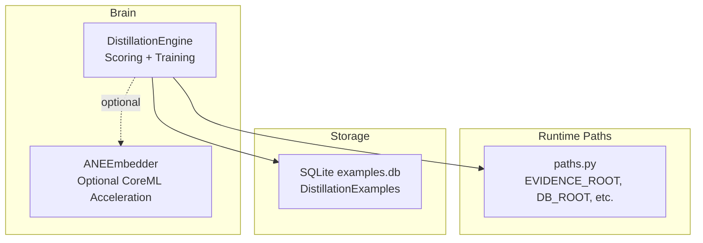
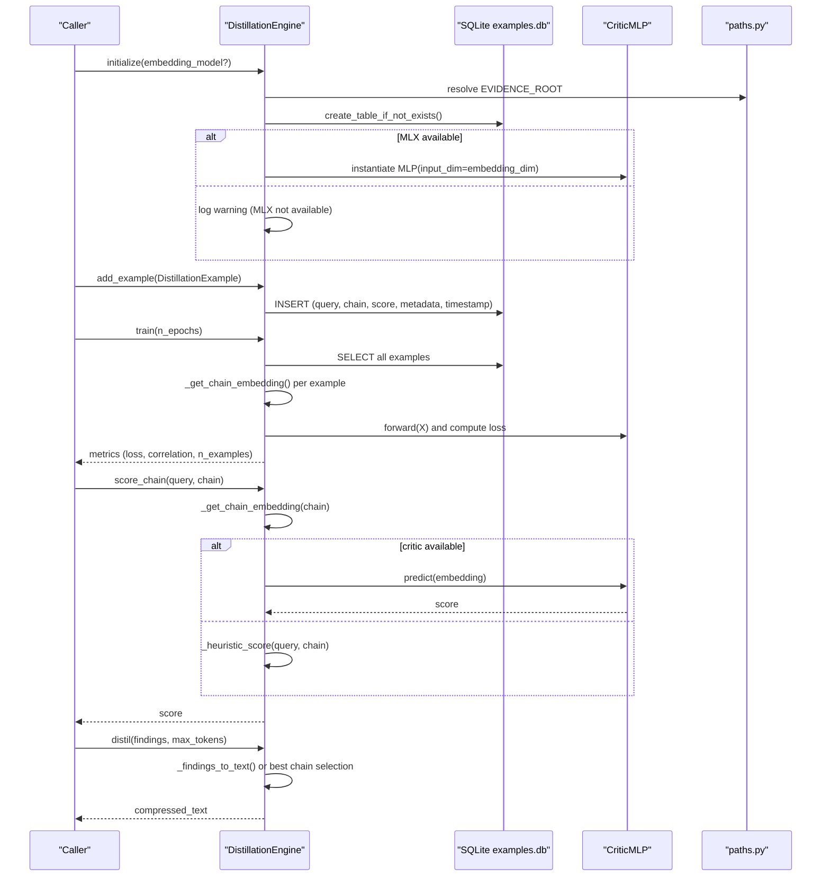
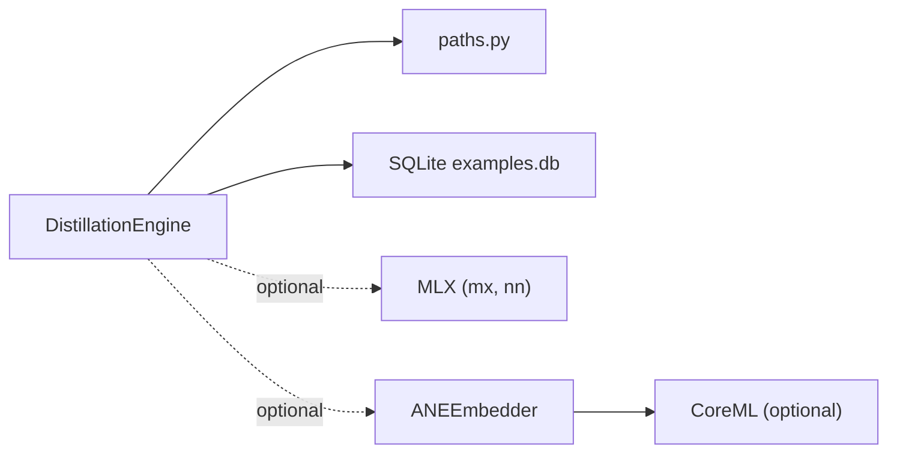

# Distillation Engine

<cite>
**Referenced Files in This Document**
- [distillation_engine.py](file://brain/distillation_engine.py)
- [paths.py](file://paths.py)
- [ane_embedder.py](file://brain/ane_embedder.py)
</cite>

## Table of Contents
1. [Introduction](#introduction)
2. [Project Structure](#project-structure)
3. [Core Components](#core-components)
4. [Architecture Overview](#architecture-overview)
5. [Detailed Component Analysis](#detailed-component-analysis)
6. [Dependency Analysis](#dependency-analysis)
7. [Performance Considerations](#performance-considerations)
8. [Troubleshooting Guide](#troubleshooting-guide)
9. [Conclusion](#conclusion)
10. [Appendices](#appendices)

## Introduction
The Distillation Engine is responsible for transforming complex reasoning chains and research findings into compact, structured, and actionable insights. It implements a lightweight MLX-based quality scorer for reasoning chains, a SQLite-backed dataset for training examples, and a practical compression pathway for research findings. The engine supports:
- Reasoning chain quality scoring using a small MLP critic network
- Training the critic on labeled examples
- Embedding reasoning chains for scoring
- Compression of research findings into concise, LLM-friendly summaries
- Graceful fallbacks when MLX or external models are unavailable
- Integration with runtime path management and optional ANE-accelerated embeddings

## Project Structure
The Distillation Engine resides under the brain module and integrates with runtime path management and optional ANE acceleration.

**Diagram sources**
- [distillation_engine.py](file://brain/distillation_engine.py)
- [paths.py](file://paths.py)
- [ane_embedder.py](file://brain/ane_embedder.py)

**Section sources**
- [distillation_engine.py](file://brain/distillation_engine.py)
- [paths.py](file://paths.py)

## Core Components
- DistillationEngine: Main engine for scoring reasoning chains, training the critic, managing SQLite storage, and compressing findings.
- CriticMLP: Lightweight MLP that predicts a quality score in [0,1] for a given chain embedding.
- DistillationExample: Data container for training examples with query, chain steps, score, metadata, and timestamp.
- ANEEmbedder: Optional accelerator for embeddings using CoreML/ANE; provides fallback to MLX-based embedders.
- Path management: EVIDENCE_ROOT determines the default database location.

Key responsibilities:
- Embed reasoning chains (mean pooling of step embeddings) and normalize to fixed dimension
- Score chains with MLX-based critic or heuristic fallback
- Persist examples to SQLite and compute basic statistics
- Train the critic via a minimal SGD loop and compute correlation metrics
- Compress research findings into a concise summary suitable for downstream synthesis

**Section sources**
- [distillation_engine.py](file://brain/distillation_engine.py)
- [paths.py](file://paths.py)
- [ane_embedder.py](file://brain/ane_embedder.py)

## Architecture Overview
The engine orchestrates three primary flows:
- Example ingestion and persistence
- Training the critic on stored examples
- Scoring and compression of reasoning chains/findings

**Diagram sources**
- [distillation_engine.py](file://brain/distillation_engine.py)
- [paths.py](file://paths.py)

## Detailed Component Analysis

### DistillationEngine
Responsibilities:
- Initialize with optional embedding model and default SQLite path under EVIDENCE_ROOT
- Manage database lifecycle and indices
- Add training examples and compute statistics
- Train the critic with a simple SGD loop and record metrics
- Score reasoning chains with MLX or heuristic fallback
- Compress findings into a concise text

Configuration and parameters:
- embedding_dim: default 768; affects critic input size and embedding normalization
- MAX_CHAIN_LENGTH: caps chain length to reduce memory and compute overhead
- SQLite table schema: examples(id, query, chain, score, metadata, timestamp)

Memory and performance characteristics:
- Uses ThreadPoolExecutor for embedding generation to keep event loop responsive
- Explicit garbage collection and MLX cache clearing after training
- Normalizes embeddings to unit vectors to stabilize scoring

Quality preservation techniques:
- Heuristic scoring fallback ensures meaningful scores even without MLX/critic
- Embedding fallback uses a simple hashing scheme to maintain basic structure
- Chain truncation prevents oversized inputs

Integration points:
- EVIDENCE_ROOT from paths.py for default database location
- Optional ANEEmbedder for accelerated embeddings

**Section sources**
- [distillation_engine.py](file://brain/distillation_engine.py)
- [paths.py](file://paths.py)

### CriticMLP
Responsibilities:
- Predict a scalar quality score in [0,1] for a given embedding
- Uses a small MLP with ReLU hidden layers and sigmoid output
- Provides a NumPy-based predict method for compatibility

Notes:
- Designed for M1 8GB constraints with modest hidden sizes
- Forward pass uses MX operations when MLX is available

**Section sources**
- [distillation_engine.py](file://brain/distillation_engine.py)

### DistillationExample
Responsibilities:
- Encapsulates a single training example
- Validates and normalizes score to [0,1]
- Serializes/deserializes to/from dictionary for SQLite storage

**Section sources**
- [distillation_engine.py](file://brain/distillation_engine.py)

### ANEEmbedder (Optional Acceleration)
While not directly part of the DistillationEngine, ANEEmbedder can supply an embedding model to DistillationEngine to improve performance and reduce memory pressure on constrained devices.

Highlights:
- Attempts to load a CoreML model package
- Provides fallback to an external MLX-based embedder
- Offers warmup to prime the ANE subsystem

**Section sources**
- [ane_embedder.py](file://brain/ane_embedder.py)

### Compression Workflow (distil)
Purpose:
- Transform a list of findings into a compact, LLM-friendly representation
- Prefer the highest-quality single-step chain derived from findings
- Fallback to plain-text serialization if engine is unavailable

Processing:
- Extract text/snippet/title/source from findings
- Treat each finding as a single-step chain
- Score chains heuristically and pick the best
- Serialize remaining findings as plain text if needed

**Section sources**
- [distillation_engine.py](file://brain/distillation_engine.py)

## Dependency Analysis
- Internal dependencies:
  - DistillationEngine depends on paths.py for EVIDENCE_ROOT
  - SQLite operations are isolated and use synchronous calls wrapped in asyncio.to_thread
- Optional external dependencies:
  - MLX (mlx.core, mlx.nn): Enables critic training and inference
  - CoreML (ANE): Optional acceleration for embeddings

**Diagram sources**
- [distillation_engine.py](file://brain/distillation_engine.py)
- [paths.py](file://paths.py)
- [ane_embedder.py](file://brain/ane_embedder.py)

**Section sources**
- [distillation_engine.py](file://brain/distillation_engine.py)
- [paths.py](file://paths.py)
- [ane_embedder.py](file://brain/ane_embedder.py)

## Performance Considerations
- Embedding computation:
  - Parallelize embedding generation using ThreadPoolExecutor
  - Normalize embeddings to unit vectors to stabilize scoring
- Training:
  - Keep hidden sizes small for M1 8GB constraints
  - Use simple SGD; consider upgrading to a proper optimizer in production
  - Clear caches and trigger garbage collection after training
- Storage:
  - Use asynchronous database operations with context-managed connections
  - Index timestamps for efficient retrieval
- Compression:
  - Cap chain length and step text lengths to bound memory usage
  - Prefer heuristic scoring when MLX is unavailable to avoid expensive model loads

[No sources needed since this section provides general guidance]

## Troubleshooting Guide
Common issues and resolutions:
- MLX not available:
  - Symptom: Critic training and inference disabled; fallback to heuristic scoring
  - Action: Install MLX or rely on heuristic scoring
- SQLite initialization failures:
  - Symptom: Database creation errors
  - Action: Verify write permissions to EVIDENCE_ROOT; ensure directory exists
- Low training quality:
  - Symptom: High loss, low correlation
  - Action: Increase number of examples; verify scores are meaningful; adjust embedding_dim
- Memory pressure during training:
  - Symptom: OOM or slow performance
  - Action: Reduce n_epochs; lower embedding_dim; clear caches after training
- ANE acceleration not used:
  - Symptom: ANE model not loaded
  - Action: Ensure CoreML is installed; confirm model package exists; use fallback embedder

Validation and quality assurance:
- Use get_stats to monitor average/min/max scores and example counts
- Inspect training metrics (loss, initial_loss, correlation) to assess convergence
- Manually review heuristic scoring for representative chains to ensure reasonable scores

**Section sources**
- [distillation_engine.py](file://brain/distillation_engine.py)
- [paths.py](file://paths.py)

## Conclusion
The Distillation Engine provides a pragmatic, memory-conscious approach to reasoning chain quality scoring and research finding compression. By combining a lightweight MLX critic, SQLite-backed datasets, and robust fallbacks, it enables reliable knowledge compression and model optimization across diverse hardware configurations. Integrating optional ANE acceleration further improves performance on supported devices.

[No sources needed since this section summarizes without analyzing specific files]

## Appendices

### Configuration Options and Tuning
- embedding_dim: Controls the embedding dimensionality and critic input size
- MAX_CHAIN_LENGTH: Caps the number of reasoning steps to manage memory
- n_epochs: Number of training iterations for the critic
- SQLite path: Defaults to EVIDENCE_ROOT/distillation.db

**Section sources**
- [distillation_engine.py](file://brain/distillation_engine.py)
- [paths.py](file://paths.py)