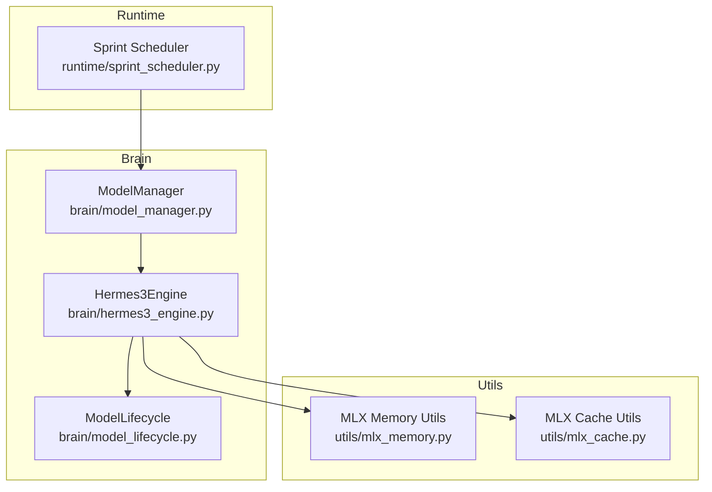
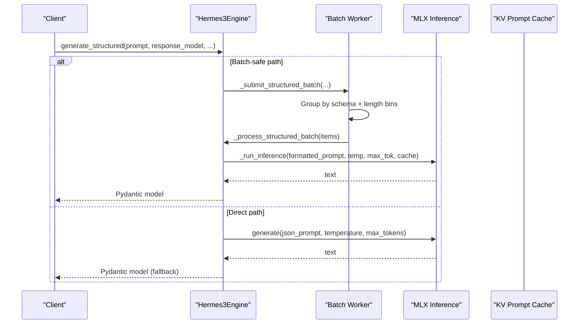
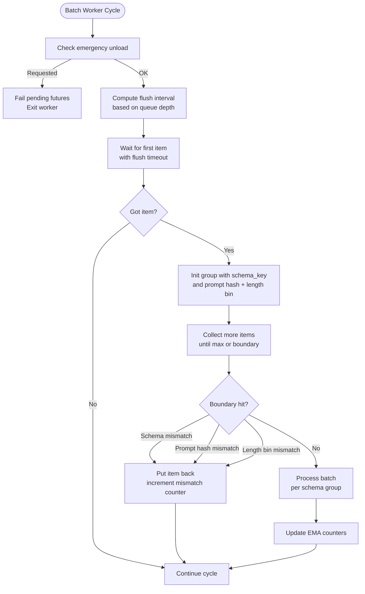
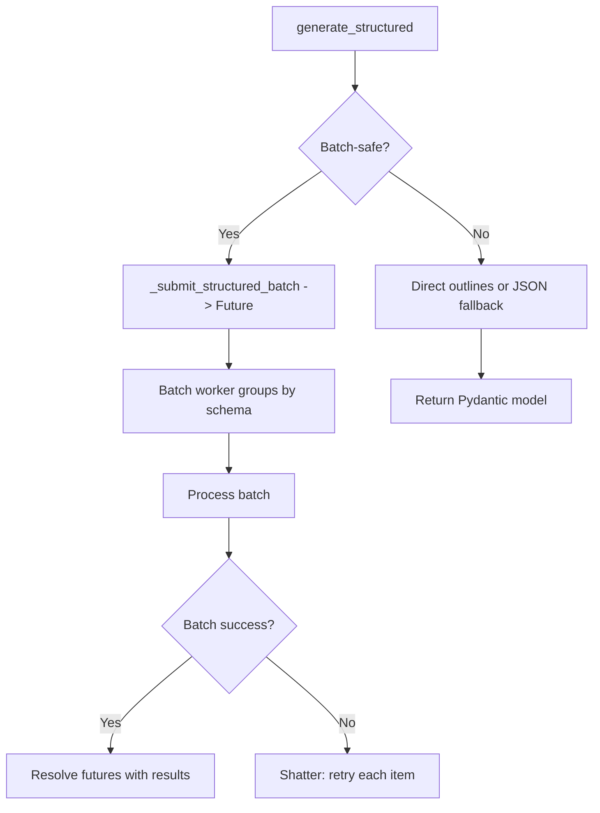
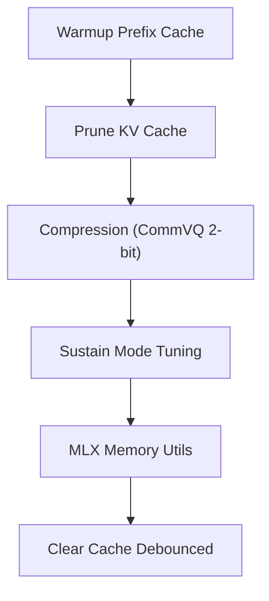
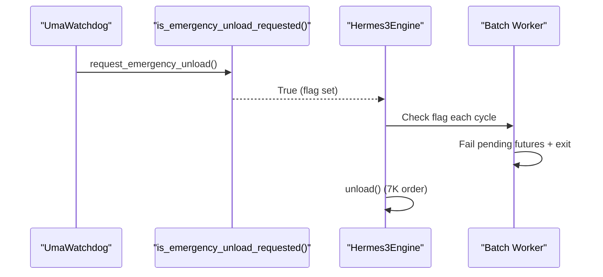
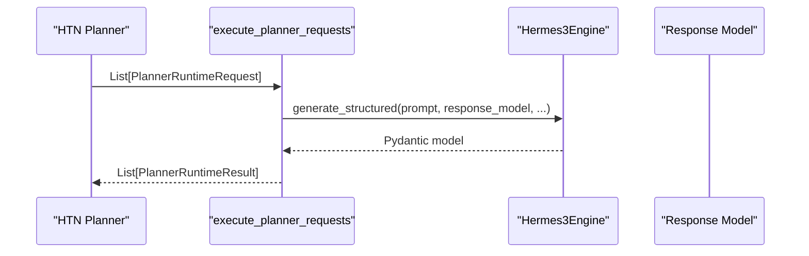
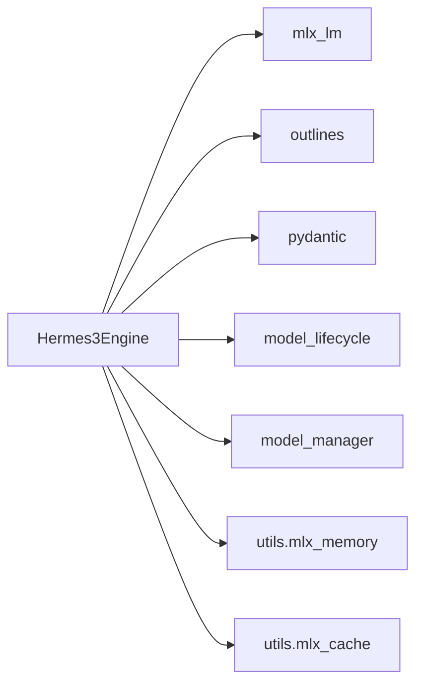

# Hermes3 Engine

<cite>
**Referenced Files in This Document**
- [hermes3_engine.py](file://brain/hermes3_engine.py)
- [model_lifecycle.py](file://brain/model_lifecycle.py)
- [model_manager.py](file://brain/model_manager.py)
- [mlx_memory.py](file://utils/mlx_memory.py)
- [mlx_cache.py](file://utils/mlx_cache.py)
- [sprint_scheduler.py](file://runtime/sprint_scheduler.py)
- [test_sprint75/test_speculative_decoding.py](file://tests/test_sprint75/test_speculative_decoding.py)
- [test_8c/test_lifecycle_convergence.py](file://tests/test_8c/test_lifecycle_convergence.py)
- [probe_7i/test_sprint_7i.py](file://tests/probe_7i/test_sprint_7i.py)
- [probe_7e/test_batch_batcher_7e.py](file://tests/probe_7e/test_batch_batcher_7e.py)
</cite>

## Table of Contents
1. [Introduction](#introduction)
2. [Project Structure](#project-structure)
3. [Core Components](#core-components)
4. [Architecture Overview](#architecture-overview)
5. [Detailed Component Analysis](#detailed-component-analysis)
6. [Dependency Analysis](#dependency-analysis)
7. [Performance Considerations](#performance-considerations)
8. [Troubleshooting Guide](#troubleshooting-guide)
9. [Conclusion](#conclusion)
10. [Appendices](#appendices)

## Introduction
Hermes3 Engine is the canonical LLM-based decision-making component responsible for structured generation and ChatML formatting. It orchestrates research synthesis, decision-making workflows, and integrates with MLX for efficient inference on Apple Silicon. The engine emphasizes reliability through continuous batching, schema-aware grouping, adaptive flush intervals, emergency unload handling, and robust structured output generation using Pydantic models and grammar-constrained decoding via outlines.

## Project Structure
Hermes3 Engine resides in the brain module and collaborates with lifecycle management, memory utilities, and runtime scheduling:

- Engine: [hermes3_engine.py](file://brain/hermes3_engine.py)
- Lifecycle and emergency unload: [model_lifecycle.py](file://brain/model_lifecycle.py)
- Model acquisition and lifecycle ownership: [model_manager.py](file://brain/model_manager.py)
- MLX memory and cache utilities: [mlx_memory.py](file://utils/mlx_memory.py), [mlx_cache.py](file://utils/mlx_cache.py)
- Runtime integration and scheduling: [sprint_scheduler.py](file://runtime/sprint_scheduler.py)
- Tests validating behavior: [test_sprint75/test_speculative_decoding.py](file://tests/test_sprint75/test_speculative_decoding.py), [test_8c/test_lifecycle_convergence.py](file://tests/test_8c/test_lifecycle_convergence.py), [probe_7i/test_sprint_7i.py](file://tests/probe_7i/test_sprint_7i.py), [probe_7e/test_batch_batcher_7e.py](file://tests/probe_7e/test_batch_batcher_7e.py)

**Diagram sources**
- [hermes3_engine.py:97-2242](file://brain/hermes3_engine.py#L97-L2242)
- [model_lifecycle.py:1-200](file://brain/model_lifecycle.py#L1-L200)
- [model_manager.py:194-200](file://brain/model_manager.py#L194-L200)
- [mlx_memory.py:241-290](file://utils/mlx_memory.py#L241-L290)
- [mlx_cache.py:230-243](file://utils/mlx_cache.py#L230-L243)
- [sprint_scheduler.py:3920-3947](file://runtime/sprint_scheduler.py#L3920-L3947)

**Section sources**
- [hermes3_engine.py:1-120](file://brain/hermes3_engine.py#L1-L120)
- [model_lifecycle.py:1-86](file://brain/model_lifecycle.py#L1-L86)
- [model_manager.py:194-200](file://brain/model_manager.py#L194-L200)

## Core Components
- Initialization and configuration: Loads the Hermes-3 model, initializes KV cache, outlines model, and draft speculative decoding when feasible.
- Continuous batching: Asynchronous batch worker with schema-aware grouping, length bin segregation, and adaptive flush intervals.
- Structured generation: Pydantic-based generation with outlines-backed grammar-constrained decoding and JSON fallback.
- MLX memory management: Prefix cache warmup, KV cache compression, pruning, and sustain-mode optimizations for M1 8GB systems.
- Lifecycle and safety: Emergency unload seam, bounded batch worker shutdown, and canonical unload ordering.

**Section sources**
- [hermes3_engine.py:109-225](file://brain/hermes3_engine.py#L109-L225)
- [hermes3_engine.py:669-729](file://brain/hermes3_engine.py#L669-L729)
- [hermes3_engine.py:1479-1590](file://brain/hermes3_engine.py#L1479-L1590)
- [hermes3_engine.py:1754-1827](file://brain/hermes3_engine.py#L1754-L1827)

## Architecture Overview
Hermes3 Engine’s architecture centers on asynchronous continuous batching, structured generation, and MLX-centric memory management. The engine exposes runtime-facing wrappers for planning and synthesis, integrates with outlines for grammar-constrained decoding, and coordinates with lifecycle utilities for safe unload and emergency handling.

**Diagram sources**
- [hermes3_engine.py:1479-1590](file://brain/hermes3_engine.py#L1479-L1590)
- [hermes3_engine.py:324-441](file://brain/hermes3_engine.py#L324-L441)
- [hermes3_engine.py:952-1013](file://brain/hermes3_engine.py#L952-L1013)

## Detailed Component Analysis

### Initialization and Model Loading
- Loads the Hermes-3 model and tokenizer using mlx_lm.
- Initializes outlines model for grammar-constrained decoding when available.
- Conditionally initializes KV prompt cache and system prompt cache.
- Attempts to load a draft speculative model based on available memory, with safeguards for emergency unload.
- Warms up prefix cache with a small generation call to prime KV states.

Configuration options:
- model_path: default to a specific Hermes-3 variant.
- temperature: default 0.3.
- max_tokens: default 2048.
- context_window: default 8192.

**Section sources**
- [hermes3_engine.py:75-82](file://brain/hermes3_engine.py#L75-L82)
- [hermes3_engine.py:669-729](file://brain/hermes3_engine.py#L669-L729)
- [hermes3_engine.py:730-795](file://brain/hermes3_engine.py#L730-L795)
- [hermes3_engine.py:800-847](file://brain/hermes3_engine.py#L800-L847)

### Continuous Batching System
- Asynchronous PriorityQueue-based batch worker with lazy start.
- Schema-aware grouping: items are grouped by response_model name to ensure consistent decoding.
- Length bin segregation: short/medium/long prompts to reduce padding overhead.
- Adaptive flush intervals: 3-tier policy based on queue depth (high/medium/default).
- Anti-starvation age bump: periodically lowers priorities to prevent starvation.
- Emergency handling: rejects new submissions and cancels pending futures during emergency unload.

**Diagram sources**
- [hermes3_engine.py:324-441](file://brain/hermes3_engine.py#L324-L441)
- [hermes3_engine.py:442-456](file://brain/hermes3_engine.py#L442-L456)
- [hermes3_engine.py:524-581](file://brain/hermes3_engine.py#L524-L581)

**Section sources**
- [hermes3_engine.py:215-257](file://brain/hermes3_engine.py#L215-L257)
- [hermes3_engine.py:324-441](file://brain/hermes3_engine.py#L324-L441)
- [hermes3_engine.py:442-456](file://brain/hermes3_engine.py#L442-L456)
- [probe_7i/test_sprint_7i.py:78-109](file://tests/probe_7i/test_sprint_7i.py#L78-L109)

### Structured Output Generation
- Primary path: outlines-backed JSON generation using a compiled generator keyed by response_model name.
- Fallback path: JSON prompt + regex extraction + retry with backoff.
- Safety: batch-safe routing checks for schema type, streaming, urgency, and timeout windows.
- Batch shattering: if a batch fails entirely, retries each item individually.

**Diagram sources**
- [hermes3_engine.py:1479-1590](file://brain/hermes3_engine.py#L1479-L1590)
- [hermes3_engine.py:551-592](file://brain/hermes3_engine.py#L551-L592)

**Section sources**
- [hermes3_engine.py:1479-1590](file://brain/hermes3_engine.py#L1479-L1590)
- [hermes3_engine.py:551-592](file://brain/hermes3_engine.py#L551-L592)

### MLX Memory Management
- Prefix cache warmup: prefill KV cache with system prompt and few-shot examples.
- KV cache compression: CommVQ 2-bit quantization for significant memory savings.
- KV cache pruning: reset cache offset when context grows beyond thresholds.
- Sustain mode: environment-driven tuning of MLX limits and optional prompt cache for M1 8GB systems.
- Memory utilities: debounced cache clears and configurable limits.

**Diagram sources**
- [hermes3_engine.py:2034-2096](file://brain/hermes3_engine.py#L2034-L2096)
- [hermes3_engine.py:1857-1898](file://brain/hermes3_engine.py#L1857-L1898)
- [hermes3_engine.py:1900-1927](file://brain/hermes3_engine.py#L1900-L1927)
- [hermes3_engine.py:1971-2028](file://brain/hermes3_engine.py#L1971-L2028)
- [mlx_memory.py:257-290](file://utils/mlx_memory.py#L257-L290)

**Section sources**
- [hermes3_engine.py:2034-2096](file://brain/hermes3_engine.py#L2034-L2096)
- [hermes3_engine.py:1857-1898](file://brain/hermes3_engine.py#L1857-L1898)
- [hermes3_engine.py:1900-1927](file://brain/hermes3_engine.py#L1900-L1927)
- [hermes3_engine.py:1971-2028](file://brain/hermes3_engine.py#L1971-L2028)
- [mlx_memory.py:257-290](file://utils/mlx_memory.py#L257-L290)

### Lifecycle and Emergency Unload
- Emergency unload seam: watchdog sets a flag; consumers check before inference and during worker cycles.
- Canonical unload ordering: batch worker shutdown, cache eviction, model/tokenizer nullification, GC, and MLX cache clear.
- Delegation: unload_model() delegates to engine.unload() for engines that implement it.

**Diagram sources**
- [model_lifecycle.py:108-131](file://brain/model_lifecycle.py#L108-L131)
- [model_lifecycle.py:147-189](file://brain/model_lifecycle.py#L147-L189)
- [hermes3_engine.py:226-257](file://brain/hermes3_engine.py#L226-L257)
- [hermes3_engine.py:1754-1827](file://brain/hermes3_engine.py#L1754-L1827)

**Section sources**
- [model_lifecycle.py:108-131](file://brain/model_lifecycle.py#L108-L131)
- [model_lifecycle.py:147-189](file://brain/model_lifecycle.py#L147-L189)
- [hermes3_engine.py:226-257](file://brain/hermes3_engine.py#L226-L257)
- [hermes3_engine.py:1754-1827](file://brain/hermes3_engine.py#L1754-L1827)

### Runtime Integration and Planning/Synthesis Wrappers
- Runtime-facing wrappers:
  - generate_sprint_plan: bounded planning with history and goals.
  - synthesize_findings: bounded synthesis with findings and hypotheses.
  - generate_report: bounded report generation for OSINT.
- Planner bridge: execute_planner_requests bridges HTN planner tasks to Hermes via generate_structured.

**Diagram sources**
- [hermes3_engine.py:1602-1752](file://brain/hermes3_engine.py#L1602-L1752)
- [hermes3_engine.py:1228-1322](file://brain/hermes3_engine.py#L1228-L1322)
- [hermes3_engine.py:1324-1430](file://brain/hermes3_engine.py#L1324-L1430)
- [hermes3_engine.py:1167-1226](file://brain/hermes3_engine.py#L1167-L1226)

**Section sources**
- [hermes3_engine.py:1602-1752](file://brain/hermes3_engine.py#L1602-L1752)
- [hermes3_engine.py:1228-1322](file://brain/hermes3_engine.py#L1228-L1322)
- [hermes3_engine.py:1324-1430](file://brain/hermes3_engine.py#L1324-L1430)
- [hermes3_engine.py:1167-1226](file://brain/hermes3_engine.py#L1167-L1226)

## Dependency Analysis
- Hermes3Engine depends on:
  - mlx_lm for model loading and generation.
  - outlines for grammar-constrained decoding.
  - pydantic for structured output models.
  - model_lifecycle for emergency unload seam and canonical unload ordering.
  - model_manager for runtime-wide model acquisition and ownership.
  - utils/mlx_memory and utils/mlx_cache for MLX memory and cache controls.

**Diagram sources**
- [hermes3_engine.py:42-69](file://brain/hermes3_engine.py#L42-L69)
- [model_lifecycle.py:1-86](file://brain/model_lifecycle.py#L1-L86)
- [model_manager.py:194-200](file://brain/model_manager.py#L194-L200)
- [mlx_memory.py:241-290](file://utils/mlx_memory.py#L241-L290)
- [mlx_cache.py:230-243](file://utils/mlx_cache.py#L230-L243)

**Section sources**
- [hermes3_engine.py:42-69](file://brain/hermes3_engine.py#L42-L69)
- [model_lifecycle.py:1-86](file://brain/model_lifecycle.py#L1-L86)
- [model_manager.py:194-200](file://brain/model_manager.py#L194-L200)

## Performance Considerations
- Continuous batching reduces latency and improves throughput by grouping compatible requests and minimizing KV cache misses.
- Adaptive flush intervals dynamically tune batching cadence based on queue depth to balance latency and throughput.
- KV cache compression and pruning reduce memory footprint and improve sustained performance.
- Sustain mode and debounced cache clears help stabilize memory usage on constrained devices.
- Draft speculative decoding can accelerate generation when memory allows.

[No sources needed since this section provides general guidance]

## Troubleshooting Guide
Common issues and resolutions:
- Emergency unload triggered: Ensure the engine is shut down using the canonical unload order and verify that pending futures are handled. Confirm the emergency flag is cleared after safe conditions are met.
- Batch worker not starting: Verify lazy initialization and that the batch queue is created with a reasonable maxsize.
- Structured generation failures: Check outlines availability and schema compatibility; fallback to JSON path with retries.
- Memory pressure on M1 8GB: Enable sustain mode, apply KV cache compression/pruning, and use debounced cache clears.
- Model not loaded: Use runtime-facing wrappers that return skeleton results when the model is unavailable.

**Section sources**
- [model_lifecycle.py:147-189](file://brain/model_lifecycle.py#L147-L189)
- [hermes3_engine.py:226-257](file://brain/hermes3_engine.py#L226-L257)
- [hermes3_engine.py:1479-1590](file://brain/hermes3_engine.py#L1479-L1590)
- [mlx_memory.py:257-290](file://utils/mlx_memory.py#L257-L290)

## Conclusion
Hermes3 Engine provides a robust, schema-aware, and memory-efficient foundation for LLM-based decision-making and synthesis. Its continuous batching, structured generation with grammar constraints, and lifecycle safety mechanisms make it suitable for production environments requiring reliability and performance on Apple Silicon.

[No sources needed since this section summarizes without analyzing specific files]

## Appendices

### Practical Examples and Workflows
- Decision-making workflow: Use generate_sprint_plan to produce bounded, structured decisions with history and goals.
- Synthesis operations: Use synthesize_findings to produce reports from findings and hypotheses with bounded inputs.
- Integration patterns: Bridge HTN planner tasks via execute_planner_requests to leverage Hermes’ structured generation.

**Section sources**
- [hermes3_engine.py:1228-1322](file://brain/hermes3_engine.py#L1228-L1322)
- [hermes3_engine.py:1324-1430](file://brain/hermes3_engine.py#L1324-L1430)
- [hermes3_engine.py:1602-1752](file://brain/hermes3_engine.py#L1602-L1752)

### Configuration Scenarios and Best Practices
- Configuration options: temperature, max_tokens, context_window, and model_path are defined in the engine’s configuration.
- Best practices:
  - Enable KV cache and system prompt cache for sustained performance.
  - Use adaptive flush intervals and schema-aware batching for throughput.
  - Apply KV compression/pruning and sustain mode on M1 8GB systems.
  - Implement emergency unload seam and canonical unload ordering for safe shutdown.

**Section sources**
- [hermes3_engine.py:75-82](file://brain/hermes3_engine.py#L75-L82)
- [hermes3_engine.py:442-456](file://brain/hermes3_engine.py#L442-L456)
- [hermes3_engine.py:1857-1898](file://brain/hermes3_engine.py#L1857-L1898)
- [hermes3_engine.py:1971-2028](file://brain/hermes3_engine.py#L1971-L2028)
- [model_lifecycle.py:147-189](file://brain/model_lifecycle.py#L147-L189)