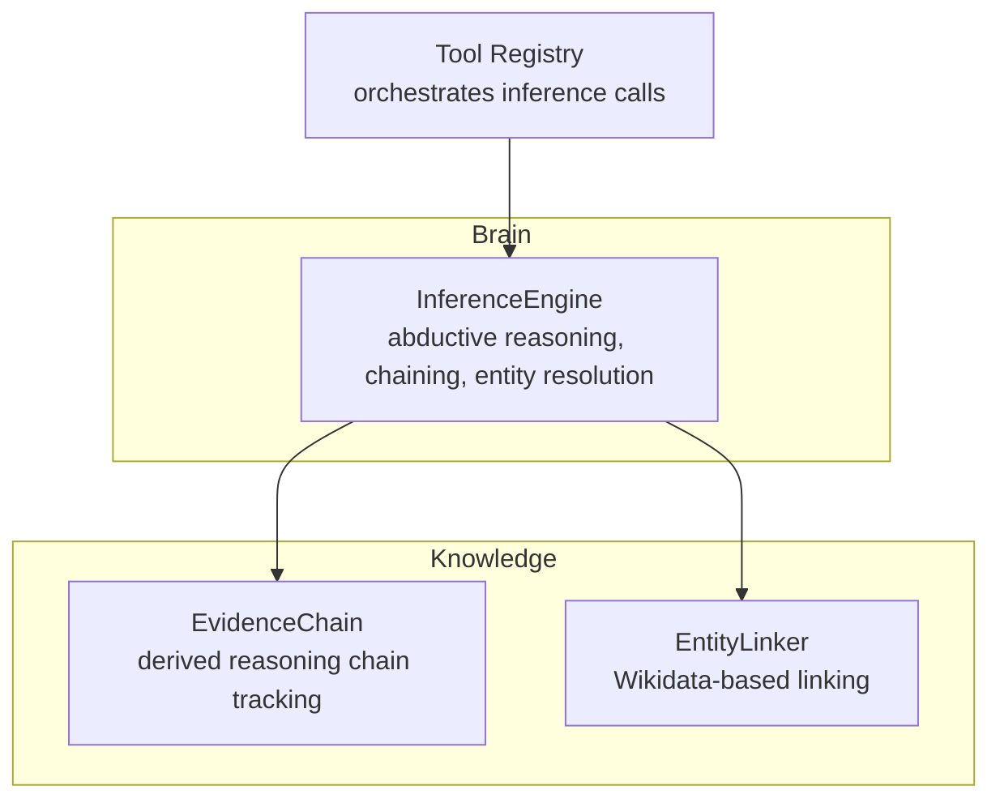
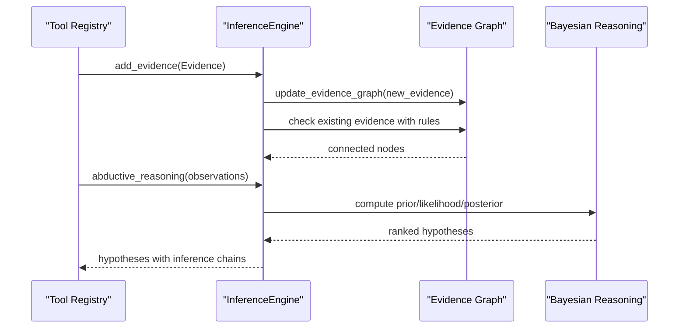
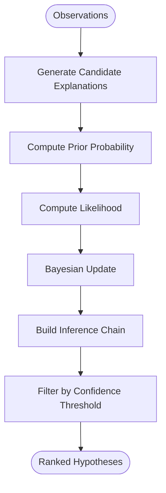
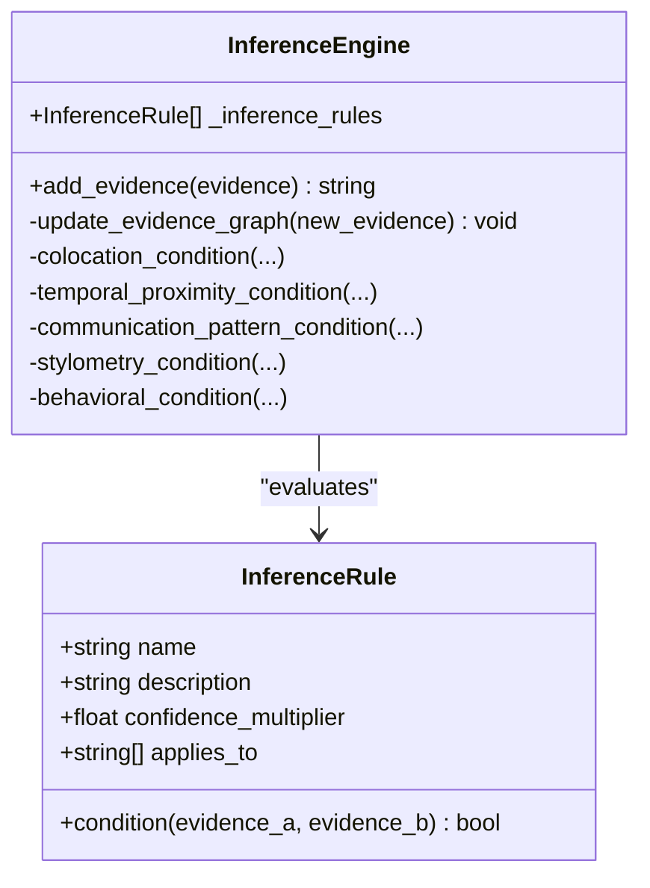
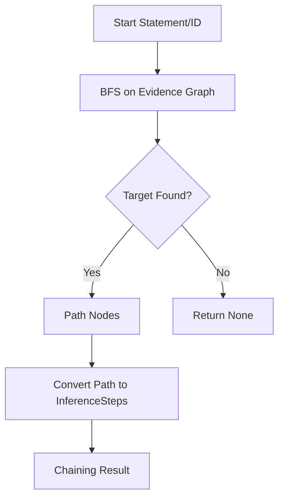
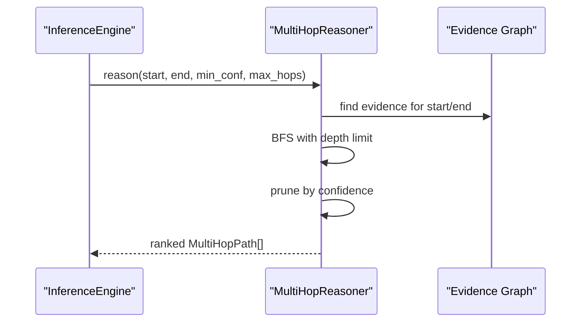
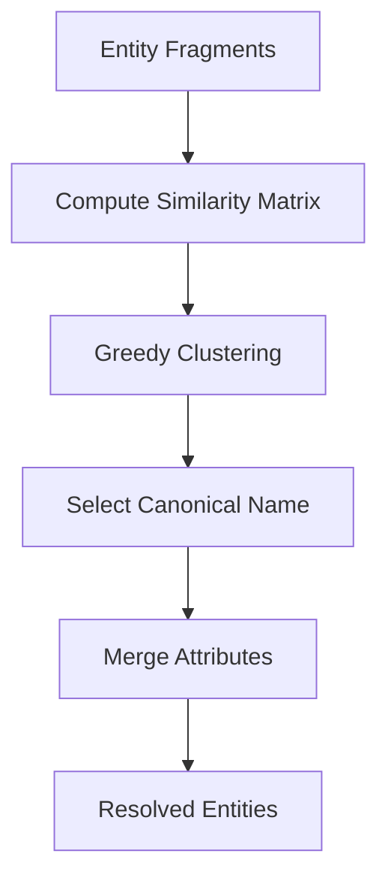
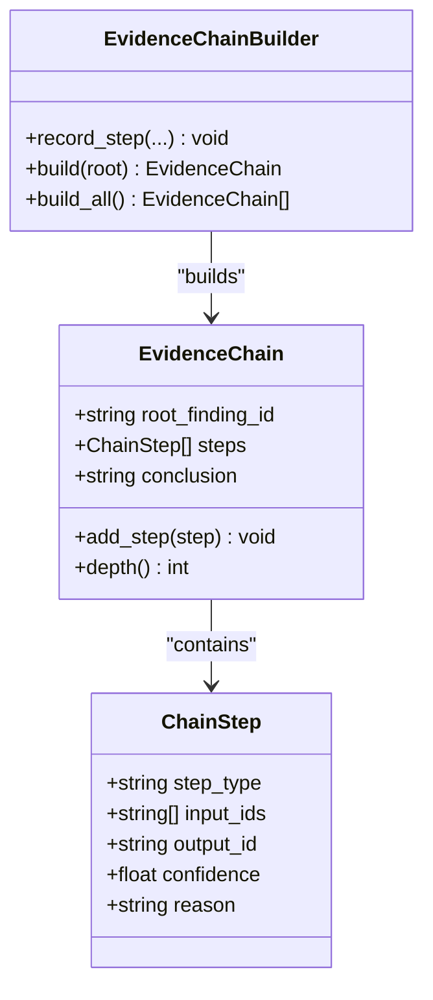
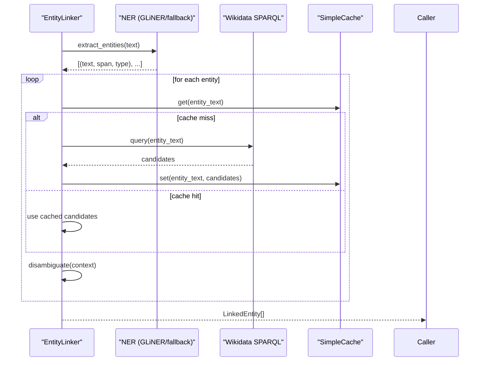
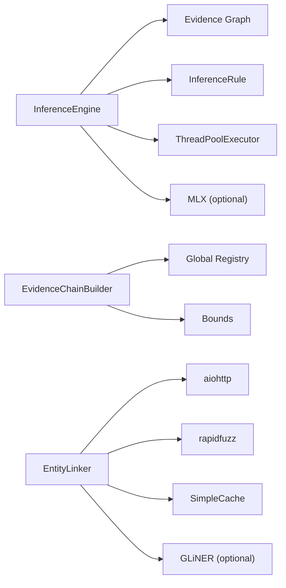

# Inference Engine

<cite>
**Referenced Files in This Document**
- [inference_engine.py](file://brain/inference_engine.py)
- [evidence_chain.py](file://knowledge/evidence_chain.py)
- [entity_linker.py](file://knowledge/entity_linker.py)
- [tool_registry.py](file://tool_registry.py)
</cite>

## Table of Contents
1. [Introduction](#introduction)
2. [Project Structure](#project-structure)
3. [Core Components](#core-components)
4. [Architecture Overview](#architecture-overview)
5. [Detailed Component Analysis](#detailed-component-analysis)
6. [Dependency Analysis](#dependency-analysis)
7. [Performance Considerations](#performance-considerations)
8. [Troubleshooting Guide](#troubleshooting-guide)
9. [Conclusion](#conclusion)
10. [Appendices](#appendices)

## Introduction
This document describes the Inference Engine responsible for abductive reasoning, evidence chaining, and entity resolution. It explains how the engine performs logical inference and knowledge synthesis beyond simple LLM responses, covering abductive reasoning algorithms, evidence evaluation mechanisms, inference rule application, evidence chaining workflows, and entity resolution/linking. It also documents configuration options, performance tuning, memory management, troubleshooting, and integration with the broader research pipeline.

## Project Structure
The Inference Engine lives in the brain module and integrates with knowledge components for evidence chaining and entity linking. Tool registry exposes inference operations to the orchestration layer.

**Diagram sources**
- [inference_engine.py](file://brain/inference_engine.py)
- [evidence_chain.py](file://knowledge/evidence_chain.py)
- [entity_linker.py](file://knowledge/entity_linker.py)
- [tool_registry.py](file://tool_registry.py)

**Section sources**
- [inference_engine.py](file://brain/inference_engine.py)
- [evidence_chain.py](file://knowledge/evidence_chain.py)
- [entity_linker.py](file://knowledge/entity_linker.py)
- [tool_registry.py](file://tool_registry.py)

## Core Components
- InferenceEngine: Central component implementing abductive reasoning, evidence graph construction, evidence chaining, multi-hop reasoning, probabilistic entity resolution, and streaming inference.
- Evidence, InferenceStep, Hypothesis, ResolvedEntity: Data models representing pieces of evidence, inference steps, generated hypotheses, and resolved entities.
- InferenceRule: Lightweight rule definition with a condition function and confidence multiplier.
- MultiHopReasoner: BFS-based reasoner for multi-hop entity inference with confidence scoring and cycle detection.
- EvidenceChain: Lightweight chain tracker for derived findings and reasoning steps.
- EntityLinker: Wikidata-based entity linking and disambiguation with caching and async HTTP.

**Section sources**
- [inference_engine.py](file://brain/inference_engine.py)
- [evidence_chain.py](file://knowledge/evidence_chain.py)
- [entity_linker.py](file://knowledge/entity_linker.py)

## Architecture Overview
The engine builds a bounded evidence graph from incoming Evidence items. As each new piece of evidence arrives, it is checked against existing evidence using OSINT-specific inference rules. When a rule evaluates true, edges are added to the evidence graph. Abductive reasoning generates candidate explanations from observations, computes priors and posteriors, and constructs inference chains. Evidence chaining and multi-hop reasoning traverse the graph to connect statements or entities. Entity resolution clusters fragmented identity signals into canonical entities. The engine exports its internal graph for visualization and integrates with the broader pipeline via tool registry.

**Diagram sources**
- [inference_engine.py](file://brain/inference_engine.py)

## Detailed Component Analysis

### Abductive Reasoning
Abductive reasoning infers the most likely explanation for a set of observations. The engine:
- Generates candidate explanations from observation patterns (entities, temporal proximity, locations).
- Computes prior probability based on base rates and explanation characteristics.
- Computes likelihood as the proportion of observations consistent with the explanation, weighted by average confidence.
- Updates beliefs using Bayesian inference with evidence strength weighting.
- Builds an inference chain from observations to the explanation.

**Diagram sources**
- [inference_engine.py](file://brain/inference_engine.py)

**Section sources**
- [inference_engine.py](file://brain/inference_engine.py)

### Evidence Evaluation and Inference Rules
Evidence evaluation uses OSINT-focused rules that trigger when conditions are met between pairs of evidence items:
- Co-location: Same IP/network or geolocation.
- Temporal proximity: Events within a time window.
- Communication pattern: Frequent communication or bidirectional contact.
- Writing style similarity: Stylometric similarity of texts.
- Behavioral fingerprinting: Matching behavior/action patterns.

Rules carry a confidence multiplier and are evaluated against evidence dictionaries. On match, bidirectional edges are added to the evidence graph.

**Diagram sources**
- [inference_engine.py](file://brain/inference_engine.py)

**Section sources**
- [inference_engine.py](file://brain/inference_engine.py)

### Evidence Chaining
Evidence chaining finds a path between two statements or evidence IDs using breadth-first search over the evidence graph. It converts a path into a sequence of InferenceStep objects, computing step-wise confidence from adjacent evidence confidences.

**Diagram sources**
- [inference_engine.py](file://brain/inference_engine.py)

**Section sources**
- [inference_engine.py](file://brain/inference_engine.py)

### Multi-Hop Reasoning
Multi-hop reasoning extends chaining to discover indirect connections between entities. It uses a dedicated MultiHopReasoner that:
- Performs BFS with depth limiting and confidence pruning.
- Detects cycles to avoid infinite loops.
- Scores paths by compounded confidence with length penalties.
- Returns top-ranked MultiHopPath objects.

**Diagram sources**
- [inference_engine.py](file://brain/inference_engine.py)

**Section sources**
- [inference_engine.py](file://brain/inference_engine.py)

### Probabilistic Entity Resolution
Entity resolution merges fragmented identity signals into canonical entities using:
- Multiple similarity signals (name similarity, attribute overlap, behavioral patterns).
- Weighted averaging with tunable thresholds.
- Clustering via greedy expansion over a similarity matrix.
- Canonical name selection and attribute merging.

**Diagram sources**
- [inference_engine.py](file://brain/inference_engine.py)

**Section sources**
- [inference_engine.py](file://brain/inference_engine.py)

### Evidence Chain Tracking (Derived Reasoning)
EvidenceChain tracks reasoning paths from raw findings through identity stitching, attribution, kill-chain tagging, pivots, and more. It serializes chains into envelopes/payload_text for downstream consumption.

**Diagram sources**
- [evidence_chain.py](file://knowledge/evidence_chain.py)

**Section sources**
- [evidence_chain.py](file://knowledge/evidence_chain.py)

### Entity Linking (Wikidata)
EntityLinker links extracted entities to Wikidata using SPARQL queries with:
- Async HTTP requests and response caching.
- Context-aware disambiguation using entity descriptions and popularity.
- Fallback NER via regex patterns when GLiNER is unavailable.
- Canonicalization and alias resolution.

**Diagram sources**
- [entity_linker.py](file://knowledge/entity_linker.py)

**Section sources**
- [entity_linker.py](file://knowledge/entity_linker.py)

## Dependency Analysis
- InferenceEngine depends on:
  - Evidence graph (ordered dict with LRU eviction).
  - InferenceRule definitions for OSINT heuristics.
  - Optional MLX acceleration for similarity computations.
  - Thread pool for safe coroutine execution in sync contexts.
- EvidenceChainBuilder depends on:
  - In-memory registry and bounded counters to prevent combinatorial growth.
- EntityLinker depends on:
  - aiohttp for async HTTP, rapidfuzz for fuzzy matching, optional GLiNER for NER, and a simple TTL cache.

**Diagram sources**
- [inference_engine.py](file://brain/inference_engine.py)
- [evidence_chain.py](file://knowledge/evidence_chain.py)
- [entity_linker.py](file://knowledge/entity_linker.py)

**Section sources**
- [inference_engine.py](file://brain/inference_engine.py)
- [evidence_chain.py](file://knowledge/evidence_chain.py)
- [entity_linker.py](file://knowledge/entity_linker.py)

## Performance Considerations
- Bounded storage:
  - Evidence and graph nodes capped with deterministic LRU eviction to prevent memory growth.
  - BFS queue and depth limits guard against combinatorial explosion.
- Streaming inference:
  - Batched processing of evidence iterators to handle large datasets without loading everything into memory.
- MLX acceleration:
  - Optional GPU-accelerated similarity computations when available; falls back to CPU.
- Async I/O:
  - EntityLinker uses async HTTP and concurrency limits to reduce latency and improve throughput.
- Confidence-based pruning:
  - Multi-hop reasoning prunes paths below a minimum confidence threshold.

[No sources needed since this section provides general guidance]

## Troubleshooting Guide
Common inference issues and resolutions:
- No evidence found for start/target:
  - Verify content matching and IDs; ensure evidence was added before chaining.
- Empty or low-confidence hypotheses:
  - Increase min_confidence_threshold or adjust evidence confidence values.
- Slow multi-hop reasoning:
  - Reduce max_hops, increase min_confidence, or lower max_paths to prune search space.
- Memory pressure:
  - Lower streaming_batch_size or reduce max_chain_depth; confirm bounded eviction is active.
- MLX failures:
  - Disable use_mlx or ensure MLX is installed; engine gracefully falls back to CPU.
- Entity linking timeouts:
  - Increase request_timeout or reduce max_candidates; check cache TTL and size.

**Section sources**
- [inference_engine.py](file://brain/inference_engine.py)
- [entity_linker.py](file://knowledge/entity_linker.py)

## Conclusion
The Inference Engine provides a robust, memory-efficient framework for OSINT reasoning. It combines rule-based inference, Bayesian updates, and graph traversal to synthesize knowledge from fragmented evidence. Its integration with derived reasoning chains and entity linking enables end-to-end traceability and canonical identity resolution, while performance controls keep it viable on constrained hardware.

[No sources needed since this section summarizes without analyzing specific files]

## Appendices

### Configuration Options
- InferenceEngine constructor:
  - max_chain_depth: maximum depth for evidence chaining.
  - min_confidence_threshold: minimum posterior probability to retain hypotheses.
  - use_mlx: enable MLX acceleration if available.
  - streaming_batch_size: batch size for streaming inference.
- MultiHopReasoner:
  - max_hops: maximum hop depth for multi-hop reasoning.
  - max_paths: maximum paths to explore.
  - min_confidence: minimum confidence threshold for path inclusion.
- EntityLinker:
  - cache_size/cache_ttl: cache capacity and TTL.
  - max_candidates: maximum candidates fetched per entity.
  - confidence_threshold: minimum score to accept a link.
  - request_timeout: HTTP request timeout.
  - use_gliner: whether to use GLiNER for NER.

**Section sources**
- [inference_engine.py](file://brain/inference_engine.py)
- [entity_linker.py](file://knowledge/entity_linker.py)

### Integration with Research Pipeline
- Tool Registry:
  - Exposes modes for abductive reasoning, evidence chaining, indirect inference, and entity resolution.
  - Converts raw observations into Evidence and feeds them to the engine.

**Section sources**
- [tool_registry.py](file://tool_registry.py)