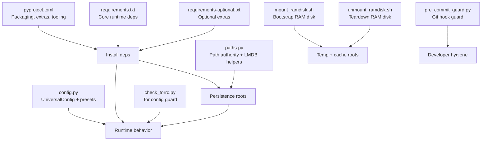
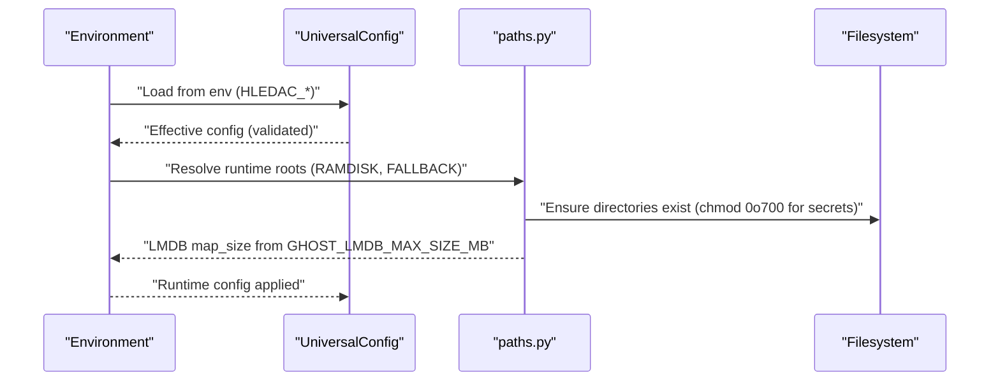
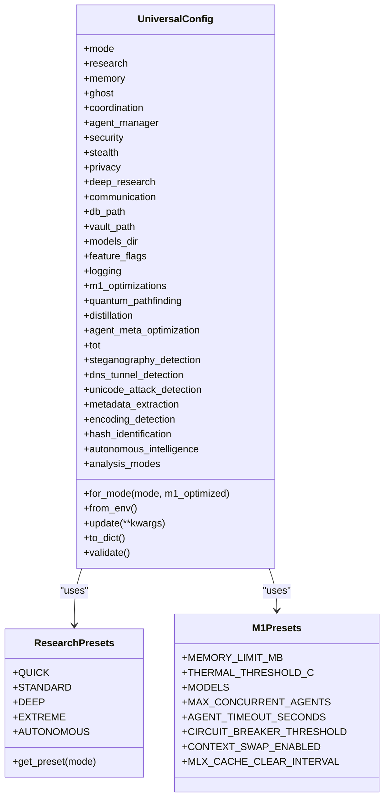
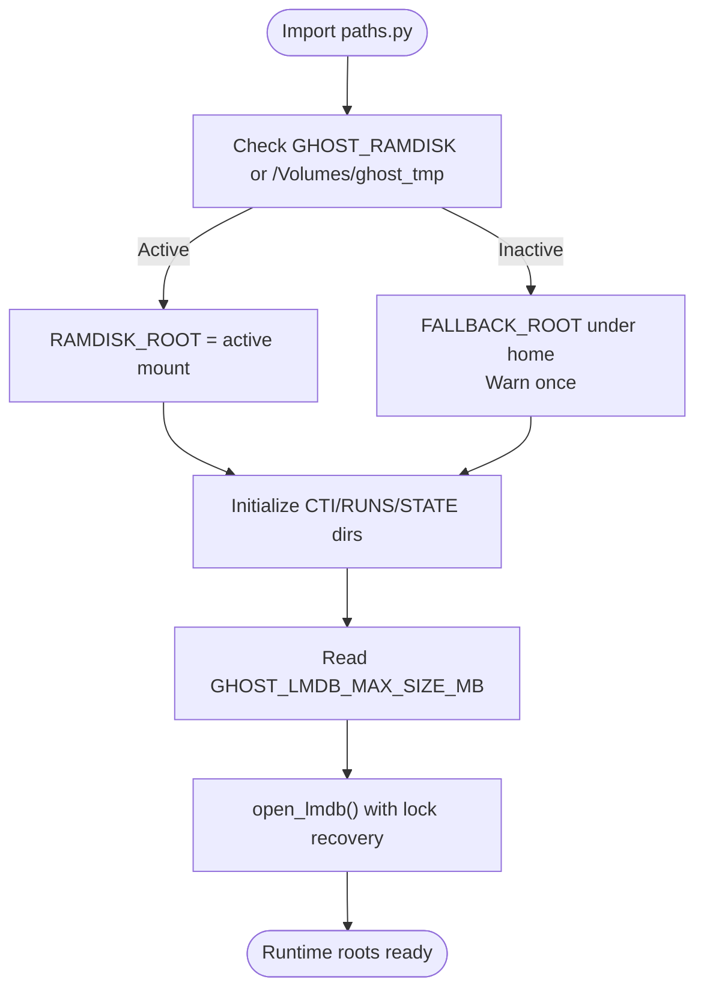
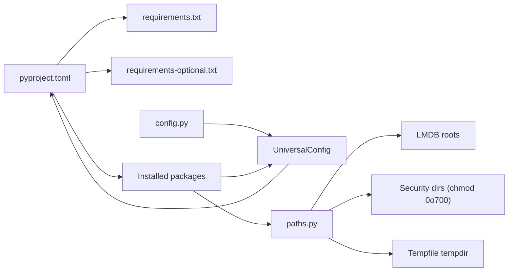

# Configuration and Deployment

<cite>
**Referenced Files in This Document**
- [pyproject.toml](file://pyproject.toml)
- [requirements.txt](file://requirements.txt)
- [requirements-optional.txt](file://requirements-optional.txt)
- [config.py](file://config.py)
- [paths.py](file://paths.py)
- [mount_ramdisk.sh](file://scripts/mount_ramdisk.sh)
- [unmount_ramdisk.sh](file://scripts/unmount_ramdisk.sh)
- [check_torrc.py](file://scripts/check_torrc.py)
- [pre_commit_guard.py](file://scripts/pre_commit_guard.py)
</cite>

## Table of Contents
1. [Introduction](#introduction)
2. [Project Structure](#project-structure)
3. [Core Components](#core-components)
4. [Architecture Overview](#architecture-overview)
5. [Detailed Component Analysis](#detailed-component-analysis)
6. [Dependency Analysis](#dependency-analysis)
7. [Performance Considerations](#performance-considerations)
8. [Troubleshooting Guide](#troubleshooting-guide)
9. [Conclusion](#conclusion)
10. [Appendices](#appendices)

## Introduction
This document explains how to configure and deploy Hledac Universal. It covers:
- Centralized configuration management and environment overrides
- Runtime path management and directory hygiene
- State persistence and cache roots
- Dependency management via pyproject.toml and requirements files
- Deployment automation scripts for macOS
- Production deployment, containerization, and cloud considerations
- Configuration validation, rollback, and monitoring guidance

## Project Structure
Hledac Universal organizes configuration and deployment assets around three pillars:
- Packaging and dependencies: pyproject.toml, requirements.txt, requirements-optional.txt
- Runtime configuration: config.py
- Runtime paths and persistence: paths.py and scripts for macOS

**Diagram sources**
- [pyproject.toml](file://pyproject.toml)
- [requirements.txt](file://requirements.txt)
- [requirements-optional.txt](file://requirements-optional.txt)
- [config.py](file://config.py)
- [paths.py](file://paths.py)
- [mount_ramdisk.sh](file://scripts/mount_ramdisk.sh)
- [unmount_ramdisk.sh](file://scripts/unmount_ramdisk.sh)
- [check_torrc.py](file://scripts/check_torrc.py)
- [pre_commit_guard.py](file://scripts/pre_commit_guard.py)

**Section sources**
- [pyproject.toml](file://pyproject.toml)
- [requirements.txt](file://requirements.txt)
- [requirements-optional.txt](file://requirements-optional.txt)
- [config.py](file://config.py)
- [paths.py](file://paths.py)

## Core Components
- Configuration system: centralized UniversalConfig with presets, environment overrides, validation, and serialization
- Path system: canonical runtime roots, RAM disk selection, LMDB map sizing, and boot-time hygiene
- Dependencies: pyproject.toml as authoritative source; requirements.txt and requirements-optional.txt for reproducible installs

Key responsibilities:
- config.py: define research modes, M1 optimizations, feature flags, logging, and validation
- paths.py: compute and enforce runtime directories, LMDB map sizes, and safety checks
- pyproject.toml: define build backend, project metadata, dependencies, optional extras, and tooling

**Section sources**
- [config.py](file://config.py)
- [paths.py](file://paths.py)
- [pyproject.toml](file://pyproject.toml)

## Architecture Overview
The configuration and deployment architecture ties together environment-driven configuration, path hygiene, and dependency management.

**Diagram sources**
- [config.py](file://config.py)
- [paths.py](file://paths.py)

## Detailed Component Analysis

### Configuration Management System
- Presets: ResearchPresets and M1Presets encapsulate mode-specific and platform-specific defaults
- Environment overrides: HLEDAC_RESEARCH_MODE, HLEDAC_M1_OPTIMIZED, HLEDAC_MEMORY_LIMIT_MB, HLEDAC_MAX_STEPS, HLEDAC_LOG_LEVEL
- Validation: validate() enforces memory bounds, step/time constraints, and M1 RAM warnings
- Serialization: to_dict() enables exporting current runtime configuration

Recommended usage patterns:
- Start with UniversalConfig.for_mode(mode, m1_optimized=True)
- Apply environment overrides via from_env()
- Optionally update specific fields via update()

**Diagram sources**
- [config.py](file://config.py)

**Section sources**
- [config.py](file://config.py)

### Environment Variable Overrides
Supported variables:
- HLEDAC_RESEARCH_MODE: quick, standard, deep, extreme, autonomous
- HLEDAC_M1_OPTIMIZED: true/false
- HLEDAC_MEMORY_LIMIT_MB: numeric MB
- HLEDAC_MAX_STEPS: integer
- HLEDAC_LOG_LEVEL: logging level string
- TOR_PROXY_URL: socks5 proxy URL for privacy layer

Behavior:
- from_env() reads and applies environment variables on top of mode-based defaults
- Unknown modes fall back to STANDARD

**Section sources**
- [config.py](file://config.py)

### Path Management System and Runtime Directory Structure
- RAM disk selection:
  - GHOST_RAMDISK env var or /Volumes/ghost_tmp determines active RAM disk
  - If neither is available, a deterministic fallback under user home is used with a one-time warning
- Canonical runtime roots:
  - CTI_EXPORT_DIR, RUNS_ROOT, RUNTIME_STATE, EMBEDDING_CACHE, BENCHMARK_CACHE
  - Legacy roots (DB_ROOT, LMDB_ROOT, EVIDENCE_ROOT, KEYS_ROOT, TOR_ROOT, NYM_ROOT, I2P_ROOT, SOCKETS_ROOT)
- LMDB configuration:
  - GHOST_LMDB_MAX_SIZE_MB controls map_size in bytes
  - open_lmdb() performs safe stale lock cleanup and single retry on LockError
- Boot hygiene:
  - assert_ramdisk_alive() ensures continuity if RAM disk was active at import
  - cleanup_fallback_artifacts() removes empty fallback directory on shutdown
  - cleanup_stale_lmdb_locks(), cleanup_stale_sockets() remove stale artifacts

**Diagram sources**
- [paths.py](file://paths.py)

**Section sources**
- [paths.py](file://paths.py)

### State Persistence Mechanisms
- LMDB-backed stores under LMDB_ROOT and SPRINT_LMDB_ROOT
- DuckDB-backed IOC graph store under SPRINT_STORE_ROOT with persistent ioc_graph.duckdb
- Project-local runtime state under RUNTIME_STATE
- Embedding cache and benchmark cache under dedicated directories

Operational hygiene:
- open_lmdb() attempts safe stale lock cleanup before opening
- Temporary directory is redirected to RAMDISK_ROOT via tempfile.bootstrap

**Section sources**
- [paths.py](file://paths.py)

### Dependency Management via pyproject.toml and requirements files
- pyproject.toml is the single source of truth for:
  - Build backend and project metadata
  - Core dependencies and optional extras
  - Tooling (Ruff, MyPy, pytest, uv)
- requirements.txt lists core runtime dependencies for reproducible installs
- requirements-optional.txt enumerates optional extras for acceleration, storage, transport, and security

Installation strategies:
- Default install: pip install .
- Extras: pip install '.[light,apple-accel,osint-html,graph-storage,dev,acceleration,nlp,rerank,browser,security,transport]'
- Torch: install separately per notes in requirements-optional.txt

**Section sources**
- [pyproject.toml](file://pyproject.toml)
- [requirements.txt](file://requirements.txt)
- [requirements-optional.txt](file://requirements-optional.txt)

### Deployment Automation Scripts
macOS-focused helpers:
- mount_ramdisk.sh: creates and prepares a 1 GB RAM disk at /tmp/hledac_ramdisk or custom MOUNT_POINT, with zombie device cleanup and subdirectory preparation
- unmount_ramdisk.sh: safely detaches the RAM disk device
- check_torrc.py: validates presence of IsolateSOCKSAuth in torrc for privacy layer
- pre_commit_guard.py: blocks commits of files named None or None.*

Usage tips:
- Set GHOST_RAMDISK to the desired mount point before launching the app
- Ensure RAM disk is mounted before starting long-running research sessions
- Use check_torrc.py to verify Tor configuration before enabling privacy layer

**Section sources**
- [mount_ramdisk.sh](file://scripts/mount_ramdisk.sh)
- [unmount_ramdisk.sh](file://scripts/unmount_ramdisk.sh)
- [check_torrc.py](file://scripts/check_torrc.py)
- [pre_commit_guard.py](file://scripts/pre_commit_guard.py)

## Dependency Analysis
Relationships among configuration, paths, and packaging:

**Diagram sources**
- [pyproject.toml](file://pyproject.toml)
- [requirements.txt](file://requirements.txt)
- [requirements-optional.txt](file://requirements-optional.txt)
- [config.py](file://config.py)
- [paths.py](file://paths.py)

**Section sources**
- [pyproject.toml](file://pyproject.toml)
- [requirements.txt](file://requirements.txt)
- [requirements-optional.txt](file://requirements-optional.txt)
- [config.py](file://config.py)
- [paths.py](file://paths.py)

## Performance Considerations
- M1 8GB optimization:
  - Reduced concurrent agents, conservative memory limits, and model stack trimming
  - Thermal thresholds and periodic MLX cache clearing
- LMDB sizing:
  - Tune GHOST_LMDB_MAX_SIZE_MB to balance throughput and memory footprint
- RAM disk usage:
  - Prefer active RAM disk for temporary files and caches; fallback to SSD only when necessary
- Logging:
  - Adjust HLEDAC_LOG_LEVEL to reduce overhead during intensive runs

[No sources needed since this section provides general guidance]

## Troubleshooting Guide
Common issues and resolutions:
- RAM disk not available:
  - Set GHOST_RAMDISK to a valid mount point or mount /Volumes/ghost_tmp
  - Use mount_ramdisk.sh to bootstrap; unmount_ramdisk.sh to teardown
- LMDB lock errors:
  - open_lmdb() retries after safe stale lock cleanup; if persistent, verify process ownership and remove stale locks manually
- Tor configuration:
  - Run check_torrc.py to confirm IsolateSOCKSAuth presence; adjust torrc accordingly
- Git hygiene:
  - pre_commit_guard.py prevents committing None or None.* files; resolve staged entries before committing

Validation and diagnostics:
- Use UniversalConfig.validate() to catch invalid combinations early
- Inspect runtime logs and ensure directories exist under RUNTIME_BASE

**Section sources**
- [paths.py](file://paths.py)
- [check_torrc.py](file://scripts/check_torrc.py)
- [pre_commit_guard.py](file://scripts/pre_commit_guard.py)
- [config.py](file://config.py)

## Conclusion
Hledac Universal provides a robust configuration and deployment framework:
- Centralized configuration with environment overrides and validation
- Canonical path management with RAM disk awareness and boot-time hygiene
- Clear dependency boundaries via pyproject.toml and requirements files
- Practical automation scripts for macOS environments

Adopting these practices ensures reproducible builds, predictable runtime behavior, and safer operational defaults.

[No sources needed since this section summarizes without analyzing specific files]

## Appendices

### A. Configuration Customization Options
- Research modes: QUICK, STANDARD, DEEP, EXTREME, AUTONOMOUS
- M1 optimizations: enabled by default; tune via environment or presets
- Feature flags: enable/disable layers and engines (e.g., knowledge, RAG, quantum pathfinding)
- Logging: level, file output, and directory

**Section sources**
- [config.py](file://config.py)

### B. Environment Setup Guidelines
- Python: managed by uv per pyproject.toml; use only-managed interpreter
- RAM disk: mount before launch; set GHOST_RAMDISK if not using default
- Tor: ensure torrc includes IsolateSOCKSAuth; verify with check_torrc.py
- Optional extras: install via pip with extras or requirements-optional.txt

**Section sources**
- [pyproject.toml](file://pyproject.toml)
- [requirements-optional.txt](file://requirements-optional.txt)
- [mount_ramdisk.sh](file://scripts/mount_ramdisk.sh)
- [check_torrc.py](file://scripts/check_torrc.py)

### C. Deployment Automation Scripts
- mount_ramdisk.sh: idempotent RAM disk creation and subdirectory setup
- unmount_ramdisk.sh: safe detachment of RAM disk device
- check_torrc.py: Tor configuration guard
- pre_commit_guard.py: pre-commit protection against problematic filenames

**Section sources**
- [mount_ramdisk.sh](file://scripts/mount_ramdisk.sh)
- [unmount_ramdisk.sh](file://scripts/unmount_ramdisk.sh)
- [check_torrc.py](file://scripts/check_torrc.py)
- [pre_commit_guard.py](file://scripts/pre_commit_guard.py)

### D. Containerization Strategies
- Base image: align with pyproject.toml’s Python version policy
- Entrypoint: use hledac CLI script defined in pyproject.toml
- Volumes: bind mount persistent directories for runtime state and caches
- Environment: set HLEDAC_* variables and TOR_PROXY_URL as needed
- Optional extras: install via pip with appropriate extras or requirements-optional.txt

[No sources needed since this section provides general guidance]

### E. Cloud Deployment Considerations
- State persistence: prefer object storage or persistent volumes for RUNTIME_STATE and SPRINT_STORE_ROOT
- Secrets: store KEYS_ROOT and related artifacts in secure secret managers
- Network: configure proxies and DNS according to privacy layer settings
- Observability: export runtime metrics and logs; monitor memory and thermal thresholds

[No sources needed since this section provides general guidance]

### F. Monitoring Setup
- Metrics: track memory usage, thermal throttling, LMDB contention, and agent concurrency
- Logs: centralize logs from RUNTIME_BASE and ensure rotation
- Health checks: verify RAM disk availability and LMDB accessibility

[No sources needed since this section provides general guidance]