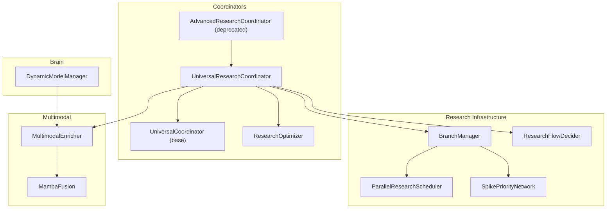
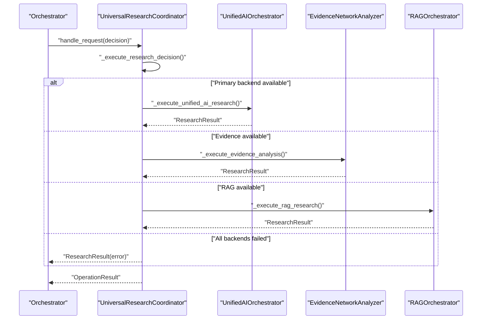
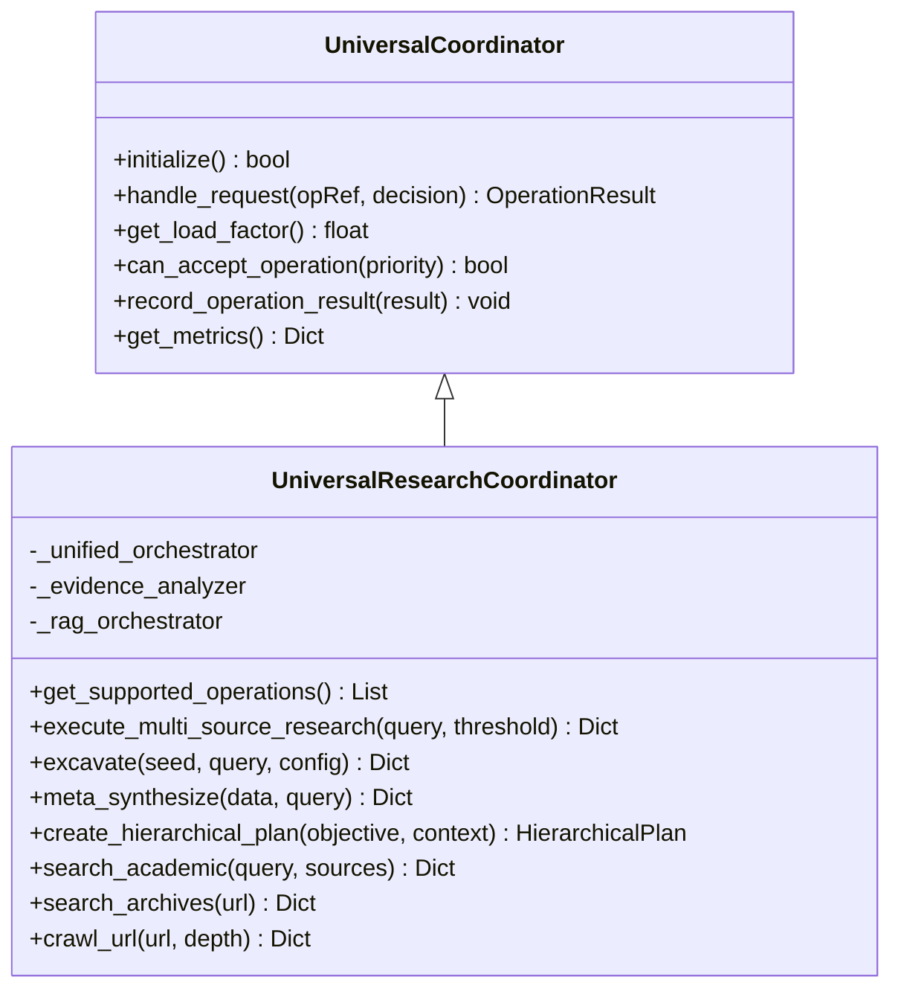
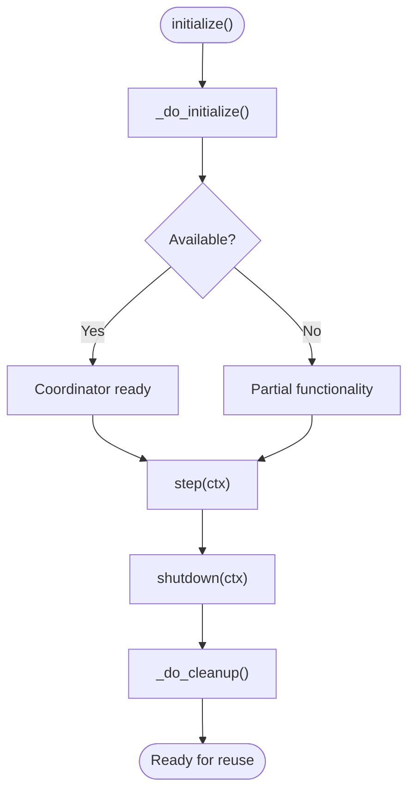
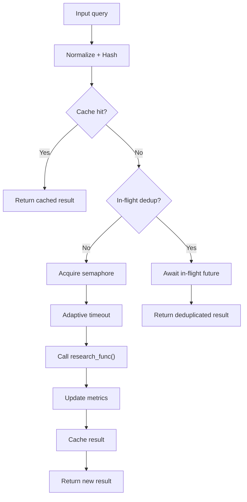
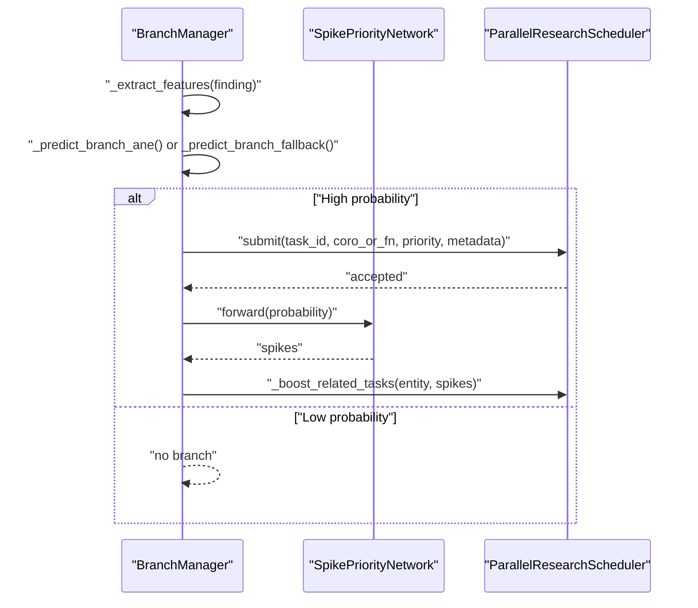
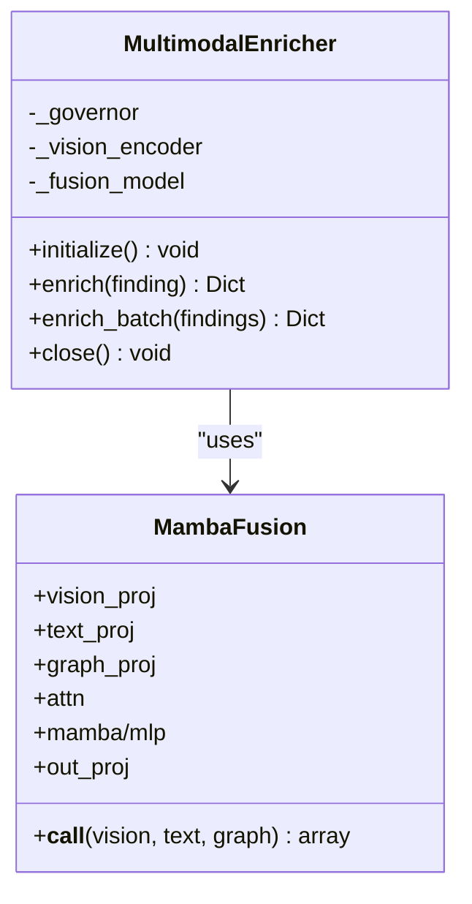
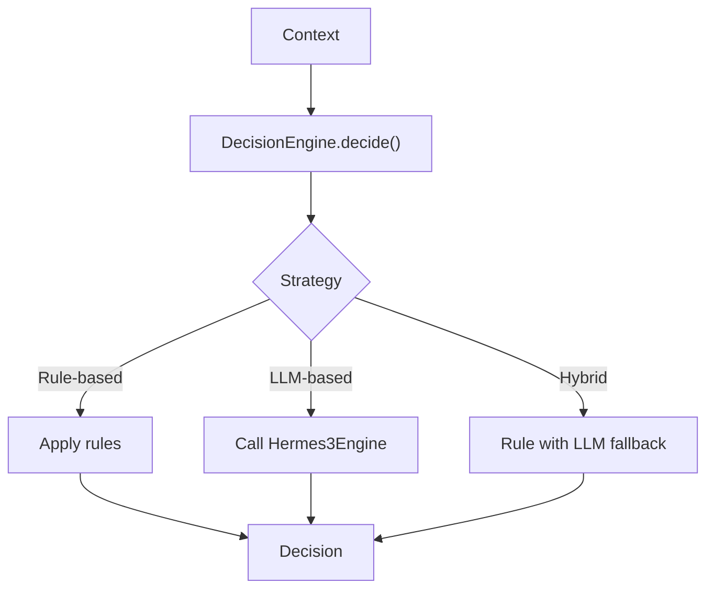
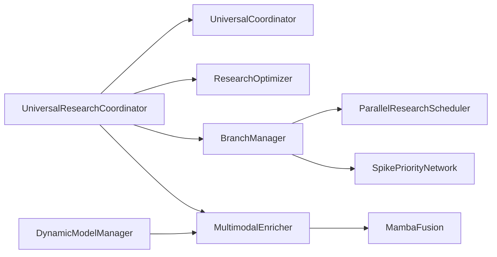

# Advanced Research Coordinator

<cite>
**Referenced Files in This Document**
- [advanced_research_coordinator.py](file://coordinators/advanced_research_coordinator.py)
- [research_coordinator.py](file://coordinators/research_coordinator.py)
- [base.py](file://coordinators/base.py)
- [research_optimizer.py](file://coordinators/research_optimizer.py)
- [branch_manager.py](file://research/branch_manager.py)
- [parallel_scheduler.py](file://research/parallel_scheduler.py)
- [spike_priority.py](file://research/spike_priority.py)
- [research_flow_decider.py](file://brain/research_flow_decider.py)
- [dynamic_model_manager.py](file://brain/dynamic_model_manager.py)
- [analyzer.py](file://multimodal/analyzer.py)
- [fusion.py](file://multimodal/fusion.py)
</cite>

## Table of Contents
1. [Introduction](#introduction)
2. [Project Structure](#project-structure)
3. [Core Components](#core-components)
4. [Architecture Overview](#architecture-overview)
5. [Detailed Component Analysis](#detailed-component-analysis)
6. [Dependency Analysis](#dependency-analysis)
7. [Performance Considerations](#performance-considerations)
8. [Troubleshooting Guide](#troubleshooting-guide)
9. [Conclusion](#conclusion)
10. [Appendices](#appendices)

## Introduction
This document describes the Advanced Research Coordinator and its modern replacement within the Universal Research Coordinator. It explains how the system manages complex research workflows, coordinates multiple research phases, and integrates advanced research patterns. It covers research cycle management, task prioritization, multimodal research orchestration, configuration options, performance tuning, monitoring, failure recovery, and scaling considerations for large-scale operations.

## Project Structure
The Advanced Research Coordinator has been deprecated in favor of the Universal Research Coordinator, which consolidates research orchestration, routing, and advanced features. Supporting components include:
- Universal base coordinator with lifecycle, load management, and metrics
- Research optimizer for performance tuning
- Task scheduling and branching for multi-agent research
- Multimodal enrichment for images and documents
- Decision engines for research flow control

**Diagram sources**
- [advanced_research_coordinator.py:1-104](file://coordinators/advanced_research_coordinator.py#L1-L104)
- [research_coordinator.py:172-1374](file://coordinators/research_coordinator.py#L172-L1374)
- [base.py:88-553](file://coordinators/base.py#L88-L553)
- [research_optimizer.py:77-464](file://coordinators/research_optimizer.py#L77-L464)
- [branch_manager.py:27-257](file://research/branch_manager.py#L27-L257)
- [parallel_scheduler.py:32-240](file://research/parallel_scheduler.py#L32-L240)
- [spike_priority.py:48-112](file://research/spike_priority.py#L48-L112)
- [research_flow_decider.py:67-280](file://brain/research_flow_decider.py#L67-L280)
- [dynamic_model_manager.py:201-423](file://brain/dynamic_model_manager.py#L201-L423)
- [analyzer.py:217-876](file://multimodal/analyzer.py#L217-L876)
- [fusion.py:23-142](file://multimodal/fusion.py#L23-L142)

**Section sources**
- [advanced_research_coordinator.py:1-104](file://coordinators/advanced_research_coordinator.py#L1-L104)
- [research_coordinator.py:172-1374](file://coordinators/research_coordinator.py#L172-L1374)
- [base.py:88-553](file://coordinators/base.py#L88-L553)

## Core Components
- UniversalResearchCoordinator: Consolidated research orchestration with multi-source routing, fallback chains, synthesis, and advanced deep research features (excavation, meta-synthesis, hierarchical planning).
- UniversalCoordinator (base): Provides lifecycle management, load factor computation, memory-aware scheduling, metrics, and a stable spine interface for orchestrator integration.
- ResearchOptimizer: Query optimization, deduplication, caching, adaptive timeouts, and batch execution for performance tuning.
- BranchManager and ParallelResearchScheduler: Dynamic branching, spiking priority networks, and priority queues for multi-agent research.
- MultimodalEnricher and MambaFusion: Vision encoders, fusion models, and CLIP similarity for multimodal research orchestration.
- DynamicModelManager: LRU cache, idle timeouts, and thrashing protection for model management.
- ResearchFlowDecider: Rule-based, LLM-based, and hybrid decision engines for research flow control.

**Section sources**
- [research_coordinator.py:172-1374](file://coordinators/research_coordinator.py#L172-L1374)
- [base.py:88-553](file://coordinators/base.py#L88-L553)
- [research_optimizer.py:77-464](file://coordinators/research_optimizer.py#L77-L464)
- [branch_manager.py:27-257](file://research/branch_manager.py#L27-L257)
- [parallel_scheduler.py:32-240](file://research/parallel_scheduler.py#L32-L240)
- [spike_priority.py:48-112](file://research/spike_priority.py#L48-L112)
- [analyzer.py:217-876](file://multimodal/analyzer.py#L217-L876)
- [fusion.py:23-142](file://multimodal/fusion.py#L23-L142)
- [dynamic_model_manager.py:201-423](file://brain/dynamic_model_manager.py#L201-L423)
- [research_flow_decider.py:67-280](file://brain/research_flow_decider.py#L67-L280)

## Architecture Overview
The Universal Research Coordinator acts as the central research orchestrator, delegating to specialized subsystems and leveraging optimization and scheduling primitives.

**Diagram sources**
- [research_coordinator.py:404-545](file://coordinators/research_coordinator.py#L404-L545)
- [research_coordinator.py:457-545](file://coordinators/research_coordinator.py#L457-L545)

## Detailed Component Analysis

### UniversalResearchCoordinator
- Responsibilities:
  - Multi-source research routing (Unified AI, Evidence, RAG) with confidence-based decisions and fallback chains.
  - Advanced deep research: excavation, meta-synthesis, hierarchical planning.
  - Context preservation and synthesis across multiple backends.
  - Hermes3 integration for academic search, archive discovery, and crawling.
- Key methods:
  - Routing: _execute_research_decision, _execute_unified_ai_research, _execute_evidence_analysis, _execute_rag_research.
  - Advanced: excavate, meta_synthesize, create_hierarchical_plan.
  - Multi-source synthesis: execute_multi_source_research, _synthesize_results.
  - Hermes3: search_academic, search_archives, crawl_url, execute_research_plan.

**Diagram sources**
- [base.py:88-553](file://coordinators/base.py#L88-L553)
- [research_coordinator.py:172-1374](file://coordinators/research_coordinator.py#L172-L1374)

**Section sources**
- [research_coordinator.py:172-1374](file://coordinators/research_coordinator.py#L172-L1374)

### UniversalCoordinator (Base)
- Provides:
  - Operation lifecycle: track/untrack, history trimming.
  - Load factor computation with memory pressure adjustments.
  - Graceful degradation and partial initialization.
  - Stable spine interface: start, step, shutdown.
  - Metrics and capabilities reporting.

**Diagram sources**
- [base.py:180-227](file://coordinators/base.py#L180-L227)
- [base.py:508-552](file://coordinators/base.py#L508-L552)

**Section sources**
- [base.py:88-553](file://coordinators/base.py#L88-L553)

### ResearchOptimizer
- Optimizations:
  - Query normalization and deduplication.
  - Caching with TTL and policy selection.
  - Adaptive timeouts based on historical performance.
  - Concurrency limiting and batch execution.
- Usage:
  - execute(query, research_func, **kwargs) returns OptimizedResult with metadata.
  - execute_batch for batched queries with deduplication and mapping.

**Diagram sources**
- [research_optimizer.py:114-225](file://coordinators/research_optimizer.py#L114-L225)

**Section sources**
- [research_optimizer.py:77-464](file://coordinators/research_optimizer.py#L77-L464)

### BranchManager and ParallelResearchScheduler
- BranchManager:
  - Decides whether to create new research branches based on findings.
  - Uses ANE model or fallback rules; integrates spiking priority network to boost related tasks.
- ParallelResearchScheduler:
  - Priority queues for I/O and CPU tasks with adaptive concurrency.
  - Work-stealing placeholder, event-based wait, and thread pool executor.

**Diagram sources**
- [branch_manager.py:67-202](file://research/branch_manager.py#L67-L202)
- [spike_priority.py:60-75](file://research/spike_priority.py#L60-L75)
- [parallel_scheduler.py:69-177](file://research/parallel_scheduler.py#L69-L177)

**Section sources**
- [branch_manager.py:27-257](file://research/branch_manager.py#L27-L257)
- [parallel_scheduler.py:32-240](file://research/parallel_scheduler.py#L32-L240)
- [spike_priority.py:48-112](file://research/spike_priority.py#L48-L112)

### Multimodal Research Orchestration
- MultimodalEnricher:
  - Vision encoder, MambaFusion, optional CLIP similarity.
  - RAM guard via ResourceGovernor; lazy-loading heavy modules.
  - Document extraction with triage facets and bounded envelopes.
- MambaFusion:
  - Vision/text/graph fusion with FlashAttention/Mamba or MLP fallback.

**Diagram sources**
- [analyzer.py:217-876](file://multimodal/analyzer.py#L217-L876)
- [fusion.py:23-142](file://multimodal/fusion.py#L23-L142)

**Section sources**
- [analyzer.py:217-876](file://multimodal/analyzer.py#L217-L876)
- [fusion.py:23-142](file://multimodal/fusion.py#L23-L142)

### Research Flow Control
- ResearchFlowDecider:
  - Rule-based decisions with confidence thresholds.
  - LLM-based fallback via Hermes3Engine.
  - Hybrid strategy with edge-case handling.
- DynamicModelManager:
  - LRU cache with idle timeouts and thrashing protection.
  - Safe model loading/unloading with MLX cache clearing.

**Diagram sources**
- [research_flow_decider.py:140-252](file://brain/research_flow_decider.py#L140-L252)
- [dynamic_model_manager.py:268-344](file://brain/dynamic_model_manager.py#L268-L344)

**Section sources**
- [research_flow_decider.py:67-280](file://brain/research_flow_decider.py#L67-L280)
- [dynamic_model_manager.py:201-423](file://brain/dynamic_model_manager.py#L201-L423)

## Dependency Analysis
- Coordination layer:
  - UniversalResearchCoordinator depends on UniversalCoordinator for lifecycle and metrics.
  - Uses Hermes3 integrations for academic, archive, and crawling.
- Scheduling and branching:
  - BranchManager integrates with ParallelResearchScheduler and SpikePriorityNetwork.
- Multimodal:
  - MultimodalEnricher depends on VisionEncoder and MambaFusion; guarded by ResourceGovernor.
- Optimization:
  - ResearchOptimizer provides caching, deduplication, and adaptive timeouts for research functions.

**Diagram sources**
- [research_coordinator.py:172-1374](file://coordinators/research_coordinator.py#L172-L1374)
- [base.py:88-553](file://coordinators/base.py#L88-L553)
- [research_optimizer.py:77-464](file://coordinators/research_optimizer.py#L77-L464)
- [branch_manager.py:27-257](file://research/branch_manager.py#L27-L257)
- [parallel_scheduler.py:32-240](file://research/parallel_scheduler.py#L32-L240)
- [spike_priority.py:48-112](file://research/spike_priority.py#L48-L112)
- [analyzer.py:217-876](file://multimodal/analyzer.py#L217-L876)
- [fusion.py:23-142](file://multimodal/fusion.py#L23-L142)
- [dynamic_model_manager.py:201-423](file://brain/dynamic_model_manager.py#L201-L423)

**Section sources**
- [research_coordinator.py:172-1374](file://coordinators/research_coordinator.py#L172-L1374)
- [base.py:88-553](file://coordinators/base.py#L88-L553)

## Performance Considerations
- Concurrency and load:
  - Use can_accept_operation(priority) to gate acceptance based on load factor and memory pressure.
  - Tune max_concurrent in UniversalCoordinator initialization.
- Adaptive timeouts:
  - ResearchOptimizer calculates adaptive timeouts based on historical durations and success rates.
- Caching and deduplication:
  - Enable query_deduplication and choose cache policy (MEMORY_ONLY/PERSISTENT) to reduce redundant work.
- Multimodal memory guard:
  - MultimodalEnricher checks governor for RAM availability before heavy operations.
- Model lifecycle:
  - DynamicModelManager enforces idle timeouts and thrashing protection; clear caches when needed.

[No sources needed since this section provides general guidance]

## Troubleshooting Guide
- Initialization failures:
  - UniversalCoordinator logs initialization errors and continues with partial availability.
- Backend unavailability:
  - UniversalResearchCoordinator routes through fallback chain; check availability flags for each backend.
- Timeout handling:
  - ResearchOptimizer wraps research functions with timeouts; adjust default_timeout or strategy.
- Memory pressure:
  - UniversalCoordinator updates memory pressure levels; reduce concurrency or throttle operations.
- Multimodal failures:
  - MultimodalEnricher is fail-soft; check logs for specific module failures and RAM guard denials.

**Section sources**
- [base.py:180-227](file://coordinators/base.py#L180-L227)
- [research_coordinator.py:267-331](file://coordinators/research_coordinator.py#L267-L331)
- [research_optimizer.py:174-225](file://coordinators/research_optimizer.py#L174-L225)
- [analyzer.py:407-441](file://multimodal/analyzer.py#L407-L441)

## Conclusion
The Advanced Research Coordinator has been superseded by the UniversalResearchCoordinator, which consolidates multi-source routing, fallback chains, synthesis, and advanced deep research features. It integrates seamlessly with scheduling, optimization, and multimodal systems, providing robust orchestration for complex research workflows. For new development, use UniversalResearchCoordinator with ResearchDepth.DEEP and leverage ResearchOptimizer for performance tuning.

[No sources needed since this section summarizes without analyzing specific files]

## Appendices

### Configuration Options
- ResearchDepth:
  - STANDARD: basic multi-source research
  - DEEP: advanced excavation with meta-synthesis
- ExcavationConfig:
  - max_depth, max_breadth, strategy, min_relevance_score, relevance_decay, max_context_size_mb, build_citation_graph, enable_tangent_exploration, auto_summarize, progress_callback
- OptimizationConfig:
  - strategy (AGGRESSIVE/BALANCED/CONSERVATIVE/ADAPTIVE), cache_policy, max_concurrent_requests, default_timeout, adaptive_timeout, query_deduplication, result_batching, batch_size, memory_limit_mb

**Section sources**
- [research_coordinator.py:45-94](file://coordinators/research_coordinator.py#L45-L94)
- [research_optimizer.py:44-55](file://coordinators/research_optimizer.py#L44-L55)

### Monitoring and Metrics
- UniversalCoordinator provides:
  - Operation tracking, history trimming, and capacity info (load factor, available slots).
  - Metrics: total operations, success/failure counts, success rate, average execution time.
- ResearchOptimizer provides:
  - Stats on cache size, active in-flight requests, performance metrics, and query patterns.

**Section sources**
- [base.py:416-451](file://coordinators/base.py#L416-L451)
- [base.py:367-377](file://coordinators/base.py#L367-L377)
- [research_optimizer.py:378-423](file://coordinators/research_optimizer.py#L378-L423)

### Scaling Considerations
- Use ParallelResearchScheduler with adaptive concurrency and event-based waiting.
- Employ ResearchOptimizer for batch execution and deduplication.
- Apply DynamicModelManager idle timeouts and LRU eviction to manage model memory.
- Monitor load factor and memory pressure via UniversalCoordinator capacity info.

**Section sources**
- [parallel_scheduler.py:58-68](file://research/parallel_scheduler.py#L58-L68)
- [research_optimizer.py:226-270](file://coordinators/research_optimizer.py#L226-L270)
- [dynamic_model_manager.py:366-404](file://brain/dynamic_model_manager.py#L366-L404)
- [base.py:308-377](file://coordinators/base.py#L308-L377)