# Coordination System

<cite>
**Referenced Files in This Document**
- [coordinators/__init__.py](file://hledac/universal/coordinators/__init__.py)
- [coordinators/base.py](file://hledac/universal/coordinators/base.py)
- [coordinators/coordinator_registry.py](file://hledac/universal/coordinators/coordinator_registry.py)
- [coordinators/agent_coordination_engine.py](file://hledac/universal/coordinators/agent_coordination_engine.py)
- [coordinators/swarm_coordinator.py](file://hledac/universal/coordinators/swarm_coordinator.py)
- [coordinators/memory_coordinator.py](file://hledac/universal/coordinators/memory_coordinator.py)
- [coordinators/security_coordinator.py](file://hledac/universal/coordinators/security_coordinator.py)
- [coordinators/performance_coordinator.py](file://hledac/universal/coordinators/performance_coordinator.py)
- [coordinators/research_coordinator.py](file://hledac/universal/coordinators/research_coordinator.py)
</cite>

## Table of Contents
1. [Introduction](#introduction)
2. [Project Structure](#project-structure)
3. [Core Components](#core-components)
4. [Architecture Overview](#architecture-overview)
5. [Detailed Component Analysis](#detailed-component-analysis)
6. [Dependency Analysis](#dependency-analysis)
7. [Performance Considerations](#performance-considerations)
8. [Troubleshooting Guide](#troubleshooting-guide)
9. [Conclusion](#conclusion)
10. [Appendices](#appendices)

## Introduction
This document describes the Hledac Universal coordination system, which orchestrates heterogeneous research, execution, security, monitoring, memory, and performance operations across a modular coordinator framework. It explains the coordinator architecture, lifecycle management, inter-coordinator communication patterns, and advanced coordination strategies. It also covers configuration options, performance tuning, monitoring, and integration patterns for custom coordinators, including swarm intelligence and multi-agent coordination.

## Project Structure
The coordination system is organized under the coordinators package, with a base class defining the universal contract, a central registry for discovery and routing, and specialized coordinators for research, execution, security, monitoring, memory, performance, swarm intelligence, and multi-agent orchestration.

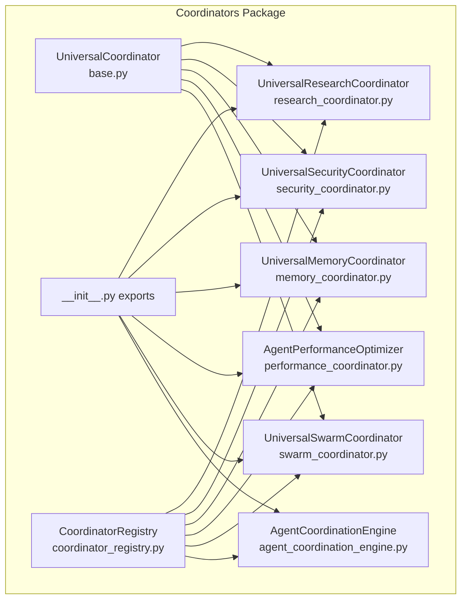

**Diagram sources**
- [coordinators/__init__.py:1-273](file://hledac/universal/coordinators/__init__.py#L1-L273)
- [coordinators/base.py:88-553](file://hledac/universal/coordinators/base.py#L88-L553)
- [coordinators/coordinator_registry.py:49-602](file://hledac/universal/coordinators/coordinator_registry.py#L49-L602)
- [coordinators/research_coordinator.py:172-800](file://hledac/universal/coordinators/research_coordinator.py#L172-L800)
- [coordinators/security_coordinator.py:73-800](file://hledac/universal/coordinators/security_coordinator.py#L73-L800)
- [coordinators/memory_coordinator.py:694-800](file://hledac/universal/coordinators/memory_coordinator.py#L694-L800)
- [coordinators/performance_coordinator.py:551-807](file://hledac/universal/coordinators/performance_coordinator.py#L551-L807)
- [coordinators/swarm_coordinator.py:199-800](file://hledac/universal/coordinators/swarm_coordinator.py#L199-L800)
- [coordinators/agent_coordination_engine.py:116-482](file://hledac/universal/coordinators/agent_coordination_engine.py#L116-L482)

**Section sources**
- [coordinators/__init__.py:1-273](file://hledac/universal/coordinators/__init__.py#L1-L273)

## Core Components
- UniversalCoordinator: Base class defining operation lifecycle, load management, memory pressure awareness, metrics, and the stable spine interface (start/step/shutdown).
- CoordinatorRegistry: Central registry enabling discovery, registration, routing, load balancing, health monitoring, and statistics aggregation.
- Specialized Coordinators: Research, Security, Memory, Performance, Swarm, and Multi-agent engines, each implementing specific operation domains.

Key capabilities:
- Operation lifecycle: generate/track/untrack operation IDs, maintain history, and compute metrics.
- Load and capacity management: calculate load factor, enforce priority-based acceptance, and integrate memory pressure multipliers.
- Memory awareness: monitor and react to memory pressure levels for adaptive scheduling.
- Stable spine interface: start/step/shutdown for orchestrator integration.

**Section sources**
- [coordinators/base.py:88-553](file://hledac/universal/coordinators/base.py#L88-L553)

## Architecture Overview
The system integrates a base coordinator contract with a registry-driven routing layer and specialized coordinators. The registry maintains coordinator availability, priorities, and weights, and routes operations using strategies such as priority, load, weighted, or auto selection. Coordinators expose capabilities and can be queried for health and statistics.

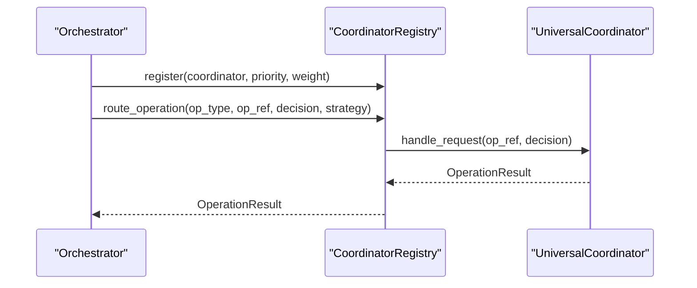

**Diagram sources**
- [coordinators/coordinator_registry.py:172-231](file://hledac/universal/coordinators/coordinator_registry.py#L172-L231)
- [coordinators/base.py:148-164](file://hledac/universal/coordinators/base.py#L148-L164)

**Section sources**
- [coordinators/coordinator_registry.py:49-424](file://hledac/universal/coordinators/coordinator_registry.py#L49-L424)

## Detailed Component Analysis

### UniversalCoordinator Base
- Responsibilities: lifecycle management, operation tracking, load/capacity control, memory pressure handling, metrics, and the stable spine interface.
- Notable features: graceful degradation during initialization, memory-aware load factor computation, and capability reporting.

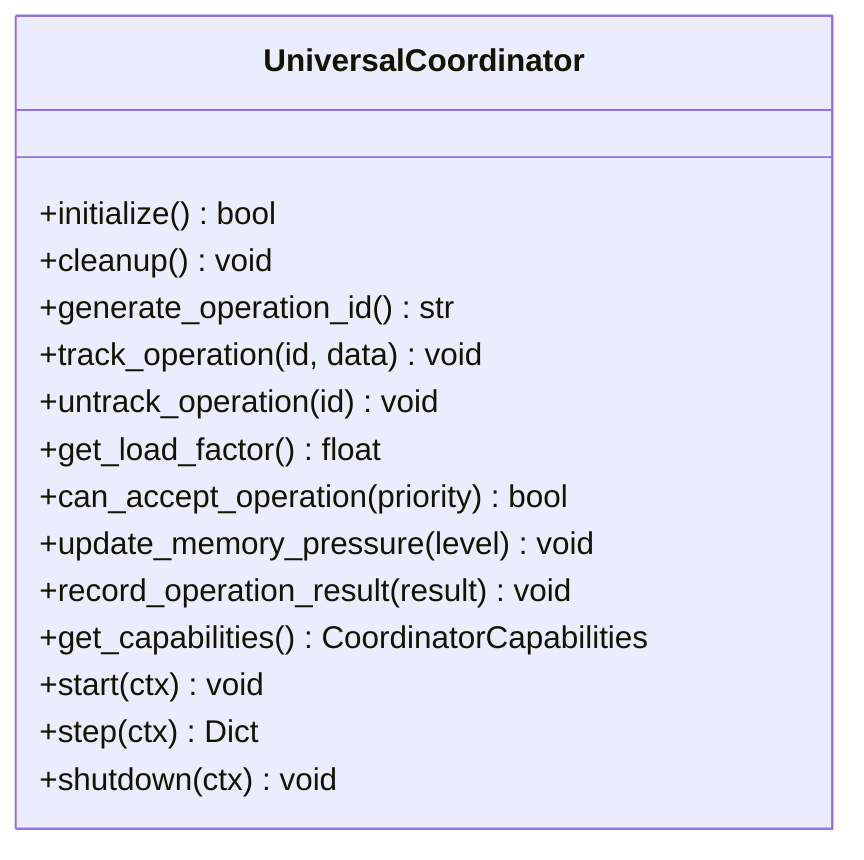

**Diagram sources**
- [coordinators/base.py:88-553](file://hledac/universal/coordinators/base.py#L88-L553)

**Section sources**
- [coordinators/base.py:88-553](file://hledac/universal/coordinators/base.py#L88-L553)

### CoordinatorRegistry
- Manages registration, health checks, routing, and statistics.
- Routing strategies: priority, load, weighted, auto.
- Provides aggregated capabilities and load distribution.

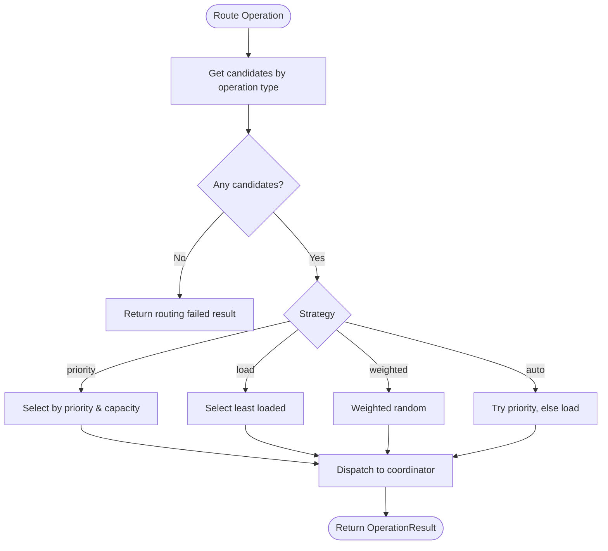

**Diagram sources**
- [coordinators/coordinator_registry.py:172-307](file://hledac/universal/coordinators/coordinator_registry.py#L172-L307)

**Section sources**
- [coordinators/coordinator_registry.py:49-424](file://hledac/universal/coordinators/coordinator_registry.py#L49-L424)

### UniversalResearchCoordinator
- Routes research decisions across Unified AI, Evidence Network, and RAG backends with fallback chains.
- Supports multi-source synthesis, confidence-based routing, and research context preservation.
- Advanced research features include excavation planning, citation graphs, meta-pattern detection, theory generation, and hierarchical planning.

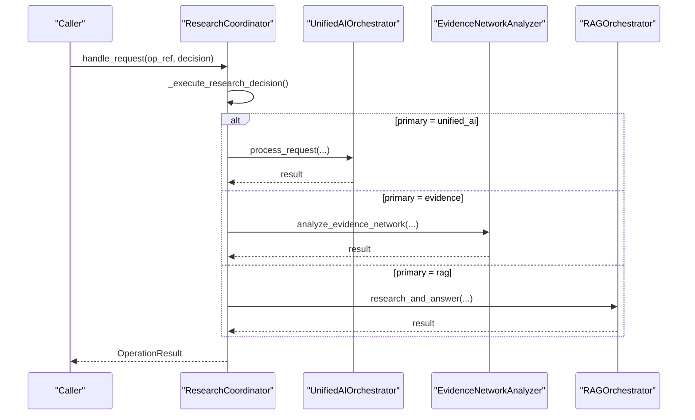

**Diagram sources**
- [coordinators/research_coordinator.py:404-546](file://hledac/universal/coordinators/research_coordinator.py#L404-L546)

**Section sources**
- [coordinators/research_coordinator.py:172-800](file://hledac/universal/coordinators/research_coordinator.py#L172-L800)

### UniversalSecurityCoordinator
- Multi-layer security with stealth, threat intelligence, quantum-resistant cryptography, and ZKP.
- Routes operations based on keywords and escalates security levels from 1–4.
- Tracks security contexts and provides comprehensive security state.

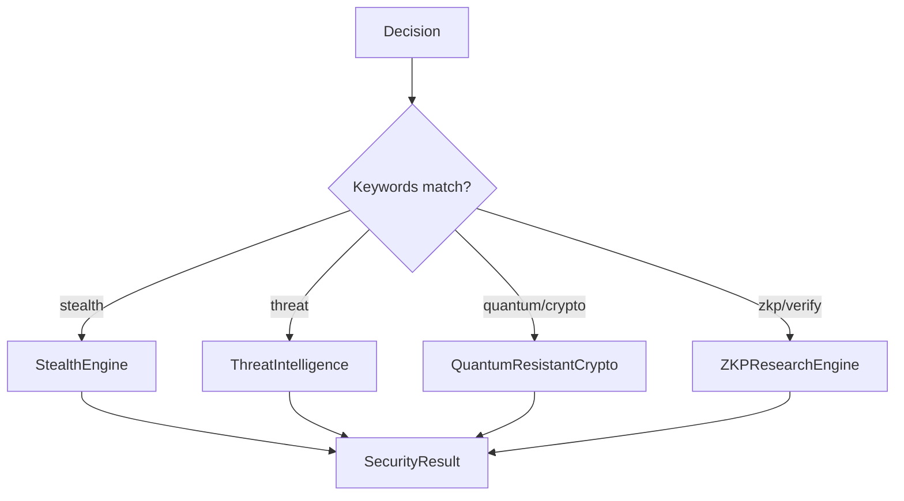

**Diagram sources**
- [coordinators/security_coordinator.py:295-492](file://hledac/universal/coordinators/security_coordinator.py#L295-L492)

**Section sources**
- [coordinators/security_coordinator.py:73-800](file://hledac/universal/coordinators/security_coordinator.py#L73-L800)

### UniversalMemoryCoordinator
- Dual-zone memory management integrating M1 Master Optimizer and Universal Infrastructure.
- Features: aggressive GC, MLX cache clearing, allocation tracking, memory pressure callbacks, thread safety, and neuromorphic memory with STDP learning.
- Supports thermal state monitoring and power-aware behavior.

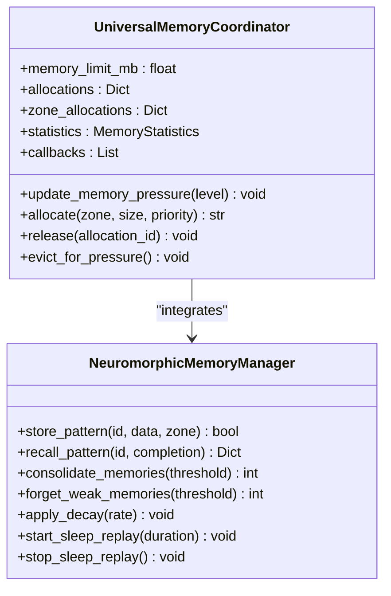

**Diagram sources**
- [coordinators/memory_coordinator.py:694-800](file://hledac/universal/coordinators/memory_coordinator.py#L694-L800)

**Section sources**
- [coordinators/memory_coordinator.py:694-800](file://hledac/universal/coordinators/memory_coordinator.py#L694-L800)

### AgentPerformanceOptimizer
- Optimizes agent execution with pooling, intelligent load balancing, and async execution limits.
- Includes agent metrics, circuit breaker logic, and periodic optimization routines.

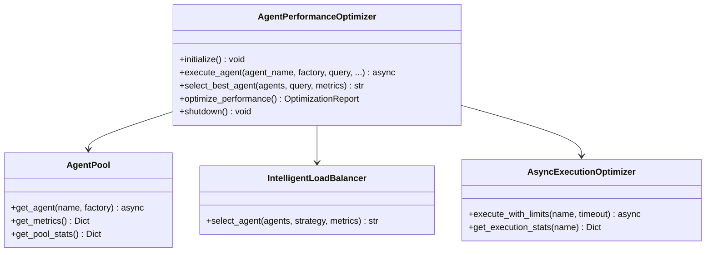

**Diagram sources**
- [coordinators/performance_coordinator.py:551-807](file://hledac/universal/coordinators/performance_coordinator.py#L551-L807)

**Section sources**
- [coordinators/performance_coordinator.py:551-807](file://hledac/universal/coordinators/performance_coordinator.py#L551-L807)

### UniversalSwarmCoordinator
- Manages swarm intelligence with state tracking (exploring, exploiting, converged, stagnant, diverse, coordinated), adaptive strategies, and P2P swarm features.
- Supports task queues, node reputation, consensus proposals, and fault tolerance.

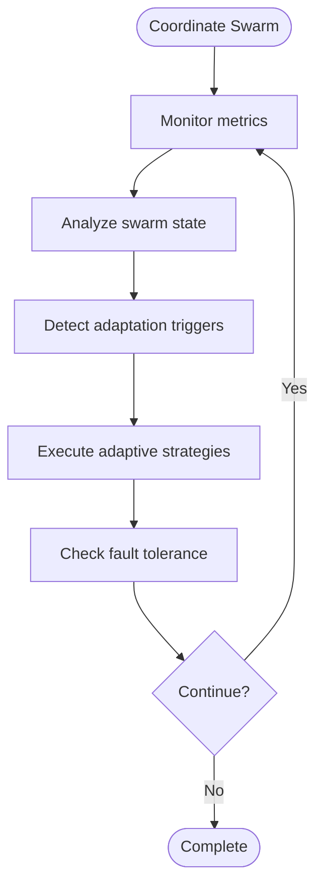

**Diagram sources**
- [coordinators/swarm_coordinator.py:332-382](file://hledac/universal/coordinators/swarm_coordinator.py#L332-L382)

**Section sources**
- [coordinators/swarm_coordinator.py:199-800](file://hledac/universal/coordinators/swarm_coordinator.py#L199-L800)

### AgentCoordinationEngine
- Multi-agent orchestration with capability-based routing, parallel execution, result aggregation, and performance tracking.
- Supports strategies for parallelism, deduplication, and fail-fast behavior.

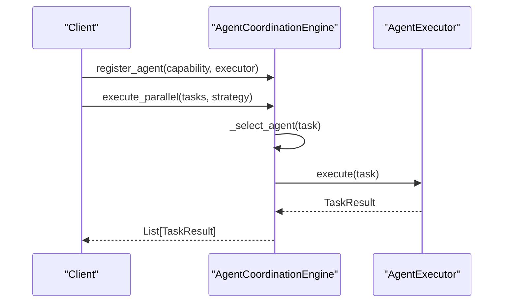

**Diagram sources**
- [coordinators/agent_coordination_engine.py:190-297](file://hledac/universal/coordinators/agent_coordination_engine.py#L190-L297)

**Section sources**
- [coordinators/agent_coordination_engine.py:116-482](file://hledac/universal/coordinators/agent_coordination_engine.py#L116-L482)

## Dependency Analysis
- Base coupling: All specialized coordinators inherit from UniversalCoordinator, ensuring consistent lifecycle, metrics, and memory awareness.
- Registry decoupling: Coordinators are registered and routed through CoordinatorRegistry, minimizing direct coupling between orchestrator and coordinator implementations.
- Feature integration: Coordinators selectively import domain-specific subsystems (e.g., research backends, security engines) with graceful degradation.
- Multi-agent and swarm: AgentCoordinationEngine and UniversalSwarmCoordinator operate independently but can be orchestrated via the registry.

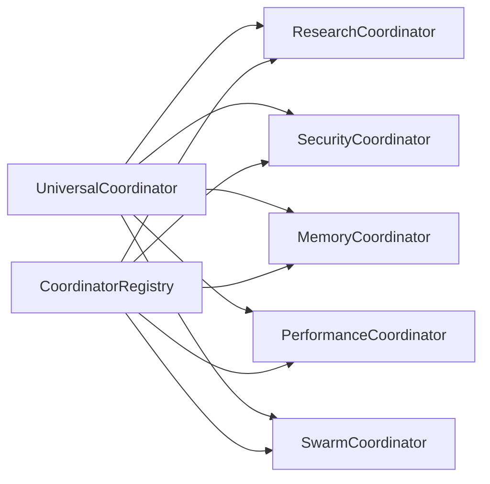

**Diagram sources**
- [coordinators/base.py:88-553](file://hledac/universal/coordinators/base.py#L88-L553)
- [coordinators/coordinator_registry.py:49-602](file://hledac/universal/coordinators/coordinator_registry.py#L49-L602)
- [coordinators/research_coordinator.py:172-800](file://hledac/universal/coordinators/research_coordinator.py#L172-L800)
- [coordinators/security_coordinator.py:73-800](file://hledac/universal/coordinators/security_coordinator.py#L73-L800)
- [coordinators/memory_coordinator.py:694-800](file://hledac/universal/coordinators/memory_coordinator.py#L694-L800)
- [coordinators/performance_coordinator.py:551-807](file://hledac/universal/coordinators/performance_coordinator.py#L551-L807)
- [coordinators/swarm_coordinator.py:199-800](file://hledac/universal/coordinators/swarm_coordinator.py#L199-L800)

**Section sources**
- [coordinators/__init__.py:1-273](file://hledac/universal/coordinators/__init__.py#L1-L273)
- [coordinators/coordinator_registry.py:49-424](file://hledac/universal/coordinators/coordinator_registry.py#L49-L424)

## Performance Considerations
- Memory-aware scheduling: load factor incorporates memory pressure multipliers to prevent thrashing on constrained devices.
- Agent pooling and reuse: reduces initialization overhead and memory churn for 8GB systems.
- Async execution limits: semaphores and timeouts prevent overload and enable circuit breaker behavior.
- Periodic optimization: identifies bottlenecks (high memory, slow agents, open circuit breakers) and applies targeted fixes.
- Multi-source research synthesis: balances confidence and execution time across backends.

[No sources needed since this section provides general guidance]

## Troubleshooting Guide
Common operational issues and remedies:
- Initialization failures: Coordinators support graceful degradation; check initialization errors and availability flags.
- Routing failures: Verify coordinator registration, supported operations, and routing strategy.
- Memory pressure: Monitor memory pressure levels and adjust allocation strategies; consider neuromorphic memory consolidation and forgetting weak memories.
- Circuit breakers: Investigate repeated timeouts and reset after cooldown; review agent pool health.
- Security backends: Confirm subsystem availability and escalate security levels as needed.

**Section sources**
- [coordinators/base.py:180-227](file://hledac/universal/coordinators/base.py#L180-L227)
- [coordinators/coordinator_registry.py:370-424](file://hledac/universal/coordinators/coordinator_registry.py#L370-L424)
- [coordinators/performance_coordinator.py:516-535](file://hledac/universal/coordinators/performance_coordinator.py#L516-L535)
- [coordinators/security_coordinator.py:133-194](file://hledac/universal/coordinators/security_coordinator.py#L133-L194)

## Conclusion
Hledac Universal’s coordination system provides a robust, extensible framework for orchestrating complex, multi-domain operations. Its base contract ensures consistent lifecycle and metrics, while the registry enables flexible routing and load balancing. Specialized coordinators encapsulate domain expertise, and advanced features like multi-agent orchestration, swarm intelligence, and performance optimization deliver scalability and resilience.

[No sources needed since this section summarizes without analyzing specific files]

## Appendices

### Configuration Options and Tuning Guidelines
- UniversalCoordinator
  - max_concurrent: Controls concurrency and load factor calculation.
  - memory_aware: Enables memory pressure multipliers in load factor.
- CoordinatorRegistry
  - priority and weight: Influence routing selection.
  - Strategy selection: priority, load, weighted, auto.
- UniversalMemoryCoordinator
  - memory_limit_mb: Enforces memory budgets.
  - enable_neuromorphic: Toggle neuromorphic memory features.
- AgentPerformanceOptimizer
  - LoadBalancingConfig: max_concurrent_agents, memory_threshold_mb, agent_timeout_seconds, circuit_breaker thresholds, agent_pool_size, load_balance_strategy.
- UniversalSwarmCoordinator
  - max_concurrent: Swarm agent capacity.
  - Adaptive strategies: tune triggers and parameters for responsiveness.
- UniversalResearchCoordinator
  - research_depth: STANDARD vs DEEP modes for advanced excavation.
  - ExcavationConfig: depth, breadth, relevance thresholds, and graph building toggles.

**Section sources**
- [coordinators/base.py:104-137](file://hledac/universal/coordinators/base.py#L104-L137)
- [coordinators/coordinator_registry.py:287-307](file://hledac/universal/coordinators/coordinator_registry.py#L287-L307)
- [coordinators/memory_coordinator.py:711-750](file://hledac/universal/coordinators/memory_coordinator.py#L711-L750)
- [coordinators/performance_coordinator.py:94-103](file://hledac/universal/coordinators/performance_coordinator.py#L94-L103)
- [coordinators/swarm_coordinator.py:208-247](file://hledac/universal/coordinators/swarm_coordinator.py#L208-L247)
- [coordinators/research_coordinator.py:188-94](file://hledac/universal/coordinators/research_coordinator.py#L188-L94)

### Monitoring and Observability
- CoordinatorRegistry health_check and statistics provide availability, load distribution, and success rates.
- UniversalCoordinator metrics include total operations, success/failure counts, and average execution time.
- UniversalSecurityCoordinator global state and audit logs capture stealth activation, threat levels, and operation counts.
- UniversalMemoryCoordinator statistics track memory usage, pressure levels, and cleanup activity.
- AgentPerformanceOptimizer metrics include agent pool stats, active tasks, and execution timings.

**Section sources**
- [coordinators/coordinator_registry.py:370-424](file://hledac/universal/coordinators/coordinator_registry.py#L370-L424)
- [coordinators/base.py:426-451](file://hledac/universal/coordinators/base.py#L426-L451)
- [coordinators/security_coordinator.py:661-680](file://hledac/universal/coordinators/security_coordinator.py#L661-L680)
- [coordinators/memory_coordinator.py:729-738](file://hledac/universal/coordinators/memory_coordinator.py#L729-L738)
- [coordinators/performance_coordinator.py:794-807](file://hledac/universal/coordinators/performance_coordinator.py#L794-L807)

### Custom Coordinator Development and Integration Patterns
- Extend UniversalCoordinator to define supported operations, implement handle_request, and optionally override lifecycle hooks.
- Register coordinators via CoordinatorRegistry.register with priority and weight for routing control.
- Integrate domain-specific subsystems with graceful degradation and availability checks.
- Implement stable spine interface (start/step/shutdown) for orchestrator integration.

**Section sources**
- [coordinators/base.py:148-174](file://hledac/universal/coordinators/base.py#L148-L174)
- [coordinators/coordinator_registry.py:79-131](file://hledac/universal/coordinators/coordinator_registry.py#L79-L131)

### Coordination Strategy Implementation Examples
- Multi-source research synthesis: Use UniversalResearchCoordinator.execute_multi_source_research to combine results from all available backends.
- Security escalation: Use UniversalSecurityCoordinator.execute_comprehensive_security to activate layered protections up to target level.
- Swarm coordination: Use UniversalSwarmCoordinator.coordinate_swarm to run adaptive strategies over time windows.
- Agent orchestration: Use AgentCoordinationEngine.execute_parallel to distribute tasks across specialized agents with parallelism and deduplication.

**Section sources**
- [coordinators/research_coordinator.py:551-619](file://hledac/universal/coordinators/research_coordinator.py#L551-L619)
- [coordinators/security_coordinator.py:497-615](file://hledac/universal/coordinators/security_coordinator.py#L497-L615)
- [coordinators/swarm_coordinator.py:332-382](file://hledac/universal/coordinators/swarm_coordinator.py#L332-L382)
- [coordinators/agent_coordination_engine.py:246-297](file://hledac/universal/coordinators/agent_coordination_engine.py#L246-L297)

### Scalability, Load Balancing, and Distributed Coordination
- Horizontal scaling: Register multiple instances of the same coordinator type with different weights to distribute load.
- Priority routing: Higher-priority operations bypass stricter load thresholds.
- Memory-aware load balancing: Coordinators adapt to memory pressure to prevent OOM conditions.
- Distributed swarm: P2P node registration, task queues, and consensus voting enable decentralized coordination.

**Section sources**
- [coordinators/coordinator_registry.py:232-307](file://hledac/universal/coordinators/coordinator_registry.py#L232-L307)
- [coordinators/base.py:308-377](file://hledac/universal/coordinators/base.py#L308-L377)
- [coordinators/swarm_coordinator.py:605-799](file://hledac/universal/coordinators/swarm_coordinator.py#L605-L799)