# Coordinator Base Class

<cite>
**Referenced Files in This Document**
- [base.py](file://coordinators/base.py)
- [coordinator_registry.py](file://coordinators/coordinator_registry.py)
- [research_coordinator.py](file://coordinators/research_coordinator.py)
- [execution_coordinator.py](file://coordinators/execution_coordinator.py)
- [memory_coordinator.py](file://coordinators/memory_coordinator.py)
- [M1_8GB_MEMORY_BUDGET.md](file://M1_8GB_MEMORY_BUDGET.md)
- [__init__.py](file://coordinators/__init__.py)
</cite>

## Table of Contents
1. [Introduction](#introduction)
2. [Project Structure](#project-structure)
3. [Core Components](#core-components)
4. [Architecture Overview](#architecture-overview)
5. [Detailed Component Analysis](#detailed-component-analysis)
6. [Dependency Analysis](#dependency-analysis)
7. [Performance Considerations](#performance-considerations)
8. [Troubleshooting Guide](#troubleshooting-guide)
9. [Conclusion](#conclusion)
10. [Appendices](#appendices)

## Introduction
This document describes the Universal Coordinator Base Class that consolidates best practices from DeepSeek R1 ModuleCoordinator and Hermes3 BaseCoordinator, augmented with M1 8GB memory-aware scheduling. It covers the operation lifecycle management system (track/untrack/generate_id), load factor calculation with memory pressure adjustments, graceful degradation patterns, async cleanup with resource management, capabilities discovery/reporting, and the stable coordinator interface enabling the orchestrator spine pattern. Practical examples illustrate initialization, operation tracking, load balancing, and performance monitoring. Finally, it outlines abstract method requirements for subclasses and provides implementation guidelines for custom coordinator development.

## Project Structure
The Universal Coordinator Base resides in the coordinators package and is extended by specialized coordinators that integrate domain-specific logic while inheriting the foundational lifecycle, metrics, and memory-aware scheduling.

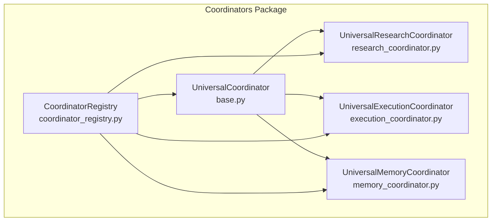

**Diagram sources**
- [base.py:88-553](file://coordinators/base.py#L88-L553)
- [coordinator_registry.py:49-602](file://coordinators/coordinator_registry.py#L49-L602)
- [research_coordinator.py:172-800](file://coordinators/research_coordinator.py#L172-L800)
- [execution_coordinator.py:88-800](file://coordinators/execution_coordinator.py#L88-L800)
- [memory_coordinator.py:694-800](file://coordinators/memory_coordinator.py#L694-L800)

**Section sources**
- [base.py:1-553](file://coordinators/base.py#L1-L553)
- [coordinator_registry.py:1-602](file://coordinators/coordinator_registry.py#L1-L602)
- [__init__.py:1-273](file://coordinators/__init__.py#L1-L273)

## Core Components
- UniversalCoordinator: Abstract base class providing lifecycle, operation tracking, load management, memory pressure handling, metrics, capabilities reporting, and the stable spine interface.
- CoordinatorRegistry: Central registry for discovering, registering, routing, and load-balancing coordinators.
- Specialized Coordinators: Research, Execution, Security, Monitoring, Memory, and advanced variants that inherit from UniversalCoordinator and implement domain-specific logic.

Key responsibilities:
- Lifecycle: initialize, start, step, shutdown, cleanup.
- Operation tracking: generate_id, track/untrack, status queries.
- Load management: load factor computation, capacity checks, priority-aware acceptance.
- Memory awareness: pressure levels, thresholds, and multipliers affecting load calculations.
- Metrics and reporting: operation results, success rates, timing, and capabilities.
- Stable spine interface: start/step/shutdown for orchestrator delegation.

**Section sources**
- [base.py:88-553](file://coordinators/base.py#L88-L553)
- [coordinator_registry.py:49-602](file://coordinators/coordinator_registry.py#L49-L602)

## Architecture Overview
The Universal Coordinator Base integrates three pillars:
- DeepSeek R1: Operation lifecycle, load factor, and graceful degradation.
- Hermes3: Simplified initialization and capabilities reporting.
- M1 Master Optimizer: Memory pressure levels and threshold-based load adjustments.

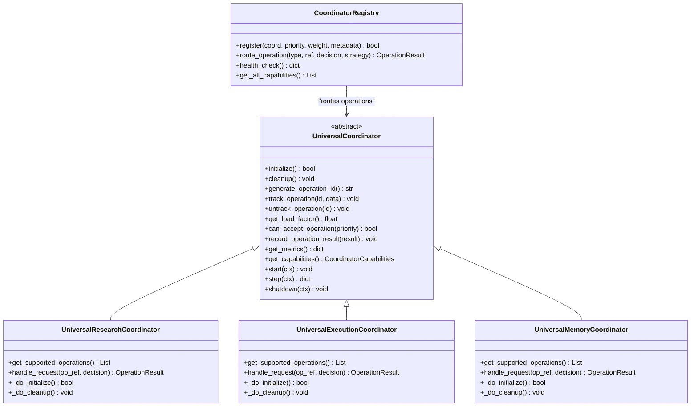

**Diagram sources**
- [base.py:88-553](file://coordinators/base.py#L88-L553)
- [research_coordinator.py:172-800](file://coordinators/research_coordinator.py#L172-L800)
- [execution_coordinator.py:88-800](file://coordinators/execution_coordinator.py#L88-L800)
- [memory_coordinator.py:694-800](file://coordinators/memory_coordinator.py#L694-L800)
- [coordinator_registry.py:49-602](file://coordinators/coordinator_registry.py#L49-L602)

## Detailed Component Analysis

### UniversalCoordinator Base Class
The base class defines:
- Lifecycle: initialize, cleanup, and the stable spine interface (start, step, shutdown).
- Operation lifecycle: generate_operation_id, track/untrack, status queries.
- Load and capacity: load factor computation, capacity info, and priority-aware acceptance.
- Memory awareness: memory pressure levels, thresholds, and multipliers.
- Metrics and reporting: operation result recording, aggregated metrics, and capabilities.
- Abstract methods: subclasses must implement supported operations, request handling, and initialization.

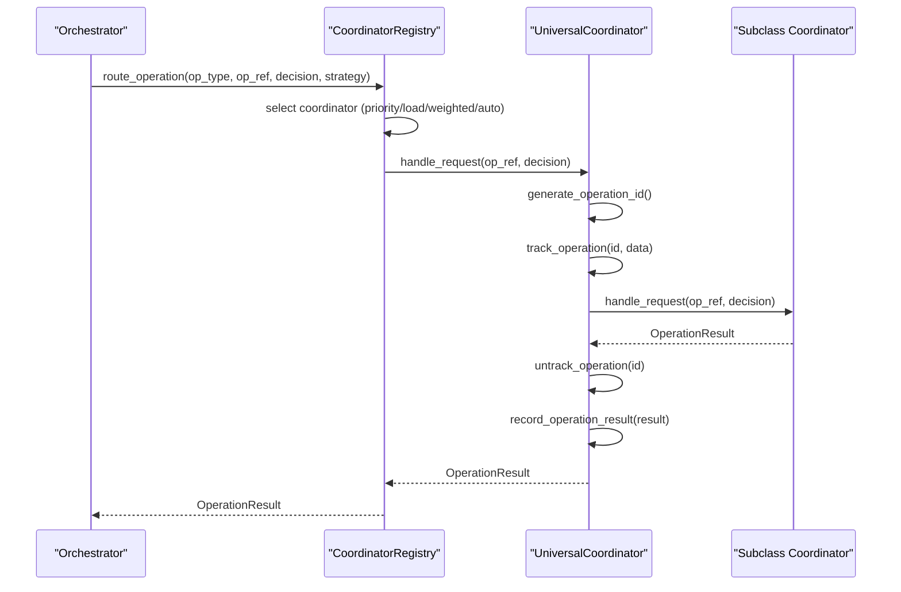

**Diagram sources**
- [coordinator_registry.py:172-231](file://coordinators/coordinator_registry.py#L172-L231)
- [base.py:180-227](file://coordinators/base.py#L180-L227)
- [base.py:233-302](file://coordinators/base.py#L233-L302)
- [base.py:416-441](file://coordinators/base.py#L416-L441)

**Section sources**
- [base.py:88-553](file://coordinators/base.py#L88-L553)

### Operation Lifecycle Management
- generate_operation_id: Creates unique IDs with coordinator prefix, timestamp, and counter.
- track_operation: Adds active operation with metadata and timestamps.
- untrack_operation: Moves operation to history, trims history beyond configured limit.
- get_active_operations/get_operation_status: Inspect active and historical operations.

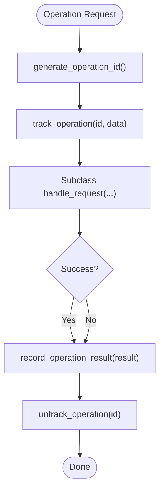

**Diagram sources**
- [base.py:233-302](file://coordinators/base.py#L233-L302)
- [base.py:416-425](file://coordinators/base.py#L416-L425)

**Section sources**
- [base.py:233-302](file://coordinators/base.py#L233-L302)
- [base.py:416-425](file://coordinators/base.py#L416-L425)

### Load Factor Calculation and Capacity Management
- Base load factor considers active operations vs max concurrent.
- Memory pressure multipliers adjust load factor when memory_aware is enabled.
- can_accept_operation enforces priority thresholds to prevent overload.
- get_capacity_info exposes detailed capacity and acceptance indicators.

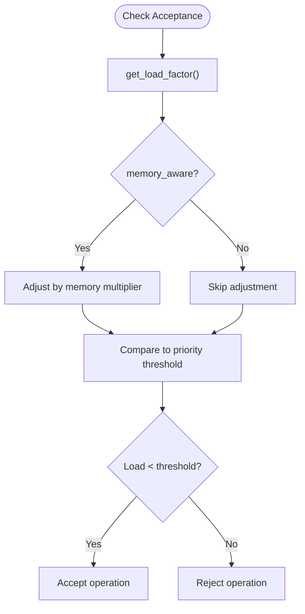

**Diagram sources**
- [base.py:308-366](file://coordinators/base.py#L308-L366)

**Section sources**
- [base.py:308-366](file://coordinators/base.py#L308-L366)

### Memory-Aware Operation Scheduling (M1 8GB Optimization)
- MemoryPressureLevel enum defines NORMAL/ELEVATED/HIGH/CRITICAL.
- Thresholds define pressure boundaries; multipliers increase load factor accordingly.
- update_memory_pressure and check_memory_pressure integrate with external monitoring.
- M1_8GB_MEMORY_BUDGET.md documents memory components, waterfalls, and bounds for safe operation.

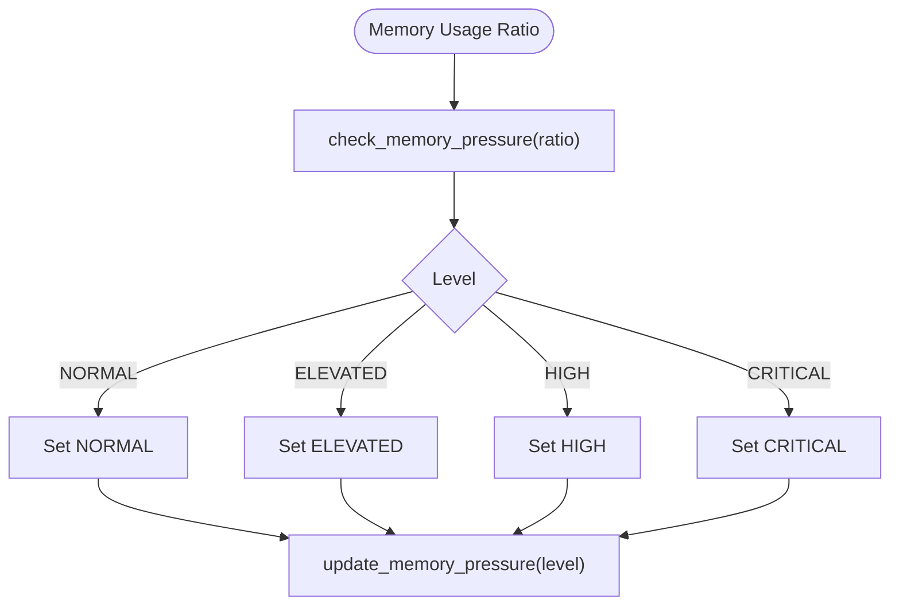

**Diagram sources**
- [base.py:383-411](file://coordinators/base.py#L383-L411)
- [M1_8GB_MEMORY_BUDGET.md:1-136](file://M1_8GB_MEMORY_BUDGET.md#L1-L136)

**Section sources**
- [base.py:80-132](file://coordinators/base.py#L80-L132)
- [base.py:383-411](file://coordinators/base.py#L383-L411)
- [M1_8GB_MEMORY_BUDGET.md:1-136](file://M1_8GB_MEMORY_BUDGET.md#L1-L136)

### Async Cleanup and Resource Management
- initialize supports graceful degradation: partial initialization allowed.
- cleanup ensures resources are released even if initialization failed.
- Subclasses override _do_cleanup for specific teardown logic.

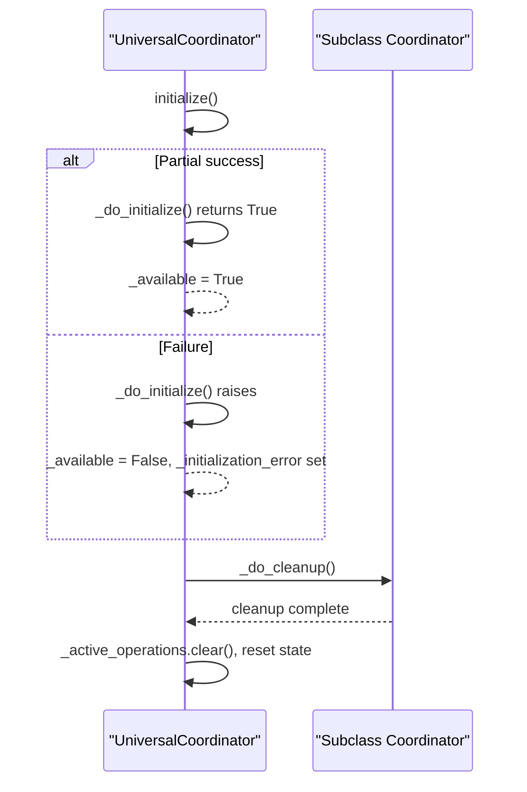

**Diagram sources**
- [base.py:180-227](file://coordinators/base.py#L180-L227)

**Section sources**
- [base.py:180-227](file://coordinators/base.py#L180-L227)

### Capabilities Discovery and Reporting
- get_capabilities returns CoordinatorCapabilities with supported operations, features, availability, load factor, and capacity metrics.
- Subclasses override _get_feature_list to advertise specific capabilities.

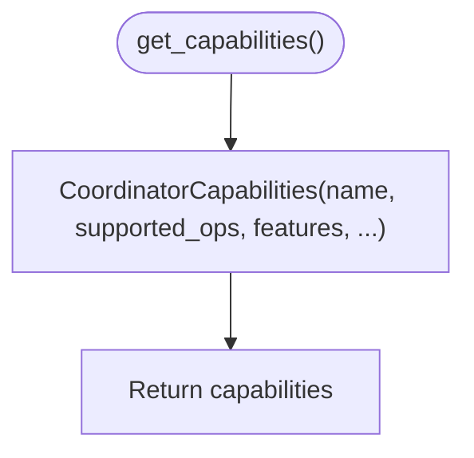

**Diagram sources**
- [base.py:441-451](file://coordinators/base.py#L441-L451)
- [base.py:453-456](file://coordinators/base.py#L453-L456)

**Section sources**
- [base.py:441-456](file://coordinators/base.py#L441-L456)

### Stable Coordinator Interface (Orchestrator Spine Pattern)
- start(ctx): Initializes and delegates to subclass via _do_start.
- step(ctx): Executes one iteration and returns bounded metrics/results.
- shutdown(ctx): Delegates to subclass via _do_shutdown, then calls cleanup.

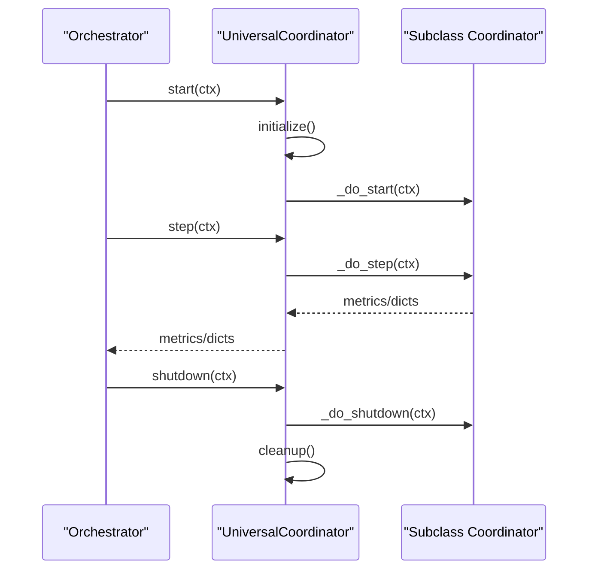

**Diagram sources**
- [base.py:491-552](file://coordinators/base.py#L491-L552)

**Section sources**
- [base.py:483-552](file://coordinators/base.py#L483-L552)

### Practical Examples

#### Example 1: Coordinator Initialization and Registration
- Instantiate a subclass (e.g., UniversalResearchCoordinator).
- Register with CoordinatorRegistry specifying priority and weight.
- Use health_check to monitor availability and load.

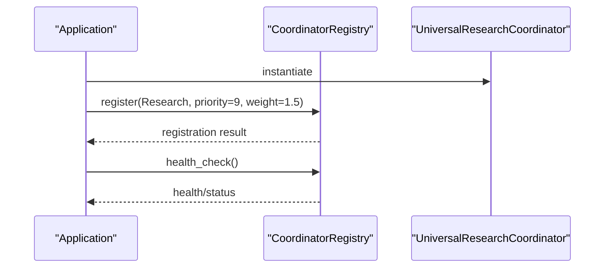

**Diagram sources**
- [coordinator_registry.py:79-131](file://coordinators/coordinator_registry.py#L79-L131)
- [coordinator_registry.py:370-400](file://coordinators/coordinator_registry.py#L370-L400)

**Section sources**
- [coordinator_registry.py:79-131](file://coordinators/coordinator_registry.py#L79-L131)
- [coordinator_registry.py:370-400](file://coordinators/coordinator_registry.py#L370-L400)

#### Example 2: Operation Tracking and Load Balancing
- Use route_operation with strategies: priority, load, weighted, or auto.
- can_accept_operation helps pre-check acceptance based on priority and load.

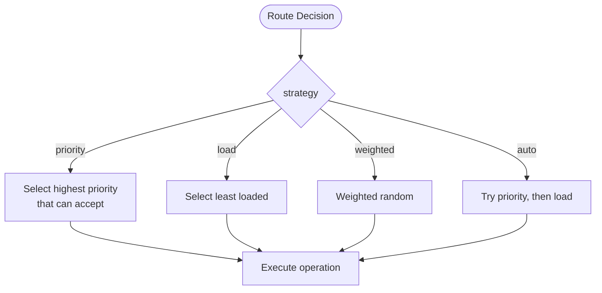

**Diagram sources**
- [coordinator_registry.py:172-307](file://coordinators/coordinator_registry.py#L172-L307)

**Section sources**
- [coordinator_registry.py:172-307](file://coordinators/coordinator_registry.py#L172-L307)

#### Example 3: Performance Monitoring
- get_metrics provides totals, successes, failures, success rate, average execution time, and active/history sizes.
- get_load_distribution and get_statistics help operators monitor registry health.

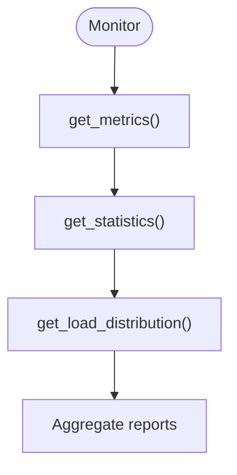

**Diagram sources**
- [base.py:426-439](file://coordinators/base.py#L426-L439)
- [coordinator_registry.py:401-424](file://coordinators/coordinator_registry.py#L401-L424)

**Section sources**
- [base.py:426-439](file://coordinators/base.py#L426-L439)
- [coordinator_registry.py:401-424](file://coordinators/coordinator_registry.py#L401-L424)

### Abstract Method Requirements and Implementation Guidelines
Subclasses must implement:
- get_supported_operations: Return supported OperationType values.
- handle_request: Execute the decision and return OperationResult.
- _do_initialize: Perform actual initialization and return availability status.

Guidelines:
- Use track_operation/untrack_operation around execution to capture lifecycle data.
- Record results via record_operation_result for metrics.
- Implement _do_cleanup to release resources safely.
- Override _get_feature_list to advertise capabilities.
- Respect can_accept_operation and get_load_factor to avoid overload.
- Integrate memory pressure updates via update_memory_pressure or check_memory_pressure.

**Section sources**
- [base.py:143-174](file://coordinators/base.py#L143-L174)
- [base.py:239-273](file://coordinators/base.py#L239-L273)
- [base.py:416-456](file://coordinators/base.py#L416-L456)

## Dependency Analysis
The UniversalCoordinator depends on:
- Dataclasses for structured types (DecisionResponse, OperationResult, CoordinatorCapabilities).
- Enumerations for operation types and memory pressure levels.
- Logging for diagnostics.
- Asynchronous primitives for lifecycle and step operations.

Specialized coordinators depend on:
- Domain-specific engines and subsystems (e.g., research backends, execution engines, security modules).
- CoordinatorRegistry for discovery and routing.

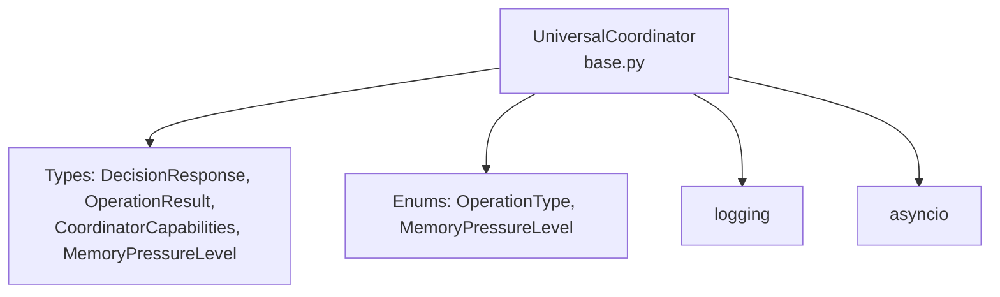

**Diagram sources**
- [base.py:23-31](file://coordinators/base.py#L23-L31)
- [base.py:33-86](file://coordinators/base.py#L33-L86)

**Section sources**
- [base.py:19-31](file://coordinators/base.py#L19-L31)

## Performance Considerations
- Use can_accept_operation to preemptively avoid overload based on priority and load.
- Monitor get_load_distribution and get_statistics to detect hotspots.
- Integrate memory pressure thresholds to reduce concurrency under stress.
- Prefer bounded history sizes and trim operations to control memory footprint.
- Leverage async patterns to avoid blocking event loops during cleanup and step operations.

[No sources needed since this section provides general guidance]

## Troubleshooting Guide
Common issues and remedies:
- Initialization failures: Check get_initialization_error and review logs; graceful degradation allows partial availability.
- Overload symptoms: Reduce max_concurrent or adjust memory_aware multipliers; use can_accept_operation to gate requests.
- Memory pressure spikes: Update memory pressure via update_memory_pressure or rely on check_memory_pressure; consider aggressive cleanup strategies.
- Registry routing failures: Verify supported operations and availability; use health_check to confirm status.

**Section sources**
- [base.py:465-476](file://coordinators/base.py#L465-L476)
- [coordinator_registry.py:370-400](file://coordinators/coordinator_registry.py#L370-L400)

## Conclusion
The Universal Coordinator Base Class provides a robust foundation for orchestrating diverse operations with integrated lifecycle management, memory-aware scheduling, graceful degradation, and a stable spine interface. Specialized coordinators extend this base to deliver domain-specific capabilities while maintaining consistent patterns for discovery, routing, and monitoring.

[No sources needed since this section summarizes without analyzing specific files]

## Appendices

### Appendix A: Example Subclass Implementations
- UniversalResearchCoordinator demonstrates multi-source routing, fallback chains, and synthesis.
- UniversalExecutionCoordinator demonstrates mission-based execution, parallel processing, and batch execution.
- UniversalMemoryCoordinator demonstrates dual-zone memory management, neuromorphic memory, and thermal state monitoring.

**Section sources**
- [research_coordinator.py:172-800](file://coordinators/research_coordinator.py#L172-L800)
- [execution_coordinator.py:88-800](file://coordinators/execution_coordinator.py#L88-L800)
- [memory_coordinator.py:694-800](file://coordinators/memory_coordinator.py#L694-L800)