# Coordinator Registry

<cite>
**Referenced Files in This Document**
- [coordinator_registry.py](file://coordinators/coordinator_registry.py)
- [base.py](file://coordinators/base.py)
- [__init__.py](file://coordinators/__init__.py)
- [research_coordinator.py](file://coordinators/research_coordinator.py)
- [execution_coordinator.py](file://coordinators/execution_coordinator.py)
- [monitoring_coordinator.py](file://coordinators/monitoring_coordinator.py)
- [security_coordinator.py](file://coordinators/security_coordinator.py)
- [memory_coordinator.py](file://coordinators/memory_coordinator.py)
- [advanced_research_coordinator.py](file://coordinators/advanced_research_coordinator.py)
</cite>

## Table of Contents
1. [Introduction](#introduction)
2. [Project Structure](#project-structure)
3. [Core Components](#core-components)
4. [Architecture Overview](#architecture-overview)
5. [Detailed Component Analysis](#detailed-component-analysis)
6. [Dependency Analysis](#dependency-analysis)
7. [Performance Considerations](#performance-considerations)
8. [Troubleshooting Guide](#troubleshooting-guide)
9. [Conclusion](#conclusion)
10. [Appendices](#appendices)

## Introduction
The Coordinator Registry is the central nervous system for managing Universal Coordinators in the Hledac Universal Orchestrator. It provides:
- Registration and discovery of coordinators
- Dynamic loading and graceful degradation
- Operation routing with multiple strategies
- Health monitoring and statistics
- Capability reporting and default coordinator assignment
- Lifecycle management and cleanup

The registry consolidates patterns from DeepSeek R1, Hermes3, and M1 Master to deliver robust, memory-aware, and scalable coordinator management.

## Project Structure
The coordinator ecosystem is organized around a central registry and specialized coordinator implementations:

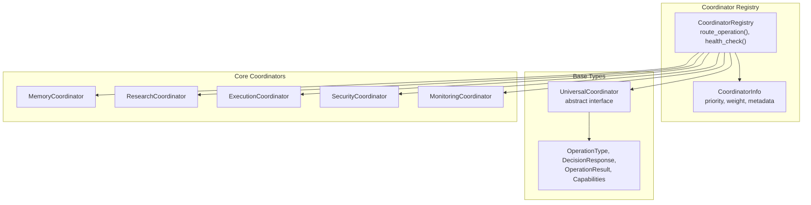

**Diagram sources**
- [coordinator_registry.py:49-602](file://coordinators/coordinator_registry.py#L49-L602)
- [base.py:88-553](file://coordinators/base.py#L88-L553)

**Section sources**
- [coordinator_registry.py:1-602](file://coordinators/coordinator_registry.py#L1-L602)
- [base.py:1-553](file://coordinators/base.py#L1-L553)
- [__init__.py:1-273](file://coordinators/__init__.py#L1-L273)

## Core Components
The Coordinator Registry centers around several key components:

- CoordinatorRegistry: Central registry managing registration, routing, health, and statistics
- UniversalCoordinator: Abstract base class defining the coordinator contract
- CoordinatorInfo: Metadata container for registered coordinators
- Operation routing strategies: Priority, load-based, weighted, and auto-selection
- Health monitoring and statistics aggregation
- Default coordinator assignment per operation type

Key capabilities:
- Asynchronous registration with priority and weight
- Capability-based discovery and indexing
- Memory-aware load calculation and acceptance policies
- Graceful degradation during initialization failures
- Comprehensive metrics and operational statistics

**Section sources**
- [coordinator_registry.py:49-602](file://coordinators/coordinator_registry.py#L49-L602)
- [base.py:88-553](file://coordinators/base.py#L88-L553)

## Architecture Overview
The registry implements a centralized discovery and routing pattern with memory-aware load balancing:

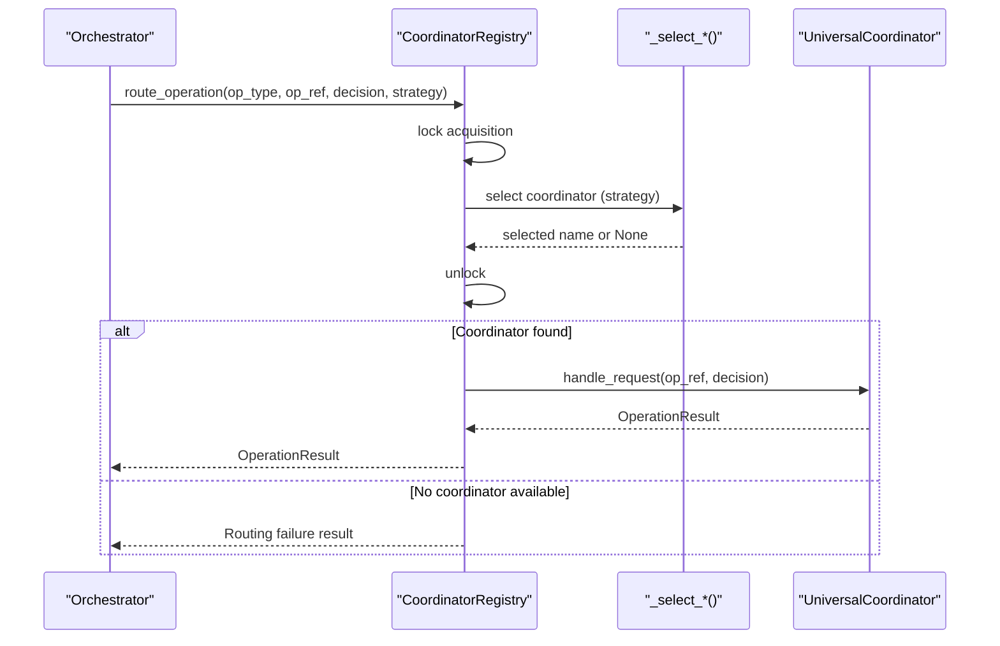

**Diagram sources**
- [coordinator_registry.py:172-230](file://coordinators/coordinator_registry.py#L172-L230)
- [coordinator_registry.py:232-306](file://coordinators/coordinator_registry.py#L232-L306)

The architecture integrates three major patterns:
- DeepSeek R1: Operation tracking, load factor calculation, lifecycle management
- Hermes3: Simplified initialization with graceful degradation
- M1 Master: Memory pressure awareness and optimization

**Section sources**
- [base.py:10-17](file://coordinators/base.py#L10-L17)
- [coordinator_registry.py:13-17](file://coordinators/coordinator_registry.py#L13-L17)

## Detailed Component Analysis

### CoordinatorRegistry
The CoordinatorRegistry provides comprehensive management of Universal Coordinators:

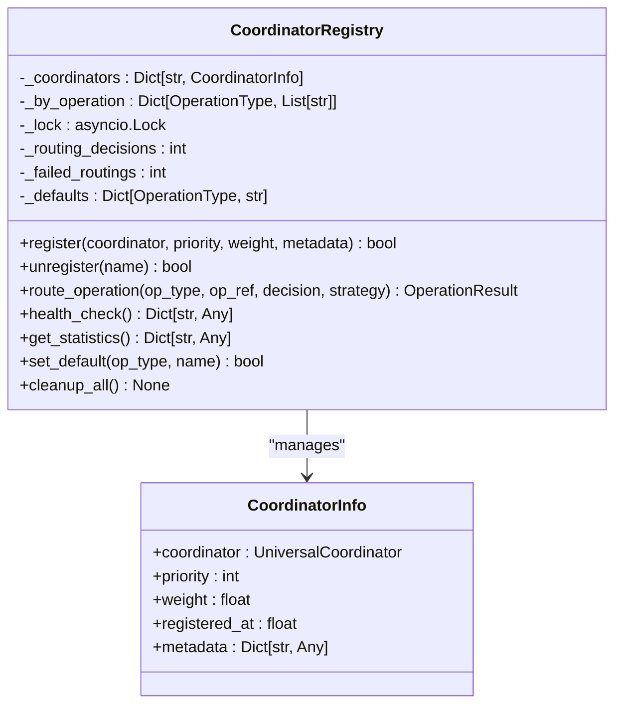

**Diagram sources**
- [coordinator_registry.py:49-602](file://coordinators/coordinator_registry.py#L49-L602)

Routing strategies implemented:
- Priority-based selection for high-priority operations
- Load-based selection for least-loaded coordinator
- Weighted random selection for balanced distribution
- Auto-selection combining priority-first then load-based fallback

Health monitoring includes:
- Availability status checks
- Load factor reporting
- Active operation counts
- Supported operation types per coordinator

**Section sources**
- [coordinator_registry.py:79-166](file://coordinators/coordinator_registry.py#L79-L166)
- [coordinator_registry.py:172-306](file://coordinators/coordinator_registry.py#L172-L306)
- [coordinator_registry.py:370-416](file://coordinators/coordinator_registry.py#L370-L416)

### UniversalCoordinator Base
The UniversalCoordinator defines the contract and integrates multiple optimization patterns:

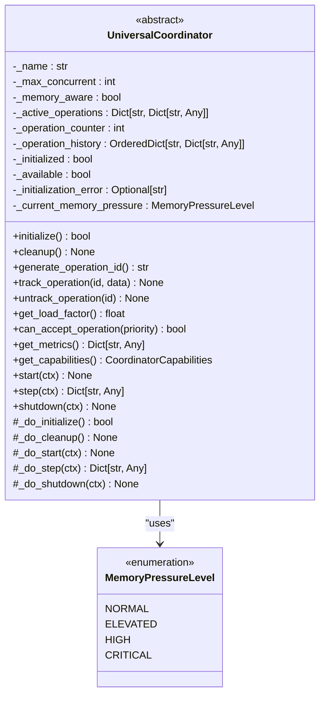

**Diagram sources**
- [base.py:88-553](file://coordinators/base.py#L88-L553)

Key features integrated:
- Operation lifecycle management with tracking and history
- Memory-aware load calculation with pressure-based multipliers
- Graceful degradation during initialization failures
- Async cleanup with resource management
- Comprehensive metrics and capability reporting

**Section sources**
- [base.py:88-553](file://coordinators/base.py#L88-L553)

### Coordinator Discovery and Registration Patterns
The registry supports dynamic coordinator registration with priority and weight:

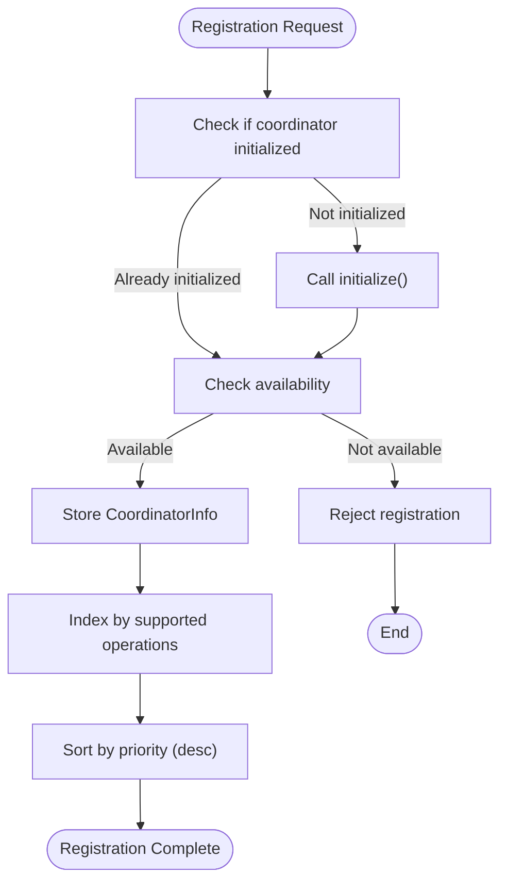

**Diagram sources**
- [coordinator_registry.py:79-130](file://coordinators/coordinator_registry.py#L79-L130)

Registration supports:
- Priority-based ordering for operation routing
- Weighted distribution for load balancing
- Metadata attachment for categorization
- Automatic capability indexing

**Section sources**
- [coordinator_registry.py:79-130](file://coordinators/coordinator_registry.py#L79-L130)

### Dynamic Coordinator Loading
Coordinators implement lazy initialization with graceful degradation:

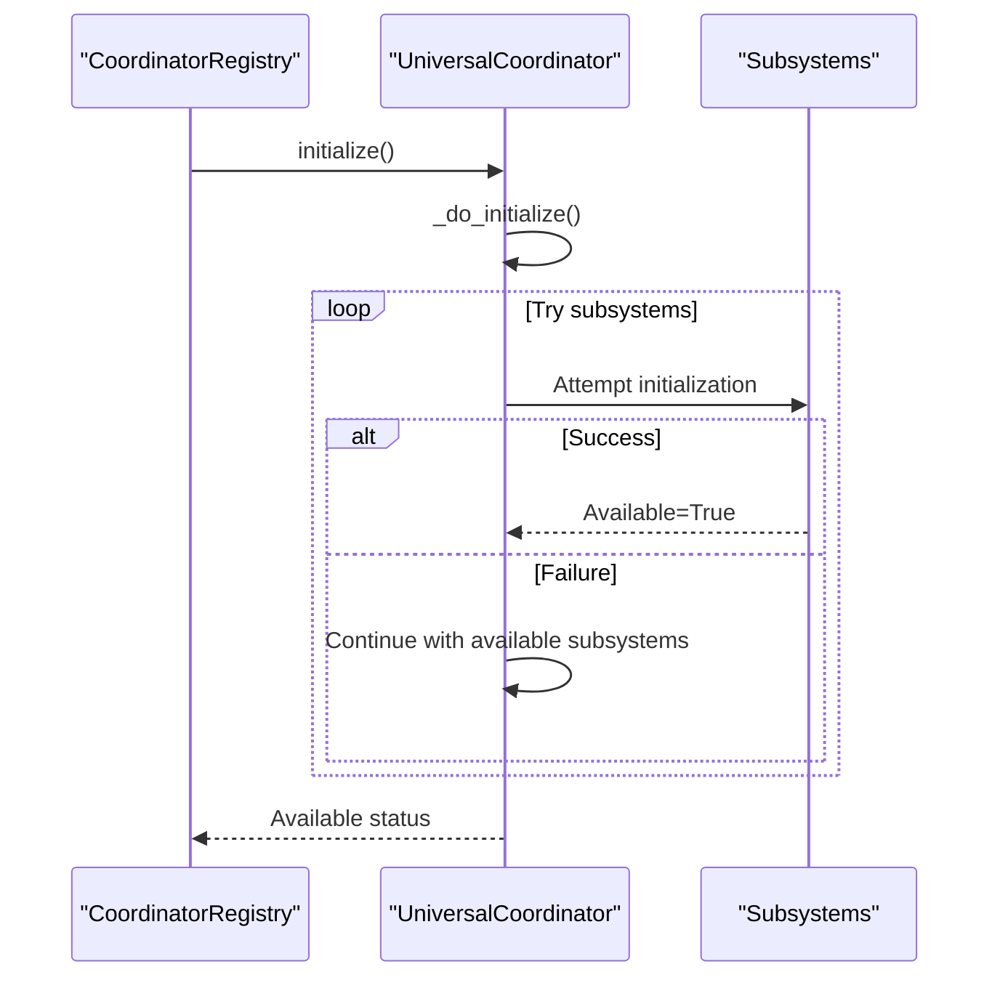

**Diagram sources**
- [base.py:180-208](file://coordinators/base.py#L180-L208)
- [execution_coordinator.py:148-192](file://coordinators/execution_coordinator.py#L148-L192)
- [monitoring_coordinator.py:174-200](file://coordinators/monitoring_coordinator.py#L174-L200)
- [security_coordinator.py:133-193](file://coordinators/security_coordinator.py#L133-L193)

Dynamic loading patterns include:
- Optional subsystems with fallback chains
- Partial initialization allowing degraded functionality
- Memory-aware subsystem selection
- Async initialization support

**Section sources**
- [base.py:180-208](file://coordinators/base.py#L180-L208)
- [execution_coordinator.py:148-192](file://coordinators/execution_coordinator.py#L148-L192)
- [monitoring_coordinator.py:174-200](file://coordinators/monitoring_coordinator.py#L174-L200)
- [security_coordinator.py:133-193](file://coordinators/security_coordinator.py#L133-L193)

### Coordinator Dependency Management
The registry maintains coordinator dependencies through capability-based indexing:

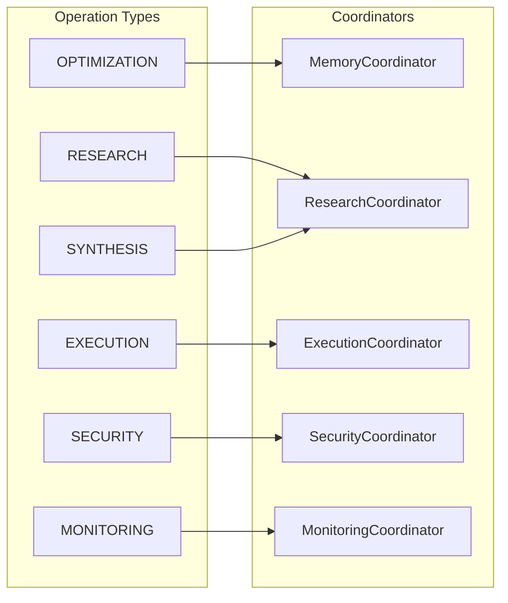

**Diagram sources**
- [base.py:33-41](file://coordinators/base.py#L33-L41)
- [coordinator_registry.py:63-66](file://coordinators/coordinator_registry.py#L63-L66)

Dependency management features:
- Automatic capability indexing during registration
- Operation-to-coordinator mapping
- Support checking for operation types
- Capability reporting for external systems

**Section sources**
- [base.py:33-41](file://coordinators/base.py#L33-L41)
- [coordinator_registry.py:63-66](file://coordinators/coordinator_registry.py#L63-L66)

### Health Monitoring and Automatic Failover
The registry provides comprehensive health monitoring and automatic failover:

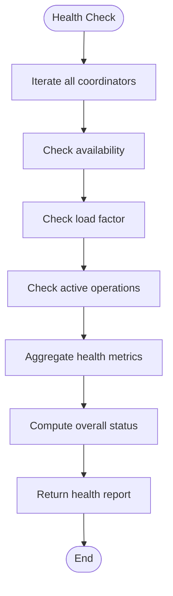

**Diagram sources**
- [coordinator_registry.py:370-399](file://coordinators/coordinator_registry.py#L370-L399)

Health monitoring includes:
- Per-coordinator availability and initialization status
- Load factor calculation with memory pressure consideration
- Active operation tracking
- Supported operation type reporting
- Overall system status computation

Automatic failover mechanisms:
- Priority-based selection prefers higher-priority coordinators
- Load-based selection chooses least-loaded coordinators
- Weighted selection distributes load proportionally
- Auto-selection combines priority-first then load-based fallback

**Section sources**
- [coordinator_registry.py:370-416](file://coordinators/coordinator_registry.py#L370-L416)
- [coordinator_registry.py:232-306](file://coordinators/coordinator_registry.py#L232-L306)

### Coordinator Communication Protocols
Coordinators communicate through standardized protocols:

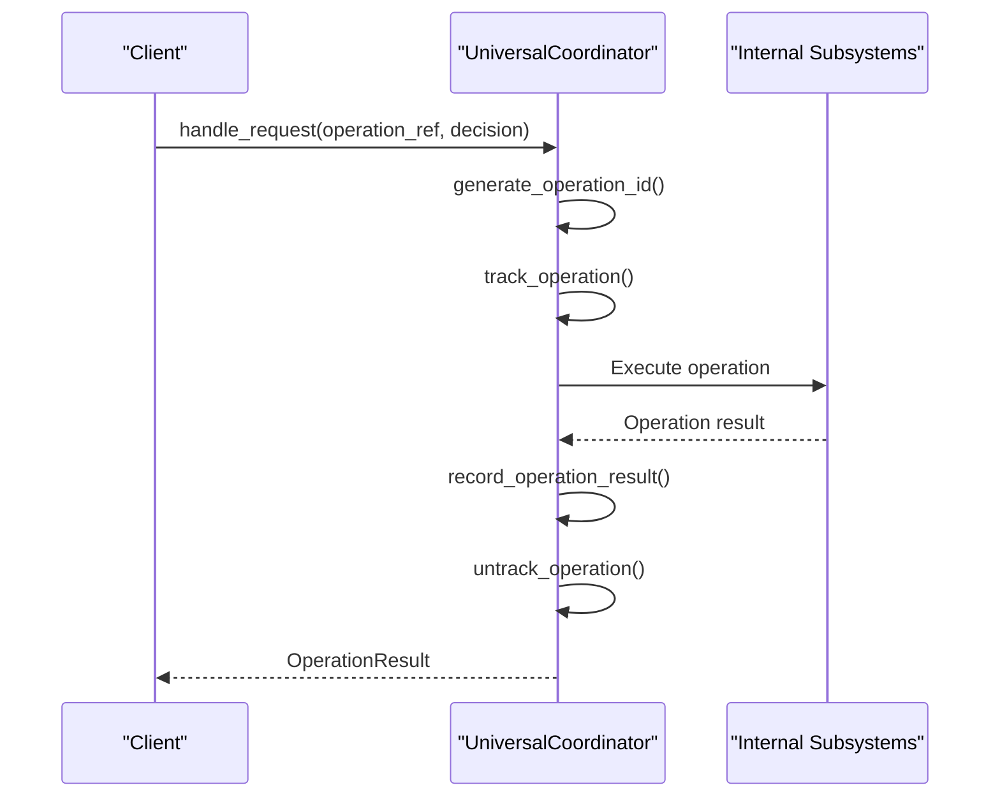

**Diagram sources**
- [base.py:149-164](file://coordinators/base.py#L149-L164)
- [base.py:233-276](file://coordinators/base.py#L233-L276)
- [base.py:416-424](file://coordinators/base.py#L416-L424)

Communication protocols include:
- Standardized operation request/response format
- Operation ID generation and tracking
- Result recording and metrics aggregation
- History management with size limits

**Section sources**
- [base.py:149-164](file://coordinators/base.py#L149-L164)
- [base.py:233-276](file://coordinators/base.py#L233-L276)
- [base.py:416-424](file://coordinators/base.py#L416-L424)

### Inter-coordinator Coordination Strategies
The registry supports various coordination strategies for optimal resource utilization:

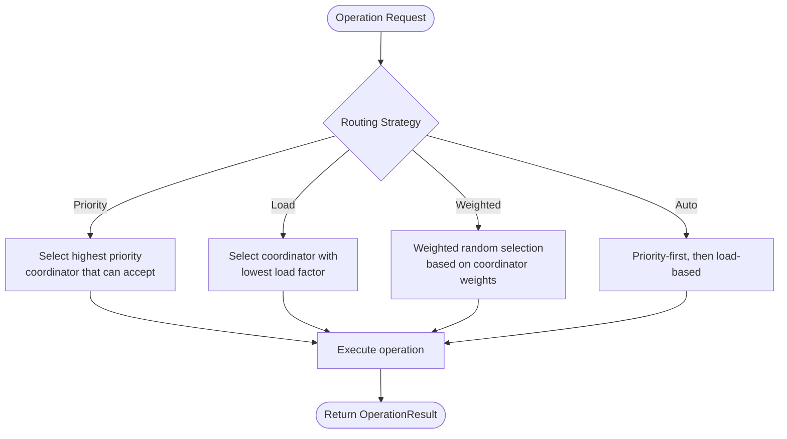

**Diagram sources**
- [coordinator_registry.py:207-215](file://coordinators/coordinator_registry.py#L207-L215)
- [coordinator_registry.py:232-306](file://coordinators/coordinator_registry.py#L232-L306)

Coordination strategies:
- Priority-based: Ensures critical operations get preferred handling
- Load-based: Distributes operations to least busy coordinators
- Weighted: Balances load proportionally to coordinator weights
- Auto: Combines priority and load-based selection for optimal results

**Section sources**
- [coordinator_registry.py:207-215](file://coordinators/coordinator_registry.py#L207-L215)
- [coordinator_registry.py:232-306](file://coordinators/coordinator_registry.py#L232-L306)

### Centralized Management Interfaces
The registry provides comprehensive management interfaces:

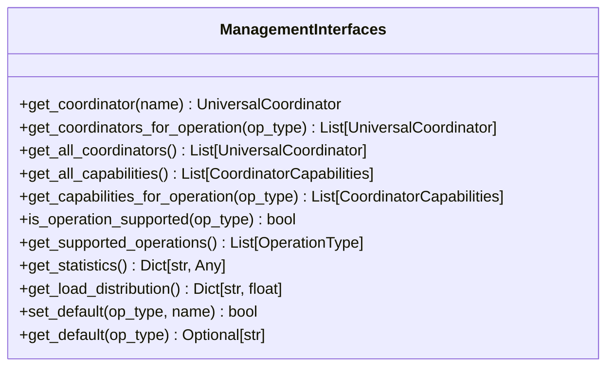

**Diagram sources**
- [coordinator_registry.py:312-364](file://coordinators/coordinator_registry.py#L312-L364)

Management interfaces include:
- Coordinator retrieval by name or operation type
- Capability discovery and reporting
- Support validation for operation types
- Statistics and metrics aggregation
- Load distribution analysis
- Default coordinator assignment

**Section sources**
- [coordinator_registry.py:312-364](file://coordinators/coordinator_registry.py#L312-L364)

## Dependency Analysis
The coordinator ecosystem exhibits clear dependency relationships:

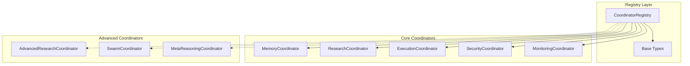

**Diagram sources**
- [coordinator_registry.py:494-601](file://coordinators/coordinator_registry.py#L494-L601)
- [__init__.py:22-147](file://coordinators/__init__.py#L22-L147)

Dependency characteristics:
- Loose coupling through abstract base interface
- Capability-based discovery decouples clients from specific implementations
- Memory-aware design enables optimization without changing registry logic
- Graceful degradation ensures system stability during partial failures

**Section sources**
- [coordinator_registry.py:494-601](file://coordinators/coordinator_registry.py#L494-L601)
- [__init__.py:22-147](file://coordinators/__init__.py#L22-L147)

## Performance Considerations
The coordinator registry implements several performance optimizations:

- Asynchronous operations with proper locking to prevent contention
- Memory-aware load calculation considering current memory pressure
- Capability-based indexing for O(1) operation-to-coordinator lookup
- Weighted selection algorithms for balanced distribution
- Graceful degradation preventing cascading failures
- Efficient statistics aggregation with minimal overhead

Recommendations:
- Monitor load factors and adjust weights based on observed performance
- Use priority-based selection for latency-critical operations
- Implement health checks to detect and isolate failing coordinators
- Consider memory pressure thresholds for dynamic scaling

## Troubleshooting Guide
Common issues and solutions:

**Registration Failures**
- Check coordinator initialization status and error messages
- Verify capability declarations match supported operations
- Ensure priority and weight values are within expected ranges

**Routing Failures**
- Confirm operation type is supported by any registered coordinator
- Check coordinator availability and load factors
- Review routing strategy configuration

**Health Monitoring Issues**
- Verify health check implementation in coordinators
- Check memory pressure calculations and thresholds
- Monitor active operation counts and completion rates

**Performance Problems**
- Analyze load distribution across coordinators
- Review memory pressure impact on load calculations
- Consider adjusting max_concurrent values based on system resources

**Section sources**
- [coordinator_registry.py:370-416](file://coordinators/coordinator_registry.py#L370-L416)
- [base.py:308-377](file://coordinators/base.py#L308-L377)

## Conclusion
The Coordinator Registry provides a robust foundation for managing Universal Coordinators with comprehensive discovery, routing, health monitoring, and lifecycle management. Its integration of DeepSeek R1, Hermes3, and M1 Master patterns delivers:
- Scalable coordinator management with dynamic loading
- Memory-aware optimization and graceful degradation
- Flexible routing strategies for different workload patterns
- Comprehensive monitoring and statistics
- Clear separation of concerns through abstract interfaces

The system's modular design enables easy extension with new coordinator types while maintaining consistent behavior and performance characteristics.

## Appendices

### Configuration Options
The registry supports several configuration parameters:

- **Priority**: 1-10 scale determining routing preference
- **Weight**: Load balancing weight for proportional distribution
- **Memory Limit**: Memory coordinator capacity configuration
- **Enable Advanced**: Toggle for registering advanced coordinator types
- **Routing Strategy**: Selection among priority, load, weighted, or auto

### Example Workflows
**Coordinator Registration Workflow**
1. Instantiate coordinator with desired configuration
2. Call registry.register() with priority and weight
3. Verify registration success and capability indexing
4. Monitor health status and load distribution

**Operation Routing Workflow**
1. Prepare DecisionResponse with operation details
2. Call registry.route_operation() with strategy selection
3. Handle returned OperationResult
4. Monitor statistics and adjust routing strategy as needed

**Health Monitoring Workflow**
1. Periodically call registry.health_check()
2. Analyze coordinator availability and load factors
3. Trigger alerts for degraded conditions
4. Implement automatic failover procedures