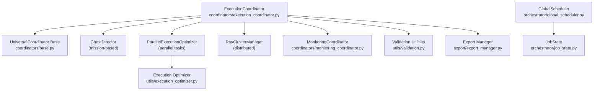
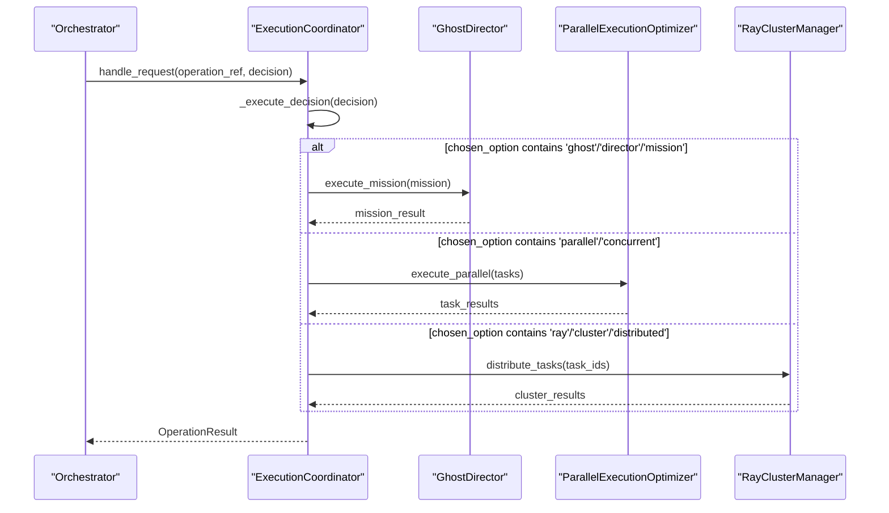
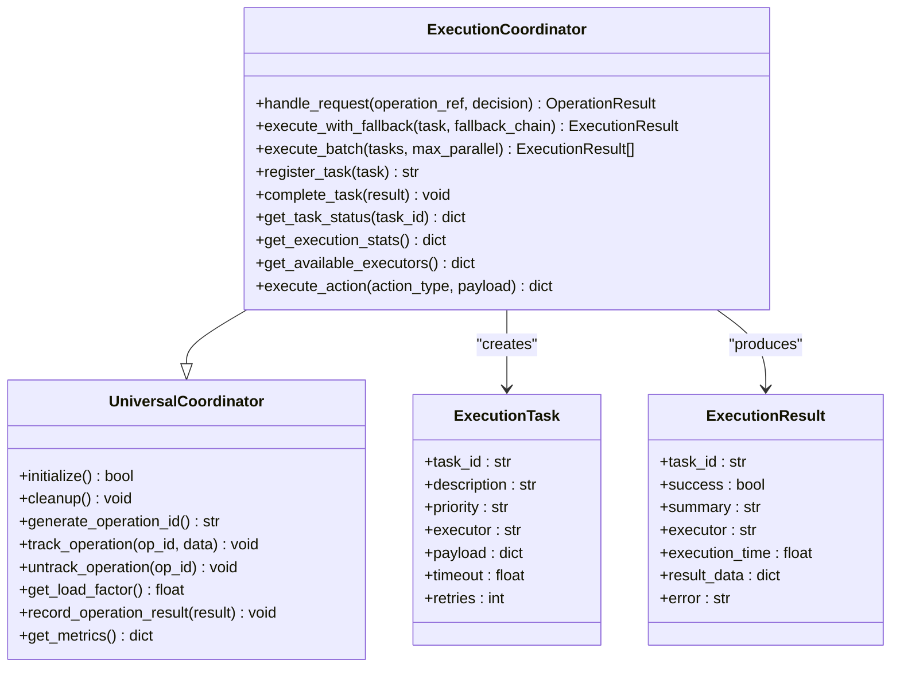
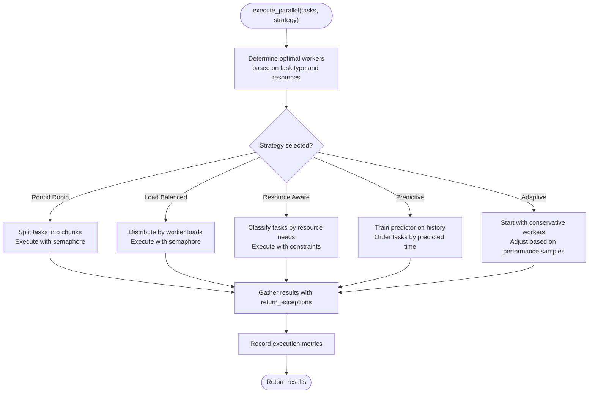
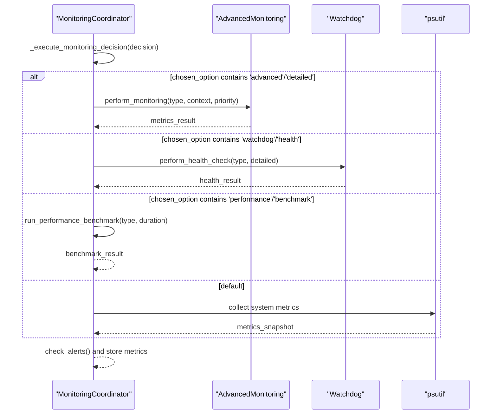
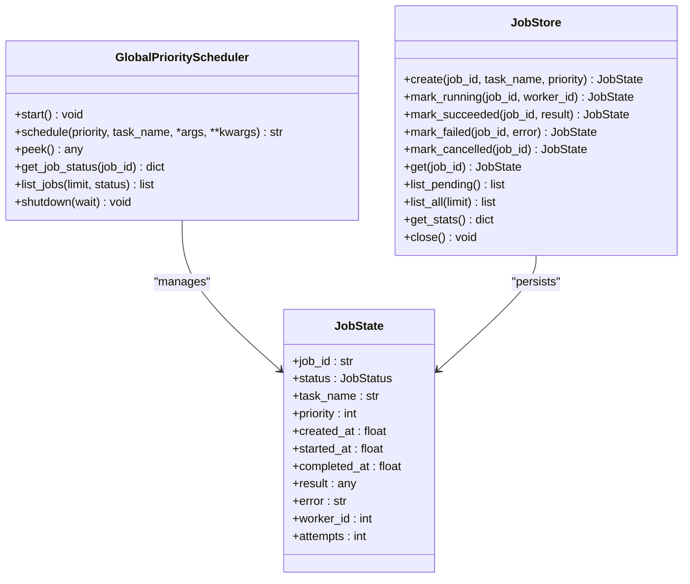
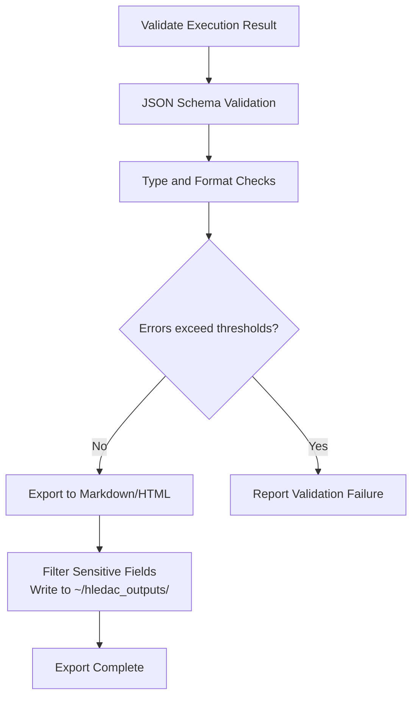
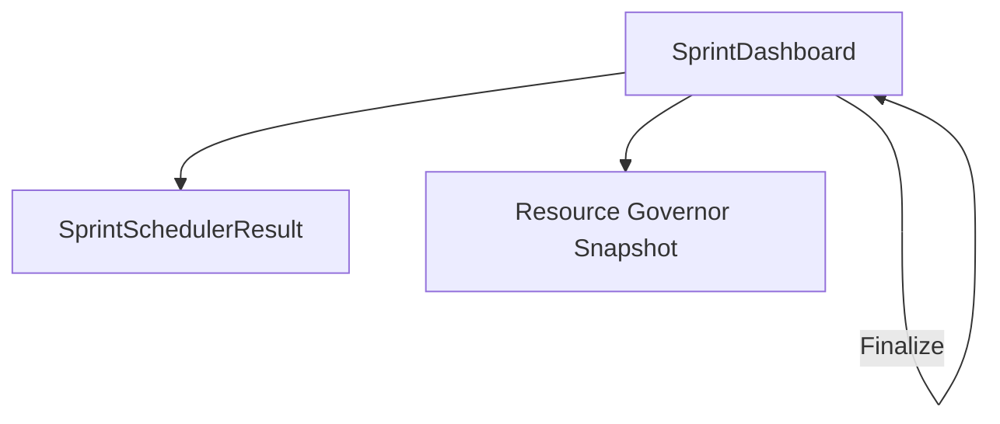
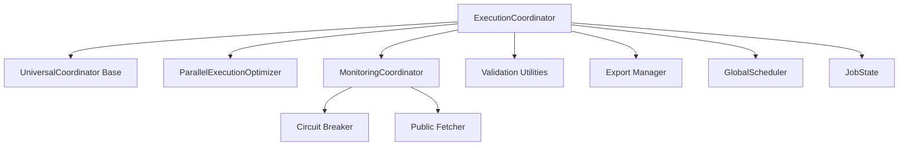

# Execution Coordinator

<cite>
**Referenced Files in This Document**
- [execution_coordinator.py](file://coordinators/execution_coordinator.py)
- [base.py](file://coordinators/base.py)
- [execution_optimizer.py](file://utils/execution_optimizer.py)
- [global_scheduler.py](file://orchestrator/global_scheduler.py)
- [job_state.py](file://orchestrator/job_state.py)
- [monitoring_coordinator.py](file://coordinators/monitoring_coordinator.py)
- [sprint_dashboard.py](file://monitoring/sprint_dashboard.py)
- [validation.py](file://utils/validation.py)
- [export_manager.py](file://export/export_manager.py)
- [research_optimizer.py](file://coordinators/research_optimizer.py)
- [circuit_breaker.py](file://transport/circuit_breaker.py)
- [public_fetcher.py](file://fetching/public_fetcher.py)
</cite>

## Table of Contents
1. [Introduction](#introduction)
2. [Project Structure](#project-structure)
3. [Core Components](#core-components)
4. [Architecture Overview](#architecture-overview)
5. [Detailed Component Analysis](#detailed-component-analysis)
6. [Dependency Analysis](#dependency-analysis)
7. [Performance Considerations](#performance-considerations)
8. [Troubleshooting Guide](#troubleshooting-guide)
9. [Conclusion](#conclusion)
10. [Appendices](#appendices)

## Introduction
This document describes the Execution Coordinator responsible for managing research task execution, workflow orchestration, and result processing across heterogeneous execution backends. It explains task execution patterns, workflow state management, result aggregation mechanisms, integration with the research pipeline, execution monitoring, and error handling procedures. It also documents execution optimization strategies, parallel processing coordination, result validation workflows, configuration options for execution parameters, timeouts, and retry policies, and provides examples of execution orchestration, result processing pipelines, and execution monitoring dashboards.

## Project Structure
The Execution Coordinator integrates with:
- Universal base coordinator for lifecycle, metrics, and memory-aware scheduling
- Three execution backends: GhostDirector (mission-based), ParallelExecutionOptimizer (parallel task processing), and RayClusterManager (distributed execution)
- Monitoring coordinator for system and performance metrics
- Validation utilities for result quality assurance
- Export manager for artifact output
- Global scheduler for priority-based distributed processing
- Circuit breaker and retry policies for resilient fetching

**Diagram sources**
- [execution_coordinator.py:88-143](file://coordinators/execution_coordinator.py#L88-L143)
- [base.py:88-138](file://coordinators/base.py#L88-L138)
- [execution_optimizer.py:152-373](file://utils/execution_optimizer.py#L152-L373)
- [global_scheduler.py:83-125](file://orchestrator/global_scheduler.py#L83-L125)
- [job_state.py:24-56](file://orchestrator/job_state.py#L24-L56)
- [monitoring_coordinator.py:101-170](file://coordinators/monitoring_coordinator.py#L101-L170)
- [validation.py:51-82](file://utils/validation.py#L51-L82)
- [export_manager.py:49-70](file://export/export_manager.py#L49-L70)

**Section sources**
- [execution_coordinator.py:1-1022](file://coordinators/execution_coordinator.py#L1-L1022)
- [base.py:1-553](file://coordinators/base.py#L1-L553)

## Core Components
- ExecutionCoordinator: Routes decisions to appropriate execution backends, aggregates results, tracks tasks, and exposes metrics and capabilities.
- UniversalCoordinator Base: Provides operation lifecycle, load factor calculation, memory pressure awareness, and metrics recording.
- ParallelExecutionOptimizer: Manages parallel execution strategies, worker pools, resource-aware scheduling, and bounded concurrency.
- MonitoringCoordinator: Collects system metrics, performs health checks, and runs security audits.
- Validation Utilities: Validates execution results and data contracts with structured error reporting.
- Export Manager: Produces Markdown reports and interactive HTML graphs for findings.
- GlobalScheduler: Distributed priority scheduler with bounded task registry, CPU affinity, and work-stealing.
- JobState: In-memory job registry with LMDB persistence for crash recovery.
- Circuit Breaker and Fetcher: Retry policies and backoff strategies for resilient data fetching.

**Section sources**
- [execution_coordinator.py:88-143](file://coordinators/execution_coordinator.py#L88-L143)
- [base.py:88-138](file://coordinators/base.py#L88-L138)
- [execution_optimizer.py:152-373](file://utils/execution_optimizer.py#L152-L373)
- [monitoring_coordinator.py:101-170](file://coordinators/monitoring_coordinator.py#L101-L170)
- [validation.py:51-82](file://utils/validation.py#L51-L82)
- [export_manager.py:49-70](file://export/export_manager.py#L49-L70)
- [global_scheduler.py:83-125](file://orchestrator/global_scheduler.py#L83-L125)
- [job_state.py:62-90](file://orchestrator/job_state.py#L62-L90)
- [circuit_breaker.py:79-90](file://transport/circuit_breaker.py#L79-L90)
- [public_fetcher.py:304-335](file://fetching/public_fetcher.py#L304-L335)

## Architecture Overview
The Execution Coordinator orchestrates three execution backends:
- GhostDirector: Mission-based execution with confidence-driven routing.
- ParallelExecutionOptimizer: Parallel task execution with adaptive strategies and bounded concurrency.
- RayClusterManager: Distributed task distribution across a Ray cluster.

Routing logic selects the primary executor from the decision's chosen option and falls back to alternatives if available. Results are aggregated and normalized into a unified ExecutionResult model for downstream components.

**Diagram sources**
- [execution_coordinator.py:287-334](file://coordinators/execution_coordinator.py#L287-L334)
- [execution_coordinator.py:336-441](file://coordinators/execution_coordinator.py#L336-L441)
- [execution_coordinator.py:371-407](file://coordinators/execution_coordinator.py#L371-L407)

**Section sources**
- [execution_coordinator.py:287-334](file://coordinators/execution_coordinator.py#L287-L334)
- [execution_coordinator.py:336-441](file://coordinators/execution_coordinator.py#L336-L441)

## Detailed Component Analysis

### ExecutionCoordinator
Responsibilities:
- Intelligent routing based on decision.chosen_option with fallback chain.
- Dynamic task generation from confidence levels.
- Batch execution with controlled parallelism and exception handling.
- Task registration, completion tracking, and history management.
- Execution statistics and availability reporting.
- Integration with Hermes3 action execution and speculative decoding.

Key patterns:
- Confidence-based task scaling: higher confidence increases parallelism.
- Fallback execution across backends with immediate success detection.
- Bounded history for completed tasks to prevent memory growth.
- Memory-aware load factor adjustments for capacity decisions.

**Diagram sources**
- [base.py:88-138](file://coordinators/base.py#L88-L138)
- [execution_coordinator.py:88-143](file://coordinators/execution_coordinator.py#L88-L143)
- [execution_coordinator.py:39-86](file://coordinators/execution_coordinator.py#L39-L86)

**Section sources**
- [execution_coordinator.py:88-143](file://coordinators/execution_coordinator.py#L88-L143)
- [execution_coordinator.py:225-281](file://coordinators/execution_coordinator.py#L225-L281)
- [execution_coordinator.py:489-551](file://coordinators/execution_coordinator.py#L489-L551)
- [execution_coordinator.py:553-589](file://coordinators/execution_coordinator.py#L553-L589)

### ParallelExecutionOptimizer
Responsibilities:
- Manage thread/process pools for mixed workloads.
- Adaptive strategies: round-robin, load-balanced, resource-aware, predictive, adaptive.
- Bounded storage for parallel groups and worker metrics.
- M1 8GB memory pressure-aware concurrency limits.
- Lazy-loading ML predictors to avoid heavy imports.

Key patterns:
- Semaphore-gated execution to prevent unbounded pending operations.
- Worker pool sizing based on task type and system resources.
- Resource-aware worker allocation and dynamic worker count adaptation.
- Predictive ordering using historical task metrics.

**Diagram sources**
- [execution_optimizer.py:374-429](file://utils/execution_optimizer.py#L374-L429)
- [execution_optimizer.py:472-494](file://utils/execution_optimizer.py#L472-L494)
- [execution_optimizer.py:495-525](file://utils/execution_optimizer.py#L495-L525)
- [execution_optimizer.py:527-541](file://utils/execution_optimizer.py#L527-L541)
- [execution_optimizer.py:543-561](file://utils/execution_optimizer.py#L543-L561)
- [execution_optimizer.py:563-618](file://utils/execution_optimizer.py#L563-L618)

**Section sources**
- [execution_optimizer.py:152-373](file://utils/execution_optimizer.py#L152-L373)
- [execution_optimizer.py:374-429](file://utils/execution_optimizer.py#L374-L429)
- [execution_optimizer.py:472-618](file://utils/execution_optimizer.py#L472-L618)

### MonitoringCoordinator
Responsibilities:
- Multi-source monitoring: AdvancedMonitoring, Watchdog, psutil-based metrics.
- Background metrics collection with memory-pressure-aware intervals.
- Performance benchmarking and alerting on threshold breaches.
- Security audit integration and health check orchestration.

Key patterns:
- Threshold-based alerting for CPU, memory, and disk usage.
- Background collection loop with structured concurrency and cancellation support.
- Comprehensive health reports with metrics summaries and peak tracking.

**Diagram sources**
- [monitoring_coordinator.py:321-340](file://coordinators/monitoring_coordinator.py#L321-L340)
- [monitoring_coordinator.py:342-366](file://coordinators/monitoring_coordinator.py#L342-L366)
- [monitoring_coordinator.py:368-392](file://coordinators/monitoring_coordinator.py#L368-L392)
- [monitoring_coordinator.py:446-466](file://coordinators/monitoring_coordinator.py#L446-L466)
- [monitoring_coordinator.py:394-444](file://coordinators/monitoring_coordinator.py#L394-L444)

**Section sources**
- [monitoring_coordinator.py:101-170](file://coordinators/monitoring_coordinator.py#L101-L170)
- [monitoring_coordinator.py:321-340](file://coordinators/monitoring_coordinator.py#L321-L340)
- [monitoring_coordinator.py:394-444](file://coordinators/monitoring_coordinator.py#L394-L444)

### GlobalScheduler and JobState
Responsibilities:
- ProcessPoolExecutor-based scheduler with priority queues and CPU affinity.
- Work-stealing with bounded task registry and LMDB persistence for crash recovery.
- Job state machine with immutable snapshots and bounded eviction.

Key patterns:
- Priority queue ordering with unique sequence numbers for total ordering.
- Worker signaling via process-safe queues and result collection threads.
- Bounded storage with FIFO eviction and LMDB persistence.

**Diagram sources**
- [global_scheduler.py:83-125](file://orchestrator/global_scheduler.py#L83-L125)
- [job_state.py:24-56](file://orchestrator/job_state.py#L24-L56)
- [job_state.py:62-90](file://orchestrator/job_state.py#L62-L90)

**Section sources**
- [global_scheduler.py:83-125](file://orchestrator/global_scheduler.py#L83-L125)
- [job_state.py:62-90](file://orchestrator/job_state.py#L62-L90)

### Result Validation and Export
Responsibilities:
- Structured validation of execution results and data contracts.
- Export of findings to Obsidian-compatible Markdown and interactive HTML graphs.
- Sensitive data filtering and output path security enforcement.

Key patterns:
- Configurable validation rules with severity levels and caching.
- Export manager enforces output directory boundaries and filters sensitive fields.
- Markdown front matter includes metadata and findings with wikilinks.

**Diagram sources**
- [validation.py:215-312](file://utils/validation.py#L215-L312)
- [validation.py:82-151](file://utils/validation.py#L82-L151)
- [export_manager.py:44-47](file://export/export_manager.py#L44-L47)
- [export_manager.py:118-200](file://export/export_manager.py#L118-L200)
- [export_manager.py:202-287](file://export/export_manager.py#L202-L287)

**Section sources**
- [validation.py:51-82](file://utils/validation.py#L51-L82)
- [validation.py:215-312](file://utils/validation.py#L215-L312)
- [export_manager.py:49-70](file://export/export_manager.py#L49-L70)
- [export_manager.py:118-200](file://export/export_manager.py#L118-L200)

### Execution Monitoring Dashboard
The SprintDashboard provides a live terminal dashboard for sprint execution, displaying phase indicators, findings counters, cycle progress, source telemetry, branch status, and governor state.

**Diagram sources**
- [sprint_dashboard.py:66-137](file://monitoring/sprint_dashboard.py#L66-L137)
- [sprint_dashboard.py:140-268](file://monitoring/sprint_dashboard.py#L140-L268)

**Section sources**
- [sprint_dashboard.py:66-137](file://monitoring/sprint_dashboard.py#L66-L137)

## Dependency Analysis
The Execution Coordinator depends on:
- Universal base for lifecycle and metrics
- ParallelExecutionOptimizer for parallel execution strategies
- MonitoringCoordinator for system metrics and health checks
- Validation utilities for result quality assurance
- Export manager for artifact output
- GlobalScheduler and JobState for distributed processing and state management
- Circuit breaker and fetcher for resilient data retrieval

**Diagram sources**
- [execution_coordinator.py:88-143](file://coordinators/execution_coordinator.py#L88-L143)
- [base.py:88-138](file://coordinators/base.py#L88-L138)
- [execution_optimizer.py:152-373](file://utils/execution_optimizer.py#L152-L373)
- [monitoring_coordinator.py:101-170](file://coordinators/monitoring_coordinator.py#L101-L170)
- [validation.py:51-82](file://utils/validation.py#L51-L82)
- [export_manager.py:49-70](file://export/export_manager.py#L49-L70)
- [global_scheduler.py:83-125](file://orchestrator/global_scheduler.py#L83-L125)
- [job_state.py:62-90](file://orchestrator/job_state.py#L62-L90)
- [circuit_breaker.py:79-90](file://transport/circuit_breaker.py#L79-L90)
- [public_fetcher.py:304-335](file://fetching/public_fetcher.py#L304-L335)

**Section sources**
- [execution_coordinator.py:88-143](file://coordinators/execution_coordinator.py#L88-L143)
- [execution_optimizer.py:152-373](file://utils/execution_optimizer.py#L152-L373)
- [monitoring_coordinator.py:101-170](file://coordinators/monitoring_coordinator.py#L101-L170)
- [global_scheduler.py:83-125](file://orchestrator/global_scheduler.py#L83-L125)
- [job_state.py:62-90](file://orchestrator/job_state.py#L62-L90)
- [circuit_breaker.py:79-90](file://transport/circuit_breaker.py#L79-L90)
- [public_fetcher.py:304-335](file://fetching/public_fetcher.py#L304-L335)

## Performance Considerations
- Memory-aware concurrency: The ExecutionCoordinator and ParallelExecutionOptimizer adapt worker counts and pending operations based on memory pressure to prevent Metal memory pressure on M1 8GB systems.
- Bounded storage: Parallel groups, worker metrics, and job registries use bounded storage with TTL and FIFO eviction to prevent memory leaks.
- Adaptive timeouts: Research optimizer calculates adaptive timeouts based on query history to balance responsiveness and reliability.
- Priority scheduling: GlobalScheduler uses CPU affinity and work-stealing to improve throughput on single M1 systems.
- Structured concurrency: Background tasks and timeouts use asyncio timeouts and cancellation to maintain responsiveness.

[No sources needed since this section provides general guidance]

## Troubleshooting Guide
Common issues and resolutions:
- All execution backends unavailable: The coordinator falls back through GhostDirector, Parallel, and Ray. If all fail, it returns a consolidated error result.
- Memory pressure causing OOM: The coordinator reduces effective capacity under elevated memory pressure. Consider lowering max_concurrent or adjusting M1-specific defaults.
- Unbounded pending operations: The execution optimizer uses semaphores to gate pending tasks. Increase HLEDAC_MAX_PENDING_OPS cautiously.
- Fetch failures and retries: Circuit breaker and fetcher implement bounded retries and exponential backoff. Review Retry-After headers and status codes.
- Validation failures: Use structured validation results to identify schema and type violations. Address warnings and critical errors accordingly.
- Export security: Ensure sensitive fields are filtered and output paths remain within the designated directory.

**Section sources**
- [execution_coordinator.py:327-334](file://coordinators/execution_coordinator.py#L327-L334)
- [execution_optimizer.py:189-204](file://utils/execution_optimizer.py#L189-L204)
- [circuit_breaker.py:148-172](file://transport/circuit_breaker.py#L148-L172)
- [public_fetcher.py:323-335](file://fetching/public_fetcher.py#L323-L335)
- [validation.py:400-418](file://utils/validation.py#L400-L418)
- [export_manager.py:44-47](file://export/export_manager.py#L44-L47)

## Conclusion
The Execution Coordinator provides a robust, memory-aware, and resilient execution framework that integrates multiple execution backends, parallel processing, monitoring, validation, and export capabilities. Its routing, fallback, and aggregation mechanisms ensure reliable research task execution, while optimization strategies and bounded storage keep performance predictable on constrained hardware.

[No sources needed since this section summarizes without analyzing specific files]

## Appendices

### Configuration Options and Parameters
- ExecutionCoordinator
  - max_concurrent: Maximum concurrent operations for load factor calculations.
  - Memory pressure thresholds: Elevated, High, Critical levels influence capacity.
  - Executor availability flags: GhostDirector, ParallelExecutionOptimizer, RayClusterManager.
  - Task tracking history limits: Pending and completed task histories are bounded.

- ParallelExecutionOptimizer
  - HLEDAC_MAX_PENDING_OPS: Environment variable to control maximum pending operations (default tuned for M1 8GB).
  - Strategy selection: Round-robin, load-balanced, resource-aware, predictive, adaptive.
  - Worker pool sizes: Thread and process pool sizes configured via execution settings.

- MonitoringCoordinator
  - Collection interval: Background metrics collection interval.
  - Alert thresholds: CPU, memory, and disk thresholds with warning/critical levels.
  - Benchmark history: Recent benchmark results with averages and peak metrics.

- GlobalScheduler
  - max_workers: Number of worker processes.
  - Priority queue ordering: Total ordering via sequence numbers.
  - Bounded storage: MAX_TASK_REGISTRY and MAX_AFFINITY_ENTRIES with FIFO eviction.

- Research Optimizer
  - Adaptive timeouts: Calculated based on query history and success rates.
  - Cache cleanup: Automatic removal of expired cache entries.

- Circuit Breaker and Fetcher
  - Retry thresholds: Failure count and recovery timeout parameters.
  - Backoff computation: Retry-After header parsing and exponential backoff with caps.

**Section sources**
- [execution_coordinator.py:108-143](file://coordinators/execution_coordinator.py#L108-L143)
- [execution_optimizer.py:189-204](file://utils/execution_optimizer.py#L189-L204)
- [monitoring_coordinator.py:122-170](file://coordinators/monitoring_coordinator.py#L122-L170)
- [global_scheduler.py:93-125](file://orchestrator/global_scheduler.py#L93-L125)
- [research_optimizer.py:333-352](file://coordinators/research_optimizer.py#L333-L352)
- [circuit_breaker.py:79-90](file://transport/circuit_breaker.py#L79-L90)
- [public_fetcher.py:304-335](file://fetching/public_fetcher.py#L304-L335)

### Examples

#### Execution Workflow Orchestration
- Decision routing: The coordinator parses decision.chosen_option to select GhostDirector, ParallelExecutionOptimizer, or RayClusterManager, with fallback to alternatives.
- Batch execution: Tasks are generated from confidence levels and executed with controlled parallelism using asyncio.gather and semaphores.

**Section sources**
- [execution_coordinator.py:287-334](file://coordinators/execution_coordinator.py#L287-L334)
- [execution_coordinator.py:371-407](file://coordinators/execution_coordinator.py#L371-L407)
- [execution_coordinator.py:553-589](file://coordinators/execution_coordinator.py#L553-L589)

#### Result Processing Pipeline
- Validation: Execution results are validated against JSON schema and type rules with severity levels and caching.
- Export: Validated results are exported to Markdown with YAML front matter and to interactive HTML graphs.

**Section sources**
- [validation.py:215-312](file://utils/validation.py#L215-L312)
- [export_manager.py:118-200](file://export/export_manager.py#L118-L200)
- [export_manager.py:202-287](file://export/export_manager.py#L202-L287)

#### Execution Monitoring Dashboard
- Live dashboard displays phase, elapsed/remaining time, findings counters, cycle progress, source telemetry, branch status, and governor state.

**Section sources**
- [sprint_dashboard.py:66-137](file://monitoring/sprint_dashboard.py#L66-L137)
- [sprint_dashboard.py:140-268](file://monitoring/sprint_dashboard.py#L140-L268)