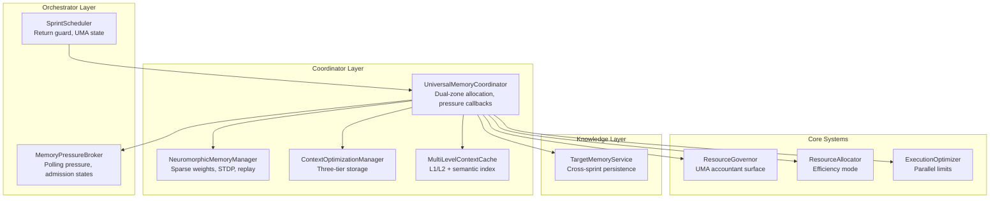
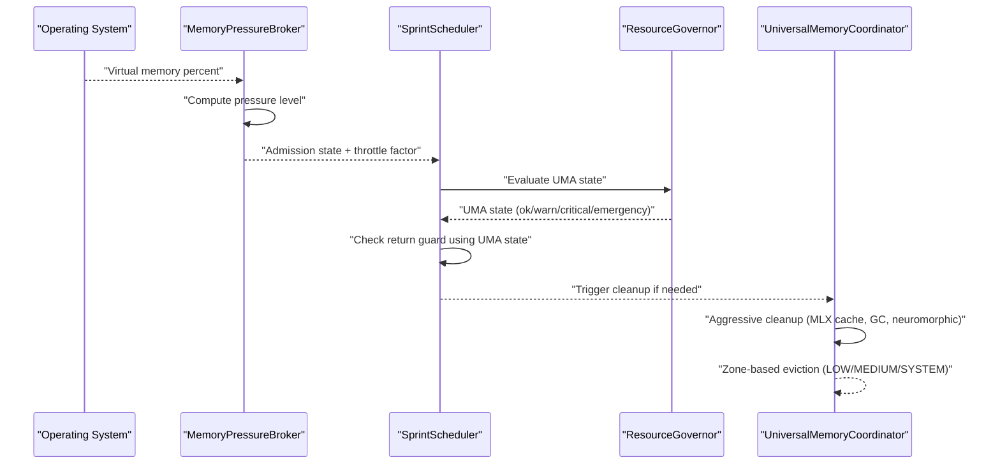
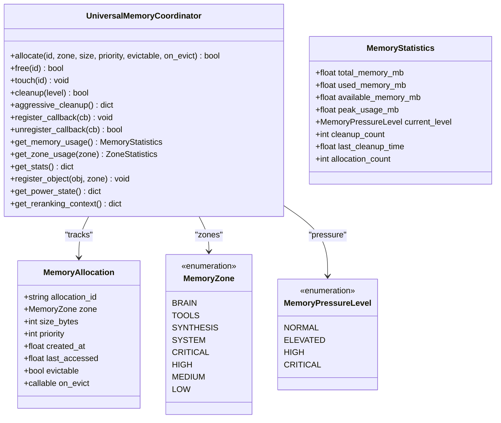
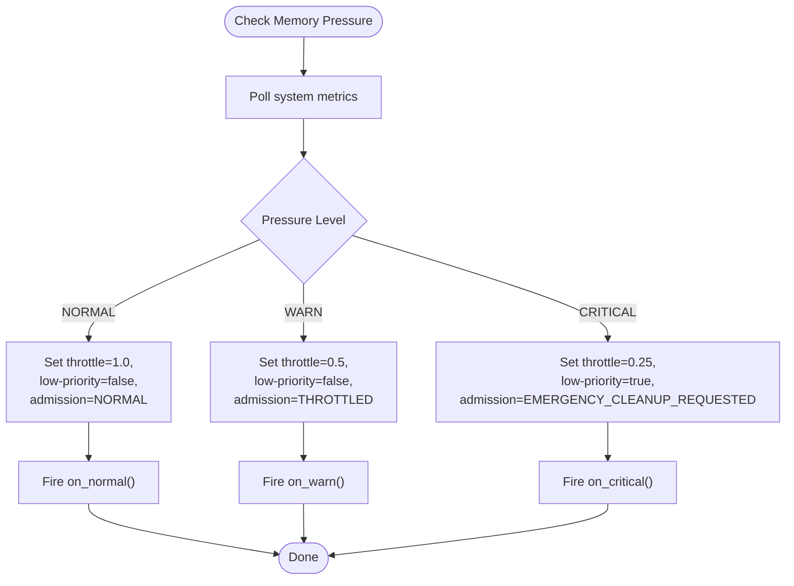
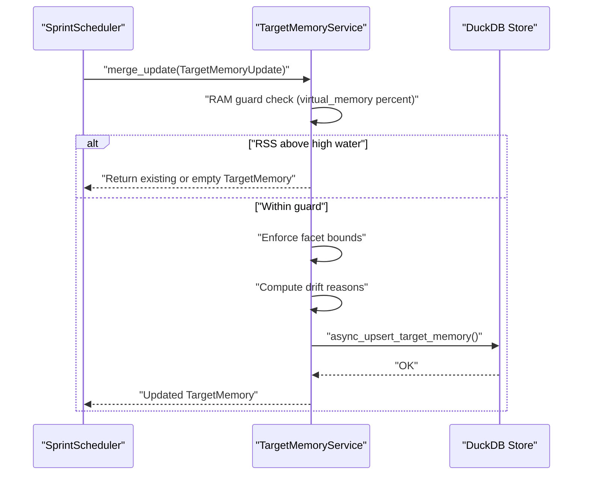
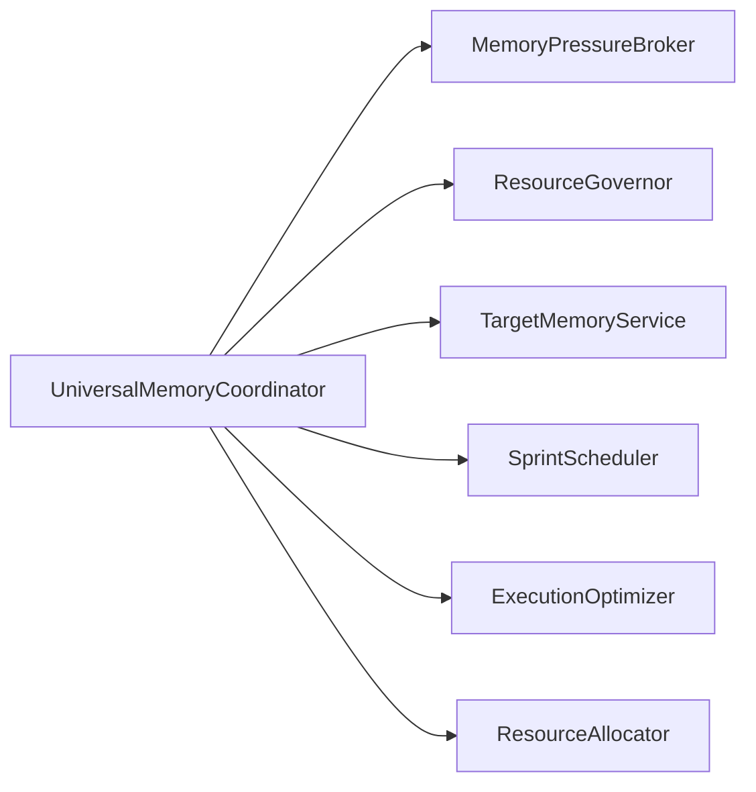

# Memory Coordinator

<cite>
**Referenced Files in This Document**
- [memory_coordinator.py](file://coordinators/memory_coordinator.py)
- [M1_8GB_MEMORY_BUDGET.md](file://M1_8GB_MEMORY_BUDGET.md)
- [memory_pressure_broker.py](file://orchestrator/memory_pressure_broker.py)
- [target_memory.py](file://knowledge/target_memory.py)
- [resource_governor.py](file://core/resource_governor.py)
- [resource_allocator.py](file://coordinators/resource_allocator.py)
- [execution_optimizer.py](file://utils/execution_optimizer.py)
- [sprint_scheduler.py](file://runtime/sprint_scheduler.py)
</cite>

## Table of Contents
1. [Introduction](#introduction)
2. [Project Structure](#project-structure)
3. [Core Components](#core-components)
4. [Architecture Overview](#architecture-overview)
5. [Detailed Component Analysis](#detailed-component-analysis)
6. [Dependency Analysis](#dependency-analysis)
7. [Performance Considerations](#performance-considerations)
8. [Troubleshooting Guide](#troubleshooting-guide)
9. [Conclusion](#conclusion)
10. [Appendices](#appendices)

## Introduction
This document describes the Memory Coordinator that powers memory management and optimization across the Hledac Universal system, with a focus on M1 8GB memory pressure awareness, threshold-based adjustments, adaptive operation scheduling, and cross-sprint memory persistence. It explains how the coordinator integrates with the Universal Coordinator’s memory-aware scheduling, performance monitoring, and failure recovery mechanisms. It also documents configuration options for memory budgets, optimization parameters, and monitoring thresholds, and provides practical examples and troubleshooting guidance for memory-efficient operation execution.

## Project Structure
The Memory Coordinator resides in the Universal Coordinator package and coordinates:
- M1 8GB memory pressure detection and response
- Dual-zone memory allocation and eviction (M1 Master + Universal)
- Aggressive cleanup routines (GC, MLX cache, neuromorphic memory)
- Cross-sprint target memory persistence with RAM guards
- Integration with orchestrator pressure broker and scheduler
- Context optimization and multi-level caching for memory efficiency

**Diagram sources**
- [memory_coordinator.py:694-1599](file://coordinators/memory_coordinator.py#L694-L1599)
- [memory_pressure_broker.py:79-291](file://orchestrator/memory_pressure_broker.py#L79-L291)
- [target_memory.py:56-346](file://knowledge/target_memory.py#L56-L346)
- [resource_governor.py:314-316](file://core/resource_governor.py#L314-L316)
- [resource_allocator.py:640-659](file://coordinators/resource_allocator.py#L640-L659)
- [execution_optimizer.py:138-158](file://utils/execution_optimizer.py#L138-L158)
- [sprint_scheduler.py:4372-4401](file://runtime/sprint_scheduler.py#L4372-L4401)

**Section sources**
- [memory_coordinator.py:694-1599](file://coordinators/memory_coordinator.py#L694-L1599)
- [memory_pressure_broker.py:79-291](file://orchestrator/memory_pressure_broker.py#L79-L291)
- [target_memory.py:56-346](file://knowledge/target_memory.py#L56-L346)

## Core Components
- UniversalMemoryCoordinator: Central memory manager with dual-zone allocation, pressure monitoring, callbacks, and aggressive cleanup. It integrates M1-specific optimizations (MLX cache clearing) and neuromorphic memory.
- MemoryPressureBroker: Polls system memory pressure and exposes admission states and throttle factors to orchestration.
- TargetMemoryService: Bounded, cross-sprint target memory with RAM guards and drift reasoning.
- ResourceGovernor: Maps system memory usage to UMA states for scheduling decisions.
- ResourceAllocator: Applies memory efficiency mode and optimizes active allocations.
- ExecutionOptimizer: Adjusts parallelism based on memory availability.
- SprintScheduler: Reads UMA state to decide when to return early from a sprint.

Key responsibilities:
- Memory pressure detection and threshold-based adjustments
- Adaptive operation scheduling and budget throttling
- Cross-sprint memory persistence with RAM guards
- Thermal awareness and power state integration
- Multi-level caching and context optimization

**Section sources**
- [memory_coordinator.py:694-1599](file://coordinators/memory_coordinator.py#L694-L1599)
- [memory_pressure_broker.py:79-291](file://orchestrator/memory_pressure_broker.py#L79-L291)
- [target_memory.py:56-346](file://knowledge/target_memory.py#L56-L346)
- [resource_governor.py:314-316](file://core/resource_governor.py#L314-L316)
- [resource_allocator.py:640-659](file://coordinators/resource_allocator.py#L640-L659)
- [execution_optimizer.py:138-158](file://utils/execution_optimizer.py#L138-L158)
- [sprint_scheduler.py:4372-4401](file://runtime/sprint_scheduler.py#L4372-L4401)

## Architecture Overview
The Memory Coordinator orchestrates memory-aware behavior across the system:
- Pressure detection: MemoryPressureBroker polls and emits pressure levels and admission states.
- Scheduling: SprintScheduler consults UMA state to decide whether to return early from a sprint.
- Resource governance: ResourceGovernor translates memory usage into UMA states for downstream decisions.
- Memory management: UniversalMemoryCoordinator performs zone-based cleanup, MLX cache clearing, and neuromorphic memory operations.
- Persistence: TargetMemoryService persists cross-sprint target memory with RAM guards and bounded facets.

**Diagram sources**
- [memory_pressure_broker.py:223-291](file://orchestrator/memory_pressure_broker.py#L223-L291)
- [sprint_scheduler.py:4372-4401](file://runtime/sprint_scheduler.py#L4372-L4401)
- [resource_governor.py:314-316](file://core/resource_governor.py#L314-L316)
- [memory_coordinator.py:1282-1317](file://coordinators/memory_coordinator.py#L1282-L1317)

## Detailed Component Analysis

### UniversalMemoryCoordinator
Responsibilities:
- Dual-zone memory allocation and eviction (M1 Master zones: BRAIN, TOOLS, SYNTHESIS, SYSTEM; Universal zones: CRITICAL, HIGH, MEDIUM, LOW)
- Memory pressure calculation and callbacks
- Aggressive cleanup: MLX cache clearing, GC, neuromorphic memory cleanup
- Thermal awareness: battery/power state, thermal trends, adaptive monitoring intervals
- Neuromorphic memory integration: STDP learning, consolidation, replay
- Context optimization: three-tier storage and multi-level cache with semantic search

Key APIs:
- allocate/free/touch: manage memory allocations with eviction callbacks
- aggressive_cleanup/cleanup: perform cleanup based on pressure level
- register_callback/unregister_callback/_notify_callbacks: pressure event notifications
- get_memory_usage/get_zone_usage/get_stats: memory statistics and diagnostics
- register_object: simplified object registration to a zone
- Thermal and power state helpers: get_power_state, get_reranking_context

**Diagram sources**
- [memory_coordinator.py:694-1599](file://coordinators/memory_coordinator.py#L694-L1599)

**Section sources**
- [memory_coordinator.py:694-1599](file://coordinators/memory_coordinator.py#L694-L1599)

### MemoryPressureBroker
Responsibilities:
- Polls system memory pressure (fallback to psutil/vm_stat)
- Computes pressure levels and admission states
- Provides budget throttle factor and low-priority suspension flags
- Fires lightweight callbacks on pressure transitions

Behavior:
- WARN (80%): throttle budgets ~50%, stop low-priority enqueue
- CRITICAL (90%): suspend low-priority admissions, emergency cleanup requested

**Diagram sources**
- [memory_pressure_broker.py:223-291](file://orchestrator/memory_pressure_broker.py#L223-L291)

**Section sources**
- [memory_pressure_broker.py:79-291](file://orchestrator/memory_pressure_broker.py#L79-L291)

### TargetMemoryService (Cross-Sprint Persistence)
Responsibilities:
- Bounded cross-sprint target memory with RAM guard
- Facet bounds enforcement (entities, exposures, pivots)
- Confidence drift tracking and reasons
- Asynchronous upsert with RAM guard and JSON size bounds

**Diagram sources**
- [target_memory.py:246-332](file://knowledge/target_memory.py#L246-L332)
- [sprint_scheduler.py:6695-6734](file://runtime/sprint_scheduler.py#L6695-L6734)

**Section sources**
- [target_memory.py:56-346](file://knowledge/target_memory.py#L56-L346)
- [sprint_scheduler.py:6695-6734](file://runtime/sprint_scheduler.py#L6695-L6734)

### ResourceGovernor and UMA State
Responsibilities:
- Map system-used GiB to UMA state for scheduling decisions
- Provide reservation mechanism with priority and risk-awareness

Integration:
- SprintScheduler reads UMA state to decide return conditions
- UniversalMemoryCoordinator triggers cleanup based on pressure

**Section sources**
- [resource_governor.py:314-316](file://core/resource_governor.py#L314-L316)
- [sprint_scheduler.py:4372-4401](file://runtime/sprint_scheduler.py#L4372-L4401)

### ExecutionOptimizer and ResourceAllocator
Responsibilities:
- Adjust parallelism and execution limits based on memory availability
- Optimize active allocations and set memory efficiency mode

**Section sources**
- [execution_optimizer.py:138-158](file://utils/execution_optimizer.py#L138-L158)
- [resource_allocator.py:640-659](file://coordinators/resource_allocator.py#L640-L659)

## Dependency Analysis
The Memory Coordinator integrates with several subsystems:
- Orchestrator: MemoryPressureBroker for pressure signals and admission states
- Runtime: SprintScheduler for return-guard decisions based on UMA state
- Core: ResourceGovernor for UMA accounting
- Knowledge: TargetMemoryService for cross-sprint persistence
- Utilities: ExecutionOptimizer and ResourceAllocator for memory-aware execution

**Diagram sources**
- [memory_coordinator.py:694-1599](file://coordinators/memory_coordinator.py#L694-L1599)
- [memory_pressure_broker.py:79-291](file://orchestrator/memory_pressure_broker.py#L79-L291)
- [resource_governor.py:314-316](file://core/resource_governor.py#L314-L316)
- [target_memory.py:56-346](file://knowledge/target_memory.py#L56-L346)
- [sprint_scheduler.py:4372-4401](file://runtime/sprint_scheduler.py#L4372-L4401)
- [execution_optimizer.py:138-158](file://utils/execution_optimizer.py#L138-L158)
- [resource_allocator.py:640-659](file://coordinators/resource_allocator.py#L640-L659)

**Section sources**
- [memory_coordinator.py:694-1599](file://coordinators/memory_coordinator.py#L694-L1599)
- [memory_pressure_broker.py:79-291](file://orchestrator/memory_pressure_broker.py#L79-L291)
- [target_memory.py:56-346](file://knowledge/target_memory.py#L56-L346)
- [resource_governor.py:314-316](file://core/resource_governor.py#L314-L316)
- [sprint_scheduler.py:4372-4401](file://runtime/sprint_scheduler.py#L4372-L4401)
- [execution_optimizer.py:138-158](file://utils/execution_optimizer.py#L138-L158)
- [resource_allocator.py:640-659](file://coordinators/resource_allocator.py#L640-L659)

## Performance Considerations
- M1 8GB memory budget: The system operates within ~5.5 GB usable, with a warning threshold at ~5 GB RSS. See [M1_8GB_MEMORY_BUDGET.md:1-136](file://M1_8GB_MEMORY_BUDGET.md#L1-L136).
- Aggressive cleanup: MLX cache clearing, multiple GC passes, and neuromorphic memory cleanup reduce memory footprint under pressure.
- Thermal awareness: Throttling and adaptive monitoring intervals prevent thermal runaway.
- Cross-sprint persistence: TargetMemoryService enforces RAM guards and bounded facets to avoid unbounded growth.
- Multi-level caching: L1/L2 cache with semantic index reduces recomputation and memory pressure.

[No sources needed since this section provides general guidance]

## Troubleshooting Guide
Common issues and strategies:
- Memory pressure spikes:
  - Trigger cleanup: Use [aggressive_cleanup:1218-1280](file://coordinators/memory_coordinator.py#L1218-L1280) and [cleanup:1282-1317](file://coordinators/memory_coordinator.py#L1282-L1317).
  - Monitor pressure: Use [get_memory_usage:1371-1401](file://coordinators/memory_coordinator.py#L1371-L1401) and [get_stats:1434-1457](file://coordinators/memory_coordinator.py#L1434-L1457).
  - Register callbacks: Use [register_callback:1463-1494](file://coordinators/memory_coordinator.py#L1463-L1494) to receive pressure events.
- Cross-sprint target memory growth:
  - Verify RAM guard: [TargetMemoryService.merge_update:246-332](file://knowledge/target_memory.py#L246-L332) skips merge when memory usage is too high.
  - Enforce bounds: Entities, exposures, pivots, and JSON size are bounded.
- Thermal throttling:
  - Check power state: [get_power_state:837-844](file://coordinators/memory_coordinator.py#L837-L844).
  - Review thermal trend: [get_thermal_trend:815-825](file://coordinators/memory_coordinator.py#L815-L825).
- Scheduler return guard:
  - Inspect UMA state: [sprint_scheduler return guard:4372-4401](file://runtime/sprint_scheduler.py#L4372-L4401) uses UMA state to decide returns.

**Section sources**
- [memory_coordinator.py:1218-1494](file://coordinators/memory_coordinator.py#L1218-L1494)
- [target_memory.py:246-332](file://knowledge/target_memory.py#L246-L332)
- [sprint_scheduler.py:4372-4401](file://runtime/sprint_scheduler.py#L4372-L4401)

## Conclusion
The Memory Coordinator provides a robust, M1-optimized memory management foundation for the Hledac Universal system. By combining dual-zone allocation, pressure-aware scheduling, aggressive cleanup, and cross-sprint persistence with RAM guards, it ensures stable operation under memory constraints. Integration with the MemoryPressureBroker, ResourceGovernor, and SprintScheduler enables adaptive, responsive behavior that maintains throughput while preventing memory exhaustion.

[No sources needed since this section summarizes without analyzing specific files]

## Appendices

### Configuration Options and Parameters
- Memory budget and limits:
  - Memory limit (MB): configurable in [UniversalMemoryCoordinator.__init__:711-719](file://coordinators/memory_coordinator.py#L711-L719)
  - M1 8GB usable budget: see [M1_8GB_MEMORY_BUDGET.md:1-136](file://M1_8GB_MEMORY_BUDGET.md#L1-L136)
- Pressure thresholds:
  - Pressure level calculation: [MemoryCoordinator._calculate_pressure_level:1547-1558](file://coordinators/memory_coordinator.py#L1547-L1558)
  - Broker throttle factors: [MemoryPressureBroker:308-322](file://orchestrator/memory_pressure_broker.py#L308-L322)
- Cleanup and eviction:
  - Zone-based eviction: [clear_zone:1319-1350](file://coordinators/memory_coordinator.py#L1319-L1350)
  - Aggressive cleanup: [aggressive_cleanup:1218-1280](file://coordinators/memory_coordinator.py#L1218-L1280)
- Thermal and power:
  - Power state and thermal state: [get_power_state:837-844](file://coordinators/memory_coordinator.py#L837-L844)
  - Thermal monitor loop: [thermal monitor:884-903](file://coordinators/memory_coordinator.py#L884-L903)
- Cross-sprint persistence:
  - RAM guard and bounds: [TargetMemoryService:18-27](file://knowledge/target_memory.py#L18-L27)
  - Async upsert: [async_upsert_target_memory:4585-4619](file://knowledge/target_memory.py#L4585-L4619)
- Execution and resource optimization:
  - Memory efficiency mode: [ResourceAllocator:640-659](file://coordinators/resource_allocator.py#L640-L659)
  - Parallel limits: [ExecutionOptimizer:138-158](file://utils/execution_optimizer.py#L138-L158)

**Section sources**
- [memory_coordinator.py:711-719](file://coordinators/memory_coordinator.py#L711-L719)
- [M1_8GB_MEMORY_BUDGET.md:1-136](file://M1_8GB_MEMORY_BUDGET.md#L1-L136)
- [memory_pressure_broker.py:308-322](file://orchestrator/memory_pressure_broker.py#L308-L322)
- [memory_coordinator.py:1218-1350](file://coordinators/memory_coordinator.py#L1218-L1350)
- [memory_coordinator.py:837-903](file://coordinators/memory_coordinator.py#L837-L903)
- [target_memory.py:18-27](file://knowledge/target_memory.py#L18-L27)
- [target_memory.py:4585-4619](file://knowledge/target_memory.py#L4585-L4619)
- [resource_allocator.py:640-659](file://coordinators/resource_allocator.py#L640-L659)
- [execution_optimizer.py:138-158](file://utils/execution_optimizer.py#L138-L158)

### Examples

- Memory-efficient operation execution:
  - Use [allocate:1115-1171](file://coordinators/memory_coordinator.py#L1115-L1171) with appropriate zone and priority.
  - Register eviction callbacks to persist or recompute data when evicted.
  - Monitor usage with [get_memory_usage:1371-1401](file://coordinators/memory_coordinator.py#L1371-L1401).

- Memory pressure response strategies:
  - On pressure increase, trigger [cleanup:1282-1317](file://coordinators/memory_coordinator.py#L1282-L1317) to evict LOW/MEDIUM and SYSTEM allocations.
  - Force immediate cleanup with [aggressive_cleanup:1218-1280](file://coordinators/memory_coordinator.py#L1218-L1280).

- Cross-sprint memory persistence:
  - Merge updates with [TargetMemoryService.merge_update:246-332](file://knowledge/target_memory.py#L246-L332), which applies RAM guards and bounds.
  - Persist asynchronously with [async_upsert_target_memory:4585-4619](file://knowledge/target_memory.py#L4585-L4619).

- Integration with scheduling:
  - Read UMA state in [SprintScheduler.return guard:4372-4401](file://runtime/sprint_scheduler.py#L4372-L4401) to decide early returns.

**Section sources**
- [memory_coordinator.py:1115-1317](file://coordinators/memory_coordinator.py#L1115-L1317)
- [memory_coordinator.py:1218-1317](file://coordinators/memory_coordinator.py#L1218-L1317)
- [target_memory.py:246-332](file://knowledge/target_memory.py#L246-L332)
- [target_memory.py:4585-4619](file://knowledge/target_memory.py#L4585-L4619)
- [sprint_scheduler.py:4372-4401](file://runtime/sprint_scheduler.py#L4372-L4401)