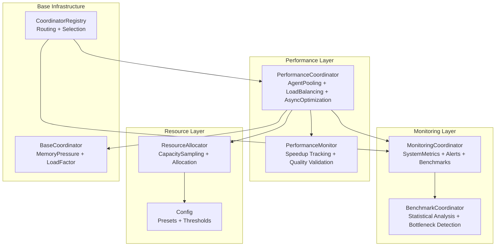
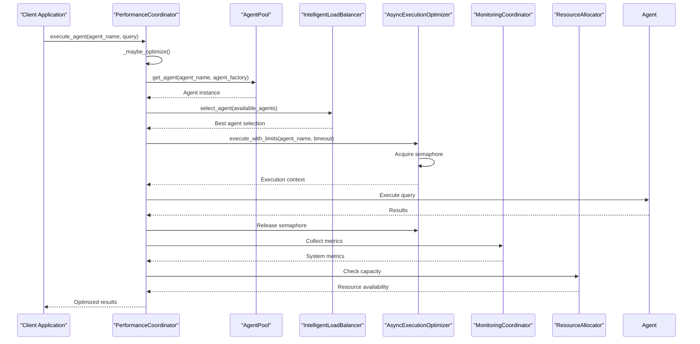
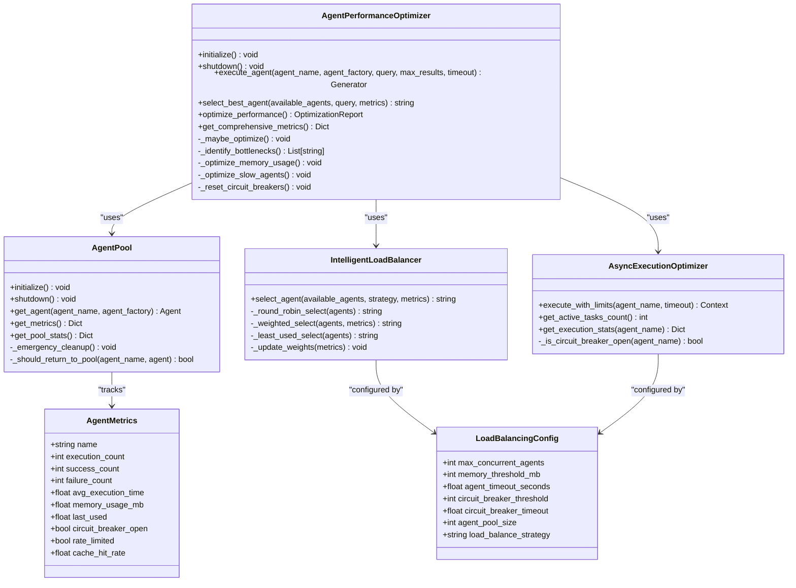
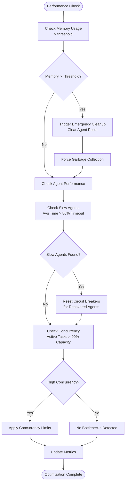
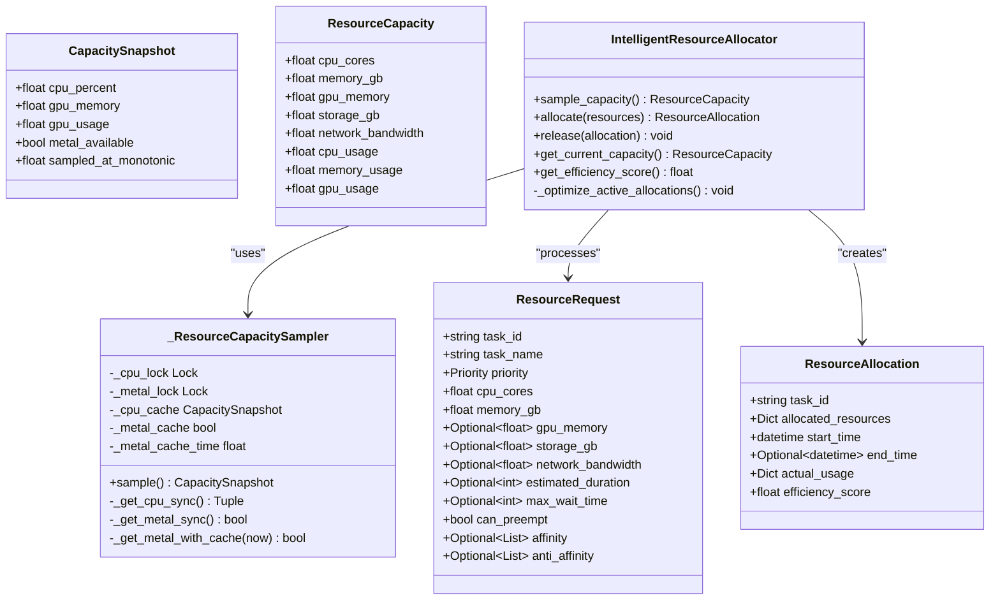
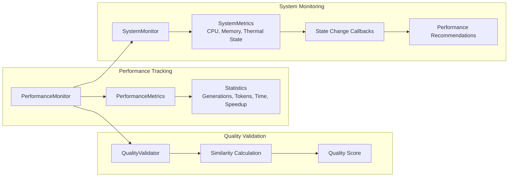
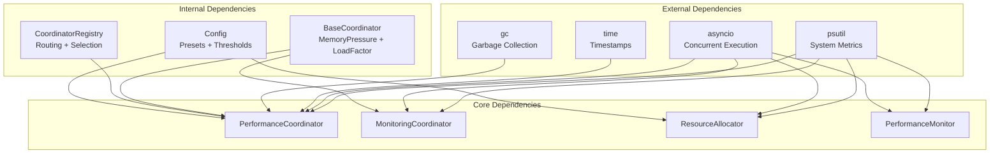

# Performance Coordinator

<cite>
**Referenced Files in This Document**
- [performance_coordinator.py](file://coordinators/performance_coordinator.py)
- [monitoring_coordinator.py](file://coordinators/monitoring_coordinator.py)
- [base.py](file://coordinators/base.py)
- [performance_monitor.py](file://utils/performance_monitor.py)
- [resource_allocator.py](file://coordinators/resource_allocator.py)
- [config.py](file://config.py)
- [coordinator_registry.py](file://coordinators/coordinator_registry.py)
- [run_sprint82j_benchmark.py](file://benchmarks/run_sprint82j_benchmark.py)
- [benchmark_coordinator.py](file://coordinators/benchmark_coordinator.py)
</cite>

## Table of Contents
1. [Introduction](#introduction)
2. [Project Structure](#project-structure)
3. [Core Components](#core-components)
4. [Architecture Overview](#architecture-overview)
5. [Detailed Component Analysis](#detailed-component-analysis)
6. [Dependency Analysis](#dependency-analysis)
7. [Performance Considerations](#performance-considerations)
8. [Troubleshooting Guide](#troubleshooting-guide)
9. [Conclusion](#conclusion)
10. [Appendices](#appendices)

## Introduction
The Performance Coordinator is the central orchestrator for system performance monitoring, optimization, and resource management within the Hledac agent ecosystem. It integrates agent pooling, intelligent load balancing, async execution optimization, and automatic performance tuning to maintain efficient operations under strict memory constraints (notably 8GB systems). The coordinator monitors system metrics, identifies bottlenecks, applies targeted optimizations, and coordinates with monitoring and resource allocation systems to ensure sustainable performance.

## Project Structure
The Performance Coordinator spans several modules:
- Core performance optimization logic resides in the performance coordinator module
- Monitoring integration is handled by the monitoring coordinator
- Base coordinator patterns and memory-awareness are defined in the base coordinator
- System-level performance monitoring utilities are provided by the performance monitor
- Resource allocation and capacity planning are managed by the resource allocator
- Configuration presets and thresholds are defined in the central configuration
- The coordinator registry manages routing and load balancing across multiple coordinators

**Diagram sources**
- [performance_coordinator.py:551-800](file://coordinators/performance_coordinator.py#L551-L800)
- [monitoring_coordinator.py:101-800](file://coordinators/monitoring_coordinator.py#L101-L800)
- [base.py:88-553](file://coordinators/base.py#L88-L553)
- [performance_monitor.py:69-537](file://utils/performance_monitor.py#L69-L537)
- [resource_allocator.py:1-200](file://coordinators/resource_allocator.py#L1-L200)
- [config.py:36-117](file://config.py#L36-L117)
- [coordinator_registry.py:49-602](file://coordinators/coordinator_registry.py#L49-L602)

**Section sources**
- [performance_coordinator.py:1-807](file://coordinators/performance_coordinator.py#L1-L807)
- [monitoring_coordinator.py:1-1209](file://coordinators/monitoring_coordinator.py#L1-L1209)
- [base.py:1-553](file://coordinators/base.py#L1-L553)
- [performance_monitor.py:1-537](file://utils/performance_monitor.py#L1-L537)
- [resource_allocator.py:1-932](file://coordinators/resource_allocator.py#L1-L932)
- [config.py:1-666](file://config.py#L1-L666)
- [coordinator_registry.py:1-602](file://coordinators/coordinator_registry.py#L1-L602)

## Core Components
The Performance Coordinator comprises three primary subsystems:

### Agent Pooling and Reuse
The AgentPool maintains reusable agent instances to minimize initialization overhead and reduce memory churn. It implements:
- Thread-safe pool management with configurable pool sizes
- Automatic cleanup of expired or unhealthy agents
- Weak reference tracking for memory leak prevention
- Emergency cleanup procedures under high memory pressure
- Metrics tracking for individual agent performance

### Intelligent Load Balancing
The IntelligentLoadBalancer selects optimal agents using multiple strategies:
- Round-robin distribution for balanced workload
- Weighted selection based on performance metrics (success rates, execution times)
- Least-used selection to prevent agent hotspots
- Dynamic weight updates based on recent performance trends
- Circuit breaker integration for fault-tolerant routing

### Async Execution Optimization
The AsyncExecutionOptimizer manages concurrent execution:
- Semaphore-based concurrency control with configurable limits
- Timeout management and circuit breaker integration
- Execution statistics tracking for performance analysis
- Active task monitoring and cleanup
- Integration with memory pressure detection

**Section sources**
- [performance_coordinator.py:116-335](file://coordinators/performance_coordinator.py#L116-L335)
- [performance_coordinator.py:337-452](file://coordinators/performance_coordinator.py#L337-L452)
- [performance_coordinator.py:454-550](file://coordinators/performance_coordinator.py#L454-L550)

## Architecture Overview
The Performance Coordinator operates within a layered architecture that integrates multiple monitoring and optimization systems:

**Diagram sources**
- [performance_coordinator.py:584-635](file://coordinators/performance_coordinator.py#L584-L635)
- [monitoring_coordinator.py:321-466](file://coordinators/monitoring_coordinator.py#L321-L466)
- [resource_allocator.py:640-659](file://coordinators/resource_allocator.py#L640-L659)

The coordinator follows a structured optimization cycle:
1. Pre-execution optimization checks
2. Agent selection and retrieval from pool
3. Concurrency-limited execution
4. Performance metrics collection
5. Bottleneck identification
6. Automated optimization application
7. Resource capacity evaluation

**Section sources**
- [performance_coordinator.py:674-760](file://coordinators/performance_coordinator.py#L674-L760)
- [monitoring_coordinator.py:515-541](file://coordinators/monitoring_coordinator.py#L515-L541)

## Detailed Component Analysis

### PerformanceCoordinator Class
The main coordinator orchestrates all performance optimization activities:

**Diagram sources**
- [performance_coordinator.py:78-114](file://coordinators/performance_coordinator.py#L78-L114)
- [performance_coordinator.py:116-155](file://coordinators/performance_coordinator.py#L116-L155)
- [performance_coordinator.py:337-452](file://coordinators/performance_coordinator.py#L337-L452)
- [performance_coordinator.py:454-550](file://coordinators/performance_coordinator.py#L454-L550)
- [performance_coordinator.py:551-673](file://coordinators/performance_coordinator.py#L551-L673)

The coordinator implements automatic optimization cycles with configurable intervals (default 5 minutes) and comprehensive bottleneck detection covering:
- High memory usage scenarios
- Slow-performing agents
- Circuit breaker states
- High concurrency levels

**Section sources**
- [performance_coordinator.py:551-800](file://coordinators/performance_coordinator.py#L551-L800)

### Monitoring Integration
The Performance Coordinator integrates with the Monitoring Coordinator for comprehensive system observability:

**Diagram sources**
- [performance_coordinator.py:732-759](file://coordinators/performance_coordinator.py#L732-L759)
- [monitoring_coordinator.py:546-579](file://coordinators/monitoring_coordinator.py#L546-L579)

The monitoring integration provides:
- Real-time system metrics collection
- Alert threshold management (CPU, Memory, Disk)
- Historical metrics tracking (last 100 entries)
- Performance benchmarking capabilities
- Background collection with memory-aware intervals

**Section sources**
- [monitoring_coordinator.py:101-233](file://coordinators/monitoring_coordinator.py#L101-L233)
- [monitoring_coordinator.py:515-541](file://coordinators/monitoring_coordinator.py#L515-L541)

### Resource Management and Capacity Planning
The Resource Allocator provides capacity sampling and allocation management:

**Diagram sources**
- [resource_allocator.py:39-199](file://coordinators/resource_allocator.py#L39-L199)
- [resource_allocator.py:640-659](file://coordinators/resource_allocator.py#L640-L659)

The resource management system features:
- TTL-cached capacity sampling (CPU: 3s, Metal: 300s)
- Asynchronous blocking I/O offloading
- Priority-based resource allocation
- Efficiency scoring and optimization
- Metal availability detection for Apple Silicon systems

**Section sources**
- [resource_allocator.py:1-200](file://coordinators/resource_allocator.py#L1-L200)
- [resource_allocator.py:640-659](file://coordinators/resource_allocator.py#L640-L659)

### Performance Monitoring and Quality Assurance
The Performance Monitor tracks generation metrics and quality validation:

**Diagram sources**
- [performance_monitor.py:69-140](file://utils/performance_monitor.py#L69-L140)
- [performance_monitor.py:240-420](file://utils/performance_monitor.py#L240-L420)

The monitoring system provides:
- Generation speedup tracking against baseline
- Quality validation with similarity metrics
- Memory profiling and thermal state monitoring
- Performance recommendations based on system conditions
- Integration with flow tracing for observability

**Section sources**
- [performance_monitor.py:1-537](file://utils/performance_monitor.py#L1-L537)

## Dependency Analysis
The Performance Coordinator has well-defined dependencies and integration points:

**Diagram sources**
- [performance_coordinator.py:17-52](file://coordinators/performance_coordinator.py#L17-L52)
- [monitoring_coordinator.py:23-40](file://coordinators/monitoring_coordinator.py#L23-L40)
- [resource_allocator.py:6-27](file://coordinators/resource_allocator.py#L6-L27)
- [performance_monitor.py:13-20](file://utils/performance_monitor.py#L13-L20)

The dependency structure ensures loose coupling while maintaining necessary integration points for:
- System metrics collection and monitoring
- Configuration-driven behavior
- Coordinator orchestration and routing
- Resource management and capacity planning

**Section sources**
- [performance_coordinator.py:15-52](file://coordinators/performance_coordinator.py#L15-L52)
- [monitoring_coordinator.py:21-40](file://coordinators/monitoring_coordinator.py#L21-L40)
- [resource_allocator.py:6-27](file://coordinators/resource_allocator.py#L6-L27)

## Performance Considerations
The Performance Coordinator implements several optimization strategies:

### Memory Management
- Agent pooling reduces memory allocation overhead
- Emergency cleanup procedures free memory under pressure
- Weak reference tracking prevents memory leaks
- Configurable memory thresholds (default 512MB pool threshold)

### Concurrency Control
- Semaphore-based execution limiting prevents resource exhaustion
- Circuit breaker integration detects and isolates failing agents
- Dynamic timeout management based on agent performance
- Priority-based task scheduling

### Load Balancing Strategies
- Round-robin for balanced distribution
- Weighted selection based on success rates and execution times
- Least-used selection to prevent hotspots
- Dynamic weight updates every minute

### Monitoring and Alerting
- Background metrics collection with memory-aware intervals
- Configurable alert thresholds for CPU, Memory, and Disk
- Historical metrics tracking for trend analysis
- Performance benchmarking capabilities

**Section sources**
- [performance_coordinator.py:94-102](file://coordinators/performance_coordinator.py#L94-L102)
- [monitoring_coordinator.py:546-598](file://coordinators/monitoring_coordinator.py#L546-L598)
- [base.py:308-332](file://coordinators/base.py#L308-L332)

## Troubleshooting Guide
Common performance issues and their resolution:

### High Memory Usage
**Symptoms**: Frequent memory pressure alerts, degraded performance
**Causes**: 
- Agent pool growth beyond configured limits
- Memory leaks in agent instances
- Insufficient garbage collection

**Resolution Steps**:
1. Check agent pool statistics via `get_pool_stats()`
2. Trigger emergency cleanup if memory > threshold
3. Review agent lifecycle management
4. Monitor memory pressure levels

### Slow Agent Performance
**Symptoms**: Increased execution times, timeout errors
**Causes**:
- Circuit breaker activation
- Rate limiting by external services
- Resource contention

**Resolution Steps**:
1. Examine agent metrics via `get_metrics()`
2. Check circuit breaker status
3. Review rate limiting indicators
4. Implement agent-specific optimizations

### Concurrency Issues
**Symptoms**: Task queuing, timeouts, resource exhaustion
**Causes**:
- Exceeded maximum concurrent agents
- Insufficient system resources
- Poor load balancing

**Resolution Steps**:
1. Monitor active task count
2. Adjust `max_concurrent_agents` configuration
3. Implement priority-based scheduling
4. Review load balancing strategy

### Bottleneck Identification
The coordinator automatically identifies bottlenecks through:
- Memory usage thresholds
- Agent execution time analysis
- Circuit breaker state monitoring
- Concurrency level assessment

**Section sources**
- [performance_coordinator.py:732-759](file://coordinators/performance_coordinator.py#L732-L759)
- [monitoring_coordinator.py:546-579](file://coordinators/monitoring_coordinator.py#L546-L579)

## Conclusion
The Performance Coordinator provides a comprehensive solution for system performance monitoring, optimization, and resource management. Its integrated approach to agent pooling, intelligent load balancing, and automatic optimization ensures sustainable performance across diverse operational environments. The coordinator's modular design, extensive monitoring capabilities, and automated optimization workflows make it an essential component for maintaining high-performance operations in the Hledac ecosystem.

## Appendices

### Configuration Options
Key configuration parameters for performance optimization:

| Parameter | Default Value | Description |
|-----------|---------------|-------------|
| `max_concurrent_agents` | 8 | Maximum concurrent agent executions |
| `memory_threshold_mb` | 512 | Memory threshold for pool cleanup |
| `agent_timeout_seconds` | 30.0 | Agent execution timeout |
| `circuit_breaker_threshold` | 3 | Failure count threshold for circuit breaker |
| `circuit_breaker_timeout` | 60.0 | Timeout for circuit breaker reset |
| `agent_pool_size` | 4 | Maximum agents per pool |
| `load_balance_strategy` | "round_robin" | Agent selection strategy |

### Performance Metrics Collection
The coordinator tracks comprehensive metrics including:
- Agent execution counts and success rates
- Average execution times and memory usage
- Circuit breaker states and rate limiting indicators
- Pool statistics and memory pressure levels

### Integration Patterns
The Performance Coordinator integrates with:
- Monitoring systems for real-time metrics
- Resource allocators for capacity planning
- Configuration systems for threshold management
- Coordinator registry for operation routing

**Section sources**
- [performance_coordinator.py:94-102](file://coordinators/performance_coordinator.py#L94-L102)
- [config.py:36-56](file://config.py#L36-L56)
- [coordinator_registry.py:494-602](file://coordinators/coordinator_registry.py#L494-L602)