# Research Coordinator

<cite>
**Referenced Files in This Document**
- [research_coordinator.py](file://coordinators/research_coordinator.py)
- [advanced_research_coordinator.py](file://coordinators/advanced_research_coordinator.py)
- [base.py](file://coordinators/base.py)
- [research_manager.py](file://orchestrator/research_manager.py)
- [research_loop.py](file://loops/research_loop.py)
- [research_optimizer.py](file://coordinators/research_optimizer.py)
- [research_flow_decider.py](file://brain/research_flow_decider.py)
- [synthesis_runner.py](file://brain/synthesis_runner.py)
- [hypothesis_engine.py](file://brain/hypothesis_engine.py)
- [insight_engine.py](file://brain/insight_engine.py)
</cite>

## Table of Contents
1. [Introduction](#introduction)
2. [Project Structure](#project-structure)
3. [Core Components](#core-components)
4. [Architecture Overview](#architecture-overview)
5. [Detailed Component Analysis](#detailed-component-analysis)
6. [Dependency Analysis](#dependency-analysis)
7. [Performance Considerations](#performance-considerations)
8. [Troubleshooting Guide](#troubleshooting-guide)
9. [Conclusion](#conclusion)
10. [Appendices](#appendices)

## Introduction
This document describes the Research Coordinator that orchestrates research workflows across multiple specialized backends, coordinates discovery and synthesis, and enforces research-aware scheduling and quality controls. It explains routing strategies, multi-source synthesis, deep research features, and integration points with discovery systems, optimization, and result synthesis. Configuration options for research depth, scheduling policies, and quality thresholds are documented alongside practical examples of workflow orchestration and optimization strategies.

## Project Structure
The Research Coordinator is part of a broader ecosystem that includes:
- Coordinators: base coordination patterns, research coordination, and optimization
- Brain modules: hypothesis generation, insight synthesis, and synthesis runners
- Orchestrator: research manager and research loop for autonomous planning
- Discovery and synthesis: integration with academic search, RAG, and STIX-ready synthesis

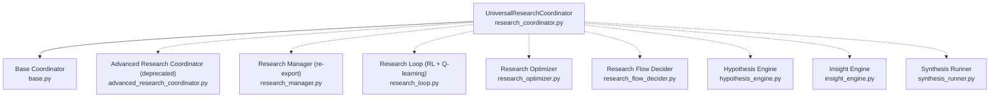

**Diagram sources**
- [research_coordinator.py:172-758](file://coordinators/research_coordinator.py#L172-L758)
- [base.py:88-553](file://coordinators/base.py#L88-L553)
- [advanced_research_coordinator.py:1-104](file://coordinators/advanced_research_coordinator.py#L1-L104)
- [research_manager.py:1-29](file://orchestrator/research_manager.py#L1-L29)
- [research_loop.py:212-781](file://loops/research_loop.py#L212-L781)
- [research_optimizer.py:77-464](file://coordinators/research_optimizer.py#L77-L464)
- [research_flow_decider.py:67-280](file://brain/research_flow_decider.py#L67-L280)
- [hypothesis_engine.py:157-475](file://brain/hypothesis_engine.py#L157-L475)
- [insight_engine.py:157-800](file://brain/insight_engine.py#L157-L800)
- [synthesis_runner.py:295-703](file://brain/synthesis_runner.py#L295-L703)

**Section sources**
- [research_coordinator.py:1-1374](file://coordinators/research_coordinator.py#L1-L1374)
- [base.py:1-553](file://coordinators/base.py#L1-L553)
- [advanced_research_coordinator.py:1-104](file://coordinators/advanced_research_coordinator.py#L1-L104)
- [research_manager.py:1-29](file://orchestrator/research_manager.py#L1-L29)
- [research_loop.py:1-781](file://loops/research_loop.py#L1-L781)
- [research_optimizer.py:1-464](file://coordinators/research_optimizer.py#L1-L464)
- [research_flow_decider.py:1-280](file://brain/research_flow_decider.py#L1-L280)
- [hypothesis_engine.py:1-4434](file://brain/hypothesis_engine.py#L1-L4434)
- [insight_engine.py:1-1000](file://brain/insight_engine.py#L1-L1000)
- [synthesis_runner.py:1-1402](file://brain/synthesis_runner.py#L1-L1402)

## Core Components
- UniversalResearchCoordinator: Routes research decisions to Unified AI, Evidence, or RAG backends; supports multi-source synthesis, confidence-based routing, and deep research features (citation graphs, meta-patterns, theories, hierarchical plans).
- Base Coordinator: Provides operation lifecycle, load factor calculation, memory-aware scheduling, graceful degradation, and metrics.
- Research Optimizer: Adds caching, deduplication, adaptive timeouts, and parallel execution strategies to research operations.
- Research Loop: Autonomous RL-driven research with Q-learning, state/action planning, and reward-based optimization.
- Research Flow Decider: Decision-making engine for research actions (rule-based, LLM-based, hybrid).
- Hypothesis Engine: Automated hypothesis generation, testing, falsification, and adversarial verification.
- Insight Engine: Pattern recognition, anomaly detection, contradiction identification, and multi-level synthesis.
- Synthesis Runner: Structured synthesis into OSINT/STIX reports with multiple generation engines and safety guards.

**Section sources**
- [research_coordinator.py:172-758](file://coordinators/research_coordinator.py#L172-L758)
- [base.py:88-553](file://coordinators/base.py#L88-L553)
- [research_optimizer.py:77-464](file://coordinators/research_optimizer.py#L77-L464)
- [research_loop.py:212-781](file://loops/research_loop.py#L212-L781)
- [research_flow_decider.py:67-280](file://brain/research_flow_decider.py#L67-L280)
- [hypothesis_engine.py:157-475](file://brain/hypothesis_engine.py#L157-L475)
- [insight_engine.py:157-800](file://brain/insight_engine.py#L157-L800)
- [synthesis_runner.py:295-703](file://brain/synthesis_runner.py#L295-L703)

## Architecture Overview
The Research Coordinator integrates three research backends behind a unified routing and synthesis layer. It preserves research context, applies confidence thresholds, and supports fallback chains. It also exposes deep research features (citation graphs, meta-patterns, theories, hierarchical plans) and integrates with discovery and synthesis systems.

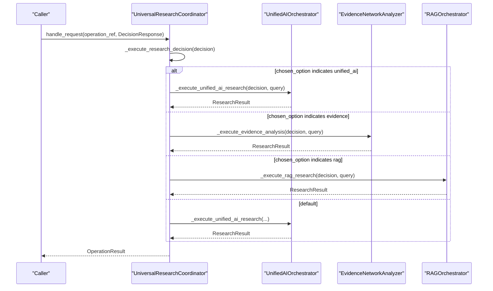

**Diagram sources**
- [research_coordinator.py:404-546](file://coordinators/research_coordinator.py#L404-L546)

**Section sources**
- [research_coordinator.py:172-758](file://coordinators/research_coordinator.py#L172-L758)

## Detailed Component Analysis

### UniversalResearchCoordinator
- Responsibilities:
  - Route research decisions to Unified AI, Evidence, or RAG backends.
  - Fallback chain: tries primary backend first, then alternatives.
  - Multi-source synthesis: executes on all available backends and synthesizes results by confidence-weighted aggregation.
  - Research context preservation and retrieval.
  - Deep research features: citation graph building, meta-pattern detection, theory generation, hierarchical planning.
  - Hermes3 integration for academic search (MSQES).
- Key data structures:
  - ResearchContext, ResearchResult, ExcavationConfig, ResearchPaper, ResearchThread, MetaPattern, ResearchTheory, HierarchicalPlan.
- Configuration:
  - ResearchDepth (STANDARD vs DEEP).
  - ExcavationConfig: depth limits, breadth limits, relevance thresholds, strategy (breadth-first, depth-first, relevance, hybrid), citation graph building, tangent exploration, auto-summarization, progress callback.

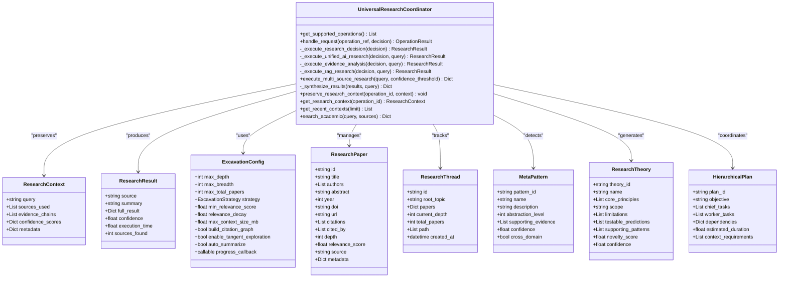

**Diagram sources**
- [research_coordinator.py:59-170](file://coordinators/research_coordinator.py#L59-L170)
- [research_coordinator.py:172-758](file://coordinators/research_coordinator.py#L172-L758)

**Section sources**
- [research_coordinator.py:172-758](file://coordinators/research_coordinator.py#L172-L758)

### Base Coordinator
- Responsibilities:
  - Operation lifecycle: track/untrack operations, generate IDs, maintain history.
  - Load factor calculation considering concurrency and memory pressure.
  - Memory pressure awareness with configurable thresholds.
  - Metrics recording and reporting.
  - Graceful initialization and cleanup.
- Integration:
  - Used by UniversalResearchCoordinator to inherit operation management and scheduling.

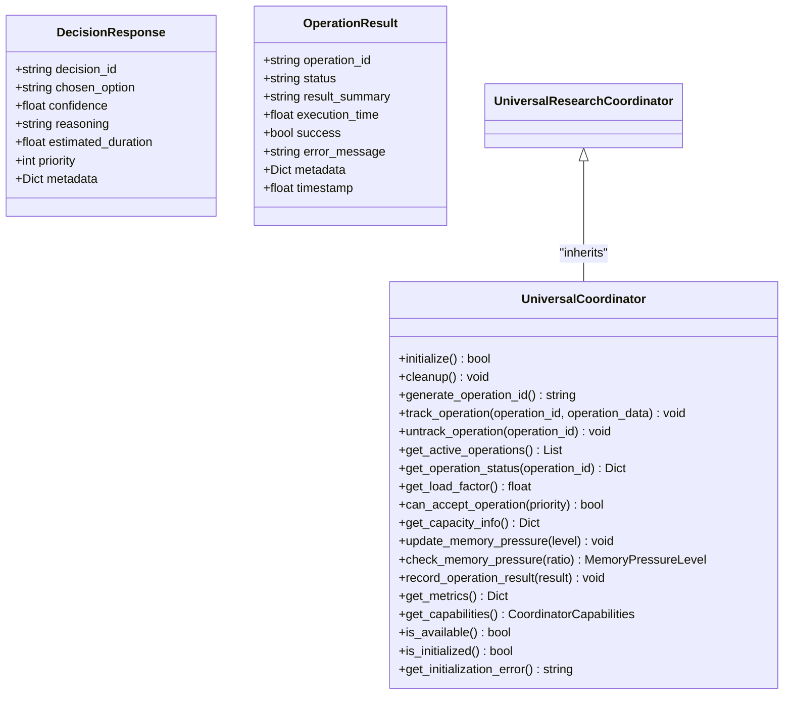

**Diagram sources**
- [base.py:88-553](file://coordinators/base.py#L88-L553)

**Section sources**
- [base.py:88-553](file://coordinators/base.py#L88-L553)

### Research Optimizer
- Responsibilities:
  - Query normalization and hashing for deduplication.
  - In-flight request deduplication to avoid redundant work.
  - Adaptive timeout calculation based on historical performance.
  - Caching with TTL and eviction policies.
  - Concurrency limiting via semaphore.
  - Batch execution with deduplication within batches.
  - Statistics and metrics collection.
- Strategies:
  - OptimizationStrategy: aggressive, balanced, conservative, adaptive.
  - CachePolicy: no_cache, memory_only, persistent.

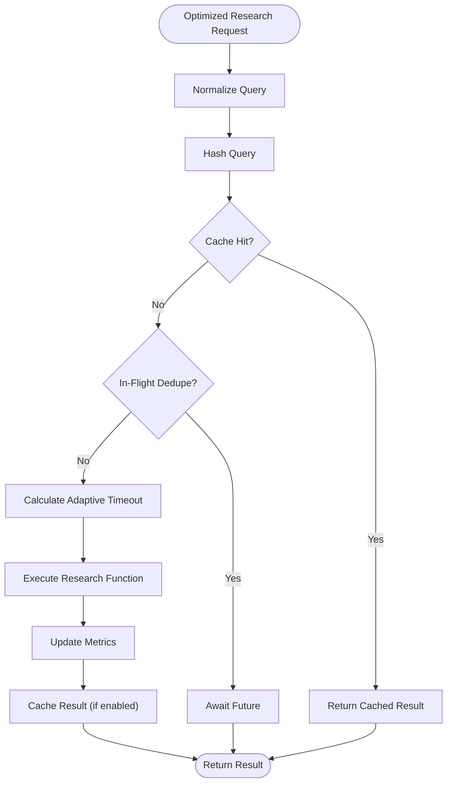

**Diagram sources**
- [research_optimizer.py:114-271](file://coordinators/research_optimizer.py#L114-L271)

**Section sources**
- [research_optimizer.py:77-464](file://coordinators/research_optimizer.py#L77-L464)

### Research Loop (RL Planning)
- Responsibilities:
  - Autonomous research with Q-learning to select actions (hypothesis generation, ToT reasoning, discovery, fetch, graph update, evaluate, done).
  - State representation and discretization for Q-table.
  - Reward computation based on findings and ToT usage.
  - Q-table persistence to LMDB via memory manager.
- Actions:
  - hypothesis_generation, tot_reasoning, discovery, fetch, graph_update, evaluate, done.

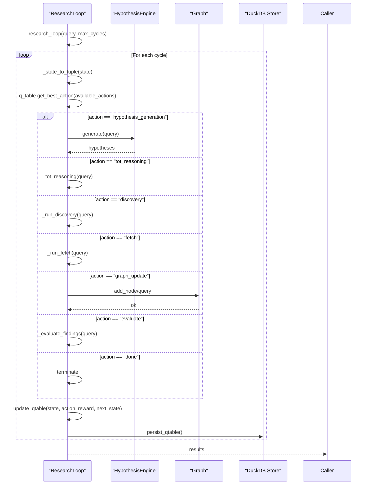

**Diagram sources**
- [research_loop.py:333-450](file://loops/research_loop.py#L333-L450)
- [research_loop.py:451-508](file://loops/research_loop.py#L451-L508)

**Section sources**
- [research_loop.py:212-781](file://loops/research_loop.py#L212-L781)

### Research Flow Decider
- Responsibilities:
  - Decision-making engine for research actions.
  - Rule-based decisions with conditions (first step search, archive fallback, fact-check claims, deep research for complex queries, synthesis near completion).
  - LLM-based decisions via Hermes3Engine with fallback to rules.
  - Hybrid strategy: apply rules first, then LLM for edge cases.
  - Continue/terminate decisions based on step limits, data volume, and stagnation.

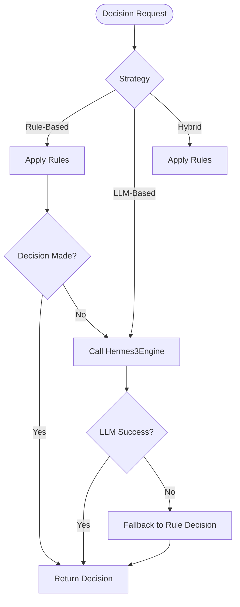

**Diagram sources**
- [research_flow_decider.py:140-280](file://brain/research_flow_decider.py#L140-L280)

**Section sources**
- [research_flow_decider.py:67-280](file://brain/research_flow_decider.py#L67-L280)

### Hypothesis Engine
- Responsibilities:
  - Automated hypothesis generation via abductive reasoning.
  - Test design and execution with multiple test types.
  - Falsification attempts and adversarial verification.
  - Evidence gathering automation and confidence updates via Bayesian updating.
  - Multi-hypothesis tracking and merging.
- Adversarial Verification:
  - Source credibility assessment with bias detection.
  - Contradiction detection and temporal consistency checks.
  - Cross-reference databases and devil’s advocate scoring.

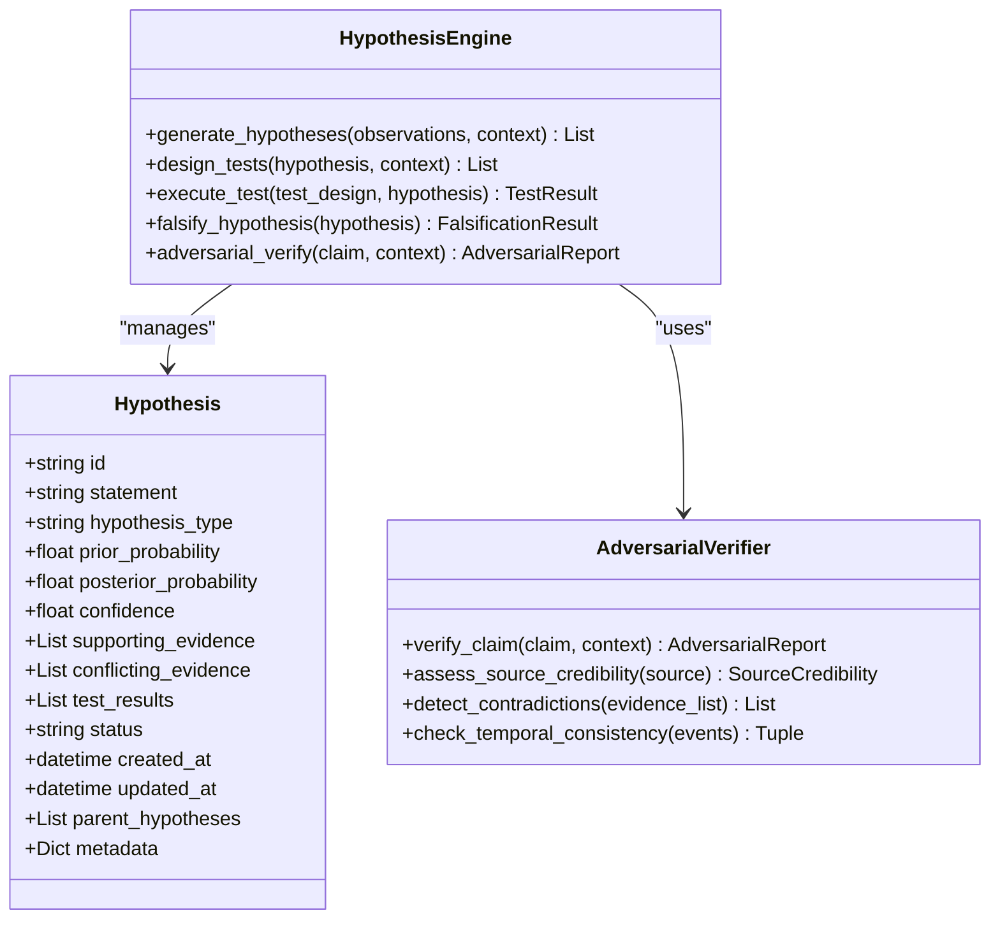

**Diagram sources**
- [hypothesis_engine.py:157-475](file://brain/hypothesis_engine.py#L157-L475)
- [hypothesis_engine.py:405-603](file://brain/hypothesis_engine.py#L405-L603)

**Section sources**
- [hypothesis_engine.py:157-475](file://brain/hypothesis_engine.py#L157-L475)
- [hypothesis_engine.py:405-603](file://brain/hypothesis_engine.py#L405-L603)

### Insight Engine
- Responsibilities:
  - Pattern recognition, anomaly detection, contradiction identification, and gap analysis.
  - Hypothesis generation and serendipity engineering.
  - Causal modeling and multi-level synthesis.
  - Ranking and scoring of insights by composite metrics.

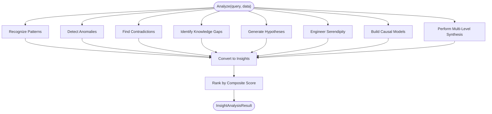

**Diagram sources**
- [insight_engine.py:181-251](file://brain/insight_engine.py#L181-L251)

**Section sources**
- [insight_engine.py:157-800](file://brain/insight_engine.py#L157-L800)

### Synthesis Runner
- Responsibilities:
  - Structured synthesis into OSINT/STIX reports with multiple engines (xgrammar, streaming, constrained).
  - Safety guards: lifecycle gates (WINDUP), UMA RSS thresholds, model availability.
  - Context injection: episode context, RAG retrieval, GraphRAG connections.
  - Confidence computation and structured outcomes for traceability.

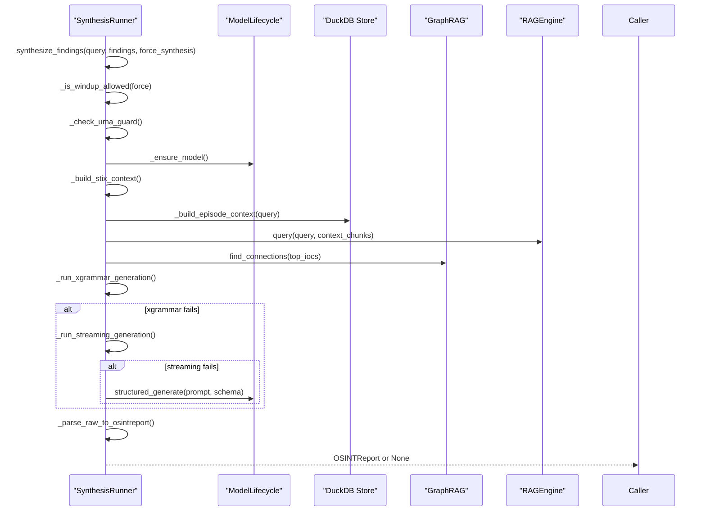

**Diagram sources**
- [synthesis_runner.py:425-703](file://brain/synthesis_runner.py#L425-L703)

**Section sources**
- [synthesis_runner.py:295-703](file://brain/synthesis_runner.py#L295-L703)

## Dependency Analysis
- Internal dependencies:
  - UniversalResearchCoordinator depends on Base Coordinator for lifecycle and scheduling.
  - Research Loop and Research Flow Decider coordinate autonomous planning and decision-making.
  - Research Optimizer enhances performance of research operations.
  - Synthesis Runner integrates with discovery and knowledge layers for context and structured generation.
- External integrations:
  - Unified AI Orchestrator, Evidence Network Analyzer, RAG Orchestrator (lazy-loaded).
  - MSQES for academic search.
  - Hermes3Engine for LLM-based decisions.
  - RAGEngine and GraphRAG for contextual retrieval.
  - ModelLifecycle for structured generation and model management.

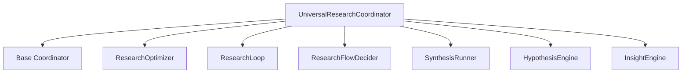

**Diagram sources**
- [research_coordinator.py:172-758](file://coordinators/research_coordinator.py#L172-L758)
- [base.py:88-553](file://coordinators/base.py#L88-L553)
- [research_optimizer.py:77-464](file://coordinators/research_optimizer.py#L77-L464)
- [research_loop.py:212-781](file://loops/research_loop.py#L212-L781)
- [research_flow_decider.py:67-280](file://brain/research_flow_decider.py#L67-L280)
- [synthesis_runner.py:295-703](file://brain/synthesis_runner.py#L295-L703)
- [hypothesis_engine.py:157-475](file://brain/hypothesis_engine.py#L157-L475)
- [insight_engine.py:157-800](file://brain/insight_engine.py#L157-L800)

**Section sources**
- [research_coordinator.py:172-758](file://coordinators/research_coordinator.py#L172-L758)
- [base.py:88-553](file://coordinators/base.py#L88-L553)
- [research_optimizer.py:77-464](file://coordinators/research_optimizer.py#L77-L464)
- [research_loop.py:212-781](file://loops/research_loop.py#L212-L781)
- [research_flow_decider.py:67-280](file://brain/research_flow_decider.py#L67-L280)
- [synthesis_runner.py:295-703](file://brain/synthesis_runner.py#L295-L703)
- [hypothesis_engine.py:157-475](file://brain/hypothesis_engine.py#L157-L475)
- [insight_engine.py:157-800](file://brain/insight_engine.py#L157-L800)

## Performance Considerations
- Concurrency control:
  - Base Coordinator enforces max_concurrent operations and adjusts for memory pressure.
  - Research Optimizer limits concurrent requests and deduplicates in-flight queries.
- Adaptive timeouts:
  - Research Optimizer calculates timeouts based on historical query performance.
- Memory management:
  - Base Coordinator tracks memory pressure and adjusts load factor accordingly.
  - Synthesis Runner includes UMA RSS guards and structured cleanup.
- Bounded storage:
  - Research Coordinator maintains bounded paper and citation link sets with FIFO eviction.
- Asynchronous execution:
  - Research Loop and Synthesis Runner leverage async I/O and streaming generation.

[No sources needed since this section provides general guidance]

## Troubleshooting Guide
- Initialization failures:
  - Base Coordinator logs initialization errors and continues with partial availability.
- Backend unavailability:
  - Research Coordinator falls back across backends and records last error in multi-source synthesis.
- Memory pressure:
  - Base Coordinator updates memory pressure levels and increases effective load thresholds accordingly.
- Timeout handling:
  - Research Optimizer raises timeouts when adaptive limits are exceeded; check query metrics and adjust strategy.
- Synthesis guardrails:
  - Synthesis Runner skips synthesis outside WINDUP phase or under high RSS; inspect lifecycle gate and UMA status.

**Section sources**
- [base.py:180-227](file://coordinators/base.py#L180-L227)
- [research_coordinator.py:267-331](file://coordinators/research_coordinator.py#L267-L331)
- [research_optimizer.py:174-225](file://coordinators/research_optimizer.py#L174-L225)
- [synthesis_runner.py:441-502](file://brain/synthesis_runner.py#L441-L502)

## Conclusion
The Research Coordinator provides a robust, multi-backend research orchestration system with confidence-aware routing, multi-source synthesis, and deep research features. It integrates seamlessly with discovery, hypothesis generation, insight synthesis, and structured report generation. Through optimization, RL planning, and quality safeguards, it supports scalable and reliable research workflows across diverse domains.

[No sources needed since this section summarizes without analyzing specific files]

## Appendices

### Configuration Options
- Research Depth:
  - STANDARD: basic multi-source research
  - DEEP: advanced excavation with meta-synthesis
- ExcavationConfig:
  - max_depth, max_breadth, max_total_papers, strategy, min_relevance_score, relevance_decay, max_context_size_mb, build_citation_graph, enable_tangent_exploration, auto_summarize, progress_callback
- OptimizationConfig (Research Optimizer):
  - strategy (aggressive/balanced/conservative/adaptive), cache_policy (no_cache/memory_only/persistent), max_concurrent_requests, default_timeout, adaptive_timeout, query_deduplication, result_batching, batch_size, memory_limit_mb
- Research Loop:
  - Q-table learning parameters (alpha, gamma), state discretization buckets, action set, LMDB persistence key

**Section sources**
- [research_coordinator.py:45-94](file://coordinators/research_coordinator.py#L45-L94)
- [research_optimizer.py:44-55](file://coordinators/research_optimizer.py#L44-L55)
- [research_loop.py:93-210](file://loops/research_loop.py#L93-L210)

### Examples of Workflow Orchestration
- Confidence-based routing:
  - DecisionResponse.chosen_option determines primary backend; fallback chain ensures resilience.
- Multi-source synthesis:
  - Executes on all available backends concurrently and synthesizes results by confidence-weighted aggregation.
- Research-aware scheduling:
  - Base Coordinator’s load factor and memory pressure inform acceptance of new operations.
- Evidence collection coordination:
  - Research Loop selects actions (discovery, fetch, graph update) guided by Q-learning and rewards.
- Research quality assurance:
  - Synthesis Runner enforces lifecycle gates and UMA RSS guards; Research Optimizer caches and deduplicates queries.

**Section sources**
- [research_coordinator.py:404-688](file://coordinators/research_coordinator.py#L404-L688)
- [base.py:308-377](file://coordinators/base.py#L308-L377)
- [research_loop.py:333-450](file://loops/research_loop.py#L333-L450)
- [synthesis_runner.py:425-703](file://brain/synthesis_runner.py#L425-L703)
- [research_optimizer.py:114-271](file://coordinators/research_optimizer.py#L114-L271)