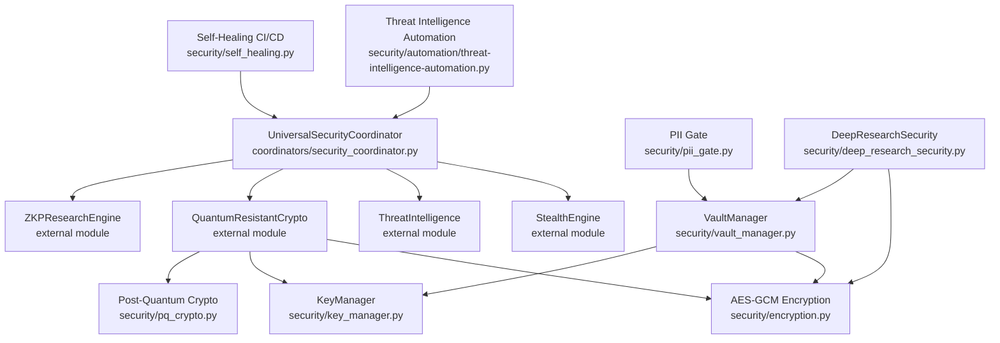
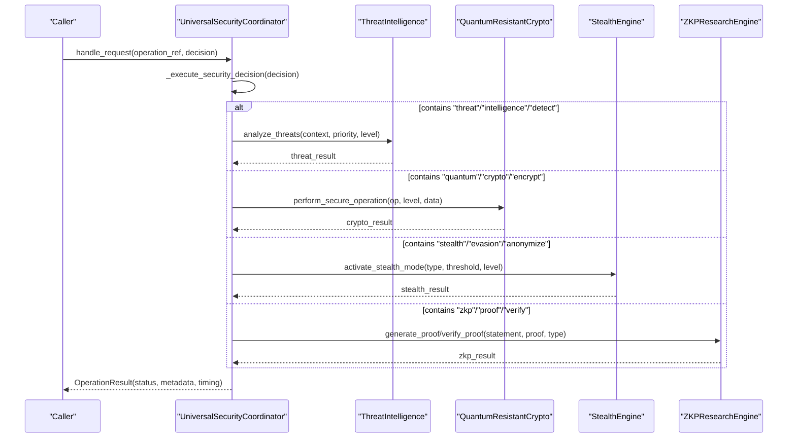
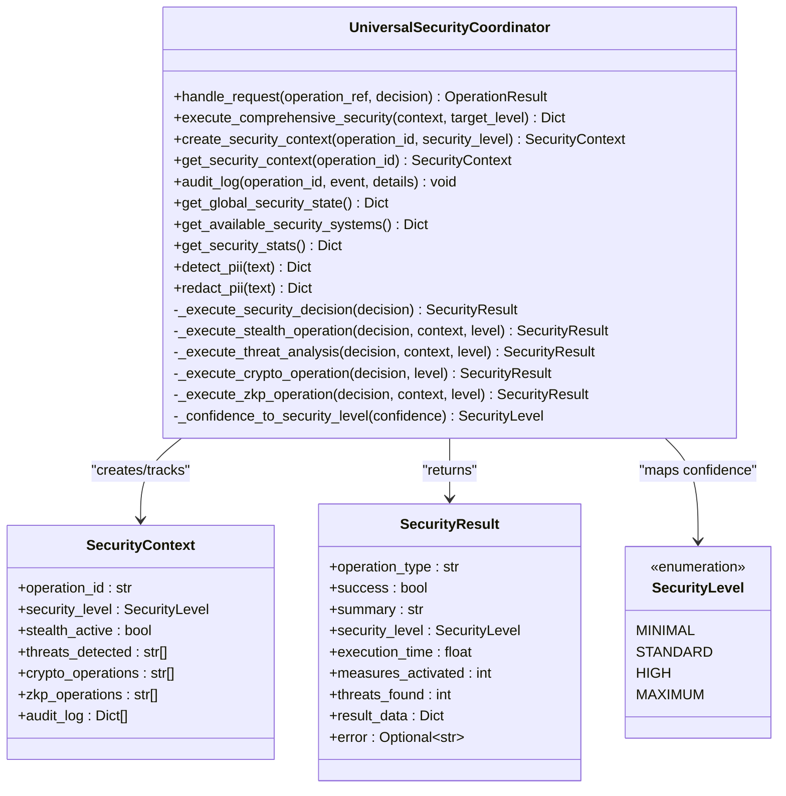
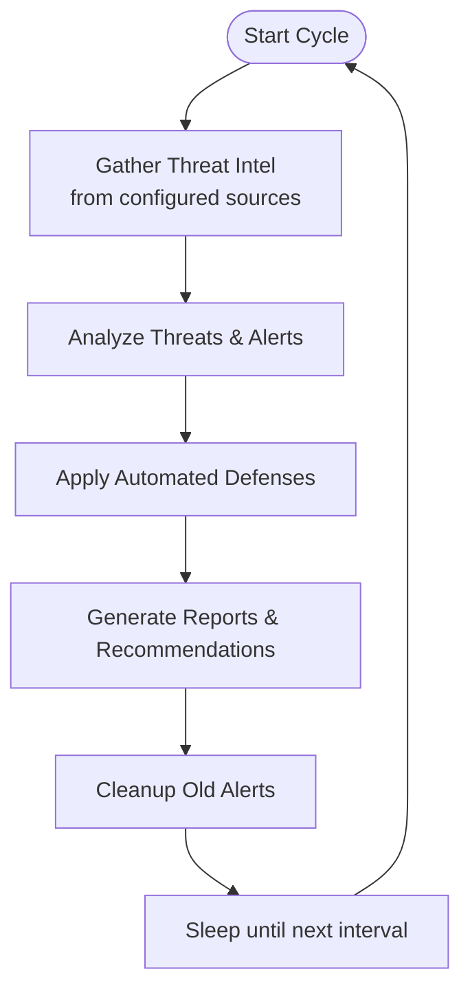
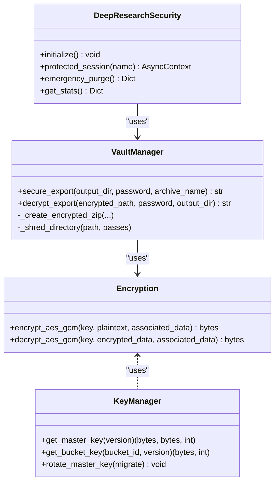
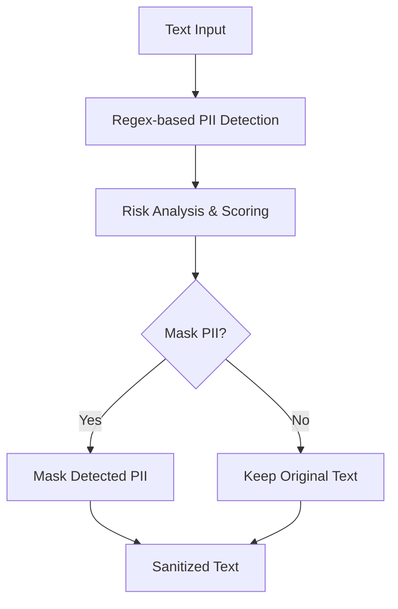
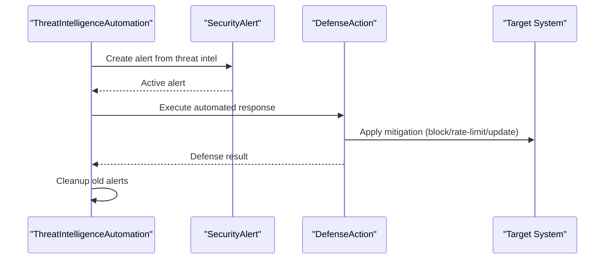
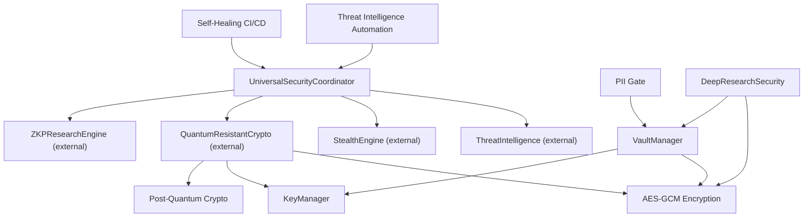

# Security Coordinator

<cite>
**Referenced Files in This Document**
- [security_coordinator.py](file://coordinators/security_coordinator.py)
- [__init__.py](file://security/__init__.py)
- [encryption.py](file://security/encryption.py)
- [key_manager.py](file://security/key_manager.py)
- [pq_crypto.py](file://security/pq_crypto.py)
- [vault_manager.py](file://security/vault_manager.py)
- [pii_gate.py](file://security/pii_gate.py)
- [deep_research_security.py](file://security/deep_research_security.py)
- [threat-intelligence-automation.py](file://security/automation/threat-intelligence-automation.py)
- [self_healing.py](file://security/self_healing.py)
- [security_manager.py](file://orchestrator/security_manager.py)
</cite>

## Table of Contents
1. [Introduction](#introduction)
2. [Project Structure](#project-structure)
3. [Core Components](#core-components)
4. [Architecture Overview](#architecture-overview)
5. [Detailed Component Analysis](#detailed-component-analysis)
6. [Dependency Analysis](#dependency-analysis)
7. [Performance Considerations](#performance-considerations)
8. [Troubleshooting Guide](#troubleshooting-guide)
9. [Conclusion](#conclusion)
10. [Appendices](#appendices)

## Introduction
This document describes the Security Coordinator, a unified orchestration layer that manages security policies, threat detection, and operational security across the system. It integrates stealth operations, threat intelligence analysis, quantum-safe cryptography, and zero-knowledge proofs into a cohesive security framework. The coordinator supports security-aware operation scheduling, encrypted communications coordination, privacy-preserving data handling, and automated incident response workflows. It also exposes configuration options for security policies, threat models, and compliance requirements, enabling both manual and automated security orchestration.

## Project Structure
The Security Coordinator resides in the universal coordinators layer and coordinates with specialized security modules under the security package. It interacts with external systems for threat intelligence and supports self-healing CI/CD processes.

**Diagram sources**
- [security_coordinator.py:73-128](file://coordinators/security_coordinator.py#L73-L128)
- [encryption.py:1-23](file://security/encryption.py#L1-L23)
- [key_manager.py:53-175](file://security/key_manager.py#L53-L175)
- [pq_crypto.py:1-263](file://security/pq_crypto.py#L1-L263)
- [vault_manager.py:1-368](file://security/vault_manager.py#L1-L368)
- [pii_gate.py:75-556](file://security/pii_gate.py#L75-L556)
- [deep_research_security.py:64-511](file://security/deep_research_security.py#L64-L511)
- [threat-intelligence-automation.py:70-770](file://security/automation/threat-intelligence-automation.py#L70-L770)
- [self_healing.py:176-800](file://security/self_healing.py#L176-L800)

**Section sources**
- [security_coordinator.py:1-128](file://coordinators/security_coordinator.py#L1-L128)
- [__init__.py:1-160](file://security/__init__.py#L1-L160)

## Core Components
- UniversalSecurityCoordinator: Central orchestrator that routes security decisions to appropriate subsystems, tracks security contexts, and aggregates global security state.
- Security subsystems: StealthEngine, ThreatIntelligence, QuantumResistantCrypto, ZKPResearchEngine (lazy-initialized and routed based on decision content).
- Security utilities: AES-GCM encryption, KeyManager, Post-Quantum cryptography, VaultManager, PII Gate, DeepResearchSecurity.
- Automation: Threat Intelligence Automation and Self-Healing CI/CD for continuous monitoring and remediation.
- Security Manager facade: Thin re-export module for backward compatibility.

Key responsibilities:
- Security orchestration and routing
- Multi-layer security operations (stealth, threat, crypto, ZKP)
- Security context preservation and audit logging
- Global threat monitoring and state reporting
- Privacy-preserving PII handling
- Encrypted export and secure destruction
- Automated threat response and CI/CD self-healing

**Section sources**
- [security_coordinator.py:73-128](file://coordinators/security_coordinator.py#L73-L128)
- [__init__.py:8-160](file://security/__init__.py#L8-L160)
- [threat-intelligence-automation.py:70-118](file://security/automation/threat-intelligence-automation.py#L70-L118)
- [self_healing.py:176-254](file://security/self_healing.py#L176-L254)

## Architecture Overview
The Security Coordinator implements a layered security architecture with four integrated backends. It accepts security decisions, maps confidence to security levels, and routes operations to the appropriate subsystem. It maintains global security state, tracks active contexts, and provides comprehensive reporting and auditing.

**Diagram sources**
- [security_coordinator.py:231-289](file://coordinators/security_coordinator.py#L231-L289)
- [security_coordinator.py:295-342](file://coordinators/security_coordinator.py#L295-L342)
- [security_coordinator.py:387-420](file://coordinators/security_coordinator.py#L387-L420)
- [security_coordinator.py:422-450](file://coordinators/security_coordinator.py#L422-L450)
- [security_coordinator.py:354-385](file://coordinators/security_coordinator.py#L354-L385)
- [security_coordinator.py:452-491](file://coordinators/security_coordinator.py#L452-L491)

## Detailed Component Analysis

### UniversalSecurityCoordinator
- Responsibilities:
  - Initialize and manage security subsystems with graceful degradation
  - Route security decisions to appropriate engines based on keywords in chosen option
  - Map confidence scores to security levels (1-4)
  - Execute comprehensive multi-layer security operations
  - Maintain security contexts and audit logs
  - Expose global security state and statistics
- Security levels:
  - Level 1: Stealth only
  - Level 2: Stealth + Threat detection
  - Level 3: Stealth + Threat + Quantum crypto
  - Level 4: All layers + ZKP
- Key methods:
  - handle_request: orchestrates decision execution and returns OperationResult
  - _execute_security_decision: routing and execution
  - execute_comprehensive_security: multi-layer orchestration
  - create/get/audit security context
  - get_global_security_state, get_available_security_systems, get_security_stats

**Diagram sources**
- [security_coordinator.py:73-128](file://coordinators/security_coordinator.py#L73-L128)
- [security_coordinator.py:47-71](file://coordinators/security_coordinator.py#L47-L71)
- [security_coordinator.py:39-44](file://coordinators/security_coordinator.py#L39-L44)

**Section sources**
- [security_coordinator.py:73-128](file://coordinators/security_coordinator.py#L73-L128)
- [security_coordinator.py:227-289](file://coordinators/security_coordinator.py#L227-L289)
- [security_coordinator.py:497-614](file://coordinators/security_coordinator.py#L497-L614)

### Threat Intelligence Integration and Automation
- ThreatIntelligenceAutomation continuously gathers intelligence from multiple sources, analyzes threats, generates alerts, and applies automated defenses.
- Supports IOC indicators, malware domains, vulnerability feeds, and behavioral anomaly detection.
- Provides reporting and recommendations for security posture improvement.

**Diagram sources**
- [threat-intelligence-automation.py:157-171](file://security/automation/threat-intelligence-automation.py#L157-L171)
- [threat-intelligence-automation.py:325-331](file://security/automation/threat-intelligence-automation.py#L325-L331)
- [threat-intelligence-automation.py:513-529](file://security/automation/threat-intelligence-automation.py#L513-L529)

**Section sources**
- [threat-intelligence-automation.py:70-118](file://security/automation/threat-intelligence-automation.py#L70-L118)
- [threat-intelligence-automation.py:173-297](file://security/automation/threat-intelligence-automation.py#L173-L297)
- [threat-intelligence-automation.py:325-530](file://security/automation/threat-intelligence-automation.py#L325-L530)
- [threat-intelligence-automation.py:644-733](file://security/automation/threat-intelligence-automation.py#L644-L733)

### Encrypted Communication Coordination and Vault Management
- AES-GCM encryption/decryption for symmetric confidentiality and integrity.
- KeyManager handles master key rotation, bucket key derivation, and secure storage in LMDB.
- VaultManager provides encrypted export of sensitive data with secure deletion.
- DeepResearchSecurity adds quantum-safe vaults, stealth communication, obfuscation, secure destruction, and audit logging for ultra-sensitive operations.

**Diagram sources**
- [encryption.py:6-22](file://security/encryption.py#L6-L22)
- [key_manager.py:127-175](file://security/key_manager.py#L127-L175)
- [vault_manager.py:212-253](file://security/vault_manager.py#L212-L253)
- [deep_research_security.py:148-179](file://security/deep_research_security.py#L148-L179)

**Section sources**
- [encryption.py:1-23](file://security/encryption.py#L1-L23)
- [key_manager.py:53-175](file://security/key_manager.py#L53-L175)
- [vault_manager.py:1-368](file://security/vault_manager.py#L1-L368)
- [deep_research_security.py:64-273](file://security/deep_research_security.py#L64-L273)

### Privacy-Preserving Data Handling and PII Protection
- SecurityGate performs regex-based PII detection and sanitization with optional masking.
- Provides risk analysis and always-on fallback sanitizer for fail-safe operation.
- Redaction and detection APIs integrate with the Security Coordinator for privacy-aware workflows.

**Diagram sources**
- [pii_gate.py:150-214](file://security/pii_gate.py#L150-L214)
- [pii_gate.py:275-311](file://security/pii_gate.py#L275-L311)

**Section sources**
- [pii_gate.py:75-324](file://security/pii_gate.py#L75-L324)
- [security_coordinator.py:730-794](file://coordinators/security_coordinator.py#L730-L794)

### Security Incident Response Procedures
- Threat Intelligence Automation generates SecurityAlerts and applies automated defense actions (block, rate-limit, update rules, enhance monitoring).
- Self-Healing CI/CD monitors pipeline health, identifies issues, and executes healing actions with circuit breakers and rollback support.

**Diagram sources**
- [threat-intelligence-automation.py:455-482](file://security/automation/threat-intelligence-automation.py#L455-L482)
- [threat-intelligence-automation.py:531-555](file://security/automation/threat-intelligence-automation.py#L531-L555)
- [threat-intelligence-automation.py:628-642](file://security/automation/threat-intelligence-automation.py#L628-L642)

**Section sources**
- [threat-intelligence-automation.py:513-555](file://security/automation/threat-intelligence-automation.py#L513-L555)
- [self_healing.py:461-493](file://security/self_healing.py#L461-L493)
- [self_healing.py:761-800](file://security/self_healing.py#L761-L800)

### Security-Aware Operation Scheduling
- The coordinator preserves security context across operations and tracks metrics for stealth activations, threat analyses, crypto operations, and ZKP operations.
- Provides global security state for monitoring and decision-making.

**Section sources**
- [security_coordinator.py:619-679](file://coordinators/security_coordinator.py#L619-L679)

## Dependency Analysis
The Security Coordinator depends on external security subsystems and internal utilities. Dependencies are managed through lazy initialization and graceful degradation.

**Diagram sources**
- [security_coordinator.py:103-117](file://coordinators/security_coordinator.py#L103-L117)
- [__init__.py:24-102](file://security/__init__.py#L24-L102)

**Section sources**
- [security_coordinator.py:133-193](file://coordinators/security_coordinator.py#L133-L193)
- [__init__.py:1-160](file://security/__init__.py#L1-L160)

## Performance Considerations
- Lazy initialization reduces startup overhead; subsystems are loaded only when available.
- Security level mapping scales confidence to required protection tiers.
- Asynchronous execution minimizes blocking during threat analysis and cryptographic operations.
- Vault operations use streaming ZIP creation and secure deletion to reduce memory footprint.
- Self-healing uses circuit breakers to prevent cascading failures and limits concurrent healing actions.

[No sources needed since this section provides general guidance]

## Troubleshooting Guide
Common issues and resolutions:
- Subsystem initialization failures: The coordinator logs warnings and continues with available subsystems. Check external dependencies and environment configuration.
- PII detection/redaction errors: Verify input types and fallback sanitizer availability. The system logs errors and returns structured results.
- Vault export failures: Ensure cryptography/pyzipper dependencies are installed and writable output directories exist.
- Threat intelligence automation errors: Confirm API keys and network connectivity; the system retries with exponential backoff and logs errors.
- Self-healing timeouts: Increase timeouts or adjust component thresholds; circuit breakers prevent overload.

**Section sources**
- [security_coordinator.py:133-193](file://coordinators/security_coordinator.py#L133-L193)
- [pii_gate.py:206-214](file://security/pii_gate.py#L206-L214)
- [vault_manager.py:67-73](file://security/vault_manager.py#L67-L73)
- [threat-intelligence-automation.py:169-171](file://security/automation/threat-intelligence-automation.py#L169-L171)
- [self_healing.py:490-493](file://security/self_healing.py#L490-L493)

## Conclusion
The Security Coordinator provides a robust, extensible framework for orchestrating multi-layer security operations. By integrating stealth, threat intelligence, quantum-safe cryptography, and ZKP, it enables adaptive security policies and automated incident response. Its privacy-preserving utilities, encrypted export capabilities, and self-healing mechanisms ensure resilient and compliant operations across diverse environments.

[No sources needed since this section summarizes without analyzing specific files]

## Appendices

### Configuration Options
- Security Coordinator:
  - max_concurrent: Maximum concurrent security operations
  - Memory awareness: Enables memory-aware operation tracking
- Threat Intelligence Automation:
  - threat_intelligence.enabled/sources/update_interval/retention_days/confidence_threshnew
  - automated_defense.block_suspicious_ips/rate_limit_offenders/auto_patch_vulnerabilities/isolate_compromised_systems/defense_timeout
  - monitoring.log_analysis/network_monitoring/behavior_analysis/anomaly_detection
- Self-Healing CI/CD:
  - self_healing.enabled/health_check_interval/max_concurrent_healings/healing_timeout/auto_rollback/notification_channels
  - threshnews.consecutive_failures/success_rate_threshnew/response_time_threshnew_ms/resource_usage_threshnew
  - component-specific configurations for code quality, security scan, tests, build, deployment

**Section sources**
- [security_coordinator.py:96-101](file://coordinators/security_coordinator.py#L96-L101)
- [threat-intelligence-automation.py:85-118](file://security/automation/threat-intelligence-automation.py#L85-L118)
- [self_healing.py:201-254](file://security/self_healing.py#L201-L254)

### Examples of Security Workflow Orchestration
- Multi-layer comprehensive security:
  - Execute stealth, threat analysis, quantum crypto, and ZKP in sequence based on target security level.
- Threat response automation:
  - Gather intelligence → Analyze threats → Generate alerts → Apply automated defenses → Generate reports.
- Security monitoring dashboard:
  - Integrate with monitoring dashboards to visualize security metrics and incident trends.

**Section sources**
- [security_coordinator.py:497-614](file://coordinators/security_coordinator.py#L497-L614)
- [threat-intelligence-automation.py:157-171](file://security/automation/threat-intelligence-automation.py#L157-L171)
- [threat-intelligence-automation.py:644-704](file://security/automation/threat-intelligence-automation.py#L644-L704)

### Security Policy Enforcement Mechanisms
- Confidence-to-level mapping determines required protection tier.
- Security contexts preserve operation state and audit trails.
- Automated defense actions enforce policies (blocking, rate limiting, rule updates).
- Self-healing enforces pipeline health policies with rollback and isolation.

**Section sources**
- [security_coordinator.py:344-352](file://coordinators/security_coordinator.py#L344-L352)
- [security_coordinator.py:619-656](file://coordinators/security_coordinator.py#L619-L656)
- [threat-intelligence-automation.py:531-555](file://security/automation/threat-intelligence-automation.py#L531-L555)
- [self_healing.py:761-800](file://security/self_healing.py#L761-L800)

### Integration with External Security Systems
- Threat intelligence sources: abuse.ch, VirusTotal, AlienVault, NVD CVE.
- CI/CD health checks: code quality, security scans, unit/integration/performance tests, build, health checks.
- Security Manager facade: thin re-export for backward compatibility.

**Section sources**
- [threat-intelligence-automation.py:120-147](file://security/automation/threat-intelligence-automation.py#L120-L147)
- [self_healing.py:256-351](file://security/self_healing.py#L256-L351)
- [security_manager.py:21-24](file://orchestrator/security_manager.py#L21-L24)