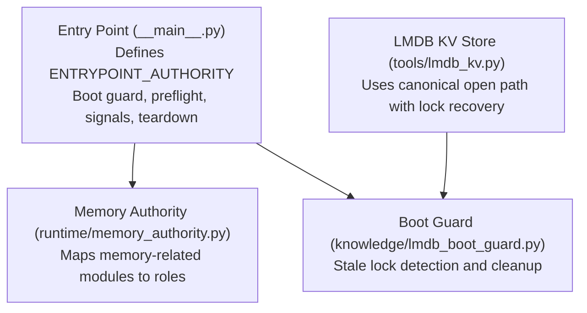
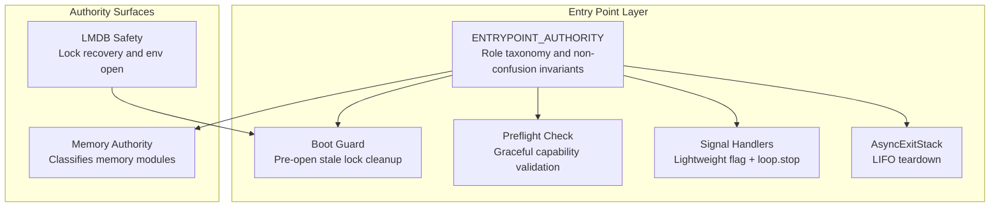
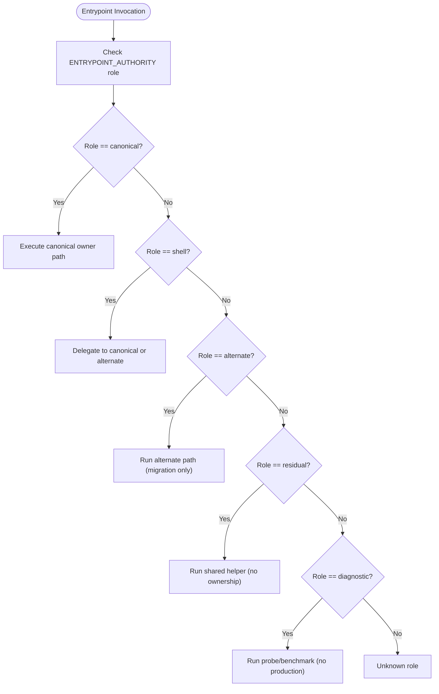
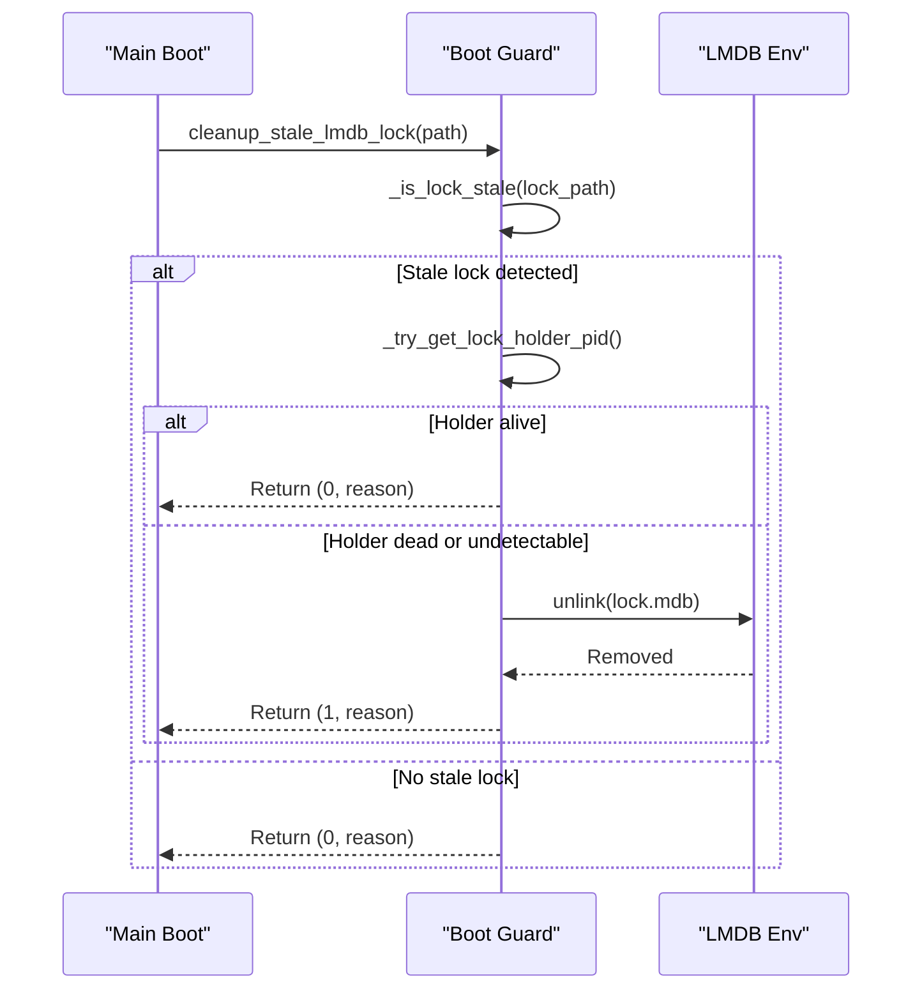
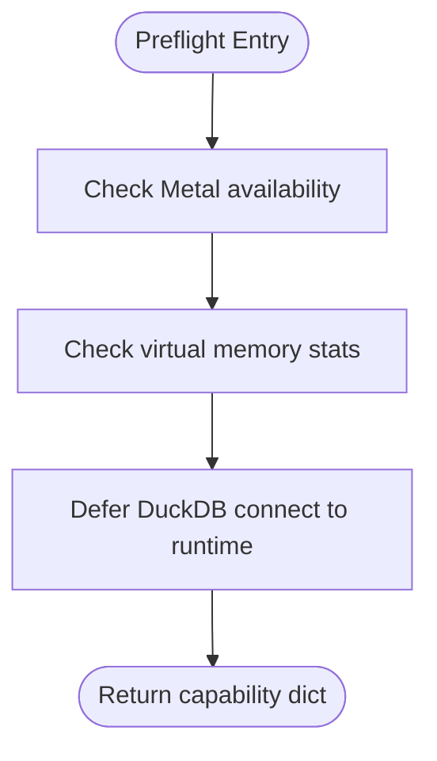
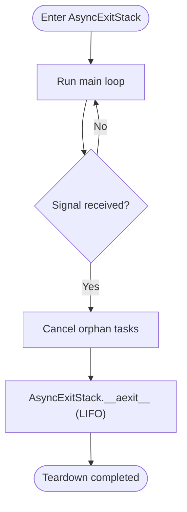
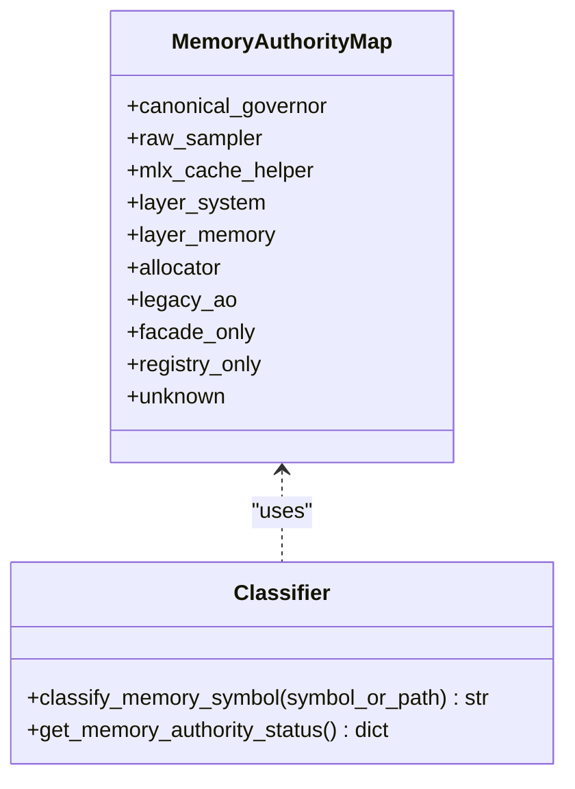
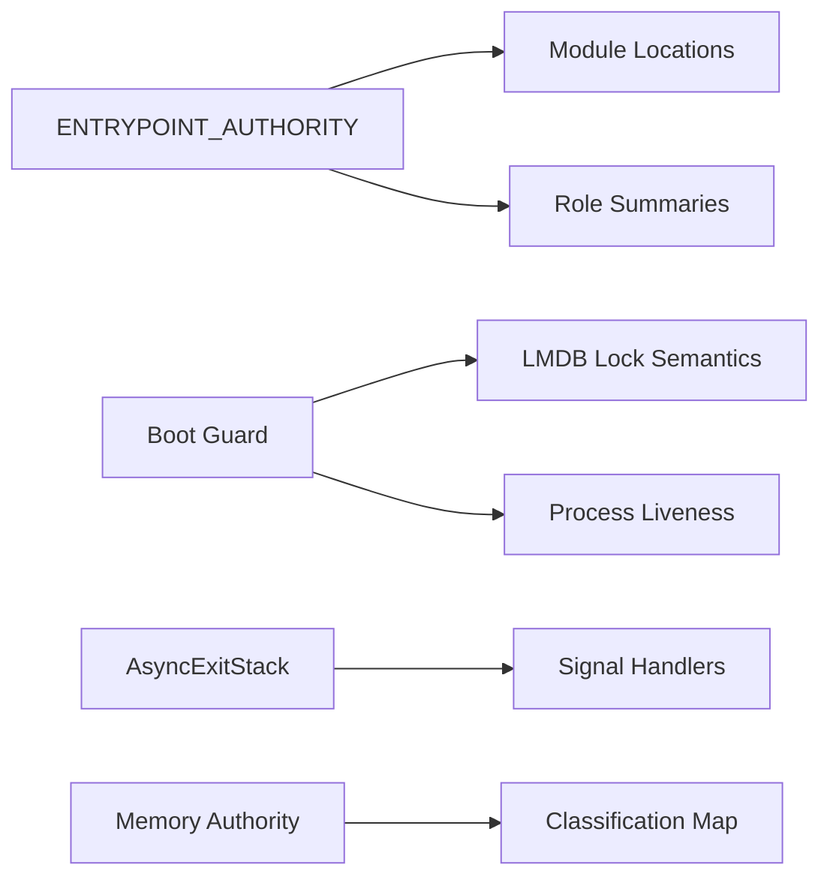

# Authority Model and Entry Points

<cite>
**Referenced Files in This Document**
- [__main__.py](file://__main__.py)
- [memory_authority.py](file://runtime/memory_authority.py)
- [lmdb_boot_guard.py](file://knowledge/lmdb_boot_guard.py)
- [lmdb_kv.py](file://tools/lmdb_kv.py)
- [test_sprint_8ai.py](file://tests/probe_8ai/test_sprint_8ai.py)
- [test_preflight_returns_dict.py](file://tests/probe_8vd/test_preflight_returns_dict.py)
- [test_sprint_8bb.py](file://tests/probe_8bb/test_sprint_8bb.py)
</cite>

## Table of Contents
1. [Introduction](#introduction)
2. [Project Structure](#project-structure)
3. [Core Components](#core-components)
4. [Architecture Overview](#architecture-overview)
5. [Detailed Component Analysis](#detailed-component-analysis)
6. [Dependency Analysis](#dependency-analysis)
7. [Performance Considerations](#performance-considerations)
8. [Troubleshooting Guide](#troubleshooting-guide)
9. [Conclusion](#conclusion)

## Introduction
This document explains the Hledac Universal authority model and entry point system with a focus on:
- Canonical, shell, alternate, residual, and diagnostic roles
- The ENTRYPOINT_AUTHORITY structure and its role in maintaining system integrity
- Boot hygiene closure using AsyncExitStack for unified teardown
- Signal-safe teardown with lightweight signal handlers
- The boot guard system for LMDB safety and the preflight check mechanism
- Practical examples of proper authority usage and the differences between canonical and alternate paths
- Common pitfalls and troubleshooting guidance for boot sequence issues

## Project Structure
The authority model spans several modules:
- Entry point and role taxonomy are defined in the root entry module
- Memory authority classification resides in a dedicated runtime module
- LMDB safety and boot hygiene are implemented in knowledge and tools modules
- Teardown and signal handling are integrated into the entry module
- Tests validate the AsyncExitStack backbone, signal path, and preflight behavior



**Diagram sources**
- [__main__.py:70-183](file://__main__.py#L70-L183)
- [memory_authority.py:35-72](file://runtime/memory_authority.py#L35-L72)
- [lmdb_boot_guard.py:167-224](file://knowledge/lmdb_boot_guard.py#L167-L224)
- [lmdb_kv.py:94-111](file://tools/lmdb_kv.py#L94-L111)

**Section sources**
- [__main__.py:47-68](file://__main__.py#L47-L68)
- [__main__.py:70-183](file://__main__.py#L70-L183)
- [memory_authority.py:1-28](file://runtime/memory_authority.py#L1-L28)
- [lmdb_boot_guard.py:1-21](file://knowledge/lmdb_boot_guard.py#L1-L21)
- [lmdb_kv.py:30-46](file://tools/lmdb_kv.py#L30-L46)

## Core Components
- ENTRYPOINT_AUTHORITY: Centralized role taxonomy and single source of truth for entry point ownership. It defines canonical, shell, alternate, residual, and diagnostic roles and enforces non-confusion invariants.
- Boot guard: A synchronous LMDB safety step that checks for stale locks and cleans them before opening databases.
- Preflight check: A capability check that returns a dictionary without raising, enabling graceful degradation.
- Signal teardown: Lightweight handlers that set a flag and schedule loop.stop; actual cleanup occurs in AsyncExitStack.
- AsyncExitStack teardown: Unified teardown backbone with LIFO order for deterministic cleanup.
- Memory authority: A classification map for memory-related modules to ensure canonical governance.

**Section sources**
- [__main__.py:70-183](file://__main__.py#L70-L183)
- [__main__.py:239-263](file://__main__.py#L239-L263)
- [__main__.py:315-344](file://__main__.py#L315-L344)
- [__main__.py:400-500](file://__main__.py#L400-L500)
- [memory_authority.py:35-129](file://runtime/memory_authority.py#L35-L129)

## Architecture Overview
The authority model enforces a strict separation of concerns:
- Canonical path: The single production owner of sprints
- Shell path: CLI dispatcher that delegates to canonical or alternate
- Alternate path: Legacy production path, not canonical owner
- Residual path: Shared helper, not a sprint owner
- Diagnostic path: Probes/benchmarks only



**Diagram sources**
- [__main__.py:70-183](file://__main__.py#L70-L183)
- [__main__.py:350-389](file://__main__.py#L350-L389)
- [__main__.py:239-263](file://__main__.py#L239-L263)
- [__main__.py:315-344](file://__main__.py#L315-L344)
- [__main__.py:400-500](file://__main__.py#L400-L500)
- [memory_authority.py:35-72](file://runtime/memory_authority.py#L35-L72)
- [lmdb_boot_guard.py:167-224](file://knowledge/lmdb_boot_guard.py#L167-L224)

## Detailed Component Analysis

### ENTRYPOINT_AUTHORITY and Role Taxonomy
- Canonical: sole production sprint owner; all report truth flows from here
- Shell: CLI dispatcher; never owns sprint state
- Alternate: legacy production path; not canonical
- Residual: shared helper; not a sprint owner
- Diagnostic: probe/benchmark only; not for production

The taxonomy is enforced by:
- A centralized ENTRYPOINT_AUTHORITY structure
- Non-confusion invariants ensuring canonical paths do not claim alternate ownership
- Read-only helpers to query roles and authority status



**Diagram sources**
- [__main__.py:53-67](file://__main__.py#L53-L67)
- [__main__.py:164-183](file://__main__.py#L164-L183)

**Section sources**
- [__main__.py:53-67](file://__main__.py#L53-L67)
- [__main__.py:164-183](file://__main__.py#L164-L183)
- [__main__.py:186-204](file://__main__.py#L186-L204)

### Boot Guard System for LMDB Safety
The boot guard performs a pre-open stale lock check and cleanup:
- Strict stale-lock detection: lock is reset only when the holder is confirmed dead
- Process liveness verification via platform-specific checks
- Age threshold fallback when holder PID cannot be resolved
- Fail-safe behavior: never delete if holder cannot be reliably determined
- Idempotent operation: multiple calls produce the same result



**Diagram sources**
- [lmdb_boot_guard.py:132-165](file://knowledge/lmdb_boot_guard.py#L132-L165)
- [lmdb_boot_guard.py:81-117](file://knowledge/lmdb_boot_guard.py#L81-L117)
- [lmdb_boot_guard.py:56-79](file://knowledge/lmdb_boot_guard.py#L56-L79)

**Section sources**
- [lmdb_boot_guard.py:1-21](file://knowledge/lmdb_boot_guard.py#L1-L21)
- [lmdb_boot_guard.py:132-165](file://knowledge/lmdb_boot_guard.py#L132-L165)
- [lmdb_boot_guard.py:167-224](file://knowledge/lmdb_boot_guard.py#L167-L224)

### Preflight Check Mechanism
The preflight validates critical capabilities without raising:
- Metal availability check
- Free RAM and memory pressure metrics
- Deferred DuckDB availability until runtime initialization



**Diagram sources**
- [__main__.py:239-263](file://__main__.py#L239-L263)

**Section sources**
- [__main__.py:239-263](file://__main__.py#L239-L263)

### Signal-Safe Teardown with Lightweight Handlers
Signal handlers set a flag and schedule loop.stop; cleanup occurs in AsyncExitStack:
- Handlers are installed before the event loop is created
- They avoid heavy work in the signal context
- Loop polling checks the flag and breaks cleanly
- Actual cleanup is deferred to AsyncExitStack unwind

```mermaid
sequenceDiagram
participant App as "Application"
participant Sig as "Signal Handler"
participant Loop as "Event Loop"
participant Stack as "AsyncExitStack"
App->>Sig : Install SIGINT/SIGTERM
Sig-->>App : Installed
Note over App : Runtime loop runs
Sig->>Loop : Set flag + call_soon_threadsafe(stop)
Loop-->>App : Stop requested
App->>Stack : Enter teardown (finally)
Stack-->>App : LIFO cleanup completed
```

**Diagram sources**
- [__main__.py:315-344](file://__main__.py#L315-L344)
- [__main__.py:400-500](file://__main__.py#L400-L500)

**Section sources**
- [__main__.py:315-344](file://__main__.py#L315-L344)
- [__main__.py:400-500](file://__main__.py#L400-L500)

### AsyncExitStack-Based Teardown and Orphan Task Drain
The teardown uses AsyncExitStack as the unified backbone:
- LIFO order ensures deterministic cleanup
- Orphan tasks are cancelled before loop close
- Protected drain with timeout prevents indefinite waits
- Boot telemetry records teardown phases



**Diagram sources**
- [__main__.py:400-500](file://__main__.py#L400-L500)
- [__main__.py:502-535](file://__main__.py#L502-L535)

**Section sources**
- [__main__.py:400-500](file://__main__.py#L400-L500)
- [__main__.py:502-535](file://__main__.py#L502-L535)

### Memory Authority Classification
The memory authority map classifies memory-related modules into roles:
- Canonical governor: resource governance
- Raw sampler: UMA snapshots without policy
- MLX cache helper: diagnostics surface
- Layer system/memory: layer surface, not canonical policy owner
- Allocator/coordinator: not canonical policy owner
- Legacy/AO-only: not part of canonical path
- Facade/registry: not memory authorities



**Diagram sources**
- [memory_authority.py:35-72](file://runtime/memory_authority.py#L35-L72)
- [memory_authority.py:76-129](file://runtime/memory_authority.py#L76-L129)

**Section sources**
- [memory_authority.py:35-72](file://runtime/memory_authority.py#L35-L72)
- [memory_authority.py:76-129](file://runtime/memory_authority.py#L76-L129)

### Canonical vs Alternate Paths: Practical Examples
- Canonical path: core.__main__.run_sprint is the sole production owner; ENTRYPOINT_AUTHORITY confirms this invariant
- Alternate path: _run_public_passive_once bypasses canonical lifecycle and is diagnostic-only
- Shell path: main() delegates to canonical or alternate; never owns sprint state

Examples of proper usage:
- Use ENTRYPOINT_AUTHORITY to validate roles before invoking paths
- Prefer canonical for production sprints; reserve alternate for migration scenarios
- Use diagnostic paths for probes and benchmarks only

**Section sources**
- [__main__.py:70-183](file://__main__.py#L70-L183)
- [__main__.py:540-678](file://__main__.py#L540-L678)

## Dependency Analysis
The authority model introduces clear dependencies:
- ENTRYPOINT_AUTHORITY depends on module locations and role summaries
- Boot guard depends on LMDB lock semantics and process liveness checks
- Teardown depends on AsyncExitStack and signal handlers
- Memory authority depends on module path classification



**Diagram sources**
- [__main__.py:70-183](file://__main__.py#L70-L183)
- [lmdb_boot_guard.py:36-54](file://knowledge/lmdb_boot_guard.py#L36-L54)
- [memory_authority.py:35-72](file://runtime/memory_authority.py#L35-L72)

**Section sources**
- [__main__.py:70-183](file://__main__.py#L70-L183)
- [lmdb_boot_guard.py:36-54](file://knowledge/lmdb_boot_guard.py#L36-L54)
- [memory_authority.py:35-72](file://runtime/memory_authority.py#L35-L72)

## Performance Considerations
- Boot telemetry is O(1) append and side-effect free
- Status helpers remain O(1) and diagnostic-only
- AsyncExitStack unwinds in LIFO order; tests confirm performance characteristics
- Preflight avoids heavy eager imports to minimize startup overhead

[No sources needed since this section provides general guidance]

## Troubleshooting Guide
Common issues and remedies:
- Boot guard unsafe state: If a live lock holder is detected, a specific error is raised; abort boot and investigate the holder process
- Signal handler not working: Ensure handlers are installed before the loop and that the loop polls the flag
- Teardown not completing: Verify AsyncExitStack is used consistently and orphan tasks are cancelled before loop close
- Preflight failures: Capability checks return dictionaries; handle missing components gracefully

Validation references:
- AsyncExitStack backbone and LIFO order are validated by tests
- Signal path remains functional and does not directly cleanup resources
- Preflight returns a dict and never raises

**Section sources**
- [lmdb_boot_guard.py:119-129](file://knowledge/lmdb_boot_guard.py#L119-L129)
- [test_sprint_8ai.py:156-226](file://tests/probe_8ai/test_sprint_8ai.py#L156-L226)
- [test_sprint_8ai.py:232-459](file://tests/probe_8ai/test_sprint_8ai.py#L232-L459)
- [test_preflight_returns_dict.py](file://tests/probe_8vd/test_preflight_returns_dict.py)
- [test_sprint_8bb.py:76-106](file://tests/probe_8bb/test_sprint_8bb.py#L76-L106)

## Conclusion
The Hledac Universal authority model establishes a robust, auditable, and maintainable entry point system:
- Canonical ownership is clearly defined and enforced
- Shell delegation ensures predictable routing
- Alternate and residual paths are scoped appropriately
- Diagnostic paths remain probe-only
- Boot hygiene, LMDB safety, and signal-safe teardown are integrated and tested
- Memory authority classification supports canonical governance

These mechanisms collectively ensure system integrity, deterministic teardown, and clear separation of concerns across the boot sequence.