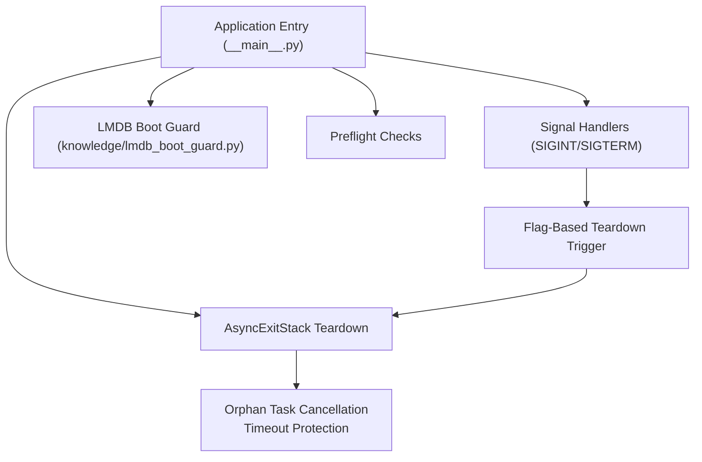
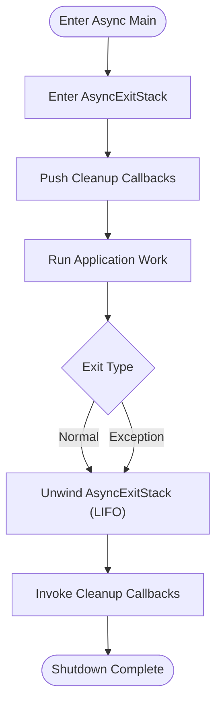
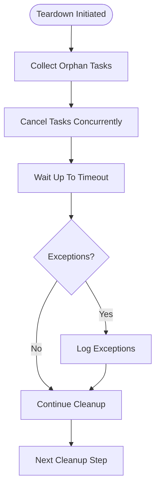
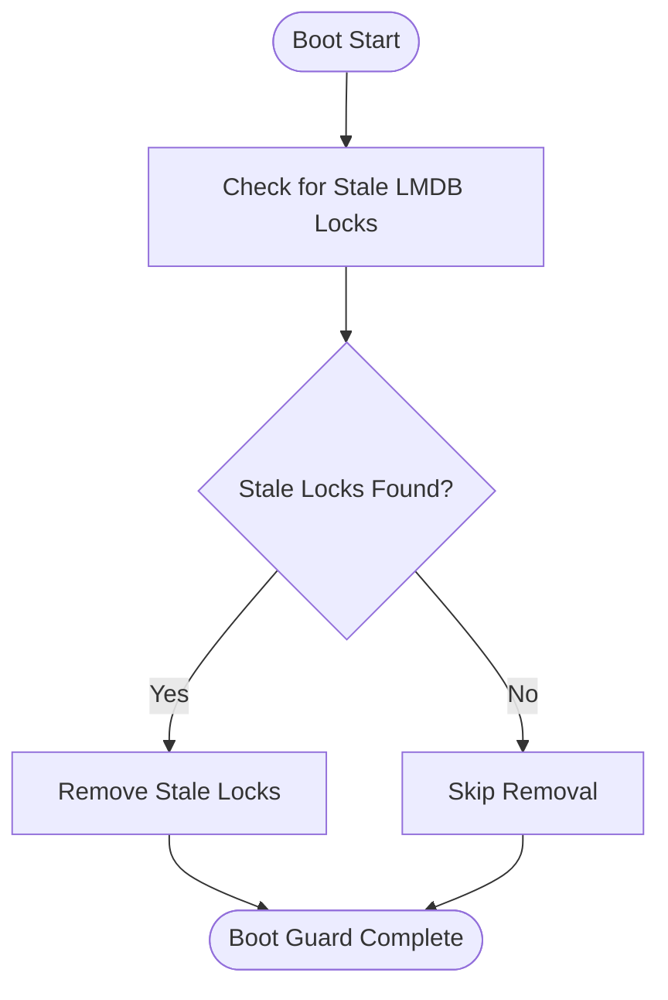
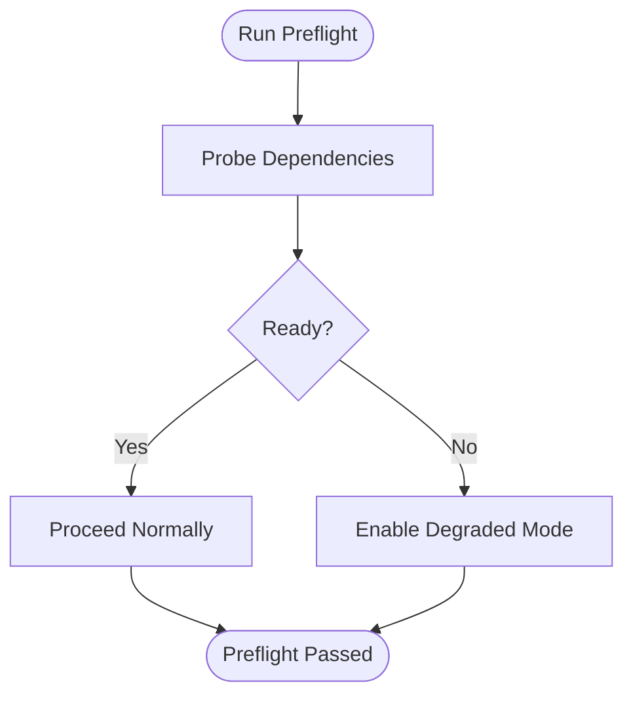
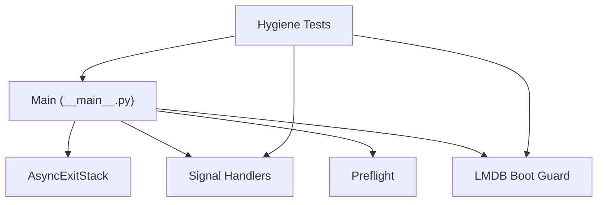

# Boot Hygiene and Teardown Management

<cite>
**Referenced Files in This Document**
- [__main__.py](file://__main__.py)
- [lmdb_boot_guard.py](file://knowledge/lmdb_boot_guard.py)
- [test_sprint8an_hygiene.py](file://tests/test_sprint8an_hygiene.py)
- [test_async_hygiene.py](file://tests/probe_6a/test_async_hygiene.py)
- [test_preflight_returns_dict.py](file://tests/probe_8vd/test_preflight_returns_dict.py)
- [sprint6c_preflight.py](file://tests/sprint6c_preflight.py)
- [test_sprint_8ai.py](file://tests/probe_8ai/test_sprint_8ai.py)
</cite>

## Table of Contents
1. [Introduction](#introduction)
2. [Project Structure](#project-structure)
3. [Core Components](#core-components)
4. [Architecture Overview](#architecture-overview)
5. [Detailed Component Analysis](#detailed-component-analysis)
6. [Dependency Analysis](#dependency-analysis)
7. [Performance Considerations](#performance-considerations)
8. [Troubleshooting Guide](#troubleshooting-guide)
9. [Conclusion](#conclusion)

## Introduction
This document explains the boot hygiene and teardown management system in Hledac Universal. It focuses on:
- An AsyncExitStack-based unified teardown mechanism with LIFO cleanup ordering
- A signal-safe teardown approach using lightweight signal handlers that set flags rather than performing direct cleanup
- Orphan task cancellation with a 5-second timeout protection
- The boot guard system for LMDB safety with stale lock detection and removal
- Preflight checks enabling graceful degradation without raising exceptions
- Practical examples of canonical versus alternate teardown paths
- Common pitfalls and troubleshooting guidance for boot sequence issues

## Project Structure
The boot hygiene system spans a small set of core modules and targeted tests:
- Application entry and teardown orchestration live in the main module
- LMDB boot guard resides under knowledge
- Teardown correctness and signal safety are validated by focused tests
- Preflight checks and degradation behavior are exercised by dedicated test suites



**Diagram sources**
- [__main__.py](file://__main__.py)
- [lmdb_boot_guard.py](file://knowledge/lmdb_boot_guard.py)

**Section sources**
- [__main__.py](file://__main__.py)
- [lmdb_boot_guard.py](file://knowledge/lmdb_boot_guard.py)

## Core Components
- AsyncExitStack-based teardown backbone: Ensures all registered async cleanup callbacks are invoked in LIFO order during normal and exceptional exits.
- Lightweight signal handlers: Set a global flag and schedule loop.stop(), deferring all heavy work to the async teardown path.
- Orphan task cancellation: Aggregates tasks and cancels them with a bounded timeout to prevent long hangs.
- LMDB boot guard: Detects and removes stale locks to maintain database integrity.
- Preflight checks: Validates readiness and allows graceful degradation when components are unavailable.

**Section sources**
- [__main__.py](file://__main__.py)
- [lmdb_boot_guard.py](file://knowledge/lmdb_boot_guard.py)
- [test_sprint8an_hygiene.py](file://tests/test_sprint8an_hygiene.py)
- [test_async_hygiene.py](file://tests/probe_6a/test_async_hygiene.py)

## Architecture Overview
The boot hygiene architecture centers on a single-threaded event loop with explicit signal handling and a unified teardown backbone. The diagram below maps the actual components and their interactions.

```mermaid
sequenceDiagram
participant App as "Application (__main__.py)"
participant Loop as "Event Loop"
participant Sig as "Signal Handlers"
participant Stack as "AsyncExitStack"
participant LMDB as "LMDB Boot Guard"
App->>Loop : "Start event loop"
App->>LMDB : "Run boot guard (stale lock detection/removal)"
Note over App,LMDB : "Boot guard ensures LMDB safety"
App->>Stack : "Enter teardown stack"
App->>Sig : "Install SIGINT/SIGTERM handlers"
Sig-->>Loop : "Set flag and schedule stop"
Loop->>App : "Break loop on teardown flag"
App->>Stack : "Exit teardown stack (LIFO)"
Stack-->>App : "Invoke cleanup callbacks"
App-->>App : "Complete shutdown"
```

**Diagram sources**
- [__main__.py](file://__main__.py)
- [lmdb_boot_guard.py](file://knowledge/lmdb_boot_guard.py)

## Detailed Component Analysis

### AsyncExitStack-based Unified Teardown
- Purpose: Provide a single, reliable teardown backbone that guarantees cleanup callback invocation in LIFO order.
- Behavior:
  - Teardown stack is entered at the start of the async main routine.
  - Cleanup callbacks are pushed onto the stack as resources become available.
  - On normal or exceptional exit, the stack unwinds and invokes callbacks in reverse registration order.
- Validation:
  - Tests confirm AsyncExitStack is used and that LIFO order is preserved.
  - Teardown occurs even on normal exit paths.



**Diagram sources**
- [__main__.py](file://__main__.py)
- [test_sprint_8ai.py](file://tests/probe_8ai/test_sprint_8ai.py)

**Section sources**
- [__main__.py](file://__main__.py)
- [test_sprint_8ai.py](file://tests/probe_8ai/test_sprint_8ai.py)

### Signal-Safe Teardown with Lightweight Handlers
- Purpose: Prevent blocking or unsafe operations inside signal handlers; defer all cleanup to the async teardown path.
- Implementation:
  - Handlers installed for SIGINT and SIGTERM set a global flag and schedule loop.stop() safely.
  - The event loop checks the flag and breaks, triggering AsyncExitStack teardown.
- Validation:
  - Tests confirm handlers do not directly call cleanup and that teardown proceeds via the async stack.

```mermaid
sequenceDiagram
participant OS as "OS Signals"
participant Handler as "Signal Handler"
participant Loop as "Event Loop"
participant Stack as "AsyncExitStack"
OS->>Handler : "SIGINT/SIGTERM"
Handler->>Handler : "Set teardown flag"
Handler->>Loop : "Schedule stop"
Loop->>Loop : "Poll flag and break"
Loop->>Stack : "Trigger __aexit__"
Stack-->>Loop : "LIFO cleanup callbacks"
```

**Diagram sources**
- [__main__.py](file://__main__.py)
- [test_sprint_8ai.py](file://tests/probe_8ai/test_sprint_8ai.py)

**Section sources**
- [__main__.py](file://__main__.py)
- [test_sprint_8ai.py](file://tests/probe_8ai/test_sprint_8ai.py)

### Orphan Task Cancellation with Timeout Protection
- Purpose: Cancel lingering tasks after shutdown to avoid indefinite waits.
- Implementation:
  - Tasks are aggregated and canceled concurrently.
  - A bounded timeout (e.g., 5 seconds) prevents teardown stalls.
  - Exceptions are collected to surface issues without aborting cancellation.
- Validation:
  - Tests verify concurrent cancellation and return_exceptions usage.



**Diagram sources**
- [__main__.py](file://__main__.py)
- [test_sprint8an_hygiene.py](file://tests/test_sprint8an_hygiene.py)

**Section sources**
- [__main__.py](file://__main__.py)
- [test_sprint8an_hygiene.py](file://tests/test_sprint8an_hygiene.py)

### LMDB Boot Guard: Stale Lock Detection and Removal
- Purpose: Ensure LMDB databases are safe to open by detecting and removing stale locks left by previous crashes or abnormal terminations.
- Implementation:
  - Boot guard inspects LMDB lock state and removes stale locks when detected.
  - Telemetry indicates successful completion of the boot guard step.
- Validation:
  - Telemetry confirms the boot guard step executes and reports success.



**Diagram sources**
- [lmdb_boot_guard.py](file://knowledge/lmdb_boot_guard.py)
- [test_sprint_8ai.py](file://tests/probe_8ai/test_sprint_8ai.py)

**Section sources**
- [lmdb_boot_guard.py](file://knowledge/lmdb_boot_guard.py)
- [test_sprint_8ai.py](file://tests/probe_8ai/test_sprint_8ai.py)

### Preflight Checks: Graceful Degradation Without Exceptions
- Purpose: Verify readiness and degrade gracefully when components are unavailable rather than failing hard.
- Implementation:
  - Preflight returns structured diagnostics (e.g., dictionary) indicating readiness and optional degraded mode eligibility.
  - Tests demonstrate preflight behavior and that failures do not raise exceptions.
- Validation:
  - Dedicated tests confirm preflight returns expected structures and supports graceful degradation.



**Diagram sources**
- [test_preflight_returns_dict.py](file://tests/probe_8vd/test_preflight_returns_dict.py)
- [sprint6c_preflight.py](file://tests/sprint6c_preflight.py)

**Section sources**
- [test_preflight_returns_dict.py](file://tests/probe_8vd/test_preflight_returns_dict.py)
- [sprint6c_preflight.py](file://tests/sprint6c_preflight.py)

### Canonical vs Alternate Teardown Paths
- Canonical path:
  - Normal application flow completes and AsyncExitStack unwinds in LIFO order.
- Alternate path:
  - Signal received triggers flag-based loop.stop(), which then triggers AsyncExitStack teardown.
- Tests validate both paths produce equivalent teardown semantics and avoid double teardown.

```mermaid
sequenceDiagram
participant App as "Application"
participant Stack as "AsyncExitStack"
participant Alt as "Alternate Path (Signal)"
App->>Stack : "Enter teardown stack"
App->>App : "Run normal flow"
App->>Stack : "Exit stack (LIFO)"
Note over App,Stack : "Canonical teardown"
App->>Alt : "Install signal handlers"
Alt-->>App : "Signal received"
Alt->>Stack : "Trigger teardown via loop.stop()"
Stack-->>App : "LIFO cleanup"
Note over App,Stack : "Alternate teardown"
```

**Diagram sources**
- [__main__.py](file://__main__.py)
- [test_sprint_8ai.py](file://tests/probe_8ai/test_sprint_8ai.py)

**Section sources**
- [__main__.py](file://__main__.py)
- [test_sprint_8ai.py](file://tests/probe_8ai/test_sprint_8ai.py)

## Dependency Analysis
The boot hygiene system exhibits low coupling and clear responsibilities:
- Main module depends on:
  - AsyncExitStack for teardown orchestration
  - Signal handling for safe termination
  - LMDB boot guard for database safety
  - Preflight checks for readiness
- Tests validate:
  - Teardown order and signal safety
  - Orphan task cancellation behavior
  - Boot guard telemetry
  - Preflight graceful degradation



**Diagram sources**
- [__main__.py](file://__main__.py)
- [lmdb_boot_guard.py](file://knowledge/lmdb_boot_guard.py)
- [test_sprint8an_hygiene.py](file://tests/test_sprint8an_hygiene.py)
- [test_sprint_8ai.py](file://tests/probe_8ai/test_sprint_8ai.py)

**Section sources**
- [__main__.py](file://__main__.py)
- [lmdb_boot_guard.py](file://knowledge/lmdb_boot_guard.py)
- [test_sprint8an_hygiene.py](file://tests/test_sprint8an_hygiene.py)
- [test_sprint_8ai.py](file://tests/probe_8ai/test_sprint_8ai.py)

## Performance Considerations
- Teardown overhead:
  - Status reads and stack unwinds are benchmarked to remain fast under load.
  - Telemetry and stack unwinds are optimized for minimal latency.
- Signal handling:
  - Handlers are intentionally lightweight to avoid blocking in signal context.
- Orphan task cancellation:
  - Bounded timeouts prevent teardown stalls while collecting exceptions for observability.

[No sources needed since this section provides general guidance]

## Troubleshooting Guide
Common issues and remedies:
- Signal handlers not installed:
  - Symptom: Signals do not trigger teardown.
  - Action: Ensure handlers are installed before the event loop starts and verify logging messages.
- Double teardown or inconsistent state:
  - Symptom: Duplicate cleanup or resource contention.
  - Action: Confirm signal handlers only set flags and schedule loop.stop(); actual cleanup is performed by AsyncExitStack.
- Stale LMDB locks preventing startup:
  - Symptom: Startup fails due to lock conflicts.
  - Action: Review boot guard telemetry; ensure stale locks are removed prior to database access.
- Preflight failures causing hard stops:
  - Symptom: Application exits early on readiness checks.
  - Action: Enable graceful degradation paths and log preflight diagnostics; avoid raising exceptions in preflight.
- Orphan tasks delaying shutdown:
  - Symptom: Teardown hangs after signals or normal exit.
  - Action: Verify orphan task cancellation is invoked with a bounded timeout and that exceptions are logged.

**Section sources**
- [__main__.py](file://__main__.py)
- [test_sprint_8ai.py](file://tests/probe_8ai/test_sprint_8ai.py)
- [test_sprint8an_hygiene.py](file://tests/test_sprint8an_hygiene.py)
- [test_preflight_returns_dict.py](file://tests/probe_8vd/test_preflight_returns_dict.py)

## Conclusion
Hledac Universal’s boot hygiene system combines a robust AsyncExitStack teardown backbone, signal-safe handlers, LMDB boot guard, and preflight checks to deliver predictable, resilient shutdowns. The design enforces LIFO cleanup ordering, avoids heavy work in signal handlers, protects against stuck tasks with timeouts, and supports graceful degradation when dependencies are unavailable. The included tests validate these behaviors and serve as a reference for maintaining and extending the system.