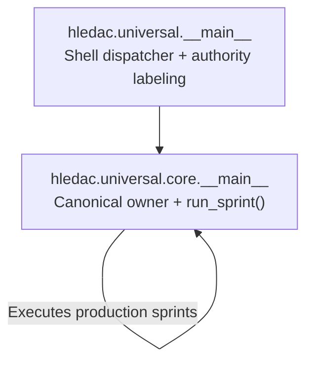
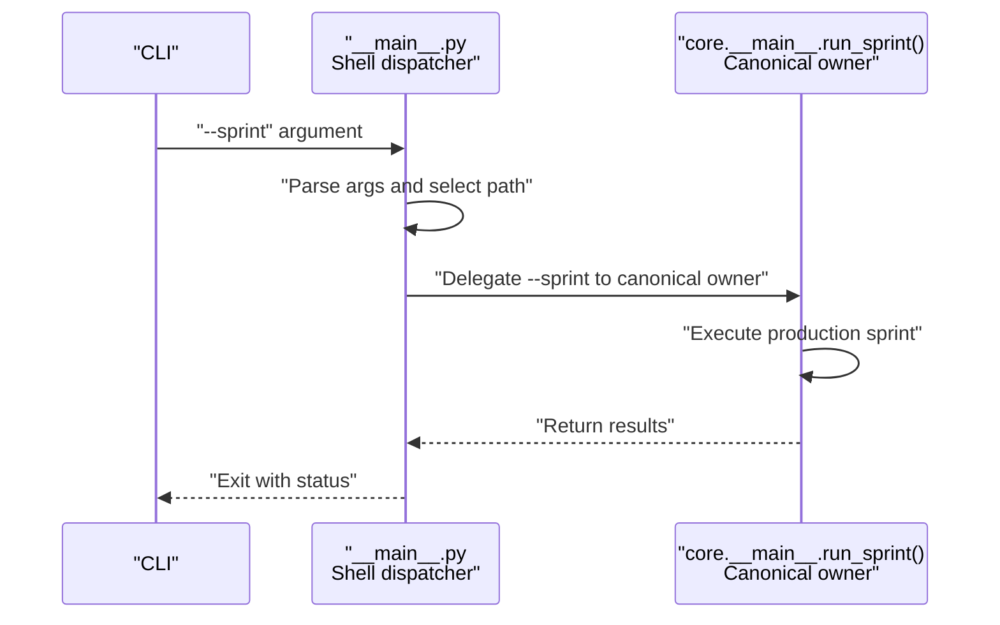
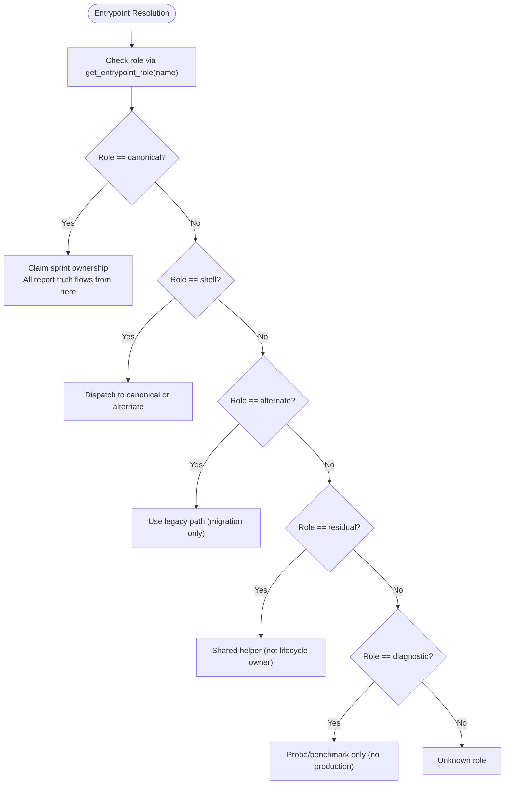
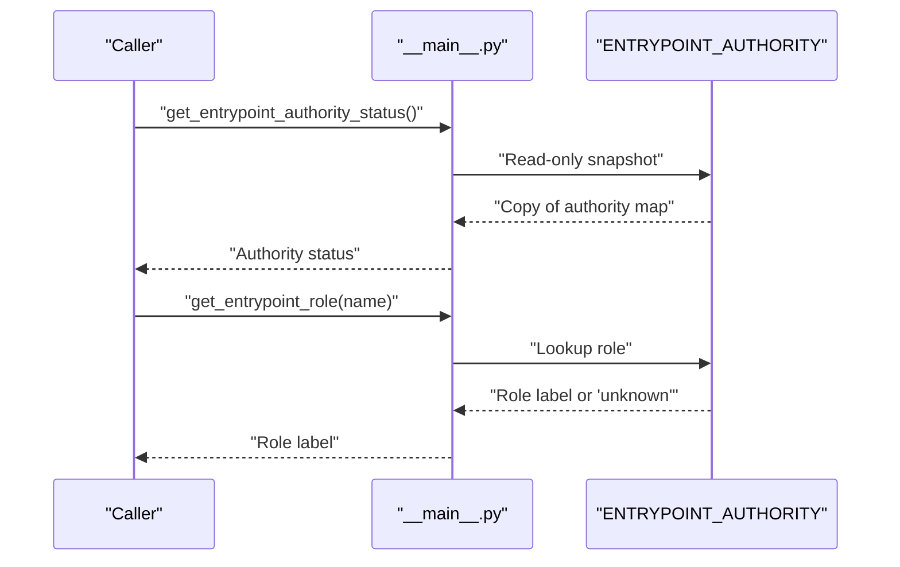
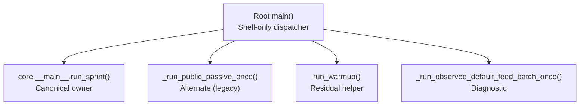
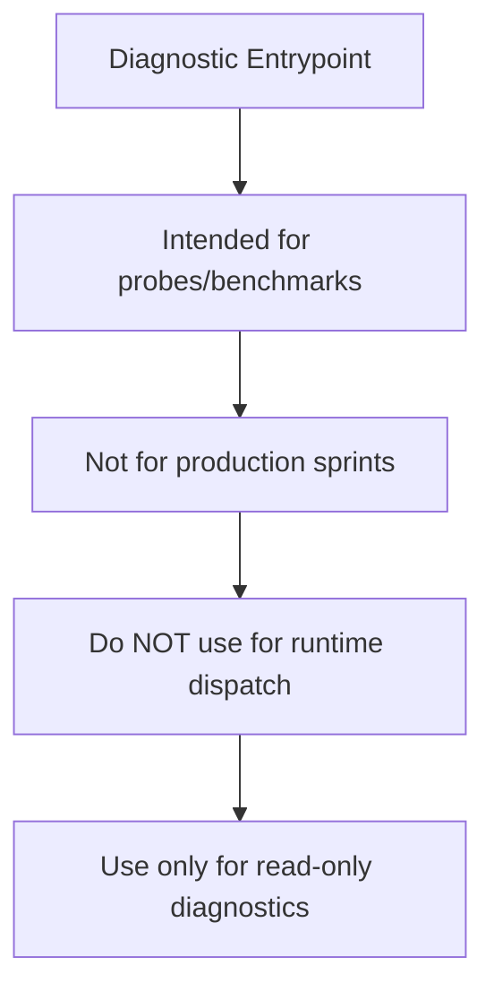
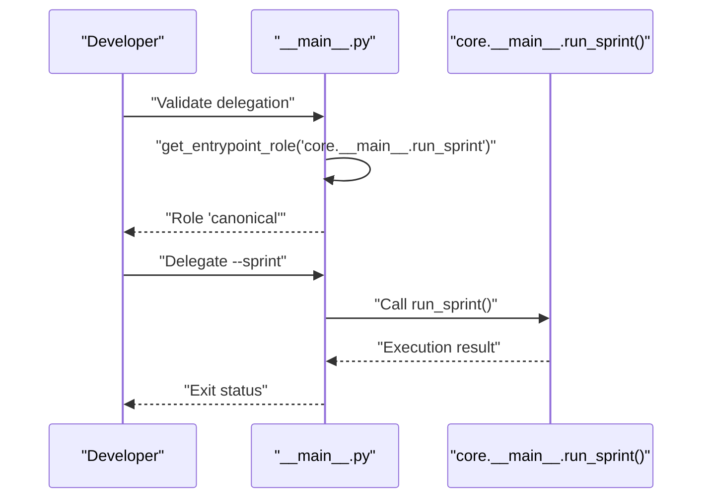
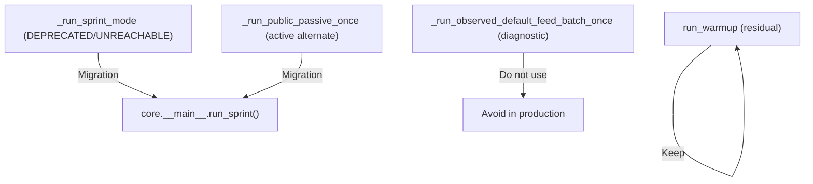
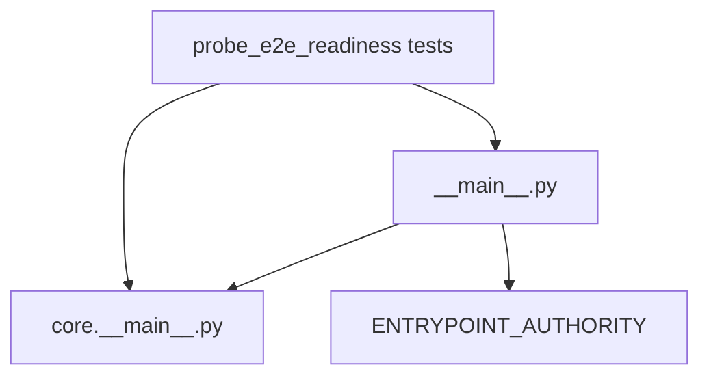

# Entry Point Mechanisms and Authority Enforcement

<cite>
**Referenced Files in This Document**
- [__main__.py](file://hledac/universal/__main__.py)
- [core/__main__.py](file://hledac/universal/core/__main__.py)
- [sprint_lifecycle.py](file://hledac/universal/runtime/sprint_lifecycle.py)
- [test_e2e_readiness.py](file://hledac/universal/tests/probe_e2e_readiness/test_e2e_readiness.py)
- [GHOST_INVARIANTS.md](file://hledac/universal/GHOST_INVARIANTS.md)
</cite>

## Table of Contents
1. [Introduction](#introduction)
2. [Project Structure](#project-structure)
3. [Core Components](#core-components)
4. [Architecture Overview](#architecture-overview)
5. [Detailed Component Analysis](#detailed-component-analysis)
6. [Dependency Analysis](#dependency-analysis)
7. [Performance Considerations](#performance-considerations)
8. [Troubleshooting Guide](#troubleshooting-guide)
9. [Conclusion](#conclusion)

## Introduction
This document explains the Hledac Universal entry point mechanisms and authority enforcement systems. It focuses on:
- The canonical owner freeze concept and how it prevents unauthorized runtime modifications
- The dual entry point architecture: main() as shell dispatcher and core.__main__.run_sprint as the canonical owner
- Authority query functions get_entrypoint_authority_status() and get_entrypoint_role()
- The non-confusion invariant ensuring only canonical paths can claim sprint ownership
- Practical examples of authority checking and proper delegation patterns
- Legacy path deprecation and migration examples
- The diagnostic-only nature of probe entry points and their limitations in production contexts

## Project Structure
The authority enforcement spans two primary modules:
- Root entry point: hledac.universal.__main__ defines the CLI shell and authority labeling
- Canonical owner: hledac.universal.core.__main__ executes production sprints and owns lifecycle truth

**Diagram sources**
- [__main__.py:47-68](file://hledac/universal/__main__.py#L47-L68)
- [core/__main__.py:664-683](file://hledac/universal/core/__main__.py#L664-L683)

**Section sources**
- [__main__.py:47-68](file://hledac/universal/__main__.py#L47-L68)
- [core/__main__.py:664-683](file://hledac/universal/core/__main__.py#L664-L683)

## Core Components
- Canonical owner freeze: A hardened authority model that labels entry points and enforces a single production sprint owner
- Dual entry point architecture:
  - Shell dispatcher (root main): never owns sprint state; only dispatches to canonical or alternate paths
  - Canonical owner (core.__main__.run_sprint): sole production sprint owner; all report truth flows from here
- Authority query functions:
  - get_entrypoint_authority_status(): read-only authority status snapshot
  - get_entrypoint_role(name): returns role label for a named entrypoint
- Non-confusion invariant: only canonical paths can claim sprint ownership
- Diagnostic-only entry points: probe/benchmark entry points are not for production

**Section sources**
- [__main__.py:47-68](file://hledac/universal/__main__.py#L47-L68)
- [__main__.py:186-204](file://hledac/universal/__main__.py#L186-L204)
- [sprint_lifecycle.py:395-409](file://hledac/universal/runtime/sprint_lifecycle.py#L395-L409)

## Architecture Overview
The authority enforcement architecture enforces a strict separation of concerns:
- Root main() is shell-only and never owns sprint state
- Delegation to core.__main__.run_sprint for production sprints
- ENTRYPOINT_AUTHORITY as the single source of truth for role labeling
- Tests verify that root main() delegates --sprint to the canonical owner

**Diagram sources**
- [__main__.py:47-68](file://hledac/universal/__main__.py#L47-L68)
- [test_e2e_readiness.py:33-59](file://hledac/universal/tests/probe_e2e_readiness/test_e2e_readiness.py#L33-L59)
- [core/__main__.py:664-683](file://hledac/universal/core/__main__.py#L664-L683)

## Detailed Component Analysis

### Canonical Owner Freeze and Role Taxonomy
The canonical owner freeze establishes a read-only authority model:
- Roles:
  - canonical: sole production sprint owner; all report truth flows from here
  - shell: CLI dispatcher; never owns sprint state
  - alternate: legacy production path; not canonical owner; for migration only
  - residual: shared helper path; owned by multiple callers; not a sprint owner
  - diagnostic: probe/benchmark only; not for production sprints
- ENTRYPOINT_AUTHORITY is the single source of truth for role labeling
- Non-confusion invariant: canonical is the only production sprint owner role

**Diagram sources**
- [__main__.py:47-68](file://hledac/universal/__main__.py#L47-L68)
- [__main__.py:191-204](file://hledac/universal/__main__.py#L191-L204)

**Section sources**
- [__main__.py:47-68](file://hledac/universal/__main__.py#L47-L68)
- [__main__.py:191-204](file://hledac/universal/__main__.py#L191-L204)

### Authority Query Functions
- get_entrypoint_authority_status(): returns a read-only copy of ENTRYPOINT_AUTHORITY
- get_entrypoint_role(name): returns role label for a named entrypoint; unknown names return "unknown"

These functions enable:
- Diagnosing authority composition
- Enforcing delegation patterns at runtime
- Auditing entry point roles without side effects

**Diagram sources**
- [__main__.py:186-204](file://hledac/universal/__main__.py#L186-L204)

**Section sources**
- [__main__.py:186-204](file://hledac/universal/__main__.py#L186-L204)

### Dual Entry Point Architecture
- Root main() is shell-only and never owns sprint state; it only dispatches to canonical or alternate paths
- core.__main__.run_sprint is the canonical owner responsible for production sprints
- Tests verify that root main() delegates --sprint to the canonical owner

**Diagram sources**
- [__main__.py:144-163](file://hledac/universal/__main__.py#L144-L163)
- [test_e2e_readiness.py:33-59](file://hledac/universal/tests/probe_e2e_readiness/test_e2e_readiness.py#L33-L59)

**Section sources**
- [__main__.py:144-163](file://hledac/universal/__main__.py#L144-L163)
- [test_e2e_readiness.py:33-59](file://hledac/universal/tests/probe_e2e_readiness/test_e2e_readiness.py#L33-L59)

### Non-Confusion Invariant and Diagnostic Limitations
- Non-confusion invariant: canonical is the only production sprint owner role
- Diagnostic-only entry points: probe/benchmark entry points are not for production sprints
- Diagnostic properties and APIs are intended for read-only shadow paths; do not use for runtime dispatch or path decisions

**Diagram sources**
- [__main__.py:47-68](file://hledac/universal/__main__.py#L47-L68)
- [sprint_lifecycle.py:395-409](file://hledac/universal/runtime/sprint_lifecycle.py#L395-L409)

**Section sources**
- [__main__.py:47-68](file://hledac/universal/__main__.py#L47-L68)
- [sprint_lifecycle.py:395-409](file://hledac/universal/runtime/sprint_lifecycle.py#L395-L409)

### Practical Examples and Delegation Patterns
- Authority checking: use get_entrypoint_role(name) to validate delegation targets
- Proper delegation: root main() should delegate --sprint to core.__main__.run_sprint
- Migration: alternate paths are legacy; use for migration only and avoid for new production workloads
- Residual helpers: shared helpers (e.g., run_warmup) are not lifecycle owners

**Diagram sources**
- [__main__.py:191-204](file://hledac/universal/__main__.py#L191-L204)
- [test_e2e_readiness.py:33-59](file://hledac/universal/tests/probe_e2e_readiness/test_e2e_readiness.py#L33-L59)

**Section sources**
- [__main__.py:191-204](file://hledac/universal/__main__.py#L191-L204)
- [test_e2e_readiness.py:33-59](file://hledac/universal/tests/probe_e2e_readiness/test_e2e_readiness.py#L33-L59)

### Legacy Path Deprecation and Migration Examples
- _run_sprint_mode is deprecated and unreachable from the active main() path
- _run_public_passive_once is an active alternate path without lifecycle or report boundary
- run_warmup is residual (shared helper, not lifecycle owner)
- Migration strategy:
  - Replace alternate paths with canonical owner delegation
  - Use residual helpers only for shared tasks, not lifecycle ownership
  - Avoid diagnostic-only paths for production

**Diagram sources**
- [__main__.py:144-163](file://hledac/universal/__main__.py#L144-L163)

**Section sources**
- [__main__.py:144-163](file://hledac/universal/__main__.py#L144-L163)

## Dependency Analysis
The authority enforcement depends on:
- Root main() to enforce shell-only behavior and delegate to canonical owner
- core.__main__.run_sprint as the canonical owner for production sprints
- ENTRYPOINT_AUTHORITY for read-only role labeling
- Tests to verify delegation correctness

**Diagram sources**
- [__main__.py:47-68](file://hledac/universal/__main__.py#L47-L68)
- [test_e2e_readiness.py:33-59](file://hledac/universal/tests/probe_e2e_readiness/test_e2e_readiness.py#L33-L59)
- [core/__main__.py:664-683](file://hledac/universal/core/__main__.py#L664-L683)

**Section sources**
- [__main__.py:47-68](file://hledac/universal/__main__.py#L47-L68)
- [test_e2e_readiness.py:33-59](file://hledac/universal/tests/probe_e2e_readiness/test_e2e_readiness.py#L33-L59)
- [core/__main__.py:664-683](file://hledac/universal/core/__main__.py#L664-L683)

## Performance Considerations
- Authority queries are read-only and side-effect free, minimizing overhead
- Boot telemetry recording is O(1) and side-effect free
- Keep delegation checks lightweight; avoid heavy computations in authority paths

## Troubleshooting Guide
- Verify delegation: ensure root main() delegates --sprint to core.__main__.run_sprint
- Role validation: use get_entrypoint_role(name) to confirm canonical ownership
- Avoid mixing diagnostic and production paths: diagnostic-only entry points are not for production
- Respect non-confusion invariant: only canonical paths can claim sprint ownership

**Section sources**
- [test_e2e_readiness.py:33-59](file://hledac/universal/tests/probe_e2e_readiness/test_e2e_readiness.py#L33-L59)
- [__main__.py:191-204](file://hledac/universal/__main__.py#L191-L204)
- [sprint_lifecycle.py:395-409](file://hledac/universal/runtime/sprint_lifecycle.py#L395-L409)

## Conclusion
The Hledac Universal authority enforcement system enforces a hardened, read-only model:
- Canonical owner freeze prevents unauthorized runtime modifications by establishing a single production sprint owner
- The dual entry point architecture cleanly separates shell dispatch from canonical execution
- Authority query functions provide safe, read-only introspection for delegation and auditing
- Legacy paths are deprecated and should be migrated away from; diagnostic-only paths remain unsuitable for production
- The non-confusion invariant ensures only canonical paths can claim sprint ownership, maintaining clarity and safety