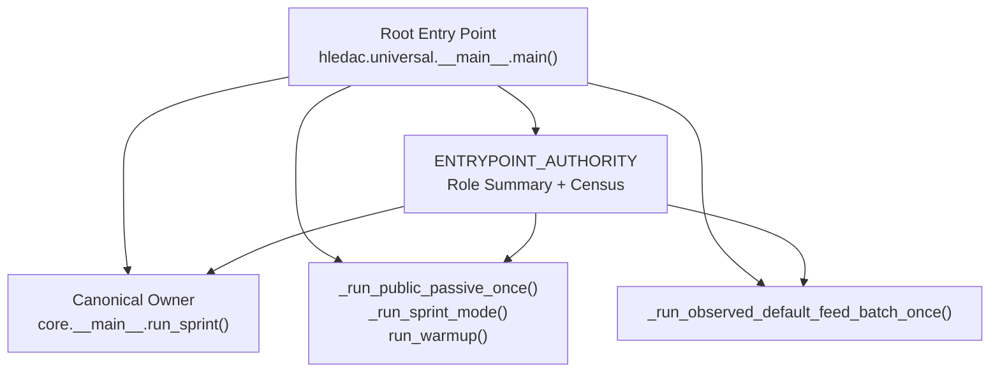
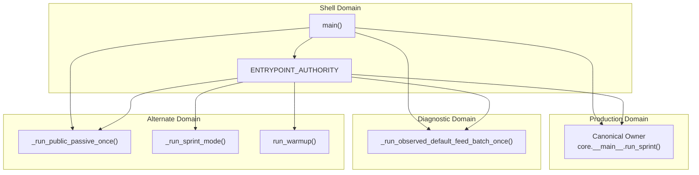
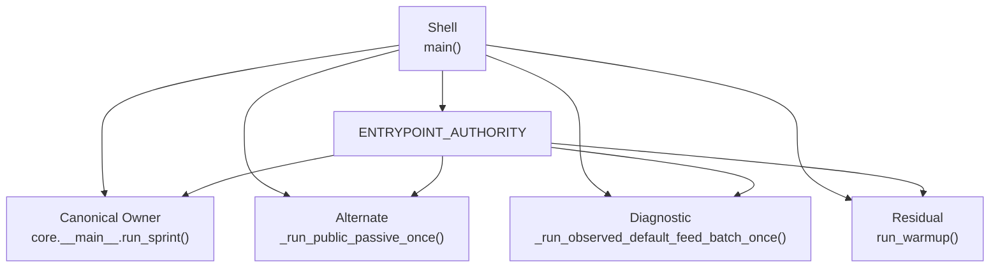

# Role Taxonomy and Authority Classification

<cite>
**Referenced Files in This Document**
- [__main__.py](file://hledac/universal/__main__.py)
- [core.__main__.py](file://hledac/universal/core/__main__.py)
- [paths.py](file://hledac/universal/paths.py)
- [test_e2e_readiness.py](file://hledac/universal/tests/probe_e2e_readiness/test_e2e_readiness.py)
- [shadow_pre_decision.py](file://hledac/universal/runtime/shadow_pre_decision.py)
- [markdown_reporter.py](file://hledac/universal/export/markdown_reporter.py)
</cite>

## Table of Contents
1. [Introduction](#introduction)
2. [Project Structure](#project-structure)
3. [Core Components](#core-components)
4. [Architecture Overview](#architecture-overview)
5. [Detailed Component Analysis](#detailed-component-analysis)
6. [Dependency Analysis](#dependency-analysis)
7. [Performance Considerations](#performance-considerations)
8. [Troubleshooting Guide](#troubleshooting-guide)
9. [Conclusion](#conclusion)

## Introduction
This document explains the Hledac Universal role taxonomy system that governs how the platform assigns responsibility across entry points and runtime paths. It defines five distinct roles:
- Canonical: sole production sprint owner
- Shell: CLI dispatcher that never owns sprint state
- Alternate: legacy production path (not canonical)
- Residual: shared helper path (not a sprint owner)
- Diagnostic: probe/benchmark only (not for production)

It also documents the ENTRYPOINT_AUTHORITY structure that enforces system integrity, the canonical-only ownership principle, practical role assignments, and the authority census and role summary mechanisms used for runtime verification.

## Project Structure
The role taxonomy is centered around the root entry point and its authority declarations:
- Root entry point: hledac.universal.__main__.main()
- Canonical owner: hledac.universal.core.__main__.run_sprint()
- Alternate paths: legacy and diagnostic-only runners
- Authority registry: ENTRYPOINT_AUTHORITY dictionary with role summaries and census

**Diagram sources**
- [__main__.py:70-183](file://hledac/universal/__main__.py#L70-L183)
- [__main__.py:3092-3111](file://hledac/universal/__main__.py#L3092-L3111)

**Section sources**
- [__main__.py:47-68](file://hledac/universal/__main__.py#L47-L68)
- [__main__.py:70-183](file://hledac/universal/__main__.py#L70-L183)

## Core Components
- ENTRYPOINT_AUTHORITY: Single source of truth for role labeling and ownership semantics. It includes:
  - Canonical owner designation
  - Alternate paths with deprecation and reachability notes
  - Residual helpers and diagnostic-only paths
  - Authority census (who calls what)
  - Role summary (quick lookup)
  - Non-confusion invariant (ensures canonical-only truth)
- Runtime role queries:
  - get_entrypoint_role(name): returns role label for a given entrypoint
  - get_entrypoint_authority_status(): returns a copy of the authority registry
- Canonical-only ownership principle:
  - Only core.__main__.run_sprint() may produce canonical_run_summary with canonical_sprint_owner equal to itself
  - No alternate or residual path may claim this field

Practical implications:
- main() delegates --sprint to core.__main__.run_sprint()
- Alternate paths are legacy and diagnostic-only
- Residual paths are helpers not responsible for lifecycle boundaries
- Diagnostic paths are benchmark/probe only

**Section sources**
- [__main__.py:70-183](file://hledac/universal/__main__.py#L70-L183)
- [__main__.py:186-205](file://hledac/universal/__main__.py#L186-L205)

## Architecture Overview
The taxonomy enforces a strict separation between production and diagnostic domains:
- Production domain: Canonical path is the only owner of report/truth boundaries
- Diagnostic domain: Observed-run probe and benchmark-only flows
- Alternate domain: Legacy paths retained for compatibility but not canonical owners
- Residual domain: Shared helpers without lifecycle ownership

**Diagram sources**
- [__main__.py:70-183](file://hledac/universal/__main__.py#L70-L183)
- [__main__.py:3092-3111](file://hledac/universal/__main__.py#L3092-L3111)

**Section sources**
- [__main__.py:47-68](file://hledac/universal/__main__.py#L47-L68)
- [__main__.py:177-183](file://hledac/universal/__main__.py#L177-L183)

## Detailed Component Analysis

### ENTRYPOINT_AUTHORITY and Authority Census
ENTRYPOINT_AUTHORITY centralizes role semantics and ownership invariants:
- Canonical owner: core.__main__.run_sprint()
- Alternate paths:
  - _run_public_passive_once(): alternate, no lifecycle/report boundary
  - _run_sprint_mode(): deprecated/unreachable
  - run_warmup(): deprecated/unreachable (called by dead path)
  - _run_async_main(): dead scaffolding
- Diagnostic path:
  - _run_observed_default_feed_batch_once(): probe only
- Authority census:
  - canonical_sprint_calls
  - alternate_production_paths
  - residual_helper_paths
  - diagnostic_paths
  - dead_scaffolding_paths
  - shell_only
- Role summary:
  - Quick lookup table for entrypoint roles
- Non-confusion invariant:
  - Canonical-only truth for canonical_run_summary

Runtime verification:
- get_entrypoint_role(name) returns the role label for any entrypoint
- get_entrypoint_authority_status() returns a copy of the registry for inspection

**Section sources**
- [__main__.py:70-183](file://hledac/universal/__main__.py#L70-L183)
- [__main__.py:186-205](file://hledac/universal/__main__.py#L186-L205)

### Canonical-only Ownership Principle
The canonical-only ownership principle ensures that only the canonical path produces canonical_run_summary with canonical_sprint_owner equal to core.__main__.run_sprint(). This prevents confusion between production and diagnostic runs.

Key guarantees:
- No alternate or residual path may claim canonical_sprint_owner
- Diagnostic paths (observed-run probes) are explicitly labeled as non-canonical
- Shell entry points (main) are explicitly labeled as non-owners

This principle is enforced by:
- ENTRYPOINT_AUTHORITY’s non_confusion_invariant
- get_entrypoint_role() returning canonical only for the designated owner
- Delegation from main() to core.__main__.run_sprint() for --sprint

**Section sources**
- [__main__.py:177-183](file://hledac/universal/__main__.py#L177-L183)
- [__main__.py:191-204](file://hledac/universal/__main__.py#L191-L204)
- [__main__.py:3092-3111](file://hledac/universal/__main__.py#L3092-L3111)

### Practical Role Assignment Examples
- main() --sprint "query" 1800 → delegates to core.__main__.run_sprint() (canonical)
- main() --ct-pivot → alternate (no sprint ownership)
- main() --pivot → alternate (no sprint ownership)
- main() (no flags) → runs _run_public_passive_once() (alternate, no lifecycle)
- _run_observed_default_feed_batch_once() → diagnostic only

Evidence:
- Delegation from main() to core.__main__.run_sprint() for --sprint
- Alternate path _run_public_passive_once() explicitly marked as non-canonical
- Diagnostic path _run_observed_default_feed_batch_once() explicitly marked as probe-only

**Section sources**
- [__main__.py:3092-3111](file://hledac/universal/__main__.py#L3092-L3111)
- [__main__.py:541-678](file://hledac/universal/__main__.py#L541-L678)
- [__main__.py:1498-1599](file://hledac/universal/__main__.py#L1498-L1599)

### Canonical vs Alternate Path Differences
- Canonical path (core.__main__.run_sprint()):
  - Produces canonical_run_summary with canonical_sprint_owner equal to itself
  - Full lifecycle ownership and report/truth boundaries
- Alternate path (_run_public_passive_once()):
  - Runs full pipeline without canonical lifecycle
  - Not a sprint owner; no canonical report boundary
  - Used for public-branch probe only

Validation:
- ENTRYPOINT_AUTHORITY role summary distinguishes canonical vs alternate
- Tests confirm delegation to canonical path for --sprint

**Section sources**
- [__main__.py:164-176](file://hledac/universal/__main__.py#L164-L176)
- [__main__.py:541-678](file://hledac/universal/__main__.py#L541-L678)
- [test_e2e_readiness.py:42-64](file://hledac/universal/tests/probe_e2e_readiness/test_e2e_readiness.py#L42-L64)

### Deprecation of Legacy Paths and Migration Strategies
Legacy paths are deprecated and unreachable from the active CLI path:
- _run_sprint_mode(): deprecated/unreachable
- run_warmup(): deprecated/unreachable (called only by dead path)
- _run_async_main(): dead scaffolding
- _run_boot_guard(): excluded from legacy/ path to prevent accidental imports

Migration guidance:
- Prefer canonical path for all production sprints (--sprint)
- Replace alternate usage with canonical delegation
- Remove reliance on residual helpers that are effectively dormant
- Use diagnostic paths only for benchmark/probe runs

**Section sources**
- [__main__.py:32-34](file://hledac/universal/__main__.py#L32-L34)
- [__main__.py:82-142](file://hledac/universal/__main__.py#L82-L142)
- [__main__.py:3133-3199](file://hledac/universal/__main__.py#L3133-L3199)

### Authority Census and Role Summary Mechanisms
Authority census enumerates who calls what:
- canonical_sprint_calls
- alternate_production_paths
- residual_helper_paths
- diagnostic_paths
- dead_scaffolding_paths
- shell_only

Role summary provides quick lookup for runtime role verification.

Runtime verification:
- get_entrypoint_role(name) returns role label for any entrypoint
- get_entrypoint_authority_status() returns a copy of the registry

**Section sources**
- [__main__.py:143-176](file://hledac/universal/__main__.py#L143-L176)
- [__main__.py:186-205](file://hledac/universal/__main__.py#L186-L205)

### Diagnostic Runtime Truth and Observed Runs
Observed-run probe collects runtime truth and diagnostics:
- UMA sampling, dedup deltas, signal funnel, store rejection trace
- Root runtime truth taxonomy: import_probe, entrypoint_smoke, meaningful_active_probe
- ObservedRunReport fields include interpreter truth, bootstrap pack info, matcher probes

These are diagnostic-only signals and not canonical ownership surfaces.

**Section sources**
- [__main__.py:806-852](file://hledac/universal/__main__.py#L806-L852)
- [__main__.py:912-999](file://hledac/universal/__main__.py#L912-L999)
- [__main__.py:1498-1947](file://hledac/universal/__main__.py#L1498-L1947)

### Export and Report Path Authority
Path computation and export authority are separated:
- Canonical owner: paths.get_sprint_report_path()
- Shell role: orchestration + file write only
- Rendering delegated to canonical reporter

This separation preserves canonical-only ownership for truth boundaries while allowing shell orchestration.

**Section sources**
- [__main__.py:2369-2395](file://hledac/universal/__main__.py#L2369-L2395)
- [paths.py:1-44](file://hledac/universal/paths.py#L1-L44)

### Shadow Inputs and Runtime Mode Semantics
Shadow inputs and runtime mode influence dispatch decisions:
- Shadow pre-decision logic distinguishes canonical tool dispatch vs runtime-only compatibility dispatch
- Diagnostic mode may lack exec_logger availability, which is acceptable

These mechanisms support the separation between canonical and diagnostic flows.

**Section sources**
- [shadow_pre_decision.py:1896-1906](file://hledac/universal/runtime/shadow_pre_decision.py#L1896-L1906)

### Markdown Reporting and Diagnostic Summaries
Diagnostic reports include structured sections for runtime truth, signal funnel, store rejection trace, and recommendations. These are produced by diagnostic-only flows and not canonical production runs.

**Section sources**
- [markdown_reporter.py:125-187](file://hledac/universal/export/markdown_reporter.py#L125-L187)

## Dependency Analysis
The taxonomy introduces clear dependencies among components:
- Shell depends on ENTRYPOINT_AUTHORITY for role labeling
- Shell delegates --sprint to Canonical owner
- Alternate and Diagnostic paths are independent of Canonical lifecycle
- Residual helpers are auxiliary and not lifecycle owners

**Diagram sources**
- [__main__.py:70-183](file://hledac/universal/__main__.py#L70-L183)
- [__main__.py:3092-3111](file://hledac/universal/__main__.py#L3092-L3111)

**Section sources**
- [__main__.py:70-183](file://hledac/universal/__main__.py#L70-L183)
- [__main__.py:3092-3111](file://hledac/universal/__main__.py#L3092-L3111)

## Performance Considerations
- Canonical path is optimized for production throughput and lifecycle ownership
- Diagnostic paths use bounded limits and lightweight samplers to avoid impacting production
- Residual helpers are dormant and do not participate in active lifecycle
- Shell remains lightweight, delegating to canonical owner for production work

## Troubleshooting Guide
Common issues and checks:
- Confusion between canonical and diagnostic runs:
  - Verify canonical_sprint_owner equals core.__main__.run_sprint()
  - Confirm diagnostic paths do not claim canonical ownership
- Legacy path usage:
  - Ensure --sprint delegates to canonical owner
  - Avoid alternate paths for production
- Runtime truth verification:
  - Use get_entrypoint_role() to confirm entrypoint roles
  - Use get_entrypoint_authority_status() for authority census inspection
- Export path authority:
  - Confirm path computation delegated to canonical owner
  - Verify shell-only orchestration responsibilities

**Section sources**
- [__main__.py:177-183](file://hledac/universal/__main__.py#L177-L183)
- [__main__.py:186-205](file://hledac/universal/__main__.py#L186-L205)
- [test_e2e_readiness.py:42-64](file://hledac/universal/tests/probe_e2e_readiness/test_e2e_readiness.py#L42-L64)

## Conclusion
The Hledac Universal role taxonomy system enforces a strict separation between production and diagnostic domains through ENTRYPOINT_AUTHORITY, canonical-only ownership, and explicit role assignments. By delegating --sprint to the canonical owner and restricting alternate/residual paths, the system maintains integrity and clarity. Diagnostic-only flows provide benchmarking and probing capabilities without compromising canonical truth boundaries. The authority census and role summary mechanisms enable runtime verification and help prevent confusion between production and diagnostic runs.