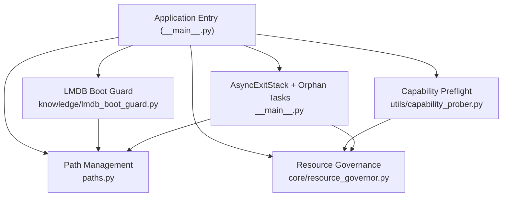
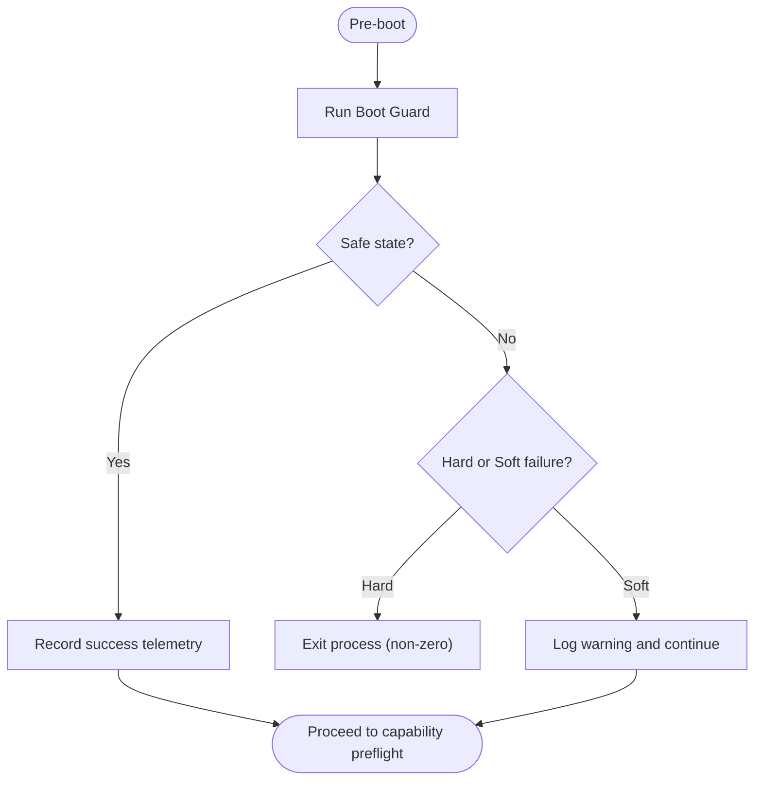
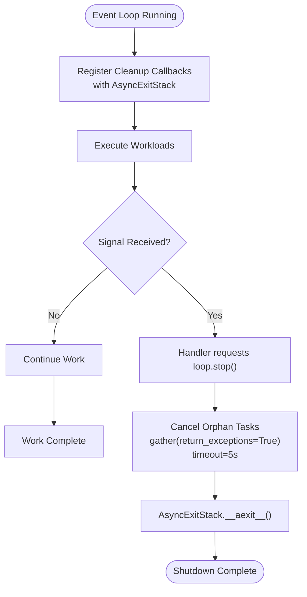
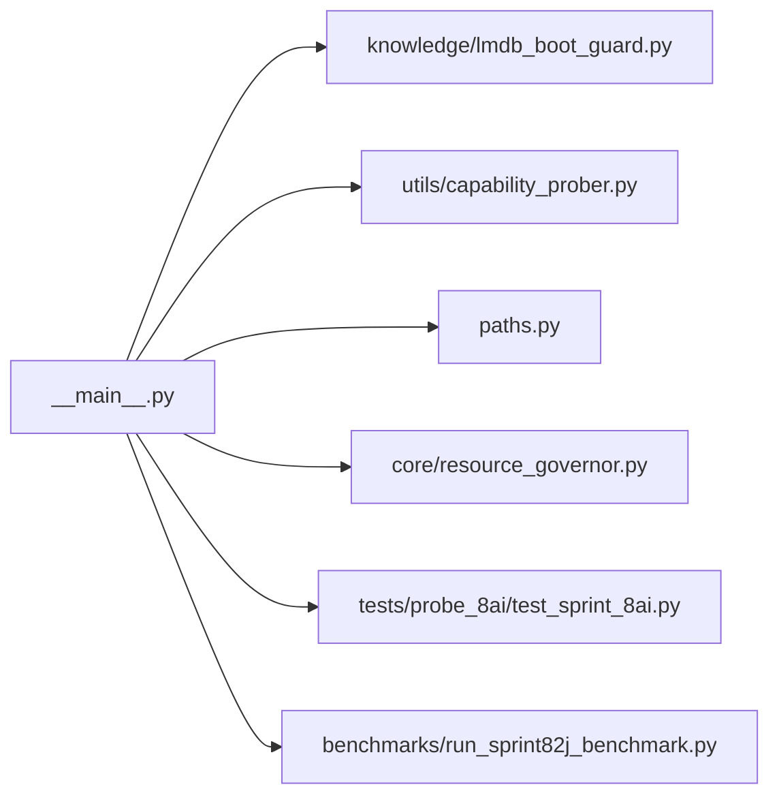

# Boot Sequence and Initialization

<cite>
**Referenced Files in This Document**
- [__main__.py](file://__main__.py)
- [lmdb_boot_guard.py](file://knowledge/lmdb_boot_guard.py)
- [capability_prober.py](file://utils/capability_prober.py)
- [paths.py](file://paths.py)
- [resource_governor.py](file://core/resource_governor.py)
- [test_sprint_8ai.py](file://tests/probe_8ai/test_sprint_8ai.py)
- [_UmaSampler](file://__main__.py)
- [run_sprint82j_benchmark.py](file://benchmarks/run_sprint82j_benchmark.py)
</cite>

## Table of Contents
1. [Introduction](#introduction)
2. [Project Structure](#project-structure)
3. [Core Components](#core-components)
4. [Architecture Overview](#architecture-overview)
5. [Detailed Component Analysis](#detailed-component-analysis)
6. [Dependency Analysis](#dependency-analysis)
7. [Performance Considerations](#performance-considerations)
8. [Troubleshooting Guide](#troubleshooting-guide)
9. [Conclusion](#conclusion)

## Introduction
This document explains the Hledac Universal boot sequence and initialization process with a focus on:
- LMDB boot guard implementation and safety guarantees
- Capability preflight checks and graceful degradation
- AsyncExitStack-based teardown and orphan task cancellation
- Signal handler installation and lightweight teardown approach
- Configuration options, error handling, and recovery mechanisms
- Relationships with path management and resource governance
- Common boot failures and their solutions

The goal is to make the boot flow accessible to beginners while providing sufficient technical depth for system administrators.

## Project Structure
The boot sequence is orchestrated from the application entry point and integrates tightly with:
- LMDB boot guard for safe state validation
- Capability probing for environment readiness
- Path management for storage locations
- Resource governance for QoS and memory budgets
- Teardown orchestration via AsyncExitStack and orphan task cancellation



**Diagram sources**
- [__main__.py](file://__main__.py)
- [lmdb_boot_guard.py](file://knowledge/lmdb_boot_guard.py)
- [capability_prober.py](file://utils/capability_prober.py)
- [paths.py](file://paths.py)
- [resource_governor.py](file://core/resource_governor.py)

**Section sources**
- [__main__.py](file://__main__.py)
- [lmdb_boot_guard.py](file://knowledge/lmdb_boot_guard.py)
- [capability_prober.py](file://utils/capability_prober.py)
- [paths.py](file://paths.py)
- [resource_governor.py](file://core/resource_governor.py)

## Core Components
- LMDB Boot Guard: Synchronous pre-boot validation that removes unsafe state and either aborts or continues depending on severity.
- Capability Preflight: Environment readiness checks that fail gracefully to enable graceful degradation.
- AsyncExitStack Teardown: LIFO cleanup registration and unwinding with explicit orphan task cancellation before exit.
- Signal Handler: Non-invasive handler that requests loop.stop to trigger controlled teardown.
- Path Management: Centralized storage and cache paths used by boot-time components.
- Resource Governance: QoS and memory budget controls that influence boot-time decisions.

**Section sources**
- [__main__.py](file://__main__.py)
- [lmdb_boot_guard.py](file://knowledge/lmdb_boot_guard.py)
- [capability_prober.py](file://utils/capability_prober.py)
- [paths.py](file://paths.py)
- [resource_governor.py](file://core/resource_governor.py)

## Architecture Overview
The boot sequence follows a strict order to minimize risk and ensure predictable cleanup:
1. Synchronous pre-boot: LMDB boot guard validates and cleans unsafe state.
2. Capability preflight: Environment readiness checks with fail-soft behavior.
3. Path resolution: Determine storage locations and create directories if needed.
4. Resource governance: Apply QoS and memory budgets.
5. Event loop startup: Initialize runtime components under AsyncExitStack supervision.
6. Teardown: Orphan task cancellation, then AsyncExitStack unwinding, with signal-safe handling.

```mermaid
sequenceDiagram
participant OS as "OS"
participant Main as "__main__.py"
participant Guard as "LMDB Boot Guard"
participant Probe as "Capability Prober"
participant Paths as "Paths"
participant Res as "Resource Governor"
participant Loop as "Event Loop"
participant Stack as "AsyncExitStack"
OS->>Main : "python -m hledac.universal"
Main->>Guard : "_run_boot_guard()"
Guard-->>Main : "removed, reason"
Main->>Probe : "capability_preflight()"
Probe-->>Main : "ready or degraded"
Main->>Paths : "resolve storage paths"
Main->>Res : "apply QoS and budgets"
Main->>Loop : "start event loop"
Loop->>Stack : "register cleanup callbacks"
OS-->>Main : "signal (SIGTERM/SIGINT)"
Main->>Main : "_cancel_orphan_tasks()"
Main->>Stack : "__aexit__() unwinding"
Stack-->>Main : "cleanup complete"
```

**Diagram sources**
- [__main__.py](file://__main__.py)
- [lmdb_boot_guard.py](file://knowledge/lmdb_boot_guard.py)
- [capability_prober.py](file://utils/capability_prober.py)
- [paths.py](file://paths.py)
- [resource_governor.py](file://core/resource_governor.py)

## Detailed Component Analysis

### LMDB Boot Guard
Purpose:
- Enforce safe LMDB state at boot by detecting unsafe conditions and removing stale or corrupted state when possible.

Key behaviors:
- Runs synchronously before any async runtime acquisition.
- Two failure modes:
  - Hard abort: exits the process with non-zero status.
  - Soft continue: logs a warning and proceeds with reduced confidence.
- Records telemetry for observability.

Operational flow:


**Diagram sources**
- [__main__.py](file://__main__.py)
- [lmdb_boot_guard.py](file://knowledge/lmdb_boot_guard.py)

**Section sources**
- [__main__.py](file://__main__.py)
- [lmdb_boot_guard.py](file://knowledge/lmdb_boot_guard.py)

### Capability Preflight Checks
Purpose:
- Verify environment readiness (e.g., hardware acceleration availability, platform support) and enable graceful degradation when unsupported.

Key behaviors:
- Fail-soft: never raises fatal errors; instead, adjusts runtime behavior.
- Used to decide whether to enable accelerated paths or fall back to safer alternatives.
- Integrates with resource governance to adjust budgets accordingly.

**Section sources**
- [capability_prober.py](file://utils/capability_prober.py)
- [__main__.py](file://__main__.py)

### AsyncExitStack-Based Teardown and Orphan Task Cancellation
Purpose:
- Provide deterministic, LIFO cleanup of resources and ensure orphan tasks are cancelled before loop close.

Mechanics:
- All boot-acquired resources are registered with AsyncExitStack during the event loop lifetime.
- Orphan task cancellation:
  - Cancels all tasks except the current one.
  - Gathers cancellations with return_exceptions enabled and bounded by a timeout.
  - Logs and proceeds even if cancellation fails or times out.
- Signal handler:
  - Does not directly call cleanup; instead, signals the loop to stop, allowing finally blocks to run and trigger AsyncExitStack unwinding.



**Diagram sources**
- [__main__.py](file://__main__.py)

**Section sources**
- [__main__.py](file://__main__.py)
- [test_sprint_8ai.py](file://tests/probe_8ai/test_sprint_8ai.py)

### Signal Handler Installation and Lightweight Teardown
- The signal handler is installed early in the boot sequence.
- It avoids direct cleanup to keep signal handlers minimal and safe.
- Instead, it requests loop.stop to break the main loop, ensuring teardown occurs in a controlled finally block.
- Teardown path is validated by tests to prevent double teardown and ensure LIFO order.

**Section sources**
- [__main__.py](file://__main__.py)
- [test_sprint_8ai.py](file://tests/probe_8ai/test_sprint_8ai.py)

### Path Management and Resource Governance
- Path management centralizes storage locations used by boot-time components (e.g., LMDB environments, caches).
- Resource governance applies QoS classes and memory budgets early to constrain resource usage during boot and runtime.

Relationships:
- Boot guard may operate on LMDB paths resolved by path management.
- Capability preflight and resource governor influence which components are initialized and how aggressively they consume resources.

**Section sources**
- [paths.py](file://paths.py)
- [resource_governor.py](file://core/resource_governor.py)
- [__main__.py](file://__main__.py)

### Concrete Examples from the Codebase
- LMDB boot guard invocation and telemetry recording:
  - See [__main__.py](file://__main__.py)
- Orphan task cancellation with timeout and gather:
  - See [__main__.py](file://__main__.py)
- Teardown order validation (LIFO):
  - See [test_sprint_8ai.py](file://tests/probe_8ai/test_sprint_8ai.py)
- Background task cancellation and teardown diagnostics:
  - See [run_sprint82j_benchmark.py](file://benchmarks/run_sprint82j_benchmark.py)

**Section sources**
- [__main__.py](file://__main__.py)
- [test_sprint_8ai.py](file://tests/probe_8ai/test_sprint_8ai.py)
- [run_sprint82j_benchmark.py](file://benchmarks/run_sprint82j_benchmark.py)

## Dependency Analysis
High-level dependencies among boot components:
- __main__.py orchestrates the entire flow and depends on:
  - knowledge/lmdb_boot_guard.py for safe state validation
  - utils/capability_prober.py for environment readiness
  - paths.py for storage locations
  - core/resource_governor.py for QoS and budgets
- Teardown relies on __main__.py’s AsyncExitStack and orphan cancellation logic.



**Diagram sources**
- [__main__.py](file://__main__.py)
- [lmdb_boot_guard.py](file://knowledge/lmdb_boot_guard.py)
- [capability_prober.py](file://utils/capability_prober.py)
- [paths.py](file://paths.py)
- [resource_governor.py](file://core/resource_governor.py)
- [test_sprint_8ai.py](file://tests/probe_8ai/test_sprint_8ai.py)
- [run_sprint82j_benchmark.py](file://benchmarks/run_sprint82j_benchmark.py)

**Section sources**
- [__main__.py](file://__main__.py)
- [lmdb_boot_guard.py](file://knowledge/lmdb_boot_guard.py)
- [capability_prober.py](file://utils/capability_prober.py)
- [paths.py](file://paths.py)
- [resource_governor.py](file://core/resource_governor.py)
- [test_sprint_8ai.py](file://tests/probe_8ai/test_sprint_8ai.py)
- [run_sprint82j_benchmark.py](file://benchmarks/run_sprint82j_benchmark.py)

## Performance Considerations
- Lightweight sampling:
  - A dedicated sampler periodically samples UMA during observed runs to bound memory footprint and avoid full time-series storage.
- Timeout-bound drain:
  - Orphan task cancellation uses a bounded timeout to prevent shutdown stalls.
- Graceful degradation:
  - Capability preflight avoids hard failures, enabling lower-resource fallbacks to maintain responsiveness.

**Section sources**
- [__main__.py](file://__main__.py)
- [test_sprint_8ai.py](file://tests/probe_8ai/test_sprint_8ai.py)

## Troubleshooting Guide
Common boot failures and resolutions:
- LMDB boot guard hard abort:
  - Symptom: Process exits immediately with non-zero status.
  - Resolution: Inspect logs for the guard’s reported reason and remove or repair the unsafe LMDB state as indicated by the guard.
  - Evidence: [__main__.py](file://__main__.py)
- LMDB boot guard soft continue:
  - Symptom: Warning logged, boot proceeds with caution.
  - Resolution: Monitor telemetry and consider re-running with a clean LMDB environment.
  - Evidence: [__main__.py](file://__main__.py)
- Orphan task cancellation timeout:
  - Symptom: Warning about drain timeout during shutdown.
  - Resolution: Investigate long-running tasks; ensure tasks honor cancellation and complete promptly.
  - Evidence: [__main__.py](file://__main__.py)
- Teardown order violations:
  - Symptom: Unexpected resource cleanup order.
  - Resolution: Ensure all cleanup is registered via AsyncExitStack to guarantee LIFO order.
  - Evidence: [test_sprint_8ai.py](file://tests/probe_8ai/test_sprint_8ai.py)
- Signal path causing double teardown:
  - Symptom: Duplicate cleanup attempts.
  - Resolution: Confirm signal handler does not directly call cleanup; rely on loop.stop and finally blocks.
  - Evidence: [__main__.py](file://__main__.py), [test_sprint_8ai.py](file://tests/probe_8ai/test_sprint_8ai.py)

**Section sources**
- [__main__.py](file://__main__.py)
- [test_sprint_8ai.py](file://tests/probe_8ai/test_sprint_8ai.py)

## Conclusion
Hledac Universal’s boot sequence emphasizes safety, predictability, and resilience:
- The LMDB boot guard performs synchronous pre-flight validation with clear abort/continue semantics.
- Capability preflight enables graceful degradation to maintain operation on constrained environments.
- AsyncExitStack and orphan task cancellation provide robust, timeout-bound teardown with LIFO ordering.
- Signal handling remains lightweight and safe, delegating cleanup to controlled finally blocks.
- Path management and resource governance integrate closely with boot-time decisions to ensure consistent behavior across platforms and configurations.