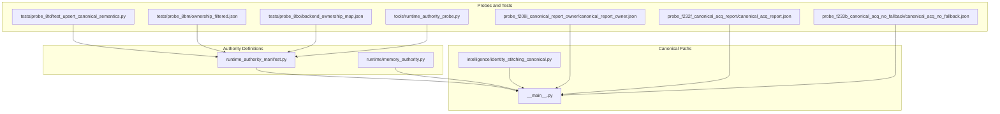
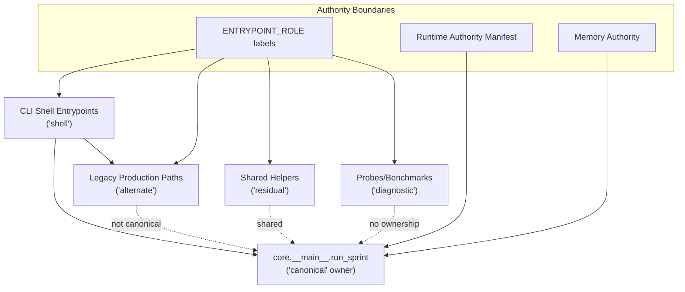
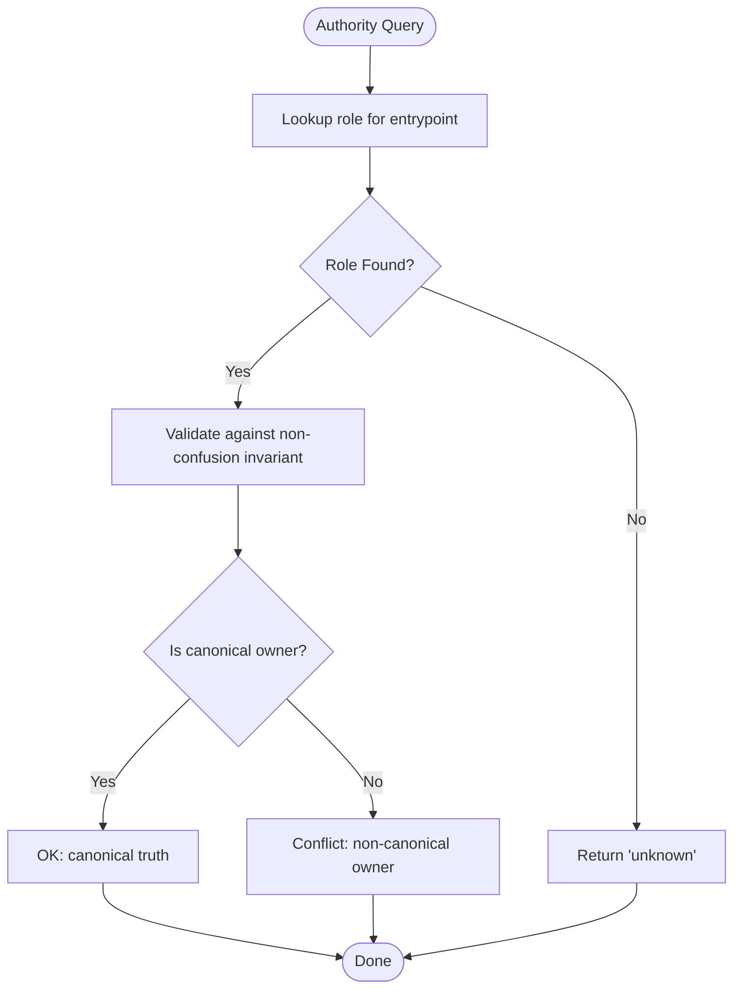
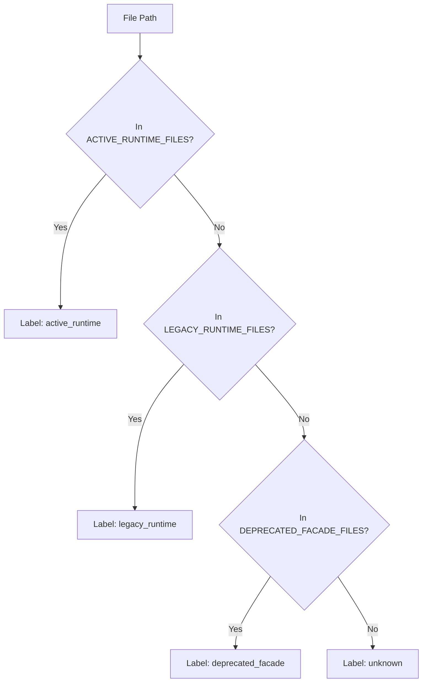
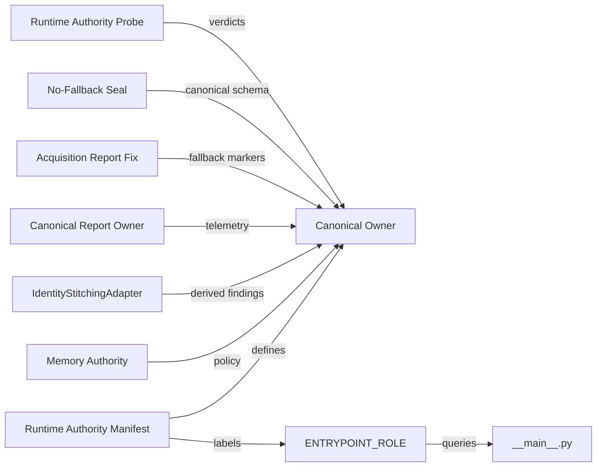

# Canonical Ownership Model

<cite>
**Referenced Files in This Document**
- [runtime_authority_manifest.py](file://runtime_authority_manifest.py)
- [memory_authority.py](file://runtime/memory_authority.py)
- [identity_stitching_canonical.py](file://intelligence/identity_stitching_canonical.py)
- [__main__.py](file://__main__.py)
- [test_upsert_canonical_semantics.py](file://tests/probe_8td/test_upsert_canonical_semantics.py)
- [ownership_filtered.json](file://tests/probe_8bm/ownership_filtered.json)
- [backend_ownership_map.json](file://tests/probe_8bo/backend_ownership_map.json)
- [canonical_report_owner.json](file://probe_f208i_canonical_report_owner/canonical_report_owner.json)
- [canonical_acq_report.json](file://probe_f232f_canonical_acq_report/canonical_acq_report.json)
- [canonical_acq_no_fallback.json](file://probe_f233b_canonical_acq_no_fallback/canonical_acq_no_fallback.json)
- [runtime_authority_probe.py](file://tools/runtime_authority_probe.py)
</cite>

## Table of Contents
1. [Introduction](#introduction)
2. [Project Structure](#project-structure)
3. [Core Components](#core-components)
4. [Architecture Overview](#architecture-overview)
5. [Detailed Component Analysis](#detailed-component-analysis)
6. [Dependency Analysis](#dependency-analysis)
7. [Performance Considerations](#performance-considerations)
8. [Troubleshooting Guide](#troubleshooting-guide)
9. [Conclusion](#conclusion)
10. [Appendices](#appendices)

## Introduction
This document explains the Canonical Ownership Model implemented in Hledac Universal. It defines a strict role taxonomy for entrypoints and runtime components, enforces a single-source-of-truth ownership for canonical sprint truth, and documents the authority boundaries that prevent conflicting ownership. It also covers boot hygiene, authority census tracking, and the transition from legacy paths to canonical ownership, with practical examples of role assignment, authority queries, and invariant enforcement.

## Project Structure
The Canonical Ownership Model spans several modules:
- Runtime authority boundary definitions and verification
- Memory authority boundary definitions
- Canonical adapters and derived findings
- Entry point role taxonomy and non-confusion invariants
- Canonical acquisition report ownership and sealing
- Tests and probes validating canonical semantics and authority

**Diagram sources**
- [runtime_authority_manifest.py:1-137](file://runtime_authority_manifest.py#L1-L137)
- [memory_authority.py:1-129](file://runtime/memory_authority.py#L1-L129)
- [__main__.py:47-204](file://__main__.py#L47-L204)
- [identity_stitching_canonical.py:1-508](file://intelligence/identity_stitching_canonical.py#L1-L508)
- [test_upsert_canonical_semantics.py:1-106](file://tests/probe_8td/test_upsert_canonical_semantics.py#L1-L106)
- [ownership_filtered.json:1-360](file://tests/probe_8bm/ownership_filtered.json#L1-L360)
- [backend_ownership_map.json:1-353](file://tests/probe_8bo/backend_ownership_map.json#L1-L353)
- [canonical_report_owner.json:1-48](file://probe_f208i_canonical_report_owner/canonical_report_owner.json#L1-L48)
- [canonical_acq_report.json:1-48](file://probe_f232f_canonical_acq_report/canonical_acq_report.json#L1-L48)
- [canonical_acq_no_fallback.json:1-70](file://probe_f233b_canonical_acq_no_fallback/canonical_acq_no_fallback.json#L1-L70)
- [runtime_authority_probe.py:209-229](file://tools/runtime_authority_probe.py#L209-L229)

**Section sources**
- [runtime_authority_manifest.py:1-137](file://runtime_authority_manifest.py#L1-L137)
- [memory_authority.py:1-129](file://runtime/memory_authority.py#L1-L129)
- [__main__.py:47-204](file://__main__.py#L47-L204)
- [identity_stitching_canonical.py:1-508](file://intelligence/identity_stitching_canonical.py#L1-L508)
- [test_upsert_canonical_semantics.py:1-106](file://tests/probe_8td/test_upsert_canonical_semantics.py#L1-L106)
- [ownership_filtered.json:1-360](file://tests/probe_8bm/ownership_filtered.json#L1-L360)
- [backend_ownership_map.json:1-353](file://tests/probe_8bo/backend_ownership_map.json#L1-L353)
- [canonical_report_owner.json:1-48](file://probe_f208i_canonical_report_owner/canonical_report_owner.json#L1-L48)
- [canonical_acq_report.json:1-48](file://probe_f232f_canonical_acq_report/canonical_acq_report.json#L1-L48)
- [canonical_acq_no_fallback.json:1-70](file://probe_f233b_canonical_acq_no_fallback/canonical_acq_no_fallback.json#L1-L70)
- [runtime_authority_probe.py:209-229](file://tools/runtime_authority_probe.py#L209-L229)

## Core Components
- ENTRYPOINT_AUTHORITY: Defines the role taxonomy and non-confusion invariants for all entrypoints. Roles include canonical, shell, alternate, residual, and diagnostic. It guarantees that only the canonical path produces canonical_run_summary with canonical_sprint_owner equal to the canonical owner.
- ENTRYPOINT_ROLE labels: Machine-readable labels for runtime files and symbols, enabling static authority checks and classification.
- Runtime Authority Manifest: Establishes the canonical owner, active runtime files, legacy runtime files, and deprecated facades. It enforces disjoint sets and provides verification routines.
- Memory Authority: Defines canonical memory governance and auxiliary roles, ensuring canonical UMA policy ownership remains in the canonical path.
- Canonical Acquisition Report: Ensures canonical acquisition telemetry is built and exported without fallback unless truly necessary, with explicit markers for downstream parsers.
- Canonical Adapter Pattern: Deterministic sidecars (e.g., identity stitching) produce derived findings that flow through canonical ingestion paths.

**Section sources**
- [__main__.py:47-204](file://__main__.py#L47-L204)
- [runtime_authority_manifest.py:83-137](file://runtime_authority_manifest.py#L83-L137)
- [memory_authority.py:1-129](file://runtime/memory_authority.py#L1-L129)
- [identity_stitching_canonical.py:1-508](file://intelligence/identity_stitching_canonical.py#L1-L508)
- [canonical_report_owner.json:1-48](file://probe_f208i_canonical_report_owner/canonical_report_owner.json#L1-L48)
- [canonical_acq_report.json:1-48](file://probe_f232f_canonical_acq_report/canonical_acq_report.json#L1-L48)
- [canonical_acq_no_fallback.json:1-70](file://probe_f233b_canonical_acq_no_fallback/canonical_acq_no_fallback.json#L1-L70)

## Architecture Overview
The Canonical Ownership Model enforces a strict separation of concerns:
- Canonical owner: core.__main__.run_sprint is the single source of truth for canonical sprint truth.
- Shell dispatcher: CLI entrypoints are shells that delegate to canonical or alternate paths; they never own sprint state.
- Alternate paths: Legacy production paths that are not canonical; used for migration and diagnostics.
- Residual paths: Shared helpers owned by multiple callers; not sprint owners.
- Diagnostic paths: Probes and benchmarks only; not for production sprints.
- Authority enforcement: Static manifests and runtime probes validate that canonical truth is produced by canonical paths and not duplicated by alternate or diagnostic paths.

**Diagram sources**
- [__main__.py:47-204](file://__main__.py#L47-L204)
- [runtime_authority_manifest.py:1-137](file://runtime_authority_manifest.py#L1-L137)
- [memory_authority.py:1-129](file://runtime/memory_authority.py#L1-L129)

## Detailed Component Analysis

### Role Taxonomy and ENTRYPOINT_AUTHORITY
- Roles:
  - canonical: sole production sprint owner; all truth flows from here.
  - shell: CLI dispatcher; never owns sprint state.
  - alternate: legacy production path; not canonical.
  - residual: shared helper; not a sprint owner.
  - diagnostic: probe/benchmark only; not production.
- Non-confusion invariant: Canonical path produces canonical_run_summary with canonical_sprint_owner equal to the canonical owner; no alternate or residual path may claim this field.
- Authority queries:
  - get_entrypoint_role(name): returns the role label for a named entrypoint.
  - get_entrypoint_authority_status(): returns a read-only copy of the authority definition.

Practical examples:
- Assign roles to entrypoints using the taxonomy; verify with get_entrypoint_role.
- Query authority status to confirm role assignments and non-confusion invariants.

**Section sources**
- [__main__.py:47-204](file://__main__.py#L47-L204)

### ENTRYPOINT_AUTHORITY Structure and Invariants
- Defines role summary and non-confusion invariant for canonical ownership.
- Provides read-only access to authority status and role lookup.

**Diagram sources**
- [__main__.py:177-182](file://__main__.py#L177-L182)
- [__main__.py:186-204](file://__main__.py#L186-L204)

**Section sources**
- [__main__.py:177-182](file://__main__.py#L177-L182)
- [__main__.py:186-204](file://__main__.py#L186-L204)

### Runtime Authority Manifest and Disjoint Sets
- Canonical owner: core.__main__.run_sprint.
- Active runtime files: workers/executors that receive work from canonical owner; they may NOT emit canonical truth.
- Legacy runtime files: must never produce canonical truth.
- Deprecated facades: re-export facades delegating to legacy; runners must label output as "facade/legacy".
- Verification: static checks ensure canonical owner defined, active/legacy/facade sets non-empty, and no overlaps.

Practical examples:
- Classify a file path using get_runtime_label to determine whether it belongs to active_runtime, legacy_runtime, deprecated_facade, or unknown.
- Run verify_authority to validate manifest structure.

**Diagram sources**
- [runtime_authority_manifest.py:124-137](file://runtime_authority_manifest.py#L124-L137)

**Section sources**
- [runtime_authority_manifest.py:1-137](file://runtime_authority_manifest.py#L1-L137)

### Memory Authority Boundary
- Canonical path: core/resource_governor.py is the canonical UMA policy owner.
- Raw samplers and helpers are not policy owners.
- Layer system and allocator components are not canonical policy owners.
- Legacy AO-only components and facades are not canonical sprint paths.
- Classification helpers support exact path matches, partial path matches, and keyword-based fallback.

Practical examples:
- Classify a symbol or file path using classify_memory_symbol to determine its memory authority role.
- Use get_memory_authority_status to inspect the authority map.

**Section sources**
- [memory_authority.py:1-129](file://runtime/memory_authority.py#L1-L129)

### Canonical Adapter Pattern: Identity Stitching
- Deterministic sidecar adapter that converts entity signals to identity candidates and derived findings.
- Bounded computation and fail-soft behavior to avoid disrupting canonical sprints.
- Derived findings are ingested via the canonical async_ingest_findings_batch path.
- Graph edges are advisory upserts through knowledge.graph_service.

Practical examples:
- Extract and stitch profiles to produce IdentityCandidate list.
- Convert candidates to CanonicalFinding objects for canonical ingestion.
- Upsert identity edges to the graph service.

**Section sources**
- [identity_stitching_canonical.py:1-508](file://intelligence/identity_stitching_canonical.py#L1-L508)

### Canonical Acquisition Report Ownership
- Canonical acquisition report must be built by the canonical path and exported without fallback unless truly necessary.
- Explicit markers indicate fallback usage for downstream parsers.
- Ownership chain: SprintSchedulerResult → build_acquisition_report() → _scheduler_result_acquisition_payload() → ExportHandoff.scorecard → JSON export → parser → KPI validation.

Practical examples:
- Ensure canonical build succeeds and sets schema_version to f208.v1 without fallback suffix.
- Verify acquisition_report_fallback_used marker is False for canonical builds.
- Confirm fallback path preserves nonfeed fields and expected lanes.

**Section sources**
- [canonical_report_owner.json:1-48](file://probe_f208i_canonical_report_owner/canonical_report_owner.json#L1-L48)
- [canonical_acq_report.json:1-48](file://probe_f232f_canonical_acq_report/canonical_acq_report.json#L1-L48)
- [canonical_acq_no_fallback.json:1-70](file://probe_f233b_canonical_acq_no_fallback/canonical_acq_no_fallback.json#L1-L70)

### Boot Hygiene and Authority Census Tracking
- Authority probes and tests validate that canonical truth is produced and not duplicated by alternate or diagnostic paths.
- Ownership filtered and backend ownership map tests enumerate which subsystems touch canonical vs legacy paths.
- UpserIocBatch semantics lock canonical creation-only behavior to prevent duplication.

Practical examples:
- Run runtime_authority_probe to derive verdicts for canonical vs non-canonical paths.
- Use ownership_filtered.json and backend_ownership_map.json to track authority census across subsystems.
- Validate upsert semantics with test_upsert_canonical_semantics to ensure idempotent creation-only behavior.

**Section sources**
- [runtime_authority_probe.py:209-229](file://tools/runtime_authority_probe.py#L209-L229)
- [ownership_filtered.json:1-360](file://tests/probe_8bm/ownership_filtered.json#L1-L360)
- [backend_ownership_map.json:1-353](file://tests/probe_8bo/backend_ownership_map.json#L1-L353)
- [test_upsert_canonical_semantics.py:1-106](file://tests/probe_8td/test_upsert_canonical_semantics.py#L1-L106)

## Dependency Analysis
The Canonical Ownership Model relies on:
- Static authority manifests to define canonical, active, legacy, and facade boundaries.
- Runtime probes to validate that canonical truth is produced and not duplicated.
- Canonical adapters to produce derived findings that flow through canonical ingestion paths.
- Acquisition report builders to ensure canonical telemetry is exported without fallback unless necessary.

**Diagram sources**
- [runtime_authority_manifest.py:1-137](file://runtime_authority_manifest.py#L1-L137)
- [memory_authority.py:1-129](file://runtime/memory_authority.py#L1-L129)
- [__main__.py:47-204](file://__main__.py#L47-L204)
- [identity_stitching_canonical.py:1-508](file://intelligence/identity_stitching_canonical.py#L1-L508)
- [canonical_report_owner.json:1-48](file://probe_f208i_canonical_report_owner/canonical_report_owner.json#L1-L48)
- [canonical_acq_report.json:1-48](file://probe_f232f_canonical_acq_report/canonical_acq_report.json#L1-L48)
- [canonical_acq_no_fallback.json:1-70](file://probe_f233b_canonical_acq_no_fallback/canonical_acq_no_fallback.json#L1-L70)
- [runtime_authority_probe.py:209-229](file://tools/runtime_authority_probe.py#L209-L229)

**Section sources**
- [runtime_authority_manifest.py:1-137](file://runtime_authority_manifest.py#L1-L137)
- [memory_authority.py:1-129](file://runtime/memory_authority.py#L1-L129)
- [__main__.py:47-204](file://__main__.py#L47-L204)
- [identity_stitching_canonical.py:1-508](file://intelligence/identity_stitching_canonical.py#L1-L508)
- [canonical_report_owner.json:1-48](file://probe_f208i_canonical_report_owner/canonical_report_owner.json#L1-L48)
- [canonical_acq_report.json:1-48](file://probe_f232f_canonical_acq_report/canonical_acq_report.json#L1-L48)
- [canonical_acq_no_fallback.json:1-70](file://probe_f233b_canonical_acq_no_fallback/canonical_acq_no_fallback.json#L1-L70)
- [runtime_authority_probe.py:209-229](file://tools/runtime_authority_probe.py#L209-L229)

## Performance Considerations
- Canonical adapters implement bounded computation and fail-soft behavior to avoid impacting canonical sprint performance.
- Memory authority ensures canonical UMA policy ownership remains in the canonical path, preventing unnecessary cross-path invocations.
- Acquisition report building is pure and only reads result attributes, minimizing overhead.

## Troubleshooting Guide
Common issues and resolutions:
- Conflicting ownership: If alternate or diagnostic paths attempt to claim canonical_sprint_owner, the non-confusion invariant will detect it. Use get_entrypoint_role to verify roles and ENTRYPOINT_AUTHORITY to validate invariants.
- Fallback acquisition report: Ensure canonical build succeeds and sets acquisition_report_fallback_used to False. Use canonical_acq_no_fallback.json tests as a reference for expected behavior.
- Memory authority violations: Verify that only canonical memory governor participates in UMA policy decisions. Use classify_memory_symbol to classify symbols and get_memory_authority_status to inspect the authority map.
- UpserIocBatch duplication: Validate that upsert semantics return created-only IDs and that flush_buffers reports newly created counts, not total buffered.

**Section sources**
- [__main__.py:177-182](file://__main__.py#L177-L182)
- [canonical_acq_no_fallback.json:1-70](file://probe_f233b_canonical_acq_no_fallback/canonical_acq_no_fallback.json#L1-L70)
- [memory_authority.py:76-129](file://runtime/memory_authority.py#L76-L129)
- [test_upsert_canonical_semantics.py:22-106](file://tests/probe_8td/test_upsert_canonical_semantics.py#L22-L106)

## Conclusion
The Canonical Ownership Model in Hledac Universal establishes a robust, machine-checkable authority boundary that prevents conflicting ownership and ensures canonical truth is produced exclusively by the canonical path. Through ENTRYPOINT_AUTHORITY, runtime authority manifests, memory authority definitions, and canonical acquisition report sealing, the system enforces non-confusion invariants, supports boot hygiene, and enables reliable transitions from legacy paths to canonical ownership.

## Appendices

### Practical Examples Index
- Role assignment and authority queries:
  - Use get_entrypoint_role to classify entrypoints.
  - Use get_entrypoint_authority_status to inspect authority definitions.
- Authority verification:
  - Use verify_authority to validate runtime authority manifest structure.
  - Use runtime_authority_probe to derive verdicts for canonical vs non-canonical paths.
- Canonical acquisition report:
  - Ensure canonical build sets schema_version to f208.v1 and acquisition_report_fallback_used to False.
  - Validate fallback markers and preservation of nonfeed fields.
- Derived findings:
  - Convert IdentityCandidate to CanonicalFinding and ingest via canonical path.
- UpserIocBatch semantics:
  - Validate created-only behavior and flush_buffers reporting.

[No sources needed since this section aggregates previously cited examples]