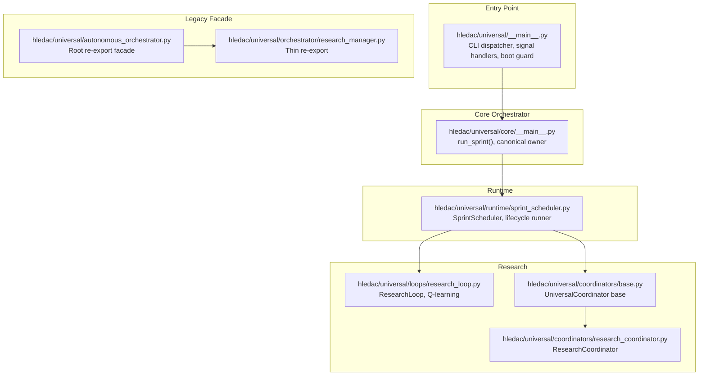
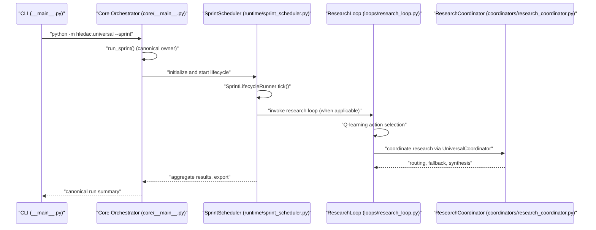
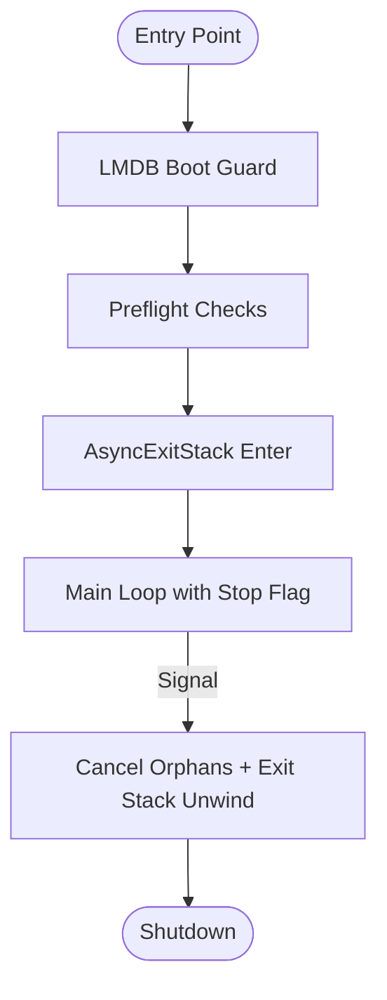
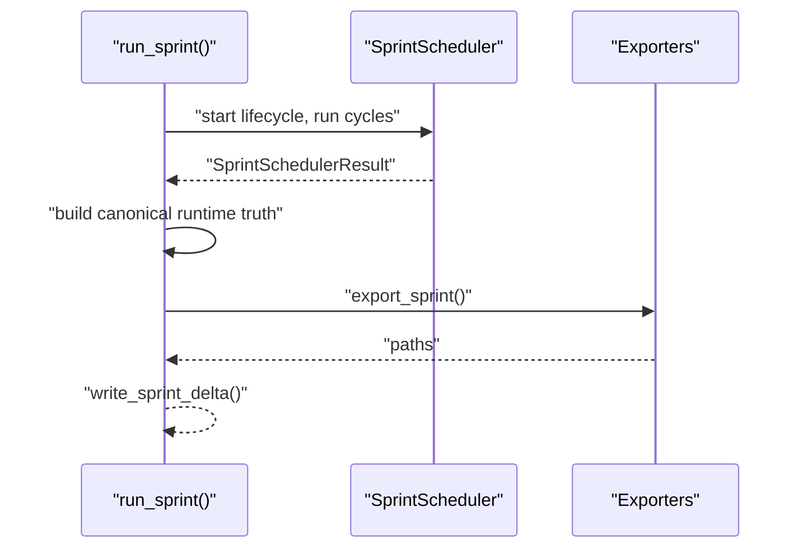
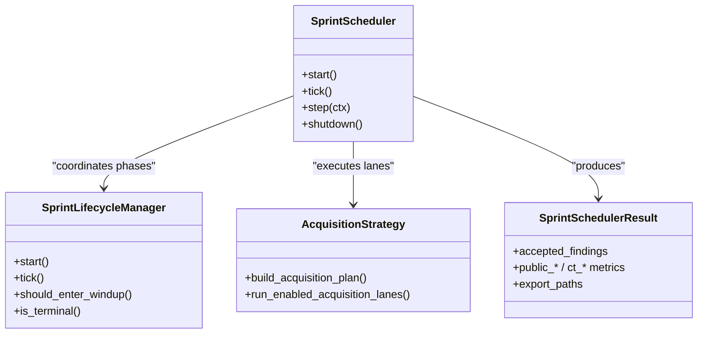
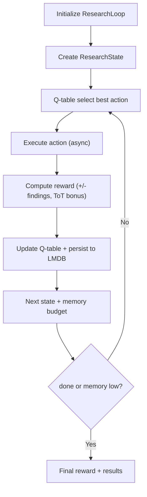
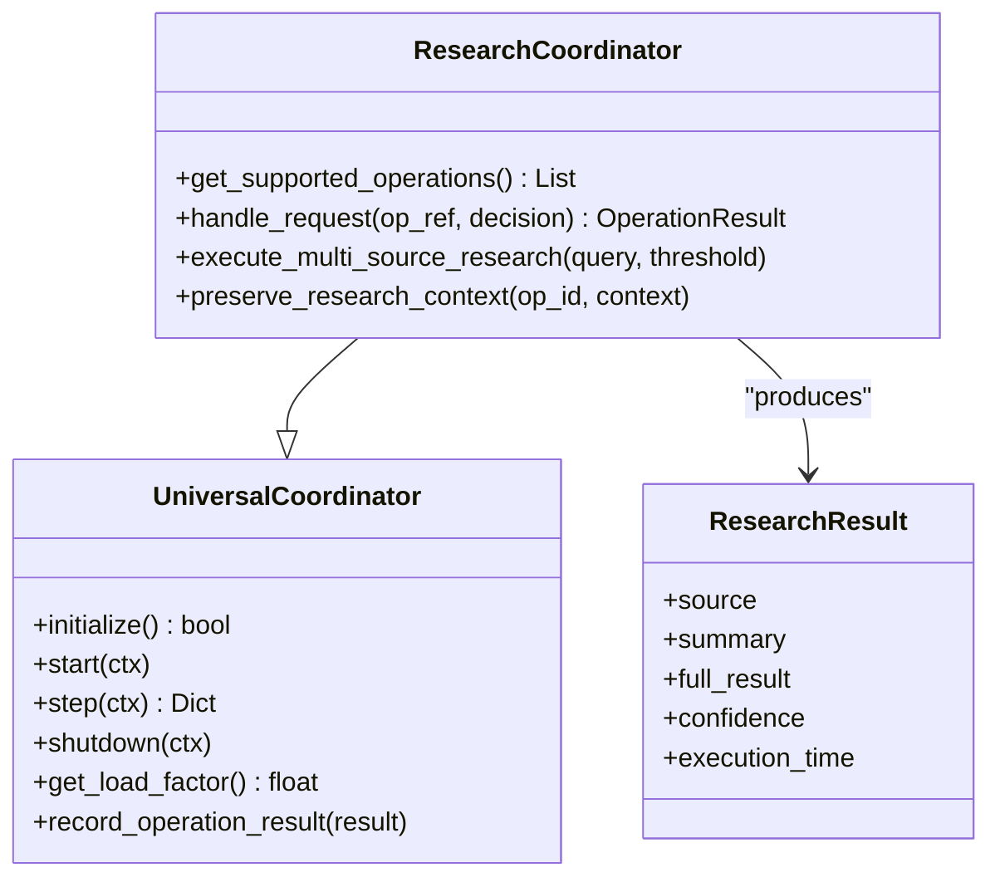
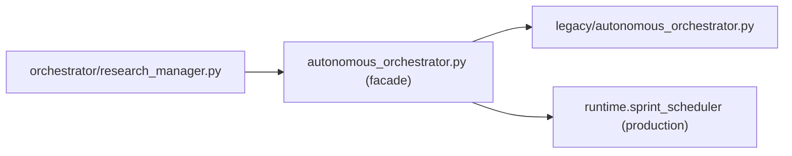
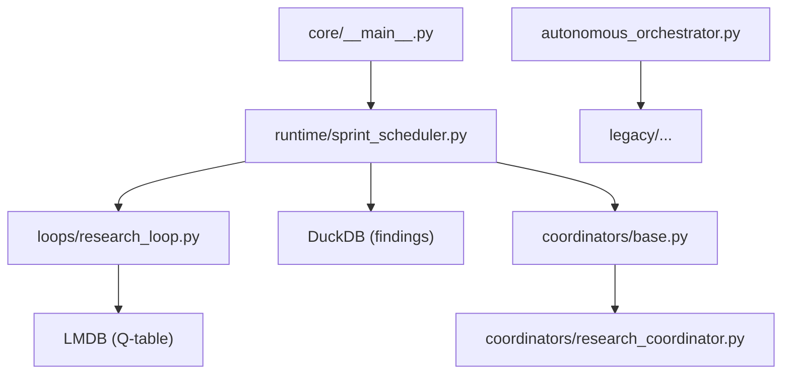

# Component Interactions

<cite>
**Referenced Files in This Document**
- [__main__.py](file://hledac/universal/__main__.py)
- [core/__main__.py](file://hledac/universal/core/__main__.py)
- [sprint_scheduler.py](file://hledac/universal/runtime/sprint_scheduler.py)
- [research_loop.py](file://hledac/universal/loops/research_loop.py)
- [base.py](file://hledac/universal/coordinators/base.py)
- [research_coordinator.py](file://hledac/universal/coordinators/research_coordinator.py)
- [autonomous_orchestrator.py](file://hledac/universal/autonomous_orchestrator.py)
- [research_manager.py](file://hledac/universal/orchestrator/research_manager.py)
</cite>

## Table of Contents
1. [Introduction](#introduction)
2. [Project Structure](#project-structure)
3. [Core Components](#core-components)
4. [Architecture Overview](#architecture-overview)
5. [Detailed Component Analysis](#detailed-component-analysis)
6. [Dependency Analysis](#dependency-analysis)
7. [Performance Considerations](#performance-considerations)
8. [Troubleshooting Guide](#troubleshooting-guide)
9. [Conclusion](#conclusion)

## Introduction
This document explains the component interaction patterns within Hledac Universal’s core architecture, focusing on the data flow between the main entry point, the core orchestrator, and research loop controllers. It details communication protocols, message passing mechanisms, state synchronization strategies, canonical ownership enforcement, dependency injection patterns, factory implementations, plugin architecture hooks, event-driven communication, observer patterns, notifications, cross-component resource sharing, ownership transfer mechanisms, lifecycle coordination, architectural boundaries, interface contracts, and error propagation strategies that maintain system stability.

## Project Structure
Hledac Universal separates concerns across:
- Entry point and boot hygiene: CLI dispatch, signal handling, async teardown, and preflight checks
- Core orchestrator: canonical owner of sprints, lifecycle management, and result aggregation
- Runtime scheduler: tier-aware execution, acquisition strategy, and export
- Research loop controllers: reinforcement learning-driven research iteration
- Coordinators: universal base and specialized research coordination with memory-awareness and graceful degradation
- Legacy re-export facade: backward compatibility layer for legacy orchestrator

**Diagram sources**
- [__main__.py:1-200](file://hledac/universal/__main__.py#L1-L200)
- [core/__main__.py:1-120](file://hledac/universal/core/__main__.py#L1-L120)
- [sprint_scheduler.py:1-120](file://hledac/universal/runtime/sprint_scheduler.py#L1-L120)
- [research_loop.py:1-120](file://hledac/universal/loops/research_loop.py#L1-L120)
- [base.py:1-120](file://hledac/universal/coordinators/base.py#L1-L120)
- [research_coordinator.py:1-120](file://hledac/universal/coordinators/research_coordinator.py#L1-L120)
- [autonomous_orchestrator.py:1-120](file://hledac/universal/autonomous_orchestrator.py#L1-L120)
- [research_manager.py:1-29](file://hledac/universal/orchestrator/research_manager.py#L1-L29)

**Section sources**
- [__main__.py:1-200](file://hledac/universal/__main__.py#L1-L200)
- [core/__main__.py:1-120](file://hledac/universal/core/__main__.py#L1-L120)

## Core Components
- Entry point and boot hygiene: establishes signal handlers, LMDB boot guard, preflight checks, and async teardown via AsyncExitStack
- Core orchestrator: canonical owner of sprints, responsible for lifecycle boundaries, result aggregation, and canonical truth surfaces
- Runtime scheduler: tier-aware execution, acquisition strategy, and export; coordinates lanes and phases
- Research loop controller: RL-driven research iteration with Q-table persistence, action selection, and reward computation
- Universal coordinator base: memory-aware capacity management, graceful degradation, operation lifecycle, and metrics
- Research coordinator: multi-source routing, confidence-based decisions, fallback chains, and synthesis
- Legacy re-export facade: backward compatibility for legacy orchestrator APIs

**Section sources**
- [core/__main__.py:1-120](file://hledac/universal/core/__main__.py#L1-L120)
- [sprint_scheduler.py:1-120](file://hledac/universal/runtime/sprint_scheduler.py#L1-L120)
- [research_loop.py:1-120](file://hledac/universal/loops/research_loop.py#L1-L120)
- [base.py:1-120](file://hledac/universal/coordinators/base.py#L1-L120)
- [research_coordinator.py:1-120](file://hledac/universal/coordinators/research_coordinator.py#L1-L120)
- [autonomous_orchestrator.py:1-120](file://hledac/universal/autonomous_orchestrator.py#L1-L120)

## Architecture Overview
The canonical ownership model enforces that only the core orchestrator is the “sole production sprint owner.” All report truth, timing truth, and export truth flow from the canonical owner. Alternate and residual paths exist for diagnostics and legacy compatibility but do not claim canonical ownership.

**Diagram sources**
- [__main__.py:70-183](file://hledac/universal/__main__.py#L70-L183)
- [core/__main__.py:1-120](file://hledac/universal/core/__main__.py#L1-L120)
- [sprint_scheduler.py:1-120](file://hledac/universal/runtime/sprint_scheduler.py#L1-L120)
- [research_loop.py:1-120](file://hledac/universal/loops/research_loop.py#L1-L120)
- [research_coordinator.py:1-120](file://hledac/universal/coordinators/research_coordinator.py#L1-L120)

## Detailed Component Analysis

### Entry Point and Boot Hygiene
- Signal handling: installs SIGINT/SIGTERM handlers to set a teardown flag and stop the loop cleanly
- Boot guard: LMDB boot guard runs synchronously before async runtime to remove stale locks
- Preflight checks: capability checks for Metal, memory, and other runtime prerequisites
- Async teardown: AsyncExitStack manages LIFO cleanup, orphan task cancellation, and resource ownership tracking
- Authority roles: canonical owner, shell/dispatcher, alternate, residual, and diagnostic roles are explicitly labeled

**Diagram sources**
- [__main__.py:356-576](file://hledac/universal/__main__.py#L356-L576)

**Section sources**
- [__main__.py:356-576](file://hledac/universal/__main__.py#L356-L576)

### Core Orchestrator (Canonical Owner)
- Canonical owner: run_sprint() is the sole production sprint owner; all report truth flows from here
- Role taxonomy: canonical, shell, alternate, residual, diagnostic with explicit non-confusion invariants
- Result aggregation: builds canonical runtime truth, acquisition reports, and export paths
- Integration: delegates to runtime scheduler and collects results for export

**Diagram sources**
- [core/__main__.py:1-120](file://hledac/universal/core/__main__.py#L1-L120)

**Section sources**
- [core/__main__.py:1-120](file://hledac/universal/core/__main__.py#L1-L120)

### Runtime Scheduler (Tier-Aware Execution)
- Tier ordering: surface → structured_ti → deep → archive → other
- Lifecycle integration: uses SprintLifecycleManager for phase transitions and wind-down
- Acquisition strategy: builds acquisition plans, tracks terminality, and maintains nonfeed candidate ledger
- Results: comprehensive counters for public/CT/findings, quality rejections, and CT bridge loss stages

**Diagram sources**
- [sprint_scheduler.py:1-200](file://hledac/universal/runtime/sprint_scheduler.py#L1-L200)

**Section sources**
- [sprint_scheduler.py:1-200](file://hledac/universal/runtime/sprint_scheduler.py#L1-L200)

### Research Loop Controllers (RL-Driven)
- ResearchLoop: RL-driven iteration with Q-learning, action selection, reward computation, and Q-table persistence
- Actions: hypothesis generation, ToT reasoning, discovery, fetch, graph update, evaluation, done
- Persistence: Q-table serialized to LMDB via memory manager; asynchronous persistence after updates
- Deduplication: fingerprint-based deduplication across findings; final reward computed from unique findings and cycles

**Diagram sources**
- [research_loop.py:333-450](file://hledac/universal/loops/research_loop.py#L333-L450)

**Section sources**
- [research_loop.py:1-200](file://hledac/universal/loops/research_loop.py#L1-L200)

### Universal Coordinator Base and Research Coordinator
- UniversalCoordinator: memory-aware load factor, graceful degradation, operation lifecycle, metrics, and spine pattern interface (start/step/shutdown)
- ResearchCoordinator: multi-source routing (Unified AI, Evidence, RAG), confidence-based decisions, fallback chains, synthesis, and deep excavation features
- Integration: ResearchCoordinator extends UniversalCoordinator and integrates with research backends lazily

**Diagram sources**
- [base.py:88-178](file://hledac/universal/coordinators/base.py#L88-L178)
- [research_coordinator.py:172-234](file://hledac/universal/coordinators/research_coordinator.py#L172-L234)

**Section sources**
- [base.py:1-200](file://hledac/universal/coordinators/base.py#L1-L200)
- [research_coordinator.py:1-200](file://hledac/universal/coordinators/research_coordinator.py#L1-L200)

### Legacy Re-Export Facade and Thin Re-exports
- Root re-export facade: autonomous_orchestrator.py is a backward compatibility facade pointing to legacy implementation
- Canonical ownership chain: facade → legacy → production runtime.sprint_scheduler
- Thin re-export: orchestrator/research_manager.py re-exports _ResearchManager from the facade

**Diagram sources**
- [autonomous_orchestrator.py:1-120](file://hledac/universal/autonomous_orchestrator.py#L1-L120)
- [research_manager.py:1-29](file://hledac/universal/orchestrator/research_manager.py#L1-L29)

**Section sources**
- [autonomous_orchestrator.py:1-120](file://hledac/universal/autonomous_orchestrator.py#L1-L120)
- [research_manager.py:1-29](file://hledac/universal/orchestrator/research_manager.py#L1-L29)

## Dependency Analysis
- Ownership enforcement: canonical owner role is enforced by explicit labels and non-confusion invariants; alternate and residual paths cannot claim canonical ownership
- Component coupling: runtime scheduler depends on lifecycle manager and acquisition strategy; research loop depends on memory manager for Q-table persistence; research coordinator depends on universal base and research backends
- External dependencies: LMDB for Q-table persistence, DuckDB for findings storage, asyncio for concurrency, psutil/Metal for preflight checks
- Potential circular dependencies: none observed; facade re-exports are shallow and do not introduce cycles

**Diagram sources**
- [core/__main__.py:1-120](file://hledac/universal/core/__main__.py#L1-L120)
- [sprint_scheduler.py:1-120](file://hledac/universal/runtime/sprint_scheduler.py#L1-L120)
- [research_loop.py:1-120](file://hledac/universal/loops/research_loop.py#L1-L120)
- [base.py:1-120](file://hledac/universal/coordinators/base.py#L1-L120)
- [research_coordinator.py:1-120](file://hledac/universal/coordinators/research_coordinator.py#L1-L120)
- [autonomous_orchestrator.py:1-120](file://hledac/universal/autonomous_orchestrator.py#L1-L120)

**Section sources**
- [core/__main__.py:1-120](file://hledac/universal/core/__main__.py#L1-L120)
- [sprint_scheduler.py:1-120](file://hledac/universal/runtime/sprint_scheduler.py#L1-L120)
- [research_loop.py:1-120](file://hledac/universal/loops/research_loop.py#L1-L120)
- [base.py:1-120](file://hledac/universal/coordinators/base.py#L1-L120)
- [research_coordinator.py:1-120](file://hledac/universal/coordinators/research_coordinator.py#L1-L120)
- [autonomous_orchestrator.py:1-120](file://hledac/universal/autonomous_orchestrator.py#L1-L120)

## Performance Considerations
- Async I/O and bounded memory: research loop optimized for async I/O and bounded memory footprint
- Memory-aware scheduling: universal coordinator computes load factor considering memory pressure for M1 optimization
- GC tuning: pre-sprint GC freeze and thresholds configured for stability on M1
- Concurrency: runtime scheduler uses TaskGroup for owned concurrency; AsyncExitStack ensures orderly teardown
- Persistence: Q-table persistence to LMDB is asynchronous to minimize latency spikes

[No sources needed since this section provides general guidance]

## Troubleshooting Guide
- Signal-safe teardown: signal handlers set a flag and stop the loop; cleanup occurs in AsyncExitStack unwind
- Boot guard failures: LMDB boot guard errors indicate stale locks; investigate and resolve before retry
- Preflight failures: Metal availability and memory checks inform runtime readiness; address resource constraints
- Research loop persistence: Q-table load/persist failures logged; verify LMDB availability and permissions
- Coordinator capacity: use capacity info and load factor to detect overload; adjust max_concurrent and memory awareness thresholds

**Section sources**
- [__main__.py:356-576](file://hledac/universal/__main__.py#L356-L576)
- [research_loop.py:277-332](file://hledac/universal/loops/research_loop.py#L277-L332)
- [base.py:308-378](file://hledac/universal/coordinators/base.py#L308-L378)

## Conclusion
Hledac Universal enforces canonical ownership through explicit role labeling and non-confusion invariants, ensuring that only the core orchestrator produces canonical run summaries and truth surfaces. The runtime scheduler coordinates tier-aware execution and acquisition strategy, while the research loop controller applies RL-driven planning with Q-table persistence. The universal coordinator base and research coordinator implement memory-aware capacity management, graceful degradation, and multi-source routing with synthesis. Event-driven communication, observer patterns, and notification systems are integrated via lifecycle adapters, operation tracking, and metrics. Cross-component resource sharing is managed through AsyncExitStack ownership tracking, and lifecycle coordination ensures stable teardown. Dependency injection patterns and factory implementations are evident in the facade re-exports and lazy initialization of research backends.