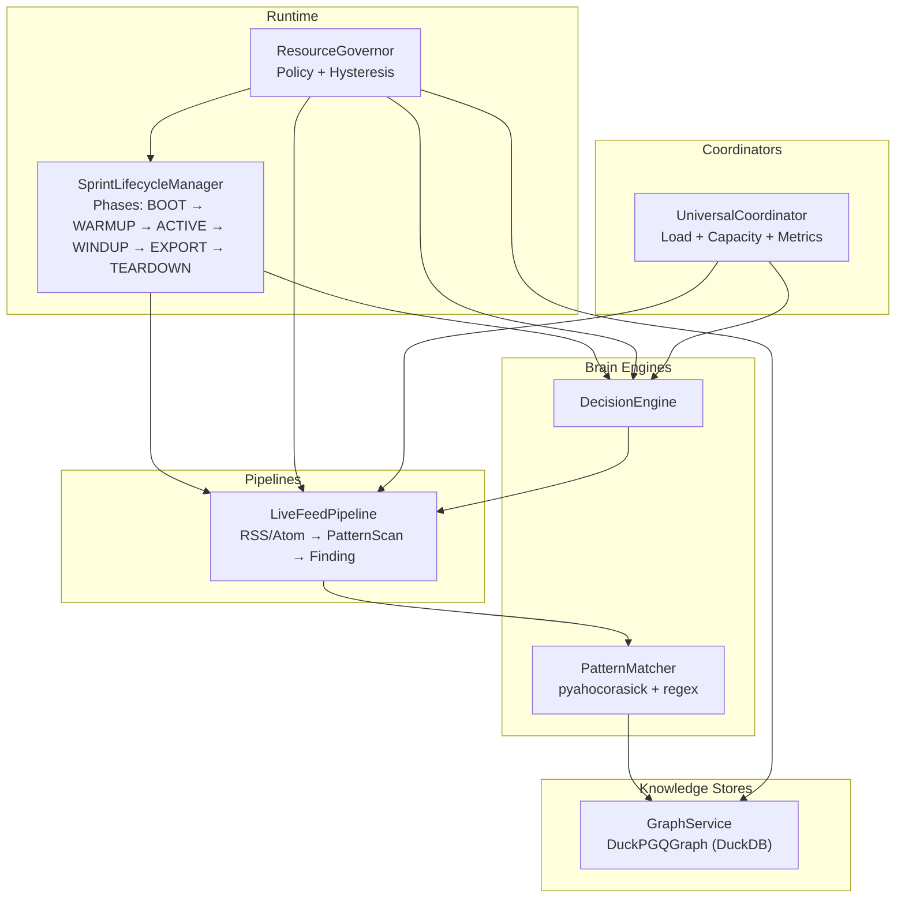
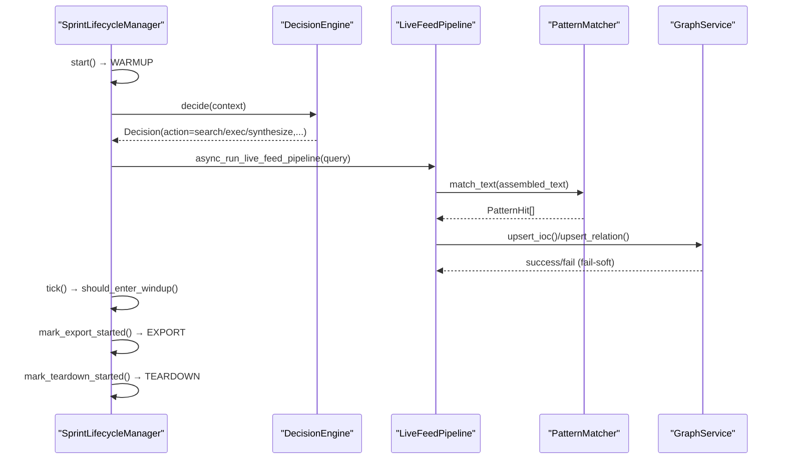
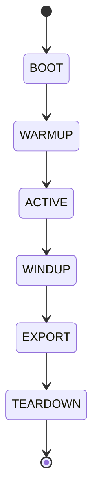
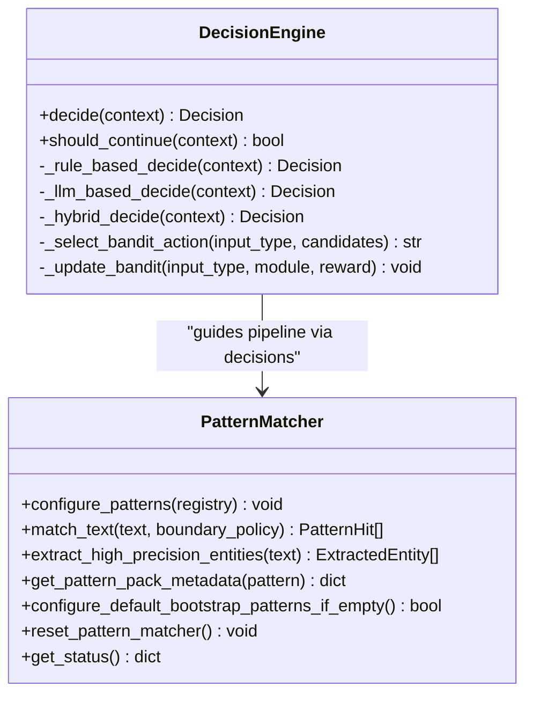
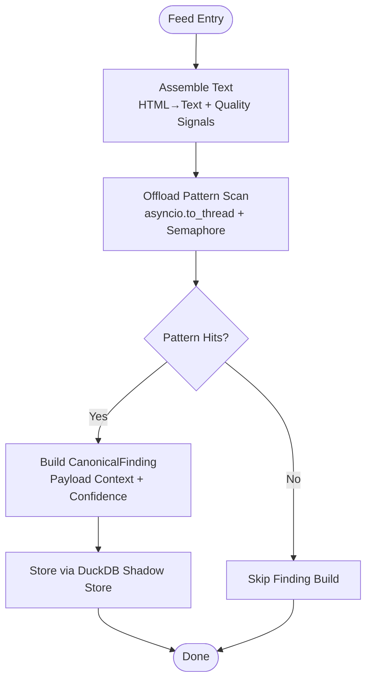
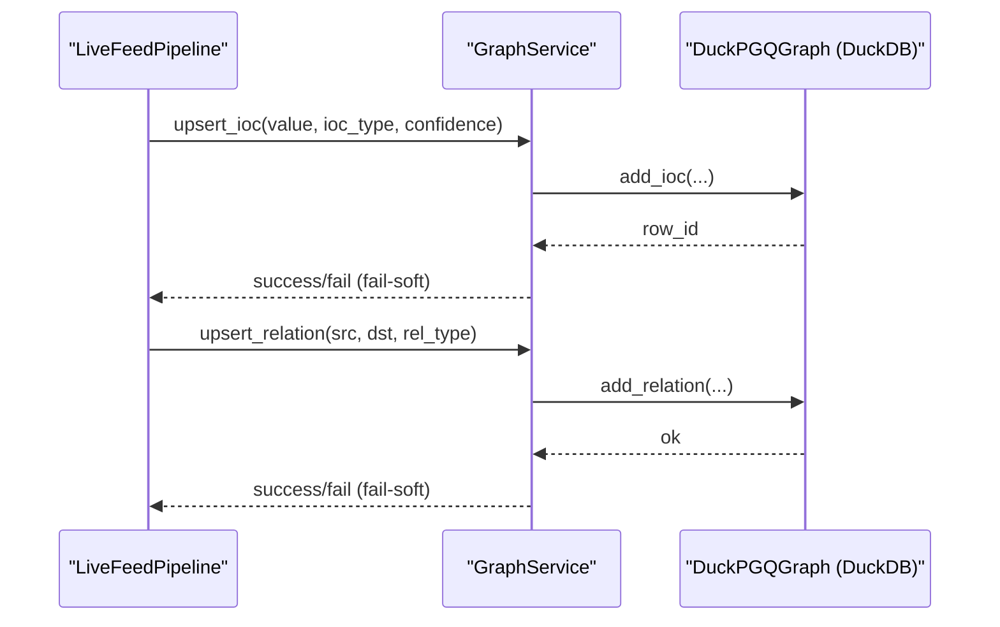
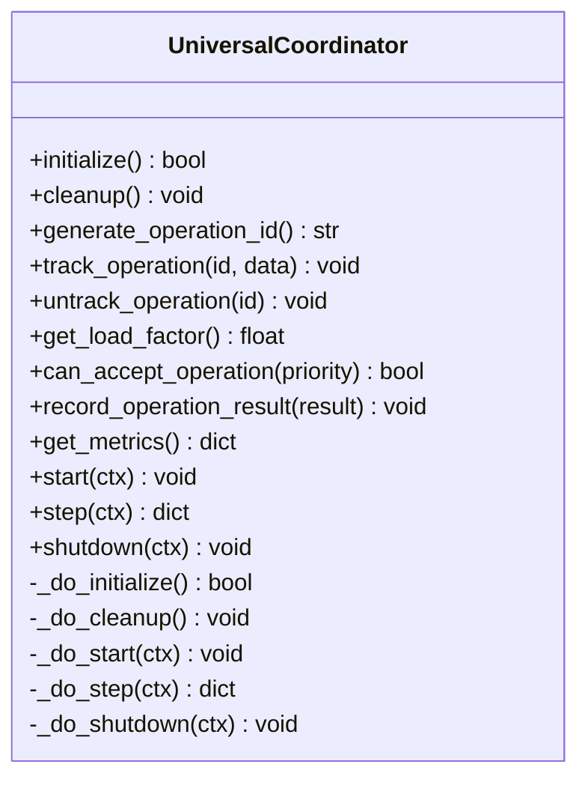
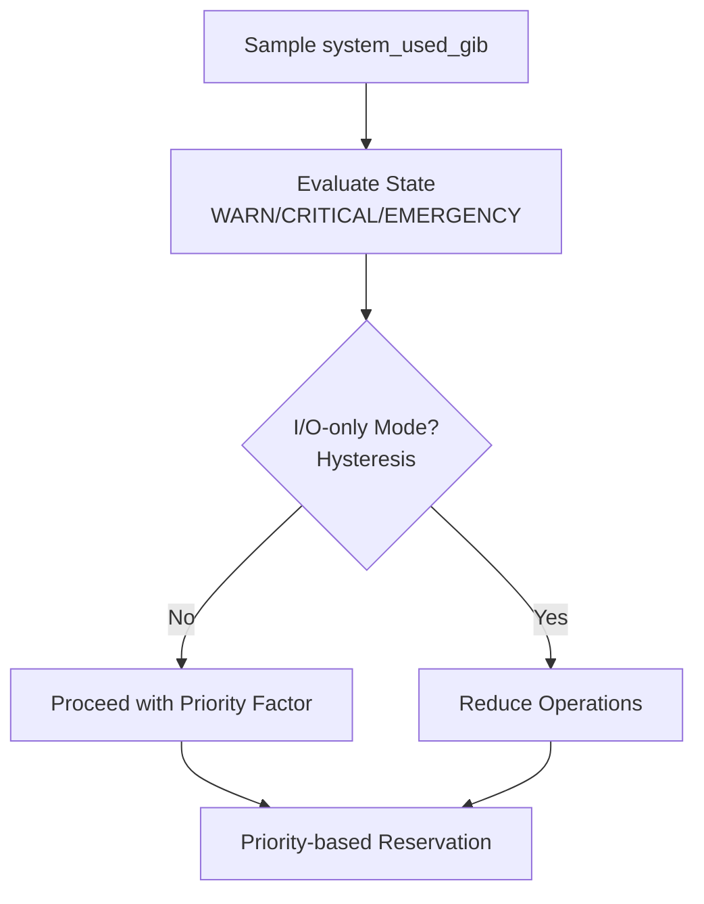
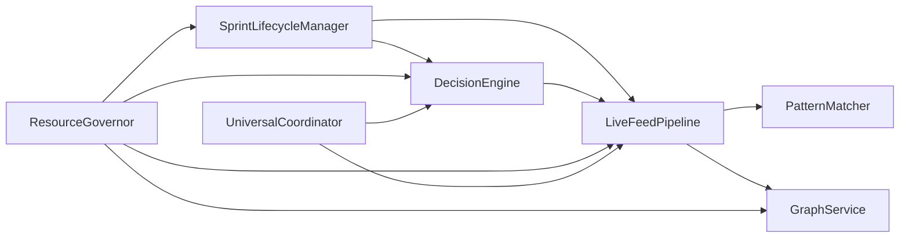

# Component Relationships and Data Flow

<cite>
**Referenced Files in This Document**
- [config.py](file://config.py)
- [autonomous_orchestrator.py](file://autonomous_orchestrator.py)
- [brain/decision_engine.py](file://brain/decision_engine.py)
- [patterns/pattern_matcher.py](file://patterns/pattern_matcher.py)
- [pipeline/live_feed_pipeline.py](file://pipeline/live_feed_pipeline.py)
- [runtime/sprint_lifecycle.py](file://runtime/sprint_lifecycle.py)
- [coordinators/base.py](file://coordinators/base.py)
- [knowledge/graph_service.py](file://knowledge/graph_service.py)
- [core/resource_governor.py](file://core/resource_governor.py)
- [requirements.txt](file://requirements.txt)
- [__main__.py](file://__main__.py)
</cite>

## Table of Contents
1. [Introduction](#introduction)
2. [Project Structure](#project-structure)
3. [Core Components](#core-components)
4. [Architecture Overview](#architecture-overview)
5. [Detailed Component Analysis](#detailed-component-analysis)
6. [Dependency Analysis](#dependency-analysis)
7. [Performance Considerations](#performance-considerations)
8. [Troubleshooting Guide](#troubleshooting-guide)
9. [Conclusion](#conclusion)
10. [Appendices](#appendices)

## Introduction
This document describes the component relationships and data flow patterns in Hledac Universal. It focuses on how brain engines, knowledge stores, pipeline systems, and runtime managers coordinate during a sprint. It also explains the canonical sprint ownership model, how it coordinates with alternate paths, and how data flows from feed ingestion through pattern matching to knowledge graph updates. Cross-cutting concerns such as security, monitoring, and resource management are addressed along with technology stack dependencies and version compatibility.

## Project Structure
Hledac Universal is organized into cohesive subsystems:
- Runtime and lifecycle management: orchestrates phases and timing
- Brain engines: decision-making and inference
- Pipelines: ingestion and pattern-based finding generation
- Knowledge stores: graph persistence and analytics
- Coordinators: operation lifecycle and capacity management
- Resource governance: memory and thermal budgets
- Security and privacy: layered controls and obfuscation
- Monitoring and dashboards: telemetry and reporting

**Diagram sources**
- [runtime/sprint_lifecycle.py:54-531](file://runtime/sprint_lifecycle.py#L54-L531)
- [core/resource_governor.py:168-195](file://core/resource_governor.py#L168-L195)
- [brain/decision_engine.py:55-257](file://brain/decision_engine.py#L55-L257)
- [patterns/pattern_matcher.py:619-800](file://patterns/pattern_matcher.py#L619-L800)
- [pipeline/live_feed_pipeline.py:1-800](file://pipeline/live_feed_pipeline.py#L1-L800)
- [knowledge/graph_service.py:33-311](file://knowledge/graph_service.py#L33-L311)
- [coordinators/base.py:88-553](file://coordinators/base.py#L88-L553)

**Section sources**
- [runtime/sprint_lifecycle.py:54-531](file://runtime/sprint_lifecycle.py#L54-L531)
- [core/resource_governor.py:168-195](file://core/resource_governor.py#L168-L195)
- [brain/decision_engine.py:55-257](file://brain/decision_engine.py#L55-L257)
- [patterns/pattern_matcher.py:619-800](file://patterns/pattern_matcher.py#L619-L800)
- [pipeline/live_feed_pipeline.py:1-800](file://pipeline/live_feed_pipeline.py#L1-L800)
- [knowledge/graph_service.py:33-311](file://knowledge/graph_service.py#L33-L311)
- [coordinators/base.py:88-553](file://coordinators/base.py#L88-L553)

## Core Components
- Runtime and lifecycle: the canonical owner of sprint phases and timing, enforcing hard invariants and providing diagnostics.
- Brain engines: decision-making and inference modules that guide research steps and synthesis.
- Pipelines: passive, public-only ingestion pipelines that transform feed content into structured findings via pattern scanning.
- Knowledge stores: graph-backed persistence and analytics for IOC relations and entity histories.
- Coordinators: operation lifecycle, load management, and capacity-aware scheduling.
- Resource governance: unified policy for memory and thermal thresholds with hysteresis and async alarms.
- Security and privacy: layered obfuscation, destruction, and privacy controls integrated across layers.
- Monitoring: telemetry and dashboard integration for observability.

**Section sources**
- [runtime/sprint_lifecycle.py:54-531](file://runtime/sprint_lifecycle.py#L54-L531)
- [brain/decision_engine.py:55-257](file://brain/decision_engine.py#L55-L257)
- [patterns/pattern_matcher.py:619-800](file://patterns/pattern_matcher.py#L619-L800)
- [pipeline/live_feed_pipeline.py:1-800](file://pipeline/live_feed_pipeline.py#L1-L800)
- [knowledge/graph_service.py:33-311](file://knowledge/graph_service.py#L33-L311)
- [coordinators/base.py:88-553](file://coordinators/base.py#L88-L553)
- [core/resource_governor.py:168-195](file://core/resource_governor.py#L168-L195)

## Architecture Overview
The canonical sprint ownership model centers on the SprintLifecycleManager, which defines strict phase progression and timing gates. Alternate paths exist for legacy orchestration and specialized pipelines, but runtime and pipeline components coordinate through shared interfaces and resource governance.

**Diagram sources**
- [runtime/sprint_lifecycle.py:82-178](file://runtime/sprint_lifecycle.py#L82-L178)
- [brain/decision_engine.py:131-257](file://brain/decision_engine.py#L131-L257)
- [pipeline/live_feed_pipeline.py:1-800](file://pipeline/live_feed_pipeline.py#L1-L800)
- [patterns/pattern_matcher.py:643-741](file://patterns/pattern_matcher.py#L643-L741)
- [knowledge/graph_service.py:45-104](file://knowledge/graph_service.py#L45-L104)

## Detailed Component Analysis

### Runtime and Lifecycle Management
- Canonical phase machine enforces monotonic transitions and hard wind-down invariants.
- Recommended tool mode adapts to remaining time and thermal state.
- Compatibility aliases maintain legacy call-sites while migrating to canonical APIs.

**Diagram sources**
- [runtime/sprint_lifecycle.py:21-49](file://runtime/sprint_lifecycle.py#L21-L49)

**Section sources**
- [runtime/sprint_lifecycle.py:54-531](file://runtime/sprint_lifecycle.py#L54-L531)

### Brain Engines: Decision and Pattern Matching
- DecisionEngine encapsulates decision logic with rule-based, LLM-based, and hybrid strategies, plus adaptive module selection via multi-armed bandit.
- PatternMatcher provides a singleton AC automaton with bootstrap OSINT patterns and high-precision regex post-processing.

**Diagram sources**
- [brain/decision_engine.py:55-257](file://brain/decision_engine.py#L55-L257)
- [patterns/pattern_matcher.py:619-800](file://patterns/pattern_matcher.py#L619-L800)

**Section sources**
- [brain/decision_engine.py:55-257](file://brain/decision_engine.py#L55-L257)
- [patterns/pattern_matcher.py:619-800](file://patterns/pattern_matcher.py#L619-L800)

### Pipelines: Feed Ingestion and Pattern Matching
- LiveFeedPipeline transforms feed entries into findings using pattern scanning with bounded concurrency and quality signals.
- PatternMatcher is the SSOT for pattern matching; pipeline offloads scanning to threads with a shared semaphore.
- Findings are built deterministically and deduplicated per-entry and per-run.

**Diagram sources**
- [pipeline/live_feed_pipeline.py:1-800](file://pipeline/live_feed_pipeline.py#L1-L800)
- [patterns/pattern_matcher.py:643-741](file://patterns/pattern_matcher.py#L643-L741)

**Section sources**
- [pipeline/live_feed_pipeline.py:1-800](file://pipeline/live_feed_pipeline.py#L1-L800)
- [patterns/pattern_matcher.py:619-800](file://patterns/pattern_matcher.py#L619-L800)

### Knowledge Stores: Graph Persistence and Analytics
- GraphService acts as a cross-sprint memory seam between DuckPGQGraph (DuckDB) and IOCGraph (Kuzu), providing idempotent upserts and analytics summaries.
- Fail-safe semantics ensure the sprint continues even if graph operations fail.

**Diagram sources**
- [knowledge/graph_service.py:45-104](file://knowledge/graph_service.py#L45-L104)

**Section sources**
- [knowledge/graph_service.py:33-311](file://knowledge/graph_service.py#L33-L311)

### Coordinators: Operation Lifecycle and Capacity
- UniversalCoordinator integrates operation tracking, graceful degradation, memory-aware scheduling, and comprehensive metrics.
- Provides stable spine interface for start/step/shutdown with bounded context passing.

**Diagram sources**
- [coordinators/base.py:88-553](file://coordinators/base.py#L88-L553)

**Section sources**
- [coordinators/base.py:88-553](file://coordinators/base.py#L88-L553)

### Resource Governance: Budgets and Hysteresis
- ResourceGovernor centralizes policy for memory and thermal thresholds, hysteresis-based I/O-only gating, and async alarm dispatch.
- Integrates with runtime and pipelines to enforce UMA budgets and priority-based reservations.

**Diagram sources**
- [core/resource_governor.py:168-195](file://core/resource_governor.py#L168-L195)

**Section sources**
- [core/resource_governor.py:168-195](file://core/resource_governor.py#L168-L195)

### Security, Privacy, and Monitoring
- SecurityConfig, StealthConfig, PrivacyConfig define layered controls for obfuscation, destruction, stealth browsing, and privacy.
- Monitoring integrates with telemetry and dashboards for observability.
- Configuration presets and validation ensure safe defaults and M1 8GB optimizations.

**Section sources**
- [config.py:123-606](file://config.py#L123-L606)

## Dependency Analysis
The system exhibits clear separation of concerns:
- Runtime depends on ResourceGovernor and orchestrates DecisionEngine and Pipelines.
- Pipelines depend on PatternMatcher and Knowledge Stores.
- Coordinators depend on runtime and pipeline interfaces.
- Security and privacy are integrated via configuration and layered modules.

**Diagram sources**
- [runtime/sprint_lifecycle.py:54-531](file://runtime/sprint_lifecycle.py#L54-L531)
- [core/resource_governor.py:168-195](file://core/resource_governor.py#L168-L195)
- [brain/decision_engine.py:55-257](file://brain/decision_engine.py#L55-L257)
- [patterns/pattern_matcher.py:619-800](file://patterns/pattern_matcher.py#L619-L800)
- [pipeline/live_feed_pipeline.py:1-800](file://pipeline/live_feed_pipeline.py#L1-L800)
- [knowledge/graph_service.py:33-311](file://knowledge/graph_service.py#L33-L311)
- [coordinators/base.py:88-553](file://coordinators/base.py#L88-L553)

**Section sources**
- [runtime/sprint_lifecycle.py:54-531](file://runtime/sprint_lifecycle.py#L54-L531)
- [core/resource_governor.py:168-195](file://core/resource_governor.py#L168-L195)
- [brain/decision_engine.py:55-257](file://brain/decision_engine.py#L55-L257)
- [patterns/pattern_matcher.py:619-800](file://patterns/pattern_matcher.py#L619-L800)
- [pipeline/live_feed_pipeline.py:1-800](file://pipeline/live_feed_pipeline.py#L1-L800)
- [knowledge/graph_service.py:33-311](file://knowledge/graph_service.py#L33-L311)
- [coordinators/base.py:88-553](file://coordinators/base.py#L88-L553)

## Performance Considerations
- Memory and thermal management: ResourceGovernor and M1 presets constrain memory usage and adapt to thermal throttling.
- Bounded concurrency: Pipeline pattern scanning uses a shared semaphore to bound CPU and I/O load.
- Fail-soft graph operations: GraphService ensures pipeline continuity even under backend failure.
- Adaptive decision-making: DecisionEngine’s bandit-based module selection improves throughput on repeated tasks.
- Cost modeling: ResourceGovernor supports cost models for predictive budgeting.

[No sources needed since this section provides general guidance]

## Troubleshooting Guide
Common issues and diagnostics:
- Zero findings in pipeline runs: diagnose via feed signal stage and economic verdicts to identify empty registry, content empty, no pattern hits, or findings lost to dedup.
- Graph upsert failures: inspect session-level idempotency and singleton reset behavior; confirm DuckPGQGraph availability.
- Memory pressure and throttling: monitor ResourceGovernor thresholds and coordinator load factors; adjust priorities and budgets.
- Legacy facade deprecation: use production path via runtime.sprint_scheduler instead of autonomous_orchestrator facade.

**Section sources**
- [pipeline/live_feed_pipeline.py:490-533](file://pipeline/live_feed_pipeline.py#L490-L533)
- [knowledge/graph_service.py:152-160](file://knowledge/graph_service.py#L152-L160)
- [core/resource_governor.py:168-195](file://core/resource_governor.py#L168-L195)
- [autonomous_orchestrator.py:1-272](file://autonomous_orchestrator.py#L1-L272)

## Conclusion
Hledac Universal coordinates a robust, canonical sprint lifecycle with clear component boundaries. Runtime and ResourceGovernor enforce hard invariants and budgets; brain engines guide decisions; pipelines transform feeds into findings via PatternMatcher; knowledge stores persist and analyze relationships; coordinators manage capacity and operations; and security, privacy, and monitoring are integrated across layers. The documented data flows and component relationships provide a blueprint for extending and operating the system safely and efficiently.

[No sources needed since this section summarizes without analyzing specific files]

## Appendices

### Canonical Sprint Ownership Model
- The SprintLifecycleManager is the canonical owner of phase transitions and timing.
- Alternate paths (legacy orchestrator facade) remain for backward compatibility but are deprecated in favor of the production runtime path.

**Section sources**
- [runtime/sprint_lifecycle.py:54-531](file://runtime/sprint_lifecycle.py#L54-L531)
- [autonomous_orchestrator.py:1-272](file://autonomous_orchestrator.py#L1-L272)

### Data Flow: Feed → Pattern Matching → Knowledge Graph
- Feed ingestion → text assembly and quality signals → pattern scanning → finding construction → graph upserts (fail-soft) → analytics summary.

**Section sources**
- [pipeline/live_feed_pipeline.py:1-800](file://pipeline/live_feed_pipeline.py#L1-L800)
- [patterns/pattern_matcher.py:643-741](file://patterns/pattern_matcher.py#L643-L741)
- [knowledge/graph_service.py:45-104](file://knowledge/graph_service.py#L45-L104)

### Technology Stack Dependencies and Compatibility
- Core dependencies include DuckDB, LanceDB, psutil, and optional ML libraries; M1 presets and validation ensure safe operation on constrained hardware.

**Section sources**
- [requirements.txt:1-32](file://requirements.txt#L1-L32)
- [config.py:36-117](file://config.py#L36-L117)

### Practical Examples: Component Communication Patterns
- DecisionEngine decides next action; LiveFeedPipeline executes pattern scans; GraphService persists findings; ResourceGovernor enforces budgets; UniversalCoordinator tracks operations and capacity.

**Section sources**
- [brain/decision_engine.py:131-257](file://brain/decision_engine.py#L131-L257)
- [pipeline/live_feed_pipeline.py:1-800](file://pipeline/live_feed_pipeline.py#L1-L800)
- [knowledge/graph_service.py:45-104](file://knowledge/graph_service.py#L45-L104)
- [core/resource_governor.py:168-195](file://core/resource_governor.py#L168-L195)
- [coordinators/base.py:233-377](file://coordinators/base.py#L233-L377)

### Error Propagation Mechanisms
- Fail-soft graph operations and pipeline per-entry try/catch ensure resilience; ResourceGovernor’s EMERGENCY callbacks and hysteresis prevent thrashing; legacy facade warns deprecation risks.

**Section sources**
- [knowledge/graph_service.py:64-104](file://knowledge/graph_service.py#L64-L104)
- [pipeline/live_feed_pipeline.py:2013-2030](file://pipeline/live_feed_pipeline.py#L2013-L2030)
- [core/resource_governor.py:168-195](file://core/resource_governor.py#L168-L195)
- [autonomous_orchestrator.py:92-131](file://autonomous_orchestrator.py#L92-L131)