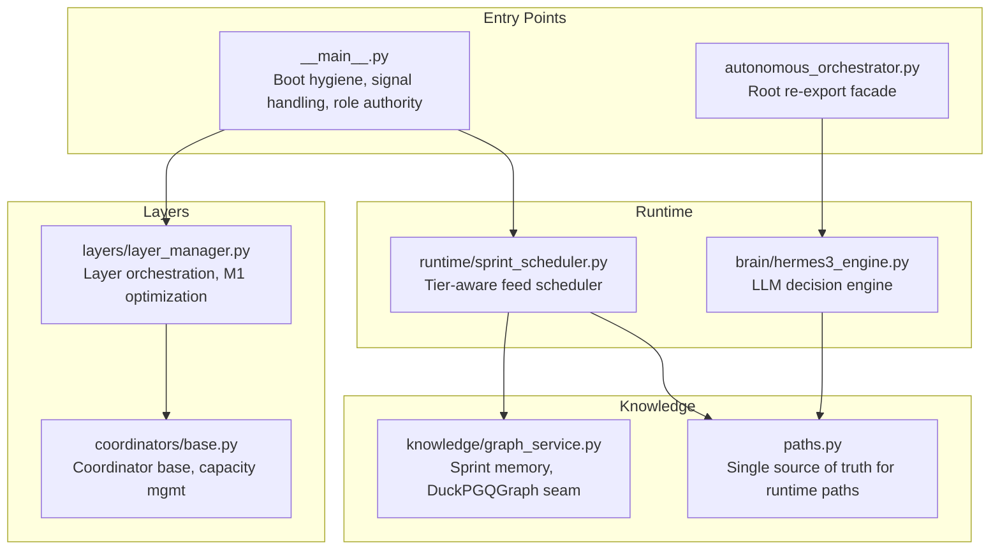
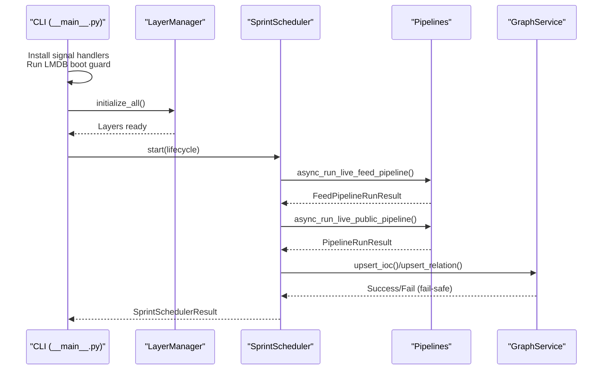
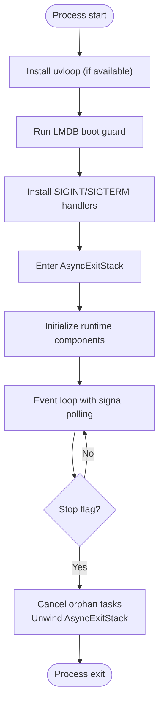
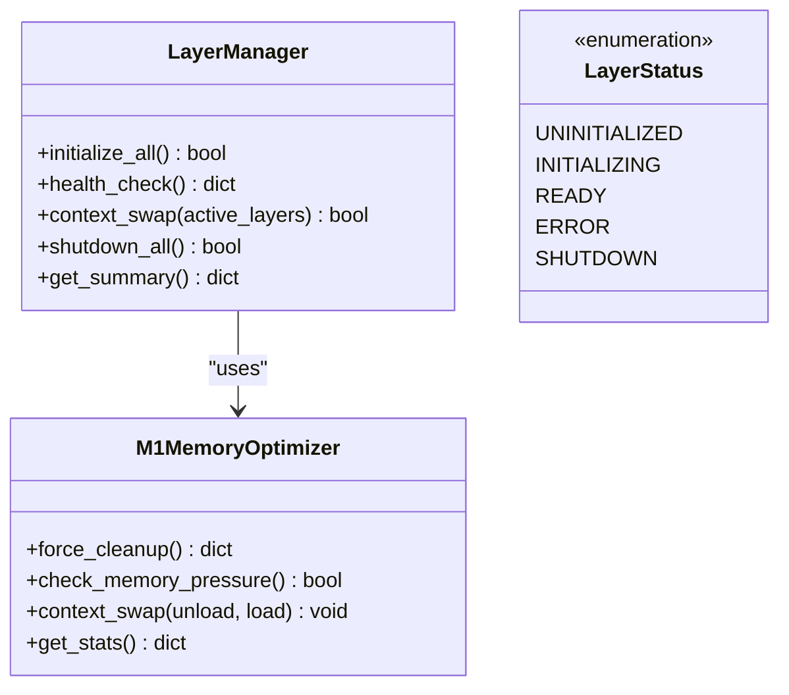
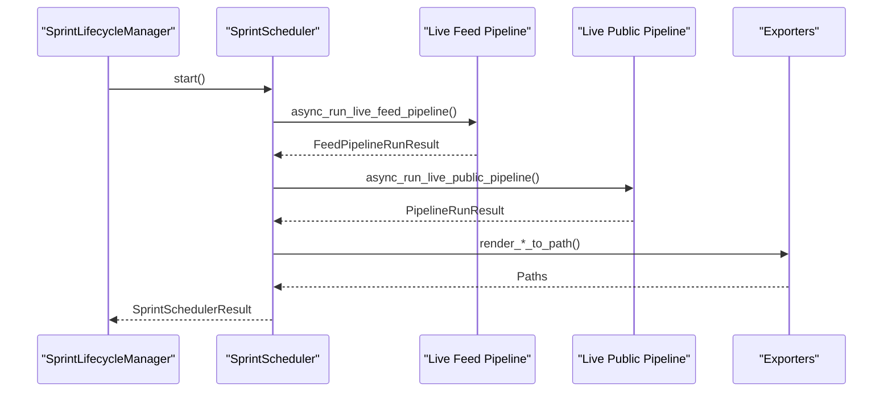
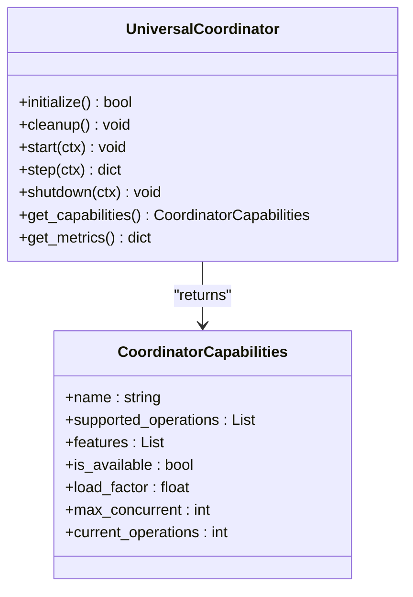
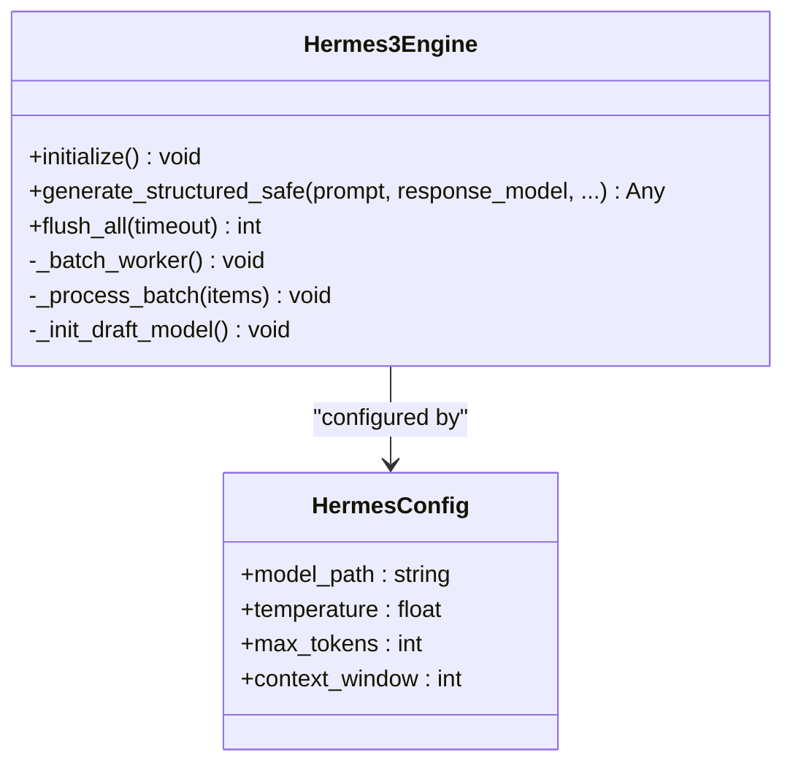
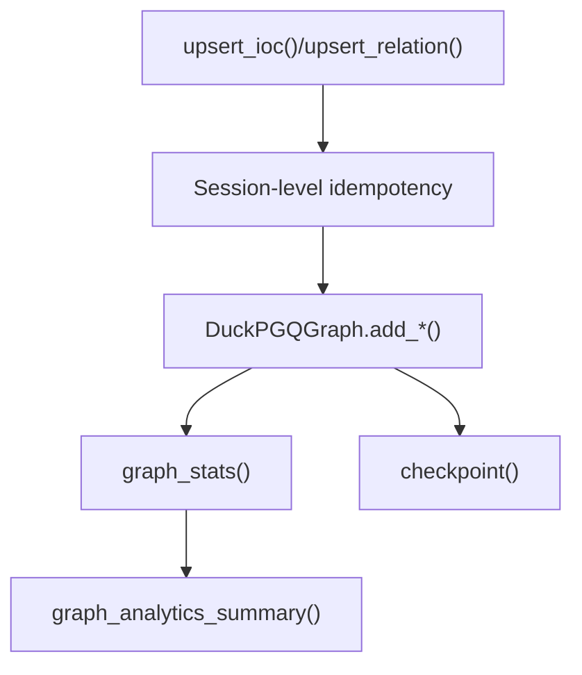
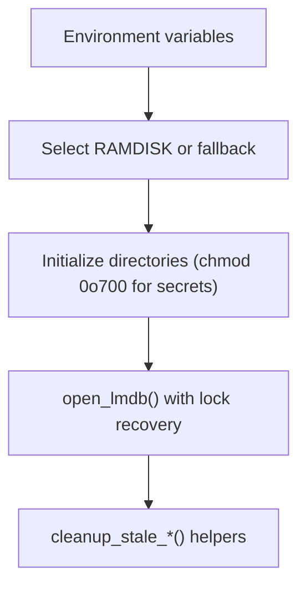
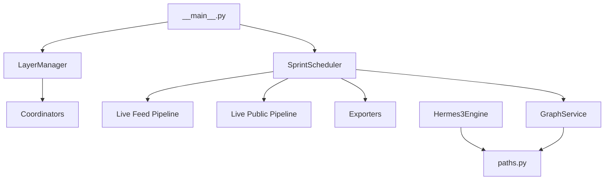

# Core Architecture

<cite>
**Referenced Files in This Document**
- [__main__.py](file://__main__.py)
- [autonomous_orchestrator.py](file://autonomous_orchestrator.py)
- [config.py](file://config.py)
- [layer_manager.py](file://layers/layer_manager.py)
- [sprint_scheduler.py](file://runtime/sprint_scheduler.py)
- [base.py](file://coordinators/base.py)
- [hermes3_engine.py](file://brain/hermes3_engine.py)
- [graph_service.py](file://knowledge/graph_service.py)
- [paths.py](file://paths.py)
- [requirements.txt](file://requirements.txt)
</cite>

## Table of Contents
1. [Introduction](#introduction)
2. [Project Structure](#project-structure)
3. [Core Components](#core-components)
4. [Architecture Overview](#architecture-overview)
5. [Detailed Component Analysis](#detailed-component-analysis)
6. [Dependency Analysis](#dependency-analysis)
7. [Performance Considerations](#performance-considerations)
8. [Troubleshooting Guide](#troubleshooting-guide)
9. [Conclusion](#conclusion)
10. [Appendices](#appendices)

## Introduction
This document describes the core system architecture of Hledac Universal, focusing on the high-level design, architectural patterns, system boundaries, component interactions, data flows, and integration patterns. It explains technical decisions, trade-offs, constraints, infrastructure requirements, scalability considerations, deployment topology, cross-cutting concerns (security, monitoring, disaster recovery), and the technology stack with third-party dependencies and version compatibility.

## Project Structure
Hledac Universal is organized as a modular, layered system with clear separation of concerns:
- Entry points and boot hygiene
- Layer orchestration (Ghost, Memory, Security, Stealth, Research, Privacy, Coordination, Communication, Content)
- Runtime schedulers and lifecycle management
- AI/ML engines and knowledge services
- Transport and pipeline layers
- Configuration and path management

**Diagram sources**
- [__main__.py:1-200](file://__main__.py#L1-L200)
- [autonomous_orchestrator.py:1-120](file://autonomous_orchestrator.py#L1-L120)
- [layer_manager.py:1-200](file://layers/layer_manager.py#L1-L200)
- [sprint_scheduler.py:568-730](file://runtime/sprint_scheduler.py#L568-L730)
- [base.py:88-175](file://coordinators/base.py#L88-L175)
- [hermes3_engine.py:97-175](file://brain/hermes3_engine.py#L97-L175)
- [graph_service.py:1-80](file://knowledge/graph_service.py#L1-L80)
- [paths.py:1-120](file://paths.py#L1-L120)

**Section sources**
- [__main__.py:1-200](file://__main__.py#L1-L200)
- [layer_manager.py:1-200](file://layers/layer_manager.py#L1-L200)
- [sprint_scheduler.py:568-730](file://runtime/sprint_scheduler.py#L568-L730)
- [paths.py:1-120](file://paths.py#L1-L120)

## Core Components
- Entry point and boot hygiene: Initializes event loop, installs signal handlers, runs LMDB boot guard, and orchestrates runtime lifecycle.
- Layer Manager: Centralized orchestration of modular layers with M1 memory optimization, health monitoring, and graceful shutdown.
- Sprint Scheduler: Tier-aware feed scheduler operating under lifecycle constraints, coordinating public and feed pipelines.
- Coordinator Base: Standardized coordinator interface with operation lifecycle, load factor, memory pressure awareness, and metrics.
- Hermes3 Engine: Canonical LLM decision-making engine with structured generation, batching, and memory governance.
- Graph Service: Cross-sprint entity memory backed by DuckPGQGraph, acting as a seam between IOCGraph and analytics.
- Paths: Single source of truth for runtime paths, boot hygiene, and environment-driven configuration.

**Section sources**
- [__main__.py:346-499](file://__main__.py#L346-L499)
- [layer_manager.py:163-256](file://layers/layer_manager.py#L163-L256)
- [sprint_scheduler.py:568-730](file://runtime/sprint_scheduler.py#L568-L730)
- [base.py:88-175](file://coordinators/base.py#L88-L175)
- [hermes3_engine.py:97-175](file://brain/hermes3_engine.py#L97-L175)
- [graph_service.py:1-80](file://knowledge/graph_service.py#L1-L80)
- [paths.py:1-120](file://paths.py#L1-L120)

## Architecture Overview
Hledac Universal follows a layered, event-driven architecture with:
- Canonical ownership: core.__main__.run_sprint is the sole canonical sprint owner; runtime components execute work dispatched by the owner.
- Layered orchestration: Modular layers (Ghost, Memory, Security, Stealth, Research, Privacy, Coordination, Communication, Content) managed by LayerManager with M1 optimization.
- Runtime scheduling: SprintScheduler coordinates bounded, tier-aware feed and public pipelines under lifecycle constraints.
- AI/ML integration: Hermes3Engine provides LLM-based decision making with structured generation and memory governance.
- Knowledge persistence: GraphService integrates DuckPGQGraph for cross-sprint entity memory and analytics.

**Diagram sources**
- [__main__.py:346-499](file://__main__.py#L346-L499)
- [layer_manager.py:336-401](file://layers/layer_manager.py#L336-L401)
- [sprint_scheduler.py:476-493](file://runtime/sprint_scheduler.py#L476-L493)
- [graph_service.py:45-104](file://knowledge/graph_service.py#L45-L104)

## Detailed Component Analysis

### Entry Point and Boot Hygiene
- Installs signal handlers for graceful teardown.
- Runs LMDB boot guard synchronously before async runtime.
- Uses AsyncExitStack for unified teardown and orphan task cancellation.
- Provides role authority and diagnostics for entrypoint roles.

**Diagram sources**
- [__main__.py:315-499](file://__main__.py#L315-L499)

**Section sources**
- [__main__.py:315-499](file://__main__.py#L315-L499)

### Layer Manager and M1 Optimization
- Centralized initialization order and health monitoring.
- M1MemoryOptimizer: aggressive GC, MLX cache clearing, memory pressure checks, and context swapping.
- Singleton GhostDirector sharing to reduce RAM usage on M1 8GB.

**Diagram sources**
- [layer_manager.py:163-256](file://layers/layer_manager.py#L163-L256)
- [layer_manager.py:37-141](file://layers/layer_manager.py#L37-L141)

**Section sources**
- [layer_manager.py:163-256](file://layers/layer_manager.py#L163-L256)
- [layer_manager.py:37-141](file://layers/layer_manager.py#L37-L141)

### Sprint Scheduler and Lifecycle
- Tier-aware scheduling (surface, structured TI, deep, archive, other).
- Bounded 30-minute sprints with wind-down and export guarantees.
- Lazy imports for pipelines and exporters to minimize cold-start costs.
- Cross-sprint dedup via LMDB and persistent state for enrichments.

**Diagram sources**
- [sprint_scheduler.py:476-514](file://runtime/sprint_scheduler.py#L476-L514)
- [sprint_scheduler.py:568-730](file://runtime/sprint_scheduler.py#L568-L730)

**Section sources**
- [sprint_scheduler.py:246-298](file://runtime/sprint_scheduler.py#L246-L298)
- [sprint_scheduler.py:568-730](file://runtime/sprint_scheduler.py#L568-L730)

### Coordinator Base and Capacity Management
- Standardized coordinator interface with operation lifecycle, load factor calculation, memory pressure awareness, and metrics.
- Graceful degradation and partial initialization support.
- Stable spine pattern enabling orchestrator to delegate to coordinators.

**Diagram sources**
- [base.py:88-175](file://coordinators/base.py#L88-L175)
- [base.py:69-78](file://coordinators/base.py#L69-L78)

**Section sources**
- [base.py:88-175](file://coordinators/base.py#L88-L175)
- [base.py:333-377](file://coordinators/base.py#L333-L377)

### Hermes3 Engine and Structured Generation
- Canonical LLM decision-making engine with ChatML formatting and structured generation.
- Batching with schema-aware segregation, adaptive flush intervals, and emergency safeguards.
- Memory governance with MLX cache, KV cache, and draft model speculation.

**Diagram sources**
- [hermes3_engine.py:97-175](file://brain/hermes3_engine.py#L97-L175)
- [hermes3_engine.py:75-82](file://brain/hermes3_engine.py#L75-L82)

**Section sources**
- [hermes3_engine.py:97-175](file://brain/hermes3_engine.py#L97-L175)
- [hermes3_engine.py:215-256](file://brain/hermes3_engine.py#L215-L256)
- [hermes3_engine.py:669-728](file://brain/hermes3_engine.py#L669-L728)

### Graph Service and Cross-Sprint Memory
- DuckPGQGraph-backed cross-sprint entity memory with idempotent upserts and session-level deduplication.
- Analytics summary and checkpointing for durability.
- Seam between IOCGraph and analytics for path queries.

**Diagram sources**
- [graph_service.py:45-104](file://knowledge/graph_service.py#L45-L104)
- [graph_service.py:129-150](file://knowledge/graph_service.py#L129-L150)
- [graph_service.py:194-252](file://knowledge/graph_service.py#L194-L252)

**Section sources**
- [graph_service.py:1-80](file://knowledge/graph_service.py#L1-L80)
- [graph_service.py:129-150](file://knowledge/graph_service.py#L129-L150)
- [graph_service.py:194-252](file://knowledge/graph_service.py#L194-L252)

### Paths and Boot Hygiene
- Single source of truth for runtime paths with deterministic fallbacks and OPSEC warnings.
- Boot hygiene helpers for stale locks and sockets.
- Environment-driven LMDB sizing and safe LMDB open with lock recovery.

**Diagram sources**
- [paths.py:111-141](file://paths.py#L111-L141)
- [paths.py:202-251](file://paths.py#L202-L251)
- [paths.py:435-477](file://paths.py#L435-L477)

**Section sources**
- [paths.py:111-141](file://paths.py#L111-L141)
- [paths.py:202-251](file://paths.py#L202-L251)
- [paths.py:435-477](file://paths.py#L435-L477)

## Dependency Analysis
Hledac Universal employs several architectural patterns:
- Canonical ownership: core.__main__.run_sprint is the sole owner; runtime components execute work.
- Layered architecture: Modular layers orchestrated by LayerManager.
- Coordinator pattern: Standardized interfaces for specialized subsystems.
- Lazy initialization and seams: Pipelines and exporters imported lazily to reduce cold-start costs.
- Event-driven runtime: AsyncExitStack, signal handlers, and lifecycle adapters.

**Diagram sources**
- [__main__.py:346-499](file://__main__.py#L346-L499)
- [layer_manager.py:336-401](file://layers/layer_manager.py#L336-L401)
- [sprint_scheduler.py:476-514](file://runtime/sprint_scheduler.py#L476-L514)
- [hermes3_engine.py:669-728](file://brain/hermes3_engine.py#L669-L728)
- [graph_service.py:33-42](file://knowledge/graph_service.py#L33-L42)

**Section sources**
- [__main__.py:346-499](file://__main__.py#L346-L499)
- [layer_manager.py:336-401](file://layers/layer_manager.py#L336-L401)
- [sprint_scheduler.py:476-514](file://runtime/sprint_scheduler.py#L476-L514)

## Performance Considerations
- M1 8GB optimization: Context swapping, aggressive GC, MLX cache clearing, and memory pressure-aware capacity management.
- Batching and adaptive flush intervals: Reduce inference overhead and improve throughput.
- Lazy imports and seams: Minimize cold-start costs and memory footprint.
- Circuit breakers and timeouts: Protect upstream dependencies and maintain responsiveness.
- Structured generation: Enables deterministic, efficient LLM outputs with grammar constraints.

[No sources needed since this section provides general guidance]

## Troubleshooting Guide
- Boot hygiene failures: Verify LMDB lock recovery and stale socket cleanup.
- Signal handling: Confirm signal handlers are installed and loop stops gracefully.
- Memory pressure: Monitor load factor and use LayerManager’s memory optimizer.
- Pipeline errors: Check discovery and fetch error paths; emergency aborts on UMA critical state.
- Export failures: Validate export paths and permissions.

**Section sources**
- [paths.py:435-477](file://paths.py#L435-L477)
- [__main__.py:315-344](file://__main__.py#L315-L344)
- [layer_manager.py:384-400](file://layers/layer_manager.py#L384-L400)
- [sprint_scheduler.py:732-800](file://runtime/sprint_scheduler.py#L732-L800)

## Conclusion
Hledac Universal implements a robust, layered, and event-driven architecture with canonical ownership, M1 memory optimization, and resilient runtime scheduling. Its modular design, standardized coordinator interfaces, and cross-cutting concerns (security, monitoring, disaster recovery) provide a scalable foundation for OSINT research and discovery workflows.

[No sources needed since this section summarizes without analyzing specific files]

## Appendices

### Technology Stack and Dependencies
- Core: Python 3.10+, asyncio, uvloop (optional), psutil
- Networking: aiohttp, httpx, curl_cffi, stem, dnspython
- Vector search and memory: lancedb, psutil
- DuckDB: duckdb-store, DuckPGQGraph seam
- Serialization: orjson
- Optional: torch/torchvision (Apple Silicon MPS)

**Section sources**
- [requirements.txt:1-32](file://requirements.txt#L1-L32)

### Infrastructure Requirements and Deployment Topology
- RAM disk or fallback directory for runtime artifacts; environment-driven configuration for paths and sizes.
- Optional: Tor/I2P/Nym transports for privacy; DNS-over-HTTPS for privacy.
- Containerization: Stateless runtime with persistent directories mounted for evidence, reports, and caches.

[No sources needed since this section provides general guidance]

### Security, Monitoring, and Disaster Recovery
- Security: PII sanitization, encryption, secure destruction, stealth browsing, and obfuscation layers.
- Monitoring: Boot telemetry, runtime status snapshots, coordinator metrics, and UMA sampling.
- Disaster recovery: Boot guard with stale lock cleanup, fallback artifact cleanup, and fail-safe graph operations.

**Section sources**
- [__main__.py:214-233](file://__main__.py#L214-L233)
- [__main__.py:278-296](file://__main__.py#L278-L296)
- [paths.py:382-428](file://paths.py#L382-L428)
- [graph_service.py:141-150](file://knowledge/graph_service.py#L141-L150)